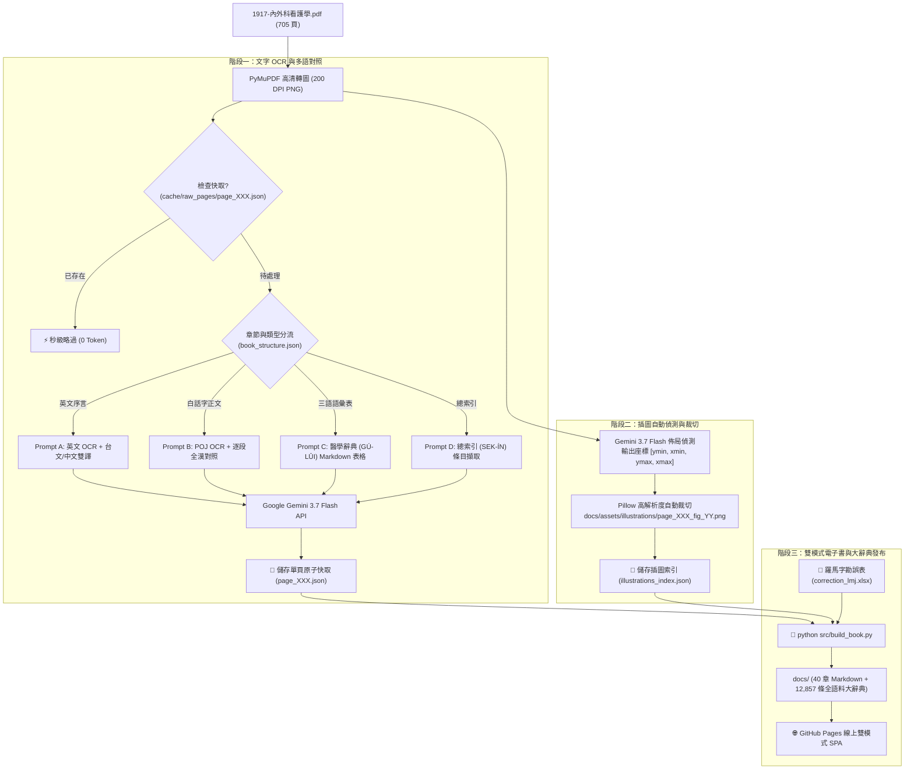

# 1917《內外科看護學》AI OCR 數位典藏、全漢對照與圖文電子書 ＆ 醫學台語辭典全書指南

> **典籍名稱**：1917《內外科看護學》（*The Principles and Practice of Nursing* / *Lāi Gōa Kho Khàn-hō͘-ha̍k*，全書共 705 頁）  
> **著者**：**戴仁壽 醫師** (Dr. George Gushue-Taylor, F.R.C.S., 1883–1954，加拿大宣教醫師、新樓醫院與馬偕醫院院長、八里樂山園創辦人)  
> **合編者**：陳大鑼 先生 (Tân Tāi-lô)  
> **序言題辭**：甘為霖 牧師 (Rev. William Campbell)、蘭大衛 醫師 (Dr. David Landsborough)  
> **歷史地位**：1917 年出版，為台灣醫學史與台語白話字（Pe̍h-ōe-jī）文獻史上第一部現代護理學與臨床醫學巨著。  
> **數位典藏建置**：2026 年 @Tō͘ Sìn-liông（最後更新：2026-09-03）  
> **專案成果**：全書 705 頁高精度文字 OCR、台漢逐段對照、475 張原書解剖插圖自動擷取嵌入、2,625 條台英漢三語辭典、總索引數位化，發布為 **GitHub Pages 雙模式（電子書 📖 ⇋ 醫學辭典 📚）現代化 Web 站點**。

---

## 🌐 線上站點與專案庫
- **線上閱讀與辭典檢索**：[https://sinliongtoo.github.io/laigoakho_Tejinsiu_ebook/](https://sinliongtoo.github.io/laigoakho_Tejinsiu_ebook/)
- **GitHub 專案庫**：[https://github.com/SinLiongToo/laigoakho_Tejinsiu_ebook](https://github.com/SinLiongToo/laigoakho_Tejinsiu_ebook)

---

## 📑 目錄
- [1. 雙模式（電子書 📖 ⇋ 醫學辭典 📚）核心特色](#1-雙模式電子書--⇋-醫學辭典--核心特色)
- [2. 系統架構與運作流程 (How the Flow Works)](#2-系統架構與運作流程-how-the-flow-works)
- [3. 醫學台語三語辭典系統 (Medical Dictionary SPA)](#3-醫學台語三語辭典系統-medical-dictionary-spa)
- [4. 關鍵技術突破與模型評測 (Model Benchmark)](#4-關鍵技術突破與模型評測-model-benchmark)
- [5. 插圖自動偵測與裁切流水線 (Illustration Extraction)](#5-插圖自動偵測與裁切流水線-illustration-extraction)
- [6. 目錄與檔案結構](#6-目錄與檔案結構)
- [7. 操作手冊與指令指南 (CLI Guide)](#7-操作手冊與指令指南-cli-guide)
- [8. 零中斷與斷點續跑機制 (Fault Tolerance)](#8-零中斷與斷點續跑機制-fault-tolerance)
- [9. 前端 UI 與典藏排版架構 (UI Architecture)](#9-前端-ui-與典藏排版架構-ui-architecture)
- [10. 通用數位典藏 Agent Skill 規範 (Reusable Skill)](#10-通用數位典藏-agent-skill-規範-reusable-skill)

---

## 1. 雙模式（電子書 📖 ⇋ 醫學辭典 📚）核心特色

本專案引進與《七字仔字典》相同的前端雙重視角切換架構，讀者可隨時透過右上角的模式標籤自由切換：

1. **📖 電子書閱讀模式 (eBook Mode)**：
   - 完整收錄 705 頁全書 40 章正文、英文序言與凡例。
   - 高精度台語白話字（POJ）與台語全漢字逐段並列對照。
   - 475 張原書醫學解剖與器械插圖自動高解析度嵌入。
   - 左側 360px 可折疊目錄與一鍵全部展開／收合。
   - 支援即時全文搜尋與主文關鍵字反白高亮。
2. **📚 醫學台語辭典模式 (Medical Dictionary Mode)**：
   - **收錄 2,625 條醫學詞條**：1,019 條《三語語彙 (GÚ-LŪI)》+ 1,606 條《總索引 (SEK-ÍN)》。
   - **四向即時篩選**：支援台語漢字、白話字 POJ、去調號模糊搜尋、英文醫學術語與頁碼。
   - **字母快速跳轉列**：`ALL`, `A`, `B`, `CH`, `CHH`, `E`, `G`, `H`, `I`, `J`, `K`, `KH`, `L`, `M`, `N`, `NG`, `O`, `O͘`, `P`, `PH`, `S`, `T`, `TH`, `U`。
   - **雙向跳轉閱讀**：點擊卡片「📖 閱讀原書第 X 頁」，系統會自動切換至電子書模式並直達該頁章節。
   - **內嵌雙語使用手冊**：提供 **🇹🇼 全漢版** 與 **📜 全羅 POJ 白話字版** 專屬說明書。

---

## 2. 系統架構與運作流程 (How the Flow Works)



---

## 3. 全語料醫學台語大辭典系統 (Medical Dictionary SPA)

### 3.1 辭典資料庫組成 (12,857 條詞目)
| 資料維度 | 詞條分類 | 收錄數量 | 說明與範例 |
| :--- | :--- | :--- | :--- |
| **音節長度維度** | **一字詞 (單音節)** | **3,715 條** | 單音節高頻字詞（如 `kut` 骨、`sim` 心、`huih` 血、`bah` 肉、`io̍h` 藥） |
| | **二字詞 (雙音節)** | **5,116 條** | 臨床醫學與日常雙字詞（如 `pīⁿ-lâng` 病人、`kái-phò͘` 解剖、`khàn-hō͘` 看護、`mûi-to̍k` 梅毒） |
| | **三字詞 (三音節)** | **2,619 條** | 三音節學術詞彙（如 `kái-phò͘-ha̍k` 解剖學、`chù-siā-chiam` 注射針、`chio̍h-thòaⁿ-sng` 石炭酸） |
| | **四字詞 (四音節)** | **896 條** | 複合醫學術語（如 `chù-siā-liāu-hoat` 注射療法、`cháp-jī-chí-tn̂g` 十二指腸） |
| **附錄對照維度** | **三語辭彙 (GÚ-LŪI)** | **1,468 條** | 原書附錄一：台羅 POJ ↔ 台語漢字 ↔ 英文醫學名詞三語對照與臨床備註 |
| | **總索引 (SEK-ÍN)** | **2,053 條** | 原書附錄二：全書 40 章臨床解剖與技術名詞之精確對應頁碼索引 |

### 3.2 📝 羅馬字動態勘誤引擎 (`correction_lmj.xlsx`)
歷史文獻經 OCR 辨識時，常因印刷墨漬產生變異（如同一詞「梅毒」出現 `mû-to̍k`、`Múi-tók`、`mûi-tòk` 等情況）：
- **外部勘誤表**：根目錄 `correction_lmj.xlsx` 持續維護 `漢字 ⇋ 羅馬字`（如 `梅毒 ⇋ mûi-to̍k`）。
- **全自動校準與合併**：建置時自動校正電子書正文，並將辭典中所有拼寫變體自動合併至標準條目下（累計全書頻率與出處頁碼）。

### 3.3 0 毫秒同步載入架構 (Inline Data Engine)
為徹底杜絕跨網域請求延遲與瀏覽器安全性阻擋，建置腳本直接將 12,857 筆結構化資料內嵌於 `<script id="dict-data" type="application/json">`，在任何網路環境或本機離線環境下均能瞬間載入。

---

## 4. 關鍵技術突破與模型評測 (Model Benchmark)

| 評測維度 | **Gemini 2.5 Flash** (舊版) | **Gemini 3.7 Flash** (本次採用) | **Claude 3.7 Sonnet** (可選用) |
| :--- | :--- | :--- | :--- |
| **POJ 聲調與點號辨識** | 🟡 偶爾漏失右上點號（`o͘`）或混淆陽入聲（`a̍`）與陽平（`ā`） | 🟢 **極高精確度**，能清晰辨識百年泛黃古籍之 `o͘`、`ⁿ` 與連字號 | 🟢 極高精確度，但有時會過度將古字拼寫標準化/現代化 |
| **台語全漢對照翻譯** | 🟡 部份台語語境較生硬，偶帶現代普通話語感 | 🟢 **非常道地文雅**（如精準對譯「備辦」、「向望」、「無彩工」、「寄附」） | 🟢 文學性與長句邏輯極佳，擅長古典英文題辭之精緻翻譯 |
| **全書 705 頁總花費** | 約 $0.25 USD (~NT$ 8 元) | **約 $0.40 USD (~NT$ 13 元)** | 約 $25.00 ～ $30.00 USD (~NT$ 800～950 元) |
| **API 頻率與穩定度** | 良好 | **極佳（Tier 1 RPM 達 1,000，全程零中斷）** | 圖片輸入受 Rate Limit 限制較嚴格 |
| **定位與最佳角色** | 舊世代基準 | 🏆 **全書大規模高吞吐 OCR、圖文辨識與對照之唯一首選** | 適合用於重要章節的二階段純文字「終審校對與學術註解」 |

---

## 5. 插圖自動偵測與裁切流水線 (Illustration Extraction)

全書共收錄 475 張醫學插圖（解剖圖、手術器具、包紮敷料法）：
1. **正規化座標偵測**：AI 模型輸出 `[ymin, xmin, ymax, xmax]` 邊界框與圖題。
2. **像素換算與緩衝區**：以 200 DPI 高解析度渲染圖精準裁切並保留 0.5% Padding。
3. **無縫嵌入**：在章節 Markdown 中以標準 HTML/Markdown 語法在相應頁碼處自動嵌入。

---

## 6. 目錄與檔案結構

```text
Laigoakho_Tennjinsiu_OCR_MD/
├── .github/
│   └── workflows/
│       └── deploy.yml            # GitHub Pages 自動部署 Actions 工作流
├── config/
│   └── book_structure.json       # 705 頁全書篇章結構與頁碼對照定義檔
├── correction_lmj.xlsx           # 羅馬字動態勘誤對照表 (漢字 ⇋ 羅馬字)
├── docs/                         # GitHub Pages 發布目錄 / Web SPA 根目錄
│   ├── index.html                # 雙模式（電子書 📖 ⇋ 醫學辭典 📚）SPA 引擎
│   ├── _coverpage.md             # 電子書封面
│   ├── _sidebar.md               # 側邊欄可折疊章節目錄
│   ├── README.md                 # 電子書首頁導讀
│   ├── assets/
│   │   ├── dictionary_data.js    # 12,857 條全語料大辭典資料集
│   │   ├── fonts/                # 芫荽體與典藏字型
│   │   └── illustrations/        # 475 張原書裁切插圖
│   ├── 00_front_matter/          # 英文序言、白話字頭序、目錄凡例
│   ├── 01_volume_1_anatomy/      # 第一篇 解剖學及生理學 (10 章)
│   ├── 02_volume_2_nursing/      # 第二篇 普通看護學 (11 章)
│   ├── 03_volume_3_surgery/      # 第三篇 外科看護學 (10 章)
│   ├── 04_volume_4_medicine/     # 第四篇 內科看護學 (9 章)
│   ├── 05_glossary/              # 附錄一：醫學三語辭彙表 (GÚ-LŪI)
│   └── 06_index/                 # 附錄二：總索引目錄 (SEK-ÍN)
├── skills/
│   └── digital_archive_ebook_ui/ # 通用數位典藏電子書 UI 與辭典架構 Skill
├── src/
│   ├── build_book.py             # 全書章節聚合、勘誤校正、辭典編譯與 HTML 生成程式
│   ├── extract_illustrations.py  # AI 插圖偵測與裁切管線
│   ├── ocr_pipeline.py           # Gemini 3.7 Flash OCR 與對照流水線
│   └── prompt_templates.py       # 多語 OCR 與對照 Prompt 模板
├── AGENTS.md                     # Agent 開發與品質維護規範
└── README.md                     # 本指南文件
```

---

## 7. 操作手冊與指令指南 (CLI Guide)

### 7.1 全書重新聚合與站點生成
```powershell
python src/build_book.py
```
執行後將自動：
- 聚合 46 個章節 Markdown 文件。
- 自動嵌入 475 張插圖。
- 執行 Unicode NFC 與全形標點符號正規化。
- 編譯 2,625 條醫學三語辭典資料庫。
- 生成包含雙模式切換與雙語手冊之 `docs/index.html`。

### 7.2 本機預覽測試
```powershell
python -m http.server --directory docs 3000
```
開啟瀏覽器連線至 `http://localhost:3000` 即可進行本地端流暢預覽與測試。

---

## 8. 零中斷與斷點續跑機制 (Fault Tolerance)

- **原子快取**：單頁快取檔案 `cache/raw_pages/page_XXX.json`，任何網路斷線或 API 偶發錯誤均不影響已完成頁面。
- **冪等重跑**：重新執行流水線時將自動秒級略過已快取頁面，0 Token 浪費。

---

## 9. 前端 UI 與典藏排版架構 (UI Architecture)

- **字型棧 (Typography)**：`Iansui` 芫荽體 + `POJ-Fallback` 羅馬字音標防護 + `HanaMin` / `Noto Serif TC` 罕見 Ext-B/C 台語漢字支援。
- **Unicode NFC 防破音標**：徹底解決 iOS Safari / WebKit 上的分離調號問號豆腐塊與浮動圓圈。
- **高對比深色模式**：午夜藍黑漸層背景 + 純白標題 + 斑馬紋表格 + 高亮青色按鈕。
- **獨立懸浮搜尋面板**：搜尋結果不破壞側邊欄樹狀結構，搭配 `mark.js` 主畫面關鍵字反白高亮。

---

## 10. 通用數位典藏 Agent Skill 規範 (Reusable Skill)

本專案將 Web 電子書閱讀體驗與辭典檢索引擎封裝為通用 Skill：[`skills/digital_archive_ebook_ui/SKILL.md`](skills/digital_archive_ebook_ui/SKILL.md)，任何古籍文獻、雙語對照或圖文教科書專案皆可無縫套用本架構。
