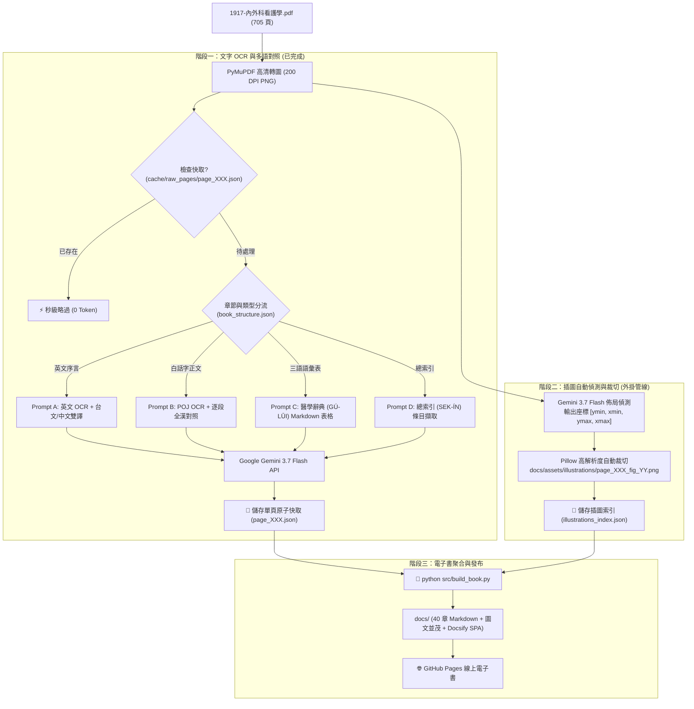
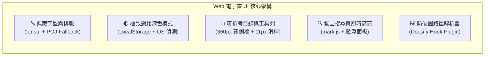

# 1917《內外科看護學》AI OCR 數位典藏、全漢對照與圖文電子書建置全書指南

> **典籍名稱**：1917《內外科看護學》（*The Principles and Practice of Nursing* / *Lāi Gōa Kho Khàn-hō͘-ha̍k*，全書共 705 頁）  
> **著者**：**戴仁壽 醫師** (Dr. George Gushue-Taylor, F.R.C.S., 1883–1954，加拿大宣教醫師、新樓醫院與馬偕醫院院長、八里樂山園創辦人)  
> **合編者**：陳大鑼 先生 (Tân Tāi-lô)  
> **序言題辭**：甘為霖 牧師 (Rev. William Campbell)、蘭大衛 醫師 (Dr. David Landsborough)  
> **歷史地位**：1917 年出版，為台灣醫學史與台語白話字（Pe̍h-ōe-jī）文獻史上第一部現代護理學與臨床醫學巨著。  
> **數位典藏建置**：2026 年 @Tō͘ Sìn-liông（最後更新：2026-09-03）  
> **專案成果**：全書 705 頁高精度文字 OCR、台漢逐段對照、475 張原書解剖插圖自動擷取嵌入、三語辭典、總索引數位化，並發布為 **GitHub Pages 現代化 Web 電子書**。

---

## 📑 目錄
- [1. 系統架構與運作流程 (How the Flow Works)](#1-系統架構與運作流程-how-the-flow-works)
- [2. 關鍵技術突破與模型深度評測 (Model Benchmark)](#2-關鍵技術突破與模型深度評測-model-benchmark)
- [3. 插圖自動偵測與裁切流水線 (Illustration Extraction)](#3-插圖自動偵測與裁切流水線-illustration-extraction)
- [4. 目錄與檔案結構](#4-目錄與檔案結構)
- [5. 操作手冊與指令指南 (CLI Guide)](#5-操作手冊與指令指南-cli-guide)
- [6. 零中斷與斷點續跑機制 (Fault Tolerance)](#6-零中斷與斷點續跑機制-fault-tolerance)
- [7. API 計費與成本分析](#7-api-計費與成本分析)
- [8. GitHub Pages 線上部署教學](#8-github-pages-線上部署教學)
- [9. 將本專案轉化為通用數位典藏 Agent Skill (Reusable Skill Blueprint)](#9-將本專案轉化為通用數位典藏-agent-skill-reusable-skill-blueprint)

---

## 1. 系統架構與運作流程 (How the Flow Works)



---

## 2. 關鍵技術突破與模型深度評測 (Model Benchmark)

本專案經過 2025～2026 年多個世代的模型實戰對比，以下為 **Gemini 2.5 Flash**、**Gemini 3.7 Flash** 與 **Claude 3.7 Sonnet** 針對「百年台語白話字文獻數位化」的深度評測：

| 評測維度 | **Gemini 2.5 Flash** (三個月前舊版) | **Gemini 3.7 Flash** (本次採用) | **Claude 3.7 Sonnet** (可選用) |
| :--- | :--- | :--- | :--- |
| **POJ 聲調與點號辨識** | 🟡 偶爾漏失右上點號（`o͘`）或混淆陽入聲（`a̍`）與陽平（`ā`） | 🟢 **極高精確度**，能清晰辨識百年泛黃古籍之 `o͘`、`ⁿ` 與連字號 | 🟢 極高精確度，但有時會過度將古字拼寫標準化/現代化 |
| **台語全漢對照翻譯** | 🟡 部份台語語境較生硬，偶帶現代普通話語感 | 🟢 **非常道地文雅**（如精準對譯「備辦」、「向望」、「無彩工」、「寄附」） | 🟢 文學性與長句邏輯極佳，擅長古典英文題辭之精緻翻譯 |
| **全書 705 頁總花費** | 約 $0.25 USD (~NT$ 8 元) | **約 $0.40 USD (~NT$ 13 元)** | 約 $25.00 ～ $30.00 USD (~NT$ 800～950 元) |
| **API 頻率與穩定度** | 良好 | **極佳（Tier 1 RPM 達 1,000，全程零中斷）** | 圖片輸入受 Rate Limit 限制較嚴格 |
| **定位與最佳角色** | 舊世代基準 | 🏆 **全書大規模高吞吐 OCR、圖文辨識與對照之唯一首選** | 適合用於重要章節的二階段純文字「終審校對與學術註解」 |

---

## 3. 插圖自動偵測與裁切流水線 (Illustration Extraction)

原書包含數百張骨骼解剖、肌肉組織、外科手術器具與繃帶纏繞法之珍貴插圖。本系統採用 **AI 視覺邊界框偵測 + Pillow 原生裁切**：

1. **偵測提示詞 (`PROMPT_DETECT_FIGURES`)**：
   要求模型精準標記影像中所有非文字圖表的正規化座標 `[ymin, xmin, ymax, xmax]` 與原始圖題（Caption）。
2. **自動裁切與補償**：
   根據 PDF 200 DPI 渲染圖像的寬高動態換算像素，並自動加入 0.5% 邊界緩衝（Padding），避免切斷圖框。
3. **無損文字疊加**：
   插圖偵測完全獨立運行，**絕不重新執行或覆寫文字翻譯**，並在 `build_book.py` 聚合時自動以標準 HTML `<figure>` 標籤嵌入 Markdown。

---

## 4. 目錄與檔案結構

```text
Laigoakho_Tennjinsiu_OCR_MD/
├── .github/
│   └── workflows/
│       └── deploy.yml            # GitHub Pages 自動部署 Actions 工作流
├── config/
│   └── book_structure.json       # 705 頁全書篇章結構與頁碼對照定義檔
├── docs/                         # GitHub Pages 發布目錄 / 電子書根目錄
│   ├── index.html                # Docsify SPA 電子書引擎 (支援全文檢索與字級縮放)
│   ├── _coverpage.md             # 電子書封面
│   ├── _sidebar.md               # 側邊欄章節目錄
│   ├── README.md                 # 電子書首頁導讀
│   ├── assets/
│   │   └── illustrations/        # 自動裁切之全書醫學插圖 (PNG)
│   ├── 00_front_matter/          # 英文序言題辭 (多語對照)、台文頭序、凡例目錄
│   ├── 01_volume_1_anatomy/      # 第一篇 解剖學及生理學 (Ch 1～10)
│   ├── 02_volume_2_nursing/      # 第二篇 普通看護學 (Ch 11～21)
│   ├── 03_volume_3_surgery/      # 第三篇 外科看護學 (Ch 22～31)
│   ├── 04_volume_4_medicine/     # 第四篇 內科看護學 (Ch 32～40)
│   ├── 05_glossary/              # 三語語彙表 (GÚ-LŪI 結構化辭典表格)
│   └── 06_index/                 # 總索引 (SEK-ÍN 檢索目錄)
├── cache/
│   ├── raw_pages/                # 單頁文字原子快取 (page_001.json ~ page_705.json)
│   ├── illustrations/            # 單頁插圖座標快取 (page_001.json ~ page_705.json)
│   └── illustrations_index.json  # 全書插圖主索引
├── src/
│   ├── core/
│   │   ├── gemini_ocr.py         # Gemini 3.7 Flash API 調用與 Tenacity 重試封裝
│   │   ├── pdf_processor.py      # PyMuPDF 高清轉圖模組 (200 DPI)
│   │   └── prompt_templates.py   # 特化 Prompt 模板 (前言/正文/語彙/索引)
│   ├── run_ocr_pipeline.py       # 文字 OCR 主流水線驅動
│   ├── extract_all_illustrations.py # 全書插圖自動偵測與裁切流水線
│   └── build_book.py             # 快取聚合、插圖自動嵌入與 Docsify 導航生成
├── run_full_process.py           # 一鍵端到端全流程執行腳本
├── calculate_stats.py            # 即時進度、字數統計與 API 成本計算工具
└── README.md                     # 專案完整文檔
```

---

## 5. 快速上手與操作手冊 (Quick Start & CLI Guide)

### ⚙️ 環境安裝與 API Key 設定 (Prerequisites)

若您 **Fork 或 Clone** 本專案欲在本地執行或處理其他古籍文獻：

1. **安裝 Python 依賴套件**：
   ```bash
   pip install google-genai pillow pymupdf tenacity
   ```

2. **設定您的 Gemini API Key (安全環境變數)**：
   本專案遵循最佳安全實踐，絕不硬編碼任何私密金鑰。請透過系統環境變數設定您專屬的 API Key（可至 [Google AI Studio](https://aistudio.google.com/app/apikey) 免費申請）：
   - **Windows (PowerShell)**：
     ```powershell
     $env:GEMINI_API_KEY = "您的_GEMINI_API_KEY"
     ```
   - **Linux / macOS (Bash / Zsh)**：
     ```bash
     export GEMINI_API_KEY="您的_GEMINI_API_KEY"
     ```
   - *(亦可在專案根目錄建立 `.env` 檔案填入 `GEMINI_API_KEY=your_key`，專案已配置 `.gitignore` 自動防護，絕不會被推上 GitHub)*

---

### 🚀 執行指令 (Execution Commands)

#### 📖 情境 A：重新聚合現有電子書 (無需 API Key，完全免費)
若您僅修改了排版樣式、字體或個別章節 Markdown 內容，可直接在本地重新聚合生成：
```bash
python src/build_book.py
```

#### ⚡ 情境 B：執行端到端完整數位典藏流水線 (需設定 API Key)
一鍵執行高清轉圖、Gemini 3.7 Flash 深度視覺辨識、逐段台漢對照、插圖自動偵測裁切與 Docsify 電子書聚合：
```bash
python run_full_process.py
```

#### 🖼️ 獨立執行插圖自動偵測與裁切：
```bash
python src/extract_all_illustrations.py
```

#### 📊 即時查看字數、完成進度與 API 費用統計：
```bash
python calculate_stats.py
```

---

## 6. 零中斷與斷點續跑機制 (Fault Tolerance)

1. **單頁原子快取 (`cache/raw_pages/` & `cache/illustrations/`)**：
   每一頁完成後立即落盤為 JSON。若中途手動關閉或電腦重啟，再次執行會**瞬間略過已完成頁面**，0 重複耗費。
2. **Tenacity 指數退避重試**：
   遭遇網路斷線或 API 429 頻率限制時，自動進行 12 次漸進延遲重試（最高等待 90 秒）。
3. **錯誤自動隔離與批次尾端修復**：
   單頁若遇極端異常，流水線會記錄錯誤至 `error_log.txt` 並繼續往下跑，在全書批次尾段自動啟動二次重試修復。

---

## 7. API 計費與成本分析

- **文字 OCR 與全漢字對照**：全書 705 頁共產出 147 萬字，花費 **$0.4038 USD (約 NT$ 13.1 元)**。
- **插圖偵測與裁切**：全書 705 頁座標偵測，花費 **約 $0.09 USD (約 NT$ 3.0 元)**。
- **整部 705 頁圖文並茂歷史典籍數位化總成本**：**不到新台幣 16.5 元**。

---

## 8. GitHub Pages 線上部署教學

1. **提交並推送程式碼**：
   ```powershell
   git add .
   git commit -m "feat: complete 1917 Lai-goa-kho Tann-jin-siu digitalization"
   git push origin main
   ```
2. **啟用 GitHub Pages**：
   - 開啟 GitHub 倉庫 -> 點選 **Settings** -> **Pages**。
   - **Source** 選擇 **GitHub Actions**（專案已內建 `.github/workflows/deploy.yml`）。
   - 部署完成後，即可在 `https://<使用者名稱>.github.io/<倉庫名稱>/` 在線閱讀！

---

## 9. 將本專案轉化為通用數位典藏 Agent Skill (Reusable Skill Blueprint)

本專案建立的架構可直接作為任何**歷史文獻、多語古籍、圖文教科書數位化**的標準 Agent Skill 藍圖：

### 核心可重用模組：
1. **結構定義引擎 (`config/book_structure.json`)**：以 JSON 定義多篇章映射，杜絕 OCR 碎片化檔名。
2. **多模態特化提示詞模組 (`prompt_templates.py`)**：分離前言多語翻譯、正文嚴格逐段對照、字典表格化等場景。
3. **雙軌分離管線 (Two-Track Pipeline)**：
   - Track 1：專注於文本 OCR 與翻譯快取。
   - Track 2：專注於視覺佈局分析與高解析度插圖裁切。
4. **Docsify 靜態發布模板 (`build_book.py` + `index.html`)**：免編譯、即時渲染 Markdown、內建全文檢索與響應式雙語排版。

---

## 10. 現代化數位典藏電子書 UI 前端架構藍圖 (UI Architecture Blueprint)

本專案將 Web 電子書閱讀體驗模組化封裝為獨立 Agent Skill：[`skills/digital_archive_ebook_ui/SKILL.md`](skills/digital_archive_ebook_ui/SKILL.md)，包含以下五大前端子系統：



### 1. 典藏字型與音標防缺字系統 (Typography & Diacritics)
- **本地內嵌 芫荽體 (`Iansui-Regular.ttf`)**：保證全書台語漢字古典楷書美感與離線支援。
- **iOS / Safari WebKit 渲染防亂碼防護**：
  - **全書 100% Unicode NFC 正規化**：全面將分離聲調（Decomposed Diacritics，如 `E` + `\u0304`）轉為標準單一預組字符（`unicodedata.normalize('NFC')`），徹底根除 iPhone/iPad 上的問號豆腐塊與浮動圓圈。
  - **白話字音標調號防護 (`POJ-Fallback`)**：鎖定 Unicode 區間 `U+0020-007F, U+00A0-024F, U+0300-036F, U+2070-209F`，以實體系統字型相容 WebKit 規範。
- **跨平台字型優先棧**：`'POJ-Fallback', 'Iansui', 'HanaMinA', 'HanaMinB', 'HanaMin', 'Klee One', 'Noto Serif TC', 'PingFang TC', 'Heiti TC', -apple-system, BlinkMacSystemFont, "Segoe UI", Roboto, "Microsoft JhengHei", sans-serif`（全面相容 Windows、macOS、iOS 蘋方與 HanaMin 罕見 Ext-B/C 台語漢字）。

### 2. 極致對比深色模式引擎 (Ultra-High Contrast Dark Mode)
- **雙模式記憶**：LocalStorage 記憶狀態 + 系統 OS `prefers-color-scheme` 智慧感知。
- **全元素超高對比覆寫**：
  - 標題（H1～H6）全面鎖定純白 `#ffffff`，正文、列表、加粗與說明全面升級為 `#f8fafc`。
  - 內文超連結在深色模式下設為明亮天藍／亮青色（`#38bdf8` / `#67e8f9`），杜絕暗藍撞色。
- **封面頁 (Coverpage) 沉浸暗底**：深色模式自動切換為午夜藍黑漸層（`#0b0f19` ➔ `#111827` ➔ `#0f172a`），搭配高亮發光青色按鈕（`#2dd4bf`），杜絕白字撞淺底。
- **表格交錯斑馬紋 (Zebra Striping)**：奇數行 `#0e1726`、偶數行 `#1e293b`、懸停 `#334155`，提供極佳的醫學表格可讀性。

### 3. 可折疊側邊目錄與一鍵控制工具列 (Collapsible Sidebar)
- **目錄寬度擴展至 360px**：啟用 `word-break: break-word`，徹底解決長篇名與音標被邊框截斷。
- **全站 11px 加粗高對比滑桿**：側邊欄、主文章、表格均配備圓角滑桿。
- **一鍵全部展開 / 全部收合 (`#btn-collapse-all`)**：直接切換 DOM `.open` / `.collapse` 狀態類別。

### 4. 智慧即時搜尋與主畫面高亮反白 (Smart Search & In-Content Highlighting)
- **獨立懸浮結果面板 (`.results-panel`)**：搜尋結果與下方章節目錄徹底分離，不破壞目錄樹。
- **主畫面即時關鍵字高亮 (In-Content Highlighting)**：整合 `mark.js`，搜尋或輸入時正文字詞即刻套用黃色/琥珀色反白徽章，點擊自動平滑滾動至目標位置。

### 5. 動態相對路徑圖片解析器 (Bulletproof Image Resolver)
- **Docsify 路由防破圖插件**：在 `hook.afterEach` 攔截所有 Markdown 圖片，將 `assets/illustrations/` 依據 GitHub Pages 站點路徑動態正規化為全域絕對路徑。

