# 第二章 骨系統 (Kut Hē-thóng)

> **所屬篇章**：第一篇 解剖學及生理學 (Kái-phò͘-ha̍k kap Seng-lí-ha̍k)
> **原書頁碼**：第 23 頁 ～ 第 45 頁 (已收錄 23/23 頁)

---

<!-- Page 023 Start -->
#### 📖 原書第 23 頁

### TĒ 2 CHIŪⁿ
### LŪN KUT HĒ-THÓNG
**[Kut-keh ê chok-iōng]**

Tī chia beh kóng-khí kut-keh ê kò͘-chō, kap i ê chok-iōng. Kut-keh ê chok-iōng sī chiàu kì tī ē-tóe :
1. Chòe sin-thé ê ki-chhó͘, hō͘ sin-thé ê cho͘-chit pau-teh.
2. Sī pó-hō͘ sin-thé loán-jio̍k ê só͘-chāi, chhin-chhiūⁿ thâu-kòa-kut teh pó-hō͘ náu, á-sī hia̍p-kut teh pó-hō͘ sim-chōng, hì-chōng.
3. Sī ēng kut sio-chiap lâi chiâⁿ chòe lâng ê hêng-thé, bián-tit hō͘ seng-khu nńg, hō͘ i ōe ūn-tōng.

> **【全漢對照】**
> ### 第 2 章
> ### 論骨系統
> **［骨格的作用］**
> 
> 佇遮欲講起骨格的構造，及伊的作用。骨格的作用是照記佇下底：
> 1. 做身體的基礎，予身體的組織包咧。
> 2. 是保護身體軟弱的所在，親像頭蓋骨咧保護腦，抑是脅骨咧保護心臟、肺臟。
> 3. 是用骨相接來成做人的形態，免得予軀佮軟，予伊會運動。

---

**[Kut-keh]**

Thong seng-khu ê lāi-bīn iok-lio̍k ū 200 gōa ki ê kut. Chiah ê kut-thâu saⁿ-chia̍h-chhēng lâi chòe chi̍t ê kut-keh : Phì-jū chhin-chhiūⁿ kô chóa ê lâng tāi-seng pak chi̍t sian ê kut, āu-lâi ēng chóa kô tī gōa-bīn. Lâng oa̍h ê sî ia̍h sī án-ni ; kut thang sǹg sī chhin-chhiūⁿ chòe kè, i ê gōa-bīn ū phê-hu kap kun-bah í-ki̍p pa̍t hāng ê cho͘-chit lâi pau, khàm chiah ê kut, tùi án-ni chiâⁿ chòe chi̍t ê seng-khu tú-tú ha̍h lâng ê lō͘-ēng.

> **【全漢對照】**
> **［骨格］**
> 
> 通軀佮的內面約略有 200 外枝的骨。諸個骨頭相食稱來做一個骨格：譬喻親像糊紙的人代先縛一尊的骨，後來用紙糊佇外面。人活的時亦是按呢；骨通算是親像做架，伊的外面有皮膚佮筋肉以及別項的組織來包、蓋諸個骨，對按呢成做一個軀佮拄拄合人的路用。

---

**[Kut sī nñg hō ê chit, iú-ki-sêng-hun, bû-ki-sêng-hun]**

Kut sī nñg hō ê chit lâi ha̍p chiâⁿ-ê, chi̍t hō sī iú-ki-sêng-hun (有機成分, organic substance), chi̍t hō sī bû-ki-sêng-hun (無機成分, inorganic substance). Siat-sú kut lâi ngâu kàu thiám, ōe tit-tio̍h hit ê iú-ki-sêng-hun chiū-sī ka. Á-sī kut lok tī hé lâi pû, iú-ki-sêng-hun chiū lóng-chóng sio-khì, só͘ lâu-teh sī hit ê bû-ki-sêng-hun nā-tiāⁿ, chiū-sī chhin-chhiūⁿ he ê khoán-sit. Lâng tī sòe-hàn ê sî, chí nñg hō ê chit sī tùi pòaⁿ, án-ni gín-ná ê kut sī khah nńg, só͘-í nā poa̍h-tó chiū bô tōa siong-hāi. Kàu

> **【全漢對照】**
> **［骨是兩號的質，有機成分、無機成分］**
> 
> 骨是兩號的質來合成的，一號是有機成分（有機成分，organic substance），一號是無機成分（無機成分，inorganic substance）。設使骨來熬到忝，會得著彼個有機成分就是膠。抑是骨落佇火來烰，有機成分就攏總燒去，所留咧是彼個無機成分若定，就是親像灰的款式。人佇細漢的時，此兩號的質是對半，按呢囡仔的骨是較軟，所以若跋倒就無大傷害。到

---

**[頁尾格言]**

Só͘-í tio̍h tû-khì pe̍h-chha̍t, ta̍k lâng kap i ê chhù-piⁿ kóng chìn-si̍t, in-ūi lán saⁿ-kāng chòe thé (Í-hut-só͘ 4: 25).

> **【全漢對照】**
> 所以著除去白賊，逐人佮伊的厝邊講真實，因為咱相同做體（以弗所 4: 25）。

<!-- Page 023 End -->

---

<!-- Page 024 Start -->
#### 📖 原書第 24 頁

  <figure style="display: inline-block; margin: 12px; max-width: 90%; text-align: center;">
    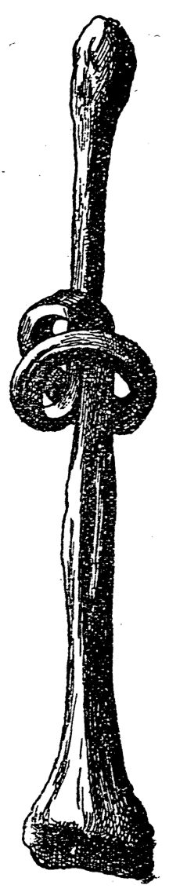
    <figcaption style="font-size: 14px; color: #4a5568; margin-top: 6px;"><em>Tē 3 tô̇.—Ēng kut phah-kat. (Raymond, from Lewis' “Anatomy and Physiology for Nurses,” by permission of W. B. Saunders, Co., publishers.)</em></figcaption>
  </figure>
  <figure style="display: inline-block; margin: 12px; max-width: 90%; text-align: center;">
    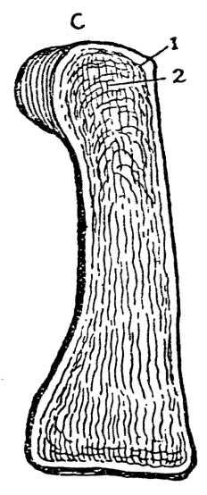
    <figcaption style="font-size: 14px; color: #4a5568; margin-top: 6px;"><em>Tē 4 tô̇. — Tnĝ-kut ê chhiòng-tn̄g-bīn : tuì 1, kàu gōa-bīn pîⁿ sī kian-kò͘-chit ; 2, lāi-bīn hái-mî-chit.</em></figcaption>
  </figure>

### 8 KUT HĒ-THÓNG

tiong-liân iú-ki-sêng-hun ū chi̍t hūn, bû-ki-sêng-hun ū nn̄g hūn, só́-í kut khah ngī-chiáⁿ. Kàu lāu bû-ki-sêng-hun khah chōe, iú-ki-sêng-hun khah chió, só́-í lāu lâng ê kut khah chhè; siat-sú nā poa̍h-tó, i ê kut khòai-khòai ōe chi̍h, ia̍h put-chí siong-hāi.

> **【全漢對照】**
> 中年有機成分有一份，無機成分有兩份，所以骨較硬柴。到老無機成分較多，有機成分較少，所以老人的骨較脆；設使若跋倒，伊的骨快快會折，亦不止傷害。

---

Nā chiong chi̍t ki tn̂g kut, chhin-chhiūⁿ iûⁿ-á ê hia̍p-kut lâi chìm tī iâm-sng kúi-nā ji̍t kú, hit hō bû-ki-sêng-hun ōe kái-iûⁿ, lâu iú-ki-sêng-hun. Só́ lâu-teh ê iú-ki-sêng-hun sī núg koh jūn, ōe ēng chit hō phah chi̍t ê kat chhin-chhiūⁿ tī tē 3 tô͘.

> **【全漢對照】**
> 若將一支長骨，親像羊仔的脅骨來浸佇鹽酸幾若日久，彼號無機成分會解烊，留有機成分。所留咧的有機成分是軟閣韌，會用這號拍一個結親像佇第 3 圖。

---

**【圖 3 說明】**
Tē 3 tô͘.—Ēng kut phah-kat. (Raymond, from Lewis’ “Anatomy and Physiology for Nurses,” by permission of W. B. Saunders, Co., publishers.)

> **【全漢對照】**
> 第 3 圖。——用骨拍結。（Raymond, from Lewis’ “Anatomy and Physiology for Nurses,” by permission of W. B. Saunders, Co., publishers.）

---

### [Kut ê thé-chit / 骨的體質]

Kut m̄-sī chhin-chhiūⁿ thih put-chí tēng ê mih; kut ê chit sī tēng koh jūn, khin koh ū tân-le̍k-chit (彈力質, elasticity).

> **【全漢對照】**
> 骨不是親像鐵不止硬的物；骨的質是硬閣韌，輕閣有彈力質（彈力質，elasticity）。

---

### [Kut ê cho͘-chit / 骨的組織]

Kut ê cho͘-chit (組織) sī chiàu kī tī ē-tóe:

> **【全漢對照】**
> 骨的組織（組織）是照記佇下底：

---

### [Kut-mo̍͘h / 骨膜]

1. Kut ê gōa-bīn ū kut-mo̍͘h pau-teh. Chit ê kut-mo̍͘h-lāi ū huih-kńg chin chōe teh êng-ióng (營養) kut, koh-chài chit ê kut-mo̍͘h ū siⁿ sin kut ê chok-iōng (作用).

> **【全漢對照】**
> 1. 骨的外面有骨膜包咧。這个骨膜內有血管真多咧營養（營養）骨，閣再這个骨膜有生新骨的作用（作用）。

---

**【圖 4 說明】**
Tē 4 tô͘. — Tn̂g-kut ê chhiòng-tñg-bīn: tùi 1, kàu gōa-bīn pîⁿ sī kian-kò͘-chit; 2, lāi-bīn hái-mî-chit.

> **【全漢對照】**
> 第 4 圖。——長骨的縱斷面：對 1，到外面平面是堅固質；2，內面海綿質。

---

### [Kian-kò͘-chit / 堅固質]

2. Kut-chit ū hun chòe nn̄g

> **【全漢對照】**
> 2. 骨質有分做兩……

---

**【頁底格言】**
I-seng mn̄g pīⁿ-lâng ê sū, nā m̄-chai, tio̍h kóng m̄-chai, m̄-thang phiàn i.

> **【全漢對照】**
> 醫生問病人的事，若不知，著講不知，毋通騙伊。

<!-- Page 024 End -->

---

<!-- Page 025 Start -->
#### 📖 原書第 25 頁

  <figure style="display: inline-block; margin: 12px; max-width: 90%; text-align: center;">
    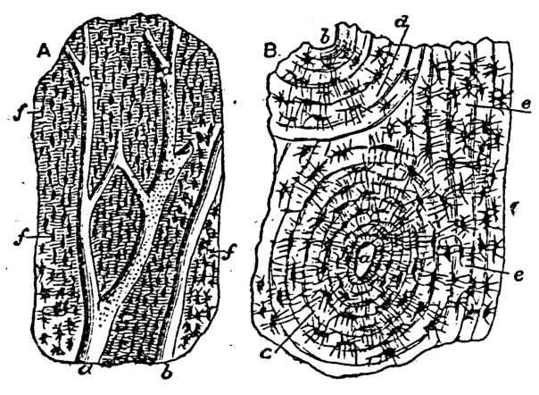
    <figcaption style="font-size: 14px; color: #4a5568; margin-top: 6px;"><em>Tē 5 tô.--A. Tng-kut ê chhiòng-tng-bīn, 100 pē khok-tōa; abcde, Havers ê sió-kńg; f kut-sòe-pau-chit, kut-sòe-pau tiong-ng ê khang-khiah. B. Tng-kut ê hoâiⁿ-tng-bīn, 100 pē khok-tōa; a b Havers ê sió-kńg; c, kut sòe-pau tiong-ng ê kńg; de, sòe-pau tiong-kan ê chit. (From "The Household Physician," Blackie & Son, Ltd., publishers.)</em></figcaption>
  </figure>

**KUT CHO͘-CHIT, JĪM-TÀI**　**9**

---

### [骨組織與海綿質]

khóan, gōa-bīn-ê sī kian-kò͘-chit (硬固質, *compact tissue*), lāi-bīn-ê sī hái-mî-chit (海綿質, *spongy tissue* (tē 4 tô͘). Tiong-kan iā ū chōe-chōe chhng kiò-chòe *Havers*-sī ê sió-kńg, chiah hō͘ huih ōe sûn-khoân lâi iúⁿ-chhī kut (tē 5 tô͘).
*(邊註：Hái-mî chit)*

> **【全漢對照】**
> 款，外面的是硬固質（硬固質，*compact tissue*），內面的是海綿質（海綿質，*spongy tissue*）（第 4 圖）。中間亦有多多穿叫做出 *Havers* 氏的小管，才互血會循環來養飼骨（第 5 圖）。
> *(邊註：海綿質)*

---

### 3. [骨髓腔]

3. Tn̂g kut ê tiong-ng ū chi̍t ê khang kiò-chòe kut-chhé-khang (骨髓腔). Chit ê khang chiàu kut ê tn̂g-té, tōa-sòe. Hit ê khang ū tóe kut-chhé (*medulla*; tē 6 tô͘), chiū-sī n̂g-sek kap chhiah-sek ê nn̄g chéng; tī lāi-bīn ū huih-kńg, lîm-pa-kńg (淋巴管, *lymphatics*), sîn-keng (神經, *nerves*), tī-teh, teh êng-ióng kut.
*(邊註：Kut-chhé-khang)*

> **【全漢對照】**
> 3. 長骨的中央有一個孔叫做出骨髓腔（骨髓腔）。此個孔照骨的長短、大小。彼個孔有貯骨髓（*medulla*；第 6 圖），就是黃色及赤色的兩種；佇內面有血管、淋巴管（淋巴管，*lymphatics*）、神經（神經，*nerves*）佇咧，咧營養骨。
> *(邊註：骨髓腔)*

---

### [圖版說明]

**Tē 5 tô͘.**—A. Tn̂g-kut ê chhiòng-tñg-bīn, 100 pē khok-tōa; abcde, Havers ê sió-kńg; f kut-sòe-pau-chit, kut-sòe-pau tiong-ng ê khang-khiah.  
B. Tn̂g-kut ê hoâiⁿ-tñg-bīn, 100 pē khok-tōa; a b Havers ê sió-kńg; c, kut sòe-pau tiong-ng ê kńg; de, sòe-pau tiong-kan ê chit. (From "The Household Physician," Blackie & Son, Ltd., publishers.)

> **【全漢對照】**
> **第 5 圖。**——A. 長骨的縱斷面，100 倍擴大；abcde, Havers 的小管；f 骨細胞質，骨細胞中央的空隙。  
> B. 長骨的橫斷面，100 倍擴大；a b Havers 的小管；c, 骨細胞中央的管；de, 細胞中間的質。（From "The Household Physician," Blackie & Son, Ltd., publishers.）

---

### 4. [軟骨]

4. Kut koan-chat ê só͘-chāi ū nńg-kut (軟骨, *cartilage*) pau-teh (tē 26 tô͘).
*(邊註：Nńg-kut)*

> **【全漢對照】**
> 4. 骨關節的所在有軟骨（軟骨，*cartilage*）包咧（第 26 圖）。
> *(邊註：軟骨)*

---

### 5. [靱帶]

5. Kut ū jīm-tài (靱帶, *ligaments*) lâi sio-liân-teh, iā ū kun-bah lâi liân thang pó-hō͘ kut, kap chòe ūn-tōng ê lō͘-ēng.
*(邊註：Jīm-tài)*

> **【全漢對照】**
> 5. 骨有靱帶（靱帶，*ligaments*）來相連咧，亦有筋肉（肌肉）來連通保護骨，及做運動的路用。
> *(邊註：靱帶)*

---

### [骨的外形分類]

Kut ê lō͘-ēng ū kúi-nā khóan, só͘-í kut gōa-bīn ê hêng-chōng m̄-sī chi̍t khóan, kè-kiōng hun chòe sì chéng,—tn̂g, té, píⁿ, bô chôe-ê.
*(邊註：Kut ê gōa-hêng)*

> **【全漢對照】**
> 骨的路用有幾若款，所以骨外面的形狀伓是一款，概共分做四種，——長、短、扁、無齊的。
> *(邊註：骨的外形)*

---

### 1. [長骨]

1. Tn̂g kut ê khóan-sit ū téng-toan (上端, *upper extremity*), ē-toan, kap tiong-ng ū chi̍t ê thé. Tn̂g kut
*(邊註：Tn̂g kut)*

> **【全漢對照】**
> 1. 長骨的款式有上端（上端，*upper extremity*）、下端，及中央有一個體。長骨
> *(邊註：長骨)*

---

### [頁尾格言]

Siōng-tè oàn-hūn kiau-ngō͘-ê, kap chhùi kóng kan-chà-ê (Chim-giân 6: 16-17).

> **【全漢對照】**
> 上帝怨恨驕傲的，及嘴講奸詐的（箴言 6: 16-17）。

<!-- Page 025 End -->

---

<!-- Page 026 Start -->
#### 📖 原書第 26 頁

### KUT HĒ-THÓNG（骨系統）

sī chhin-chhiūⁿ tōa-thúi-kut, siōng-phok-kut (上膊骨), chhiú-cháiⁿ-kut.

> **【全漢對照】**
> 是親像大腿骨、上膊骨（上膊骨）、手指骨。

---

### [Té kut / 短骨]

**2. Té kut** sī chhin-chhiūⁿ chhiú-óaⁿ-kut (手腕骨), hū-kut (跗骨), chhek-kài-kut.

> **【全漢對照】**
> **2. 短骨**是親像手腕骨（手腕骨）、跗骨（跗骨）、膝蓋骨。

---

### [Pîⁿ kut / 扁骨]

**3. Pîⁿ kut**, chhin-chhiūⁿ náu-thâu-kòa-kut (腦頭蓋骨), lô-téng-kut (顱頂骨, *parietal*), āu-thâu-kut (後頭骨, *occipital*), á-sī keng-kah-kut.

> **【全漢對照】**
> **3. 扁骨**，親像腦頭蓋骨（腦頭蓋骨）、顱頂骨（顱頂骨，*parietal*）、後頭骨（後頭骨，*occipital*），抑是肩胛骨。

---

### [Bô chôe-ê kut / 無齊的骨（不規則骨）]

**4. Bô chôe-ê**, chhin-chhiūⁿ chek-chui-kut (脊椎骨, *vertebrae*), siōng-gók-kut (上顎骨, *superior maxilla*), chih-kut (*hyoid*).

> **【全漢對照】**
> **4. 無齊的**，親像脊椎骨（脊椎骨，*vertebrae*）、上顎骨（上顎骨，*superior maxilla*）、舌骨（*hyoid*）。

---

### [圖解說明]

**Tē 6 tô͘.**—Kēng-kut chhiòng-tn̂g-bīn : 1, hái-mî-chit ; 2, kut-chhé ; 3, kian-kò͘-chit.  
(Morrow, from “Anatomy and Physiology, for Nurses,” by permission of W. B. Saunders Co., publishers.)

> **【全漢對照】**
> **第 6 圖**。——脛骨縱長面：1，海綿質；2，骨髓；3，堅固質。  
> （Morrow，取自《護士之解剖學與生理學》，經出版商 W. B. Saunders 公司授權。）

---

### [骨骼一覽引言]

Tī ē-tóe só͘ kì ê pió sī kóng seng-khu-lāi ê kut miâ kap kúi tè (tē 7 tô͘) :

> **【全漢對照】**
> 佇下底所記的表是講身軀內的骨名佮幾塊（第 7 圖）：

---

### [頁底格言]

Nā bē chiong io̍h hō͘ pīⁿ-lâng chia̍h, m̄-thang kóng ū chia̍h. Kan-ta hē io̍h tī sin-piⁿ bô kàu-gia̍h ; tio̍h khòaⁿ i si̍t-chāi ū chia̍h á-bô.

> **【全漢對照】**
> 若未將藥予病人食，毋通講有食。單單下藥佇身邊無夠額；著看伊實在有食抑無。

Lán lâng tòa tī sè-kan, m̄-sī in-ūi beh chhit-thô, ná chhin-chhiūⁿ khùn-bāng, tè hái-éng chiūⁿ-lo̍h ; chiū-sī ū kan-khó͘ tio̍h-bôa ê sū, beh chòe pang-chān pa̍t lâng thòe i taⁿ tāng-tàⁿ.

> **【全漢對照】**
> 咱人蹛佇世間，毋是因為欲𨑨迌，若親像睏夢，綴海湧上落；就是有艱苦著磨的事，欲做幫助別人替伊擔重擔。

<!-- Page 026 End -->

---

<!-- Page 027 Start -->
#### 📖 原書第 27 頁

  <figure style="display: inline-block; margin: 12px; max-width: 90%; text-align: center;">
    
    <figcaption style="font-size: 14px; color: #4a5568; margin-top: 6px;"><em>Tē 7 tô:—Kut-keh tô: 1, chêng-thâu-kut ; 2, lō-téng-kut ; 3, jiap-su-kut ; 4, siōng-gók-kut ; 5, hā-gók-kut ; 6, bák-chiu-o ; 7, phīⁿ-khang-o ; 8, kēng-chui-kut ; 9, só-kut ; 10, tē it hiáp-kut ; 11, heng-kut ; 12, keng-kah-kut ; 13, siōng-phok-kut ; 14, jiâu-kut ; 15,chhioh-kut ; 16, chhiú-oáⁿ-kut ; 17, chhiú-chiúⁿ-kut ; 18, chhiú-cháiⁿ-kut ; 19, tē 12 hiáp-kut ; 20, thng-kut ; 21, io-chui-kut ; 22, chiàn-kut ; 23, thí-kut ; 24, chō-kut ; 25, tōa-thúi-kut ; 26, chhek-kài-kut ; 27, hûi-kut ; 28, kēng-kut ; 29, hū-kut ; 30, chek-kut ; 31, chí-kut ; PLEVIS, kut-poâⁿ. (From Lewis' "Anatomy and Physiology for Nurses," by per. W. B. Saunders Co., publishers.)</em></figcaption>
  </figure>

### KUT-KEH-TÔ͘

11

Tē 7 tô͘:—Kut-keh tô͘: 1, chêng-thâu-kut; 2, lô͘-téng-kut; 3, jiap-su-kut; 4, siōng-go̍k-kut; 5, hā-go̍k-kut; 6, ba̍k-chiu-o; 7, phīⁿ-khang-o; 8, kēng-chui-kut; 9, só-kut; 10, tē it hia̍p-kut; 11, heng-kut; 12, keng-kah-kut; 13, siōng-phok-kut; 14, jiâu-kut; 15,chhioh-kut; 16, chhiú-oáⁿ-kut; 17, chhiú-chiúⁿ-kut; 18, chhiú-cháiⁿ-kut; 19, tē 12 hia̍p-kut; 20, tông-kut; 21, io-chui-kut; 22, chiàn-kut; 23, thí-kut; 24, chō-kut; 25, tōa-thúi-kut; 26, chhek-kài-kut; 27, hûi-kut; 28, kēng-kut; 29, hū-kut; 30, chek-kut; 31, chí-kut; PLEVIS, kut-phoaⁿ. (From Lewis’ “Anatomy and Physiology for Nurses,” by per. W. B. Saunders Co., publishers.)

> **【全漢對照】**
> ### 骨格圖
> 
> 11
> 
> 第 7 圖：—骨格圖：1, 前頭骨；2, 顱頂骨；3, 鑷子骨（顳骨）；4, 上顎骨；5, 下顎骨；6, 目睭窠（眼窩）；7, 鼻孔窠（鼻腔）；8, 頸椎骨；9, 鎖骨；10, 第一肋骨；11, 胸骨；12, 肩胛骨；13, 上膊骨；14, 橈骨；15,尺骨；16, 手腕骨；17, 手掌骨；18, 手指骨；19, 第 12 肋骨；20, 腸骨（髂骨）；21, 腰椎骨；22, 薦骨；23, 恥骨；24, 坐骨；25, 大腿骨；26, 膝蓋骨；27, 腓骨；28, 脛骨；29, 跗骨；30, 蹠骨；31, 趾骨；PLEVIS，骨盤。(From Lewis’ “Anatomy and Physiology for Nurses,” by per. W. B. Saunders Co., publishers.)

---

Nā tio̍h oaⁿ pau-siong-liâu chi̍t ji̍t nn̄g pái, m̄-thang phah-sǹg chi̍t pòaⁿ pái bô oaⁿ bô iàu-kín.

> **【全漢對照】**
> 若著換包傷療一日兩擺，毋通拍算蜀半擺無換無要緊。

<!-- Page 027 End -->

---

<!-- Page 028 Start -->
#### 📖 原書第 28 頁

### KUT HĒ-THÓNG

Chek-chui-kut (脊椎骨), [chiàn-kut (薦骨) kap bí-lû-kut (尾閭骨)] sǹg chāi-lāi. (*The vertebral column with sacrum and coccyx*) 26

> **【全漢對照】**
> 脊椎骨（脊椎骨），[薦骨（薦骨）佮尾閭骨（尾閭骨）] 算在內。 (*The vertebral column with sacrum and coccyx*) 26

---

Thâu-kòa 22 tè kut (頭蓋, *Skull*)：

* **Náu-thâu-kòa (腦頭蓋, *Cranium*) 8 tè kut**
  * Āu-thâu-kut (後頭骨, *Occipital*) 1
  * Lô-téng-kut (顱頂骨, *Parietal*) 2
  * Chêng-thâu-kut (前頭骨, *Frontal*) 1
  * Jiap-su-kut (顳顬骨, *Temporal*) 2
  * Ô͘-tia̍p-kut (蝴蝶骨, *Sphenoid*) 1
  * Su-kut (篩骨, *Ethmoid*) 1

* **Gân-biān-thâu-kòa (顏面頭蓋, *Face*) 14 tè kut**
  * Phīⁿ-kut (鼻骨, *Nasal*) 2
  * Siōng-go̍k-kut (上顎骨, *Superior maxilla*) 2
  * Lūi-kut (淚骨, *Lachrymal*) 2
  * Koân-kut (顴骨, *Malar*) 2
  * Chhùi-kòa-kut (口蓋骨, *Palate*) 2
  * Hā-kah-kài-kut (下甲介骨, *Inferior turbinated*) 2
  * Thû-kut (鋤骨, *Vomer*) 1
  * Hā-go̍k-kut (下顎骨, *Inferior maxilla*) 1

> **【全漢對照】**
> 頭蓋 22 塊骨（頭蓋, *Skull*）：
> 
> * **腦頭蓋（腦頭蓋, *Cranium*）8 塊骨**
>   * 後頭骨（後頭骨, *Occipital*）1
>   * 顱頂骨（顱頂骨, *Parietal*）2
>   * 前頭骨（前頭骨, *Frontal*）1
>   * 顳顬骨（顳顬骨, *Temporal*）2
>   * 蝴蝶骨（蝴蝶骨, *Sphenoid*）1
>   * 篩骨（篩骨, *Ethmoid*）1
> 
> * **顏面頭蓋（顏面頭蓋, *Face*）14 塊骨**
>   * 鼻骨（鼻骨, *Nasal*）2
>   * 上顎骨（上顎骨, *Superior maxilla*）2
>   * 淚骨（淚骨, *Lachrymal*）2
>   * 顴骨（顴骨, *Malar*）2
>   * 喙蓋骨（口蓋骨, *Palate*）2
>   * 下甲介骨（下甲介骨, *Inferior turbinated*）2
>   * 鋤骨（鋤骨, *Vomer*）1
>   * 下顎骨（下顎骨, *Inferior maxilla*）1

---

Chih-kut (舌骨, *Hyoid*) 1  
Heng-kut (胸骨, *Sternum*) 1  
Hia̍p-kut (肋骨, *Ribs*) 24  

> **【全漢對照】**
> 舌骨（舌骨, *Hyoid*）1  
> 胸骨（胸骨, *Sternum*）1  
> 脅骨（肋骨, *Ribs*）24  

---

Siōng-chi-kut (上肢骨, *Upper extremity*) lióng pêng sǹg 64 tè kut：
* Só-kut (鎖骨, *Clavicle*) 2
* Keng-kah-kut (肩胛骨, *Scapula*) 2
* Siōng-phok-kut (上膊骨, *Humerus*) 2
* Jiâu-kut (橈骨, *Radius*) 2
* Chhioh-kut (尺骨, *Ulna*) 2
* Chhiú-óaⁿ-kut (手腕骨, *Carpus*) 16
* Chhiú-chiúⁿ-kut (手掌骨, *Metacarpus*) 10
* Chhiú-cháiⁿ-kut (手指骨, *Phalanges*) 28

> **【全漢對照】**
> 上肢骨（上肢骨, *Upper extremity*）兩旁算 64 塊骨：
> * 鎖骨（鎖骨, *Clavicle*）2
> * 肩胛骨（肩胛骨, *Scapula*）2
> * 上膊骨（上膊骨, *Humerus*）2
> * 橈骨（橈骨, *Radius*）2
> * 尺骨（尺骨, *Ulna*）2
> * 手腕骨（手腕骨, *Carpus*）16
> * 手掌骨（手掌骨, *Metacarpus*）10
> * 手指骨（手指骨, *Phalanges*）28

<!-- Page 028 End -->

---

<!-- Page 029 Start -->
#### 📖 原書第 29 頁

CHEK-CHUI-KUT 13

| | | |
| :--- | :--- | :--- |
| Hā-chi-kut (下肢骨, *Lower extremity*) lióng pêng sǹg 62 tè kut | Bô-miâ-kut (無名骨, *Os innominatum*) | 2 |
| | Tōa-thúi-kut (大腿骨, *Femur*) | 2 |
| | Chhek-kài-kut (膝蓋骨, *Patella*) | 2 |
| | Kēng-kut (脛骨, *Tibia*) | 2 |
| | Hūi-kut (腓骨, *Fibula*) | 2 |
| | Hū-kut (跗骨, *Tarsus*) | 14 |
| | Chek-kut (蹠骨, *Metatarsus*) | 10 |
| | Chí-kut (趾骨, *Phalanges*) | 28 |
| | Thèng-kut (聽骨, *Auditory ossicles*) | 6 |
| | **Chóng-kiōng** | **206** |

> **【全漢對照】**
> | | | |
> | :--- | :--- | :--- |
> | 下肢骨 (*Lower extremity*) 兩爿算 62 塊骨 | 無名骨 (*Os innominatum*) | 2 |
> | | 大腿骨 (*Femur*) | 2 |
> | | 膝蓋骨 (*Patella*) | 2 |
> | | 脛骨 (*Tibia*) | 2 |
> | | 腓骨 (*Fibula*) | 2 |
> | | 跗骨 (*Tarsus*) | 14 |
> | | 蹠骨 (*Metatarsus*) | 10 |
> | | 趾骨 (*Phalanges*) | 28 |
> | | 聽骨 (*Auditory ossicles*) | 6 |
> | | **總共** | **206** |

---

### Chek-chui-kut（脊椎骨）

Chek-chui-kut tī seng-khu ê tiong-ng chhin-chhiūⁿ thiāu-á tit-tit khiā-teh (tē 8 tô͘), siang pêng liân tī hia̍p-kut, téng-bīn chiap tī thâu-nih. Chó-iū ū nñg ki chiū-sī chhiú-kut, ē-bīn ū nñg ki chiū-sī kha-kut. Chek-chui-kut ū 26 lûn (chiàn-kut kap bí-lû-kut sǹg chāi-lāi), kî-tiong ē-tóe bē tín-tāng-ê, chiū-sī chiàn-kut kap bí-lû-kut. Chit ê chiàn-kut sòe-hàn ê sî ū hun chòe 5 tè, chóng-sī iáu-bē sêng-teng (成丁) ê sî ū ha̍p-chiâⁿ chòe chi̍t tè; bí-lû-kut sòe-hàn ê sî ū hun chòe 4 tè, chiah-ê iā ha̍p-chiâⁿ chòe chi̍t tè, só͘-í chiah ê kut nā sǹg sī 9 tè, hiah ê chek-chui-kut chóng-kiōng thang sǹg sī 33 lûn.

> **【全漢對照】**
> 脊椎骨佇身軀的中央親像柱仔直直徛咧（第 8 圖），雙爿聯佇脅骨，頂面接佇頭裡。左右有兩枝就是手骨，下面有兩枝就是跤骨。脊椎骨有 26 輪（薦骨佮尾閭骨算在內），其中下底袂振動的，就是薦骨佮尾閭骨。此個薦骨細漢的時有分做 5 塊，總是猶未成丁（成丁）的時有合成做一塊；尾閭骨細漢的時有分做 4 塊，諸個亦合成做一塊，所以諸個骨若算是 9 塊，遐的脊椎骨總共通算是 33 輪。

---

Chek-chui-kut lóng-chóng hun chòe saⁿ tōaⁿ:
1. Kēng-chui-kut (脛椎骨, *cervical vertebrae*) ū 7 tè.
2. Heng-chui-kut (胸椎骨, *dorsal vertebrae*) ū 12 tè.
3. Io-chui-kut (腰椎骨, *lumbar vertebrae*) ū 5 tè.
Siông-sè kóng iáu ū nñg tōaⁿ chiū-sī chiàn-kut, kap bí-lû-kut (tē 8 tô͘).

> **【全漢對照】**
> 脊椎骨攏總分做三段：
> 1. 頸椎骨（脛椎骨，*cervical vertebrae*）有 7 塊。
> 2. 胸椎骨（胸椎骨，*dorsal vertebrae*）有 12 塊。
> 3. 腰椎骨（腰椎骨，*lumbar vertebrae*）有 5 塊。
> 詳細講猶有兩段就是薦骨，佮尾閭骨（第 8 圖）。

---

### Chui-kut（椎骨）

Chui-kut: Ta̍k lûn ê tiong-kan ū nńg-kut lâi pho͘-teh chòe tiām. Chit ê nńg-kut m̄-sī kut iā m̄-sī bah, sī nńg

> **【全漢對照】**
> 椎骨：逐輪的中間有軟骨來鋪咧做墊。此個軟骨毋是骨亦毋是肉，是軟

---

Pīⁿ-lâng nā teh khùn, i-seng rā bô hoan-hù, m̄-thang kiò i chhíⁿ, lâi hō͘ chia̍h ioh.

> **【全漢對照】**
> 病人若咧睏，醫生若無吩咐，毋通叫伊醒，來予食藥。

<!-- Page 029 End -->

---

<!-- Page 030 Start -->
#### 📖 原書第 30 頁

  <figure style="display: inline-block; margin: 12px; max-width: 90%; text-align: center;">
    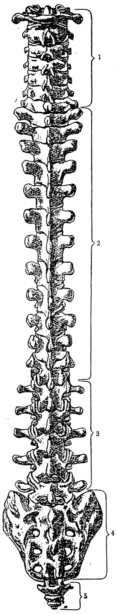
    <figcaption style="font-size: 14px; color: #4a5568; margin-top: 6px;"><em>Tē 8 tô.—Chek-thiāu tùi āu-bīn khòaⁿ tit-tit : 1, kēng-chui-kut; 2, heng-chui-kut; 3, io-chui-kut; 4, chiàn-kut; 5, bí-lû-kut. (From Cunning-ham's "Anatomy," Henry Frowde Hodder & Stoughton, publishers.)</em></figcaption>
  </figure>

**14**  
**KUT HĒ-THÓNG**

[圖左標示：Tē it kēng-chui-kut]

koh jūn, khah chhin-chhiūⁿ kun ê khoán-sit. I ê lō͘-ēng sī hō͘ kut tú kut khah bōe sio kháp, iā khah bōe chhe̍k-tio̍h náu-chhé (tē 9 tô͘). Chui-kut ū chiah chē ê lí-khì, sī hō͘ seng-khu thang ut-khiau chhun-ti̍t, khi lâi khi khì. Chek-chui-kut koh sī chhin-chhiūⁿ thiāu hō͘ seng-khu ōe thêng sin. Chui-kut ê tiong-ng ū khang chhin-chhiūⁿ kńg, kńg ê lāi-bīn ū chi̍t tiâu chek-chhé thàu tī náu (tē 10 tô͘).

> **【全漢對照】**  
> [圖左標示：第一頸椎骨]  
> 閣韌，較親像筋的款式。伊的路用是互骨抵骨較袂相嗑，也較袂磧著腦髓（第 9 圖）。椎骨有遮多的理氣，是互身軀通鬱曲伸直，去來去氣。脊椎骨閣是親像柱互身軀會挺身。椎骨的中央有孔親像管，管的內面有一條脊髓透佇腦（第 10 圖）。

---

Thâu-kòa kap chek-chui-kut kau-chiap ê só͘-chāi ū n̄g tè kut, téng-bīn-ê kiò-chòe tē it kēng-chui-kut (atlas), ē-tóe-ê kiò-chòe tē jī kēng-chui-kut (axis); ē-tóe ū sún-thâu, téng-bīn-ê ū sún-kheng; chí n̄g tè saⁿ chhēng. Tē it kēng-chui-kut ê téng-bīn siang pêng lî-lî-á lap-u kiò-chòe siōng-koan-chat-o (上關節窩); thâu-kòa-tóe ê āu-thâu-kut khòa tī tē it kēng-chui-kut ê só͘-chāi, siang pêng lî-lî-á khah thóng, lâi thap tī chí n̄g ê lap-u ê só͘-chāi; chiah ê kau-kài ê só͘-chāi lóng ū kút-e̍k hō͘ i kút-kút, án-ni-siⁿ chiah ōe thìm thâu, ōe kia̍h thâu, thâu-khak ia̍h ōe oat-lâi oat-khì (tē 11 tô͘).

> **【全漢對照】**  
> 頭蓋及脊椎骨交接的所在有兩塊骨，頂面的叫做第一頸椎骨（atlas），底下的叫做第二頸椎骨（axis）；底下有榫頭，頂面的有榫框；此兩塊相穿。第一頸椎骨的頂面雙爿微微仔凹凹叫做上關節窩（上關節窩）；頭蓋底的後頭骨跨佇第一頸椎骨的所在，雙爿微微仔較凸，來插佇此兩個凹凹的所在；諸個交界的所在攏有滑液互伊滑滑，按呢生才會䪴頭，會攑頭，頭殼亦會越來越去（第 11 圖）。

---

### [圖說]

Tē 8 tô͘.—Chek-thiāu tùi āu-bīn khòaⁿ ti̍t-ti̍t: 1, kēng-chui-kut; 2, heng-chui-kut; 3, io-chui-kut; 4, chiàn-kut; 5, bí-lû-kut. (From Cunningham's “Anatomy,” Henry Frowde Hodder & Stoughton, publishers.)

> **【全漢對照】**  
> 第 8 圖。—脊柱對後面看直直：1, 頸椎骨；2, 胸椎骨；3, 腰椎骨；4, 薦骨；5, 尾閭骨。（取材自康寧漢《解剖學》，亨利·弗羅德與霍德與斯托頓出版商。）

<!-- Page 030 End -->

---

<!-- Page 031 Start -->
#### 📖 原書第 31 頁

  <figure style="display: inline-block; margin: 12px; max-width: 90%; text-align: center;">
    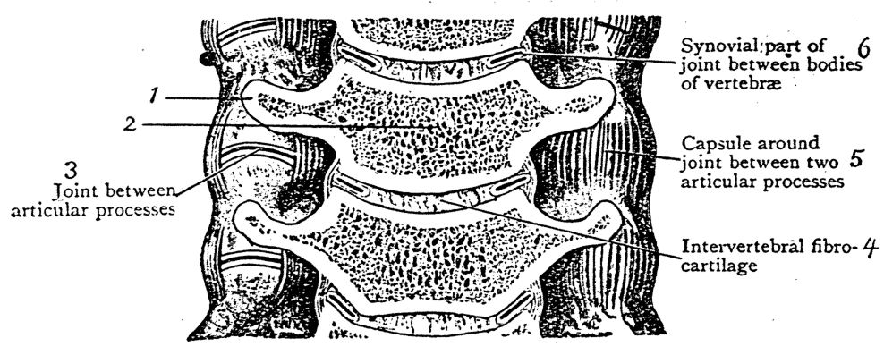
    <figcaption style="font-size: 14px; color: #4a5568; margin-top: 6px;"><em>Tē 9 tô.—Kēng-chui-kut chhiat-tūg-bīn, tùi tò-pêng kàu chiàⁿ-pêng, khiā-ti̍t chhiat-lo̍h-khì kā i khòaⁿ: 1, hoâiⁿ-tút-khí; 2, chui-kut-thé; 3, koan-chat-tút-khí tiong-ng ê koan-chat; 4, chui-kan-nńg-kut; 5, lông-chōng-jīm-tài; 6, chui-kut-thé tiong-kan ê koan-chat (Cunningham).</em></figcaption>
  </figure>
  <figure style="display: inline-block; margin: 12px; max-width: 90%; text-align: center;">
    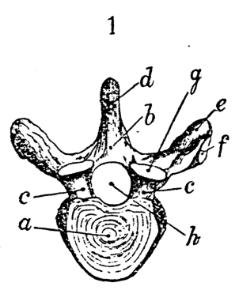
    <figcaption style="font-size: 14px; color: #4a5568; margin-top: 6px;"><em>Tē 10 tô.—1. Heng-chui-kut: a, chui-kut-thé; b, c, chui-kut-keng; d, chhì-chōng-tút-khí; e, hoâiⁿ-tút-khí; f, hoâiⁿ-tút-khí-o, chiū-sī hia̍p-kut-o; g, koan-chat-o; h, chui-khang (Blackie and Son).</em></figcaption>
  </figure>

### CHEK-CHUI-KUT（第 15 頁）

#### [Tē jī kēng-chui-kut / 第二頸椎骨]

Tē jī kēng-chui-kut sī chek-chui-kut ê tē jī lûn. I ê hêng-chōng ū koh-iūⁿ, chiū-sī ū chit ê khí-chōng-tút-khí (齒狀突起, odontoid process). Chit ê khí-chōng-tút-khí sī îⁿ-îⁿ chhin-chhiūⁿ îⁿ ê chúg-á khóan, lâi kap tē it kēng-chui-kut liân-ha̍p chòe ték-pia̍t ê koan-chat (tē 12 tô͘).

> **【全漢對照】**
> 第二頸椎骨是脊椎骨的第二輪。伊的形狀有各樣，就是有一個齒狀突起（齒狀突起，odontoid process）。這个齒狀突起是圓圓親像圓的樁仔款，來及第一頸椎骨聯合做特別的關節（第 12 圖）。

---

#### [Tē 9 tô͘ / 第 9 圖]

**Tē 9 tô͘.**—Kēng-chui-kut chhiat-tn̄g-bīn, tùi tò-pêng kàu chiàⁿ-pêng, khiā-ti̍t chhiat-lo̍h-khì kā i khòaⁿ: 1, hoâiⁿ-tút-khí; 2, chui-kut-thé; 3, koan-chat-tút-khí tiong-ng ê koan-chat; 4, chui-kan-nńg-kut; 5, lông-chōng-jīm-tài; 6, chui-kut-thé tiong-kan ê koan-chat (Cunningham).

> **【全漢對照】**
> **第 9 圖。**——頸椎骨切斷面，對倒爿到正爿，豎直切落去共伊看：1，橫突起；2，椎骨體；3，關節突起中央的關節；4，椎間軟骨；5，囊狀韌帶；6，椎骨體中間的關節（Cunningham）。

---

#### [Chui-kut tín-tāng / 椎骨震動]

Chek-chui-kut ê tín-tāng,—chêng, āu, chó-iū lóng ōe tín-tāng. Khah gâu tín-tāng ê ūi, sī kēng-chui-kut kap io-chui-kut.

> **【全漢對照】**
> 脊椎骨的震動（運動），——前、後、左右攏會震動。較𠢕震動的位，是頸椎骨及腰椎骨。

---

#### [Kut-keh liân-lo̍k / 骨骼連絡]

Kut-keh cháiⁿ-iūⁿ lâi liân-lo̍k? Tē it,—ū jīm-tài lâi liân-lo̍k, iā ū kun-bah; tē jī,—tī ta̍k lûn ê tiong-kan ū nńg-kut lâi sio-liân.

> **【全漢對照】**
> 骨骼怎樣來連絡？第一，——有韌帶來連絡，也有筋肉；第二，——佇逐輪的中間有軟骨來相連。

---

#### [Tē 10 tô͘ / 第 10 圖]

**Tē 10 tô͘.**—1. Heng-chui-kut: a, chui-kut-thé; b, c, chui-kut-keng; d, chhì-chōng-tút-khí; e, hoâiⁿ-tút-khí; f, hoâiⁿ-tút-khí-o, chiū-sī hia̍p-kut-o; g, koan-chat-o; h, chui-khang (Blackie and Son).

> **【全漢對照】**
> **第 10 圖。**——1. 胸椎骨：a，椎骨體；b, c，椎骨弓；d，刺狀突起；e，橫突起；f，橫突起窩，就是肋骨窩；g，關節窩；h，椎孔（Blackie and Son）。

---

#### [Sì ê oan-khiau / 四個彎曲]

Chek-chui-kut ū sì ūi ê oan-khiau (tē 13 tô͘):
1. Kēng-chui-kut oan tùi bīn-chêng lâi.
2. Heng-chui-kut oan tùi āu-bīn khì.

> **【全漢對照】**
> 脊椎骨有四位的彎曲（第 13 圖）：
> 1. 頸椎骨彎對面前來。
> 2. 胸椎骨彎對後面去。

---

#### [頁底格言]

Ióh-tû ê só-sî, m̄-thang chhìn-chhái hē-teh.

> **【全漢對照】**
> 藥櫥的鎖匙，毋通凊彩（隨便）下咧。

<!-- Page 031 End -->

---

<!-- Page 032 Start -->
#### 📖 原書第 32 頁

  <figure style="display: inline-block; margin: 12px; max-width: 90%; text-align: center;">
    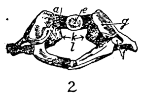
    <figcaption style="font-size: 14px; color: #4a5568; margin-top: 6px;"><em>Tē 11 tô.—2. Tē it kēng-chui-kut téng-bīn pêng : a, chêng-keng ; e, aū-koan-chat-o, chit-ê sī kap tē 2 kēng-chui-kut ê khí-chōng-tút-khí lâi chòe koan-chat ; f, hoâin-tút-khí-khang ; g, siōng-koan-chat-o ; k, chí-bēng hoâin-jīm-tài, liân ê só͘-chāi ; l, chui-khang (Blackie and Son).</em></figcaption>
  </figure>
  <figure style="display: inline-block; margin: 12px; max-width: 90%; text-align: center;">
    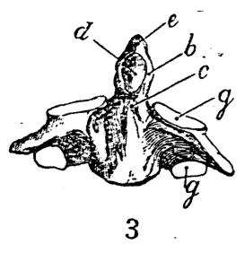
    <figcaption style="font-size: 14px; color: #4a5568; margin-top: 6px;"><em>Tē 12 tô.—3. Tē jī kēng-chui-kut thâu-chêng bīn : c, b, e, khí-chōng-tút-khí ê thâu, tiong kap bé ; d, chêng-koan-chat-o, sī kap tē it kēng-chui-kut aū-koan-chat-o lâi chòe koan-chat ; g, siōng hā koan-chat-o (Blackie and Son).</em></figcaption>
  </figure>

### 16 KUT HĒ-THÓNG

3. Io-chui-kut koh oan tùi thâu-chêng lâi.
4. Chiàn-kut koh oan tùi āu-bīn khì.
Tē it ê oan-khiau, i ê thâu-chêng sī phòng-chhut-lâi.
Tē jī ê . . . . . nah-ji̍p-khì.
Tē saⁿ . . . . . phòng-chhut-lâi.
Tē sì . . . . . nah-ji̍p-khì.

> **【全漢對照】**
> 3. 腰椎骨閣彎對頭前來。
> 4. 薦骨閣彎對後面去。
> 第一個彎曲，伊的頭前是膨出來。
> 第二個 ．．．．． 凹入去。
> 第三 ．．．．． 膨出來。
> 第四 ．．．．． 凹入去。

---

### [Chui-kan-khóng]

Ta̍k tè ê chui-kut ê chek-chhé-khang ê nñg pêng-piⁿ ū khang, kiò-chòe chui-kan-khóng (椎間孔, *intervertebral foramen*); chek-chhé-sîn-keng (*spinal nerves*) tùi chiah ê khang kè-lâi pò͘ tī seng-khu ta̍k só͘-chāi. Tī chek-chui-kut ê gōa-bīn ū kun-bah tah-liân-teh, lâi pó-hō͘ kut, hō͘ i bōe oa̍t tùi chó-iū oai-chhiâ-khì. Chiah ê kun-bah nā bô la̍t, hit ê lâng ê keng-kah-kut kap hia̍p-kut ōe oai-chhiâ.

> **【全漢對照】**
> **[椎間孔]**
> 逐塊的椎骨的脊髓孔的兩旁邊有孔，叫做椎間孔（椎間孔，*intervertebral foramen*）；脊髓神經（*spinal nerves*）對諸個孔過來布佇身軀逐所在。佇脊椎骨的外面有筋肉貼連咧，來保護骨，互伊𣍐越對左右歪斜去。諸個筋肉若無力，彼個人的肩胛骨佮脅骨會歪斜。

---

**[附圖說明]**
Tē 11 tô͘.—2. Tē it kēng-chui-kut téng-bīn pêng: a, chêng-keng; e, āu-koan-chat-o, chit-ê sī kap tē 2 kēng-chui-kut ê khí-chōng-tu̍t-khí lâi chòe koan-chat; f, hoâiⁿ-tu̍t-khí-khang; g, siōng-koan-chat-o; k, chí-bêng hoâiⁿ-jīm-tài, liân ê só͘-chāi; l, chui-khang (Blackie and Son).

> **【全漢對照】**
> 第 11 圖。—2. 第一頸椎骨頂面平：a, 前弓；e, 後關節窩，這個是佮第 2 頸椎骨的齒狀突起來做關節；f, 橫突起孔；g, 上關節窩；k, 指明橫韌帶，連的所在；l, 椎孔 (Blackie and Son)。

---

### [Thâu-kòa / Hông-ha̍p]

Thâu-kòa ū kúi-nā tè kut lâi ha̍p chiâⁿ--ê (tē 14 tô͘). Ta̍k tè kut kîⁿ-á ū kù-á-khí ê khóaⁿ lâi chiap-ha̍p ê chōa, kiò-chòe hông-ha̍p (縫合, *suture*). Lāi-bīn khang-khak liòh-lióh-á chhin-chhiūⁿ iⁿ ê khóaⁿ-sit. Khang-khak ê lāi-bīn ū tóe náu-chhé, náu-chhé chiah ōe ún-tàng. Thâu-kòa ê kut chóng-kiōng ū 22 tè kut, hun chòe náu-thâu-kòa kap gān-biān-thâu-kòa.

Náu-thâu-kòa ū 8 tè kut, hun thâu-kòa-téng (*vault of*...

> **【全漢對照】**
> **[頭蓋 / 縫合]**
> 頭蓋有幾若塊骨來合成的（第 14 圖）。逐塊骨墘仔有鋸仔齒的款來接合的線，叫做縫合（縫合，*suture*）。裏面空殼略略仔親像圓的款式。空殼的裏面有底腦髓，腦髓才會穩當。頭蓋的骨總共有 22 塊骨，分做腦頭蓋佮顏面頭蓋。
>
> 腦頭蓋有 8 塊骨，分頭蓋頂（*vault of*...

---

**[附圖說明]**
Tē 12 tô͘.—3. Tē jī kēng-chui-kut thâu-chêng bīn: c, b, e, khí-chōng-tu̍t-khí ê thâu, tiong kap bé; d, chêng-koan-chat-o, sī kap tē it kēng-chui-kut aū-koan-chat-o lâi chòe koan-chat; g, siōng hā koan-chat-o (Blackie and Son).

> **【全漢對照】**
> 第 12 圖。—3. 第二頸椎骨頭前面：c, b, e, 齒狀突起的頭，中佮尾；d, 前關節窩，是佮第一頸椎骨後關節窩來做關節；g, 上下關節窩 (Blackie and Son)。

---

### [頁底格言]

Tī chí sió-khóa ê sū chīn-tiong--ê, tī tōa--ê iā chīn-tiong, tī sió-khóa--ê put-gī, tī tōa--ê iā put-gī (Lō-ka 16: 10).

> **【全漢對照】**
> 佇只些許的事盡忠的，佇大的也盡忠，佇些許的不義，佇大的也不義（路加 16: 10）。

<!-- Page 032 End -->

---

<!-- Page 033 Start -->
#### 📖 原書第 33 頁

  <figure style="display: inline-block; margin: 12px; max-width: 90%; text-align: center;">
    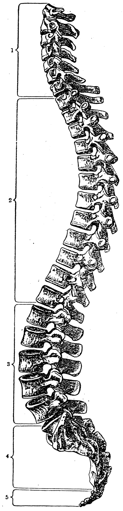
    <figcaption style="font-size: 14px; color: #4a5568; margin-top: 6px;"><em>Tē 13 tô.—Chek-thiāu tùi pīⁿ-á khòaⁿ i ê oan-khiau : 1, kēng-chui-kut ; 2, heng-chui-kut ; 3, io-chui-kut ; 4, chiàn-kut ; 5, bí-lû-kut (Cunningham).</em></figcaption>
  </figure>

## THÂU-KÒA Ê KUT (17)

### [Thâu-kòa-téng]

*skull*), kap thâu-kòa-tóe (*base of skull*). Thâu-kòa-téng ê thâu-chêng ū chêng-thâu-kut, āu-bīn ū āu-thâu-kut, téng-bīn ū chó-iū 2 tè lô͘-téng-kut lâi chiâⁿ (tē 14 tô͘).

> **【全漢對照】**
> *skull*），佮頭蓋底（*base of skull*）。頭蓋頂的頭前有前頭骨，後面有後頭骨，頂面有左右 2 塊顱頂骨來成（第 14 圖）。

---

### [Thâu-kòa-tóe]

Thâu-kòa-tóe sī chêng-thâu-kut, āu-thâu-kut kap jiap-su-kut (顳顬骨, *temporal*) ê chit pō͘-hūn, í-kip ô͘-tia̍p-kut (蝴蝶骨, *sphenoid*), su-kut (篩骨, *ethmoid*) lâi chiâⁿ (tē 15 tô͘). Chiah ê thâu-kòa-kut lāi-gōa ū n̄g bīn.

> **【全漢對照】**
> 頭蓋底是前頭骨、後頭骨佮顳顬骨（顳顬骨，*temporal*）的一部份，以及蝴蝶骨（蝴蝶骨，*sphenoid*）、篩骨（篩骨，*ethmoid*）來成（第 15 圖）。諸個頭蓋骨內外有兩面。

---

### [Phīⁿ-kut]

Gân-biān-thâu-kòa ū 14 tè.  
Phīⁿ-kut ū n̄g tè sòe tè chòe phīⁿ-niû.

> **【全漢對照】**
> 顏面頭蓋有 14 塊。  
> 鼻骨有兩塊細塊做鼻樑。

---

### [Siōng-go̍k-kut]

Siōng-go̍k-kut (上顎骨, *superior maxilla*), ū 2 tè chòe ba̍k-chiu-o ê ē-tóe chit pō͘-hūn. Lāi-bīn ū chi̍t ê khang-tōng (腔洞, *antrum of Highmore*), ū kńg thàu tī phīⁿ-khang-lāi; chit ê khang-tōng ū-sî hoat iām, kàu bé chek lâng. Tī chí n̄g tè kut ê ē-tóe, ū tàu téng-bīn lia̍t ê chhùi-khí.

> **【全漢對照】**
> 上顎骨（上顎骨，*superior maxilla*），有 2 塊做目睭窩的下底這一部份。內面有一個腔洞（腔洞，*antrum of Highmore*），有管透佇鼻孔內；這個腔洞有時發炎，到尾積膿。佇此兩塊骨的下底，有鬥頂面列的喙齒。

---

### [Koân-kut]

Tī siōng-go̍k-kut ê téng-bīn, gōa-bīn piⁿ-á phok-chhut-lâi thâu-chêng ê kut, kiò-chòe koân-kut (顴骨, *malar*).

> **【全漢對照】**
> 佇上顎骨的頂面，外面邊仔僕出來頭前的骨，叫做顴骨（顴骨，*malar*）。

---

### [Tô͘-soeh / 圖說]

Tē 13 tô͘.—Chek-thiāu tùi piⁿ-á khòaⁿ i ê oan-khiau: 1, kēng-chui-kut; 2, heng-chui-kut; 3, io-chui-kut; 4, chiàn-kut; 5, bí-lû-kut (Cunningham).

> **【全漢對照】**
> 第 13 圖。——脊柱對邊仔看伊的彎曲：1，頸椎骨；2，胸椎骨；3，腰椎骨；4，薦骨；5，尾閭骨（Cunningham）。

<!-- Page 033 End -->

---

<!-- Page 034 Start -->
#### 📖 原書第 34 頁

  <figure style="display: inline-block; margin: 12px; max-width: 90%; text-align: center;">
    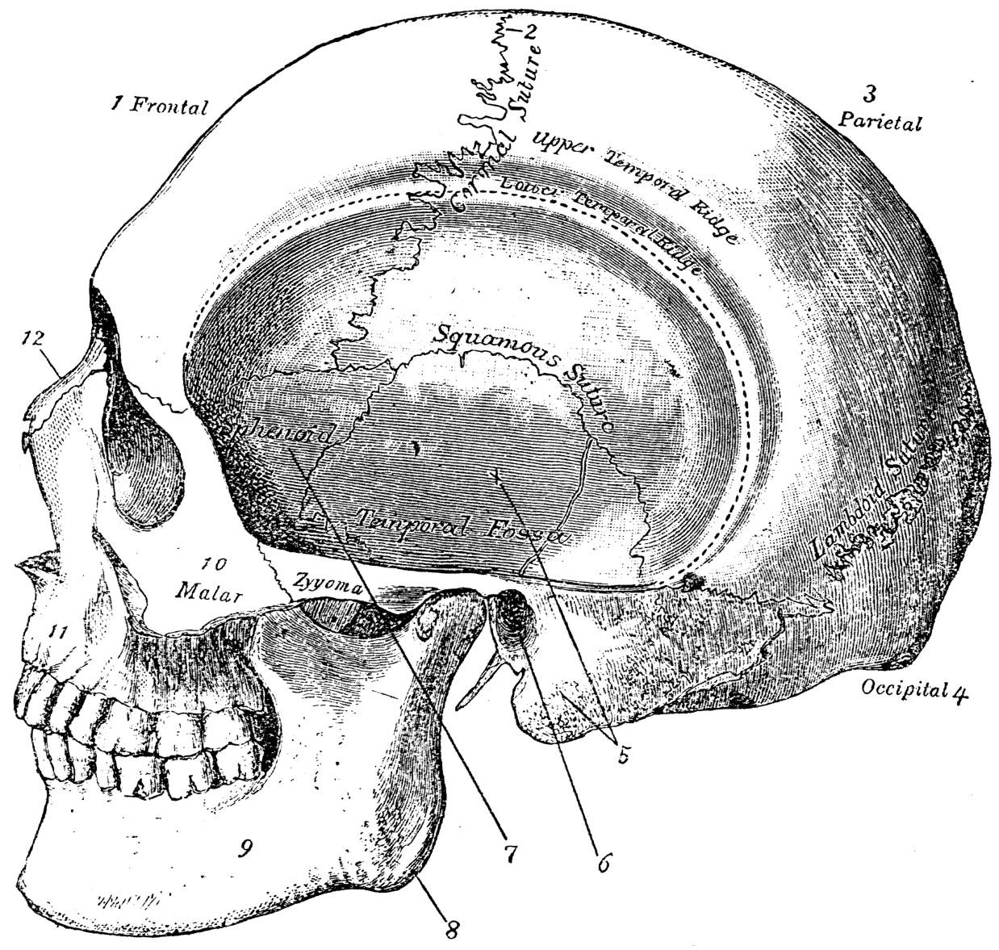
    <figcaption style="font-size: 14px; color: #4a5568; margin-top: 6px;"><em>Tē 14 tô̇.—Thâu-kòa tùi tò-pêng khòaⁿ: 1, chêng-thâu-kut; 2, chêng-thâu-kut kap 3, lō͘-téng-kut tiong-ng ê hông-ha̍p; 4, āu-thâu-kut; 5, jiap-su-kut; 6, hī-khang ê kut; 7, ô͘-tiáp-kut; 8, hā-gók-gū; 9, hā-gók-kut; 10 koân-kut; 11, siōng-gók-kut; 12, phīⁿ-kut. (From Gray's “Anatomy,” by permission of Longmans, Green, & Co., publishers.)</em></figcaption>
  </figure>

### 18 KUT HĒ-THÓNG

#### Chhùi-kòa-kut

Chhùi-kòa-kut ū 2 tè liân tī siōng-go̍k-kut ê chi̍t pō͘-hūn chòe tēng-chhùi-kòa (硬口蓋, *hard palate*; tē 40 tô͘).

> **【全漢對照】**
> **【嘴蓋骨】**
> 嘴蓋骨有 2 塊連佇上顎骨的一部份做硬嘴蓋（硬口蓋，*hard palate*；第 40 圖）。

---

#### [Tē 14 tô͘]

Tē 14 tô͘.—Thâu-kòa tùi tò-pêng khòaⁿ: 1, chêng-thâu-kut; 2, chêng-thâu-kut kap 3, lô͘-téng-kut tiong-ng ê hông-ha̍p; 4, āu-thâu-kut; 5, jiap-su-kut; 6, hī-khang ê kut; 7, ô͘-tia̍p-kut; 8, hā-go̍k-gû; 9, hā-go̍k-kut; 10 koân-kut; 11, siōng-go̍k-kut; 12, phīⁿ-kut. (From Gray's “Anatomy,” by permission of Longmans, Green, & Co., publishers.)

> **【全漢對照】**
> **【第 14 圖】**
> 第 14 圖。——頭蓋對倒爿看：1, 前頭骨；2, 前頭骨佮 3, 顱頂骨中央的縫合；4, 後頭骨；5, 鑷子骨；6, 耳孔的骨；7, 蝴蝶骨；8, 下顎隅；9, 下顎骨；10 顴骨；11, 上顎骨；12, 鼻骨。(From Gray's “Anatomy,” by permission of Longmans, Green, & Co., publishers.)

---

#### Hā-kah-kài-kut

Hā-kah-kài-kut (下甲介骨, *inferior turbinate*), tī phīⁿ-khang siang pêng-piⁿ ê kut, lâi chòe phīⁿ ê piⁿ-á piah ê chi̍t pō͘-hūn.

> **【全漢對照】**
> **【下甲介骨】**
> 下甲介骨（下甲介骨，*inferior turbinate*），佇鼻孔雙爿邊的骨，來做鼻的邊仔壁的一部份。

---

#### [Hù-chù / 附註]

Sóe phīⁿ-lâng ê sî, chúi tio̍h chiàu i-seng só͘ hoan-hù ê un-tō͘, nā-sī tio̍h sio, á-sī léng, tio̍h chiàu án-ni.

> **【全漢對照】**
> 洗鼻囊的時，水著照醫生所吩咐的溫度，若是著燒，抑是冷，著照按呢。

<!-- Page 034 End -->

---

<!-- Page 035 Start -->
#### 📖 原書第 35 頁

  <figure style="display: inline-block; margin: 12px; max-width: 90%; text-align: center;">
    
    <figcaption style="font-size: 14px; color: #4a5568; margin-top: 6px;"><em>Tē 15 tô:—Thâu-kòa, tùi thâu-chêng bīn kà i khòaⁿ : 1, chêng-kut ; 2, lô·-téng-kut ; 3, (sphenoid) ô·-tia̍p-kut ; 4, siōng-gán-o-khóng ; 5, lūi-kut ; 6, hā-gán-o-phò-lia̍t ; 7, hā-gán-o-khóng ; 8, phīⁿ-khang ; 9, hā-kah-kài-kut ; 10, hā-siōng-go̍k-kut ; 11, chêng-go̍k-kut-khóng ; 12, hā-go̍k-kut ; 13, koân-kut ; 14, jiap-su-kut ; Nasals, phīⁿ-kut ; Sphenoid, ô·-tia̍p-kut, chòe gán-o ê āu-piah ê chit-pō·-hūn ; Coronal suture, chêng-kut kap lô·-téng-kut tiong-ng ê hông-ha̍p. (From Gray's “Anatomy” by permission of Longmans, Green and Co., publishers.)</em></figcaption>
  </figure>

### THÂU-KÒA（第 19 頁）

**Tē 15 tô͘.**—Thâu-kòa, tùi thâu-chêng bīn kā i khòaⁿ : 1, chêng-kut ; 2, lô-téng-kut ; 3, (sphenoid) ô͘-tia̍p-kut ; 4, siōng-gán-o-khóng ; 5, lūi-kut ; 6, hā-gán-o-phò-lia̍t ; 7, hā-gán-o-khóng ; 8, phīⁿ-khang ; 9, hā-kah-kài-kut ; 10, hā-siōng-gòk-kut ; 11, chêng-gòk-kut-khóng ; 12, hā-gòk-kut ; 13, koân-kut ; 14, jiap-su-kut ; *Nasals*, phīⁿ-kut ; *Sphenoid*, ô͘-tia̍p-kut, chòe gán-o ê āu-piah ê chit-pō͘-hūn ; *Coronal suture*, chêng-kut kap lô-téng-kut tiong-ng ê hông-ha̍p. (From Gray's “Anatomy” by permission of Longmans, Green and Co., publishers.)

> **【全漢對照】**
> **第 15 圖。**——頭蓋，對頭前面共伊看：1, 前骨（額骨）；2, 顱頂骨（頂骨）；3, (sphenoid) 蝴蝶骨（蝶骨）；4, 上眼窩孔（眶上孔）；5, 淚骨；6, 下眼窩破裂（眶下裂）；7, 下眼窩孔（眶下孔）；8, 鼻孔（鼻腔）；9, 下甲介骨（下鼻甲）；10, 下上顎骨（上顎骨）；11, 前顎骨孔（頦孔）；12, 下顎骨；13, 顴骨；14, 聶鬚骨（顳骨）；*Nasals*, 鼻骨；*Sphenoid*, 蝴蝶骨，做眼窩的後壁的一部份；*Coronal suture*, 前骨佮顱頂骨中央的縫合。(From Gray's “Anatomy” by permission of Longmans, Green and Co., publishers.)

---

### [頁底格言]

M̄-thang chhui-sǹg me̍h-phok, ho-khip, á-sī thé-un.

> **【全漢對照】**
> 毋通推算脈搏、呼吸、抑是體溫。

<!-- Page 035 End -->

---

<!-- Page 036 Start -->
#### 📖 原書第 36 頁

  <figure style="display: inline-block; margin: 12px; max-width: 90%; text-align: center;">
    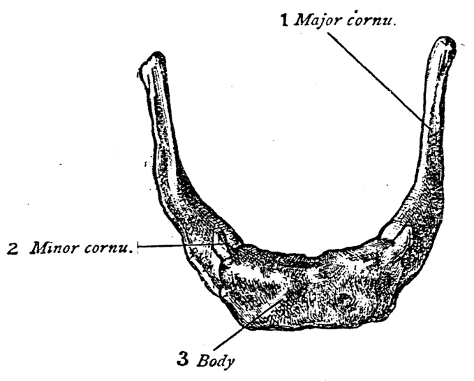
    <figcaption style="font-size: 14px; color: #4a5568; margin-top: 6px;"><em>Tē 16 tô:—Chih-kut tùi téng-bīn kap thâu-chêng kòaⁿ : 1, tāi-kak ; 2, sió-kak ; 3, thé. (Toldt, from Lewis' "Anatomy aud physiology for Nurses").</em></figcaption>
  </figure>

20 **KUT HĒ-THÓNG**

### [Thû-kut]

Thû-kut (鋤骨, *vomer*) tī phīⁿ-khang ê tiong-ng ê ē-tóe, lâi chòe phīⁿ-tiong-keh (鼻中隔, *nasal septum*) ê chi̍t pō͘-hūn.

> **【全漢對照】**
> 鋤骨 (鋤骨, *vomer*) 佇鼻孔的中央的下底，來做鼻中隔 (鼻中隔, *nasal septum*) 的一部份。

---

### [Hā-go̍k-kut / Hā-go̍k-gû]

Hā-go̍k-kut, (*inferior maxilla*): Gân-bīn-thâu-kòa tē it tōa ê kut tī gân-bīn ê ē-pō chhin-chhiūⁿ bé-tôe-thih ê khoán-sit, kiò-chòe hā-go̍k-kut. Chiap-liân tī jiap-su-kut (*temporal*) chòe khó-tōng-koan-chat. Tī chit ê kut ê téng iân ū tàu ē lia̍t ê chhùi-khí. Tī hā-go̍k-kut ê ē-bīn ê āu-bīn pêng lióng pêng ū chi̍t ê kak, kiò-chòe hā-go̍k-gû (下顎隅, *angle of inferior maxilla*, tē 14 tô 8).

> **【全漢對照】**
> 下顎骨, (*inferior maxilla*)：顏面頭蓋第一大的骨佇顏面的下部親像馬蹄鐵的款式，叫做下顎骨。接連佇鑷顳骨 (*temporal*) 做可動關節。佇此個骨的頂沿有鬥下列的喙齒。佇下顎骨的下面ê後面旁兩旁有一個角，叫做下顎隅 (下顎隅, *angle of inferior maxilla*, 第 14 圖 8)。

---

### [Chi̍h-kut]

Tī ām-kún thâu-chêng ê pō͘-ūi, āu-thâu ê téng-bīn, chiū-sī tī chi̍h-kun, ū chi̍t tè kut, kiò-chòe chi̍h-kut (舌骨, *hyoid*). I ê hêng-chōng sī chhin-chhiūⁿ bé-tôe thih ê khoán, hun chòe chi̍t thé, sì kak, tōa-ê nn̄g kak, sòe-ê nn̄g kak (tē 16 tô).

> **【全漢對照】**
> 佇頷頸頭前的部位，喉頭的頂面，就是佇舌根，有一塊骨，叫做舌骨 (舌骨, *hyoid*)。伊的形狀是親像馬蹄鐵的款，分做一體，四角，大的兩角，細的兩角 (第 16 圖)。

---

### [附圖圖說]

**1** *Major cornu.*
**2** *Minor cornu.*
**3** *Body*

Tē 16 tô͘.—Chi̍h-kut tùi téng-bīn kap thâu-chêng kā i khòaⁿ: 1, tāi-kak; 2, sió-kak; 3, thé. (Toldt, from Lewis' "Anatomy aud physiology for Nurses").

> **【全漢對照】**
> 第 16 圖。——舌骨對頂面佮頭前共伊看：1, 大角；2, 小角；3, 體。(Toldt, from Lewis' "Anatomy aud physiology for Nurses")。

---

### [Heng-kut]

Tī thâu-chêng heng-khám piah ê chiàⁿ tong ū chi̍t tè kut, kiò-chòe heng-kut (胸骨, *sternum*). I ê hêng-chōng chhin-chhiūⁿ kó-chá ê kiàm. I ê thé hun chòe saⁿ pō͘-hūn, chiū-sī téng-bīn-ê kiò-chòe chhiú-pìⁿ (手柄, *manubrium*), iā ū kiò-chòe kiàm-pìⁿ; tiong-ng kiò-chòe kiàm-sin (*gladiolus*); bé-ê kiò-chòe kiàm-bé (*ensiform appendix*). Lióng pêng ū kap 7 tùi ê hia̍p-kut

> **【全漢對照】**
> 佇頭前胸坎壁的正中有一塊骨，叫做胸骨 (胸骨, *sternum*)。伊的形狀親像古早的劍。伊的體分做三部份，就是頂面的叫做手柄 (手柄, *manubrium*)，也有叫做劍柄；中央叫做劍身 (*gladiolus*)；尾的叫做劍尾 (*ensiform appendix*)。兩旁有佮 7 對的脅骨

---

Jîn-ài, hoān-sū jím-siū, hoān-sū siong-sìn, hoān-sū ǹg-bāng, hoān-sū thun-lún (I Ko-lîm-to 13: 7).

> **【全漢對照】**
> 仁愛，凡事忍受，凡事相信，凡事盼望，凡事吞忍 (I 哥林多 13: 7)。

<!-- Page 036 End -->

---

<!-- Page 037 Start -->
#### 📖 原書第 37 頁

  <figure style="display: inline-block; margin: 12px; max-width: 90%; text-align: center;">
    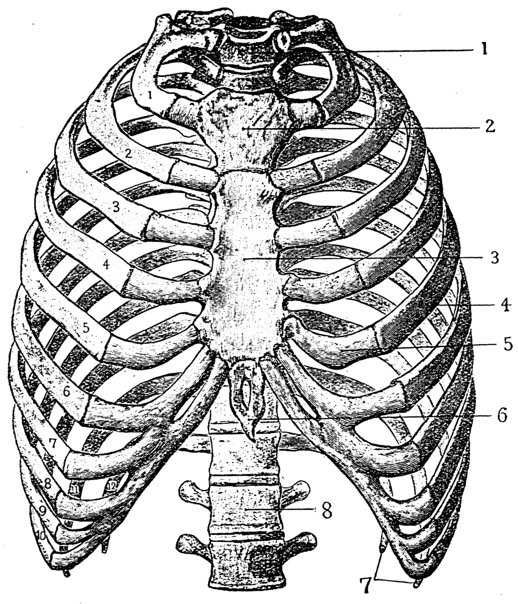
    <figcaption style="font-size: 14px; color: #4a5568; margin-top: 6px;"><em>Tē 17 tô.—Heng-khám ê kut : 1—12, khah sòe jī, sī hiảp-kut ; 1—8, khah tōa jī, sī chiàu ē-bīn :—1, tē it heng-chui-kut ; 2, 3, 6, heng-kut ; 2, kiàm-pîⁿ ; 3, kiàm-sin ; 6, kiàm-bé ; 4, tē gō͘ hiảp-kut ; 5, tē gō͘ hiảp-nńg-kut ; 7, tē 11, 12 hiảp-kut ; 8, io-chui-kut (Cunningham).</em></figcaption>
  </figure>

### HENG-KHÁM Ê KUT (21)

ê chêng-toan saⁿ-liân. Iā téng-bīn ū kap lióng pêng ê só-kut saⁿ-liân (tē 7, 17 tô͘).

> **【全漢對照】**
> 的前端相連。亦頂面有佮兩旁的鎖骨相連（第 7, 17 圖）。

---

![Tē 17 tô͘]

**Tē 17 tô͘.**—Heng-khám ê kut : 1—12, khah sòe jī, sī hia̍p-kut ; 1—8, khah tōa jī, sī chiàu ē-bīn :—1, tē it heng-chui-kut ; 2, 3, 6, heng-kut ; 2, kiàm-pìⁿ ; 3, kiàm-sin ; 6, kiàm-bé ; 4, tē gō͘ hia̍p-kut ; 5, tē gō͘ hia̍p-nńg-kut ; 7, tē 11, 12 hia̍p-kut ; 8, io-chui-kut (Cunningham).

> **【全漢對照】**
> **第 17 圖。**——胸坎的骨：1—12，較細字，是脅骨；1—8，較大字，是照下面：——1，第一胸椎骨；2, 3, 6，胸骨；2，劍柄；3，劍身；6，劍尾；4，第五脅骨；5，第五脅軟骨；7，第 11, 12 脅骨；8，腰椎骨（Cunningham）。

---

### Hiàp-kut

Hiàp-kut 12 tùi ; ta̍k ki hun chòe chi̍t thé, nn̄g toan, chiū-sī āu-toan, chêng-toan. Āu-toan ū kap heng-chui-kut saⁿ-liân. Chêng-toan ū chi̍t ê o, chiū-sī kap hia̍p-nńg-kut saⁿ-liân. Chiah ê hia̍p-nńg-kut téng-bīn 7 tùi ū

> **【全漢對照】**
> ### 脅骨
> 脅骨 12 對；逐枝分做一體、兩端，就是後端、前端。後端有佮胸椎骨相連。前端有一個窩，就是佮脅軟骨相連。諸個脅軟骨頂面 7 對有

---

Nā ōe hō͘ pīⁿ-lâng khah hoaⁿ-hí, an-sim sī lán tio̍h tì-ì.

> **【全漢對照】**
> 若能互病人較歡喜、安心是咱著致意。

<!-- Page 037 End -->

---

<!-- Page 038 Start -->
#### 📖 原書第 38 頁

## 22 KUT HĒ-THÓNG

kap heng-kut saⁿ kau-chiap. Tùi téng-bīn kàu tē 7 tùi chiām-chiām ná tn̂g, tùi hia kàu tē 12 tùi chiām-chiām khah té (tē 17 tô͘).

> **【全漢對照】**  
> 合胸骨相交接。對頂面到第 7 對漸漸若長，對遐到第 12 對漸漸較短（第 17 圖）。

---

### Siōng-chi-kut（上肢骨）

**[邊註：Siōng-chi-kut]**  
Siōng-chi-kut (上肢骨, *Upper extremity*, tē 18 tô͘) : Chhiú kap seng-khu saⁿ-liân ê só͘-chāi kiò-chòe keng-thâu. Keng-thâu,—thâu-chêng sī só-kut, āu-piah sī keng-kah-kut.

> **【全漢對照】**  
> **【邊註：上肢骨】**  
> 上肢骨（上肢骨, *Upper extremity*, 第 18 圖）：手合身軀相連的所在叫做肩頭。肩頭，——頭前是鎖骨，後壁是肩胛骨。

---

### Só-kut（鎖骨）

**[邊註：Só-kut]**  
Só-kut sī hoan-e̍k Lô-má miâ, ū kiò án-ni, sī in-ūi chit ê kut sī lióh-á chhin-chhiūⁿ chá-chêng ê só-sî. Só-kut ū chi̍t thé nn̄g toan (*a shatt and two extremities*). Lāi-toan kap heng-kut saⁿ-liân ; tùi hia thán-hoâiⁿ thàu kàu keng-thâu. Tī keng-thâu ê só͘-chāi só-kut ê gōa-toan ū kap sio-siāng pêng ê keng-kah-kut saⁿ-liân. Só-kut sī tn̂g kut, iā chha-put-to tiong-cháiⁿ ê kāu (tē 18 tô͘).

> **【全漢對照】**  
> **【邊註：鎖骨】**  
> 鎖骨是翻譯羅馬名，有叫按呢，是因為此個骨是略仔親像早前的鎖匙。鎖骨有一體兩端（*a shaft and two extremities*）。內端合胸骨相連；對遐坦橫透到肩頭。佇肩頭的所在鎖骨的外端有合同樣爿的肩胛骨相連。鎖骨是長骨，也差不多中指的厚（第 18 圖）。

---

### Keng-kah-kut（肩胛骨）

**[邊註：Keng-kah-kut]**  
Tī heng-khám ê āu-bīn pêng óa keng-thâu sī keng-kah-kut, ta̍k pêng ū chi̍t tè. Chit ê kut sī saⁿ kak-ê, koh po̍h. Tī i ê gōa-bīn pêng óa téng-bīn ū chi̍t ê lap-u chhián-chhián, kiò-chòe koan-chat-o, beh kap siōng-phok-thâu saⁿ-liân (tē 18 tô͘).

> **【全漢對照】**  
> **【邊註：肩胛骨】**  
> 佇胸坎的後面爿倚肩頭是肩胛骨，逐爿有一塊。此個骨是三角的，閣薄。佇伊的外面爿倚頂面有一個凹窩淺淺，叫做關節窠，欲合上膊頭相連（第 18 圖）。

---

### Siōng-phok-kut（上膊骨）

**[邊註：Siōng-phok-kut]**  
Chhiú ê téng-chatⁿ ū chi̍t tè tn̂g ê kut miâ kiò siōng-phok-kut (*humerus*), ū chi̍t thé, nn̄g toan. Téng-bīn ê thâu ū chi̍t ê tōa kiû ê khoán, kiò-chòe siōng-phok-thâu (*head of humerus*), lâi chhēng tī keng-kah-kut koan-chat-o ê só͘-chāi. Siōng-phok-kut ê ē-toan ū kap jiâu-kut (*radius*) kap chhioh-kut (*ulna*) saⁿ kau-chiap chòe tiú-koan-chat.

> **【全漢對照】**  
> **【邊註：上膊骨】**  
> 手的頂節有一塊長骨名叫上膊骨（*humerus*），有一體，兩端。頂面的頭有一個大球的款，叫做上膊頭（*head of humerus*），來穿佇肩胛骨關節窠的所在。上膊骨的下端有合橈骨（*radius*）合尺骨（*ulna*）相交接做肘關節。

---

Chhiú ē-chat ū n̄g ki kut, kiò-chòe chêng-phok-kut (*forearm*), hun chòe jiâu-kut (橈骨, *radius*) kap chhioh-kut (尺骨, *ulna* ; tē 18 tô͘).

> **【全漢對照】**  
> 手下節有兩枝骨，叫做前膊骨（*forearm*），分做橈骨（橈骨, *radius*）合尺骨（尺骨, *ulna*；第 18 圖）。

---

### Chhioh-kut（尺骨）

**[邊註：Chhioh-kut]**  
Chit ki chhioh-kut sī khah tōa khah tn̂g, iā tī chhiú ê lāi-bīn pêng, ū chi̍t thé, n̄g toan. Chhioh-kut kap jiâu-kut tī téng-bīn ū sio kau-chiap ; iā tī ē-tóe ū sio kau-

> **【全漢對照】**  
> **【邊註：尺骨】**  
> 此枝尺骨是較大較長，也佇手的內面爿，有一體，兩端。尺骨合橈骨佇頂面有相交接；也佇下底有相交……

---

### [頁尾經文]

Péh-chhát-ōe góa oàn-hūn koh iàm-òⁿ, chóng-sī thiàⁿ Lí ê lút-hoat (Si-phian 119: 163).

> **【全漢對照】**  
> 白賊話我怨恨閣厭惡，總是有疼祢的律法（詩篇 119: 163）。

<!-- Page 038 End -->

---

<!-- Page 039 Start -->
#### 📖 原書第 39 頁

  <figure style="display: inline-block; margin: 12px; max-width: 90%; text-align: center;">
    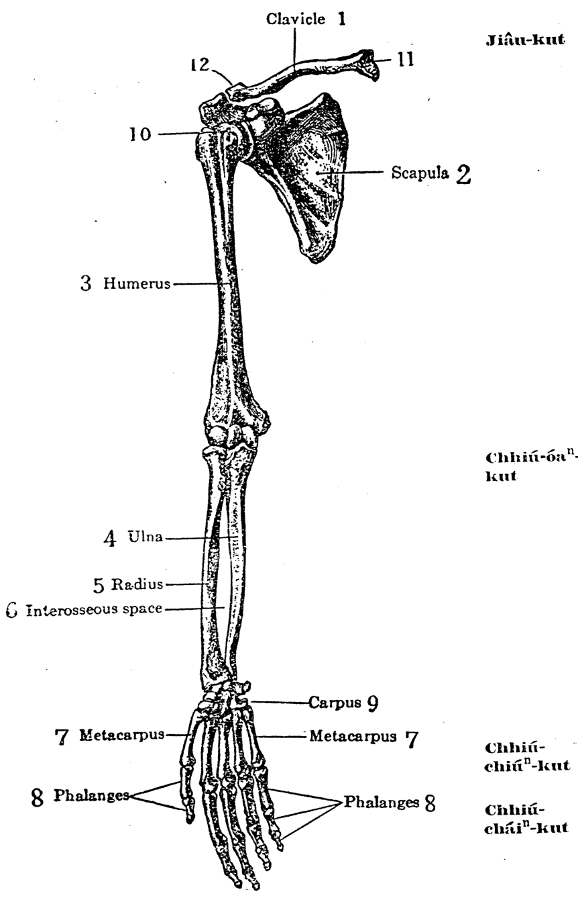
    <figcaption style="font-size: 14px; color: #4a5568; margin-top: 6px;"><em>Tē 18 tô:—Siōng-chi-kut: 1, só-kut; 2, keng-kah-kut ; 3, siōng-phok-kut ; 4, chhioh-kut ; 5, jiâu-kut ; 6, kut tiong-kan ê khang-khiah ; 7, chhiú-chiúⁿ-kut ; 8, chhiú-cháiⁿ-kut ; 9, chhiú-óaⁿ-kut ; 10, siōng-phok-thâu ; 11, só-kut-lāi-toan-koan-chat-o ; 12, só-kut ê gōa-toan. (Toldt, from Lewis’ “Anatomy and Physiology for Nurses” by permission of W. B. Saunders, Co., publishers.)</em></figcaption>
  </figure>

**SIŌNG-CHI-KUT** — **23**

---

### [上肢骨：尺骨與橈骨之關節]

*(...chiap)*. Chhioh-kut ê téng-toan ê piⁿ-á ū lap-u ê só͘-chāi hō͘ jiâu-kut thang tàu. Jiâu-kut ê ē-toan ê piⁿ-á ū lap-u, hō͘ chhioh-kut thang tàu. Chí nñg ki kut nā choán-lâi choán-khì, chhioh-kut khah tiām-tiām, jiâu-kut ōe choán khah hn̄g. Chí nñg ki kut ōe saⁿ pho̍ah, só͘-í chhiú ōe choán-lâi choán-khì (tē 18 tô͘).

*[邊註：Jiâu-kut]*

> **【全漢對照】**
> *(……接)*。尺骨的頂端的邊仔有凹凹的所在，互橈骨通鬥。橈骨的下端的邊仔有凹凹，互尺骨通鬥。此兩枝骨若轉來轉去，尺骨較恬恬，橈骨會轉較遠。此兩枝骨會相絆（相跨），所以手會轉來轉去（第 18 圖）。
> 
> *[邊註：橈骨]*

---

### [手腕骨]

Chhiú-óaⁿ-kut (carpus) ū 8 tè kut pâi-lia̍t chòe nñg chōa, kap chêng-phok-kut ê ē-toan saⁿ chhēng ; ē-chōa kap chhiú-chiúⁿ-kut saⁿ-chiap.

*[邊註：Chhiú-óaⁿ-kut]*

> **【全漢對照】**
> 手腕骨（carpus）有 8 塊骨排列做兩排，佮前膊骨的下端相撐；下排佮手掌骨相接。
> 
> *[邊註：手腕骨]*

---

### [手掌骨與手指骨]

Chhiú-chiúⁿ-kut (手掌骨, metacarpus) ū 5 ki. Chhiú-cháiⁿ-kut ū 14 ki. Chiah ê kut hō͘ chíng-thâu-á ōe mi-óa ōe ni-liam. Chhiú-cháiⁿ-kut ū saⁿ chat, tók-tók tōa-thâu-bú sī nñg chat. Tōa-

*[邊註：Chhiú-chiúⁿ-kut / Chhiú-cháiⁿ-kut]*

> **【全漢對照】**
> 手掌骨（手掌骨，metacarpus）有 5 枝。手指骨有 14 枝。諸的骨互指頭仔會微倚會黏黐。手指骨有三節，獨獨大頭拇是兩節。大……
> 
> *[邊註：手掌骨 / 手指骨]*

---

### [圖附說明]

**Tē 18 tô͘:—Siōng-chi-kut:** 1, só-kut; 2, keng-kah-kut; 3, siōng-phok-kut; 4, chhioh-kut; 5, jiâu-kut; 6, kut tiong-kan ê khang-khiah; 7, chhiú-chiúⁿ-kut; 8, chhiú-cháiⁿ-kut; 9, chhiú-óaⁿ-kut; 10, siōng-phok-thâu; 11, só-kut-lāi-toan-koan-chat-o; 12, só-kut ê gōa-toan. (Toldt, from Lewis' "Anatomy and Physiology for Nurses" by permission of W. B. Saunders, Co., publishers.)

> **【全漢對照】**
> **第 18 圖：——上肢骨：** 1, 鎖骨；2, 肩胛骨；3, 上膊骨；4, 尺骨；5, 橈骨；6, 骨中間的空隙；7, 手掌骨；8, 手指骨；9, 手腕骨；10, 上膊頭；11, 鎖骨內端關節窩；12, 鎖骨的外端。（Toldt，取材自 Lewis 著之《護理專用解剖生理學》，經出版商 W. B. Saunders 公司授權使用。）

---

### [頁尾格言]

Jîn-ài bô khoài siu-khì (I Ko-lîm-to 13 : 5.)

> **【全漢對照】**
> 仁愛無快受氣（哥林多前書 13 : 5。）

<!-- Page 039 End -->

---

<!-- Page 040 Start -->
#### 📖 原書第 40 頁

  <figure style="display: inline-block; margin: 12px; max-width: 90%; text-align: center;">
    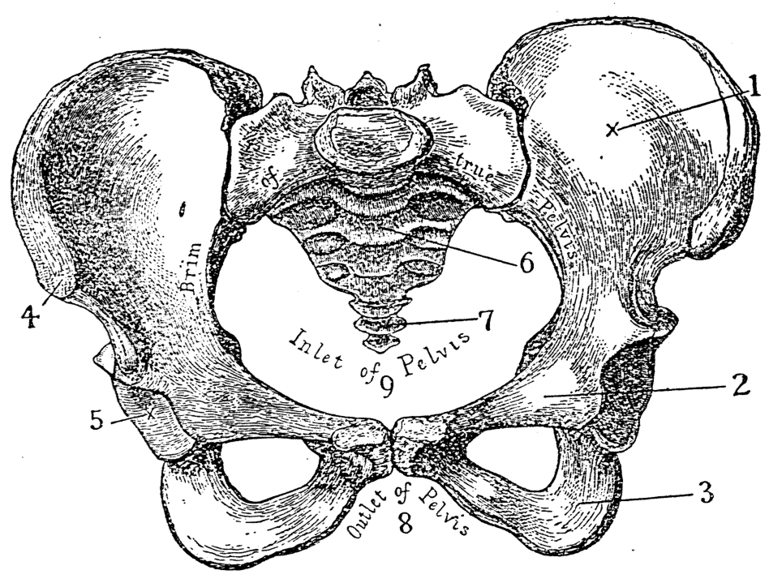
    <figcaption style="font-size: 14px; color: #4a5568; margin-top: 6px;"><em>Tē 19 tô:—Lú ê kut-pôaⁿ 1, tûg-kut; 2, thí-kut; 3, chō-kut; 4, chêng-siōng-kek; 5, khū-o; 6, chiàn-kut, 7, bí-lû-kut; 8, kut-pôaⁿ ê hā-kháu; 9, kut-pôaⁿ ê siōng-kháu (From Gray's “Anatomy,” by permission of Longmans, Green & Co., publishers.)</em></figcaption>
  </figure>

### 24 KUT HĒ-THÓNG

thâu-bú koan-chat chin oa̍h-tāng, tē it chíuⁿ-kut kap chhiú-óaⁿ-kut koh khah oa̍h-tāng.

> **【全漢對照】**
> 頭拇關節真活動，第一掌骨佮手碗骨koh較活動。

---

### [Hā-chi-kut / Bô-miâ-kut]

Chek-thiāu-kut (脊柱骨) ē-tóe siang pêng ū chi̍t tè tōa tè kut, kiò-chòe bô-miâ-kut (*os innominatum*). Chi̍t ê bô-miâ-kut sòe-hàn ê sî-chūn hun chòe saⁿ tè, tōa-hàn ê sî-chūn chiâⁿ chi̍t thé (tē 7, 19 tô͘). Chit ê bô-miâ-kut hun

> **【全漢對照】**
> **[下肢骨 / 無名骨]**
> 脊柱骨（脊柱骨）下底雙朋有一塊大塊骨，叫做無名骨（*os innominatum*）。一个無名骨細漢的時陣分做三塊，大漢的時陣成一體（第 7、19 圖）。這个無名骨分

---

### [Tô͘-chí / 圖解]

Tē 19 tô͘.—Lú ê kut-phôaⁿ 1, tn̂g-kut ; 2, thí-kut ; 3, chō-kut ; 4, chêng-siōng-kek ; 5, khū-o ; 6, chiàn-kut, 7, bí-lû-kut ; 8, kut-phôaⁿ ê hā-kháu ; 9, kut-poâⁿ ê siōng-kháu (From Gray's “Anatomy,” by permission of Longmans, Green & Co., publishers.)

> **【全漢對照】**
> 第 19 圖。——女的骨盤 1, 腸骨；2, 恥骨；3, 坐骨；4, 前上棘；5, 臼窩；6, 薦骨，7, 尾閭骨；8, 骨盤的下口；9, 骨盤的上口（From Gray's “Anatomy,” by permission of Longmans, Green & Co., publishers.）

---

### [Tn̂g-kut]

chòe saⁿ phō, téng-bīn-ê kiò-chòe tn̂g-kut (腸骨, *ilium*). Tī pak-tó-piⁿ ê siang pêng tī ē-io ê só͘-chāi ōe bong-tio̍h teh phok-chhut-lâi ê kut, chiū-sī chit ê tn̂g-kut. Tú-tú tī thâu-chêng siōng téng-bīn hit tè kiò-chòe chêng-siōng-kek (前上棘, *anterior superior spine*).

> **【全漢對照】**
> **[腸骨]**
> 做三部，頂面的叫做腸骨（腸骨，*ilium*）。佇腹肚邊的雙朋佇下腰的所在會摸著咧蹼出來的骨，就是這个腸骨。拄拄佇頭前頂頂面彼塊叫做前上棘（前上棘，*anterior superior spine*）。

---

### [Chō-kut]

Bô-miâ-kut ê ē-tóe pō͘-hūn, kiò-chòe chō-kut (坐骨, *ischium*). Chit ê kut lán teh chē í ê sî, tú-tú khòa tī í-téng.

> **【全漢對照】**
> **[坐骨]**
> 無名骨的下底部分，叫做坐骨（坐骨，*ischium*）。這个骨咱咧坐椅的時，拄拄跨佇椅頂。

---

Ta̍k hāng sū tiòh chīn-tiong.

> **【全漢對照】**
> 各項事著盡忠。

<!-- Page 040 End -->

---

<!-- Page 041 Start -->
#### 📖 原書第 41 頁

**KUT-PÔAⁿ, TŌA-THÚI-KUT**　　**25**

---

### [Thí-kut / 恥骨]

Tē saⁿ pō͘, sī tī ē-tóe thâu-chêng bīn-ê, kiò-chòe thí-kut (耻骨, *pubis*). Nñg ê chó-iū thí-kut ê thâu-chêng ū chit ê thí-kut-nńg-kut lâi saⁿ-liân (*symphysis pubis*; tē 19 tô).

> **【全漢對照】**
> 第三部，是佇下底頭前面ê，叫做恥骨（耻骨，*pubis*）。兩個左右恥骨ê頭前有一個恥骨軟骨來相連（*symphysis pubis*；第19圖）。

---

### [Kut-pôaⁿ / 骨盤]

Nñg tè bô-miâ-kut tī thâu-chêng ū saⁿ-liân tī pak-tó͘ bé ê só͘-chāi, chhin-chhiūⁿ tú-á teh kóng. Tī āu-bīn lióng pêng ê tiong-kan ū chiàn-kut (*sacrum*) kap bô-miâ-kut saⁿ-liân, lóng chòe kut-pôaⁿ (骨盤). Chit ê só͘-chāi sī tóe tng-á, pông-kong, tōa-tng ê ē-tóe, kap chú-kiong. Chit ê kut-pôaⁿ sī put-chí iàu-kín ê só͘-chāi, in-ūi seng-sán ê sî-chūn, gín-ná tiòh tùi hia kè. Lâm-lú ê kut-pôaⁿ ū chha, pâi tī ē-tóe:

> **【全漢對照】**
> 兩塊無名骨佇頭前有相連佇腹肚尾ê所在，親像拄仔咧講。佇後面兩邊ê中間有薦骨（*sacrum*）佮無名骨相連，攏做骨盤（骨盤）。此個所在是底腸仔、膀胱、大腸ê下底，佮子宮。此個骨盤是不止要緊ê所在，因為生產ê時陣，囡仔著對遐過。男女ê骨盤有差，排佇下底：

---

### [Lâm-lú ê kut-pôaⁿ ê cheng-chha / 男女骨盤之精差]

| Lâm-ê (男ê) | Lú-ê (女ê) |
| :--- | :--- |
| 1. Téng-bīn khah sòe, iā khah oeh. | 1. Téng-bīn khah tōa, iā khah khoah. |
| 2. Lāi-bīn khah sòe iā khah chhim. | 2. Lāi-bīn khah tōa, iā khah chhián. |
| 3. Ē-kháu sī oéh koh sòe. | 3. Ē-kháu khoah koh tōa. |
| 4. Kut khah chho͘, in-ūi kun-bah khah ióng, sī tùi ta-pó͘-lâng khah siông teh chòe khah tāng ê kang. | 4. Kut khah iù, in-ūi hū-jîn-lâng khah bô hiah ióng, iā khah siông teh chòe khah khin ê kang. |

> **【全漢對照】**
> 
> **男ê：**
> 1. 頂面較細，也較狹。
> 2. 內面較細也較深。
> 3. 下口是狹閣細。
> 4. 骨較粗，因為筋肉較勇，是對查甫人較常咧做較重ê工。
> 
> **女ê：**
> 1. 頂面較大，也較闊。
> 2. 內面較大，也較淺。
> 3. 下口闊閣大。
> 4. 骨較幼，因為婦仁人較無遐勇，也較常咧做較輕ê工。

---

### [Khū-o / 臼窩]

Chiah ê kut kap tōa-thúi-kut saⁿ kau-chiap. Ū chit só͘-chāi chhim-chhim chhin-chhiūⁿ cheng-khū, kiò-chòe khū-o; tōa-thúi-kut-thâu tàu tī khū-o ê só͘-chāi kàu chhim-chhim, chiah put-lūn khû-teh, khiā-teh, á-sī kiâⁿ lō͘, put-chí kian-kò͘.

> **【全漢對照】**
> 諸個骨佮大腿骨相交接。有一所在深深親像舂臼，叫做臼窩；大腿骨頭鬥佇臼窩ê所在到深深，才不論踞咧、徛咧、抑是行路，不止堅固。

---

### [Tōa-thúi-kut / 大腿骨]

Tōa-thúi-kut (*femur*) sǹg sī thong seng-khu tē it tōa, tē it ióng-ê. Tōa-thúi-kut hun chit thé, nñg toan. Téng-bīn ū chit ê chhin-chhiūⁿ kiû ê khóan, thó͘-chhut tī téng-bīn

> **【全漢對照】**
> 大腿骨（*femur*）算是通身軀第一大，第一勇ê。大腿骨分一體，兩端。頂面有一個親像球ê款，突出佇頂面……

---

### [頁底格言]

Iòh m̄-thang pàng-hē pīⁿ-lâng ê sin-piⁿ, tiòh siu tī iòh-tû-nih.

> **【全漢對照】**
> 藥毋通放下病人的身邊，著收佇藥櫥裡。

<!-- Page 041 End -->

---

<!-- Page 042 Start -->
#### 📖 原書第 42 頁

  <figure style="display: inline-block; margin: 12px; max-width: 90%; text-align: center;">
    
    <figcaption style="font-size: 14px; color: #4a5568; margin-top: 6px;"><em>Tē 20 tô:—Hā-chi-kut : 1, bô-miâ-kut ; 2, tōa-thúi-kut-thâu ; 3, tōa-choán-chú ; 4, sió-choán-chú ; 5, tōa-thúi-kut ; 6, tōa-thúi-kut ê gōa-koan-chat-khò ; 7, tōa-thúi-kut ê lāi-koan-chat-khò ; 8, chhek-kài-kut ; 9, kēng-kut ê lāi-koan-chat-khò ; 10, kēng-kut ê gōa-koan-chat-khò ; 11, kēng-kut-siōng-toan ; 12, kēng-kut ; 13, hūi-kut ; 14, kut-tiong khang-khiah ; 15, kēng-kut-chiat ; 16, lāi-khòa ; 17, gōa-khòa ; 18, hū-kut ; 19, chek-kut ; 20, chí-kut (Toldt).</em></figcaption>
  </figure>

26  **KUT HĒ-THÓNG**

---

### [Tōa-thúi-kut]

ê lāi-bīn pêng, kiò-chòe tōa-thúi-kut-thâu. Chit ê kut-thâu tàu tī bô-miâ-kut ê khū-o. Tōa-thúi-kut ê ē-toan lāi-gōa ū nn̄g ê tút-khí, lâi kap kēng-kut chòe koan-chat, chit-ê kiò-chòe lāi kap gōa koan-chat-khò (內及外關節髁, *inner and outer condyles of femur*). Tī chí nn̄g ê lāi-gōa-koan-chat-khò ê thâu-chêng bīn, ū chi̍t ê lap-u, kiò-chòe chhek-kài-o (膝蓋窩); tī-chia kap chhek-kài-kut (*patella*) saⁿ-liân (tē 20 tô͘).

> **【全漢對照】**
> 的內面爿，叫做大腿骨頭。這个骨頭鬥佇無名骨的臼窩。大腿骨的下端內外有兩個突出，來佮脛骨做關節，這个叫做內及外關節髁（內及外關節髁，*inner and outer condyles of femur*）。佇此兩個內外關節髁的頭前面，有一個凹窩，叫做膝蓋窩（膝蓋窩）；佇遮佮膝蓋骨（*patella*）相連（第 20 圖）。

---

### Chhek-kài-kut

Chit ê chhek-

> **【全漢對照】**
> ### 膝蓋骨
> 這个膝──

---

### [Tē 20 tô͘ Sòat-bêng]

**Tē 20 tô͘.**—Hā-chi-kut: 1, bô-miâ-kut; 2, tōa-thúi-kut-thâu; 3, tōa-choán-chú; 4, sió-choán-chú; 5, tōa-thúi-kut; 6, tōa-thúi-kut ê gōa-koan-chat-khò; 7, tōa-thúi-kut ê lāi-koan-chat-khò; 8, chhek-kài-kut; 9, kēng-kut ê lāi-koan-chat-khò; 10, kēng-kut ê gōa-koan-chat-khò; 11, kēng-kut-siōng-toan; 12, kēng-kut; 13, hūi-kut; 14, kut-tiong khang-khiah; 15, kēng-kut-chiat; 16, lāi-khòa; 17, gōa-khòa; 18, hū-kut; 19, chek-kut; 20, chí-kut (Toldt).

> **【全漢對照】**
> **第 20 圖。**──下肢骨：1, 無名骨；2, 大腿骨頭；3, 大轉子；4, 小轉子；5, 大腿骨；6, 大腿骨的外關節髁；7, 大腿骨的內關節髁；8, 膝蓋骨；9, 脛骨的內關節髁；10, 脛骨的外關節髁；11, 脛骨上端；12, 脛骨；13, 腓骨；14, 骨中間隙；15, 脛骨脊；16, 內踝；17, 外踝；18, 跗骨；19, 蹠骨；20, 趾骨（Toldt）。

---

Iû ê chit ōe hō͘ chhiū-leng, á-sī iû-pò͘ ōe pháiⁿ-khì.

> **【全漢對照】**
> 油的汁會互樹奶，抑是油布會衰去（壞去）。

<!-- Page 042 End -->

---

<!-- Page 043 Start -->
#### 📖 原書第 43 頁

### HĀ-THÚI-KUT (27)

kài-kut sī píⁿ-píⁿ, chhin-chhiūⁿ lát-chí, iā saⁿ kak hêng. Chit ê kut sī tī sì-thâu-kó-kun ê kiān (四頭股筋腱, *quadriceps extensor tendon*) ê lāi-bīn, tú-tú sī chiàu téng-bīn só kóng ê só͘-chāi. I ê thâu-chêng bīn chho͘-chho͘, āu-bīn kút-kút, ū lap-thap ê koan-chat bīn.

> **【全漢對照】**  
> 蓋骨是扁扁，親像栗子，也三角形。這个骨是佇四頭股筋腱（四頭股筋腱，*quadriceps extensor tendon*）的內面，拄拄是照頂面所講的所在。伊的頭前面粗粗，後面滑滑，有凹凸的關節面。

---

Tī tōa-thúi ê ē-tóe ū n̄g ki kut kiò-chòe hā-thúi-kut. Chit ê hā-thúi-kut ū n̄g ki tn̂g ê kut, tī gōa-bīn khah sòe ki kiò-chòe hūi-kut (腓骨, *fibula*), tī lāi-bīn khah tōa kiò-chòe kēng-kut (脛骨, *tibia*). Chiah ê kut hun chòe ta̍k ki chi̍t thé, n̄g toan. Tī kēng-kut ê téng-toan ū n̄g ê koan-chat-o, kap tōa-thúi-kut lāi-gōa-koan-chat-khò saⁿ kau-chiap, chòe chhek-koan-chat (膝關節, *knee-joint*). Tī kēng-kut téng-toan ê gōa-bīn pêng, ū kap hūi-kut ê téng-toan saⁿ-liân. Kēng-kut ê ē-toan ū chi̍t ê thap ê koan-chat bīn. Tī ē-toan ê gōa-bīn pêng piⁿ-á, ū kap hūi-kut saⁿ-liân (tē 20 tô͘).
*(旁註：Kēng-kut / Hūi-kut)*

> **【全漢對照】**  
> 佇大腿的下底有兩枝骨叫做下腿骨。這个下腿骨有兩枝長的骨，佇外面較細枝叫做腓骨（腓骨，*fibula*），佇內面較大叫做脛骨（脛骨，*tibia*）。諸个骨分做逐枝一體、兩端。佇脛骨的頂端有兩個關節窩，與大腿骨內外關節髁相交接，做膝關節（膝關節，*knee-joint*）。佇脛骨頂端的外面朋，有與腓骨的頂端相連。脛骨的下端有一個塌的關節面。佇下端的外面朋邊仔，有與腓骨相連（第 20 圖）。
*(旁註：脛骨 / 腓骨)*

---

Hūi-kut ē-toan gōa-bīn piⁿ-á phok-chhut-lâi tī phê-ē ê só͘-chāi, kiò-chòe gōa-khòa (外踝, *external malleolus*).
*(旁註：Gōa-khòa)*

> **【全漢對照】**  
> 腓骨下端外面邊仔凸出來佇皮下的所在，叫做外踝（外踝，*external malleolus*）。
*(旁註：外踝)*

---

Kēng-kut ē-toan lāi-bīn piⁿ-á phok-chhut-lâi tī phê-ē ê só͘-chāi, kiò-chòe lāi-khòa (內踝, *internal malleolus*).
*(旁註：Lāi-khòa)*

> **【全漢對照】**  
> 脛骨下端內面邊仔凸出來佇皮下的所在，叫做內踝（內踝，*internal malleolus*）。
*(旁註：內踝)*

---

Kēng-kut kap hūi-kut ē-toan ū chi̍t ê lap-u, kap kha ê hū-kut (跗骨, *tarsus*) saⁿ tàu, lâi chòe koan-chat.

> **【全漢對照】**  
> 脛骨與腓骨下端有一個凹塢，與腳的跗骨（跗骨，*tarsus*）相湊，來做關節。

---

Kēng-kut kap hūi-kut ê ē-tóe koh ū hū-kut 7 tè, chek-kut (蹠骨, *metatarsus*) 5 tè, kap chí-kut 14 tè. Chiah ê kut thang kap chhiú ê chhiú-óaⁿ-kut, chhiú-chiúⁿ-kut, kap chhiú-cháiⁿ-kut saⁿ pí. Chóng-sī chhiú-óaⁿ-kut ū 8 tè, hū-kut ū 7 tè nā-tiāⁿ; iā hū-kut m̄-sī pâi-lia̍t tī n̄g chōa chhin-chhiūⁿ tī chhiú-nih. Tī ē-tóe chêng-bīn hiah ê sì tè, ū pâi-lia̍t chòe chi̍t chōa, thang kap chhiú-óaⁿ tē jī chōa saⁿ pí. Téng-bīn-ê ū saⁿ tè kut: chi̍t-tè kiò-chòe kun-kut(跟骨, kha-āu-tiⁿ, *os calcis*); koh chi̍t tè, kiò-chòe kū-kut (距骨, *astragalus*); chit tè ê téng-bīn ū tàu tī kēng-
*(旁註：Hū-kut, chek-kut, chí-kut)*

> **【全漢對照】**  
> 脛骨與腓骨的下底擱有跗骨 7 塊、蹠骨（蹠骨，*metatarsus*）5 塊，與趾骨 14 塊。諸个骨通與手的「手腕骨」、「手掌骨」、與「手指骨」相比。總是手腕骨有 8 塊，跗骨有 7 塊若定；也跗骨伓是排列佇兩行親像佇手裡。佇下底前面遐的 4 塊，有排列做一行，通與手腕第二行相比。頂面的有 3 塊骨：一塊叫做跟骨（跟骨，腳後踵，*os calcis*）；擱一塊，叫做距骨（距骨，*astragalus*）；這塊的頂面有湊佇脛-
*(旁註：跗骨、蹠骨、趾骨)*

---

### [頁底格言]

Iòh-kan m̄-thang hē tī iòh-toaⁿ-téng.

> **【全漢對照】**  
> 藥罐毋通下佇藥單頂。

<!-- Page 043 End -->

---

<!-- Page 044 Start -->
#### 📖 原書第 44 頁

  <figure style="display: inline-block; margin: 12px; max-width: 90%; text-align: center;">
    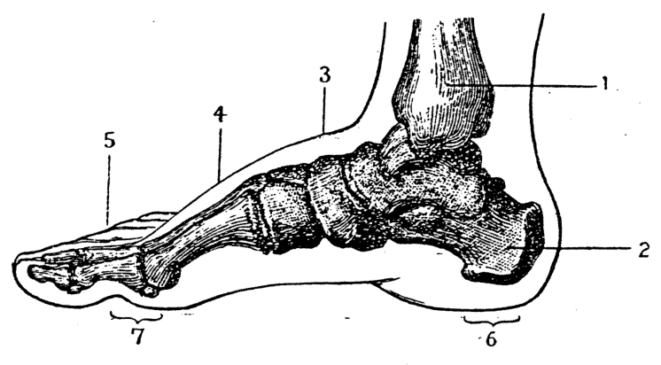
    <figcaption style="font-size: 14px; color: #4a5568; margin-top: 6px;"><em>Tē 21 tô:—Kha kut tùi lāi-bīn pêng kā i khòan : 1, kēng-kut ê lāi-khòa ; 2, kun-kut ; 3, hû-kut ; 4, chek-kut ; 5, chí-kut ; 6, kiô ê āu-bīn kha ; 7, kiô ê thâu-chêng kha.</em></figcaption>
  </figure>
  <figure style="display: inline-block; margin: 12px; max-width: 90%; text-align: center;">
    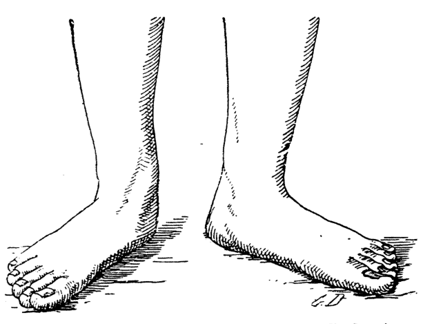
    <figcaption style="font-size: 14px; color: #4a5568; margin-top: 6px;"><em>Tē 22 tô:—Píⁿ-pîⁿ-kha (Rose and Carless).</em></figcaption>
  </figure>

### KUT HĒ-THÓNG（骨系統）

#### [Chiok-koan-chat]
...kut kap hûi-kut ê lap-u, chòe chiok-koan-chat (足關節, *ankle joint*); iáu ū koh chi̍t tè, kiò-chòe chûn-chōng-kut (舟狀骨, *scaphoid*).

> **【全漢對照】**
> ……骨佮腓骨的凹塢，做足關節（足關節, *ankle joint*）；猶有閣一塊，叫做舟狀骨（舟狀骨, *scaphoid*）。

---

Tī chiah ê kut ê chêng-bīn ū 4 tè pâi-lia̍t chòe chi̍t chōa, kap chek-kut saⁿ-liân (tē 20 tô͘).

> **【全漢對照】**
> 佇諸個骨的前面有 4 塊排列做一帶，佮蹠骨相連（第 20 圖）。

---

#### [Chek-kut]
Chek-kut ū 5 ki kap chhiú-chiúⁿ-kut saⁿ pí; iā tī i ê chêng-bīn ū chí-kut 14 ki, kap chhiú-cháiⁿ-kut saⁿ pí.

> **【全漢對照】**
> 蹠骨有 5 支佮手掌骨相比；也佇伊的前面有指骨 14 支，佮手指骨相比。

---

> **Tē 21 tô͘.**—Kha kut tùi lāi-bīn pêng kā i khòaⁿ: 1, kēng-kut ê lāi-khòa; 2, kun-kut; 3, hū-kut; 4, chek-kut; 5, chí-kut; 6, kiô ê āu-bīn kha; 7, kiô ê thâu-chêng kha.
> 
> （**第 21 圖.**—跤骨對內面爿共伊看：1, 脛骨的內踝；2, 跟骨；3, 跗骨；4, 蹠骨；5, 指骨；6, 橋的後面跤；7, 橋的頭前跤。）

---

#### [Kha ún-ku-kiô]
Chiah ê sè tè ê kut ha̍p-chia̍p-ê, khoán-sit chin kî, téng-bīn phòng-khí-lâi, ē-tóe lap-lo̍h-khì. Kha-kut ê hêng-chōng sī án-ni, hō͘ lâng tōng-chok chin ha̍p-gî. Kha sī chhin-chhiūⁿ ún-ku-kiô ê khoán-sit, āu-bīn sī kun-kut ta̍h tī tōe-nih, chêng-bīn sī chí-kut iā ta̍h tī tōe-nih. Khòaⁿ hit ê 21 tô͘ chiū chai. Nā kha sit-lo̍h i ê hêng-chōng hit ê pīⁿ miâ kiò-chòe pīⁿ-pīⁿ-kha (扁平足, *flat foot*; tē 22 tô͘).

> **【全漢對照】**
> 諸個細塊的骨合接的，款式真奇，頂面膨起來，下底凹落去。跤骨的形狀是按呢，予人動作真合宜。跤是親像伛佝橋的款式，後面是跟骨踏佇地裡，前面是指骨也踏佇地裡。看彼個 21 圖就知。若跤失落伊的形狀彼個病名叫做扁扁跤（扁平足, *flat foot*；第 22 圖）。

---

> **Tē 22 tô͘.**—Pīⁿ-pīⁿ-kha (*Rose and Carless*).
> 
> （**第 22 圖.**—扁扁跤 (*Rose and Carless*)。）

---

Chiah ê 26 tè kut saⁿ chia̍h-chhēⁿ ha̍p chòe chi̍t ki...

> **【全漢對照】**
> 諸個 26 塊骨相食喙合作一支……

---

Góa siat-sú chòe sian-ti bêng-pe̍k lóng-chóng ê ò-biāu kap lóng-chóng ê chai-bat; koh siat-sú ū chiâu-pī ê sìn, kàu-gia̍h lâi î-soaⁿ, nā bô jîn-ài, góa chiū bôe sǹg chòe sī sím-mi̍h (I Ko-lîm-to 13: 2).

> **【全漢對照】**
> 我設使做先知明白攏總的奧妙佮攏總的知捌；閣設使有齊備的信，到額來移山，若無仁愛，我就袂算做是甚物（I 哥林多 13: 2）。

<!-- Page 044 End -->

---

<!-- Page 045 Start -->
#### 📖 原書第 45 頁

### PÀK-KHA（29）

kha, ì-sù sī ài hō͘ lâng ē hó kiâⁿ-ta̍h, khin-phiò. Siat-sú kha kan-ta ū chi̍t tè kut nā-tiāⁿ, tek-khak sī khah oh-tit kiâⁿ. Kha nā pák ân ia̍h sī án-ni; só͘-í khòaⁿ-kìⁿ pák-kha ê hū-jîn-lâng teh kiâⁿ-lō͘, sī ná chhin-chhiūⁿ teh ta̍h khiau chi̍t-poaⁿ-iūⁿ.

> **【全漢對照】**
> 腳，意思是愛予人會好行踏、輕飄。設使腳干焦有一塊骨若定，的確是較僫得行。腳若縛ân亦是按呢；所以看見縛腳的婦人人咧行路，是若親像咧踏蹺一般樣。

---

*Pīⁿ-lâng nā kóng pheng-tòa siuⁿ ân, tio̍h liâm-piⁿ khì sûn khòaⁿ ū iáⁿ á-bô.

> **【全漢對照】**
> 病人若講繃帶傷ân，著連鞭去巡看有影抑無。

<!-- Page 045 End -->

---

