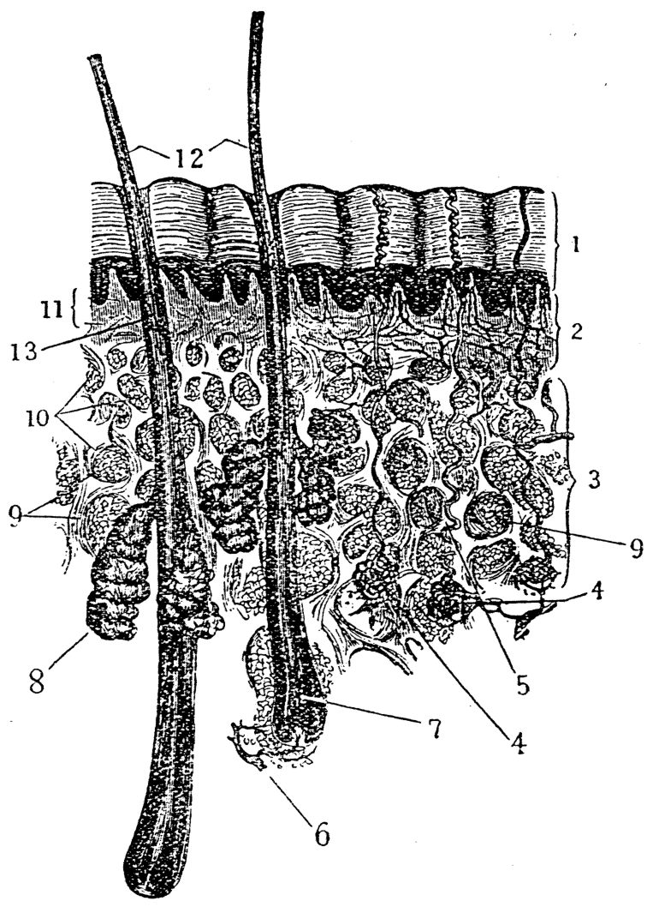
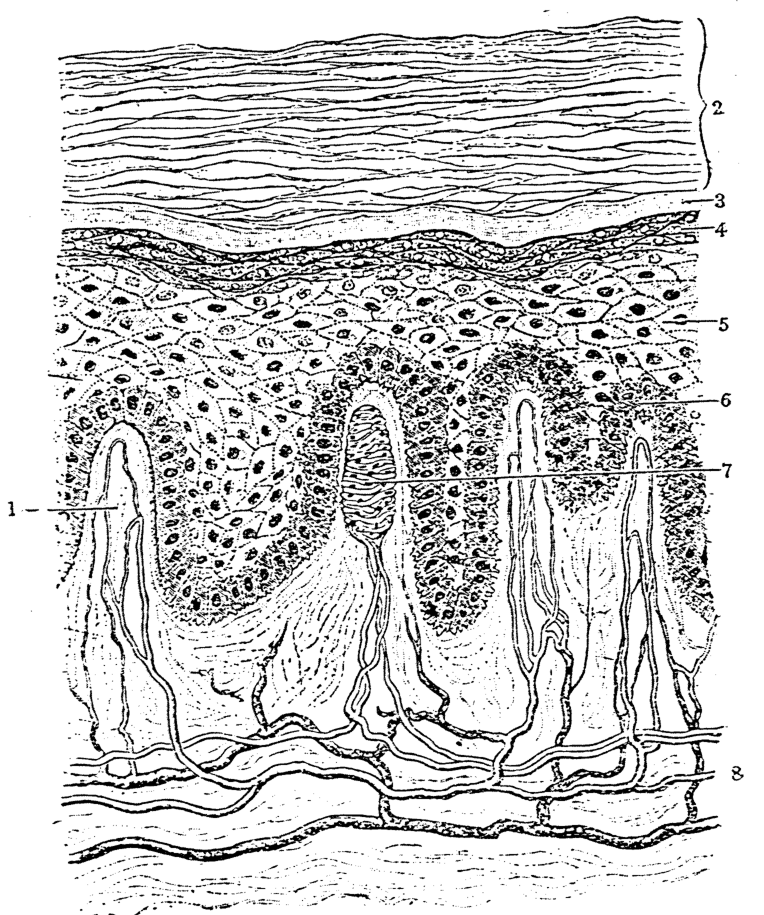
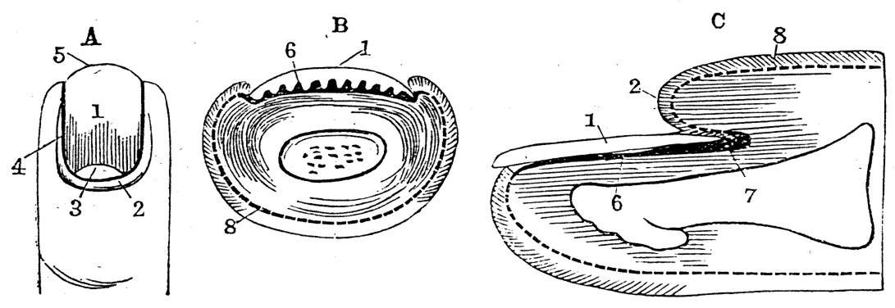

# 第八章 皮膚 (Phê-hu)

> **所屬篇章**：第一篇 解剖學及生理學 (Kái-phò͘-ha̍k kap Seng-lí-ha̍k)
> **原書頁碼**：第 126 頁 ～ 第 131 頁 (已收錄 6/6 頁)

---

<!-- Page 126 Start -->
#### 📖 原書第 126 頁

### TĒ 8 CHIUⁿ
### LŪN PHÊ-HU

> **【全漢對照】**
> ### 第 8 章
> ### 論皮膚

---

#### [Phê-hu ê chok-iōng]

Phê-hu pau tī seng-khu ê gōa-bīn; i ê chok-iōng sī chiàu ē-tóe :
1. Sī pó-hō͘ kun-bah.
2. Ū chhiok-kak ê chok-iōng, chiū-sī bong-tio̍h gōa ūi chiū chai ê khoán-sit. Sī in-ūi phê-hu ū chhiok-kak-sió-thé; i ê lāi-bīn ū sîn-keng ê bé-liu. Chhiok-kak (觸覺, *touch sense*), hiah-ê ê tē it gâu ê só͘-chāi, chiū-sī chhiú-chíng-thâu-á, chih ê bé-liu, chhùi-tûn.
3. Phê sī pâi-siat-khì ê chit-ê; i ê chok-iōng sī chhut kōaⁿ. Kōaⁿ sī chúi ê chit. Kōaⁿ, chi̍t pah hūn ê lāi-bīn, nn̄g hūn sī kōaⁿ-sng ê iâm-hun, kap iû.
4. Phê ū khip-siu ê khùi-la̍t, chhin-chhiūⁿ súi-gûn lūi ê io̍h, ōe khip-ji̍p tī phê-hu-lāi.
5. Sī tiau-hô lâng seng-khu ê thé-un; chhin-chhiūⁿ nā thiⁿ-khì khah joa̍h ê sî, hiah ê hān-chôaⁿ-kńg ê bé-liu tiùⁿ koh khui, só͘-í kōaⁿ nā lâu-chhut-lâi, lâng chiū khah liâng-léng, khòaⁿ-oa̍h. Nā thiⁿ-khì khah léng ê sî, hiah ê kńg ōe khah kiu-oá, khah bô hoat kōaⁿ, iā hiah ê khah oá tī phê-hu ê huih-kńg, ōe kiu, jia̍t-khì chiū khah bōe tùi phê-hu lī-khui seng-khu, hoán-tńg, tòa tī seng-khu-lāi, só͘-í lâng chiū ōe sio-lō.

> **【全漢對照】**
> #### [皮膚的作用]
> 
> 皮膚包佇身軀的外面；伊的作用是照下底：
> 1. 是保護筋肉。
> 2. 有觸覺的作用，就是摸著外位就知兮款色。是因為皮膚有觸覺小體；伊的內面有神經的尾溜。觸覺（觸覺，*touch sense*），遐的兮第一𠢕的所在，就是手指頭仔、舌的尾溜、嘴唇。
> 3. 皮是排泄器的一個；伊的作用是出汗。汗是水兮質。汗，一百份的內面，兩份是汗酸的鹽份，佮油。
> 4. 皮有吸收的氣力，親像水銀類的藥，會吸入佇皮膚內。
> 5. 是調和人身軀的體溫；親像若天氣較熱的時，遐的汗泉管的尾溜脹閣開，所以汗若流出來，人就較涼冷、快活。若天氣較冷的時，遐的管會較摎倚，較無法出汗，也遐的較倚佇皮膚的血管，會摎，熱氣就較𣍐對皮膚離開身軀，反轉，蹛佇身軀內，所以人就會燒烙。

---

#### [Phê-hu nn̄g-chân]

Phê-hu hun chòe nn̄g chân. Téng bīn chân kiò-chòe piáu-phê (表皮, *epidermis*); tē jī kiò-chòe chin-phê (真皮, *dermis*).
Tī chit nn̄g chân ê ē-tóe ū kiat-tè-chit, chit-ê kiò-chòe phê-ē-kiat-tè-chit (皮下結締織, *subcutaneous connective tissue*; tē 88 tô͘).

> **【全漢對照】**
> #### [皮膚兩層]
> 
> 皮膚分做兩層。頂面層叫做表皮（表皮，*epidermis*）；第二叫做真皮（真皮，*dermis*）。
> 佇這兩層的下底有結締質，這個叫做皮下結締質（皮下結締織，*subcutaneous connective tissue*；第 88 圖）。

<!-- Page 126 End -->

---

<!-- Page 127 Start -->
#### 📖 原書第 127 頁

  <figure style="display: inline-block; margin: 12px; max-width: 90%; text-align: center;">
    
    <figcaption style="font-size: 14px; color: #4a5568; margin-top: 6px;"><em>Tē 88 tô.—Phê-hu, hián-bî-kiàⁿ-ê: 1, piáu-phê ; 2, chin-phê; 3, phê-ē-kiat-tè-chit ; 4, hān-chôaⁿ ; 5, hān-chôaⁿ-kńg ; 6, mûg-bú-êng-ióng-tōng-me̍h ; 7, mûg-bú ; 8, phê-chi-chôaⁿ ; 9, 10, kiat-tè-chit, kap kiat-tè-chit-lāi ê iû; 11, leng-thâu ; 12, mng ; 13, mng ê chhé-chit. (After Gray, by permission of Longmans, Green and Co., publishers.)</em></figcaption>
  </figure>

**PIÁU-PHÊ, CHIN-PHÊ**　　　　**111**

### [Piáu-phê]

Piáu-phê sī chiàu i ê miâ só͘ kóng, tī phê-hu ê chòe tē it gōa-kháu ê cho͘-chit, sī kúi-nā chân ê sòe-pau lâi chiâⁿ-ê.

> **【全漢對照】**
> **[表皮]**
> 表皮是照伊的名所講，佇皮膚的做第一外口個組織，是幾若層的細胞來成的。

Piáu-phê-lāi lóng bô huih-kńg; tī piáu-phê ê chòe tē i chhim chân ê sòe-pau ê tiong-kan, ū tē it sòe tiâu ê sîn-keng.

> **【全漢對照】**
> 表皮內攏無血管；佇表皮的做第一深層的細胞的中間，有第一細條的神經。

Piáu-phê iā siông-siông ū phí po̍h-phiⁿ po̍h-phiⁿ teh hiauh-khí-lâi. Thâu-khak ū khah chōe, kiò-chòe thâu-phó͘; thong seng-khu lóng sī án-ni, siông-siông teh hiauh-khí-lâi.

> **【全漢對照】**
> 表皮也常常有柀薄片薄片咧僥起來。頭殼有較多，叫做頭副；通身軀攏是按呢，常常咧僥起來。

---

### [Chin-phê]

Chin-phê sī phê-hu cho͘-chit ê tē jī chân; chit-ê sī iù koh ba̍t ê cho͘-chit lâi chiâⁿ-ê. Chiap tī piáu-phê ē-bīn bô pîⁿ-pîⁿ, ū chin chōe lûi-ê, kiò-chòe leng-thâu (乳頭, *papilla*). Chiah ê leng-thâu chiū-sī m̂g-sòe-kńg, kap sîn-keng-bé teh tòa ê só͘-chāi. Chit ê sîn-keng-bé ê khì-kū, kiò-chòe

> **【全漢對照】**
> **[真皮]**
> 真皮是皮膚組織的第二層；這個是幼閣密的組織來成的。接佇表皮下面無平平，有真多蕾的，叫做乳頭（乳頭, *papilla*）。諸個乳頭就是毛細管，及神經尾咧帶的所在。這個神經尾的器具，叫做……

---

### [Tô͘-chí / 圖解]

Tē 88 tô͘.—Phê-hu, hián-bî-kiàⁿ-ê: 1, piáu-phê; 2, chin-phê; 3, phê-ē-kiat-tè-chit; 4, hān-chôaⁿ; 5, hān-chôaⁿ-kńg; 6, mûg-bú-êng-ióng-tōng-me̍h; 7, m̂g-bú; 8, phê-chi-chôaⁿ; 9, 10, kiat-tè-chit, kap kiat-tè-chit-lāi ê iû; 11, leng-thâu; 12, m̂g; 13, m̂g ê chhé-chit. (After Gray, by permission of Longmans, Green and Co., publishers.)

> **【全漢對照】**
> 第 88 圖。—皮膚，顯微鏡的：1, 表皮；2, 真皮；3, 皮下結締質；4, 汗腺；5, 汗腺管；6, 毛母營養動脈；7, 毛母；8, 皮脂腺；9, 10, 結締質，及結締質內的油；11, 乳頭；12, 毛；13, 毛的體質。(After Gray, by permission of Longmans, Green and Co., publishers.)

---

### [Kha-chù / 腳註]

Ōaⁿ pau-siong-liāu ê sî, kiaⁿ-lâng ê mi̍h, tióh siu tī lâng-pôaⁿ, liâm-piⁿ phâng-chhut pīⁿ-sek-gōa thû-bi̍t.

> **【全漢對照】**
> 換包傷料的時，驚人的物，著收佇籠盤，連鞭捧出病室外除滅。

<!-- Page 127 End -->

---

<!-- Page 128 Start -->
#### 📖 原書第 128 頁

  <figure style="display: inline-block; margin: 12px; max-width: 90%; text-align: center;">
    
    <figcaption style="font-size: 14px; color: #4a5568; margin-top: 6px;"><em>Tē 89 tô.—Phê-hu, hián-bî-kiàⁿ 150 pē khok-tōa, chí-bêng chhiok-kak-sió-thé: 1, ū huih-kńg ê leng-thâu ; 2—6, piáu-phê ; 2, kak-chân ; 3, thàu-bêng-chân ; 4, sòe-lia̍p-chân ; 5, 6, liâm-e̍k-chân ; 7, chhiok-kak-sió-thé ; 8, huih-kńg kap sîn-keng (Cunningham).</em></figcaption>
  </figure>

### [Chhiok-kak-sió-thé]

chhiok-kak-sió-thé, (觸覺小體, *tactile corpuscles*; tē 89 tô͘). Chit ê chhiok-kak sī chai-iáⁿ kūn-oá ê bu̍t-thé ê piáu-bīn, kút-ti̍h á-sī chho͘-chho͘, koh-chài bu̍t-thé ê lâi, tun, tēng, nńg, ê hun-piat.

> **【全漢對照】**
> 觸覺小體，(觸覺小體, *tactile corpuscles*；第 89 圖)。這个觸覺是知影近倚的物體的表面，滑剔抑是粗粗，閣再物體的利、鈍、硬、軟，的分別。

---

### Ē-phê

Ē-phê sī chho͘-chho͘ ê cho͘-chit kap iû lâi chiaⁿ--ê; sī hō͘ lāi-pō͘ ê kut-mo̍h, á-sī kun, ōe tit kiat-liân tī chin-phê, só͘-í hō͘ phê-hu ōe î-tōng kap chāi-chāi. Chit ê kiò-chòe phê-ē-kiat-tè-chit.

> **【全漢對照】**
> 下皮是粗粗的組織及油來成的；是予內部的骨膜，抑是筋，會得結連佇真皮，所以予皮膚會移動及在在。這个叫做皮下結締質。

---

### [Tē 89 tô͘]

Tē 89 tô͘.—Phê-hu, hián-bî-kiàⁿ 150 pē khok-tōa, chí-bêng chhiok-kak-sió-thé : 1, ū huih-kńg ê leng-thâu ; 2—6, piáu-phê ; 2, kak-chân ; 3, thàu-bêng-chân ; 4, sòe-lia̍p-chân ; 5, 6, liâm-e̍k-chân ; 7, chhiok-kak-sió-thé ; 8, huih-kńg kap sîn-keng (Cunningham).

> **【全漢對照】**
> 第 89 圖。——皮膚，顯微鏡 150 倍擴大，指明觸覺小體：1，有血管的乳頭；2—6，表皮；2，角層；3，透明層；4，細粒層；5、6，黏液層；7，觸覺小體；8，血管及神經 (Cunningham)。

---

### [Phê-hu ê piàn-kāu]

Nā seng-khu sím-mi̍h só͘-chāi khah siông ēng, hit ê phê chiū chiām-chiām pìⁿ khah kāu. Siông chhēng-ôe ê lâng, i nā thǹg-chhiah-kha, chiū put-chí oh-tit kiâⁿ, in-ūi soa ōe tiam kha ; chóng-sī siông thǹg-chhiah-kha ê lâng, put-lūn khâm-khi̍at, á-sī chho͘-soa lóng bô kan-khó͘, in-ūi kha-chhioh-tóe ê phê í-keng kāu. Chhiú-chhioh-sim khah siông bong mi̍h, i ê phê iā sī kāu. Chheng-ēng ê lâng chhiú-phê sī iù-iù, chóng-sī chòe chho͘-kang ê lâng ê chhiú-phê sī put-chí chho͘ ; i nā beh siù-hoe, á-sī chòe iù ê mi̍h bōe-ēng-tit.

> **【全漢對照】**
> 若身軀甚麼所在較常用，彼个皮就漸漸變較厚。常穿鞋的人，伊若褪赤跤，就不止歹得行，因為沙會砧跤；總是常褪赤跤的人，不論坎坷，抑是粗沙攏無艱苦，因為跤跡底的皮已經厚。手跡心較常摸物，伊的皮也是厚。清閒的人手皮是幼幼，總是做粗工的人的手皮是不止粗；伊若欲繡花，抑是做幼的物袂用得。

<!-- Page 128 End -->

---

<!-- Page 129 Start -->
#### 📖 原書第 129 頁

## PHÊ-CHÍ-CHÔAⁿ, HĀN-CHÔAⁿ 113

### Phê ê sek-tī (皮的色緻)

Phê ê sek-tī bô sio-tâng; ū-ê o͘, ū-ê âng, ū-ê ̂ng, ū-ê pe̍h; che m̄-sī phê ū hit hō ê sek, sī piáu-phê ê liâm-e̍k-chân sòe-pau-lāi ū iù-iù ê lia̍p. Hit ê lia̍p nā o͘, phê khòaⁿ iā sī o͘, lia̍p nā ̂ng, phê khòaⁿ iā sī ̂ng, kî-û put-lūn sím-mi̍h sek, lóng sī án-ni. Hit ê iù-iù ê lia̍p nā kìⁿ ji̍t, chiū ōe pìⁿ khah o͘, só͘-í lâng khah siông phák ji̍t, i ê bīn-sek chiū ōe khah o͘; siông-siông tiàm chhù-lāi, bīn-sek chiū ōe khah pe̍h.

> **【全漢對照】**
> 皮的色緻無相同；有的烏，有的紅，有的黃，有的白；這伓是皮有彼號的色，是表皮的黏液層細胞內有幼幼的粒。彼個粒若烏，皮看也是烏，粒若黃，皮看也是黃，其餘不論甚麼色，攏是按呢。彼個幼幼的粒若見日，就會變較烏，所以人較常曝日，伊的面色就會較烏；常常踮厝內，面色就會較白。

---

### Phê-chí-chôaⁿ (皮脂腺)

Chin-phê ê lāi-bīn, m̄-nā ū mn̂g-sòe-huih-kńg kap sîn-keng; ia̍h ū phê-chí-chôaⁿ (皮脂腺, sebaceous gland) kap hān-chôaⁿ (汗腺, sweat gland). Phê-chí-chôaⁿ ōe hun-pì iû lâu kàu mn̂g-kńg ê só͘-chāi, lâi lūn-te̍k mn̂g-kńg kap phê, hō͘ i khah nńg-lūn.

> **【全漢對照】**
> 真皮的內面，伓若有毛細血管佮神經；亦有皮脂腺（皮脂腺，sebaceous gland）佮汗腺（汗腺，sweat gland）。皮脂腺會分泌油流到毛管的所在，來潤澤毛管佮皮，予伊較軟潤。

---

### Hān-chôaⁿ / Hoat kōaⁿ / Chúi-hun-cheng-hoat (汗腺 / 發汗 / 水分蒸發)

Hān-chôaⁿ ōe pâi-siat kōaⁿ; khoán-sit sī chhin-chhiūⁿ iù-iù ê kńg, thàu kàu phê-hu ê gōa-bīn, ē-tóe kńg-lê; siat-sú nā ōe thiu ti̍t, chiū iok-lio̍k nn̄g saⁿ hun ê tn̂g. Seng-khu-nih iok-lio̍k ū 238 bān ê chōe; siat-sú nā ōe chiap chòe chi̍t tiâu, chiū ū nn̄g saⁿ phò͘ lō͘ ê hn̄g. Phê ê lāi-bīn ta̍k só͘-chāi, ū chin chōe hān-chôaⁿ, chóng-sī chōe chió bô saⁿ-tâng. Chhiú-chiúⁿ-nih hit só͘-chāi chi̍t chhùn ê sù-hong ū 2800-ê; ia̍h ū pát só͘-chāi put-chí khah chió, chi̍t chhùn sù-hong, chí-ū 400-ê nā-tiāⁿ. Teh chòe kang ê sî, á-sī joa̍h thiⁿ ê sî, ū lâu kōaⁿ; chiū ōe khòaⁿ-kìⁿ chin bêng; chi̍t hō kiò-chòe hoat kōaⁿ; chóng-sī pêng-siông put-sî thong seng-khu ia̍h ū teh lâu kōaⁿ, nā-sī bōe khòaⁿ-kìⁿ; chi̍t hō kiò-chòe chúi-hun-cheng-hoat (水分蒸發, insensible perspiration). Phì-jū lâng nî-saⁿ tī tek-ko, ûn-ûn-á ta-khì, bōe khòaⁿ-kìⁿ hit ê chúi-khì, àn-cháiⁿ-iūⁿ bô-khì; lâng pêng-siông só͘ lâu m̄-chai ê kōaⁿ, ia̍h sī án-ni.

> **【全漢對照】**
> 汗腺會排泄汗；款式是親像幼幼的管，透到皮膚的外面，底下捲螺；設使若會抽直，成就約略兩三分的長。身軀裡約略有 238 萬的儕；設使若會接做一條，就有兩三舖路的話。皮的內面逐所在，有真儕汗腺，總是儕少無相同。手掌裡彼所在一寸的四方有 2800 個；亦有別所在不止較少，一寸四方，只有 400 個若定。咧做工的時，抑是熱天的時，有流汗；就會看見真明；這號叫做發汗；總是平常不時通身軀亦有咧流汗，若是袂看見；這號叫做水分蒸發（水分蒸發，insensible perspiration）。譬喻人領衫佇竹篙，勻勻仔燥去，袂看見彼個水氣，按怎樣無去；人平常所流不知的汗，亦是按呢。

---

Chit-ê kōaⁿ chi̍t ji̍t só͘ lâu-ê, nā ōe lóng-chóng chū-chi̍p lâi niû, tāi-khài ū kun-pòaⁿ ê tāng. Khó-kiàn lāi-saⁿ

> **【全漢對照】**
> 這個汗一日所流的，若會攏總聚集來量，大概有一斤半的重。可見內衫……

---

#### [頁尾格言]
Lán só͘ ti̍h kiâⁿ-ê bô pát-hāng, lâng kap lâng kóng-ōe ti̍h kóng sêng-si̍t, tī kong-tn̂g phòaⁿ-toàn, ti̍h ēng chin sêng hō͘ lâng saⁿ-hô (Sat-ka-lī-a 8 : 16).

> **【全漢對照】**
> 咱所著行的無別項，人佮人講話著講誠實，佇公堂判斷，著用真正予人相和（撒迦利亞 8 : 16）。

<!-- Page 129 End -->

---

<!-- Page 130 Start -->
#### 📖 原書第 130 頁

### LŪN-PHÊ-HU (論皮膚)

bak-tio̍h seng-khu lâ-sâm, m̄-thang chhēng siuⁿ kú, ti̍h ōaⁿ khùn-saⁿ, chiong ji̍t-sî só͘ chhēng ê saⁿ, tiàu-teh chhe hong, kàu bîn-á-ji̍t thang koh chhēng; mî-sî ê khùn-saⁿ, ji̍t-sî ti̍h chhe hong, án-ni lâi thòe-ōaⁿ.

> **【全漢對照】**
> 著身軀垃圾，毋通穿傷久，著換睏衫，將日時所穿的衫，吊咧吹風，到明仔日通閣穿；暝時的睏衫，日時著吹風，按呢來替換。

---

### Sóe Seng-khu (洗身軀)

Siat-sú nā kô-ba̍t hān-chôaⁿ ê kńg, hō͘ i bōe lâu kōaⁿ, seng-khu chiū ōe phòa-pīⁿ. Só͘-í ti̍h siông-siông sóe seng-khu, bián-tit ū lâ-sâm lâi that-ba̍t hān-chôaⁿ ê kńg; che sī put-chí iàu-kín.

> **【全漢對照】**
> 設使若糊密汗泉的管，互伊袂流汗，身軀就會破病。所以著常常洗身軀，免得有垃圾來窒密汗泉的管；這是不止要緊。

---

Tē it hó ê hoat-tō͘, chiū-sī chá-khí sî khùn-khí-lâi, thong seng-khu lâi sóe, āu-lâi ēng chho͘ phò͘ chhut la̍t chhit, kàu phê-hu sio-lō; kiám-chhái ū lâng bô e̍k-tî, nā kan-ta ēng bīn-tháng tóe chúi, tōa tè phò͘ lâi jiû, ia̍h khó-í. Lâng tú-á chia̍h pá, m̄-thang sóe-e̍k, kiaⁿ-liáu ōe chó͘-tòng siau-hòa ê tāi-chì.

> **【全漢對照】**
> 第一好的法度，就是透早時睏起來，通身軀來洗，後來用粗布出力拭，到皮膚燒烙；減彩有人無浴池，若單單用面桶貯水，大塊布來揉，亦可以。人拄仔食飽，毋通洗浴，驚了會阻擋消化的代誌。

---

Lâng ê phê-hu nā ū oân-choân, bong-tio̍h ū sòe-khún ê mi̍h bōe jiám-tio̍h; chóng-sī nā siū-siong, put-lūn ba̍k-chiu bōe khòaⁿ-kìⁿ-ê, nā bong-tio̍h chit khoán ê mi̍h, chiū hit ê to̍k khoài-khoài khip-siu tī huih-nih. Tùi chi̍t ê sió-khóa ê goân-in, bat ū i-seng kap khàn-hō͘ sit-lo̍h sìⁿ-miā.

> **【全漢對照】**
> 人的皮膚若有完全，摸著有細菌的物袂染著；總若是受傷，不論目睭袂看見的，若摸著這款的物，就彼個毒快快吸收佇血裡。對一個小可的原因，曾有醫生佮看護失落性命。

---

### M̂g (毛)

Tī seng-khu ê phê-hu-nih ū m̂g chin chōe. Ta̍k ki ê m̂g-kńg ū tèng ji̍p tī phê ê lāi-bīn. M̂g-kńg ê thâu ū kun, só͘-í ōe hoat m̂g; hit ê kun nā bô-khì, chiū bōe koh hoat; phì-jū chhin-chhiūⁿ chháu-á, nā liàm i ê hio̍h, á-sī liàm ki ōe koh hoat, kun nā khau-khí-lâi, chiū lóng bōe hoat. Chiah ê m̂g ta̍k ki ū gōa-bīn tēng-tēng ê chho͘-chit, lāi-bīn khah núg-ê, kiò-chòe chhé-chit (髓質, medulla; tē 88 tô͘.) M̂g ê lāi-bīn bô sîn-keng, só͘-í chhut-chāi lâng chián, ia̍h bōe thiàⁿ; nā-sī phê ê lāi-bīn chiū ū, só͘-í chhoah-m̂g chiah ōe thiàⁿ.

> **【全漢對照】**
> 佇身軀的皮膚裡有毛真多。逐枝的毛管有釘入佇皮的內面。毛管的頭有根，所以會發毛；彼個根若無去，就袂閣發；譬如親像草仔，若捻伊的葉，抑是捻枝會閣發，根若薅起來，就攏袂發。諸個毛逐枝有外面硬硬的粗質，內面較軟的，叫做髓質（髓質, medulla; 第 88 圖。）毛的內面無神經，所以出在人剪，亦袂疼；若是皮的內面就有，所以拔毛才會疼。

---

### Chńg-kah (指甲)

Tī chńg-thâu-á ê bé ū chńg-kah, sī chhin-chhiūⁿ kak ê lūi, chhah ji̍p tī phê ê lāi-bīn, hō͘ lâng ni mi̍h, liàm mi̍h, khah lī-piān, koh ōe pang-chān chńg-thâu-á khah ū la̍t

> **【全漢對照】**
> 佇指頭仔的尾有指甲，是親像角之類，插入佇皮的內面，互人拈物、捻物，較利便，閣會傍贊指頭仔較有力

<!-- Page 130 End -->

---

<!-- Page 131 Start -->
#### 📖 原書第 131 頁

  <figure style="display: inline-block; margin: 12px; max-width: 90%; text-align: center;">
    
    <figcaption style="font-size: 14px; color: #4a5568; margin-top: 6px;"><em>Tē 90 tô.—Chńg-kah : A, chńg-kah ; B, chńg-kah ê hoâiⁿ-tng-bīn ; C, chńg-kah ê chhiòng-tng-bīn ; 1, jiáu-thé, 2, jiáu-kok, chiū-sī chńg-kah kap phê sio-chiap ê bah hit téng-bīn ; 3, jiáu-poàn-goa̍t ; 4, jiáu ê iān-kîⁿ ; 5, jiáu-toan chiū-sī chńg-kah-bé ; 6, jiáu-chhng ; 7, jiáu-bú ; 8, chin-phê ê leng-thâu-pō·. (From Imada's Text-Book of Anatomy, Tokyo Insatsu Kabushiki Kaisha.)</em></figcaption>
  </figure>

### CHÚG-KAH

Chúg-kah sī soeh jip phê lāi-bīn ê khang-hûn, tùi jiáu-chhng kap jiáu-bú tit-tio̍h iúⁿ-chhī, chiū chiām-chiām khah tn̂g. Ū-sī chúg-kah siū-siong thǹg kah, hit ê jiáu-bú, nā bô pháiⁿ--khì, chiū ōe koh hoat; jiáu-bú nā phah-pháiⁿ, chiū bōe koh hoat. Beh chai chúg-kah ê kái-phò, tio̍h khòaⁿ tē 90 tô͘.

> **【全漢對照】**
> 指甲是楔入皮裡面的孔痕，對爪床佮爪母得著養成，就漸漸較長。有時指甲受傷褪甲，彼個爪母，若無歹去，就會閣發；爪母若拍歹，就𣍐閣發。欲知指甲的解剖，著看第 90 圖。

---

**Tē 90 tô͘.**—Chúg-kah: A, chúg-kah; B, chúg-kah ê hoâiⁿ-tnḡ-bīn; C, chúg-kah ê chhiòng-tnḡ-bīn; 1, jiáu-thé, 2, jiáu-kok, chiū-sī chúg-kah kap phê sio-chiap ê bah hit téng-bīn; 3, jiáu-poàn-goa̍t; 4, jiáu ê iān-kīⁿ; 5, jiáu-toan chiū-sī chúg-kah-bé; 6, jiáu-chhng; 7, jiáu-bú; 8, chin-phê ê leng-thâu-pō͘. (From Imada's Text-Book of Anatomy, Tokyo Insatsu Kabushiki Kaisha.)

> **【全漢對照】**
> **第 90 圖。**——指甲：A，指甲；B，指甲的橫斷面；C，指甲的縱斷面；1，爪體；2，爪谷，就是指甲佮皮相接的肉彼頂面；3，爪半月；4，爪的沿墘；5，爪端就是指甲尾；6，爪床；7，爪母；8，真皮的乳頭部。（From Imada's Text-Book of Anatomy, Tokyo Insatsu Kabushiki Kaisha.）

---

Jîn-ài bô kiû ka-kī ê lī-ek. (I Ko-lîm-to 13: 5).

> **【全漢對照】**
> 仁愛無求家己的利益。（I 哥林多 13: 5）。

<!-- Page 131 End -->

---

