# 第十三章 病床、醫服、通空氣的法度 (Pīⁿ-chhông, I-ho̍k, Thong Khong-khì ê Hoat-tō͘)

> **所屬篇章**：第二篇 普通看護學 (Phó͘-thong Khàn-hō͘-ha̍k)
> **原書頁碼**：第 173 頁 ～ 第 189 頁 (已收錄 17/17 頁)

---

<!-- Page 173 Start -->
#### 📖 原書第 173 頁

### TĒ 13 CHIUⁿ
### BÎN-CHHÂNG, I-HÓK, THONG KHONG-KHÌ Ê HOAT-TŌ͘

Chhu bîn-chhâng ê hoat-tō͘, iàu-kín tióh sió-sim, in-ūi pīⁿ-lâng ē khah khòaⁿ-o̍ah, á-sī bōe khah khòaⁿ-o̍ah, lóng sī koan-hē bîn-chhâng ē hiáu chhu, á-sī bōe hiáu chhu.

> **【全漢對照】**
> ### 第 13 章
> ### 眠床、衣服、通空氣的法度
>
> 鋪眠床的法度，要緊著小心，因為病人會較快活，抑是袂較快活，攏是關係眠床會曉鋪，抑是袂曉鋪。

---

### [Hian jiòk-á / Chhu bîn-chhâng]

Jiòk-á ū-sî tióh tùi thâu hian, ū-sî tióh tùi piⁿ-á hian, chiàu khah lī-piān lâi hian. Tāi-seng chhu jiòk-á, chiah koh chhu thán-á, thán-á ê téng-bīn koh chhu chi̍t niá tōa niá phē-toaⁿ (pò͘ chòe-ê chún chhiòh ēng) ; koh ēng chi̍t niá khah siông ēng sè niá ê phē-toaⁿ thán-hoâiⁿ chhu tī tōa niá phē-toaⁿ ê téng-bīn, thang séng tōa niá phē-toaⁿ.

> **【全漢對照】**
> ### ［掀褥仔 / 鋪眠床］
> 褥仔有時著對頭掀，有時著對邊仔掀，照較利便來掀。代先鋪褥仔，才閣鋪毯仔，毯仔的頂面閣鋪一件大件被單（布做的準蓆用）；閣用一件較常用細件的被單坦橫鋪佇大件被單的頂面，通省大件被單。

---

### [Iû-pò͘]

Nā ē m̄-bián ēng iû-pò͘, chiū bián ēng, in-ūi iû-pò͘ bōe thong-khì, chòe jia̍t ê mih. Iû-pò͘ iā bōe nńg-jūn, ē hō͘ pīⁿ-lâng siⁿ jiòk-siong (chiū-sī tó-teh lù-tióh ê siong). Siat-sú ko-put-chiong tióh ēng iû-pò͘ ê pīⁿ, tek-khak tióh ēng iû-pò͘ chhu tī sè niá thán-hoâiⁿ phē-toaⁿ ê ē-bīn ; iàu-kín tióh chiong iû-pò͘ phō͘ hō͘ pīⁿ.

> **【全漢對照】**
> ### ［油布］
> 若會毋免用油布，就免用，因為油布袂通氣，做熱的物。油布也袂軟潤，會互病人生褥傷（就是倒咧擂著的傷）。設使不得已著用油布的病，的確著用油布鋪佇細件坦橫被單的下面；要緊著將油布鋪互平。

---

### [Phē-toaⁿ / Thán-á]

Tī pīⁿ-lâng bîn-chhâng-téng it-khoài só͘ ēng ê phē-toaⁿ, thán-á, lóng tióh khah tōa niá, sì-piⁿ ū thang áu-kè-lâi soeh-teh, chi̍t-hāng sī khah hó khòaⁿ, chi̍t-hāng sī pīⁿ-lâng khah khòaⁿ-o̍ah ; bîn-chhâng ê téng-bīn-piⁿ, iā tióh chhu hō͘ pīⁿ-chiàⁿ, bô lūn lōa-chōe tiuⁿ, lóng tióh án-ni.

> **【全漢對照】**
> ### ［被單 / 毯仔］
> 佇病人眠床頂一塊所用的被單、毯仔，攏著較大件，四邊有通拗過來摺咧，一項是較好看，一項是病人較快活；眠床的頂面邊，也著鋪互平正，無論偌儕張，攏著按呢。

---

### [Chím-thâu]

Chhek pīⁿ pīⁿ-lâng ê chím-thâu, m̄-thang tiàm bîn-chhâng-nih chhòng ; tióh the̍h-khì pâng-gōa chéng-tùn hó-sè, chiah koh the̍h-lâi hō͘ pīⁿ-lâng the. Chím-thâu-piⁿ chí-ū thang hē chi̍t tiâu sè tiâu chhiú-kun, kî-û ê mih, lóng m̄-thang hē hia.

> **【全漢對照】**
> ### ［枕頭］
> 揤平病人的枕頭，毋通踮眠床裡創；著提去房外整頓好勢，才閣提來互病人敧。枕頭邊只有通下條細條手巾，其餘的物，攏毋通下遐。

---

### [Oaⁿ bîn-chhâng]

Pīⁿ-lâng nā lī-khui bîn-chhâng tiap-á-kú, khàn-hō͘ tióh hian i ê jiòk-á. Chiong bîn-chhâng chhu hó, iā tióh sió-sim

> **【全漢對照】**
> ### ［換眠床］
> 病人若離開眠床霎仔久，看護著掀他的褥仔。將眠床鋪好，也著小心

---

### [頁底格言]

I-seng mñg pīⁿ-lâng ê sū, nā m̄-chai, tióh kóng m̄-chai, m̄-thang phiàn i.

> **【全漢對照】**
> 醫生問病人的事，若毋知，著講毋知，毋通騙伊。

<!-- Page 173 End -->

---

<!-- Page 174 Start -->
#### 📖 原書第 174 頁

  <figure style="display: inline-block; margin: 12px; max-width: 90%; text-align: center;">
    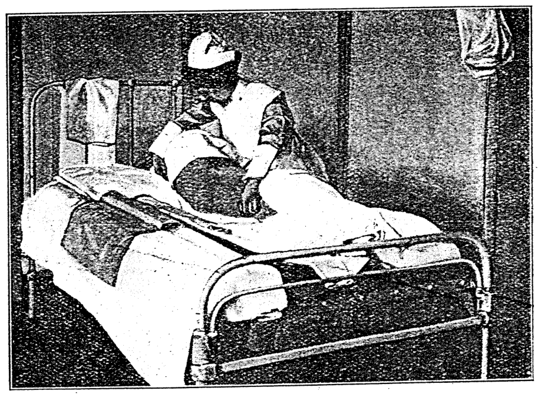
    <figcaption style="font-size: 14px; color: #4a5568; margin-top: 6px;"><em>Tē 115 tô.—Ōaⁿ ē-bīn phē-toaⁿ ê hoat. (From Sanders' “ Modern Methods in Nursing,’ by permission of W. B. Saunders Co., publishers.)</em></figcaption>
  </figure>

### 158 BÎN-CHHÎNG, I-HÓK, THONG KHONG-KHÌ Ê HOAT-TŌ͘

chiàu-kò͘ pīⁿ-lâng, m̄-thang hō͘ i chhe-tio̍h hong koh kám-tio̍h.

> **【全漢對照】**
> 照顧病人，毋通予伊吹著風閣感著。

---

### [Ōaⁿ bîn-chhîng / 換眠床]

Pīⁿ tāng ê lâng bōe tit lo̍h bîn-chhîng, khàn-hō͘ ti̍h chiàu i-īⁿ ê kui-kú, ta̍k lé-pài kā pīⁿ-lâng ōaⁿ n̄g pái bîn-chhîng. Hit-ê hoat-tō͘ ti̍h lēng-gōa chiong chi̍t tiuⁿ bîn-chhîng chhu hó-sè, ēng sì ê lâng, chiong pīⁿ-lâng khin-khin sóa kè sin chhòng ê bîn-chhîng ; nā-sī pīⁿ-lâng siong-tiōng, tek-khak ti̍h cha̍p-hun sió-sim.

> **【全漢對照】**
> 病重的人袂得落眠床，看護著照醫院的規矩，逐禮拜共病人換兩擺眠床。彼個法度著另外將一張眠床鋪好勢，用四個人，將病人輕輕徙過新創的眠床；若是病人傷重，的確著十分小心。

---

> **Tē 115 tô͘.—Ōaⁿ ē-bīn phē-toaⁿ ê hoat.** (From Sanders’ “Modern Methods in Nursing,” by permission of W. B. Saunders Co., publishers.)
> 
> **【全漢對照】**
> **第 115 圖。—換下面被單的法。**（取材自 Sanders 著《現代看護法》，經出版商 W. B. Saunders 公司授權刊登。）

---

### [Ōaⁿ phē-toaⁿ / 換被單]

Nā pīⁿ thài siong-tiōng, bōe kng kè pa̍t tiuⁿ bîn-chhîng-tit, ti̍h ēng ōaⁿ phē-toaⁿ ê hoat. Tāi-seng pī-pān chi̍t niá chheng-khì ê phē-toaⁿ, kńg chi̍t-pòaⁿ khí-lâi ; chiah kah pīⁿ-lâng hoan thán-khi-sin tùi bîn-chhîng-piⁿ kè-khì (tē 115 tô͘). Ti̍h kóaⁿ-kín chiong kū ê phē-toaⁿ tùi piⁿ-á kńg-kè khì kàu pīⁿ-lâng ê seng-khu hit ē-tóe ; iā chiah kóaⁿ-kín chiong pī-pān piān, hit niá chheng-khì phē-toaⁿ, chiong kńg-ê hit chi̍t pòaⁿ, hē tī pīⁿ-lâng ê seng-khu-ē ; jiân-āu kah pīⁿ-lâng chiàu kū hoan-sin kè-lâi ; koh chiong

> **【全漢對照】**
> 若病太傷重，袂扛過別張眠床得，著用換被單的法。代先備辦一領清氣的被單，捲一半起來；才甲（教）病人翻䀼敧身對眠床邊過去（第 115 圖）。著趕緊將舊的被單對邊仔捲過去到病人的身軀彼下底；也才趕緊將備辦便、彼領清氣被單，將捲的彼一半，放置病人的身軀下；然後甲（教）病人照舊翻身過來；閣將

<!-- Page 174 End -->

---

<!-- Page 175 Start -->
#### 📖 原書第 175 頁

### HIAN JIÒK-Á Ê HOAT-TŌ͘（掀褥仔的法度）

kū ê phē-toaⁿ tio̍h-lo̍h-lâi; chiong hit chi̍t pòaⁿ chheng-khì-ê thí-khui chhu hō͘ hó, ia̍h sì-piⁿ ê phē-toaⁿ chiah khioh lâi soeh ân tī jiòk-á-ē.

> **【全漢對照】**
> 舊的被單捽落來；將彼一半清氣的弛開鋪予好，亦四邊的被單才抾來揱絚佇褥仔下。

---

Siat-sú pīⁿ-lâng bōe hoan-sin, iû-goân tio̍h chiong phē-toaⁿ kúg hó, kiò lâng pang-chān lí, chiong pīⁿ-lâng sió-khóa phō-khí-lâi, chiàu téng-bīn ê hoat-tō͘ kóaⁿ-kín chhu hō͘ hó.

> **【全漢對照】**
> 設使病人袂翻身，依然著將被單捲好，叫人幫贊你，將病人稍可抱起來，照頂面的法度趕緊鋪予好。

---

Koh nā chhin-chhiūⁿ pīⁿ-lâng téng-kòa lóng hó-hó, kan-ta ē-kòa phòa-pīⁿ, bōe-ōe hoan-sin, khàn-hō͘ iû-goân tio̍h chiong phē-toaⁿ kńg hó; tāi-seng pī-pān piān-piān, kiò pīⁿ-lâng khí-lâi chē, chiàu chêng ê hoat-tō͘ án-ni lâi ōaⁿ.

> **【全漢對照】**
> 閣若親像病人頂蓋攏好好，敢若下蓋破病，袂會翻身，看護依然著將被單捲好；代先備辦便便，叫病人起來坐，照前的法度按呢來換。

---

### Hian jiòk-á ê hoat-tō͘（掀褥仔的法度）
*(邊標：Hian jiòk-á ê hoat-tō͘ / 掀褥仔的法度)*

Hian jiòk-á ê hoat-tō͘ :  
1. Mî-phē kap thán-á the̍h-khí-lâi hē chi̍t tè í-téng. Ēng phē-toaⁿ chhu tī pīⁿ-lâng, lióng pêng khioh lâi soeh tī i seng-khu-ē. Chím-thâu tio̍h the̍h-khí-lâi hē pīⁿ-á.  
2. Chiong pīⁿ-lâng kng tī jiòk-á ê piⁿ-á.  
3. Khàn-hō͘ tio̍h chiong jiòk-á thoa kàu bîn-chhng-piⁿ ; hit-tiap thih chòe ê jiòk-á í-keng hian. (Chit-ê sī teh kóng gōa-kok khoán ê bîn-chhng).  
4. Ēng saⁿ ê chím-thâu hē tī thih chòe ê jiòk-á téng ; kng pīⁿ-lâng kàu hia.  
5. Jiòk-á tio̍h tùi thâu hian. Ēng chheng-khì ê phē-toaⁿ chhu, kap chheng-khì sòe niá phē-toaⁿ iā hó. Kng pīⁿ-lâng tī jiòk-á-téng, chiah ûn-ûn-á thoa kàu goân-ūi (tē 116 tô͘).

> **【全漢對照】**
> 掀褥仔的法度：  
> 1. 棉被佮毯仔提起來下佇一塊椅頂。用被單鋪佇病人，兩旁抾來揱佇伊身軀下。枕頭著提起來下邊仔。  
> 2. 將病人扛佇褥仔的邊仔。  
> 3. 看護著將褥仔拖到眠床邊；彼霎鐵做的褥仔已經掀。（這個是咧講外國款的眠床）。  
> 4. 用三個枕頭下佇鐵做的褥仔頂；扛病人到遐。  
> 5. 褥仔著對頭掀。用清氣的被單鋪，佮清氣細領被單亦好。扛病人佇褥仔頂，才勻勻仔拖到原位（第 116 圖）。

---

Nā tī piⁿ-á ū lēng-gōa koh chi̍t tiuⁿ bîn-chhng lâi ēng kng pīⁿ-lâng tī hia tó, án-ni hian jiòk-á khiok sī khah khoài.

> **【全漢對照】**
> 若佇邊仔有另外閣一張眠床來用扛病人佇遐倒，按呢掀褥仔卻是較快。

---

### Kut-chi̍h ê jiòk-á（骨折的褥仔）
*(邊標：Kut-chi̍h ê jiòk-á / 骨折的褥仔)*

Pīⁿ-lâng ê kut-chi̍h, hit-ê chháu chòe ê jiòk-á-ē, tio̍h ké n̄g tè chhâ pang ; chhian-bān m̄-thang hō͘ bîn-chhng ōe iô-tāng, in-ūi chit khoán ê pīⁿ kài khí-khek bîn-chhng teh iô-tāng.

> **【全漢對照】**
> 病人的骨折，彼個草做的褥仔下，著加兩塊柴板；千萬毋通予眠床會搖動，因為這款的病極忌諱眠床咧搖動。

---

Nā bô jîn-ài, lán ê kang kui tī khang-khang.

> **【全漢對照】**
> 若無仁愛，咱的工歸佇空空。

<!-- Page 175 End -->

---

<!-- Page 176 Start -->
#### 📖 原書第 176 頁

  <figure style="display: inline-block; margin: 12px; max-width: 90%; text-align: center;">
    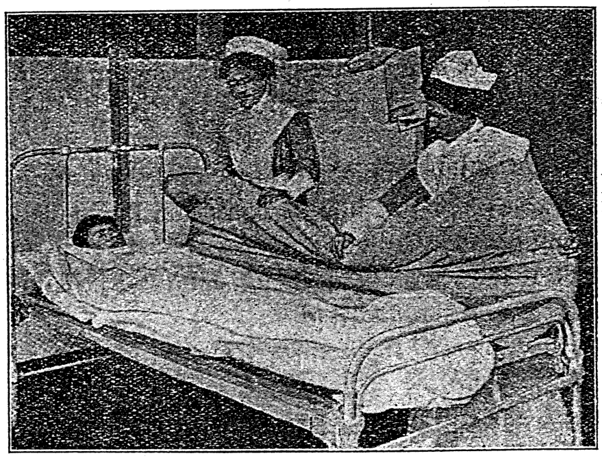
    <figcaption style="font-size: 14px; color: #4a5568; margin-top: 6px;"><em>Tē 116 tô:—Pīⁿ-lâng iáu tī bîn-chhng, hian jiỏk-á ê hoat (Sanders).</em></figcaption>
  </figure>

### 160 BÎN-CHHÎNG, I-HO̍K, THONG KHONG-KHÌ Ê HOAT-TŌ͘

#### [Chhiū-leng jiók-á]

Ū chi̍t khoán ēng chhiū-leng tóe chúi ê jiók-á, khah chē sī in-ūi chui-kut ū pīⁿ ê lâng, piàn-sūi, á-sī poàn-sūi hit hō͘ pīⁿ-lâng teh ēng-ê. Chit khoán chhiū-leng jiók-á hē tī chháu jiók-á ê téng-bīn; jiók-á-ē, iû-goân tio̍h chhu pang. Chit khoán ê jiók-á kè-chîⁿ chin kùi, khàn-hō͘ ê lâng tio̍h kín-sīⁿ lâi ēng; m̄-thang bak-tio̍h iû, iā m̄-thang chiong hit-hō ū mî-kak-ê lâi hē tī jiók-á téng-bīn, kiaⁿ-liáu m̄-tú-hó chhàk phòa, á-sī túh pháiⁿ; nā ēng liáu tio̍h sóe hō͘ chheng-khì, koh phak ta, chiah siu-khí-lâi.

> **【全漢對照】**  
> **160 眠床、衣服、通空氣的方法**  
> **[樹奶褥仔]**  
> 有一款用樹奶貯水的褥仔，較多是因為椎骨有病的人，偏遂、抑是半遂彼號病人咧用的。這款樹奶褥仔設佇草褥仔的頂面；褥仔下，猶原著鋪枋。這款的褥仔價錢真貴，看護的人著謹慎來用；毋通溽著油，也毋通將彼號有稜角的來設佇褥仔頂面，驚了毋拄好刺破，抑是觸𣆮；若用聊著洗互清潔，閣曝乾，才收起來。

---

**Tē 116 tô͘:—Pīⁿ-lâng iáu tī bîn-chhng, hian jiók-á ê hoat (Sanders).**

> **【全漢對照】**  
> **第 116 圖：—病人猶佇眠床，掀褥仔的方法 (Sanders)。**

---

Ū hit hō m̄-sī kui seng-khu ū pīⁿ-ê, thang ēng chi̍t pòaⁿ ê chhiū-leng jiók-á, á-sī ēng chi̍t-ê chhiū-leng chím-thâu chiū kàu-gia̍h; m̄-bián ēng kàu siuⁿ tōa-ê.

> **【全漢對照】**  
> 有彼號毋是規身軀有病的，通用一半的樹奶褥仔，抑是用一個樹奶枕頭就夠額；毋免用到傷大的。

---

#### [Tóe chúi ê hoat-tō͘]

Tōa niá ê jiók-á it-tēng tio̍h tī bîn-chhng-téng tóe chúi; sòe niá jiók-á, á-sī chím-thâu, tī chheng-khì toh-téng, tóe chúi iā thang. Tī toh-téng tóe chúi ê sî, nā ēng nn̄g chhiú lâi chhi̍h, ē bong-tio̍h toh-téng, chiū thang chai chúi iáu-bē kàu-gia̍h; nā-sī ēng chi̍t chhiú chhut-la̍t, chiah ē bong-tio̍h toh, án-ni chúi chiū-sī tú-hó.

> **【全漢對照】**  
> **[貯水的方法]**  
> 大領的褥仔一定著佇眠床頂貯水；細領褥仔，抑是枕頭，佇清潔桌頂，貯水也通。佇桌頂貯水之時，若用兩手來揤，會摸著桌頂，就通知水猶未夠額；若是用一手出力，才會摸著桌，按呢水就是拄好。

<!-- Page 176 End -->

---

<!-- Page 177 Start -->
#### 📖 原書第 177 頁

### ŌAⁿ SAⁿ, THE, TÓ Ê HOAT (161)

Tóe chúi liáu-āu, iàu-kín tiòh sió-sim chhut la̍t chiong lō-si choān hō͘ ân, bo̍h-tit hō͘ gōa-bīn phah tâm. Chit khoán ê jiòk-á nā kòe nñg saⁿ lé-pài, tiòh thiⁿ chi̍t pái chúi, in-ūi jiòk-á-lāi ê chúi kè khah chōe ji̍t ē cheng-hoat, chiū khah kiám-chió.

> **【全漢對照】**
> 貯水了後，要緊著小心出力將螺絲轉予掔，莫得予外面拍澹。這款的褥仔若過兩三禮拜，著添一擺水，因為褥仔內的水過較多日會蒸發，就較減少。

---

### [換衫]

**[邊註：Ōaⁿ saⁿ]**
Pīⁿ-lâng ê i-ho̍k, chiàu khàn-hō͘ ê kui-chek, tiòh siông-siông ōaⁿ hō͘ chheng-khì, chiàu pīⁿ-lâng ê ì-sù chi̍t lé-pài beh ōaⁿ chi̍t pái, chiàu khàn-hō͘ ê ì-sù, chi̍t ji̍t tiòh ōaⁿ nñg pái; i-īⁿ-lāi bōe tit thang pī-pān hiah-nī chōe, chí-ū múi-ji̍t hō͘ pīⁿ-lâng sóe-e̍k-ê, chiong i ê i-ho̍k tiàu-khí-lâi chhe hong iā hó. Pīⁿ-lâng nā bô teh lâu kōaⁿ, chi̍t lé-pài nñg pái tiòh ōaⁿ chheng-khì ê saⁿ. Nā-sī siông-siông lâu kōaⁿ ê lâng, á-sī hì-pīⁿ ê lâng, in ê i-ho̍k tiòh ēng nî-ê, iā tiòh siông-siông ōaⁿ ta-ê, m̄-thang kan-ta chiàu chēng ê hoat-tō͘ kóng chhe hong chiū ē ēng-tit.

> **【全漢對照】**
> **【邊註：換衫】**
> 病人的衣服，照看護的規則，著時常換予清潔，照病人的意思一禮拜欲換一擺，照看護的意思，一日著換兩擺；醫院內袂得通用備辦遐爾多，只有每日予病人洗浴的，將伊的衣服吊起來吹風亦好。病人若無咧流汗，一禮拜兩擺著換清潔的衫。若是時常流汗的人，抑是肺病的人，𪜶的衣服著用呢的，亦著時常換燥的，毋通干單照前的法度講吹風就會用得。

---

Pīⁿ-lâng taⁿ-chiah hó, thâu chi̍t pái lo̍h bîn-chhûng ê sî, khàn-hō͘ tē it iàu-kín tiòh khòaⁿ i só͘ chhēng ê i-ho̍k ū ha̍h ū tú-hó bô, iā m̄-thang hō͘ i chhēng siuⁿ tāng, siuⁿ lūi-thūi, in-ūi taⁿ-chiah hó ê lâng, i ê pīⁿ beh koh hoat sī chin khoài; iā lâng iáu-bē lōa tōa ióng.

> **【全漢對照】**
> 病人今才好，頭一擺落眠床的時，看護第一要緊著看伊所穿的衣服有合有拄好無，亦毋通予伊穿傷重、傷累贅，因為今才好的人，伊的病欲閣發是真快；亦人猶未偌大勇。

---

### [病人 the、倒的法]

**[邊註：Pīⁿ-lâng the, tó ê hoat]**
Chiàu-kò͘ pīⁿ-lâng the, tó ê hoat: Pīⁿ-lâng tó chhiò-chhiò bōe tín-tāng, khàn-hō͘ tiòh pang-chān i hō͘ thán-khi-sin, ē sî-siông o̍ah-tāng. Chiàu lí-khì tiòh hō͘ pīⁿ-lâng ê hì-chōng choan thé lóng ē kiâⁿ i ê chok-iōng, chiah bián hō͘ huih tūi-lo̍h lâi pīⁿ-chiâⁿ hì-iām; iā tiòh hō͘ i ê seng-khu sî-siông ē o̍ah-tāng, chiah m̄-bián tì-kàu siⁿ jiòk-siong.

> **【全漢對照】**
> **【邊註：病人 the、倒的法】**
> 照顧病人 the（斜靠）、倒的法：病人倒笑笑（仰臥）袂振動，看護著幫贊伊予坦敧身，會時常活動。照理氣著予病人的肺臟全體攏會行伊的作用，才免予血墜落來病成肺炎；亦著予伊的身軀時常會活動，才毋免致到生褥傷。

---

### [病人時常倒]

**[邊註：Pīⁿ-lâng sî-siông tó]**
Pīⁿ-lâng nā ū sit-hû-tek-lí-a (pėh-âu-chèng) á-sī kip-sèng *rheumatism* ê pīⁿ, tiòh hō͘ siông-siông tó chhiò-chhiò; in-ūi i nā peh-khí-lâi, kiaⁿ-liáu sim-chōng hut-jiân sit-pāi, chiū thêng-chí. Koh sió-tńg-jia̍t pīⁿ (小腸熱病, *enteric fever*) kap pak-tó́ ê pīⁿ, í-kip lâu huih hit hō chèng, iā

> **【全漢對照】**
> **【邊註：病人時常倒】**
> 病人若有 sit-hû-tek-lí-a（白喉症）抑是急性 *rheumatism*（風濕症）的病，著予時常倒笑笑；因為伊若爬起來，驚了心臟忽然失敗，就停止。閣小腸熱病（小腸熱病，*enteric fever*）及腹肚的病，以及流血彼號症，亦……

---

### [頁尾金句]

Jîn-ài bô kì-tit lâng ê pháiⁿ (I Ko-lîm-to 13: 5).

> **【全漢對照】**
> 仁愛無記得人的歹（I 哥林多 13: 5）。

<!-- Page 177 End -->

---

<!-- Page 178 Start -->
#### 📖 原書第 178 頁

  <figure style="display: inline-block; margin: 12px; max-width: 90%; text-align: center;">
    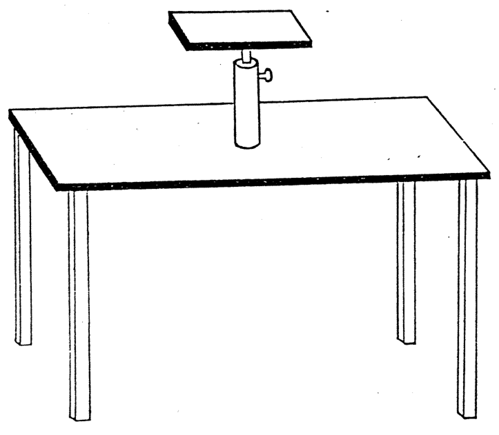
    <figcaption style="font-size: 14px; color: #4a5568; margin-top: 6px;"><em>Tē 117 tô.—Sim-chōng pīⁿ ê lâng phak-teh ê kí-toh (E. Band).</em></figcaption>
  </figure>

### 162 BÎN-CHHÎNG, I-HO̍K, THONG KHONG-KHÌ Ê HOAT-TŌ͘

**[Sim-chōng pīⁿ]**  
eng-kai tiòh tó pîⁿ-pîⁿ. Iā tī chēng-me̍h-kńg-lāi ê huih ū kiat kui-tè ê pīⁿ, chiū-sī huih-chhoan pīⁿ, (血栓病, thrombosis), koh khah iàu-kín tiòh tó-teh hō͘ pîⁿ-pîⁿ. Sim-chōng ū pīⁿ ê lâng, á-sī khùn ê sî sim-koaⁿ ōe kiaⁿ-ê, chit khoán ê pīⁿ-lâng ū-sî chē, ū-sî tó, sī bōe ēng-tit tiāⁿ-tióh ê hoat-tō͘. Khàn-hō͘ tiòh m̄-thang hiâm hùi-khì, khòaⁿ pīⁿ-lâng àn-cháiⁿ-iūⁿ khah hó-sè, chiū hō͘ i án-ni. Chhin-chhiūⁿ pīⁿ-

> **【全漢對照】**  
> **162 眠床、衣服、通空氣的法度**  
> 
> **［心臟病］**  
> 應該著倒平平。也佇靜脈管內的血有結歸塊的病，就是血栓病，(血栓病, thrombosis)，閣較要緊著倒咧予平平。心臟有病的人，抑是睏的時心肝會驚的，這款的病人有時坐，有時倒，是袂用得定著的法度。看護著毋通嫌費氣，看病人按怎樣較好勢，就予伊按呢。親像病－

---

**Tē 117 tô͘:—Sim-chōng pīⁿ ê lâng phak-teh ê kí-toh (E. Band).**

> **【全漢對照】**  
> **第 117 圖：—心臟病的人仆咧的几桌 (E. Band)。**

---

lâng chē ê sî, ka-chiah-āu tiòh ēng chím-thâu á-sī phē-jiók hit hō mi̍h lâi ké, á-sī ēng chi̍t tè í-á hē tī i bīn-chêng hō͘ i thang phak-teh. Sim-chōng ū pīⁿ-ê nā bōe tit tiàm bîn-chhâng-ni̍h khùn, tiòh ēng chi̍t tè tōa tè ê the-í, hō͘ i chē hit téng-bīn, iā tiòh kā i kah hō͘ sio, m̄-thang hō͘ léng-tióh. Bīn-thâu-chêng hē chi̍t tè kí-toh, thang hō͘ i khòa chhiú, ū-sî iā thang phak-teh hioh-khùn (tē 117 tô͘). Ēng pêng-siông the-í ê hoat-tō͘, khòaⁿ tē 118 tô͘.

> **【全漢對照】**  
> 人坐的時，尻脊後著用枕頭抑是被褥彼號物來硌，抑是用一塊椅仔格佇伊面前予伊通仆咧。心臟有病的若袂得踮眠床裡睏，着用一塊大塊的推椅，予伊坐彼頂面，也著共伊蓋予燒，毋通予冷著。面頭前格一塊几桌，通予伊靠手，有時也通仆咧歇睏（第 117 圖）。用平常推椅的法度，看第 118 圖。

---

### Lūn jiók-siong (褥瘡, Bed-sore):

**[Jiók-siong]**  
Nā pīⁿ-lâng kóng, i seng-khu ū só͘-chāi ōe thiàⁿ, chiū

> **【全漢對照】**  
> ### 論褥傷（褥瘡, Bed-sore）：
> 
> **［褥傷］**  
> 若病人講，伊身軀有所在會疼，就

<!-- Page 178 End -->

---

<!-- Page 179 Start -->
#### 📖 原書第 179 頁

  <figure style="display: inline-block; margin: 12px; max-width: 90%; text-align: center;">
    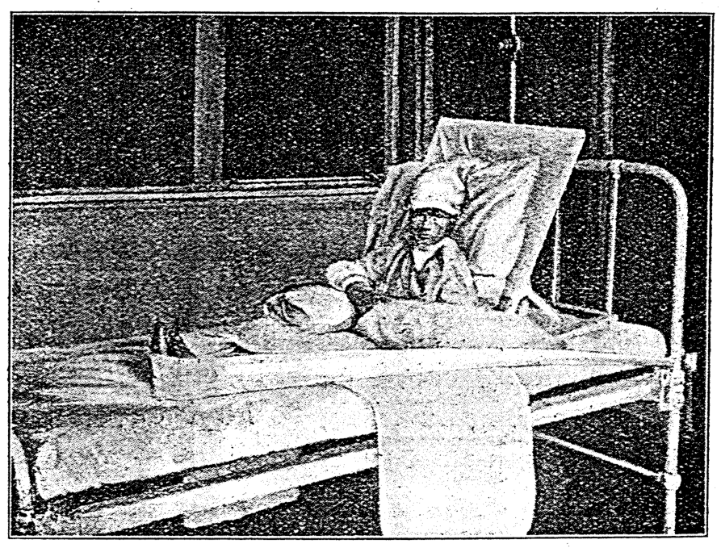
    <figcaption style="font-size: 14px; color: #4a5568; margin-top: 6px;"><em>Tē 118 tô:—Ēng pò· chòe ê tōa, hō· lâng bōe chhù-lỏh-khì bîn-chhñg-nih (Sanders).</em></figcaption>
  </figure>

## Ū-HÔNG JIO̍K-SIONG Ê HOAT (163)

...tio̍h chhâ khòaⁿ sī sím-mi̍h iân-kò͘, ū-sî iā ōe chí thiàⁿ, in-ūi ū-sî sī beh khí jio̍k-siong ê iân-kò͘.

> **【全漢對照】**
> ...著查看看是甚麼緣故，有時亦會止疼，因為有時是欲起褥傷的緣故。

---

### [圖附說明]

**Tē 118 tô͘:—Ēng pò͘ chòe ê tòa, hō͘ lâng bōe chhù-lo̍h-khì bîn-chhng-nih (Sanders).**

> **【全漢對照】**
> **第 118 圖：用布做的帶，予人𣍐踅落去眠牀裡（Sanders）。**

---

### [褥傷好發部位]
*(側標：Ū-hông jio̍k-siong ê hoat)*

Khàn-hō͘ tio̍h chai jio̍k-siong m̄-tān-nā óa tēng kut ê só͘-chāi ōe siⁿ nā-tiāⁿ. Ka-chiah ê chek-chui-kut, keng-kah-kut, tiú-koan-chat-āu, tōa-thúi-kut, kha-āu-tíⁿ-kut, gín-ná ê āu-khok, chiah ê só͘-chāi lóng ōe siⁿ jio̍k-siong. Iā kha-pôaⁿ kap kha-chńg-thâu-á, ōe hō͘ hit hō kah ê phē teh-tio̍h, kàu thiàⁿ.

> **【全漢對照】**
> *(側標：預防褥傷的方法)*
> 看護著知褥傷毋但倚硬骨的所在會生爾定。尻脊的脊椎骨、肩胛骨、肘關節後、大腿骨、跤後跟骨、囡仔的後硞，諸個所在攏會生褥傷。也跤盤及跤指頭仔，會予彼號蓋的被壓著，到疼。

---

### [褥傷的成因與預防原則]

Chòe tāng ê jio̍k-siong, chiū-sī sin ji̍p īⁿ ê pīⁿ-lâng, in-ūi i tī chhù-nih ê sî, bô lâng hû-chhî i ê iân-kò͘. Kìⁿ-nā tī i-īⁿ ê pīⁿ-lâng, chiū m̄-bián tī chit hō chèng, in-ūi khàn-hō͘ teh chiàu-kò͘, kàu lóng hó-sè. Nā i pīⁿ ê hoat-tō͘, chhòng-liáu ū chiâu-pī thò-tòng, pīⁿ-lâng chiū bōe ū jio̍k-siong.

> **【全漢對照】**
> 最重的褥傷，就是新入院的病人，因為伊佇厝裡的時，無人扶持伊的緣故。見若佇醫院的病人，就毋免佇此號症，因為看護咧照顧，到攏好勢。若醫病的方法，創了有齊備妥當，病人就𣍐有褥傷。

---

### [預防褥傷細則 第一條]
*(側標：Tio̍h sió-sim)*

Ū-hông jio̍k-siong ê hoat: 1. Pīⁿ-lâng nā chhiâng-chāi tó tī bîn-chhng, beh tî-hông jio̍k-siong, khàn-hō͘ tio̍h put-chí sió-sim. Pīⁿ-lâng seng-khu-ē ê jio̍k-á kap phē-tòaⁿ, tio̍h sî-siông chhu pîⁿ, m̄-thang khioh-kéng. Chia̍h-mi̍h, m̄-thang phah-ka-la̍uh tī bîn-chhng-nih.

> **【全漢對照】**
> *(側標：著小心)*
> 預防褥傷的方法：1. 病人若常在倒佇眠牀，欲提防褥傷，看護著不止小心。病人身軀下的褥仔及被單，著時常搊平，毋通起褶皺。食物，毋通拍落佇眠牀裡。

<!-- Page 179 End -->

---

<!-- Page 180 Start -->
#### 📖 原書第 180 頁

164 BÎN-CHHÎNG, I-HỎK, THONG KHONG-KHÌ Ê HOAT-TŌ͘

### 2. Chheng-khì

2. Tē it iàu-kín-ê sī tióh chheng-khì. Pīⁿ-lâng tó tī bîn-chhng, khàn-hō͘ eng-kai tióh ták ji̍t nn̄g pái, sóe i ê kachiah-āu, iā ū-sî kui seng-khu tióh ták ji̍t sóe, chiah ûn-ûn-á chhit hō͘ ta. Nā tāi-piān á-sī siáu-piān sit kìm, ták pái ōaⁿ chheng-khì ê saⁿ, bak-tióh seng-khu ê só͘-chāi tióh kè sóe.

> **【全漢對照】**
> 2. 第一要緊的是著清潔。病人倒佇眠床，看護應該著逐日兩擺，洗伊的佮脊後，也有時歸身軀著逐日洗，才勻勻仔拭予乾。若大便抑是小便失禁，逐擺換清潔的衫，溽著身軀的所在著繼洗。

---

### 3. Hō͘ phê-hu ōe kian-kò͘

3. Nā chiong pīⁿ-lâng ê phê-hu khah khoài lòe-tióh ê só͘-chāi, hō͘ i ōe kian-kò͘, chiū khah bōe siⁿ jiók-siong. Chhin-chhiūⁿ kā pīⁿ-lâng sóe-e̍k, chhit hō͘ ta, siông-siông hō͘ i ê sin-thé ōe oa̍h-tāng. _Alcohol_ (hé-chiú) kài ōe hō͘ lâng phê-bah kian-kò͘. Nā kan-ta ēng chiú, hit ê la̍t bô kah lōa tōa, tióh chiong chiú ùn chiú chhut la̍t lù nn̄g saⁿ hun-cheng-kú, chiong huih-kńg lù hō͘ i ōe oa̍h, chiah ū kong-hāu. Nā kan-ta ēng chiú kā boah hit phê-nih, sī lóng bô lō͘-ēng, pe̍h-pe̍h liáu chiú nā-tiāⁿ. Ēng phû-tô-chiú lâi lù, iā hó. Nā ēng hó ê sat-bûn ùn tâm boah hē phê-hu-nih, ēng chhiú tōa la̍t kā i thut, iā sī ōe tī-hông jiók-siong ê hoat-tō͘.

> **【全漢對照】**
> 3. 若將病人的皮膚較快擂著的所在，予伊會堅固，就較𣍐生褥傷。親像共病人洗浴，拭予乾，常常予伊的身體會活動。_Alcohol_（火酒）蓋會予人皮肉堅固。若單單用酒，彼個力無合偌大，著將手搵酒出力捤兩三分鐘久，將血管捤予伊會活，才有功效。若單單用酒共抹彼皮nih，是攏無路用，白白了酒若定。用葡萄酒來捤，也好。若用好的雪文搵澹抹下皮膚nih，用手大力共伊褪，也是會預防褥傷的法度。

---

### 4. Ióh-hún kā so

4. Ēng ióh-hún lâi so. Ióh-hún ū kúi-nā khoán-ê chóng-sī chit hō-ê sī hó ēng:
$$\left.
\begin{array}{l}
\textit{Zinci oxidum} \\
\textit{Acidum Boricum} \\
\textit{Starch}\text{ (hún-chiuⁿ)}
\end{array}
\right\} \text{Saⁿ hāng pîⁿ chōe}$$

> **【全漢對照】**
> 4. 用藥粉來挲。藥粉有幾若款的，總是指號的是好用：
$$\left.
\begin{array}{l}
\textit{Zinci oxidum}\text{（氧化鋅）} \\
\textit{Acidum Boricum}\text{（硼酸）} \\
\textit{Starch}\text{（粉漿）}
\end{array}
\right\} \text{三項平濟}$$

---

### 5. Ēng chhiū-leng-tē-á chòe tiām / Îⁿ-khoân chòe tiām

5. Tióh sî-siông sūn pīⁿ-lâng khoài siū-tióh jiók-siong ê só͘-chāi ê phê-hu, ū piàn âng-hóaⁿ á-sī o͘-sek; nā án-ni tióh tī-hông. Tióh hō͘ pīⁿ-lâng tó tī bô tńg âng ê só͘-chāi, á-sī ēng núg ê chím-thâu, chhin-chhiūⁿ Se kok-ê, mî-phē, koàn khong-khì ê chhiū-leng-lông, lâi ké koâiⁿ, hō͘ seng-khu bōe teh-tióh âng-hóaⁿ ê só͘-chāi. Nā ōe hō͘ pīⁿ-lâng ū-sî tó thán-khi-sin, ū-sî tó chhiò-chhiò iā sī hó ê hoat-tō͘. Nā beh tī-hông kha-āu-tiⁿ siⁿ jiók-siong, ēng

> **【全漢對照】**
> 5. 著時常巡病人快受著褥傷的所在兮皮膚，有變紅痕抑是黑色；若按呢著預防。著予病人倒佇無轉紅的所在，抑是用軟的枕頭，親像西國的，綿被，灌空氣的樹乳囊，來加懸，予身軀𣍐壓著紅痕的所在。若會予病人有時倒偏側身，有時倒笑笑（仰臥）也是好的法度。若欲預防腳後跟生褥傷，用……

---

*Jîn-ài sī gâu khoan-iông, chû-pi; jîn-ài sī bô oàn-tò͘; jîn-ài bô khoat-kháu, bô phín-phóng (I Ko-lîm-to 13: 4).*

> **【全漢對照】**
> 仁愛是𠢕寬容、慈悲；仁愛是無怨妒；仁愛無誇口、無品磅（哥林多前書 13: 4）。

<!-- Page 180 End -->

---

<!-- Page 181 Start -->
#### 📖 原書第 181 頁

  <figure style="display: inline-block; margin: 12px; max-width: 90%; text-align: center;">
    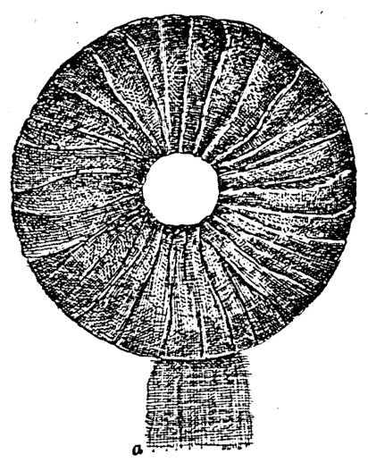
    <figcaption style="font-size: 14px; color: #4a5568; margin-top: 6px;"><em>Tē 119 tô.—Kha-āu-tiⁿ tiām.
(From Stoney's “Practical Points in Nursing,” by permission W. B. Saunders Co., publishers.)</em></figcaption>
  </figure>

### JIÓK-SIONG (p. 165)

chit tè mî-hoe lâi khè kha-āu-tiⁿ téng-bīn hit tiâu tōa tiâu kun (*Tendo Achilis*). Á-sī ēng mî, pheng-tòa, chòe chit ê îⁿ-khoân lâi khè tī kha-āu-tiⁿ (tē 119 tô͘).

> **【全漢對照】**  
> 一塊棉花來硩腳後腱頂面彼條大條筋（*Tendo Achilis*，阿基里斯腱）。抑是用棉、繃帶，做一個圓環來硩佇腳後腱（第 119 圖）。

---

6. Kái-piⁿ, ē-sin, koh-ē-khang, leng-phông-ē (乳房, *breasts*), chiah ê só͘-chāi ōe khah khoài tâm-sip, tióh sî-siông chhit hō͘ i ta, sòa so ióh-hún.

> **【全漢對照】**  
> 6. 䘥邊（胯下）、下身、夾下空（腋下）、乳房下（乳房，*breasts*），諸個所在會較快湛濕，著時常拭予伊焦，續挲藥粉。

---

  
**Tē 119 tô͘.—Kha-āu-tiⁿ tiām.**  
(From Stoney’s “Practical Points in Nursing,” by permission W. B. Saunders Co., publishers.)

> **【全漢對照】**  
> **第 119 圖。——腳後腱墊。**  
> （出自 Stoney 的《Practical Points in Nursing》，經出版商 W. B. Saunders 公司授權。）

---

7. Pīⁿ-lâng nā tāi-piān á-sī siáu-piān sit kìm, tióh sî-siông ēng siū-jiō-khì. Tióh ēng mî kap pheng-tòa lâi khè-teh, m̄-thang hō͘ pīⁿ-lâng ê phê-hu khè-tióh siū-jiō-khì, in-ūi khoài-khoài sīⁿ jiók-siong. Tióh put-sî sóe chheng-khì, chhit ta, sòa so ióh-hún. Nā pīⁿ-lâng siông-siông kaùh-kaùh-ngiàuh, siū-jiō-khì khah bōe thang tiāⁿ-tiāⁿ hē tī hia. Tióh ēng pát khoán ê hoat-tō͘. Chhin-chhiūⁿ ēng chho͘ mî, á-sī ēng pheng-tòa lâi pau kù-sut-hu, chiah sîn tī tāi-, siáu-piān ê só͘-chāi. Chit-ê nā kiaⁿ-lâng tióh sûi-sî ōaⁿ chheng-khì-ê. Nā-sī thoân-jiám pīⁿ, kù-sut-hu tióh sòa sio-lio-khì. Hit sî, pīⁿ-lâng bak-tióh kiaⁿ-lâng ê só͘-chāi, tióh sòa sóe, chhit ta, ēng hé-chiú lù, so ióh-hún, chiah ōe ēng-tit. Koh ēng iû-pò͘ á-sī iû-chóa chū tī ē-tóe, jiók-á khah bōe kè tâm. Ū-sî ēng *zinci oxidum* iû boah hiah ê tâm-sip ê só͘-chāi ; chóng-sī iû-goân tióh chheng-khì. Boah iû ê só͘-chai m̄-thang so ióh-hún in-ūi ōe liâm, sòa kiān kui-pa, tì-kàu khí jiók-siong.

> **【全漢對照】**  
> 7. 病人若大便抑是小便失禁，著時常用受尿器（便器/尿壺）。著用棉佮繃帶夾硩咧，毋通用病人的皮膚硩著受尿器，因為快快生褥傷。著不時洗清氣，拭焦，續挲藥粉。若病人常常反動掣（亂動輾轉），受尿器較袂通定定下佇遐。著用別款的法度。親像用粗棉，抑是用繃帶包樹膠布（*gutta-percha*），才墊佇大、小便的所在。這個若染穢（見穢）著隨時換清氣的。若是傳染病，樹膠布著續燒了去。彼時，病人溽著穢污的所在，著續洗，拭焦，用火酒（酒精）擂，挲藥粉，才會用得。閣用油布抑是油紙墊佇下底，褥仔較袂過濕。有時用 *zinci oxidum*（氧化鋅）油抹遐的湛濕的所在；總是猶原著清氣。抹油的所在毋通挲藥粉因為會黏，續結歸葩（團聚成塊），致到起褥傷。

---

Chòe oh-tit chiū-sī ka-chiah chek-chui-kut, kap sim-chōng pīⁿ ; in-ūi chit n̄g khoán ê pīⁿ bōe chhut-chai in ê

> **【全漢對照】**  
> 最僫得（難處理）就是骹脊脊椎骨，佮心臟病；因為這兩款的病袂出自（無法自主隨意）𪜶的……

---

**[頁底金句註腳]**  
Só͘-í tióh tû-khì péh-chha̍t, ták lâng kap i ê chhù-piⁿ kóng chin-si̍t, in-ūi lán saⁿ-kāng chòe thé (Í-hut-só͘ 4 : 25).

> **【全漢對照】**  
> 所以著除去白賊，逐人佮伊的厝邊講真實，因為咱相同做體（以弗所 4 : 25）。

<!-- Page 181 End -->

---

<!-- Page 182 Start -->
#### 📖 原書第 182 頁

  <figure style="display: inline-block; margin: 12px; max-width: 90%; text-align: center;">
    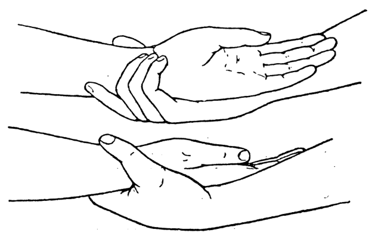
    <figcaption style="font-size: 14px; color: #4a5568; margin-top: 6px;"><em>Tē 120 tô. — Hû-chhah pīⁿ-lâng ê hoat-tō͘. (Woodwark's “Medical Nursing,” Edward Arnold, publisher.)</em></figcaption>
  </figure>

166 BÎN-CHHÂNG, I-HÓK, THONG KHONG-KHÌ Ê HOAT-TŌ͘

ì-sù lâi hoan-sin tín-tāng. Nā tú-tio̍h chit hō chèng, chiū tióh kā pīⁿ-lâng ēng chúi ê jiók-á. M̄-kú chit hō pīⁿ sui-jiân ēng chúi ê jiók-á, ū-sî tî-hông khí jiók-siong sī khah oh. Chóng-sī khah gâu ê khàn-hō͘, nā pīⁿ-lâng sìⁿ jiók-siong, i ka-kī phah-sǹg sī i ê kiàn-siàu.

> **【全漢對照】**
> 166 眠床、衣服、通空氣的方法
> 
> 意思來翻身振動。若抵著這號症，就著給病人用水的褥仔。毋過這號病雖然用水的褥仔，有時預防起褥傷是較僫。總更是較𠢕的看護，若病人生褥傷，伊自己拍算是伊的見羞。

---

### Jiók-siong tī-liâu-hoat
Jiók-siong tī-liâu-hoat sī i-seng ê koan-hē, chóng-sī ū-sî i-seng kah khàn-hō͘ siat-hoat.

> **【全漢對照】**
> ### 褥傷治療法
> 褥傷治療法是醫生的關係，總更有時醫生共看護設法。

---

### Phê í-keng phòa
1. Phê-hu nā í-keng phòa, hit ê hé-chiú m̄-thang lù óa phòa khang ê só͘-chai. Tióh chi̍t ji̍t n̄g pái ēng sap-bûn kap chúi sóe chheng-khì, koh chhit ta. Ēng *zinci oxidum* iû boah siong-chhùi, kap tī piⁿ-á ê phê-hu. Khah bô óa siong-chhùi ê phê-hu, iû-goân ēng hé-chiú kā lù.
2. Chiàu téng-bīn ê hoat-tō͘, siat-hoat hō͘ seng-khu bô teh-tio̍h siong-chhùi.

> **【全漢對照】**
> ### 皮已經破
> 1. 皮膚若已經破，彼個火酒毋通嚕倚破孔的所在。著一日兩擺用撒汶及水洗清潔，閣拭焦。用 *zinci oxidum*（氧化鋅）油抹傷喙，及佇邊仔的皮膚。較無倚傷喙的皮膚，猶原用火酒共嚕。
> 2. 照頂面的法度，設法互身軀無壓著傷喙。

---

### Jiók-siong nōa
3. Nā jiók-siong khah nōa, tióh ēng *acidum boricum* un-sip-pò͘. Só͘ ēng ê chúi-nî-pò͘ tióh ha̍p tī siong-chhùi ê hêng-chōng, m̄-thang siuⁿ tōa, iā m̄-thang kè siong-chhùi ê kîⁿ, kiaⁿ-liáu siong-chhùi ê kîⁿ ē nōa-khì. Ū-sî ēng *liquor hydrogenii peroxidi* sóe siong-chhùi iā hó.

> **【全漢對照】**
> ### 褥傷爛
> 3. 若褥傷較爛，著用 *acidum boricum*（硼酸）溫濕布。所用的水坭布著合佇傷喙的形狀，毋通傷大，也毋通過傷喙的墘，驚了傷喙的墘會爛去。有時用 *liquor hydrogenii peroxidi*（雙氧水）洗傷喙也好。

---

### Khah chheng-khì
4. Nā khah chheng-khì, ēng *zinci oxidum* iû kap pau-siong-liāu, lâi khàm. Nā án-ni, tióh ēng chúi-nî-pò͘ kap siong-chhùi pîⁿ tōa, m̄-thang khah tōa.

> **【全漢對照】**
> ### 較清潔
> 4. 若較清潔，用 *zinci oxidum*（氧化鋅）油及包傷料，來蓋。若按呢，著用水坭布及傷喙平大，毋通較大。

---

> **Tē 120 tô͘.—Hū-chhah pīⁿ-lâng ê hoat-tō͘.** (Woodwark's “Medical Nursing,” Edward Arnold, publisher.)  
> **【全漢對照】** 第 120 圖——扶插病人的法度。（Woodwark 氏《內科看護學》，Edward Arnold 出版社。）

---

### Khàn-hō͘ tióh sió-sim
Nā khàn-hō͘ khòaⁿ phê-hu túg âng, chhin-chhiūⁿ beh khí jiók-siong, tióh liâm-piⁿ thong-ti i-seng, m̄-thang iân-chhiân.

> **【全漢對照】**
> ### 看護著小心
> 若看護看皮膚轉紅，親像欲起褥傷，著連鞭通知醫生，毋通延遷。

<!-- Page 182 End -->

---

<!-- Page 183 Start -->
#### 📖 原書第 183 頁

  <figure style="display: inline-block; margin: 12px; max-width: 90%; text-align: center;">
    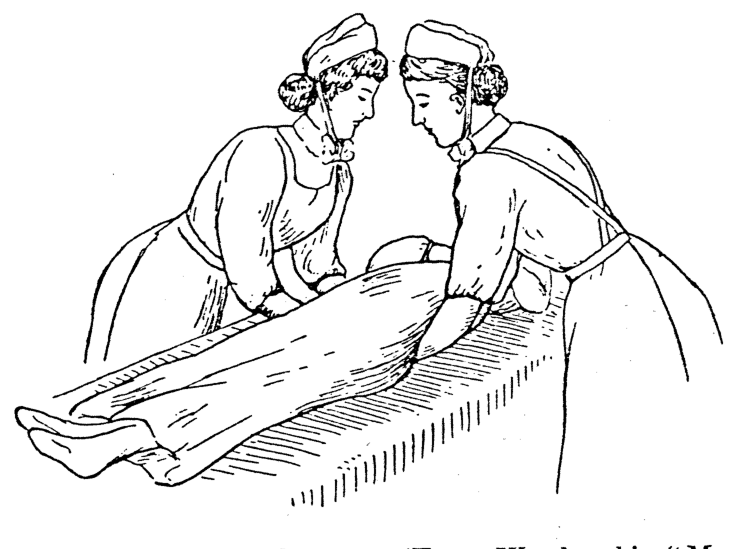
    <figcaption style="font-size: 14px; color: #4a5568; margin-top: 6px;"><em>Tē 121 tô:—Hû-chhah pīⁿ-lâng ê hoat-tō͘. (From Woodwark's “Medical Nursing,” Edward Arnold, publisher.)</em></figcaption>
  </figure>

### HÛ-CHHAH PĨⁿ-LÂNG, PIĀN-KHÌ (167)

**Hû-chhah pīⁿ-lâng ê hoat-tō͘ :**
*(邊註: Hû-chhah pīⁿ-lâng ê hoat-tō͘)*

1. Pīⁿ-lâng tī bîn-chhng-ni̍h, khàn-hō͘ beh hû-chhah ê sî, tióh ēng chi̍t ki chhiú chhng-jip keng-kah-ē, koh chi̍t ki chhng-jip tī tōa-thúi-ē, chhng kè kàu pīⁿ-lâng hit pêng bīn.

> **【全漢對照】**
> **扶插病人的法度：**
> *(邊註：扶插病人的法度)*
> 1. 病人在眠床裡，看護欲扶插的時，著用一枝手穿入肩胛下，閣一枝穿入佇大腿下，穿過到病人許爿面。

---

2. Pīⁿ-lâng nā ū làt tióh ēng i ê chhiú lâi phō tī khàn-hō͘ ê ām-kún.

> **【全漢對照】**
> 2. 病人若有力著用伊的手來抱佇看護的頷頸。

---

3. Kah pīⁿ-lâng tiām-tiām tó-teh, chiah ûn-ûn-á kā hû-khí-lâi. Pīⁿ-lâng nā bōe siuⁿ tāng ōe chòe-tit.

> **【全漢對照】**
> 3. 佮病人恬恬倒咧，才勻勻仔共扶起來。病人若袂傷重會做得。

---

4. Pīⁿ-lâng nā khah tāng, á-sī siong-tiōng, á-sī phīⁿ-kè bâ-chùi-ióh, chiū tióh ēng nñg saⁿ ê lâng lâi hû-chhah. Chi̍t lâng tī thâu-khak, chi̍t lâng tī seng-khu, koh chi̍t ê tī kha. Tāi-ke tióh khiā siang pêng, tióh lēng pīⁿ-lâng hō͘ i pîⁿ-pîⁿ. Iā tióh ēng kui ki chhiú, m̄-thang kan-ta ēng chńg-thâu-á nā-tiāⁿ, in-ūi án-ni bô kàu-gia̍h làt. Koh chi̍t ê hoat-tō͘ sī chiàu tē 120, 121 tô͘.

> **【全漢對照】**
> 4. 病人若較重，抑是傷重，抑是鼻過麻醉藥，就著用兩三个人來扶插。一人佇頭殼，一人佇身軀，閣一人佇跤。大家著徛雙爿，著令病人予伊平平。亦著用規枝手，毋通干單用指頭仔爾定，因為按呢無夠額力。閣一个法度是照第 120、121 圖。

---

**Tē 121 tô͘.—Hû-chhah pīⁿ-lâng ê hoat-tō͘.** (From Woodwark's “Medical Nursing,” Edward Arnold, publisher.)

> **【全漢對照】**
> **第 121 圖——扶插病人的法度。**（出自 Woodwark 著《內科看護學》，愛德華·阿諾德出版社）

---

### [Ēng piān-khì ê hoat-tō͘]

**Ēng piān-khì ê hoat-tō͘ (tē 122 tô͘) :**
*(邊註: Ēng piān-khì ê hoat-tō͘)*

1. Iáu-bē hō͘ pīⁿ-lâng ēng ê tāi-seng, tióh piàⁿ tām-póh sio-chúi tī lāi-bīn hō͘ piān-khì sió-khóa sio, chiah piàⁿ-chhut hiat-ka̍k, án-ni khah khòaⁿ-o̍ah.

> **【全漢對照】**
> **用便器的法度（第 122 圖）：**
> *(邊註：用便器的法度)*
> 1. 猶未予病人用的事先，著傾淡薄燒水佇內面予便器些許燒，才傾出拺捔，按呢較快活。

---

**Ióh-tû tióh só, bô só, m̄-thang khì pa̍t-ūi.**

> **【全漢對照】**
> **藥櫥著鎖，無鎖，毋通去別位。**

<!-- Page 183 End -->

---

<!-- Page 184 Start -->
#### 📖 原書第 184 頁

  <figure style="display: inline-block; margin: 12px; max-width: 90%; text-align: center;">
    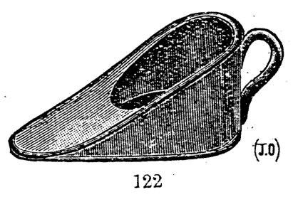
    <figcaption style="font-size: 14px; color: #4a5568; margin-top: 6px;"><em>Tē 122 tô:—Hûi-chè ê piān-khì.</em></figcaption>
  </figure>
  <figure style="display: inline-block; margin: 12px; max-width: 90%; text-align: center;">
    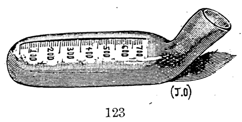
    <figcaption style="font-size: 14px; color: #4a5568; margin-top: 6px;"><em>Tē 123 tô:—Lâm ê siū-jiō-khì.</em></figcaption>
  </figure>
  <figure style="display: inline-block; margin: 12px; max-width: 90%; text-align: center;">
    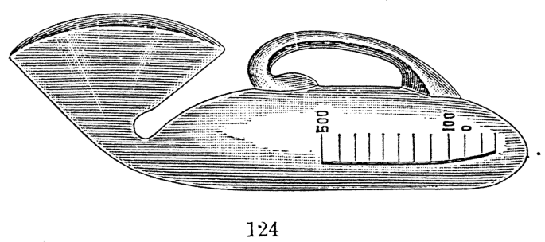
    <figcaption style="font-size: 14px; color: #4a5568; margin-top: 6px;"><em>Tē 124 tô:—Lú ê siū-jiō-khì.</em></figcaption>
  </figure>

### 168 BÎN-CHHÎNG, I-HÓK, THONG KHONG-KHÌ Ê HOAT-TŌ͘

> **【全漢對照】**
> 168 眠床、衣服、通空氣的法度

---

2. Nā pīⁿ-lâng khah tāng, piān-khì ê téng-bīn ti̍h boah tām-póh iû, hō͘ i ê phê-hu bōe liâm-ti̍oh piān-khì, lâi tî-hông khí jiòk-siong.

> **【全漢對照】**
> 2. 若病人較重，便器的頂面著抹淡薄油，予伊的皮膚𣍐黏著便器，來預防起褥傷。

---

3. Piān-khì-lāi m̄-thang hē siau-to̍k-io̍h-chúi, kiaⁿ-liáu io̍h bak-ti̍oh pīⁿ-lâng.

> **【全漢對照】**
> 3. 便器內毋通下消毒藥水，驚了藥沾著病人。

---

4. Khàn-hō͘ ēng tò-chhiú hû pīⁿ-lâng ê kut-pôaⁿ, hō͘ i sió-khóa lī-phû, chiah tùi piⁿ-á chiong piān-khì chhhng-ji̍p. Teh chhng-ji̍p ê sî ti̍oh sòe-jī m̄-thang lòe ti̍oh pīⁿ-lâng ê phê; iā chit-tiap koh kah i ê kha ti̍oh kiu-khí-lâi. Chiah ēng bīn-kun ut lâi khè tī piān-khì ê téng-bīn hō͘ i khah bōe tiam.

> **【全漢對照】**
> 4. 看護用倒手扶病人的骨盤，予伊稍許離浮，才對邊仔將便器穿入。咧穿入的時著細膩毋通捤著病人的皮；也這霎閣佮伊的腳著抾起來。才用面巾熨來契佇便器的頂面予伊較𣍐砧。

---

**[插圖說明]**

* 122 (J.O)
* 123 (J.O)
* 124

Tē 122 tô͘:—Hûi-chè ê piān-khì.  
Tē 123 tô͘:—Lâm ê siū-jiō-khì.  
Tē 124 tô͘:—Lú ê siū-jiō-khì.  

> **【全漢對照】**
> 第 122 圖：—瓷製的便器。  
> 第 123 圖：—男的受尿器。  
> 第 124 圖：—女的受尿器。  

---

5. Ēng liáu ti̍oh the̍h-khí-lâi, iû-goân ti̍oh sòe-jī m̄-thang lòe-ti̍oh pīⁿ-lâng ê phê-hu. Pīⁿ-lâng nā bô la̍t thang ka-kī chhit, khàn-hō͘ ti̍oh thè i. Piān-khì ti̍oh ēng pò͘ khàm-teh, phâng khì tī kiám-giām tāi-, siáu-piān sek-lāi. Nā i-seng ū hoan-hù ti̍oh lâu-teh hō͘ i kiám.

> **【全漢對照】**
> 5. 用了著提起來，猶原著細膩毋通捤著病人的皮膚。病人若無力通家己拭，看護著替伊。便器著用布蓋咧，捧去佇檢驗大、小便室內。若醫生有吩咐著留咧予伊檢。

---

6. Kiám liáu, pùn ti̍oh piàⁿ hiat-ka̍k. Piān-khì ti̍oh sóe hō͘ chheng-khì. Tāi-seng ēng chúi sóe, āu-lâi ēng chi̍t ki tek-á, bé-liu pa̍k pò͘, lâi sóe chheng-khì. Sóe liáu chit ki ti̍oh chhiâng-châi chìm tī chho͘ *carbolic* io̍h-chúi. Koh

> **【全漢對照】**
> 6. 檢了，糞著傾撪角。便器著洗予清潔。代先用水洗，後來用一支竹仔，尾溜縛布，來洗清潔。洗了這支著常在浸佇粗 *carbolic* 藥水。閣

<!-- Page 184 End -->

---

<!-- Page 185 Start -->
#### 📖 原書第 185 頁

  <figure style="display: inline-block; margin: 12px; max-width: 90%; text-align: center;">
    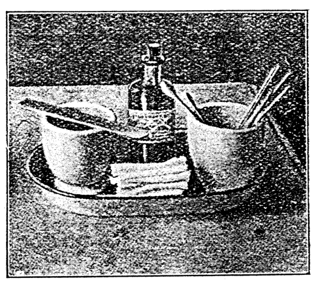
    <figcaption style="font-size: 14px; color: #4a5568; margin-top: 6px;"><em>Tē 125 tô.—Sóe chhùi ê pôaⁿ kap ū-pī mih. (From Sanders “Methods in Nur-sing,” by permission W. B. Saunders and Co., publishers.)</em></figcaption>
  </figure>

### SÓE CHHÙI Ê HOAT-TŌ͘ (p. 169)

ēng sio-chúi sóe-thōa, chiah siu tī goân-ūi. Sóe ê sî, kòa iā tióh sóe. Piān-khì-lāi nā ū sìⁿ iâm-lūi ê chit, ēng iâm-sng kā i chìm ōe kái-iûⁿ, sòan ēng chúi sóe.

> **【全漢對照】**
> 用燒水洗滌，才收佇原位。洗的時，蓋亦著洗。便器內若有生鹽類的質，用鹽酸共伊浸會解溶，續用水洗。

---

7. Sió-tng-jia̍t, á-sī pa̍t khoán thoân-jiám pīⁿ, hit ê chiàu-kò͘ ê hoat-tō͘, ū kì tī tē 37 chiuⁿ.

> **【全漢對照】**
> 7. 傷寒熱，抑是別款傳染病，彼個照顧的法度，有記佇第 37 章。

---

### Sóe chhùi ê hoat（洗喙的法）

Sóe chhùi ê hoat : 1. Pīⁿ-lâng nā kàu-gia̍h ióng, tióh chi̍t ji̍t saⁿ pái ēng khí-bín kap khí-hún lâi bín chhùi-khí.

> **【全漢對照】**
> 洗喙的法：1. 病人若夠額勇，著一日三次用齒抿及齒粉來抿喙齒。

---

2. Sóe chhùi ê sî tióh ū-pī, i-seng só͘ hoan-hù ê sóa-kháu-io̍h, mî-hoe, á-sī kúi-nā tiâu mî-se, á-sī kū koh chheng-khì ê chhiú-kun, chi̍t ki tōng-me̍h-khîⁿ, á-sī kúi-nā ki 5 chhùn tn̂g ê tek-oeh-á. Chit hō tek-oeh-á khah lī-piān in-ūi sī sio̍k-sio̍k, siat-sú nā thoân-jiám-pīⁿ, thang sūn-sòa sio. Chóng-sī ēng khah tēng ê mi̍h chhit chhùi tióh sòe-jī, m̄-thang lòe-tióh pīⁿ-lâng chhùi-lāi ê liâm-mo̍h (tē 125 tô͘).

> **【全漢對照】**
> 2. 洗喙的時著預備，醫生所吩咐的漱口藥、棉花，抑是幾若條棉紗，抑是舊閣清氣的手巾，一支動脈鉗，抑是幾若支 5 寸長的竹挾仔。這號竹挾仔較利便因為是俗俗，設使若傳染病，通順紲燒。總是用較硬的物拭喙著細膩，毋通擂著病人喙內的黏膜（第 125 圖）。

---

3. Chiong tām-po̍h mî tîⁿ tī chńg-thâu-á-bé, á-sī tek-oeh-á ê bé, ùn sóa-kháu-io̍h, chiah kā i chhit chhùi. Teh chhit ê sî tióh chim-chiok chhit chi̍h, chhùi-khí-hōaⁿ kap chhùi-phé liâm-mo̍h tiong-kan ê só͘-chai. Mî-hoe tióh siông-siông òaⁿ chheng-khì-ê.

> **【全漢對照】**
> 3. 將淡薄棉纏佇指頭仔尾，抑是竹挾仔的尾，搵漱口藥，才共伊拭喙。咧拭的時著斟酌拭舌、喙齒岸及喙䫌黏膜中間的所在。棉花著常常換清氣的。

---

*Tē 125 tô͘.—Sóe chhùi ê phôaⁿ kap ū-pī mi̍h. (From Sanders "Methods in Nursing," by permission W. B. Saunders and Co., publishers.)*

> **【全漢對照】**
> *第 125 圖。——洗喙的盤及預備物。（出自 Sanders《護理方法》，經出版者 W. B. Saunders 公司授權。）*

---

4. Chhit chi̍h ê sî, m̄-thang chhit siuⁿ āu-bīn, kiaⁿ-liáu hō͘ i ài-thò͘.

> **【全漢對照】**
> 4. 拭舌的時，毋通拭傷後面，驚了予伊愛吐。

---

5. Siat-sú nā pīⁿ-lâng m̄-chai-lâng, bô ài lâng kā i chhit chhùi, tióh kiò pa̍t ê khàn-hō͘ kā i tàu kha-chhiú. Nā tióh ēng khui-chhùi-khì, tióh ēng chhiū-leng ê that-á, á-sī kim-kim bô siuⁿ tēng ê chhâ. Hit ê bé-liu tióh chǹg

> **【全漢對照】**
> 5. 設使若病人毋知人，無愛人共伊拭喙，著叫別的看護共伊湊跤手。若著用開喙器，著用樹乳的塞仔，抑是金金無傷硬的柴。彼個尾溜著鑽……

---

Pīⁿ-lâng nā m̄-chia̍h mi̍h, tióh khó-khǹg i chia̍h.

> **【全漢對照】**
> 病人若毋食物，著苦勸伊食。

<!-- Page 185 End -->

---

<!-- Page 186 Start -->
#### 📖 原書第 186 頁

  <figure style="display: inline-block; margin: 12px; max-width: 90%; text-align: center;">
    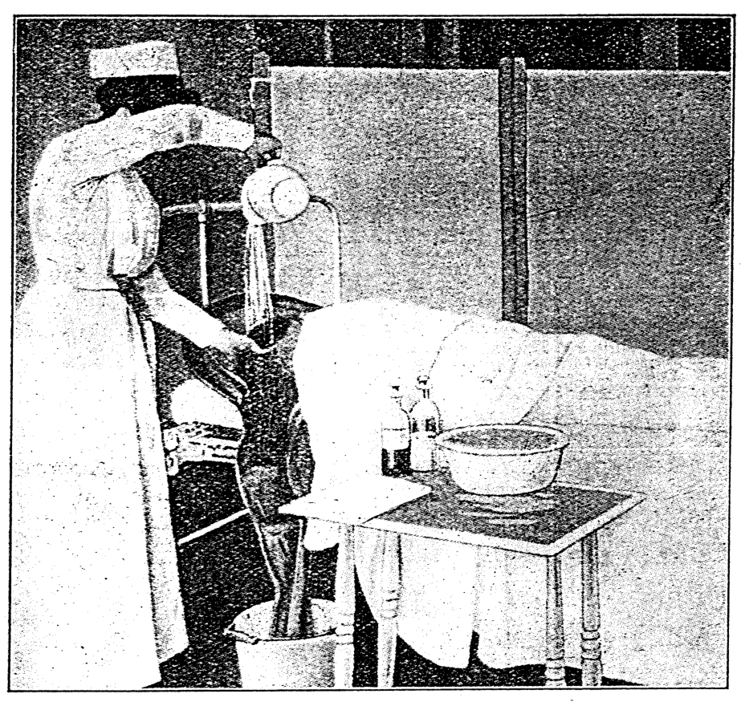
    <figcaption style="font-size: 14px; color: #4a5568; margin-top: 6px;"><em>Tē 126 tô:—Sóe lú hoān-chiá ê thâu-môg. (From Sanders' “ Modern Methods in Nursing.”)</em></figcaption>
  </figure>

### 170 BÎN-CHHÎNG, I-HO̍K, THONG KHONG-KHÌ Ê HOAT-TŌ͘

...khang pák sòaⁿ, saⁿ chhioh tn̂g; tî-hông kiaⁿ-liáu i thun-lo̍h-khì.

> **【全漢對照】**
> ...孔綁線，三尺長；提防驚了伊吞落去。

---

### [Chiàu-kò͘ hū-jîn-lâng thâu-mn̂g ê hoat-tō͘]

**[旁註]**
*Hū-jîn-lâng ê thâu-mn̂g*
*Sóe thâu-mn̂g*

Chiàu-kò͘ hū-jîn-lâng thâu-mn̂g ê hoat-tō͘ (tē 126 tô͘) :
Thâu-mn̂g tióh ta̍k ji̍t kā i soe, iā tióh pun chòe nn̄g

> **【全漢對照】**
> **[旁註]**
> *婦仁人的頭毛*
> *洗頭毛*
> 
> 照顧婦仁人頭毛的法度（第 126 圖）：
> 頭毛著逐日給伊梳，也著分做兩

---

*Tē 126 tô͘.—Sóe lú hoān-chiá ê thâu-mn̂g. (From Sanders' “Modern Methods in Nursing.”)*

> **【全漢對照】**
> *第 126 圖。—洗女患者的頭毛。（From Sanders' “Modern Methods in Nursing.”）*

---

pêng lâi soe, pīⁿ chòe nn̄g ki ê mn̂g-bé. Ū-sî chi̍t pêng tîⁿ kè-lâi, hit pêng tîⁿ kè-khì; tī téng-bīn ēng pín-chiam lâi kit. Ì-sù sī khah bē hō͘ thâu-chang tī āu-khok tiam-tióh; án-ni khah khòaⁿ-oa̍h, iā lēng ji̍t khah khoài soe. Teh-beh soe ê sî, tióh tùi bé-á chiām-chiām soe kàu thâu-mn̂g-thâu, chiah khah bōe phah-kat-kiû, hō͘ pīⁿ-lâng khah bōe thiàⁿ.

> **【全漢對照】**
> 爿來梳，辮做兩枝的毛尾。有時一爿纏過來，彼爿纏過去；佇頂面用扁針來結。意思是較𣍐互頭鬃佇後梏砧著；按呢較快活，也另日較快梳。欲梳的時，著對尾仔漸漸梳到頭毛頭，才較𣍐拍結毬，互病人較𣍐痛。

---

Koh ta̍k lé-pài tióh chi̍t pái kā i pìn-thâu.

Thâu-mn̂g nā ū siⁿ sat-bú ê lâng, tióh pī-pān ióh-

> **【全漢對照】**
> 閣逐禮拜著一擺給伊篦頭。
> 
> 頭毛若有生虱母的人，著備辦藥—

<!-- Page 186 End -->

---

<!-- Page 187 Start -->
#### 📖 原書第 187 頁

### SÓE THÂU-MN̂G, THONG KHONG-KHÌ (p. 171)

chúi *hydrargyri perchloridum* 1-500, á-sī *acidum carbolicum* 1-40 tī óaⁿ-lāi, mî-hoe, bīn-kun, sat-pìⁿ, kū ê pò͘. Nā pīⁿ-lâng tó tī bîn-chhng, tio̍h chhu bīn-kun tī thâu-khak-ē; nā ōe khí-lâi chē-ê, ēng bīn-kun moa tùi ka-chiah kàu keng-kah.

> **【全漢對照】**
> 水 *hydrargyri perchloridum*（昇汞水）1-500，抑是 *acidum carbolicum*（石炭酸）1-40 佇碗內，棉花、面巾、虱篦、舊的布。若病人倒佇眠床，著跓面巾佇頭殼下；若會起來坐的，用面巾瞞對骹脊到肩胛。

---

Sat-pìn tio̍h chìm tī io̍h-chúi, ûn-ûn-á kā i pìn, ēng mî lâi chhit kiaⁿ-lâng, tio̍h hē tī io̍h-chúi-ni̍h, á-sī ēng sat-pìn-thok. Koh ēng pò͘ chìm tī io̍h-chúi, lâi pau thâu-mn̂g, ēng pheng-tòa kā i pa̍k; án-ni ta̍k ji̍t ōaⁿ chi̍t pái, kàu bô sat-bú, chiah soah.

> **【全漢對照】**
> 虱篦著浸佇藥水，勻勻仔共伊篦，用棉來拭驚人，著下佇藥水裡，抑是用虱篦托。閣用布浸佇藥水，來包頭毛，用繃帶來共伊縛；按呢逐日換一擺，到無虱母，才煞。

---

### Sóe thâu-mn̂g（洗頭毛）

Sóe thâu-mn̂g : Lâng nā tó tī bîn-chhng, iû-goân tio̍h sóe thâu-mn̂g. Beh sóe ê sî, tio̍h tó tī bîn-chhng-piⁿ, ēng chi̍t tiâu tōa tiâu ê chhiū-leng-pò͘, chi̍t thâu chhu tī pīⁿ-lâng ê am-kún-ē, chi̍t-thâu tùi bîn-chhng-piⁿ sûi-lo̍h tī chúi-tháng-lāi.

> **【全漢對照】**
> 洗頭毛：人若倒佇眠床，猶原著洗頭毛。欲洗的時，著倒佇眠床邊，用一條大條的樹奶布，一頭跓佇病人的頷頸下，一頭對眠床邊垂落佇水桶內。

---

Tāi-seng ēng sat-bûn ùn sio-chúi khí-lâi, lù thâu-khak hō͘ i chiâu tio̍h, āu-lâi ēng sio-chúi sóe, koh thōa, kàu lóng-chóng chheng-khì. Ēng ta ê kun-á kap thâu-mn̂g-bé saⁿ-kap chūn, thâu-mn̂g-thâu tio̍h ēng kun-á lù, kàu chiâu, koh ēng kòe-sìⁿ iat hō͘ i ta, āu-lâi thèng-hāu ta liáu, chiah koh soe hō͘ i hó-sè (tē 126 tô͘).

> **【全漢對照】**
> 首先用撒文（雪文/肥皂）搵燒水起來，嚕頭殼予伊齊著，後來用燒水洗，閣汱，到攏總清氣。用乾的巾仔佮頭毛尾相佮捘，頭毛頭著用巾仔嚕，到齊，閣用蓋扇搧予伊乾，後來聽候乾了，才閣梳予伊好勢（第 126 圖）。

---

### Thong khong-khì（通空氣）

Thong khong-khì ê hoat-tō͘, m̄-nā ūi-tióh pīⁿ-lâng ê lī-ek, khàn-hō͘ iā sī ū lī-ek, chóng-sī gō͘-cha̍p ê pīⁿ-lâng ê tiong-kan, tāi-khài bô chi̍t-ê hoaⁿ-hí beh khui thang-á, tek-khak tio̍h ēng hó ê ōe lâi khó͘-khǹg in ; tio̍h chai chhù-lāi tek-khak tio̍h ū sin ê khong-khì, lâi ōaⁿ-khì chiah ê ù-òe ê khì. Chit tiâu lí bô lūn phòa-pīⁿ-lâng àn-cháiⁿ kóng, khàn-hō͘ tio̍h it-khài m̄-thang thiaⁿ. Ji̍t--sî khui thang-á ê sî-chūn, tang-thiⁿ hē-thiⁿ sī siāng chi̍t-iūⁿ, nā-sī thiⁿ-khì khah sio-joa̍h, mî-sî iā thang chiàu chū-kí ê ì-sù lâi khui thang-á. Chóng-sī iàu-kín tio̍h sío-sim. Pīⁿ-lâng ê

> **【全漢對照】**
> 通空氣的法度，毋但為著病人的利益，看護也是有利益，總是五十個病人的中間，大概無一個歡喜欲開窗仔，的確著用好的話來苦勸𪜶；著知厝內的確著有新的空氣，來換去諸個污穢的氣。這條理無論破病人按怎講，看護著一概毋通聽。日時開窗仔的時陣，冬天夏天是成一樣，若是天氣較燒熱，暝時也通照自己的意思來開窗仔。總是要緊著小心。病人的……

---

#### [頁底格言註腳]

Koh tī pa̍t-ê pèng bô chín-kiù ; in-ūi tī thiⁿ-ē, bô siúⁿ-sù pa̍t ê miâ tī lâng ê tiong-kan, hō͘ lán tiàm tī i lâi tit kiù (Sù-tô͘ Hēng-toān 4: 12).

> **【全漢對照】**
> 閣佇別個並無拯救；因為佇天下，無賞賜別的名佇人的中間，互咱踮佇伊來得救（使徒行傳 4: 12）。

<!-- Page 187 End -->

---

<!-- Page 188 Start -->
#### 📖 原書第 188 頁

  <figure style="display: inline-block; margin: 12px; max-width: 90%; text-align: center;">
    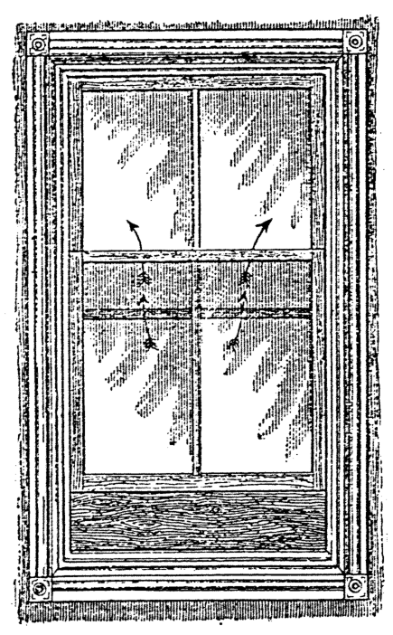
    <figcaption style="font-size: 14px; color: #4a5568; margin-top: 6px;"><em>Tē 127 tô.―Tuì siang-tó· ê thang-á-mn̂g thong khong-khì (Stoney).</em></figcaption>
  </figure>

### 172 BÎN-CHHÎNG, I-HÓK, THONG KHONG-KHÌ Ê HOAT-TŌ͘

#### [Thong khong-khì]
bîn-chhîng, nā kó-jiân ē chhiong-tio̍h hong, khàn-hō͘ tio̍h ēng ûi-pîn lâi chàh chiah hó. Tāi-khài lâi kóng, khàn-hō͘ tio̍h ē bêng-pe̍k thiⁿ-khì ê kôaⁿ-joa̍h, chiàu hit-ê khám-chām lâi khui lâi koaiⁿ ê lí-khì, che sī tī lín ê ha̍k-būn, kiàn-sek khòaⁿ cháiⁿ-iūⁿ-lah; chhin-chhiūⁿ thiⁿ-khì nā thài léng, ia̍h sī tio̍h khui thang-á hō͘ thong-khì, put-kò tio̍h ke kā pīⁿ-lâng chhēng saⁿ, kap kah phē, chiū bô iàu-kín; thèng-hāu khong-khì ōaⁿ liáu chiū liām-piⁿ thang koh koaiⁿ. Koh chi̍t hāng m̄-thang ūi-tio̍h chi̍t ê lâng ê iân-kò͘, lâi kā in khui-koaiⁿ, che chiū-sī ko téng khàn-hō͘ ê tāi-chì.

> **【全漢對照】**
> **[通空氣]**
> 眠床，若果然會衝著風，看護著用圍屏來遮則好。大概來講，看護著會明白天氣的寒熱，照彼個坎站來開來關的理氣，這是佇恁的學問、見識看怎樣啦；親像天氣若太冷，抑是著開窗仔予通氣，不過著加給病人著衫，及蓋被，就無要緊；聽候空氣換了就連鞭通閣關。閣一項毋通為著一個人的緣故，來給𪜶開關，這就是高等看護的代誌。

---

#### [Pīⁿ-sek ê un-tō͘]
Pīⁿ-sek ê hân-loán-kè (chiū-sī kiám-cha un-tō͘ ê khì-kū) tio̍h khah siông tī 60 tō͘ F. chì 65 tō͘ F. (15.6°C.—18.0°C.). Un-tō͘ nā bô kàu 60 tō͘ F. (15.6°C.), chiū tio̍h ēng hé-lô͘; nā tī 65 tō͘ í-chiūⁿ chiū tio̍h khui thang-á. Chit-ê sī khah ha̍p tī kôaⁿ-thiⁿ ê só͘-chāi; nā-sī jia̍t-tài ê ūi, pīⁿ-sek ê un-tō͘ tio̍h 65°—70° F. (18.0°C.—21.0°C.)

> **【全漢對照】**
> **[病室的溫度]**
> 病室的寒暖計（就是檢查溫度的器具）著較常佇 60 度 F. 至 65 度 F. (15.6°C.—18.0°C.)。溫度若無到 60 度 F. (15.6°C.)，就著用火爐；若佇 65 度以上就著開窗仔。這是較合佇寒天的所在；若是熱帶的位，病室的溫度著 65°—70° F. (18.0°C.—21.0°C.)。

---

#### [Tô͘-chí / 圖片說明]
Tē 127 tô͘.—Tùi siang-tó͘ ê thang-á-mn̂g thong khong-khì (Stoney).

> **【全漢對照】**
> 第 127 圖。—對雙堵的窗仔門通空氣 (Stoney)。

---

#### [Khui thang-á]
Pīⁿ-sek ê téng-bīn tio̍h ū thang-á, thang tháu chiah ê kiaⁿ-lâng ê khì, in-ūi m̄-hó ê khì, khah chōe tī téng-bīn; nā bōe-ōe tī pâng-téng khui thang-á, tek-khak tio̍h khui mn̂g-lî á-sī khui thang-á.

Tāi-khài lâi kóng, thong khong-khì ê hoat-tō͘, tio̍h siông-siông hō͘ i tú-hó, mî kap ji̍t siâng chi̍t iūⁿ; nā ji̍t-sî ū teh ōaⁿ khong-khì, mî-sî chiū kín koaiⁿ, án-ni khí-thâu sī hó, m̄-kú āu-lâi iû-goân sī bô lō͘-ēng. Tī tē 127 tô͘ chit ê thang-á thong-khong-khì ê hoat, chiū-sī ū siang tó͘

> **【全漢對照】**
> **[開窗仔]**
> 病室的頂面著有窗仔，卡通透諸個驚人的氣，因為唔好的氣，較多佇頂面；若袂會佇房頂開窗仔，的確著開門楣抑是開窗仔。
> 
> 大概來講，通空氣的法度，著常常予伊拄好，暝及日同一樣；若日時有咧換空氣，暝時就緊關，按呢起頭是好，毋過後來油原是無路用。佇第 127 圖彼個窗仔通空氣的法，就是有雙堵……

<!-- Page 188 End -->

---

<!-- Page 189 Start -->
#### 📖 原書第 189 頁

### MÎ-SÎ TIO̍H TIĀM-CHĒNG（173）

ê thang, chiong ē-bīn tó thuh chiūⁿ koâiⁿ tām-po̍h, ē-bīn chiah thò chi̍t phìⁿ pang, chiū siang tó ê thang-á ōe làng phāng, chiū khong-khì ōe ji̍p, bōe ti̍t-ti̍t chhe-tio̍h pīⁿ-lâng.

> **【全漢對照】**  
> 的窗，將下面倒揬上懸淡薄，下面才套一片枋，就雙倒的窗仔會閬縫，就空氣會入，袂直直吹著病人。

---

Mî-sî tē-it léng, chiū-sī saⁿ-sì tiám-cheng ê sî, hit-tiap m̄-thang hō͘ hé-lô͘ ê hé hoa-khì; tī ji̍t-sî nā khah hó thiⁿ-khì, chiū m̄-bián thiⁿ siuⁿ chōe thô͘-thòaⁿ.

> **【全漢對照】**  
> 暝時第一冷，就是三四點鐘的時，彼霎毋通予火爐的火化去；佇日時若較好天氣，就毋免添傷濟塗炭。

---

### Ji̍t ê kng

Thài-iông ê kng ōe bia̍t-bô bî-seng-bu̍t, só͘-í chhù-lāi iàu-kín tio̍h ū ji̍t ê kng; nā-sī thiⁿ-khì siuⁿ joa̍h ê sî, khàn-hō͘ tio̍h chiong mn̂g-lî pàng lo̍h-lâi.

> **【全漢對照】**  
> **日的光**  
> 太陽的光會滅無微生物，所以厝內要緊著有日的光；若是天氣傷熱的時，看護著將門簾放落來。

---

### Mî-sî tio̍h tiām-chēng

Mî-sî chòe tāi-chì tio̍h khah tiām-chēng, in-ūi pīⁿ-lâng nā thiaⁿ-kìⁿ khi̍h-khia̍uh ê siaⁿ, ài bōe khùn-tit, chiū in ê sim put an. Thiⁿ hé-lô͘ ê hé-thòaⁿ, á-sī thô͘-thòaⁿ m̄-bián ēng thih ê mi̍h sī khah hó; lâ hé-lô͘ ēng chhâ-kùn-á chiah bōe ū siaⁿ; ia̍h beh the̍h hé-thòaⁿ tio̍h ēng chhiú, chhiú chiah kòa chhiú-lok.

> **【全漢對照】**  
> **暝時著恬靜**  
> 暝時做代誌著較恬靜，因為病人若聽見 khi̍h-khia̍uh（喀硞）的聲，愛袂睏得，就𪜶的心不安。添火爐的火炭，抑是塗炭毋免用鐵的物是較好；揦火爐用柴棍仔才袂有聲；亦欲提火炭著用手，手才掛手橐。

---

Goán óa-khò Ki-tok ǹg Siōng-tè ū chit hō ê sìn (II Ko-lîm-to 3: 4).

> **【全漢對照】**  
> 阮倚靠基督向上帝有此號的信（哥林多後書 3: 4）。

<!-- Page 189 End -->

---

