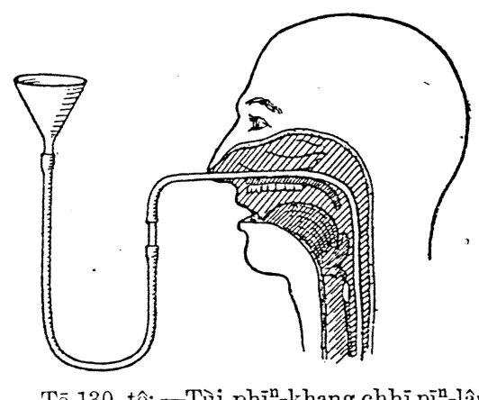
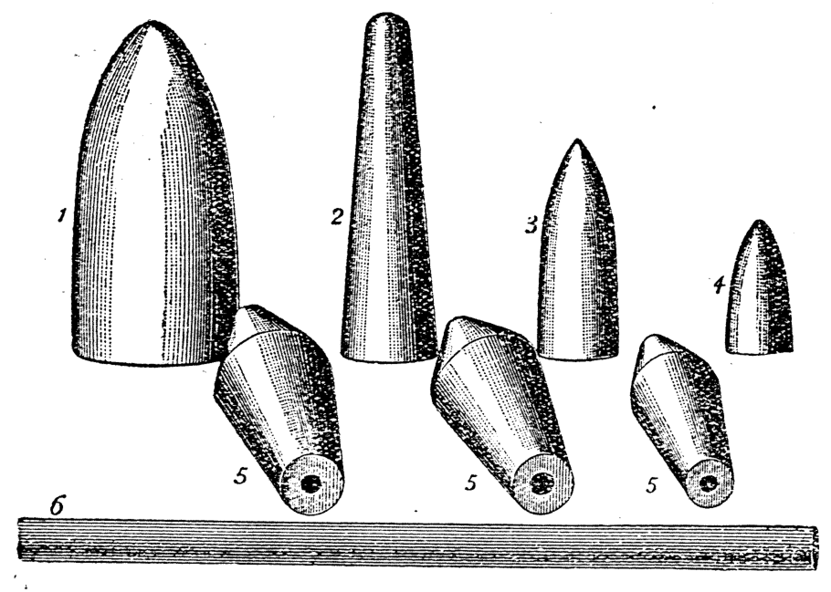
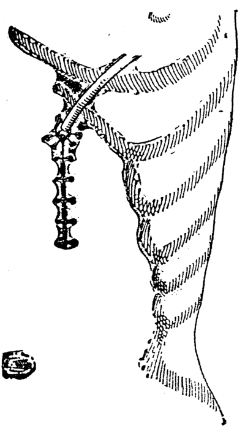

# 第十五章 特別飼病人的法 (Tēk-pie̍t Chhī Pīⁿ-lâng ê Hoat)

> **所屬篇章**：第二篇 普通看護學 (Phó͘-thong Khàn-hō͘-ha̍k)
> **原書頁碼**：第 200 頁 ～ 第 206 頁 (已收錄 7/7 頁)

---

<!-- Page 200 Start -->
#### 📖 原書第 200 頁

  <figure style="display: inline-block; margin: 12px; max-width: 90%; text-align: center;">
    
    <figcaption style="font-size: 14px; color: #4a5568; margin-top: 6px;"><em>Tē 130 tô.—Tùi phīⁿ-khang chhī pīⁿ-lâng ê hoat-tō͘. (From Woodwark's “Medical Nursing,” Edward Arnold, publisher.)</em></figcaption>
  </figure>

### TĒ 15 CHIUⁿ
### TEK-PIA̍T CHHĪ PĪⁿ-LÂNG Ê HOAT

[Nn̄g tiâu lō͘] Nā-sī pīⁿ-lâng bōe thun mi̍h, á-sī nâ-âu ū chhiú-su̍t chèng, bōe thun mi̍h, ti̍oh ēng te̍k-pia̍t ê hoat-tō͘ lâi chhī i. Pīⁿ-lâng nā ū náu-chek-chhé-mo̍h-īam, á-sī si̍t-hû-tek-lí-a (pe̍h-âu-chèng), á-sī thun mi̍h ê kun-bah bâ-pì, ū-sî ti̍oh ēng chhiū-leng-kńg hō͘ si̍t-bu̍t ji̍p ūi-nih. Ēng chit ê hoat-tō͘, ū nn̄g tiâu lō͘: (1) tùi phīⁿ-khang, ian-thâu, chia̍h-tō, ūi; (2) tùi chhùi, ian-thâu, chia̍h-tō, ūi (tē 130 tô͘).

> **【全漢對照】**
> ### 第 15 章
> ### 特別飼病人的法
> 
> [兩條路] 若是病人袂吞物，抑是頷喉有手術症，袂吞物，著用特別的法度來飼伊。病人若有腦脊髓膜炎，抑是「息夫的里亞」（白喉症），抑是吞物的筋肉麻痺，有時著用樹乳管互食物入胃裡。用這个法度，有兩條路：(1) 對鼻孔、咽頭、食道、胃；(2) 對喙、咽頭、食道、胃（第 130 圖）。

---

#### Tē 130 tô͘.—Tùi phīⁿ-khang chhī pīⁿ-lâng ê hoat-tō͘. (From Woodwark’s “Medical Nursing,” Edward Arnold, publisher.)

> **【全漢對照】**
> 第 130 圖。—對鼻孔飼病人的法度。（出自伍德沃克著《內科看護學》，愛德華·阿諾德出版。）

---

Thâu chi̍t pái tiāⁿ-ti̍oh ài i-seng chhī i, khàn-hō͘ kap i-seng tāi-seng pī-pān it-khài só́ ti̍oh ēng ê mi̍h-kiāⁿ, chiàu ē-bīn só́ kì-ê :

> **【全漢對照】**
> 頭一次定著愛醫生飼伊，看護佮醫生代先備辦一概所有著用的物件，照下面所記的：

---

[Ti̍oh ū-pī ê mi̍h]
1. Chhoân chi̍t tiâu tn̂g, koh nńg, beh tùi phīⁿ-khang chhòng mi̍h hō͘ pīⁿ-lâng chia̍h ê chhiū-leng-kńg. Khah siông só́ ēng ê chhiū-leng-kńg, sī teh thong jiō-tō ê chhiū-leng-kńg (tō-jiō-kńg, *urethral catheter*, *Jaques’ catheter, No. 6*). (Nā kè ēng tō-jiō-su̍t chiū m̄-thang ēng).
2. Nā-sī bô kàu tn̂g, ti̍oh lēng-gōa chián chi̍t tiâu chhiū-leng-kńg sio-chiap; sio-chiap ê só́-chāi ēng po-lê-kńg.
3. Bīn-kun, bīn-tháng, sio-chúi; chiong chhiū-leng-kńg chìm hō͘ nńg. Chi̍t tè sòe tè tih-á tóe *glycerinum*.
4. I-seng só́ hoan-hù ê si̍t-bu̍t, chhin-chhiūⁿ gû-leng,

> **【全漢對照】**
> [著預備的物]
> 1. 攢一條長閣軟、欲對鼻孔創物互病人食的樹乳管。較常所用的樹乳管，是咧通尿道的樹乳管（導尿管，*urethral catheter*，*Jaques’ catheter, No. 6*）。（若過用導尿術就唔通用）。
> 2. 若是無夠長，著另外剪一條樹乳管相接；相接的所在用玻璃管。
> 3. 面巾、面桶、熱水；將樹乳管浸互軟。一塊細塊碟仔貯 *glycerinum*（甘油）。
> 4. 醫生所吩咐的食物，親像牛奶，

---

Pīⁿ-lâng hó-gia̍h á-sī sòng-hiong, ti̍oh khoán-thāi siāng chi̍t khoán.

> **【全漢對照】**
> 病人好額抑是散鄉，著款待成一款。

<!-- Page 200 End -->

---

<!-- Page 201 Start -->
#### 📖 原書第 201 頁

### TÙI PHĪⁿ-KHANG CHHĪ Ê HOAT（185）

bah-thng, á-sī gû-leng phàu koe-nn̄g ; iā ti̍h ū 100 tō͘ F. (37.8° C.) sio.

> **【全漢對照】**
> 肉湯，抑是牛乳泡雞卵；也著有 100 度 F. (37.8° C.) 燒。

---

5. Chi̍t tè, sòe tè ê po-lê lāu-táu (*funnel*), lâi tàu tī chhiū-leng-kńg.

> **【全漢對照】**
> 一塊，細塊的玻璃漏斗（*funnel*），來鬥佇樹乳管。

---

6. Ēng *glycerinum* boah chhiū-leng-kńg, beh ji̍p phīⁿ-khang hit thâu bé-liu. Chhng chhiū-leng-kńg tē it ti̍h sió-sim ê sū, iàu-kín ti̍h ti̍t-ti̍t khò ē-pîⁿ; khin-khin kā i chhng lo̍h-khì, chhian-bān m̄-thang tùh hō͘ tùi ian-thâu ê téng-bīn khì, á-sī hō͘ i koh ji̍p chhùi-lāi khûn-teh. Iáu ū chi̍t khoán ûi-lân ê só͘-chāi, chiū-sī chhiū-leng-kńg ū-sî ē chhng tùi khì-kńg-lāi ji̍p-khì; chòe iàu-kín ti̍h sió-sim. Siat-sú chhiū-leng-kńg, chhng tùi khì-kńg ji̍p-khì, pīⁿ-lâng tiāⁿ-ti̍h ē tōa sàu, chiū thang chai sī chhng m̄-ti̍h, án-ni ti̍h thiu-chhut-lâi, koh chhng-ji̍p. Nā chhiū-leng-kńg chhng-lo̍h-khì liáu-āu, pīⁿ-lâng iû-goân chiàu kū teh hō͘-khip, chiū thang chai tiāⁿ-ti̍h bô chhò-gō͘.
*(邊註：Tùi phīⁿ-khang chhī / Nā ji̍p khì-kńg ē sàu, iā hō͘-khip khùn-lân)*

> **【全漢對照】**
> 用 *glycerinum*（甘油）抹樹乳管，欲入鼻孔彼頭尾溜。插樹乳管第一著小心的事，要緊著直直靠下爿；輕輕共伊插落去，千萬毋通牴互對咽頭的頂面去，抑是互伊閣入嘴內捲咧。猶有一款危難的所在，就是樹乳管有時會插對氣管內入去；做要緊著小心。設使樹乳管，插對氣管入去，病人定著會大嗽，就通知是插毋著，按呢著抽出來，閣插入。若樹乳管插落去了後，病人依然照舊咧呼吸，就通知定著無錯誤。
*(邊註：對鼻孔飼 / 若入氣管會嗽，也呼吸困難)*

---

7. Nā-sī nî-hè í-keng tióng-sêng ê lâng, ti̍h chhng tùi chhùi khí, 10 chhùn (Ji̍t-pún chhùn, chiū-sī 33 *cm.*) ji̍p-khì chiah ha̍p-sek. Nā ji̍p chia̍h-tō bô kàu ūi, bô iàu-kín. Nā-sī gín-ná ti̍h khah té. Tāi-khài kóng gō͘ hè ê gín-ná, ti̍h chhng 7 chhùn chiū hó (21 *cm*).
*(邊註：Chhng lōa hn̄g)*

> **【全漢對照】**
> 若是年歲已經長成的人，著插對嘴起，10 寸（日本寸，就是 33 *cm.*）入去才合適。若入食道無到位，不要緊。若是囡仔著較短。大概講五歲的囡仔，著插 7 寸就好（21 *cm*）。
*(邊註：插偌遠)*

---

8. Tāi-seng ēng chi̍t thng-sî lâ-lûn-sio ê kún-chúi tò hē lāu-táu. Nā lâu hó-sè, bô sàu, chiū thò-tòng. Hit sî ti̍h ēng gû-leng (á-sī hō͘ i só͘ chia̍h ê mih), ûn-ûn-á tò hē lāu-táu, hō͘ i lâu-lo̍h-khì. Chóng-sī ti̍h siông-siông hō͘ i lâu, m̄-thang hō͘ lāu-táu ū làng khang, in-ūi lāu-táu chi̍t-ē làng khang, khong-khì ē chǹg-ji̍p-khì tī pīⁿ-lâng ê ūi-nih ; án-ni chiū pīⁿ-lâng ē áu-thò͘, iā ūi ē khok-tiong.

> **【全漢對照】**
> 首先用一湯匙微溫（*lâ-lûn*）燒的滾水倒下漏斗。若流好勢，無嗽，就妥當。彼時著用牛乳（抑是互伊所食的物），勻勻仔倒下漏斗，互伊流落去。總是要常常互伊流，毋通互漏斗有閬孔，因為漏斗一下閬孔，空氣會鑽入去佇病人的胃裡；按呢就病人會嘔吐，也胃會擴張。

---

9. Nā í-keng chia̍h kàu-gia̍h, chhiū-leng-kńg ti̍h ngoeh ân, hō͘ chhiū-leng-kńg-lāi ê mih bô lâu-chhut, tī-hông mih ji̍p khì-kńg ; ûn-ûn-á thiu-chhut-lâi, sóe chheng-khì, chìm tī *lotio acidi borici*.

> **【全漢對照】**
> 若已經食夠額，樹乳管著夾（*ngoeh*）絚，互樹乳管內的事物無流出，預防物入氣管；勻勻仔抽出來，洗清潔，浸佇 *lotio acidi borici*（硼酸水洗劑）。

---

Gín-ná nā háu, m̄-thang liâm-piⁿ hō͘ i chia̍h leng.

> **【全漢對照】**
> 囡仔若吼，毋通連鞭互伊食乳。

<!-- Page 201 End -->

---

<!-- Page 202 Start -->
#### 📖 原書第 202 頁

### 186 TE̍K-PIÁT CHHĨ PĨⁿ-LÂNG Ê HOAT

#### [Chhĩ sòe-kíⁿ]

Nā-sī chhĩ sòe-kiáⁿ, á-sī kiaⁿ ê lâng, tiòh kiò chi̍t lâng tàu pang-chān; chiong i ê chhiú liàh ān, bóh-tit hō͘ i loān-loān jiàu. Á-sī ēng pheng-tòa, chiong nñg ki chhiú pàk tiâu, iā thang.

> **【全漢對照】**
> 若是飼細囝，抑是驚的人，著叫一人湊幫贊；將伊的手掠絚，莫得予伊亂亂抓。抑是用繃帶，將兩隻手縛牢，亦通。

---

Téng-bīn hiah ê hoat-tō͘, khàn-hō͘ tiòh sió-sim, khòaⁿ i-seng cháiⁿ-iūⁿ chòe hoat, lóng tiòh kì hō͘ i chheng-chhó. Tāi-khài i-seng put-kò chhĩ pīⁿ-lâng chi̍t pái, āu-lâi chiū-sī khàn-hō͘ ê giảh.

> **【全漢對照】**
> 頂面遐的法度，看護著小心，看醫生怎樣做法，攏著記予伊清楚。大概醫生不過飼病人一擺，後來就是看護的額。

---

Nā-sī ū put-séng-jîn-sū hit khoán ê pīⁿ-lâng, nā pīⁿ-lâng ū tiap-á-kú ōe cheng-sîn, tiòh thàn hit-tiap, ēng thng-sî iúⁿ tām-póh gû-leng, hē i chhùi-tûn-piⁿ, chhì-khòaⁿ i ōe thun á bōe; chóng-sī m̄-thang chōe, kiaⁿ-liáu si̍t-bu̍t ōe tùi khì-kńg ji̍p-khì hì-lāi. Nā mi̍h ji̍p-khì hì-lāi, lâng ōe sí, á-sī pīⁿ-chiâⁿ hì-iām.

> **【全漢對照】**
> 若是有不省人事許款的病人，若病人有霎仔久會精神，著趁許霎，用湯匙𢳢淡薄牛奶，下伊嘴脣邊，試看伊會吞抑袂；總是不通濟，驚了食物會對氣管入去肺內。若物入去肺內，人會死，抑是病成肺炎。

---

### [Tùi chhùi chhĩ]

Ēng sóe ūi ê chhiū-leng-kńg, chhĩ pīⁿ-lâng ê hoat-tō͘ : Chit ê hoat-tō͘ sī khah siông teh chhĩ tōa-lâng. Iā ēng chhiū-leng-kńg tùi chhùi chhng-ji̍p. Hoat-tō͘ tāi-khài sī kap kì tī téng-bīn-ê sio-siāng. Ū te̍k-piát ê khui-chhùi-khì, sī chhâ chòe-ê, tiong-ng ū chi̍t ê khang, beh chhng chhiū-leng-kńg ê lō͘-ēng, tī-hông pīⁿ-lâng beh kā (tē 131 tô͘).

> **【全漢對照】**
> 用洗胃的樹奶管，飼病人的法度：此個法度是較常咧飼大人。亦用樹奶管對嘴穿入。法度大概是及記佇頂面的相像。有特別的開嘴器，是柴做的，中央有一個孔，欲穿樹奶管的路用，提防病人欲咬（第 131 圖）。

---

> **Tē 131 tô͘.**—(From Woodwark’s “Medical Nursing,” Edward Arnold, publisher.)  
> **【全漢對照】**  
> 第 131 圖。——（出自伍德沃克《醫學看護學》，愛德華·阿諾德出版社。）

---

### [Êng-ióng-koàn-tn̂g]

Êng-ióng-koàn-tn̂g (營養灌腸, *Nutrient enema*) : Nā-sī ūi-nih, bōe-ōe tóe-tit si̍t-bu̍t (in-ūi áu-thò͘, ūi sîⁿ ūi-iông, ūi tiòh-siong, nâ-âu chèng, chhùi-lāi chhiú-su̍t ê iân-kò͘), tiòh siat-hoat tùi tit-tn̂g lâi koàn êng-ióng-liāu. Ū-sî pīⁿ-lâng chhiú-su̍t liáu-āu chin siong-tiōng, i-seng beh hoan-hù tiòh ēng chit hō êng-ióng-koàn-tn̂g.

> **【全漢對照】**
> 營養灌腸（營養灌腸，*Nutrient enema*）：若是胃裡，袂會底得食物（因為嘔吐、胃生胃瘍、胃著傷、頷喉症、嘴內手術的緣故），著設法對直腸來灌營養料。有時病人手術了後真嚴重，醫生欲吩咐著用此號營養灌腸。

---

### [Êng-ióng-liāu]

A. Tāi-seng pī-pān êng-ióng-liāu beh koàn-tn̂g. Só́ ēng ê hoat-tō͘, tiòh i-seng chú-ì, chóng-sī khàn-hō͘ tiòh ōe hiáu chhòng. Khah siông chit hō êng-ióng-liāu, tiòh tāi-seng ēng chūi-e̍k-siau-hòa ê hoat-tō͘, pī-pān hō͘ piān.

> **【全漢對照】**
> A. TISENG 備辦營養料欲灌腸。所用的法度，著醫生注意，總是看護著會曉創。較常此號營養料，著代先用胰液消化的法度，備辦予便。

<!-- Page 202 End -->

---

<!-- Page 203 Start -->
#### 📖 原書第 203 頁

### KOÀN-TN̂G-HOAT（187 頁）

*(a)* Kún-chúi 500.0 c.c.  
Iâm 3.5 grm.  
Chūi-e̍k-siau-hòa ê gû-bah-chiap 30.0 c.c.  

> **【全漢對照】**  
> *(a)* 滾水 500.0 c.c.  
> 鹽 3.5 grm.  
> 胰液消化 的 牛肉汁 30.0 c.c.

---

*(b)* Koe-n̄g 2 lia̍p.  
Chūi-e̍k-siau-hòa ê gû-bah-chiap 60.0 c.c.  
Chūi-e̍k-siau-hòa ê gû-leng 60.0 c.c.  

> **【全漢對照】**  
> *(b)* 雞卵 2 粒。  
> 胰液消化 的 牛肉汁 60.0 c.c.  
> 胰液消化 的 牛奶 60.0 c.c.

---

Koe-n̄g tióh tok phòa, ēng tek-chhiám phah. Jiân-āu ēng só͘ beh koàn ê mi̍h lóng lā hō͘ chiâu.  
Chiàu i-seng só͘ hoan-hù thang chham phû-tô-chiú, a-phiàn, á-sī sím-mi̍h pa̍t-khoán ê ióh.  

> **【全漢對照】**  
> 雞卵著㧒破，用竹籤拍。然後用所欲灌的物攏攪予齊。  
> 照醫生所吩咐通摻葡萄酒、鴉片，抑是甚麼別款的藥。

---

*(c)* Kāu ê ko-phi-tê :  
Ko-phi-hún 120.0 grms.  
Kún-chúi 300.0 c.c.  

> **【全漢對照】**  
> *(c)* 厚的咖啡茶：  
> 咖啡粉 120.0 grms.  
> 滾水 300.0 c.c.

---

### B. Koàn-tn̂g-hoat :

1\. Nā pīⁿ-lâng tn̂g-lāi ū pùn, hō͘ i êng-ióng-liāu sī bô lō͘-ēng, só͘-í tāi-seng tióh hō͘ i sat-bûn-chúi-koàn-tn̂g. Chit-ê tióh chhòng 24 tiám-cheng chi̍t pái. Sóe liáu-āu, tióh hioh chi̍t tiám-cheng-kú chiah chiong êng-ióng-liāu hō͘ i.  

> **【全漢對照】**  
> 1\. 若病人腸內有糞，予伊營養料是無路用，所以代先著予伊撒文水（肥皂水）灌腸。這个著創 24 點鐘一擺。洗了後，著歇一點鐘久才將營養料予伊。

---

2\. Tāi-seng the̍h chi̍t tiâu chhng ti̍t-tn̂g ê chhiū-leng-kúg (*á-sī catheter*), koh the̍h chi̍t tiâu 2, 3 chhioh tn̂g pêng-siông ê chhiū-leng-kńg. Ēng chi̍t-ki po-lê kńg chiap tī hit tiâu chhng ti̍t-tn̂g ê chhiū-leng-kńg, kap pêng-siông chhiū-leng-kńg ê tiong-kan ; chhiū-leng-kńg ê téng-bīn koh chiap chi̍t tè sòe tè ê lâu-táu (*chúi-lāu, funnel*) ; ēng sio-chúi chìm chhiū-leng-kńg tiap-á-kú.  

> **【全漢對照】**  
> 2\. 代先提一條穿直腸的樹艿管（抑是 *catheter*，導尿管/導管），閣提一條 2、3 尺長平常的樹艿管。用一支玻璃管接佇彼條穿直腸的樹艿管，佮平常樹艿管的中間；樹艿管的頂面閣接一塊細塊的漏斗（水漏，*funnel*）；用燒水浸樹艿管疊仔久。

---

3\. Beh chhng kong-bûn ê chhiū-leng-kńg, hit téng-bīn, boah hoa-su-leng-iû (*vaseline*).  

> **【全漢對照】**  
> 3\. 欲穿肛門的樹艿管，彼頂面，抹花士令油（*vaseline*，凡士林）。

---

4\. Nā pīⁿ-lâng ē tín-tāng, chiū kah i the tò-chhiú-pêng, chiah kah i kha-thúi kiu-khí-lâi. Ēng chím-thâu á-sī mî-phē ké pīⁿ-lâng ê kut-pôaⁿ hō͘ khah koâiⁿ tām-po̍h, hō͘ chúi khah khoài lâu-ji̍p-khì.  

> **【全漢對照】**  
> 4\. 若病人會振動，就教伊偏倒手爿（左側），才教伊跤腿搐起來。用枕頭抑是棉被墊病人的骨盤予較懸淡薄，予水較快流入去。

<!-- Page 203 End -->

---

<!-- Page 204 Start -->
#### 📖 原書第 204 頁

### 188 TÈK-PIA̍T CHHĪ PĪⁿ-LÂNG Ê HOAT

> **【全漢對照】**
> 188 特別飼病人的法

---

### [Koàn-tn̂g-hoat]

5. Chòe iàu-kín-ê, chhiū-leng-kńg kap lāu-táu ê tiong-kan, tiòh chiong beh koàn-jip-khì ê mi̍h tóe hō͘ móa, bo̍h-tit hō͘ khong-khì tī hit-nīh, lâi jip pīⁿ-lâng ê tn̂g-lāi. Beh koàn-jip-khì ê sî, tiòh ēng chhiú tùi chhiū-leng-kńg nih-teh, bo̍h-tit hō͘ i lâu-chhut-lâi; chiah chiong chhiū-leng-kńg chhng jip-khì kong-bûn-lāi 10, 11 chhùn tn̂g. Bo̍h-tit hō͘ só͘ koàn ê mi̍h lâu-chhut-lâi.

> **【全漢對照】**
> **【灌腸法】**
> 5. 最要緊的，樹奶管佮漏斗的中間，著將欲灌入去的物貯予滿，莫得予空氣佇遐，來入病人的腸內。欲灌入去的時，著用手對樹奶管掿咧，莫得予伊流出來；才將樹奶管穿入去肛門內 10, 11 寸長。莫得予所灌的物流出來。

---

6. Tē it iàu-kín-ê, tāi-seng tiòh ēng hân-loán-kè, khòaⁿ un-tō͘ ū 98 tō͘ F. (36.7° C.) á-bô; m̄-thang khah koâiⁿ. Tiòh bān-bān koàn-jip. Ēng 300.0 c.c. koàn-tn̂g, tiòh pòaⁿ tiám-cheng-kú chiah hó. Tèh chhng, á-sī koàn ê sî, pīⁿ-lâng eng-kai m̄-chai thiàⁿ. Nā pīⁿ-lâng kóng thiàⁿ, khàn-hō͘ tiòh sòe-jī chhng, in-ūi chhiū-leng-kńg nā siuⁿ ngī, ōe siong-tiòh tn̂g-á-lāi ê liâm-mo̍h, nā ū tòk tùi hia jip-khì, kiaⁿ-liáu ōe hāi-lâng.

> **【全漢對照】**
> 6. 第一要緊的，代先著用寒暖計，看溫度有 98 度 F. (36.7° C.) 抑無；毋通較懸。著慢慢灌入。用 300.0 c.c. 灌腸，著半點鐘久才好。佇咧穿，抑是灌的時，病人應該毋知疼。若病人講疼，看護著細膩穿，因為樹奶管若傷硬，會傷著腸仔內的黏膜，若有毒對遐入去，驚了會害人。

---

7. Mi̍h koàn-jip liáu-āu, chhiū-leng-kńg tiòh ûn-ûn-á thiu-chhut-lâi, chiah koh ēng mî-hoe that kong-bûn kháu tiap-á-kú, bo̍h-tit hō͘ mi̍h cháu-chhut-lâi.

> **【全漢對照】**
> 7. 物灌入了後，樹奶管著勻勻仔抽出來，才閣用棉花塞肛門口貼仔久，莫得予物走出來。

---

8. Só͘ ēng kè ê ke-si, tiòh sóe, siu-khí-lâi khǹg.

> **【全漢對照】**
> 8. 所用過的傢俬，著洗，收起來囥。

---

### Chō-iòh

Chō-iòh: Ū-sî ēng chi̍t lia̍p iòh-oân, that-jip kong-bûn-lāi, im-tō á-sī jiō-tō-lāi, kiò-chòe chō-iòh (坐藥, _suppositorium_). Ū bah chòe ê chō-iòh, iā ū gû-leng chòe-ê (tē 132 tô͘). Hō͘ pīⁿ-lâng chō-iòh ê sî, tiòh hō͘ i the tī tò-chhiú-pêng.

> **【全漢對照】**
> **坐藥**
> 坐藥：有時用一粒藥丸，塞入肛門內、陰道抑是尿道內，叫做坐藥（坐藥, *suppositorium*）。有肉做的坐藥，也有牛奶做的（第 132 圖）。予病人坐藥的時，著予伊敧佇倒手爿。

---

1. Ēng _oleum olivae_ á-sī _vaseline_ boah pīⁿ-lâng ê kong-bûn.

> **【全漢對照】**
> 1. 用 *oleum olivae*（橄欖油）抑是 *vaseline*（凡士林）抹病人的肛門。

---

2. Boah tām-po̍h _oleum olivae_, á-sī _vaseline_ tī hit lia̍p chō-iòh ê téng-bīn.

> **【全漢對照】**
> 2. 抹淡薄 *oleum olivae*，抑是 *vaseline* 佇彼粒坐藥的頂面。

---

3. Khàn-hō͘ tiòh ēng chi̍t tè phò͘-á, tîⁿ tī hit ki kí-cháiⁿ, á-sī kòa chi̍t ê chńg-thâu-á ê chhiū-leng-lông, chiah ùn tām-po̍h _vaseline_. Thêh chō-iòh, hit thâu khah chiam ê bé-á ǹg jip tī kong-bûn-lāi; chiah ēng mî-hoe that kong-

> **【全漢對照】**
> 3. 看護著用一塊布仔，纏佇彼支手指（食指），抑是掛一個指頭仔的樹奶囊（指套），才搵淡薄 *vaseline*。提坐藥，彼頭較尖的尾仔向入佇肛門內；才用棉花塞肛……

<!-- Page 204 End -->

---

<!-- Page 205 Start -->
#### 📖 原書第 205 頁

  <figure style="display: inline-block; margin: 12px; max-width: 90%; text-align: center;">
    
    <figcaption style="font-size: 14px; color: #4a5568; margin-top: 6px;"><em>Tē 132 tô.—Kúi-nā khoán ê chō-ióh: 1, im-tō-chō-ióh; 2–5, tit-tng-chō-ióh; 6, jiō-tō-chō-ióh (Thornton).</em></figcaption>
  </figure>

### CHŌ-IÓH（坐藥） 【第 189 頁】

...bûn-kháu tiap-á-kú, bo̍h-tit hō͘ chō-ióh chhut-lâi.  Nā-sī teh ēng êng-ióng-chō-ióh hō͘ pīⁿ-lâng, tak ji̍t chi̍t pái tiòh ēng sat-bûn kap sio-chúi, sóe tit-tng hō͘ chheng-khì.

> **【全漢對照】**
> ……（肛）門口疊仔久，莫得予坐藥出來。若是咧用營養坐藥予病人，逐日一擺著用雪文佮燒水，洗直腸予清潔。

---

**Tē 132 tô͘.**—Kúi-nā khoán ê chō-ióh: 1, im-tō-chō-ióh; 2–5, tit-tn̂g-chō-ióh; 6, jiō-tō-chō-ióh (Thornton).

> **【全漢對照】**
> **第 132 圖。**——幾若款的坐藥：1，陰道坐藥；2–5，直腸坐藥；6，尿道坐藥（Thornton）。

---

Hoān-nā pī-pān beh tùi kong-bûn siā-ji̍p-khì ê mi̍h, chòe iàu-kín-ê, tiòh tāi-seng khòaⁿ hân-loán-kè ê un-tō͘.  Nā khah siông tùi kong-bûn teh koàn si̍t-bu̍t ê lâng, ū-sî khah bô la̍t thang siu-sok; chiū tiòh hō͘ i hioh kúi tiám-cheng-kú, chiah koh koàn, pí tāi-seng só͘ koàn-ê giáh-sò͘ tiòh khah kiám tām-po̍h.  Ū-sî kong-bûn-kháu put-chí thiàⁿ, hit sî tiòh ēng hoa-su-leng-iû (*vaseline*), á-sī pheng-sng-iû (*unguentum acidi borici*), boah tī kong-bûn ê gōa-bīn.

> **【全漢對照】**
> 凡若備辦欲對肛門射入去的物，做要緊的，著代先看寒暖計的溫度。若較常對肛門咧灌食物的人，有時較無力通收縮；就著予伊歇幾點鐘久，才閣灌，比代先所灌的額數著較減淡薄。有時肛門口不止疼，彼時著用花士令油（vaseline），抑是硼酸油（unguentum acidi borici），抹佇肛門的外面。

---

Ū-sî ūi chhiú-su̍t liáu-āu, (ūi-lú-khui-kháu-su̍t, 胃瘻開口術, *gastrostomy*；【旁註：Ūi-lú-khui-kháu-su̍t】) tiòh tùi ūi lâi chhī i.  I-seng chhiú-su̍t liáu, chiū ēng chi̍t tiâu chhiū-leng-kńg, chi̍t thâu chhng-ji̍p ūi-ni̍h ê tiong-ng, ēng sòaⁿ pa̍k hō͘ tiâu; chi̍t thâu hē

> **【全漢對照】**
> 有時胃手術了後，（胃瘻開口術，胃瘻開口術，*gastrostomy*；【旁註：胃瘻開口術】）著對胃來飼伊。醫生手術了，就用一條樹乳管，一頭穿入胃裡的中間，用線縛予牢；一頭下……

---

Ióh-kan m̄-thang hē tī ióh-toaⁿ-téng.

> **【全漢對照】**
> 藥矸毋通下佇藥單頂。

<!-- Page 205 End -->

---

<!-- Page 206 Start -->
#### 📖 原書第 206 頁

  <figure style="display: inline-block; margin: 12px; max-width: 90%; text-align: center;">
    
    <figcaption style="font-size: 14px; color: #4a5568; margin-top: 6px;"><em>Tē 132a tô.—Ūi-lú-khui-kháu-sùt liáu tàu chhiū-leng-kúg chhī pīⁿ-lâng: Tô· sī lâng heng-khám kap pak-tó· ê tò-pêng. Hiah-ê khah-o· ê chōa, sī hiap-kut; ē-tóe tiong-ng o·-tiám sī tō·-châi; siong-chhùi í-keng háp hó-sè; chhiū-leng-kńg tī siong-chhùi ê téng-bīn pō·-ūi (Rose and Carless).</em></figcaption>
  </figure>

## 第 190 頁

**TE̍K-PIÁT CHHĪ PĪⁿ-LÂNG Ê HOAT**
（特別飼病人的法）

---

### [Ūi-lú-khui-kháu-su̍t]（胃瘻開口術）

...tī seng-khu ê gōa-bīn (tē 132 tô͘). Beh chhī ê sî, ēng lāu-táu, chiap tī gōa-bīn hit thâu ê chhiū-leng-kńg, āu-lâi ēng gû-leng, á-sī bah-e̍k, tò tī hit tè lāu-táu-nih; eng-kai tio̍h chhī lōa-chōe, i-seng ōe tāi-seng thong-ti hō͘ khàn-hō͘ chai; iā thâu chi̍t pái iu-goân tio̍h i-seng tāi-seng chhī in; jiân-āu khàn-hō͘ tio̍h chhī in, kok 4 tiám-cheng-kú chi̍t pái. Ū-sî ūi-e̍k ōe tùi hit ê ūi-nih ê siong-chhùi, lâu-chhut, só͘ chhī ê mi̍h tè i lâu-chhut-lâi, chiū phê ōe thiàⁿ. Chit khoán ê pīⁿ, chòe khàn-hō͘ ê lâng, sī bô hiah iông-īⁿ.

> **【全漢對照】**
> ……佇身軀的外面（第 132 圖）。欲飼的時，用漏斗，接佇外面彼頭的樹乳管（橡皮管），後來用牛奶，抑是肉汁，倒佇彼塊漏斗裡；應該著飼偌濟，醫生會代先通知予看護知；也頭一擺猶原著醫生代先飼𪜶；然後看護著飼𪜶，各 4 點鐘久一擺。有時胃液會對彼個胃裡的傷喙，流出，所飼的物隨伊流出來，就皮會疼。這款的病，做看護的人，是無遐容易。

---

### [Tô͘-soeh]（圖說）

Tē 132ª tô͘.—Ūi-lú-khui-kháu-su̍t liáu tàu chhiū-leng-kńg chhī pīⁿ-lâng: Tô͘ sī lâng heng-khám kap pak-tó͘ ê tò-pêng. Hiah-ê khah-o͘ ê chōa, sī hia̍p-kut; ē-tóe tiong-ng o͘-tiám sī tō-châi; siong-chhùi í-keng ha̍p hó-sè; chhiū-leng-kńg tī siong-chhùi ê téng-bīn pō͘-ūi (Rose and Carless).

> **【全漢對照】**
> 第 132ª 圖。——胃瘻開口術了鬥樹乳管飼病人：圖是人胸坎佮腹肚的倒爿（左側）。遐的較烏的線，是脅骨（肋骨）；下底中央烏點是肚臍；傷喙已經試合勢（癒合良好）；樹乳管佇傷喙的頂面部位 (Rose and Carless)。

<!-- Page 206 End -->

---

