# 第十六章 洗浴、普通及特別的法 (Sóe-e̍k, Phó͘-thong kap Tēk-pie̍t ê Hoat)

> **所屬篇章**：第二篇 普通看護學 (Phó͘-thong Khàn-hō͘-ha̍k)
> **原書頁碼**：第 207 頁 ～ 第 226 頁 (已收錄 20/20 頁)

---

<!-- Page 207 Start -->
#### 📖 原書第 207 頁

### TĒ 16 CHIŪⁿ
### LŪN SÓE-E̍K, PHÓ͘-THONG KAP TE̍K-PIA̍T Ê HOAT

> **【全漢對照】**
> ### 第 16 章
> ### 論洗浴，普通佮特別的法

---

**〔邊註：Khàn-hō͘ tio̍h khóng pīⁿ-lâng sóe-e̍k〕**  
Tī i-īⁿ ê pīⁿ-lâng, khah chōe lia̍h chòe ū pīⁿ lâi sóe-e̍k, sī bô ha̍p-gî, iā kóng pīⁿ-lâng m̄-thang kìⁿ-tio̍h hong. Nā bô khàn-hō͘ teh koán in, hō͘ in ka-kī sûi-piān, tāi-khài pīⁿ-lâng put-kò sóe chhiú sóe bīn nā-tiāⁿ ; pīⁿ-lâng khah chió ka-kī thǹg saⁿ-á-khò͘ lo̍h-khì sóe-e̍k.

> **【全漢對照】**  
> **〔邊註：看護著勸病人洗浴〕**  
> 佇醫院的病人，較多掠做有病來洗浴，是無合宜，也講病人毋通見著風。若無看護咧管𪜶，予𪜶家己隨便，大概病人不過洗手洗面若定；病人較少家己褪衫仔褲落去洗浴。

---

Pīⁿ tāng ê lâng nā m̄-sī hit hō put-séng-jîn-sū, i tiāⁿ-tio̍h bô hoaⁿ-hí lâng kah i sóe-e̍k, i ê ì-sù sī m̄-ài lâng kiáu-jiáu in. Hit sî, khàn-hō͘ tio̍h ēng in ê kiàn-sek, hō͘ pīⁿ-lâng ōe hoaⁿ-hí sóe-e̍k.

> **【全漢對照】**  
> 病重的人若毋是彼號不省人事，伊定著無歡喜人佮伊洗浴，伊的意思是毋愛人攪擾𪜶。彼時，看護著用𪜶的見識，予病人會歡喜洗浴。

---

**〔邊註：Bóh-tit hō͘ kè hong〕**  
Sóe-e̍k ê sî tio̍h chiong ûi-pîn cháh hō͘ hó-sè, bóh-tit hō͘ ōe kè hong ; eng-kai koaiⁿ ê thang-á tio̍h koaiⁿ. Chit khoán ê chêng-hêng chiū ōe hō͘ pīⁿ-lâng khah pàng sim. Jiân-āu ū-pī sio-chúi hó-sè, hō͘ i sóe ; i nā chi̍t pái sóe liáu khòaⁿ-o̍ah, chiū ōe siông-siông ǹg-bāng lâng koh chhòng hō͘ i sóe.

> **【全漢對照】**  
> **〔邊註：莫得予過風〕**  
> 洗浴的時著將圍屏遮予好勢，莫得予會過風；應該關的窗仔著關。這款的情形就會予病人較放心。然後預備燒水好勢，予伊洗；伊若一擺洗了快活，就會常常向望人閣創予伊洗。

---

Pīⁿ-lâng ōe tit thang ka-kī chòe ê sū, chhin-chhiūⁿ bín chhùi-khí, sóe chhiú, hit hō tāi-chì, khàn-hō͘ tio̍h hō͘ in ka-kī ûn-ûn-á khì chòe, bóh-tit chhui-pek i ; chiah ê chheng-kiat ê tāi-chì, hō͘ lâng chi̍t-ē khòaⁿ chiū chai. Nā-sī hit hō m̄-ài lim chia̍h ê pīⁿ-lâng, siat-sú i ê seng-khu, siu-chéng chheng-chhó, koh ēng mi̍h hō͘ i chia̍h, i tiāⁿ-tio̍h khah hoaⁿ-hí chia̍h.

> **【全漢對照】**  
> 病人會得通家己做的事，親像抿喙齒、洗手，彼號代誌，看護著予𪜶家己勻勻仔去做，莫得推逼伊；諸個清潔的代誌，予人一下看就知。若是彼號毋愛飲食的病人，設使伊的身軀，修整清楚，閣用物予伊食，伊定著較歡喜食。

---

**〔邊註：Ōe sóe-e̍k-tit bōe ?〕**  
Sin lâi jip īⁿ ê pīⁿ-lâng tio̍h khòaⁿ i ōe tit tiàm e̍k-keng sóe-e̍k á bōe. Nā-sī gōa-siong á-sī chiâⁿ khang hit hō ê pīⁿ, i-seng nā bô hoan-hù, tiāⁿ-tio̍h bōe thang tiàm e̍k-keng sóe-e̍k. Ho͘-khip bô la̍t-ê, ko-jia̍t hoān-chiá, á-sī phê-bah chiâⁿ khang, put-sî chhut huih-ê, chit khoán ê pīⁿ-lâng, lóng bōe tit tiàm e̍k-keng sóe-e̍k-tit.

> **【全漢對照】**  
> **〔邊註：會洗浴得袂？〕**  
> 新來入院的病人著看伊會得踮浴間洗浴抑袂。若是外傷抑是成孔彼號的病，醫生若無吩咐，定著袂通踮浴間洗浴。呼吸無力的、高熱患者，抑是皮肉成孔、不時出血的，這款的病人，攏袂得踮浴間洗浴得。

<!-- Page 207 End -->

---

<!-- Page 208 Start -->
#### 📖 原書第 208 頁

  <figure style="display: inline-block; margin: 12px; max-width: 90%; text-align: center;">
    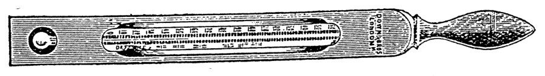
  </figure>

192 SÓE-ĖK, PHÓ-THONG KAP TĖK-PIA̍T Ê HOAT

### [Sim-chōng pīⁿ-ê]

Ū sim-chōng pīⁿ ê lâng, khàn-hō͘ tio̍h mn̄g i-seng khòaⁿ thang hō͘ i sóe-e̍k á m̄-thang; i-seng nā kóng thang, khàn-hō͘ tio̍h pī-pān hō͘ i tú-hó sio ê chúi, m̄-thang kè 100 tō͘ F. (37.8° C.)

> **【全漢對照】**
> **［心臟病的］**
> 有心臟病的人，看護著問醫生看通予伊洗浴抑唔通；醫生若講通，看護著備辦予伊拄好燒的水，唔通過 100 度 F. (37.8° C.)

---

### [Thoân-jiám pīⁿ-ê]

Nā ū thoân-jiám pīⁿ ê lâng, á-sī seng-khu ū sat-bú-ê, in nā sóe-e̍k liáu, khàn-hō͘ tio̍h ēng siau-to̍k-io̍h-chúi chiong e̍k-tháng sóe hō͘ chheng-khì.

> **【全漢對照】**
> **［傳染病的］**
> 若有傳染病的人，抑是身軀有蝨母的，𪜶若洗浴了，看護著用消毒藥水將浴桶洗予清氣。

---

*Tē 133 tô͘.—Sóe-ėk ê hân-loán-kè.*
（第 133 圖.—洗浴的寒暖計。）

---

### [Hân-loán-kè]

Tio̍h pī-pān hân-loán-kè, chòe sóe-e̍k ê lō͘-ēng (tē 133 tô͘). Tāi-khài pêng-siông ê phòa-pīⁿ-lâng, sóe-e̍k ê chúi put-kò sī 98 tō͘ F. (36. 7° C.) ; nā kā gín-ná sóe-e̍k, chiū m̄-thang siuⁿ sio, in-ūi gín-ná ê phê-hu sī khah iù. Gín-ná tùi chhut-sì kàu 6 ge̍h-ji̍t, i sóe-e̍k chúi ê un-tō͘, m̄-thang khah koâiⁿ 100 tō͘ F. (37.8° C.) ; 6 ge̍h-ji̍t-āu 96°F. (35.6° C.) chiū hó.

> **【全漢對照】**
> **［寒暖計］**
> 著備辦寒暖計，做洗浴的用處（第 133 圖）。大概平常的破病人，洗浴的水不過是 98 度 F. (36. 7° C.)；若共囡仔洗浴，就唔通傷燒，因為囡仔的皮膚是較幼。囡仔對出世到 6 月日，伊洗浴水的溫度，唔通較懸 100 度 F. (37.8° C.)；6 月日後 96°F. (35.6° C.) 就好。

---

### [Ėk-keng mn̂g m̄-thang só]

Pīⁿ-lâng e̍k-keng ê mn̂g m̄-thang chhòan, in-ūi pīⁿ-lâng ê khùi-la̍t khah lám, ū-sî thâu-khak o͘-àm-hîn, náu-pîn-hiat, á-sī khí keng-loân (痙攣, *convulsions*); chit ê sî-chūn i bē tit thang kā lí khui mn̂g, khàn-hō͘ cháiⁿ-iūⁿⁿ ē tit ji̍p-khì chiàu-kò͘ i leh?

> **【全漢對照】**
> **［浴間門唔通鎖］**
> 病人浴間的門唔通閂，因為病人的氣力較弱，有時頭殼烏暗眩、腦貧血、抑是起痙攣（痙攣，*convulsions*）；此個時陣伊袂得通共你開門，看護怎樣會得入去照顧伊咧？

---

### [Sóe-ėk ê hun-pia̍t]

Tāi-khài lâi kóng:  
Léng-chúi-e̍k: 60°F. chì 70°F. (15.6°—21.1°C.)  
Lâ-lûn-sio-chúi-e̍k: 90°F.—95°F. (32.2°—35°C.)  
Sio-chúi-e̍k: 95°F.—100°F. (35°—37.8°C.)  
Chin-sio-chúi-e̍k: 100°F. chì 106°F. (37.8°—41.1°C.) á-sī khah koâiⁿ.

> **【全漢對照】**
> **［洗浴的分別］**
> 大概來講：  
> 冷水浴：60°F. 至 70°F. (15.6°—21.1°C.)  
> 溫溫燒水浴：90°F.—95°F. (32.2°—35°C.)  
> 燒水浴：95°F.—100°F. (35°—37.8°C.)  
> 真燒水浴：100°F. 至 106°F. (37.8°—41.1°C.) 抑是較懸。

---

### [Léng-chúi-ėk]

Sóe léng-chúi-e̍k sī tī hoat-jia̍t ê pīⁿ, chhin-chhiūⁿ sió-tn̂g-jia̍t pīⁿ (*enteric fever*) á-sī hì-iām, hiah ê chèng. Pīⁿ-lâng sóe léng-chúi-e̍k, sī in-ūi hit ê chèng ê jia̍t chin tāng, ài hō͘ i lo̍h kē. I-seng chit-sî iā tio̍h saⁿ-kap tàu chiàu-kò͘,

> **【全漢對照】**
> **［冷水浴］**
> 洗冷水浴是佇發熱的病，親像小腸熱病（*enteric fever*）抑是肺炎，遐的症。病人洗冷水浴，是因為彼個症的熱真重，愛予伊落低。醫生這時亦著相佮湊照顧，

<!-- Page 208 End -->

---

<!-- Page 209 Start -->
#### 📖 原書第 209 頁

### LÉNG-CHÚI-E̍K（冷水浴）

kiaⁿ-liáu sóe ê sî, pīⁿ-lâng ē piàn khoán. Sóe léng-chúi-e̍k m̄-thang liâm-piⁿ chiong pīⁿ-lâng hē tī 60 tō͘ F. (15.6° C.) ê léng-chúi-lāi; tāi-seng tio̍h ēng sio-chúi, chhin-chhiūⁿ tùi 90 tō͘ F. (35.° C.), chiām-chiām hō͘ léng kàu 65 tō͘ (18.3° C.). Khàn-hō͘ iā tio̍h chai pīⁿ-lâng nā chhin-chhiūⁿ jia̍t kàu 105 tō͘ F. (40.6° C.), i ê seng-khu ê jia̍t ē tò-chhut tī chúi-nih hō͘ khah sio, só͘-í tio̍h siông-siông thiⁿ léng-chúi kap peng-tè. Nā pīⁿ-lâng khí kôaⁿ hoat tiō, chiū chiong i kng kàu bîn-chhng-téng chhit hō͘ ta; m̄-thang kā i kah siuⁿ chōe, ēng chi̍t niá phē-toaⁿ á-sī sòe niá thán-á kā i kah chiū hó. Ēng sio-chúi-koàn ù-kha. Sóe-e̍k liáu-āu tio̍h tī kong-bûn-lāi kiám-un, iā koh 45 hun tio̍h koh kiám, sòa kì. Pīⁿ-lâng sóe-e̍k liáu-āu, nā tām-po̍h khí kôaⁿ hoat tiō, khah bô iàu-kín. Tio̍h ū-pī *brandy* chiú tī po-lê-poe-lāi, kap pī-pān chù-siā-khì (注射器, *hypodermic syringe*), koh tio̍h khòaⁿ pīⁿ-lâng ê me̍h-phok àn-cháiⁿ-iūⁿ. I-tī sió-tn̂g-jia̍t chit ê léng-chúi-e̍k sī chòe iàu-kín ê hoat-tō͘. M̄-kú lâng ê pak-tó͘-mo̍h nā hoat-iām (*peritonitis*), tn̂g chhut-huih (*haemorrhage*), huih-kńg-hoat-iām (*phlebitis*), pak-tó͘ chin thiàⁿ, chiū m̄-thang hō͘ pīⁿ-lâng lo̍h-khì léng-chúi-lāi.

> **【全漢對照】**  
> （**冷水浴**）  
> 驚了洗的時，病人會變款。洗冷水浴毋通連鞭將病人下佇 60 度 F. (15.6° C.) 的冷水內；代先著用燒水，親像對 90 度 F. (35.° C.)，漸漸予冷到 65 度 (18.3° C.)。看護亦著知病人若親像熱到 105 度 F. (40.6° C.)，伊的身體的熱會倒出佇水裡予較燒，所以著常常添冷水佮冰塊。（**起寒發瘈**）若病人起寒發瘈，就將伊扛到眠床頂拭予焦；毋通共伊蓋傷多，用一領被單抑是細領毯仔共伊蓋就好。用燒水罐熨跤。洗浴了後著佇肛門內檢溫，亦閣 45 分著閣檢，紲記。病人洗浴了後，若淡薄起寒發瘈，較無要緊。著預備 *brandy* 酒佇玻璃杯內，佮備辦注射器（注射器, *hypodermic syringe*），閣著看病人的脈搏按怎樣。醫治小腸熱這个冷水浴是做要緊的法度。毋過人的腹肚膜若發炎 (*peritonitis*)、腸出血 (*haemorrhage*)、血管發炎 (*phlebitis*)、腹肚真疼，就毋通予病人落去冷水內。

---

### [Léng-chúi-e̍k ê lī-ek（冷水浴的利益）]

Chit-ê léng-chúi-e̍k ê lī-ek pâi tī ē-té:  
1. Jia̍t ê hoat-kông khah khin, khah chió, bah khah bōe chhoah; hit ê to̍k-khì tùi sīn-chōng pâi-chhut tī jiō khah chōe.  
2. Thé-un ē khah kē.  
3. Sim phok-tōng khah bān, iā khah ē chiàu chhù-sū (tē 476 tô͘).  
4. Pīⁿ-lâng khah bōe jiám-tio̍h hì-iām.  
5. Pīⁿ-lâng khah bōe tì-kàu hoat jio̍k-siong (bîn-chhng ê siong).  
6. Pīⁿ-lâng sí-sò͘ khah chió.  

> **【全漢對照】**  
> （**冷水浴的利益**）  
> 這个冷水浴的利益排佇下底：  
> 1. 熱的發狂較輕、較少，肉較袂掣；彼个毒氣對腎臟排出佇尿較多。  
> 2. 體溫會較低。  
> 3. 心搏動較慢，亦較會照秩序（第 476 圖）。  
> 4. 病人較袂染著肺炎。  
> 5. 病人較袂致到發褥傷（眠床的傷）。  
> 6. 病人死數較少。  

---

Io̍h m̄-thang pàng-hē pīⁿ-lâng ê sin-piⁿ, tio̍h siu tī io̍h-tû-nih.

> **【全漢對照】**  
> 藥毋通放下病人的身邊，著收佇藥櫥裡。

<!-- Page 209 End -->

---

<!-- Page 210 Start -->
#### 📖 原書第 210 頁

  <figure style="display: inline-block; margin: 12px; max-width: 90%; text-align: center;">
    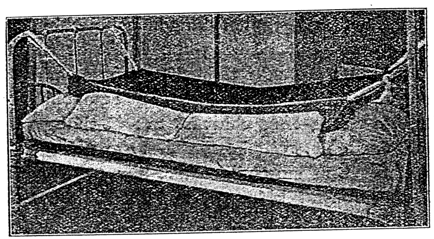
    <figcaption style="font-size: 14px; color: #4a5568; margin-top: 6px;"><em>Tē 134 tô:—Chit niá iû-pò͘ chòe ê chô, chòe sóe-ék ê lō͘-ēng (Sanders).</em></figcaption>
  </figure>

194 SÓE-I̍K, PHÓ͘-THONG KAP TE̍K-PIA̍T Ê HOAT

### Iû-pò͘-chô sóe-i̍k hoat

Bîn-chhng-nih ēng iû-pò͘ ê chô, sóe-i̍k ê hoat: Pīⁿ-lâng nā bē tit lo̍h bîn-chhng sóe-i̍k, ū-sî ēng chit ê hoat-tō͘ sī hó (tē 134 tô͘).

> **【全漢對照】**
> **油布槽洗浴法**
> 
> 眠床裡用油布的槽，洗浴的方法：病人若𣍐得落眠床洗浴，有時用這个法度是好（第 134 圖）。

---

Tē 134 tô͘:—Chit niá iû-pò͘ chòe ê chô, chòe sóe-i̍k ê lō͘-ēng (Sanders).

> **【全漢對照】**
> 第 134 圖：——這領油布做的槽，做洗浴的路用（Sanders）。

---

Ēng chit niá iû-pò͘ pí ji̍k-á liōng nn̄g chhioh khah tn̂g, chi̍t chhioh khah khoah. Tio̍h ēng chi̍t tiâu hang sio ê bīn-kun chhu nî-pò͘-téng, pīⁿ-lâng beh tó ê só͘-chāi, in-ūi hit niá iû-pò͘ ē léng. Chiah ēng iû-pò͘ hē pīⁿ-lâng seng-khu-ē. Iû-pò͘ sì-kak-thâu ū chiong chi̍t ê khoân thíⁿ hō͘ tiâu, sì-kak-thâu lóng sī án-ni. Chit-ê sī beh ēng pò͘ pa̍k tī bîn-chhng ê sì-ki koaiⁿ. Tī piⁿ-á ēng kńg ê thán-á, á-sī chím-thâu hē-teh, hō͘ chiūⁿ-leng-chô khah ē tiâu. Tī iû-pò͘-ē ū chi̍t ê chím-thâu, hō͘ pīⁿ-lâng ê thâu-khak khah khòaⁿ-oa̍h. Bîn-chhng thih chò ê ji̍k-á-ē, ēng nn̄g saⁿ tè pang, hō͘ i bē tūi-lo̍h kè-thâu. Ēng thán-á kah pīⁿ-lâng, chiah thǹg i ê khùn-saⁿ, iā ēng bīn-kun khàm ē-sin, ēng pín-chiam kā i pín. Taⁿ chiàu i-seng só͘ hoan-hù ê chúi, piàⁿ tī chô-lāi.

> **【全漢對照】**
> 用這領油布比褥仔量兩尺較長，一尺較闊。著用一條烘燒的面巾鋪毝布頂，病人欲倒的所在，因為彼領油布會冷。才用油布下病人生軀下。油布四角頭有將一个環紩予牢，四角頭攏是按呢。這个是欲用布縛佇眠床的四枝竿。佇邊仔用捲的毯仔，抑是枕頭下咧，予親像槽較會牢。佇油布下有一个枕頭，予病人的頭殼較快活。眠床鐵做的褥仔下，用兩三塊板，予伊𣍐墜落過頭。用毯仔蓋病人，才褪伊的睏衫，也用面巾蓋下身，用扁針共伊扁。今照醫生所吩咐的水，傾佇槽內。

---

Nā sóe liáu beh chiong chúi piàⁿ-chhut, chiong iû-pò͘ óa kha hit pêng, khah kē tām-po̍h, hō͘ chúi lâu-lo̍h tī chúi-tháng. Chit-tiap bîn-chhng ê kha, óa thâu-khak hit thâu, tio̍h khè koâiⁿ, hō͘ chúi khah khoài lâu-lo̍h.

> **【全漢對照】**
> 若洗了欲將水傾出，將油布倚腳彼爿，較低淡薄，予水流落地水桶。這霎眠床的腳，倚頭殼彼頭，著揭懸，予水較快流落。

<!-- Page 210 End -->

---

<!-- Page 211 Start -->
#### 📖 原書第 211 頁

  <figure style="display: inline-block; margin: 12px; max-width: 90%; text-align: center;">
    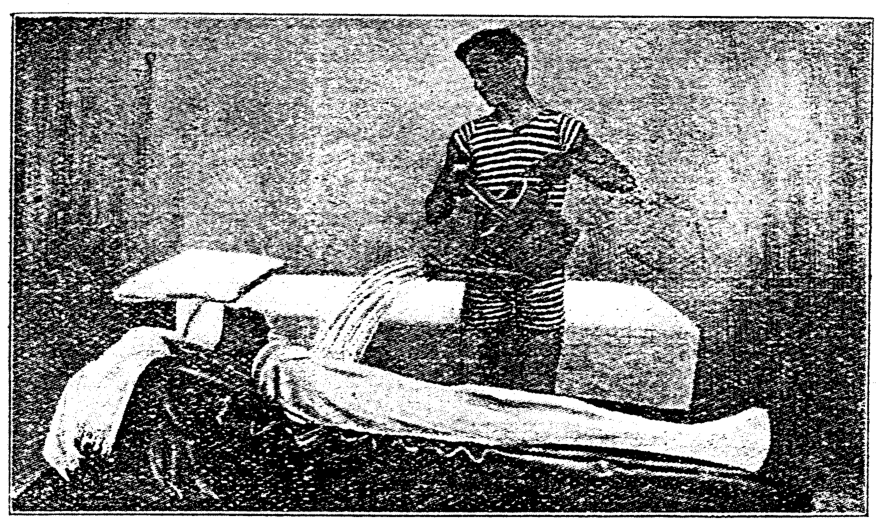
    <figcaption style="font-size: 14px; color: #4a5568; margin-top: 6px;"><em>Tē 135 tô.—Hoe-phùn sóe-ėk-hoat. (Kellog, from Aikens' “ Clinical Studies for Nurses,” by permission of W. B. Saunders Co., publishers.)</em></figcaption>
  </figure>

### HOE-PHÙN SÓE-E̍K, LÉNG-CHÚI-CHHIT（195）

Chúi lóng piàⁿ-chhut liáu, ēng phê-toaⁿ pau pīⁿ-lâng, chiah chiong iû-pò͘ the̍h khí-lâi. Chhit seng-khu hō͘ i ta.

> **【全漢對照】**
> 水攏傾出了，用被單包病人，才將油布提起來。拭身軀予伊焦。

---

### Hoe-phùn sóe-e̍k-hoat（花噴洗浴法）

Hoe-phùn sóe-e̍k-hoat : Iû-pò͘ tiòh pí jiòk-á khah tng, iā nñg-pêng-piⁿ hiau-than ê khoán, chhin-chhiūⁿ chô. Óa thâu-khak ê bîn-chhng-kha, tiòh khè chi̍t chhioh koâiⁿ, hō͘ chúi thang lâu-lóh kha-bé, sîn tī chúi-tháng. Thâu-khak ù-peng. Pī-pān pīⁿ-lâng chiàu téng-bīn ê khoán-sit. Ēng hoe-phùn tóe chiàu i-seng só͘ hoan-hù ê un-tō͘ ê chúi, ûn-ûn-á ak tī seng-khu. Khah siông 3 chì 5 hun-cheng, chiū kàu-gia̍h (tē 135 tô͘).

> **【全漢對照】**
> 花噴洗浴法：油布著比褥仔較長，也兩旁邊澆攤的款，親像槽。倚頭殼的眠床跤，著楔一尺懸，予水通流落跤尾，承佇水桶。頭殼熨冰。備辦病人照頂面的款式。用花噴貯照醫生所吩咐的溫度的水，勻勻仔沃佇身軀。較常 3 至 5 分鐘，就夠額（第 135 圖）。

---

Tē 135 tô͘.—Hoe-phùn sóe-e̍k-hoat. (Kellog, from Aikens’ “Clinical Studies for Nurses,” by permission of W. B. Saunders Co., publishers.)

> **【全漢對照】**
> 第 135 圖。——花噴洗浴法。（Kellog, 轉載自 Aikens 著《護士臨床研究》，經出版商 W. B. Saunders 公司授權）

---

### Léng-chúi chhit seng-khu（冷水拭身軀）

Ēng léng-chúi chhit seng-khu. Chit ê hoat-tō͘ sī beh i-tī jia̍t ê lō͘-ēng (tē 136 tô͘).

Tiòh ū-pī chiah ê mi̍h :

(a) Nñg ê sóe-chhiú-phûn, chi̍t-ê tiòh tóe léng-chúi, chiàu i-seng kau-tāi ê ōe. I-seng nā bô kóng lōa léng, chúi tiòh 65° F. (18.3° C.). Koh chi̍t-ê tóe peng thang hō͘ hit ê sóe-e̍k ê chúi sî-siông léng.

(b) Chúi-tháng chi̍t kha, kap iû-pò͘, iû-chóa á-sī sin-bûn-chóa.

> **【全漢對照】**
> 用冷水拭身軀。此個法度是欲醫治熱的用處（第 136 圖）。
> 
> 著預備諸個物：
> 
> (a) 兩個洗手盆，一個著貯冷水，照醫生交代的話。醫生若無講偌冷，水著 65° F. (18.3° C.)。閣一個貯冰通予彼個洗浴的水時常冷。
> 
> (b) 水桶一跤，佮油布、油紙抑是新聞紙。

---

*To̍k-io̍h kap chia̍h-io̍h tiòh lēng-gōa hē.*

> **【全漢對照】**
> *毒藥佮食藥著另外下。*

<!-- Page 211 End -->

---

<!-- Page 212 Start -->
#### 📖 原書第 212 頁

  <figure style="display: inline-block; margin: 12px; max-width: 90%; text-align: center;">
    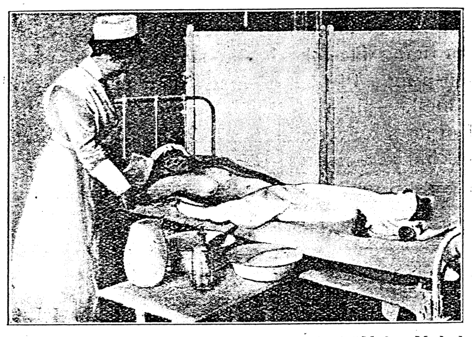
    <figcaption style="font-size: 14px; color: #4a5568; margin-top: 6px;"><em>Tē 136 tô:—Léng-chúi chhit seng-khu. (From Sanders' “Modern Methods in Nursing,” by permission of W. B. Saunders Co., publishers.)</em></figcaption>
  </figure>

### 196 SÓE-I̍K, PHÓ͘-THONG KAP TE̍K-PIA̍T Ê HOAT

**[Léng-chúi chhit seng-khu]**
(ch) Chhit-pò͘, sì tè, khah-nńg-ê chhin-chhiūⁿ kū ê bīn-kun, á-sī chúi-nî-pò͘. Tàk tè ê tōa, chha-put-to 12 chhùn sù-hong.

> **【全漢對照】**
> **【冷水拭身軀】**
> (ch) 拭布，四塊，較軟的親像舊的面巾，抑是水呢布。逐塊的大，差不多 12 寸四方。

---

*Tē 136 tô͘.—Léng-chúi chhit seng-khu. (From Sanders’ “Modern Methods in Nursing,” by permission of W. B. Saunders Co., publishers.)*

> **【全漢對照】**
> 第 136 圖。——冷水拭身軀。

---

(chh) Nñg tiâu tōa tiâu chhit seng-khu ê kun.  
(e) Sio-chúi-koàn, tī-hông kiaⁿ-liáu pīⁿ-lâng ê kha ōe léng.  
(g) Sóe-i̍k ê hân-loán-kè.  
(h) Hang sio ê thán-á kap khùn-saⁿ.  

> **【全漢對照】**
> (chh) 兩條大條拭身軀的巾。  
> (e) 燒水罐，預防驚了病人的跤會冷。  
> (g) 洗浴的寒暖計。  
> (h) 烘燒的毯仔佮睏衫。  

---

(2) Tio̍h kiám-un, sǹg me̍h-phok, ho͘-khip, iā sòa kì.

> **【全漢對照】**
> (2) 著檢溫，算脈搏、呼吸，也續記。

---

(3) Ēng iû-pò͘, iû-chóa, á-sī nñg saⁿ tiuⁿ sin-bûn-chóa jia-khàm lâi pó-hō͘ bîn-chhng. Chiong chi̍t niá thán-á chhu seng-khu-ē, koh chi̍t niá kā i kah; iā i ê saⁿ-á-khò͘ á-sī khùn-saⁿ, thǹg-khí-lâi; bo̍h-tit hō͘ i chhe-tio̍h hong.

Ēng chi̍t tè chhit-pò͘ chìm hō͘ tâm, chiah sió-khóa chūn, hō͘ chúi m̄-bián tih tī bîn-chhng-nih; chhit bīn kap

> **【全漢對照】**
> (3) 用油布、油紙，抑是兩三張新聞紙遮蓋來保護眠床。將一領毯仔鋪身軀下，閣一領共伊蓋；也伊的衫仔褲抑是睏衫，褪起來；莫得予伊吹著風。
> 
> 用一塊拭布浸予澹，才小可捘，予水毋免滴佇眠床裡；拭面佮

<!-- Page 212 End -->

---

<!-- Page 213 Start -->
#### 📖 原書第 213 頁

### LÉNG-CHÚI CHHIT SENG-KHU (p. 197)

ām-kún. Chhit liáu, ēng chit-ê chhit-pò͘ ê chúi, chūn hō͘ khí-lâi, hō͘ i tih tī lēng-gōa chi̍t kha chúi-tháng-lāi; in-ūi chhit hō͘ chúi ōe khah sio. Ēng chhit-pò͘ koh chìm tī léng-chúi-ni̍h; chūn, iā hē thâu-hia̍h, hō͘ i khah liâng. Chit tè nā khah sio tio̍h koh ōaⁿ.

> **【全漢對照】**
> 頷頸。拭了，用這个拭布的水，捘予起來，予伊滴佇另外一跤水桶內；因為拭予水會較燒。用拭布閣浸佇冷水裡；捘，也下頭額，予伊較涼。這塊若較燒著閣換。

---

5\. Chiong lēng-gōa chi̍t tè chhit-pò͘ chìm tī léng-chúi-ni̍h, chūn, chhit chi̍t ki chhiú. Chhit liáu, tio̍h ēng chhit-pò͘ chūn hō͘ hit hō sio-chúi khí-lâi tih tī chúi-tháng. Chhit-pò͘ koh chìm hō͘ léng, chūn, hē koh-ē-khang. Ēng chi̍t tiâu bīn-kun cheh-ta, chiah hē chhiú tī thán-á-ē.

> **【全漢對照】**
> 5. 將另外一塊拭布浸佇冷水裡，捘，拭一枝手。拭了，著用拭布捘予許號燒水起來滴佇水桶。拭布閣浸予冷，捘，下胳下空。用一條面巾撋焦，才下手佇毯仔下。

---

6\. Pa̍t ki chhiú tio̍h chhit siāng khoán. Tī koh-ē-khang ê chhit-pò͘ tio̍h chia̍p-chia̍p ōaⁿ hō͘ léng.

> **【全漢對照】**
> 6. 別枝手著拭仝款。佇胳下空的拭布著捷捷換予冷。

---

7\. Án-ni chiàu chhù-sū chhit heng-chêng, pak-tó͘. Tio̍h sòe-jī m̄-thang hō͘ léng-tio̍h.

> **【全漢對照】**
> 7. 按呢照次序拭胸前、腹肚。著細膩毋通予冷著。

---

8\. Chi̍t ki kha tio̍h chiàu téng-bīn chhit, āu-lâi koh chi̍t ki. Kha chhiú nā chhit, tio̍h chai sī tùi chńg-thâu-á chhit kàu seng-khu. Chhit seng-khu ê sî, ēng la̍t tio̍h pîⁿ-pîⁿ; m̄-thang hut-jiân khin, á-sī hut-jiân tāng, ū-sî tōa la̍t, ū-sî sòe la̍t.

> **【全漢對照】**
> 8. 一枝跤著照頂面拭，後來閣一枝。跤手若拭，著知對指頭仔拭到身軀。拭身軀的時，用力著平平；毋通忽然輕，抑是忽然重，有時大力，有時細力。

---

9\. Pang-chān pīⁿ-lâng tó thán-khi-sin, lâi chhit i ê ka-chiah-āu.

> **【全漢對照】**
> 9. 幫贊病人倒偃崎身，來拭伊的尻脊後。

---

10\. Chhit-e̍k ê sî-kan sī 10 chì 20 hun-chèng-kú. Teh chhit ê sî tio̍h kiám-un chi̍t pái; i ê thé-un nā hut-jiân lo̍h kē kàu 99° F. (20° C.), m̄-bián koh chhit.

> **【全漢對照】**
> 10. 拭浴的時間是 10 至 20 分鐘久。咧拭的時著驗溫一次；伊的體溫若忽然落下到 99° F. (20° C.)，毋免閣拭。

---

11\. Chhit liáu-āu chiū kóaⁿ-kín ēng ta ê bīn-kun chhit hō͘ ta.

> **【全漢對照】**
> 11. 拭了後就趕緊用焦的面巾拭予焦。

---

12\. Tâm ê thán-á (kap chhit-pò͘), tio̍h the̍h-khí-lâi, ēng ta ê thán-á kā i kah, sòa ōaⁿ ta ê saⁿ. Khòaⁿ i ê kha ōe léng á bōe, nā ōe, tio̍h chiong sio-chúi-koàn kā ù.

> **【全漢對照】**
> 12. 澹的毯仔（佮拭布），著提起來，用焦的毯仔共伊蓋，續換焦的衫。看伊的跤會冷抑袂，若會，著將燒水罐共熨。

---

13\. Koh pòaⁿ tiám-cheng-kú tio̍h kiám-un, sìng me̍h-pho̍k, chiah kì-teh.

> **【全漢對照】**
> 13. 閣半點鐘久著驗溫，數脈搏，才記咧。

---

Thé-un-khì m̄-thang hō͘ gín-nā ka-kī ēng, á-sī put-séng-jîn-sū ê lâng, kiaⁿ-liáu ōe pha̍h-phòa.

> **【全漢對照】**
> 體溫器毋通予囡仔家己用，抑是不省人事的人，驚了會拍破。

<!-- Page 213 End -->

---

<!-- Page 214 Start -->
#### 📖 原書第 214 頁

  <figure style="display: inline-block; margin: 12px; max-width: 90%; text-align: center;">
    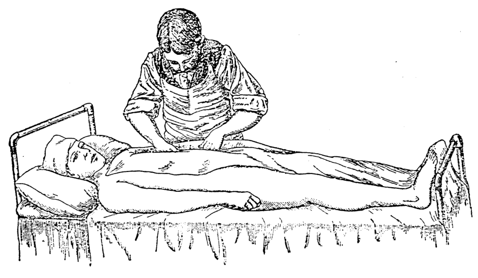
    <figcaption style="font-size: 14px; color: #4a5568; margin-top: 6px;"><em>Tē 137 tô:—Léng-sip-pò·-pau-hoat. Teh chiong phē-toaⁿ seh ji̍p tī chhiú kap seng-khu ê tiong-ng. (From Stoney's "Practical Points in Nursing," by permission of W. B. Saunders Co., publishers.)</em></figcaption>
  </figure>
  <figure style="display: inline-block; margin: 12px; max-width: 90%; text-align: center;">
    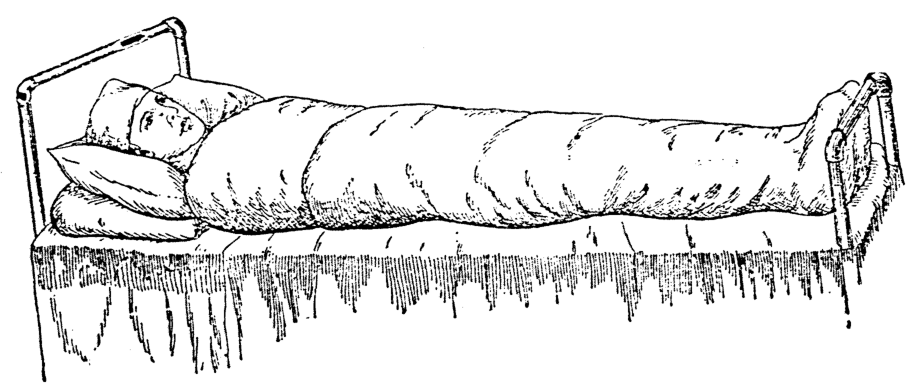
    <figcaption style="font-size: 14px; color: #4a5568; margin-top: 6px;"><em>Tē 138 tô:—Léng-sip-pò·-pau-hoat. Seng-khu pau bat. Thâu-khak ū ēng chit tiâu léng koh tâm ê bîn-kun kā i pau (Stoney).</em></figcaption>
  </figure>

### 198 SÓE-E̍K, PHÓ͘-THONG KAP TE̍K-PIA̍T Ê HOAT

14. Pīⁿ-lâng nā khah loán-jiók, hiah ê tâm ê chhit-pò͘ m̄-bián hē koh-ē-khàng ; nā khòaⁿ i hoat tiō, khàn-hō͘ chiū m̄-bián kā i chhit, iā tióh ēng sio-chúi-koàn ù-kha.

> **【全漢對照】**
> 14. 病人若較軟弱，遐的澹的拭布毋免下胳下空；若看伊發掉（發抖打戰），看護就毋免共伊拭，也著用熱水罐熨跤。

---

### Léng-sip-pò͘-pau-hoat

**[邊註：Léng-sip-pò͘-pau-hoat]**
Léng-sip-pò͘-pau-hoat (*Cold pack* tē 137, 138 tô͘) : Chiàu téng-bīn tióh jia-khàm lâi pó-hō͘ bîn-chhng, ēng iû-pò͘, thán-á chhu bîn-chhng-téng. Ēng chi̍t niá phē-toaⁿ chìm tī léng-chúi (65° F., 18.3° C.), chūn hō͘ i khah ta tām-pó̍h, chhu tī thán-á-téng. Pīⁿ-lâng ê saⁿ thǹg-liáu, tióh hō͘ i tó tī chit ê tâm phē-toaⁿ-téng ; ēng chit ê tâm

> **【全漢對照】**
> **[邊註：冷濕布包法]**
> 冷濕布包法（*Cold pack* 第 137, 138 圖）：照頂面著遮蓋來保護眠床，用油布、毯仔鋪眠床頂。用一領被單浸佇冷水（65° F., 18.3° C.），扭予伊較焦淡薄，鋪佇毯仔頂。病人的衫褪了，著予伊倒佇此個澹被單頂；用此個澹

---

### [圖 137 說明]

Tē 137 tô͘.—Léng-sip-pò͘-pau-hoat. Teh chiong phē-toaⁿ seh ji̍p tī chhiú kap seng-khu ê tiong-ng. (From Stoney's “Practical Points in Nursing,” by permission of W. B. Saunders Co., publishers.)

> **【全漢對照】**
> 第 137 圖。——冷濕布包法。咧將被單塞入佇手佮身軀的中間。（From Stoney's “Practical Points in Nursing,” by permission of W. B. Saunders Co., publishers.）

---

### [圖 138 說明]

Tē 138 tô͘.—Léng-sip-pò͘-pau-hoat. Seng-khu pau ba̍t. Thâu-khak ū ēng chi̍t tiâu léng koh tâm ê bīn-kun kā i pau (Stoney).

> **【全漢對照】**
> 第 138 圖。——冷濕布包法。身軀包密。頭殼有用一條冷閣澹的面巾共伊包 (Stoney)。

<!-- Page 214 End -->

---

<!-- Page 215 Start -->
#### 📖 原書第 215 頁

### SIO-CHÚI-E̍K (p. 199)

**[Léng-sip-phō͘-pau-hoat]** *(接前頁)*  
phē-toaⁿ kā i pau seng-khu ta̍k ūi, thâu-khak í-gōa lóng tio̍h pau. Thâu-mn̂g tio̍h ēng lēng-gōa chi̍t tiâu léng koh tâm ê bīn-kun kā i pau. Pau hó-sè, tio̍h ēng chi̍t niá thán-á pau tī hit niá tâm phē-toaⁿ-téng. Án-ni tio̍h hō͘ pīⁿ-lâng tó 10 chì 15 hun-cheng-kú. Ēng chit ê hoat-tō͘, pīⁿ-lâng ê thé-un ē khah kē, iā i khah ē khùn-tit. Chhòng liáu tio̍h ōaⁿ phē-toaⁿ, thán-á hiah ê mi̍h, chhit hō͘ i ta, iā ēng ta ê phē-toaⁿ kā i kah.

> **【全漢對照】**  
> **【冷濕敷包法】** *(接前頁)*  
> 被單共伊包身軀逐位，頭殼以外攏著包。頭毛著用另外一條冷閣淡的面巾共伊包。包好勢，著用一件毯仔包佇彼件淡被單頂。按呢著予病人倒 10 至 15 分鐘久。用這个法度，病人的體溫會較低，也伊較會睏得。創了著換被單、毯仔許个物，拭予伊焦，也用焦的被單共伊蓋。

---

### Sio-chúi-e̍k

Sóe sio-chúi-e̍k iā chin chōe lī-ek ê só͘-chāi : ē ēng lâi chí-thiàⁿ; á-sī jiō-to̍k chèng (jiō-to̍k ji̍p huih ê pīⁿ), ēng chit ê hoat-tō͘ ē pang-chān pīⁿ-lâng lâu kōaⁿ; ē i-tī tian-kông, iúⁿ-hīn ê chèng, thang hō͘ pīⁿ-lâng khah hó khùn ; thang siông-siông ēng chit ê hoat-tō͘ lâi tī siáu-piān-put-thong ê pīⁿ, iā ē tī siáu-jî-keng-loân (convulsions).

> **【全漢對照】**  
> 洗燒水浴也真多利益的所在：會用來止疼；抑是尿毒症（尿毒入血的病），用這个法度會幫贊病人流汗；會醫治癲狂、湧眩的症，通予病人較好睏；通常常用這个法度來治小便不通的病，也會治小兒痙攣 (convulsions)。

---

### [Pīⁿ-lâng ē lâu kōaⁿ khah chōe]

Sio-chúi-e̍k kap jia̍t-khì-e̍k, sī beh hō͘ pīⁿ-lâng lâu kōaⁿ ê lō͘-ēng. Sīn-chōng nā bô chiàu i ê chok-iōng teh kiâⁿ, iā seng-khu bô lō͘-ēng ê mi̍h, tùi sīn-chōng pâi-chhut khah chió, hit ê sî-chūn ēng sio-chúi-e̍k sī chin hó. Hit-tia̍p sio-chúi ē hō͘ seng-khu phê-ē ê huih-kńg khok-tiong, iā hō͘ pīⁿ-lâng lâu kōaⁿ ; tùi án-ni seng-khu ē pâi-chhut bô lō͘-ēng ê mi̍h. Án-ni chiū-sī pang-chān sīn-chōng.

> **【全漢對照】**  
> **【病人會流汗較多】**  
> 燒水浴佮熱氣浴，是欲予病人流汗的路用。腎臟若無照伊的作用咧行，也身軀無路用的物，對腎臟排出較少，彼个時陣用燒水浴是真好。彼霎燒水會予身軀皮下的血管擴張，也予病人流汗；對按呢身軀會排出無路用的物。按呢就是幫贊腎臟。

---

Nā-sī i-seng bēng-lēng hō͘ pīⁿ-lâng sóe sio-chúi-e̍k, khàn-hō͘ tio̍h ū-pī ū 100 tō͘ F. (37.8° C.) sio ê chúi ; nā-sī pīⁿ-lâng kam-goān beh ēng khah sio-ê, chiū koh hō͘ i khah sio tām-po̍h iā thang.

> **【全漢對照】**  
> 若是醫生命令予病人洗燒水浴，看護著預備有 100 度 F. (37.8° C.) 燒的水；若是病人甘願欲用較燒的，就閣予伊較燒淡薄也通。

---

Nā-sī pīⁿ-lâng ē thang khì e̍k-keng, án-ni khah lī-piān. Hit ê e̍k-tháng tio̍h piàⁿ chúi tī lāi-bīn, chha-put-to poeh chhùn chhim chiū hó. Tio̍h nn̄g ê khàn-hō͘ kng pīⁿ-lâng, iā tio̍h hû i lo̍h chúi-nih. Tī e̍k-tháng-lāi 15 hun-cheng-kú liáu-āu, tio̍h hû i khí-lâi ; ēng sio ê thán-á

> **【全漢對照】**  
> 若是病人會通去浴間，按呢較利便。彼个浴桶著傾水佇內面，差不多八寸深就好。著两个看護扛病人，也著扶伊落水裡。佇浴桶內 15 分鐘久了後，著扶伊起來；用燒的毯仔……

---

#### [頁底格言]
Chīn-tiong ê sim, sī Siōng-tè ê chún-chìn, m̄-thang lia̍h-chòe sió-khóa sū.

> **【全漢對照】**  
> 盡忠的心，是上帝的準繩，毋通掠做小可事。

<!-- Page 215 End -->

---

<!-- Page 216 Start -->
#### 📖 原書第 216 頁

  <figure style="display: inline-block; margin: 12px; max-width: 90%; text-align: center;">
    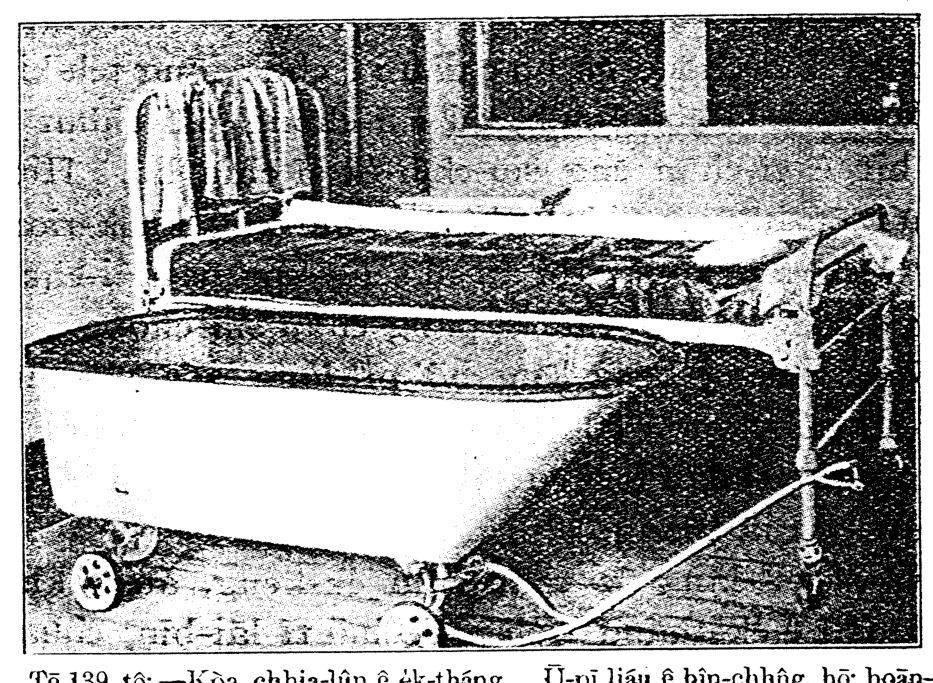
    <figcaption style="font-size: 14px; color: #4a5568; margin-top: 6px;"><em>Tē 139 tô:—Kòa chhia-lûn ê ék-tháng. Ū-pī liáu ê bîn-chhñg, hō͘ hoān-chiá sóe-ék liáu thang koh tó-teh. (From Sanders' “Modern Methods in Nursing,” by permission of W. B. Saunders Co., publishers.)</em></figcaption>
  </figure>

### 200 SÓE-E̍K, PHÓ͘-THONG KAP TE̍K-PIA̍T Ê HOAT

kā pau, hē bîn-chhûng-nih, chhit ta. Nā iáu-kú teh lâu kōaⁿ, tio̍h thàn hit ê jia̍t-khì-e̍k liáu ê hoat-tō͘, chiàu kī tī ē-bīn.

> **【全漢對照】**
> 給包，下眠床裡，拭焦。若猶久咧流汗，著趁彼個熱氣浴了的法度，照記佇下面。

---

### Sīn-chōng-iām pīⁿ-lâng sóe-e̍k

Nā-sī hō͘ sīn-chōng-iām pīⁿ ê lâng sóe-e̍k, siat-sú i-seng kah khàn-hō͘ ū-pī 100 tō͘ F. (37.8° C.) ê sio-chúi, khàn-hō͘ tio̍h chai chit khoán pīⁿ ê lâng sóe-e̍k ê chúi, tùi khí-thâu kàu sóe liáu, lóng tio̍h siâng chit-iūⁿ, pīⁿ-pīⁿ hiah sio, m̄-thang hut-jiân léng, hut-jiân sio. Chòe hó ê hoat-tō͘, ēng chi̍t niá tōa niá ê thán-á lâi khàm hit ê e̍k-tháng, tû-khí pīⁿ-lâng ê thâu-khak í-gōa, liân pīⁿ-lâng ê seng-khu kap e̍k-tháng, lóng khàm hō͘ bā ; khàn-hō͘ tio̍h koh liok-sio̍k thiⁿ sio-chúi, iā siông lâi kiám-un.

> **【全漢對照】**
> 若是予腎臟炎病的人洗浴，設使醫生教看護預備 100 度 F. (37.8° C.) 的燒水，看護著知這款病的人洗浴的水，對起頭到洗了，攏著相一樣，並並遐燒，毋通忽然冷，忽然燒。做好（上好）的法度，用一領大領的毯仔來蓋彼個浴桶，除去病人的頭殼以外，連病人的身軀佮浴桶，攏蓋予密；看護著閣陸續添燒水，也常來檢溫。

---

### Kòa chhia-lûn ê e̍k-tháng

Nā pīⁿ tāng ê lâng, ka-kī bô lāt thang sóe-e̍k, khàn-hō͘ tio̍h chiong e̍k-tháng (e̍k-phûn) hē i ê bîn-chhûng-piⁿ, kā pīⁿ-lâng kah chi̍t niá phē-toaⁿ, ēng koh chi̍t niá phē-toaⁿ tī seng-khu-ē; kng kàu e̍k-tháng-lāi, iā sô moa ê phē-toaⁿ tī e̍k-tháng-lāi, iu-goân tio̍h khàm pīⁿ-lâng hó-sè (tē 139 tô͘).

> **【全漢對照】**
> 若病重的人，自己無力通洗浴，看護著將浴桶（浴盆）下伊的眠床邊，給病人蓋一領被單，用閣一領被單佇身軀下；扛到浴桶內，也徐摸的被單佇浴桶內，猶原著蓋病人好勢（第 139 圖）。

---

> **Tē 139 tô͘:—Kòa chhia-lûn ê e̍k-tháng. Ū-pī liáu ê bîn-chhûng, hō͘ hoān-chiá sóe-e̍k liáu thang koh tó-teh. (From Sanders' "Modern Methods in Nursing," by permission of W. B. Saunders Co., publishers.)**
> 
> **【全漢對照】**
> 第 139 圖：——掛車輪的浴桶。預備了的眠床，予患者洗浴了通閣倒咧。(From Sanders' "Modern Methods in Nursing," by permission of W. B. Saunders Co., publishers.)

<!-- Page 216 End -->

---

<!-- Page 217 Start -->
#### 📖 原書第 217 頁

## SÓE-ĖK Ê KUI-KÚ（201）

### [Pī-pān bîn-chhûng / 備辦眠床]

Sóe-e̍k ê sî-chūn, khàn-hō͘ tióh khòaⁿ pīⁿ-lâng ê méh cháiⁿ-iūⁿ, sòa khòaⁿ hit ê hân-loán-kè ê un-tō͘ koâiⁿ-kē. Iā tióh ū lēng-gōa chi̍t ê khàn-hō͘ thang kóaⁿ-kín ū-pī bîn-chhûng. Bîn-chhûng-téng tióh chhu chi̍t niá iû-pò͘, tióh kap bîn-chhûng pīⁿ tōa niá; tī iû-pò͘-téng, tióh chhu chi̍t niá kū ê thán-á. Lēng-gōa kā in chiòng chi̍t niá thán-á hang hō͘ sio thang ēng.

> **【全漢對照】**  
> 洗浴的時陣，看護著看病人的脈怎樣，紲看彼個寒暖計的溫度懸低。也著有另外一個看護通趕緊預備眠床。眠床頂著鋪一件油布，著佮眠床並大件；佇油布頂，著鋪一件舊的毯仔。另外共𪜶將一件毯仔烘予燒通應（用）。

---

Nā ji̍p e̍k āu tī 20 hun-cheng-lāi, pīⁿ-lâng kó-jiân bô sím-mi̍h piàn-khoán, chiū bô iàu-kín; nā-sī iáu-bē kàu 20 hun-cheng, pīⁿ-lâng ê méh ōe thiàu, á-sī bô chiàu chhù-sū, á-sī thâu-khak o͘-àm, sī m̄-hó. Hit sî khàn-hō͘ tióh kóaⁿ-kín phō i khí-lâi, ēng i goân-pún hit niá seng-khu-ē ê phē-toaⁿ (chhu-kun) kap i só͘ kah hit niá phē-toaⁿ, kng i chiūⁿ khì hit tiuⁿ chhu iû-pò͘ kap kū ê thán-á ê bîn-chhûng-téng; hō͘ i seng-khu sió-khóa thán-khi-sin, chiong hit niá tâm ê phē-toaⁿ, the̍h-lo̍h-lâi; chiū ēng sio ê bīn-kun kā i chhit hō͘ ta, chiah kā i chhēng chi̍t niá khah sio ê nî-saⁿ. Kàu chit-tia̍p chiah koh kah i thán-khi-sin, chiong iû-pò͘ kap iû-pò͘-téng ê thán-á sūn hit ê sè, kúg kàu pīⁿ-lâng ê seng-khu-ē; kah pīⁿ-lâng hoan-sin tùi kúg iû-pò͘ hit pêng kè-khì; chiah chiong iû-pò͘ kap kū ê thán-á the̍h-khí-lâi; jiân-āu chiong phē kā i kah hō͘ hó.

> **【全漢對照】**  
> 若入浴後佇 20 分鐘內，病人果然無甚麼變款，就無要緊；若是猶未到 20 分鐘，病人的脈會跳，抑是無照秩序，抑是頭殼烏暗，是毋好。彼時看護著趕緊抱伊起來，用伊原本彼件身軀下的被單（鋪巾）佮伊所蓋彼件被單，扛伊上去彼張鋪油布佮舊的毯仔的眠床頂；予伊身軀稍寡袒欹身，將彼件澹的被單，提落來；就用燒的面巾共伊拭予焦，才共伊穿一件較燒的呢衫。到此霎才閣共伊袒欹身，將油布佮油布頂的毯仔順彼個勢，捲到病人的身軀下；共病人翻身對捲油布彼爿過去；才將油布佮舊的毯仔提起來看；然後將被共伊蓋予好。

---

### [Pang-chān i lâu kōaⁿ / 幫贊伊流汗]

Nā-sī ài hō͘ pīⁿ-lâng lâu kōaⁿ, i-seng kah i kā pīⁿ-lâng sóe sio-chúi-e̍k í-āu, khàn-hō͘ tióh chai pang-chān pīⁿ-lâng lâu-kōaⁿ ê hoat-tō͘: chhin-chhiūⁿ koh hō͘ pīⁿ-lâng chia̍h tām-pòh sio ê mi̍h, á-sī ēng sio-chúi-koàn lâi hō͘ i sio, á-sī kā in kah khah chōe niá phē.

> **【全漢對照】**  
> 若是愛予病人流汗，醫生教伊共病人洗燒水浴以後，看護著知幫贊病人流汗的法度：親像閣予病人食淡薄燒的物，抑是用燒水罐來予伊燒，抑是共𪜶蓋較多件被。

---

### Sóe-e̍k ê kui-kú / 洗浴的規矩

Sóe-e̍k ê kui-kú :
1. Pīⁿ-lâng tióh sóe-e̍k á m̄-thang, sī i-seng teh chú-ì.
2. Iáu-bē kiò pīⁿ-lâng sóe, tióh tak hāng ū-pī.

> **【全漢對照】**  
> 洗浴的規矩：  
> 1. 病人著洗浴抑毋通，是醫生咧注意。  
> 2. 猶未叫病人洗，著逐項預備。

---

Tàk hāng sū tióh chīn-tiong.

> **【全漢對照】**  
> 逐項事著盡忠。

<!-- Page 217 End -->

---

<!-- Page 218 Start -->
#### 📖 原書第 218 頁

202 SÓE-E̍K, PHÓ͘-THONG KAP TE̍K-PIA̍T Ê HOAT

### Sóe-e̍k ê kui-kú

3. Tio̍h sî-siông ēng hân-loán-kè kiám-cha chúi ê un-tō͘.

> **【全漢對照】**
> 3. 著時常用寒暖計檢查水的溫度。

4. Pīⁿ-pān e̍k-chúi ê sî, tio̍h tāi-seng piàⁿ léng-chúi tī tháng-lāi, jiân-āu piàⁿ sio-chúi. Chit-ê sī tî-hông thǹg-tio̍h pīⁿ-lâng; kiaⁿ-liáu nā tāi-seng piàⁿ sio-chúi, hut-jiân ū tāi-chì, piàⁿ léng-chúi ài bē-kì-tit, án-ni hāi pīⁿ-lâng.

> **【全漢對照】**
> 4. 備辦浴水的時，著代先傾冷水佇桶內，然後傾燒水。這是提防燙著病人；驚了若代先傾燒水，忽然有代誌，傾冷水愛𣍐記得，按呢害病人。

5. Pīⁿ-lâng sóe-e̍k ê sî, tio̍h ū lâng chiàu-kò͘ i.

> **【全漢對照】**
> 5. 病人洗浴的時，著有人照顧伊。

6. Pīⁿ-lâng chia̍h-pá, tio̍h thèng-hāu nn̄g tiám-cheng-kú, chiah kā i sóe-e̍k.

> **【全漢對照】**
> 6. 病人食飽，著聽候兩點鐘久，才共伊洗浴。

7. Pīⁿ-lâng sóe-e̍k liáu ê sî, thang chiūⁿ khì bîn-chhng tó, tio̍h kín-kín chhit hō͘ ta, iā kah hó-sè; khàn-hō͘ tio̍h chim-chiok khòaⁿ i ê kha ū sio á-bô; nā-sī bô sio, tio̍h ēng sio-chúi-koàn lâi kā ù, á-sī ēng hang sio ê thán-á lâi kah i ê kha.

> **【全漢對照】**
> 7. 病人洗浴了的時，通上去眠床倒，著緊緊拭互乾，也蓋好勢；看護著斟酌看伊的腳有燒抑無；若是無燒，著用燒水罐來共熨，抑是用烘燒的毯仔來蓋伊的腳。

8. E̍k-keng mn̂g, m̄-thang hō͘ pīⁿ-lâng só.

> **【全漢對照】**
> 8. 浴間門，毋通互病人鎖。

---

### Bîn-chhng-nih sóe-e̍k

Bîn-chhng-nih sóe-e̍k: Ū-sî pīⁿ-lâng bē lo̍h e̍k-tháng-nih sóe-e̍k, tio̍h tiàm tī bîn-chhng-nih sóe. Pīⁿ-sek tio̍h kàu-gia̍h sio, iā m̄-thang hō͘ i chhe-tio̍h hong. Tio̍h chiong khah sòe kha e̍k-tháng, á-sī tōa ê bīn-tháng, hē tī i ê bîn-chhng-piⁿ; iā tio̍h ū-pī nn̄g niá sóe-e̍k ê thán-á, nn̄g tiâu bīn-kun, sóe seng-khu ê chhit-pò͘, sat-bûn. Bīn-tháng-nih ê chúi, tio̍h 110° F. (43.3° C.) sio; iā tio̍h ū-pī lēng-gōa chi̍t chúi-pân ê sio-chúi thang thiⁿ. Pīⁿ-lâng tio̍h tī bîn-chhng-piⁿ. Bîn-chhng ê mî-phē á-sī thán-á the̍h-khí-lâi ê sî, tio̍h ēng chi̍t niá sóe-e̍k ê thán-á kā i kah; tē jī niá tio̍h chhu tī seng-khu-ē; iā khùn-saⁿ, tio̍h thǹg-khí-lâi. Tio̍h kā i sóe.

> **【全漢對照】**
> 眠床裡洗浴：有時病人𣍐落浴桶裡洗浴，著踮佇眠床裡洗。病室著夠額燒，也毋通互伊吹著風。著將較細腳浴桶，抑是大的面桶，下佇伊的眠床邊；也著預備兩領洗浴的毯仔，兩條面巾，洗軀體的拭布，撒文（雪文）。面桶裡的水，著 110° F. (43.3° C.) 燒；也著預備另外一水瓶的燒水通添。病人著佇眠床邊。眠床的棉被抑是毯仔提起來的時，著用一領洗浴的毯仔共伊蓋；第二領著鋪佇軀體下；也睏衫，著褪起來。著共伊洗。

Sóe ê sî m̄-bián hian khah chōe, kiaⁿ-liáu kám-tio̍h. Tio̍h chiàu chit ê chhù-sū kā sóe: bīn, hī-á, ām-kún, chhiú, heng-khám, pak-tó͘, ka-chiah, kha. Chi̍t ūi tio̍h seng sóe, chhit ta, chiah koh sóe pa̍t ūi (tē 140 tô͘).

> **【全漢對照】**
> 洗的時毋免掀較濟，驚了感著。著照這個次序共洗：面、耳仔、頷頸、手、胸坎、腹肚、尻脊、腳。一位著先洗，拭乾，才閣洗別位（第 140 圖）。

Tâm ê thán-á tio̍h the̍h-khí-lâi, ēng phē-toaⁿ chiong

> **【全漢對照】**
> 澹的毯仔著提起來，用被單將……

---

### [頁底註腳]

Pīⁿ-lâng nā kóng pheng-tòa siuⁿ ân, tio̍h liâm-piⁿ khì sūn khòaⁿ ū iáⁿ á-bô.

> **【全漢對照】**
> 病人若講繃帶傷絚，著連鞭去順看有影抑無。

<!-- Page 218 End -->

---

<!-- Page 219 Start -->
#### 📖 原書第 219 頁

  <figure style="display: inline-block; margin: 12px; max-width: 90%; text-align: center;">
    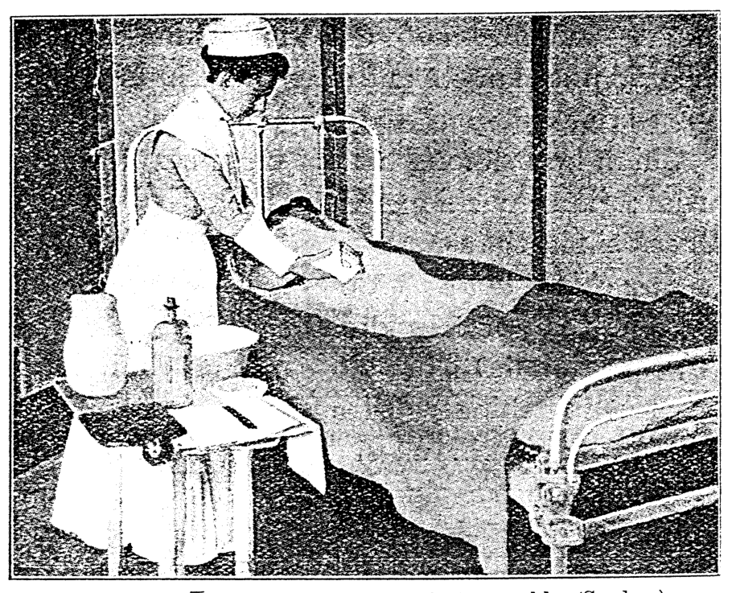
    <figcaption style="font-size: 14px; color: #4a5568; margin-top: 6px;"><em>Tē 140 tô:—M̄-bián hian pīⁿ-lâng kā i sóe seng-khu (Sanders).</em></figcaption>
  </figure>

SIO-SIP-PÒ͘-PAU-HOAT 203

bîn-chhng chhu hó-sè, iā ēng chheng-khì koh sio ê khùn-saⁿ kā i chhēng.

> **【全漢對照】**
> 眠床鋪好勢，亦用清潔閣燒的睏衫共伊穿。

---

**Tē 140 tô͘:—M̄-bián hian pīⁿ-lâng kā i sóe seng-khu (Sanders).**

> **【全漢對照】**
> **第 140 圖：——毋免掀病人共伊洗身軀 (Sanders)。**

---

### Sio-sip-pò͘-pau-hoat（燒濕布包法）

Sio-sip-pò͘-pau-hoat, kap sóe sio-chúi-e̍k ê lī-khì sī sio-siāng; nā tú-tio̍h hit-hō put-séng-jîn-sū ê pīⁿ-lâng, ēng chit ê hoat pí sóe sio-chúi-e̍k khah lī-piān.

> **【全漢對照】**
> 燒濕布包法，佮洗燒水浴的利器是相𫝛；若拄著彼號不省人事的病人，用這个法比洗燒水浴較利便。

1. Tāi-seng pī-pān chi̍t tiuⁿ bîn-chhng, téng-bīn chhu chi̍t niá tōa niá iû-pò͘; iû-pò͘ téng-bīn, chhu chi̍t niá hang sio ê thán-á; koh thǹg pīⁿ-lâng ê saⁿ, iā chiām-sî chiong chi̍t niá hang sio ê thán-á kā i kah.

> **【全漢對照】**
> 1. 代先備辦一張眠床，頂面鋪一件大件油布；油布頂面，鋪一件烘燒的毯仔；閣褪病人的衫，亦暫時將一件烘燒的毯仔共伊蓋。

2. The̍h chi̍t niá tōa niá phē-toaⁿ (chhu-kun), sūn hit ê sè, kńg-khí-lâi, chih chòe saⁿ chih; koh ēng chi̍t niá phē-toaⁿ, chiong hit niá chih-hó-ê, pau-khí-lâi; ēng nñg lâng, tùi gōa-bīn ê siang-thâu-bé, khiú hō͘ tiâu.

> **【全漢對照】**
> 2. 提一件大件被單（敷巾），順彼个勢，捲起來，摺做三摺；閣用一件被單，將彼件摺好的，包起來；用兩人，對外面的雙頭尾，揪予牢。

3. Chiong phē-toaⁿ tiong-ng, chìm hē kún-chúi-nih, thèng-hāu kàu jia̍t lóng chiàu thàu, chiah kiò hit nñg lâng tùi siang-thâu-bé khiú-khí-lâi, chūn hō͘ ta, tháu khui chi̍t pòaⁿ.

> **【全漢對照】**
> 3. 將被單中央，浸下滾水裡，聽候到熱攏照透，才叫彼兩人對雙頭尾揪起來，捘予焦，敨開一半。

<!-- Page 219 End -->

---

<!-- Page 220 Start -->
#### 📖 原書第 220 頁

204 SÓE-E̍K, PHÓ͘-THONG KAP TE̍K-PIA̍T Ê HOAT

> **【全漢對照】**
> 204 洗浴，普通佮特別的法

---

### [Sio-sip-pò͘-pau-hoat / 燒溼布包法]

4. Pīⁿ-lâng nā ē (nā bōe-ōe tio̍h chān i), tio̍h kiò i thán-khi-sin. Chhì hit ê jiat-tō͘, m̄-thang hō͘ i sio-tio̍h pīⁿ-lâng; jiân-āu chiong pīⁿ-lâng péng-kè-lâi, chhin-chhiūⁿ kā i ōaⁿ phē-toaⁿ ê hoat; chiong phē-toaⁿ ê lióng-pêng lâi pau tī pīⁿ-lâng ê seng-khu, chhin-chhiūⁿ léng-sip-pò͘-pau-hoat chit-poaⁿ-iūⁿ.

> **【全漢對照】**
> 4. 病人若會（若𣍐會著贊伊），著叫伊伨起身。試彼個熱度，毋通予伊燒著病人；然後將病人翻過來，親像共伊換被單的法；將被單的兩旁來包佇病人的身軀，親像冷溼布包法一般樣。

---

5. Chiah koh chiong hit niá hang sio ê thán-á sòa pau-khí-lâi; jiân-āu chiong iû-pò͘ khàm-teh, chiah koh kā i kah saⁿ sì niá thán-á.

> **【全漢對照】**
> 5. 才會閣將彼領烘燒的毯仔續包起來；然後將油布蓋咧，才會閣共伊佮三四領毯仔。

---

6. Ēng chit ê hoat-tō͘ tio̍h õe kín-chiap-khoài, in-ūi hit ê sio ê phē-toaⁿ, sī chin khoài léng. Nā ài hō͘ pīⁿ-lâng lâu-kōaⁿ, chiū tio̍h hō͘ i lim sio á-sī léng-chúi, tê, hiah-ê. Hit-tiap m̄-thang chiong gû-leng hō͘ i, in-ūi bô ài hō͘ i ēng siau-hòa la̍t. Thīⁿ-khì nā-sī khah liāng iā tio̍h koaiⁿ thang-á, á-sī chiong ûi-pîn lâi cha̍h; koh ēng kúi-nā ê sio-chúi-ô, lâi hē óa tī pīⁿ-lâng ê seng-khu-piⁿ, hō͘ i khah sio.

> **【全漢對照】**
> 6. 用這个法度著會緊捷快，因為彼个燒的被單，是真快冷。若愛予病人流汗，就著予伊啉燒抑是冷水、茶、遐的。彼霎毋通將牛奶予伊，因為無愛予伊用消化力。天氣若是較涼也著關窗仔，抑是將圍屏來遮；閣用幾若个燒水壺，來下倚佇病人的身軀邊，予伊較燒。

---

7. Kè 20 hun-cheng liáu-āu tio̍h ēng hang sio ê nî-thán, chiong tâm ê phē-toaⁿ kap tâm ê thán-á ōaⁿ-khí-lâi. Nā bô koh lâu kōaⁿ, tio̍h ēng sio ê bīn-kun kā i chhit ta, chiah kā i chhēng saⁿ.

> **【全漢對照】**
> 7. 過 20 分鐘了後著用烘燒的絨毯，將澹的被單佮澹的毯仔換起來。若無閣流汗，著用燒的面巾共伊拭焦，才會共伊著衫。

---

Ēng chit ê hoat-tō͘ liáu-āu, ū-sî pīⁿ-lâng kiám-chhái ōe an-bîn-tit, só͘-í chia̍h ê-hng-tǹg liáu-āu, lâi ēng chit ê hoat-tō͘, chiah khah ha̍p-gî.

> **【全漢對照】**
> 用這个法度了後，有時病人減綵會安眠得，所以食下晡頓了後，來用這个法度，才會較合宜。

---

### [Pilocarpine chù-siā / Pilocarpine 注射]

Lēng-gōa ū phi-lõ-ka-piān-ná chù-siā (*pilocarpine hypodermic*) ê hoat, iā sī ōe ēng lâi hō͘ pīⁿ-lâng lâu-kōaⁿ. Pī-pān bîn-chhng ê hoat-tō͘ kap chêng-ê sio-siāng, chóng-sī m̄-bián ēng tâm ê phē-toaⁿ. Chit ê hoat-tō͘ ū-sî pīⁿ-lâng ōe hūn-khì; tio̍h pī-pān *brandy* hō͘ piān.

> **【全漢對照】**
> 另外有 phi-lõ-ka-piān-ná 注射（*pilocarpine hypodermic*，毛果芸香鹼皮下注射）的法，也是會用來予病人流汗。備辦眠床的法度佮前的一樣，總是毋免用澹的被單。這个法度有時病人會昏去；著備辦 *brandy*（白蘭地）予便。

---

**Sī put-chí iàu-kín, m̄-thang hō͘ pīⁿ-lâng ka-kī tòa tī chit hō sio-chúi-e̍k-nih.**

> **【全漢對照】**
> **是不止要緊，毋通予病人家己蹛佇這號燒水浴裡。**

<!-- Page 220 End -->

---

<!-- Page 221 Start -->
#### 📖 原書第 221 頁

  <figure style="display: inline-block; margin: 12px; max-width: 90%; text-align: center;">
    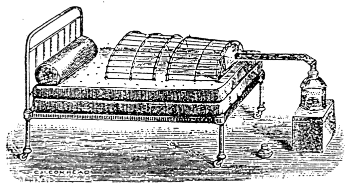
    <figcaption style="font-size: 14px; color: #4a5568; margin-top: 6px;"><em>141
Tē 141 tô.—Cheng-khì-e̍k. Tio̍h ū koh pī-pān chi̍t ê kún-chúi-koàn.</em></figcaption>
  </figure>
  <figure style="display: inline-block; margin: 12px; max-width: 90%; text-align: center;">
    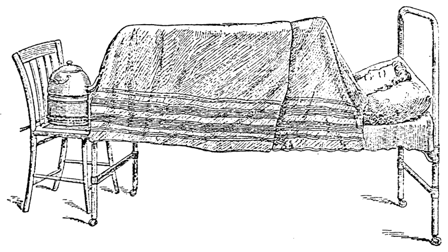
    <figcaption style="font-size: 14px; color: #4a5568; margin-top: 6px;"><em>142
Tē 142 tô.—Cheng-khì-e̍k pīⁿ-lâng lóng ū-pī hó-sè (Stoney).</em></figcaption>
  </figure>

### CHENG-KHÌ-E̍K（205 頁）

Cheng-khì-e̍k (蒸氣浴, *Vapour bath*; tē 141—142 tô͘) :  
Tio̍h ū te̍k-pia̍t ê ke-si, kap te̍k-pia̍t ê hong-hoat. Tio̍h ū-pī *brandy* ê chiú, *strychnine*, kap chù-siā-khì.

> **【全漢對照】**  
> 蒸氣浴（蒸氣浴，*Vapour bath*；第 141—142 圖）：  
> 著有特別的器具（ke-si），佮特別的方法。著預備 *brandy* 的酒，*strychnine*（番木鱉鹼 / 士的寧），佮注射器。

---

**[圖 141 & 142 說明]**

Tē 141 tô͘.—Cheng-khì-e̍k. Tio̍h ū koh pī-pān chi̍t ê kún-chúi-koàn.  
Tē 142 tô͘.—Cheng-khì-e̍k pīⁿ-lâng lóng ū-pī hó-sè (*Stoney*).

> **【全漢對照】**  
> 第 141 圖。—蒸氣浴。著有閣備辦一个滾水罐。  
> 第 142 圖。—蒸氣浴病人攏預備好勢（*Stoney*）。

---

1. Pīⁿ-lâng ê i-ho̍k thǹg liáu, ēng chi̍t niá hang sio ê tōa niá thán-á, kah pīⁿ-lâng kui seng-khu ê téng-bīn.

> **【全漢對照】**  
> 1. 病人的衣服褪了，用一領烘燒的大領毯仔，蓋病人歸身軀的頂面。

---

2. Seng-khu-ē chhu chi̍t niá iû-pò͘, á-sī iû-chóa, tī iû-pò͘ ê téng-bīn tio̍h chhu chi̍t niá thán-á.

> **【全漢對照】**  
> 2. 身軀下鋪一領油布，抑是油紙，佇油布的頂面著鋪一領毯仔。

---

3. Pīⁿ-lâng ê khùn-saⁿ, tio̍h thǹg-khí-lâi.

> **【全漢對照】**  
> 3. 病人的睏衫，著褪起來。

---

4. Chiong chi̍t ê tân-kè khòa hē bîn-chhng-téng.

> **【全漢對照】**  
> 4. 將一个藤架跨下眠床頂。

---

**[頁底金句]**

Góa siat-sú chòe sian-ti bêng-pék lóng-chóng ê ò-biāu kap lóng-chóng ê chai-bat, koh siat-sú ū chiâu-pī ê sìn, kàu-gia̍h lâi î-soaⁿ, nā bô jîn-ài, góa chiū bōe sǹg chòe sī sím-mi̍h (I Ko-lîm-to 13 : 2).

> **【全漢對照】**  
> 我設使做先知明白攏總的奧妙佮攏總的知拔（知識），閣設使有齊備的信，夠額來移山，若無仁愛，我就𣍐算做是甚麼（哥林多前書 13 : 2）。

<!-- Page 221 End -->

---

<!-- Page 222 Start -->
#### 📖 原書第 222 頁

### 206 SÓE-E̍K, PHÓ͘-THONG KAP TE̍K-PIA̍T Ê HOAT

**[Cheng-khì-e̍k]**

5\. Ēng chi̍t niá tōa niá thán-á, khàm hit kè-á-téng.

> **【全漢對照】**  
> 5\. 用一件大件毯仔，蓋彼架仔頂。

---

6\. Chi̍t niá thán-á-téng, tio̍h khàm chi̍t niá iû-pò͘.

> **【全漢對照】**  
> 6\. 一件毯仔頂，著蓋一件油布。

---

7\. Iû-pò͘-téng, chiah koh khàm nñg saⁿ tēng ê thán-á. Sì-piⁿ lóng tio̍h soeh hō͘ ân, m̄-thang hō͘ i tháu-khùi. Chí-ū pīⁿ-lâng ê thâu-bīn, hō͘ chhun-chhut-lâi chiū hó (tē 142 tô͘).

> **【全漢對照】**  
> 7\. 油布頂，才閣蓋兩三重ê毯仔。四邊攏著塞（soeh）予緊（ân），毋通予伊透氣。只有病人ê頭面，予伸出嚟就好（第 142 圖）。

---

8\. Hē chi̍t ki hân-loán-kè tī bîn-chhng-lāi ê piⁿ-á, khah khoài khòaⁿ-tio̍h ê só͘-chāi.

> **【全漢對照】**  
> 8\. 下（hē）一支寒暖計佇眠床內ê邊仔，較快看著ê所在。

---

9\. Tùi pīⁿ-lâng ê kha hit thâu, chiong hit niá teh kah seng-khu ê thán-á thiu-chhut-lâi, hō͘ i thǹg-pak-theh.

> **【全漢對照】**  
> 9\. 對病人ê跤彼頭，將彼件咧蓋（kah）身軀ê毯仔抽出嚟，予伊褪赤體（thǹg-pak-theh）。

---

10\. Tī bîn-chhng-kha hit thâu, tio̍h hē chi̍t ki hé-chiú-teng á-sī hé-lô͘; hé chiah hun chòe kúi nā pha lâi tiám; téng-bīn hē chi̍t ê kún-chúi-koàn. Tàu chi̍t ki ian-tâng; koh tàu chi̍t ki kǹg-thih ê khì-kńg, chhiâu hō͘ i siâ-siâ; hit ê khì-kńg hē tī pīⁿ-lâng khòa kha hit thâu bîn-chhng ê só͘-chāi; chiah chhng jip hit kè-á-lāi, óa bîn-chhng piⁿ-á; m̄-thang hō͘ jia̍t-khì thǹg-tio̍h pīⁿ-lâng ê kha. Thán-á tio̍h soeh hō͘ ân. M̄-thang hō͘ khì-kńg, á-sī tùi khì-kńg tih ê chúi, thǹg-tio̍h pīⁿ-lâng ê kha, á-sī seng-khu pa̍t só͘-chāi. Chit khoán ê hoat-tō͘ sī teh i-tī hit chéng sīn-chōng-iām ê pīⁿ; chit khoán ê pīⁿ-lâng ê phê-hu khah iù-chíⁿ, nā thǹg-tio̍h chiū khah oh hó.

> **【全漢對照】**  
> 10\. 佇眠床跤彼頭，著下（hē）一支火酒燈抑是火爐；火才分做幾若葩來點；頂面下一個滾水罐。鬥一支煙筒；閣鬥一支鋼鐵ê氣管，喬予伊斜斜；彼個氣管下佇病人跨跤彼頭眠床ê所在；才穿入彼架仔內，倚眠床邊仔；毋通予熱氣燙著病人ê跤。毯仔著塞（soeh）予緊。毋通予氣管，抑是對氣管滴ê水，燙著病人ê跤，抑是身軀別所在。這款ê法度是咧醫治彼種腎臟炎ê病；這款ê病人ê皮膚較幼緻（iù-chíⁿ），若燙著就較惡好。

---

11\. Cheng-khì-e̍k ê un-tō͘ khah siông sī 115° F.— 125° F. (46°— 52° C.) ; chit-ê sī i-seng beh chú-ì.

> **【全漢對照】**  
> 11\. 蒸氣浴ê溫度較常是 115° F.— 125° F. (46°— 52° C.)；這個是醫生欲注意。

---

12\. Cheng-khì-e̍k ê sî-chūn, pīⁿ-lâng hō͘ chia̍h sio, á-sī léng-kún-chúi ; iā ēng léng-chúi, chhòng hō͘ i ê thâu-khak tâm, á-sī ēng léng-tâm-pò͘, hē tī i ê thâu-hia̍h, chiū hó.

> **【全漢對照】**  
> 12\. 蒸氣浴ê時陣，病人予食燒、抑是冷滾水；也用冷水，沖予伊ê頭殼濕，抑是用冷濕布，下（hē）佇伊ê頭額，就好。

---

13\. I-seng nā bô kóng beh ān lōa kú, khàn-hō͘ tio̍h chai put-kò 20 hun-cheng-kú ; m̄-kú chit-ê, sī i-seng teh chú-ì. Nā-sī teh ēng ê sî, pīⁿ-lâng chhin-chhiūⁿ beh hūn-khì ê khoán, khì-e̍k tio̍h soah.

> **【全漢對照】**  
> 13\. 醫生若無講欲按（ān）偌久，看護著知不過 20 分鐘久；毋過這個，是醫生咧注意。若是咧用ê時，病人親像欲暈去ê款，氣浴著煞。

---

14\. The̍h-khí-lâi ê hoat-tō͘ : Chiú-teng á-sī hé-lô͘-teng tio̍h seng the̍h-khí-lâi ; chiah chiong khì-kńg the̍h-chhut-

> **【全漢對照】**  
> 14\. 提出來ê法度：酒燈抑是火爐燈著先提出來；才將氣管提出－

<!-- Page 222 End -->

---

<!-- Page 223 Start -->
#### 📖 原書第 223 頁

  <figure style="display: inline-block; margin: 12px; max-width: 90%; text-align: center;">
    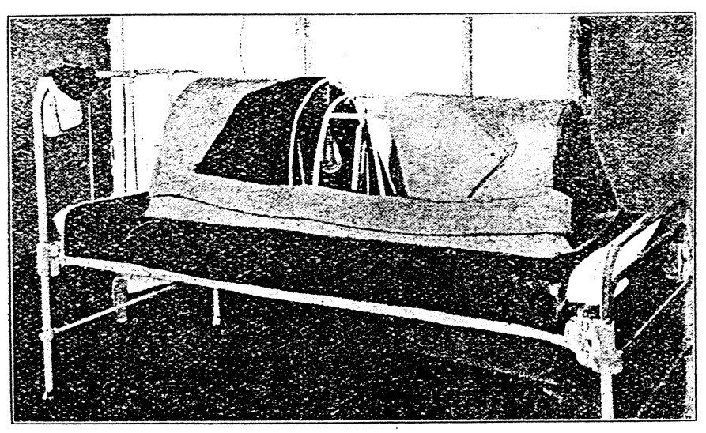
    <figcaption style="font-size: 14px; color: #4a5568; margin-top: 6px;"><em>Tē 143 tô.—Tiān-phok-á chòe ta ê jia̍t-khì-e̍k (Polyclinic Hospital, Philadelphia).</em></figcaption>
  </figure>

### CHENG-KHÌ-E̍K, TA Ê JIA̍T-KHÌ-E̍K（207 頁）

**[Cheng-khì-e̍k]**  
lâi, chiah the̍h hân-loán-kè khí-lâi ; chiong hang sio ê nî-thán-á, tùi bîn-chhng-thâu ê kè-á-ē, kā pīⁿ-lâng ê siōng-pòaⁿ-sin kah hō͘ hó ; chiah khì tùi kha hit thâu, chhun chhiú chiong hā-pòaⁿ-sin kah hō͘ hó. Chiong tîn-kè kap téng-bīn ê iû-pò͘ thiah-khí-lâi, chiàu-kū kā pīⁿ-lâng kah hō͘ hó. Pīⁿ-lâng nā koh lâu kōaⁿ, thán-á tio̍h koh ōaⁿ ta-ê.

> **【全漢對照】**  
> **【蒸氣浴】**  
> 來，才提寒暖計起來；將烘燒的棉毯仔，對眠床頭的架仔下，共病人的上半身蓋予好；才去對跤彼頭，伸手將下半身蓋予好。將藤架佮頂面的油布拆起來，照舊共病人蓋予好。病人若閣流汗，毯仔著閣換燥的。

---

Kōaⁿ lâu liáu-āu, chiong sio-chúi kā sóe, chiah chhit hō͘ ta, iā tio̍h ōaⁿ ta ê saⁿ-á-khò͘. Tio̍h sió-sim m̄-thang hō͘ i kám-tio̍h.

> **【全漢對照】**  
> 汗流了後，將燒水共洗，才拭予燥，也著換燥的衫仔褲。著小心毋通予伊感著（受風寒）。

---

15\. Cheng-khì-e̍k ê tāi-seng tio̍h tī chhùi-lāi kiám-un. Koh cha̍p hun tio̍h koh kiám. Khì-e̍k liáu tio̍h koh kiám-un.

> **【全漢對照】**  
> 15. 蒸氣浴的代先著佇喙內檢溫。閣十分著閣檢。氣浴了著閣檢溫。

---

16\. Cheng-khì-e̍k ê sî-chūn, khàn-hō͘ m̄-thang lī-khui pīⁿ-lâng ê sin-piⁿ.

> **【全漢對照】**  
> 16. 蒸氣浴的時陣，看護毋通離開病人的身邊。

---

### [Ta ê jia̍t-khì-e̍k]

**[Ta ê jia̍t-khì-e̍k]**  
Ū-sî beh ēng ta ê jia̍t-khì-e̍k, thang ēng chit lia̍p tiān-teng ê phok-á, tiàu tī kè-á-téng, óa tī bîn-chhng-tiong. Tiān-la̍t tio̍h chha-put-to 20 chì 30 chek-sò͘.

> **【全漢對照】**  
> **【燥的熱氣浴】**  
> 有時欲用燥的熱氣浴，通用一粒電燈的泡仔，吊佇架仔頂，倚佇眠床中。電力著差不多 20 至 30 燭數。

---

Tē 143 tô͘.—Tiān-phok-á chòe ta ê jia̍t-khì-e̍k (Polyclinic Hospital, Philadelphia).

> **【全漢對照】**  
> 第 143 圖。——電泡仔做燥的熱氣浴（Polyclinic Hospital, Philadelphia）。

---

Ū kúi-nā hāng tio̍h chù-ì-ê :  
1\. Phok-á sio ê sî, nā hiù tio̍h tâm, ōe phòa-khì, tì-kàu thǹg-tio̍h pīⁿ-lâng.

> **【全漢對照】**  
> 有幾若項著注意的：  
> 1. 泡仔燒的時，若敨著澹（淋著水氣），會破去，致到燙著病人。

<!-- Page 223 End -->

---

<!-- Page 224 Start -->
#### 📖 原書第 224 頁

  <figure style="display: inline-block; margin: 12px; max-width: 90%; text-align: center;">
    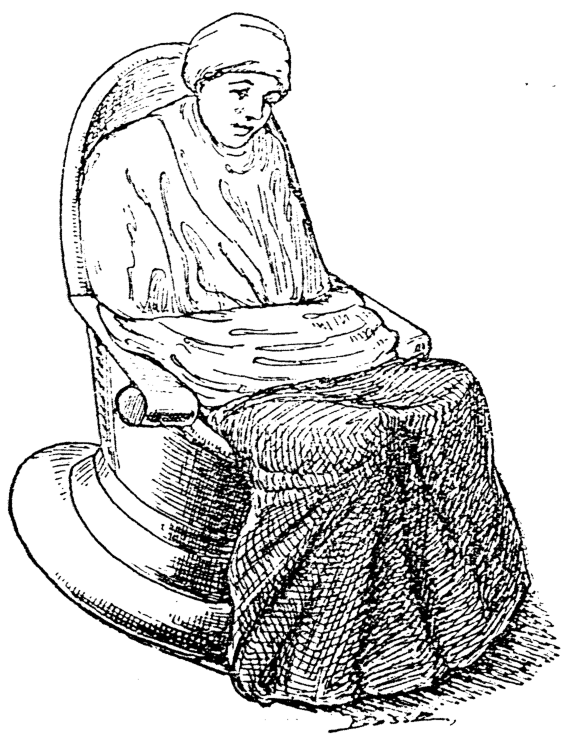
    <figcaption style="font-size: 14px; color: #4a5568; margin-top: 6px;"><em>Tē 144 tô.—Chō-e̍k (Bandler).</em></figcaption>
  </figure>

### SÓE-E̍K, PHÓ͘-THONG KAP TEK-PIA̍T Ê HOAT（洗浴，普通佮特別ê法）

#### [Ta ê jia̍t-khì-e̍k / 乾ê熱氣浴]（承前頁）

2. Tiān-sòaⁿ nā tâm, tiān-la̍t bōe kè (*short circuit*).
3. Phok-á nā khè-tio̍h thán-á, á-sī phē, ōe sio-tio̍h; só͘-í iàu-kín tio̍h ēng khah nńg ê iân lâi pau phok-á kap tiān-sòaⁿ, bián tì-kàu sio-tio̍h pīⁿ-lâng (tē 143 tô).

> **【全漢對照】**
> 2. 電線若澹，電力𣍐過 (*short circuit*)。
> 3. 泡仔（電泡）若揩著毯仔，抑是被，會燒著；所以要緊著用較軟的鉛來包泡仔佮電線，免致到燒著病人（第 143 圖）。

Tio̍h pī-pān pīⁿ-lâng, chhin-chhiūⁿ téng-bīn sio-siāng. Beh hō͘ pīⁿ-lâng lâu kōaⁿ, só͘ ēng ê thán-á tio̍h chhòng kū-ê, m̄-thang ēng sin-ê.

> **【全漢對照】**
> 著備辦病人，親像頂面相同。欲予病人流汗，所用的毯仔著創舊的，毋通用新的。

---

### Sio-kha-e̍k（燒跤浴）

Sio-kha-e̍k: Chit-ê sī ēng sio-chúi sóe i ê kha, iā chìm kha. Nā án-ni, eng-kai tio̍h li̍ok-siók thiⁿ sio-chúi. Iā tio̍h ēng iû-pò͘, á-sī sin-bûn-chóa jia-khàm, lâi pó-hō͘ bîn-chhng kap pīⁿ-lâng ê saⁿ-á-khò͘; iā ēng saⁿ, á-sī thán-á kah hō͘ i ê tōa-thúi bōe léng. Chìm liáu tio̍h liâm-piⁿ chhit ta.

> **【全漢對照】**
> 燒跤浴：這個是用燒水洗伊的跤，也浸跤。若按呢，應該著陸續添燒水。也着用油布，抑是新聞紙遮蓋，來保護眠床佮病人的衫仔褲；也用衫，抑是毯仔蓋予伊的大腿𣍐冷。浸了著連鞭拭焦。

---

### Te̍k-pia̍t sóe-e̍k ê hoat.（特別洗浴ê法）

#### Chō-e̍k（坐浴）

Chō-e̍k (坐浴, *Sitz bath*): Chiàu chit ê hoat-tō͘, sóe-e̍k tio̍h ū te̍k-pia̍t ê e̍k-tháng (tē 144 tô). Chúi tio̍h chha put-to 110° F. (44.3° C.) sio. Pīⁿ-lâng tio̍h chē tī chúi-nih hia chìm. Só͘ chìm ê só͘-chāi, sī tùi io kàu tōa-chúi. Tio̍h ēng thán-á pau-ûi pīⁿ-lâng ê seng-khu, iā koh chi̍t niá pau i ê kha.

*(Tē 144 tô͘.—Chō-e̍k (Bandler).)*

> **【全漢對照】**
> 坐浴 (坐浴, *Sitz bath*)：照這個法度，洗浴著有特別的浴桶（第 144 圖）。水著差不多 110° F. (44.3° C.) 燒。病人著坐在水裡遐浸。所浸的所在，是對腰到大腿。着用毯仔包圍病人的身軀，也閣一領包伊的跤。
> 
> *(第 144 圖——坐浴 (Bandler))*

---

#### Alkaline sóe-e̍k（Alkaline 洗浴）

*Alkaline* sóe-e̍k: Ēng *sodii bicarbonas* 150.3 grms., á-sī *potassii bicarbonas* 150.0 grms. piàⁿ tī pêng-siông ê sóe-e̍k-tháng-lāi. Piàⁿ sio-chúi 8,0000 c.c. (chiū-sī pêng-siông chióh-iû-tháng ê sì pē).

> **【全漢對照】**
> *Alkaline* 洗浴（鹼性洗浴）：用 *sodii bicarbonas*（重曹 / 碳酸氫鈉）150.3 grms.，抑是 *potassii bicarbonas*（碳酸氫鉀）150.0 grms. 傾在平常的洗浴桶內。傾燒水 80,000 c.c.（就是平常石油桶的四倍）。

<!-- Page 224 End -->

---

<!-- Page 225 Start -->
#### 📖 原書第 225 頁

  <figure style="display: inline-block; margin: 12px; max-width: 90%; text-align: center;">
    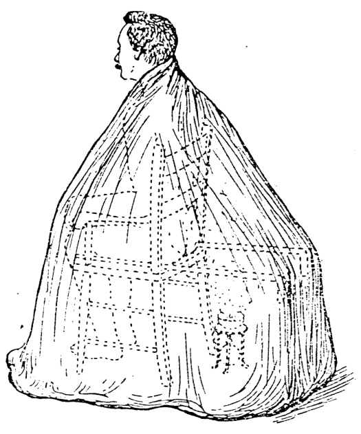
    <figcaption style="font-size: 14px; color: #4a5568; margin-top: 6px;"><em>Tē 145 tô.—Súi-gûn-ėk. (From Woodwark's “Medical Nursing,” Edward Arnold, publisher.)</em></figcaption>
  </figure>

### JIÛ-HÔNG-E̍K; SÚI-GÛN-E̍K (209)

---

### [Jiû-hông-e̍k]

Jiû-hông-e̍k (Sulphur bath): Ēng *potassa sulphurata* 60.0 grms., sio-chúi 6,0000.0 c.c. (chiū-sī pêng-siông chiòh-iû-tháng ê saⁿ pē). Hō͘ pīⁿ-lâng chìm 30 hun-cheng-kú.

> **【全漢對照】**
> **硫磺浴**（Sulphur bath）：用 *potassa sulphurata* 60.0 grms.，燒水 60,000.0 c.c.（就是平常石油桶的三倍）。互病人浸 30 分鐘久。

---

### [Súi-gûn-e̍k]

Súi-gûn-e̍k (*Mercurial bath*): Chit ê hoat-tō͘ ài ēng súi-gûn lūi ê iòh kā pīⁿ-lâng sóe-e̍k. Te̍k-piat ēng chi̍t pha hé-chiú-teng, ēng 1.0 grm. *calomel* iòh-hún piàⁿ tī se-iûⁿ thih ê tîh-á téng-bīn. Chiong tîh-á, hē tī hé-chiú-teng ê téng-bīn. Chiah khòa hē tī pīⁿ-lâng ê bîn-chhng-piⁿ ê kè-á-lāi, kî-û ê mih lóng chiàu téng-bīn só͘ kì ê jia̍t-khì-sóe-e̍k ê hoat-tō͘ (tē 145 tô͘). Chiàu chit ê hoat-tō͘ pīⁿ-lâng nā chē tîn-í-téng, iā thang; hē teng kap iòh tī ē-tóe, iā chiong thán-á, tùi ām-kún kàu tē-pán, khàm hō͘ ba̍t. Pīⁿ-lâng tī lāi-bīn thǹg-pak-theh. Iok-liōk 15 hun-cheng-kú, iòh chiū ōe hòa pìⁿ-chiâⁿ khì. Chòe iàu-kín-ê, khàn-hō͘ tiòh siông-siông chù-ì hit ê hé-chiú-teng, in-ūi chit ê hoat-tō͘ sī ēng hē tī bîn-chhng-lāi, á-sī í-ē, sió-khóa bô kín-sīⁿ chiū chin khoài hoat hé. Iòh hòa liáu-āu chiū tiòh chiong teng théh-chhut-lâi, iā sòa chhēng i-ho̍k. M̄-thang chhit pīⁿ-lâng ê seng-khu, in-ūi ài hō͘ chit ê iòh ji̍p tī seng-khu-lāi.

> **【全漢對照】**
> **水銀浴**（*Mercurial bath*）：此個法度愛用水銀類的藥共病人洗浴。特別用一盞火酒燈（酒精燈），用 1.0 grm. *calomel*（甘汞）藥粉傾佇西洋鐵的碟仔頂面。將碟仔，下佇火酒燈的頂面。才跨下佇病人的眠床邊的架仔內，其餘的物攏照頂面所記的熱氣洗浴的法度（第 145 圖）。照此個法度病人若坐藤椅頂，亦通；下燈佮藥佇下底，亦將毯仔，對頷頸到地板，蓋互密。病人在內面褪赤體。約略 15 分鐘久，藥就會化變成氣。最適緊的，看護著常常注意彼個火酒燈，因為此個法度是用下佇眠床內，抑是椅下，稍許無謹慎就真快發火。藥化了後就著將燈提出來，亦續穿衣服。毋通拭病人的身軀，因為愛互此個藥入佇身軀內。

---

> **【插圖說明】**  
> Tē 145 tô͘.—Súi-gûn-e̍k. (From Woodward's “Medical Nursing,” Edward Arnold, publisher.)  
> *(第 145 圖：水銀浴)*

---

### [Súi-gûn tiòng-to̍k]

Khàn-hō͘ tiòh chai súi-gûn sī ū to̍k ê mih, só͘-í ēng súi-gûn chit lūi lâi sóe-e̍k, iā ōe hō͘ lâng tiòng-to̍k. Nā-sī

> **【全漢對照】**
> **水銀中毒**  
> 看護著知水銀是有毒的物，所以用水銀這類來洗浴，亦會互人中毒。若是……

---

### [頁底註釋]

Iû ê chit ōe hō͘ iû-pò͘, á-sī chhiū-leng pháiⁿ-khì.

> **【全漢對照】**
> 油的質會互油布，抑是樹乳（橡膠）歹去。

<!-- Page 225 End -->

---

<!-- Page 226 Start -->
#### 📖 原書第 226 頁

## 210 SÓE-E̍K, PHÓ͘-THONG KAP TE̍K-PIA̍T Ê HOAT

pīⁿ-lâng ê chhùi-khí-hōaⁿ thiàⁿ, á-sī chhùi-lāi ū pháiⁿ ê kháu-khì, á-sī hā-lī, che sī in-ūi tiòng-to̍k. Khàn-hō͘ tio̍h kóaⁿ-kín kā i-seng kóng.

> **【全漢對照】**
> 病人的喙齒岸疼，抑是喙內有歹的口氣，抑是下痢，這是因為中毒。看護著趕緊共醫生講。

---

### Lysol sóe-e̍k-hoat（Lysol 洗浴法）

*Lysol* sóe-e̍k-hoat: Ēng *lysol* (chho͘ *carbolic*) 20.0 c.c., sio-chúi 6,0000.0 c.c. Hō͘ pīⁿ-lâng chìm 30 hun-cheng-kú.

> **【全漢對照】**
> **Lysol 洗浴法**：用 lysol（粗 carbolic）20.0 c.c.，燒水 6,0000.0 c.c.。予病人浸 30 分鐘久。

---

### Ám-sóe-e̍k-hoat（泔洗浴法）

Ám-sóe-e̍k-hoat: Tōa keng ê pīⁿ-īⁿ, ta̍k ji̍t chú pn̄g hō͘ pīⁿ-lâng chia̍h, hit ê pn̄g-ám sî-siông ū chhun, thang chiong só͘ chhun ê ám, chhiong chúi tùi-pòaⁿ, án-ni lâi sóe-e̍k, thang i-tī phê-hu chit khoán ê pīⁿ.

Koh chi̍t ê hoat-tō͘, sī chiong nñg kun bí, géng chiâⁿ iù-iù chòe bí-hu; chiah kiáu tām-po̍h léng-chúi lā hō͘ chiâu, chiah lo̍h khì chú 15 hun-cheng-kú; jiân-āu phâng khí-lâi thàu 3,0000.0 c.c. ê chúi lâi sóe-e̍k.

> **【全漢對照】**
> **泔洗浴法**：大間的病院，逐日煮飯予病人食，彼個飯泔時常有賰，通將所賰的泔，沖水對半，按呢來洗浴，通醫治皮膚這款的病。
> 
> 閣一个法度，是將兩斤米，研成幼幼做米麩；才攪淡薄冷水攪予勻，才落去煮 15 分鐘久；然後捧起來透 3,0000.0 c.c. 的水來洗浴。

---

### Hún-chiuⁿ-sóe-e̍k-hoat（粉漿洗浴法）

Hún-chiuⁿ-sóe-e̍k-hoat: Chiong pòaⁿ kun hún-chiuⁿ kiáu tām-po̍h léng-chúi lā hō͘ sòaⁿ; chiong kún-chúi chhiong-lo̍h-khì, sòa lā hō͘ kàu chiâu se̍k, chhin-chhiūⁿ beh chiuⁿ saⁿ-á-khò͘ ê khoán; chiah piàⁿ ji̍p tī 6,0000.0 c.c. chúi ê e̍k-tháng-ni̍h, lâi sóe-e̍k, iû-goân thang i-tī phê-hu chit khoán ê pīⁿ.

> **【全漢對照】**
> **粉漿洗浴法**：將半斤粉漿攪淡薄冷水攪予散；將滾水沖落去，紲攪到到勻熟，親像欲漿衫仔褲的款；才傾入佇 6,0000.0 c.c. 水的浴桶裡，來洗浴，猶原通醫治皮膚這款的病。

<!-- Page 226 End -->

---

