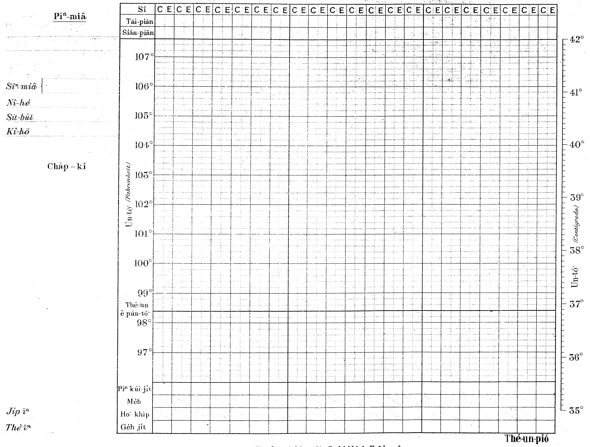
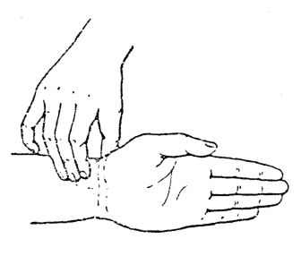
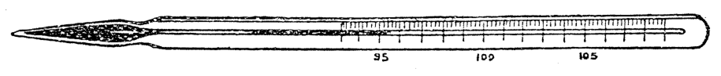
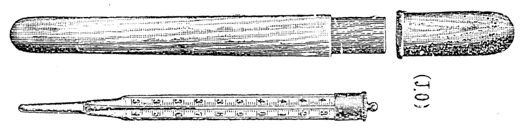
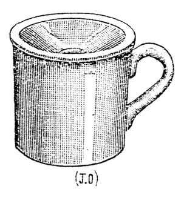
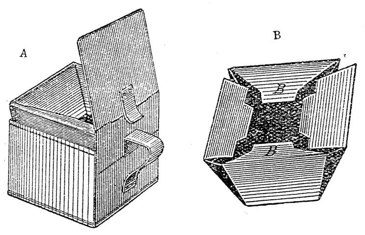

# 第二十章 看護查考患者的實情 (Khàn-hō͘ Cha-khóaⁿ Hoān-chia ê Sū-chêng)

> **所屬篇章**：第二篇 普通看護學 (Phó͘-thong Khàn-hō͘-ha̍k)
> **原書頁碼**：第 272 頁 ～ 第 294 頁 (已收錄 23/23 頁)

---

<!-- Page 272 Start -->
#### 📖 原書第 272 頁

### TĒ 20 CHIUⁿ
### KHÀN-HŌ͘ CHA-KHÒAⁿ HOĀN-CHIÁ Ê SŪ-CHÊNG

**[Khàn-hō͘ tio̍h chín-tiong hôe-hok]**  
Hôe-hok i-seng ê sî ū nn̄g hāng khàn-hō͘ tio̍h ē-kì-tit : thâu chi̍t hāng i-seng só͘ ài chai sī pīⁿ-lâng ê si̍t-sū, i bô ài chai khàn-hō͘ ê ì-kiàn ; tē jī hāng sī i-seng tio̍h khò khàn-hō͘ chín-tiong hôe-hok pīⁿ-lâng só͘ keng-kè ê sū-chêng. Hit ê ê chêng-hêng, khàn-hō͘ m̄-thang ke-thiⁿ á-sī kiám-chió. Ū chin chōe hāng kiám-chhái khàn-hō͘ khòaⁿ sī bô iàu-kín ; chóng-sī ū-sî sió-khóa sū, ē hō͘ i-seng thang kìⁿ-chhut pīⁿ-lâng ê chèng-thâu lâi chín-toàn.

Khàn-hō͘ sî-siông tio̍h chù-ì ê tiâu-kiāⁿ thang hôe-hok i-seng, sī chiàu kì tī ē-tóe : me̍h-phok, thé-un, ho͘-khip, sàu kap thâm, ho͘-chhut ê khì-bī, si̍t-bu̍t, chhùi, chi̍h, áu-thò͘, tāi-piān, siáu-piān, phê-hu, bīn-māu, tó tī bîn-chhn̂g ê khoán-sit, khùn, loān-loān liām, kôaⁿ, thiàⁿ, ge̍h-keng.

> **【全漢對照】**
> ### 第 20 章
> ### 看護查看不患者的事情報
> 
> **［看護著謹重回復］**  
> 回復醫生ê時有兩項看護著會記得：頭一項醫生所愛知是病人的實事，伊無愛知看護ê意見；第二項是醫生著靠看護謹重回復病人所經過ê事情。Hit個ê情形，看護唔通加添抑是減少。有真多項減採看護看是無要緊；總是有時小可事，會互醫生通看出病人的症頭來診斷。
> 
> 看護時常著注意ê條件通回復醫生，是照記佇下底：脈搏、體溫、呼吸、嗽佮痰、呼出的氣味、食物、喙、舌、嘔吐、大便、小便、皮膚、面貌、倒佇眠床的款色、睏、亂亂念、寒、痛、月經。

---

**[Thé-un-pió]**  
Ū chi̍t khoán phó͘-thong-pió, kiò-chòe thé-un-pió, thang kì pīⁿ-lâng kúi-nā khoán ê si̍t-sū, chhin-chhiūⁿ, thé-un, me̍h-phok, ho͘-khip, tāi-, siáu-piān, pīⁿ keng-kè kúi-ji̍t, sìⁿ-miâ, nî-hè, si̍t-bu̍t, kì-hō, ji̍p-īⁿ, thè-īⁿ. Chiah ê sū tio̍h siông-sè kì, iā thé-un-pió tio̍h sió-sim chéng-chôe. Chit ê thé-un-pió tio̍h hē tī ba̍t-chia̍t ê só͘-chāi, m̄-thang hō͘ pīⁿ-lâng khòaⁿ-kìⁿ ; in-ūi pīⁿ-lâng nā khòaⁿ-kìⁿ i ta̍k ji̍t khah hó, sim khah ē pêng-an ; m̄-kú nā khòaⁿ-kìⁿ i ta̍k ji̍t bô khah hó, i ê sim chiū bōe bián-tit iu-būn kiaⁿ-hiâⁿ. Khàn-hō͘ tio̍h chai i-seng khòaⁿ thé-un-pió ê sî, i sǹg só͘ kì-ê sī si̍t-chāi, só͘-í sī tē it iàu-kín-ê m̄-thang chhìn-chhhái kì. Nā bô kiám-giām m̄-thang kì. Nā khòaⁿ lâng bô jia̍t, m̄-thang sǹg sī chha-put-to thé-un ê pún-tō sòa kì-teh. Nā bô ēng

> **【全漢對照】**
> **［體溫表］**  
> 有一款普通表，叫做體溫表，通記病人幾若款的實事，親像：體溫、脈搏、呼吸、大、小便、病經過幾日、姓名、年歲、食物、記號、入院、退院。Chiah-ê事著詳細記，也體溫表著小心整齊。此個體溫表著置佇密捷的所在，唔通互病人看見；因為病人若看見伊逐日較好，心較會平安；毋拘若看見伊逐日無較好，伊的心就袂免得憂悶驚惶。看護著知醫生看體溫表的時，伊算所記的是實在，所以是第一要緊的唔通秤綵記。若無檢驗唔通記。若看人無熱，唔通算是差不多體溫的本道續記咧。若無用

---

Lâng nā ū sè-kan ê châi-sán, khòaⁿ-kìⁿ i ê hiaⁿ-tī ū khiàm-kheh, iā bô khui i ê chû-sim, Siōng-tè ê thiàⁿ thài-thó ū tiàm tī i ah (I Iok-hān 3 : 17)?

> **【全漢對照】**
> 人若有世間的財產，看見伊的兄弟有欠缺，也無開伊的慈心，上帝的疼汰佗有踮佇伊啊（I 約翰 3:17）？

<!-- Page 272 End -->

---

<!-- Page 273 Start -->
#### 📖 原書第 273 頁

  <figure style="display: inline-block; margin: 12px; max-width: 90%; text-align: center;">
    
    <figcaption style="font-size: 14px; color: #4a5568; margin-top: 6px;"><em>Tē 174 tô.—Phó·-thong ê thé-un-pió : C, chá-khí-sî ; E, ê-hng-sî.</em></figcaption>
  </figure>

### [Tô͘-pió: Thé-un-pió / 圖表：體溫表]

**[Pīⁿ-chhong Chhng-khó Chu-liāu / 病床參考資料]**

* **Pīⁿ-miâ**
* **Sìⁿ-miâ**
* **Nî-hè**
* **Sìt-būi**
* **Kì-hō**
* **Cháp-kì**
* **Ji̍p īⁿ**
* **Thè īⁿ**

> **【全漢對照】**
> * **病名**
> * **姓名**
> * **年歲**
> * **室位**
> * **記號**
> * **雜記**
> * **入院**
> * **退院**

---

### [Thé-un-pió Lōe-iông / 體溫表內容]

* **Sî:** C E C E C E C E C E C E C E C E C E C E C E C E C E C E
* **Tāi-piān**
* **Siáu-piān**
* **Un-tō͘ (Fahrenheit.)**
  * 107°
  * 106°
  * 105°
  * 104°
  * 103°
  * 102°
  * 101°
  * 100°
  * 99°
  * **Thé-un ê pún-tō͘:** 98°
  * 97°
* **Un-tō͘ (Centigrade.)**
  * 42°
  * 41°
  * 40°
  * 39°
  * 38°
  * 37°
  * 36°
  * 35°
* **Pīⁿ kúi-ji̍t**
* **Me̍h**
* **Ho-khip**
* **Ge̍h ji̍t**
* **Thé-un-pió**

> **【全漢對照】**
> * **時：** C E C E C E C E C E C E C E C E C E C E C E C E C E C E
> * **大便**
> * **小便**
> * **溫度（華氏）**
>   * 107°
>   * 106°
>   * 105°
>   * 104°
>   * 103°
>   * 102°
>   * 101°
>   * 100°
>   * 99°
>   * **體溫兮本度：** 98°（常態體溫基準）
>   * 97°
> * **溫度（攝氏）**
>   * 42°
>   * 41°
>   * 40°
>   * 39°
>   * 38°
>   * 37°
>   * 36°
>   * 35°
> * **病幾日**
> * **脈**
> * **呼吸**
> * **月日**
> * **體溫表**

---

### [Tô͘-siat / 圖說]

Tē 174 tô͘.—Phó͘-thong ê thé-un-pió : C, chá-khí-sî ; E, ê-hng-sî.

> **【全漢對照】**
> 第 174 圖。——普通兮體溫表：C，早起時；E，下昏時。

<!-- Page 273 End -->

---

<!-- Page 274 Start -->
#### 📖 原書第 274 頁

### MÈH-PHOK (脈搏) — 257

thé-un-khì kiám-un, á-sī bōe-kì-tit, tióh m̄-thang kì. Pát hāng iā sī án-ni (tē 174, 175 tô͘).

> **【全漢對照】**  
> 體溫器減溫，抑是袂記得，著毋通記。別項也是按呢（第 174, 175 圖）。

---

### [Méh-phok / 脈搏]

Phó͘-thong ê koan-chhat :  
Méh-phok ê lí-iû kap khoán-sit tī 76 bīn ū kóng-khí. Chit chiūⁿ iáu-bē tha̍k ê tāi-seng khàn-hō͘ tióh koh tha̍k. Méh-phok, thé-un, ho͘-khip chit saⁿ hāng ū koan-liân. Chiàu pêng-siông ê lí-khì lâi lūn, thé-un ê koâiⁿ kap méh-phok, ho͘-khip, kín-bān ê koan-hē sī sio-ha̍p. Pīⁿ-lâng ê thé-un nā khah koâiⁿ, i ê méh-phok, ho͘-khip ê kín-bān ê koan-hē sī sio-ha̍p. Pīⁿ-lâng ê thé-un nā khah koâiⁿ, i ê méh-phok, ho͘-khip chiū khah kín. Tāi-khài lâi kóng, thé-un nā ke chi̍t tō͘ F., i ê méh chi̍t hun-kan ōe ke kín 10-ē, chiàu ē-tóe só͘ kì:

| Thé-un | (攝氏) | phó͘-thong tùi-háp | méh-sò͘ |
| :--- | :--- | :--- | :--- |
| 98° F. | (36.7° C.) | phó͘-thong tùi-háp | 60-ē |
| 99° | (37.2° C.) | ” ” | 70 ” |
| 100° | (37.8° C.) | ” ” | 80 ” |
| 101° | (38.3° C.) | ” ” | 90 ” |
| 102° | (38.9° C.) | ” ” | 100 ” |
| 103° | (39.4° C.) | ” ” | 110 ” |
| 104° | (40.0° C.) | ” ” | 120 ” |
| 105° | (40.6° C.) | ” ” | 130 ” |
| 106° | (40.1° C.) | ” ” | 140 ” |

> **【全漢對照】**  
> 普通的觀察：  
> 脈搏的理由佮款式佇 76 面有講起。這章猶未讀的學生看護著閣讀。脈搏、體溫、呼吸這三項有關聯。照平柴的理氣（常理）來論，體溫的高佮脈搏、呼吸，緊慢的關係是相合。病人的體溫若較高，伊的脈搏、呼吸的緊慢的關係是相合。病人的體溫若較高，伊的脈搏、呼吸就較緊。大概來講，體溫若加一度 F.，伊的脈一分間會加緊 10 下，照下底所記：
> 
> | 體溫 | （攝氏） | 普通對合 | 脈數 |
> | :--- | :--- | :--- | :--- |
> | 98° F. | (36.7° C.) | 普通對合 | 60 下 |
> | 99° | (37.2° C.) | 〃 〃 | 70 〃 |
> | 100° | (37.8° C.) | 〃 〃 | 80 〃 |
> | 101° | (38.3° C.) | 〃 〃 | 90 〃 |
> | 102° | (38.9° C.) | 〃 〃 | 100 〃 |
> | 103° | (39.4° C.) | 〃 〃 | 110 〃 |
> | 104° | (40.0° C.) | 〃 〃 | 120 〃 |
> | 105° | (40.6° C.) | 〃 〃 | 130 〃 |
> | 106° | (40.1° C.) | 〃 〃 | 140 〃 |

---

Méh-sò͘ sī múi hun-cheng thiàu kúi-ē. M̄-thang kan-ta kóng méh-phok sī kín, tióh kóng, chi̍t hun-cheng-kú kúi-ē.

> **【全漢對照】**  
> 脈數是每分鐘跳幾下。毋通干單講脈搏是緊，著講，一分鐘久幾下。

---

### [Chiàⁿ-kui-méh / 正規脈]

Chiàⁿ-kui-méh (正規脈, *regular pulse*), chiū-sī méh-phok teh thiàu ê sî, hit ê hioh ê sî-kan pîⁿ kú, pîⁿ tōa la̍t-ê.

> **【全漢對照】**  
> 正規脈（正規脈, *regular pulse*），就是脈搏咧跳的時，彼個歇的時間平久，平大力ê。

---

### [Put-kui-chek-méh / 不規則脈]

Put-kui-chek-méh (不規則脈, *irregular pulse*), chiū-sī méh loān-loān, thêng ê sî bô pîⁿ kú, ū-sî tōa-ē, ū-sî sòe, bô chiàu chhù-sū.

> **【全漢對照】**  
> 不規則脈（不規則脈, *irregular pulse*），就是脈亂亂，停的時無平久，有時大下，有時細，無照秩序。

---

### [Kàn-hat-méh / 間歇脈]

Kàn-hat-méh (間歇脈, *intermittent pulse*), chiū-sī méh thiàu ê sî, ū-sî kiám chi̍t-ē; chhin-chhiūⁿ cha̍p-ē chiàu chhù-sū, hut-jiân làng chi̍t-ē, chiah koh thiàu. Chit hō kàn-hat-méh, ū-sî bô pīⁿ ê lâng iā ū chit khoán ê méh; iā

> **【全漢對照】**  
> 間歇脈（間歇脈, *intermittent pulse*），就是脈跳的時，有時減一下；親像十下照秩序，忽然漏（間隔）一下，才閣跳。這號間歇脈，有時無病的人也有這款的脈；也

---

Ta̍k hāng sū tióh chīn-tiong.

> **【全漢對照】**  
> 各項事著盡忠。

<!-- Page 274 End -->

---

<!-- Page 275 Start -->
#### 📖 原書第 275 頁

258 CHA-KHÒAⁿ HOĀN-CHIÁ Ê SŪ-CHÊNG

ū-sî tùi sîn-keng pīⁿ, á-sī chia̍h tê, ko-phi, hun-chháu (*tobacco*), kè-thâu, chiah ōe án-ni.

> **【全漢對照】**
> 有時對神經病，抑是食茶、咖啡、煙草（*tobacco*）過頭，才會按呢。

---

### Sió-núng-hi-me̍h (小軟虛脈)

Sió-núng-hi-me̍h (小軟虛脈, *compressible pulse*) sī sió-khóa koh núng ê me̍h; ēng chńg-thâu-á jih chiū khoài-khoài bô-khì.

> **【全漢對照】**
> 小軟虛脈（小軟虛脈, *compressible pulse*）是稍可閣軟的脈；用指頭仔揤就快快無去。

---

### Lân-ap-me̍h (難壓脈)

Lân-ap-me̍h (難壓脈, *incompressible pulse*), chiū-sī me̍h khah kiông, sui-jiân ēng chńg-thâu-á jih, iā khah oh bô-khì.

> **【全漢對照】**
> 難壓脈（難壓脈, *incompressible pulse*），就是脈較強，雖然用指頭仔揤，也較惡無去。

---

### Koâiⁿ-ap-me̍h (高壓脈)

Koâiⁿ-ap-me̍h (高壓脈, *high tension pulse*), chiū-sī me̍h thiàu khah tōa la̍t; jih beh hō͘ i tiām khah oh-tit.

> **【全漢對照】**
> 高壓脈（高壓脈, *high tension pulse*），就是脈跳較大力；揤欲互伊恬較惡得。

---

### Kē-ap-me̍h (低壓脈)

Kē-ap-me̍h (低壓脈, *low tension pulse*), sī chhin-chhiūⁿ sió-núng-hi-me̍h; ēng chńg-thâu-á kā i jih, khoài-khoài bô khì.

> **【全漢對照】**
> 低壓脈（低壓脈, *low tension pulse*），是親像小軟虛脈；用指頭仔共伊揤，快快無去。

---

### Tiông-hok-me̍h (重複脈)

Tiông-hok-me̍h (重複脈, *dicrotic pulse*), chiū-sī sim-chōng phok-tōng chi̍t-ē, chiū chhiú-me̍h ū thiàu nñg-ē, thâu chi̍t-ē khah tōa, tē jī-ē khah sòe. Thâu chi̍t-ē khah tōa-ē, sī tùi sim ê chó-sek kiu-sok hō͘ huih chhut, chiàu tē 5 chiuⁿ ū kóng. Tāi-tōng-me̍h ê poàn-goa̍t-piān chiū koaiⁿ, iā tāi-tōng-me̍h ê piah ū kiu-sok, hō͘ khah sòe tōng-me̍h koh thiàu chi̍t-ē khah sòe-ē. Chit hō ê tiông-hok-me̍h, sī in-ūi pīⁿ-lâng ū pīⁿ khah kú, seng-khu khah hi, chhin-chhiūⁿ bān-sèng ê jia̍t pīⁿ, á-sī sió-tñg-jia̍t. Khàn-hō͘ teh sǹg me̍h-phok ê sî, tio̍h sǹg thâu chi̍t-ē, tē jī-ē m̄-thang sǹg. Nā gâu-gî ê sî, tio̍h ēng chi̍t ki chhiú hōaⁿ tī heng-chêng, sim-chōng ê só͘-chāi, pa̍t ki chhiú an tī chhiú-me̍h, chiah ōe chai sim-chōng phok-tōng chi̍t-ē, chhiú-me̍h thiàu nñg-ē.

> **【全漢對照】**
> 重複脈（重複脈, *dicrotic pulse*），就是心臟搏動一下，就手脈有跳兩下，頭一下較大，第二下較細。頭一下較大的，是對心的左室搐縮互血出，照第五章有講。大動脈的半月弁就關，也大動脈的壁有搐縮，互較細動脈閣跳一下較細的。此號的重複脈，是因為病人有病較久，身軀較虛，親像慢性的熱病，抑是小腸熱。看護咧算脈搏的時，著算頭一下，第二下毋通算。若猶疑的時，著用一枝手捾佇胸前、心臟的所在，別枝手安佇手脈，才會知心臟搏動一下，手脈跳兩下。

---

### Bong me̍h ê hoat-tō͘ (摸脈的法度)

Bong me̍h ê hoat-tō͘ :

1. Tùi bong me̍h chiū ōe chai sim-chōng ū pīⁿ á-bô. Pêng-siông sî ê bong me̍h, sī tī chhiú-nih ê jiâu-kut-tōng-me̍h (橈骨動脈, *radial artery*).

> **【全漢對照】**
> 摸脈的法度：
> 1. 對摸脈就會知心臟有病抑無。平常時的摸脈，是佇手裡的橈骨動脈（橈骨動脈, *radial artery*）。

---

Pīⁿ-lâng nā m̄-chia̍h mi̍h, tio̍h khó-khǹg i chia̍h.

> **【全漢對照】**
> 病人若毋食物，著犒勸伊食。

<!-- Page 275 End -->

---

<!-- Page 276 Start -->
#### 📖 原書第 276 頁

  <figure style="display: inline-block; margin: 12px; max-width: 90%; text-align: center;">
    
    <figcaption style="font-size: 14px; color: #4a5568; margin-top: 6px;"><em>Tē 176 tô:—Bong méh ê hoat-tō. (From Woodwark's " Medical Nursing," Edward Arnold, publisher.)</em></figcaption>
  </figure>

### BONG ME̍H Ê HOAT (p. 259)

2. Chiong pīⁿ-lâng hō͘ i chē í, á-sī tó-teh, in-ūi khiā-teh ê me̍h-phok khah kín. *(Bong me̍h ê hoat-tō͘.)*

> **【全漢對照】**
> 2. 將病人予伊坐椅，抑是倒咧，因為徛咧的脈搏較緊。*（旁註：摸脈的法度。）*

---

3. Chiong pīⁿ-lâng ê chhiú thán phak, iā ēng saⁿ ki chńg-thâu-á khin-khin hōaⁿ tī i ê jiâu-kut-tōng-me̍h ê téng-bīn. Tio̍h thèng-hāu tiap-á-kú hō͘ me̍h khah sūn, in-ūi tāi-seng hōaⁿ-teh ê sî, me̍h-phok ōe khah kín (tē 176 tô͘).

> **【全漢對照】**
> 3. 將病人的手坦覆，也用三枝指頭仔輕輕抲佇伊的橈骨動脈的頂面。著聽候霎仔久予脈較順，因為代先抲咧的時，脈搏會較緊（第 176 圖）。

---

4. Tio̍h khòaⁿ sî-pió ê biáu-chiam, chiok chi̍t hun-cheng-kú, lâi sǹg kúi-ē, iā tio̍h liām-piⁿ kì. Nā-sī teh ēng kiám-me̍h-khì, tio̍h tùi-chiàu sî-pió ū tú-tú chi̍t hun-kú, á-sī pòaⁿ hun-kú á-bô, in-ūi kiám-me̍h-khì, ū-sî ōe chhò.

> **【全漢對照】**
> 4. 著看時錶的秒針，足一分鐘久，來算幾下，也著連鞭記。若是咧用驗脈器，著對照時錶有拄拄一分久，抑是半分久抑無，因為驗脈器，有時會錯。

---

**Tē 176 tô͘:—Bong me̍h ê hoat-tō͘.**  
*(From Woodwark's “Medical Nursing,” Edward Arnold, publisher.)*

> **【全漢對照】**
> **第 176 圖：—摸脈的法度。**  
> *（出自 Woodwark 著《Medical Nursing》，Edward Arnold 出版。）*

---

5. Tio̍h khòaⁿ me̍h-phok ê la̍t ū chún á-bô, nā-sī bô chiàu chhù-sū, tio̍h kì me̍h ê khoán-sit sī cháiⁿ-iūⁿ.

> **【全漢對照】**
> 5. 著看脈搏的力有準抑無，若無照秩序，著記脈的款式是怎樣。

---

6. Nā-sī pīⁿ-lâng chi̍t ki chhiú ê me̍h-phok m̄-hó, tio̍h koh khòaⁿ hit ki chhiú ê me̍h ū sio-siāng á-bô. Siông-siông bat ū pīⁿ-lâng nn̄g chhiú ê me̍h bô saⁿ-tâng, só͘-í tio̍h sió-sim lâi chhâ-khòaⁿ; bo̍h-tit in-ūi chi̍t chhiú ê me̍h ê khoán-sit m̄-hó, chiū kā i-seng kóng.

> **【全漢對照】**
> 6. 若是病人一枝手的脈搏毋好，著閣看彼枝手的脈有相像抑無。常常曾有病人兩手的脈無相同，所以著小心來查看看；莫得因為一手脈的款式毋好，就共醫生講。

---

7. Gín-ná háu ê sî, i ê me̍h ōe khah kín, só͘-í bong bōe chún.

> **【全漢對照】**
> 7. 囡仔哮的時，伊的脈會較緊，所以摸𣍐準。

---

6. Lâng ê me̍h-phok, chi̍t hun-kú ê kín-bān ū pâi-lia̍t tī ē-tóe:

| 年齡 / 階段 | 時間單位 | 範圍 | 脈搏次數 |
| :--- | :--- | :--- | :--- |
| Thai-jî tī bú pak ê sî, | chi̍t hun-kú, | tùi 130 | chì 160-ē. |
| Tú-á chhut-sì ê eⁿ-á | ,, ,, | 130 | ,, 150 ,, |
| Gín-ná kàu tō-chè | ,, ,, | 110 | ,, 130 ,, |
| 2 nî chiok | ,, ,, | 90 | ,, 115 ,, |
| 3 ,, ,, | ,, ,, | 80 | ,, 110 ,, |
| 7 ,, ,, | ,, ,, | 72 | ,, 90 ,, |
| 12 ,, ,, | ,, ,, | 70 | ,, 76 ,, |
| 18—60 hè | ,, ,, | 70 | ,, 80 ,, |
| 60—80 ,, | ,, ,, | 60 | ,, 70 ,, |

> **【全漢對照】**
> 6. 人的脈搏，一分久的緊慢有排列佇下底：
> 
> | 年齡 / 階段 | 時間單位 | 範圍 | 脈搏次數 |
> | :--- | :--- | :--- | :--- |
> | 胎兒佇母腹的時， | 一分久， | 對 130 | 至 160 下。 |
> | 拄仔出世的嬰仔 | 〃 〃 | 130 | 〃 150 〃 |
> | 囡仔到度晬 | 〃 〃 | 110 | 〃 130 〃 |
> | 2 年足 | 〃 〃 | 90 | 〃 115 〃 |
> | 3 〃 〃 | 〃 〃 | 80 | 〃 110 〃 |
> | 7 〃 〃 | 〃 〃 | 72 | 〃 90 〃 |
> | 12 〃 〃 | 〃 〃 | 70 | 〃 76 〃 |
> | 18—60 歲 | 〃 〃 | 70 | 〃 80 〃 |
> | 60—80 〃 | 〃 〃 | 60 | 〃 70 〃 |

---

*(Tio̍h chheng-khì.)*

> **【全漢對照】**
> *（接續下頁標記：著清潔。）*

<!-- Page 276 End -->

---

<!-- Page 277 Start -->
#### 📖 原書第 277 頁

260 **CHA-KHÒAⁿ HOĀN-CHIÁ Ê SŪ-CHÊNG**

Ēng tōa-thâu-bú lâi bong me̍h, sī bô lī-piān, iā tōa-thâu-bú-lāi ê tōng-me̍h ū-sî ōe hô-hūn khàn-hō͘. Tùi án-ni ū-sî khàn-hō͘ ōe sìng ka-kī tōa-thâu-bú ê me̍h, lia̍h-chòe pīⁿ-lâng-ê.

> **【全漢對照】**
> 用大頭拇來摸脈，是無利便，也大頭拇內的動脈有時會和混看護。對按呢有時看護會算家己大頭拇的脈，掠做病人的。

---

### Thé-un（體溫）

**[Thé-un]**  
Thé-un : Pêng-siông bô pīⁿ ê lâng ê thé-un khah chōe tùi 98.4° F. (36.9° C.) chì 98.6° F. (37.0° C.), kiò-chòe thé-un ê pún-tō͘. Ta̍k ji̍t chá-khí-sî tùi 7 á-sī 8 tiám-cheng, kàu ê-hng-sî 7 á-sī 8 tiám-cheng ū chiām-chiām khah koâiⁿ. Ji̍t-sî tē it koâiⁿ ê sî-chūn, sī tùi ē-pò 5 tiám, kàu 8 tiám ; tē it kē, sī tùi pòaⁿ-mî 12 tiám, kàu chá-khí-sî 4 tiám-cheng. Chá-khí-sî ē-pò-sî ê cheng-chha, sī chha-put-to pòaⁿ tō͘ F.

> **【全漢對照】**
> **【體溫】**  
> 體溫：平常無病的人的體溫較多對 98.4° F. (36.9° C.) 至 98.6° F. (37.0° C.)，叫做體溫的本度。逐日早起時對 7 抑是 8 點鐘，到下晡時 7 抑是 8 點鐘有漸漸較懸。日時第一懸的時陣，是對下晝 5 點，到 8 點；第一低，是對半暝 12 點，到早起時 4 點鐘。早起時下晝時的精差，是差不多半度 F.。

---

### Gín-ná / Lāu-lâng（囡仔／老人）

**[Gín-ná / Lāu-lâng]**  
Gín-ná thé-un ê pún-tō͘, pí tōa-lâng-ê khah koâiⁿ tām-po̍h, iā khah khoài piàn khoán. Lāu-lâng ê thé-un iā ū-sî ōe sî-siông khah kē. Chia̍h-pá, thé-un ōe khah koâiⁿ tām-po̍h ; lâu kōaⁿ ê sî, thé-un ōe khah kē.

Nā kóng-khí ta̍k khoán ê thé-un, ū kúi-nā ê miâ thang hō :

| 白話字名稱 | 英文對照 | 溫度範圍 |
| :--- | :--- | :--- |
| Thé-un ê pún-tō͘-hā | *(Subnormal)*, | 98° F. (36.7° C.) í-hā. |
| Thé-un ê pún-tō͘ | *(Normal)*, | 98.4°—98.6° F. (36.9°—37.0° C.) |
| Jia̍t | *(Fever)*, | 99° F. (37.2° C.)—í-siōng. |
| Koâiⁿ-jia̍t | *(High fever)*, | 103°—105° F. (39.4—40.6° C.). |
| Kè-koâiⁿ-jia̍t | *(Hyperpyrexia)*, | 105° F. (40.6° C.) í-siōng. |

> **【全漢對照】**
> **【囡仔／老人】**  
> 囡仔體溫的本度，比大人的較懸淡薄，也較快變款。老人的體溫也有時會時常較低。食飽，體溫會較懸淡薄；流汗的時，體溫會較低。
> 
> 若提起逐款的體溫，有幾若個名通號：
> 
> | 漢字名稱 | 英文對照 | 溫度範圍 |
> | :--- | :--- | :--- |
> | 體溫的本度下 | *(Subnormal)*， | 98° F. (36.7° C.) 以下。 |
> | 體溫的本度 | *(Normal)*， | 98.4°—98.6° F. (36.9°—37.0° C.) |
> | 熱 | *(Fever)*， | 99° F. (37.2° C.) 以上。 |
> | 懸熱 | *(High fever)*， | 103°—105° F. (39.4—40.6° C.)。 |
> | 過懸熱 | *(Hyperpyrexia)*， | 105° F. (40.6° C.) 以上。 |

---

### Thé-un ê koâiⁿ-kē（體溫的懸低）

**[Thé-un ê koâiⁿ-kē]**  
Lâng ê thé-un nā-sī khah kē 95° F. (35° C.), á-sī khah koâiⁿ 108° F. (42.2° C.) sī gûi-hiám. Hit hō kē, á-sī koâiⁿ-jia̍t nā khah kú, kiaⁿ-liáu ōe hāi-tio̍h sìⁿ-miā. Ū-sî pīⁿ-lâng teh-beh kè-óng ê sî, i ê jia̍t ōe khí koâiⁿ, kàu 110° F. (43.3° C.) á-sī khah koâiⁿ tām-po̍h. Ū *hysteria* ê pīⁿ-lâng ài hō͘ i-seng phah-sǹg i ê pīⁿ sī tāng, só͘-í bat ū chit hō pīⁿ ê lâng ēng sio-tê, á-sī sio-chúi-koàn hō͘ thé-un-khì ê súi-gûn chhèng koâiⁿ. Iā ū ēng thé-un-khì iô-chhèk hō͘ súi-gûn chhèng koâiⁿ.

> **【全漢對照】**
> **【體溫的懸低】**  
> 人的體溫若是較低 95° F. (35° C.)，抑是較懸 108° F. (42.2° C.) 是危險。彼號低，抑是懸熱若較久，驚了會害著性命。有時病人欲過往的時，他的熱會起懸，到 110° F. (43.3° C.) 抑是較懸淡薄。有 *hysteria*（歇斯底里）的病人愛互醫生拍算他的病是重，所以曾有這號病的人用燒茶，抑是燒水罐互體溫器的水銀衝懸。也有用體溫器搖擲互水銀衝懸。

---

### Thé-un ê pún-tō͘-hā（體溫的本度下）

**[Thé-un ê pún-tō͘-hā]**  
Thé-un ê pún-tō͘-hā : Pīⁿ-lâng nā keng-kè pīⁿ-chèng chin tāng, chhin-chhiūⁿ sió-tng-jia̍t á-sī ok-e̍k-chèng

> **【全漢對照】**
> **【體溫的本度下】**  
> 體溫的本度下：病人若經過病症真重，親像傷寒熱抑是惡疫症

<!-- Page 277 End -->

---

<!-- Page 278 Start -->
#### 📖 原書第 278 頁

### JIẢT CHÈNG Ū SAⁿ LŪI（261）

*(Thé-un lo̍h kē)*
(惡液症, *cachexia*), gâm-chéng (癌腫, *carcinoma*), ū-sî i ê thé-un ōe pí thé-un ê pún-tō͘ khah kē. Pīⁿ-lâng ê thé-un, nā hut-jiân kàng-lo̍h pí thé-un ê pún-tō͘ khah kē, chit hō ê goân-in sī hì-chōng, ūi, á-sī tng chhut-huih; á-sī tng ū phòai-khì, chhng-khang; á-sī chín-tōng (*shock*); iā ū-sî sī hun-lī (分利 *crisis*), chhin-chhiūⁿ hì-iām teh-beh hó ê sî, jia̍t hut-jiân lo̍h kē. Tio̍h khòaⁿ tē 257 bīn ê pió, kì thé-un kap me̍h-sò͘ ê koan-liân. Ū-sî pīⁿ-lâng ê me̍h-phok sui-jiân kín, thé-un hoán-tńg khah kē, án-ni chiū-sī gūi-hiám ê chèng-chōng.

> **【全漢對照】**
> *(體溫落低)*
> （惡液症, *cachexia*）、癌腫（癌腫, *carcinoma*），有時伊的體溫會比體溫的本度較低。病人的體溫，若忽然降落比體溫的本度較低，此號的原因是肺臟、胃、抑是腸出血；抑是腸有破氣、穿孔；抑是震動（*shock*）；也有時是分利（分利 *crisis*），親像肺炎欲好的時，熱忽然落低。著看第 257 面的表，記體溫及脈數的關聯。有時病人的脈搏雖然緊，體溫反轉較低，按呢就是危險的症狀。

---

Jia̍t chèng ū saⁿ lūi (*Three principal types of fever*):

*(Khe-liû-jia̍t)*
1. Khe-liû-jia̍t (稽留熱, *Continued fever*, ū-sî kiò-chòe tng-jia̍t): Chit hō jia̍t tī 24 tiám-cheng ê tiong-kan, i ê pho-tōng (波動, *fluctuation*) bô khah ke 1.5° F.(0.8° C.), iā bô kàng-lo̍h kàu thé-un ê pún-tō͘ (tē 477 tô͘).

> **【全漢對照】**
> 熱症有三類（*Three principal types of fever*）：
> 
> *(稽留熱)*
> 1. 稽留熱（稽留熱, *Continued fever*，有時叫做長熱）：此號熱佇 24 點鐘的中間，伊的波動（波動, *fluctuation*）無較加 1.5° F. (0.8° C.)，也無降落到體溫的本度（第 477 圖）。

---

*(Î-tiong-jia̍t)*
2. Î-tiong-jia̍t (弛張熱, *Remittent fever*, ū-sî kiò-chòe ke-kiám-jia̍t, 加減熱): Múi ji̍t thé-un ê pho-tōng nā 2° F. (1.1° C.), á-sī khah ke, kiò-chòe î-tiong-jia̍t (tē 467 tô͘). Î-tiong-jia̍t ê sî, ē-po͘-sî ê jia̍t, pí chá-khí-sî khah-siông khah koâiⁿ; chóng-sī ū-sî ū kap chit-ê tùi-hoán-ê, chhin-chhiūⁿ hoān-tio̍h hì-kiat-hu̍t chèng, ū-sî chá-khí-sî ê thé-un, pí ē-po͘ khah koâiⁿ.

> **【全漢對照】**
> *(弛張熱)*
> 2. 弛張熱（弛張熱, *Remittent fever*，有時叫做加減熱，加減熱）：每日體溫的波動若 2° F. (1.1° C.)，抑是較加，叫做弛張熱（第 467 圖）。弛張熱的時，下晡時的熱，比早起時時常較懸；總是有時有及這個對反的，親像患著肺結核症，有時早起時的體溫，比下晡較懸。

---

*(Kàn-hat-jia̍t)*
3. Kàn-hat-jia̍t (間歇熱, *Intermittent fever*): Chit hō jia̍t tī 24 tiám-cheng ê tiong-kan, ū thêng kúi-nā tiám-cheng lóng bô jia̍t, jia̍t iā ū thè; koh thêng kúi-nā tiám-cheng-kú, chiah ū koh khí jia̍t (tē 482 tô͘).

> **【全漢對照】**
> *(間歇熱)*
> 3. 間歇熱（間歇熱, *Intermittent fever*）：此號熱佇 24 點鐘的中間，有停幾若點鐘攏無熱，熱也有退；閣停幾若點鐘久，才有閣起熱（第 482 圖）。

---

Jia̍t chèng ê gō͘ kî, khòaⁿ tē 37 chiuⁿ.

> **【全漢對照】**
> 熱症的五期，看第 37 章。

---

*(Thé-un-khì)*
Kiám-thé-un ê hoat: Kiám-thé-un ê khì-kū kiò-chòe thé-un-khì. Chiàu-kò͘ thé-un-khì ê hoat:
A. Iáu-bē ēng: 1. Tio̍h chim-chiok khòaⁿ thé-un-khì ū chheng-khì á-bô.

> **【全漢對照】**
> *(體溫器)*
> 驗體溫的法：驗體溫的器具叫做體溫器。照顧體溫器的法：
> A. 猶未用：1. 著斟酌看體溫器有清潔抑無。

---

Jîn-ài bô kiàⁿ kiàn-siàu ê sū (I[Ko-lîm-to 13: 5).

> **【全漢對照】**
> 仁愛無行見誚的事（哥林多前書 13: 5）。

<!-- Page 278 End -->

---

<!-- Page 279 Start -->
#### 📖 原書第 279 頁

  <figure style="display: inline-block; margin: 12px; max-width: 90%; text-align: center;">
    
    <figcaption style="font-size: 14px; color: #4a5568; margin-top: 6px;"><em>Tē 177 tô:—Hoat-lūn thé-un-khì; súi-gûn tī 95.4° F. (Pyle's “Personal Hygiene.”)</em></figcaption>
  </figure>
  <figure style="display: inline-block; margin: 12px; max-width: 90%; text-align: center;">
    
    <figcaption style="font-size: 14px; color: #4a5568; margin-top: 6px;"><em>Tē 178 tô:—Pah-tō͘ thé-un-khì; súi-gûn tī 37° C.</em></figcaption>
  </figure>

262　　CHA-KHÒAⁿ HOĀN-CHIÁ Ê SŪ-CHÊNG

### [Thé-un-khì / 體溫器]

2. Tio̍h chiong chiàⁿ-chhiú ê tōa-thâu-bú kap kí-cháiⁿ, la̍k thé-un-khì hō͘ tiâu, chiah kā iô-chhe̍k nñg saⁿ pái hō͘ lāi-bīn ê súi-gûn tī 95° F. (35° C.) ê só͘-chāi. Teh iô-chhe̍k ê sî, tio̍h chin sió-sim, m̄-thang khàp-tio̍h mi̍h, só͘-í hit-tiap khiā tī pīⁿ-sek-tiong bô í-toh ê só͘-chāi khah thò-tòng.

> **【全漢對照】**
> 2. 著將正手的大頭拇及揩指，搦體溫器予牢，才共搖擲兩三擺予內面的水銀佇 95° F. (35° C.) 的所在。咧搖擲的時，著真小心，毋通磕著物，所以彼霎踮佇病室中無椅桌的所在較妥當。

B. Ēng liáu: 1. Chiàu téng-bīn ê hoat-tō͘, hō͘ súi-gûn lo̍h kē.
2. Ēng *lotio acidi carbolici* 1—20, lâi sóe thé-un-khì, chiah koh ēng léng-chúi sóe; jiân-āu ēng chheng-khì ê bīn-kun, á-sī mî-hoe kā chhit hō͘ i ta. M̄-thang ēng sio-chúi sóe thé-un-khì, in-ūi ē phòa.
3. Siu tī thé-un-khì ê tâng-á-lāi.

> **【全漢對照】**
> B. 用了：1. 照頂面的法度，予水銀落低。
> 2. 用 *lotio acidi carbolici*（石炭酸洗液）1—20，來洗體溫器，才閣用冷水洗；然後用清氣的面巾，抑是棉花共拭予伊焦。毋通用熱水洗體溫器，因為會破。
> 3. 收佇體溫器的筒仔內。

---

**177**
**178**

Tē 177 tô͘:—Hoat-lûn thé-un-khì; súi-gûn tī 95.4° F. (Pyle's “Personal Hygiene.”)
Tē 178 tô͘:—Pah-tō͘ thé-un-khì; súi-gûn tī 37° C.

> **【全漢對照】**
> 第 177 圖：—華倫體溫器；水銀佇 95.4° F. (Pyle's “Personal Hygiene.” )
> 第 178 圖：—百度體溫器；水銀佇 37° C.

---

### [Kiám-un ê pō͘-ūi / 檢溫的部位]

Kiám-thé-un ê sî, thang tī chhùi-nih, koh-ē-khang, kái-piⁿ, im-tō á-sī ti̍t-tng-lāi. Chhùi-lāi ê thé-un, pí koh-ē-khang-ê sī pòaⁿ tō͘ F. khah koâiⁿ. Im-tō á-sī ti̍t-tng-lāi ê thé-un pí chhùi-lāi-ê iā sī pòaⁿ tō͘ F. khah koâiⁿ. Pīⁿ-lâng nā hoat-kông, á-sī put-séng-jîn-sū, tio̍h kiám-un tī koh-ē-khang, kái-piⁿ, á-sī ti̍t-tng-lāi. Nā-sī gín-ná, tē it chún sī tī ti̍t-tng-lāi. Nā sóe-e̍k liáu tio̍h kiám-un tī

> **【全漢對照】**
> 檢體溫的時，通佇嘴裡、夾下空、䘝邊、陰道抑是直腸內。嘴內的體溫，比夾下空的係半度 F. 較懸。陰道抑是直腸內的體溫比嘴內的也是半度 F. 較懸。病人若發狂，抑是不省人事，著檢溫佇夾下空、䘝邊，抑是直腸內。若是囡仔，第一準是佇直腸內。若洗浴了著檢溫佇

<!-- Page 279 End -->

---

<!-- Page 280 Start -->
#### 📖 原書第 280 頁

### KIÁM-UN Ê PŌ͘-ŪI (p. 263)

chhùi-lāi, á-sī tī ti̍t-tn̂g-lāi. Ták ji̍t kiám-un, tióh ū tiāⁿ-tióh ê sî-kî khah hó; sī bē chia̍h ióh, bē sóe-e̍k ê tāi-seng kā i kiám. Nā-sī gín-ná, khàn-hō͘ tióh kā i phō-teh, chiong chhiú lák hō͘ ân, bóh-tit hō͘ hit ki thé-un-khì phah-ka-la̍uh; koh khàn-hō͘ tióh pún-sin the̍h hō͘ i ngoe̍h tiâu.

> **【全漢對照】**
> 嘴內，抑是佇直腸內。逐日檢溫，著有定著的時期較好；是未食藥、未洗浴的代先共伊檢。若是囡仔，看護著共伊抱咧，將手搦予絚，莫得予彼枝體溫器拍落下；閣看護著本身提予伊夾牢。

---

### Chhùi-lāi kiám-un

Chhùi-lāi kiám-un: 1. Chiong léng-chúi lâi sóe thé-un-khì, chiah ēng chheng-khì ê bīn-kun kā chhit ta.
2. Tióh hō͘ súi-gûn lóh kē (khòaⁿ téng-bīn).
3. Chiong thé-un-khì, ū súi-gûn hit thâu, hē tī pīⁿ-lâng chhùi-lāi ê chíh-ē; kah i chhùi ha̍p-ha̍p, iā tióh tî-hông m̄-thang hō͘ i ê chhùi-khí kā phòa.
4. Tī pīⁿ-lâng chhùi-lāi ū gō͘ hun-kú chiah the̍h-chhut-lâi khòaⁿ. Nā thé-un-khì khah hó-ê, ū-sî pòaⁿ hun chiū kàu-gia̍h. Thé-un-khì ê gōa-bīn ū kì tióh kiám kúi hun-kú. Thé-un kiám liáu tióh sòa kì-teh.
5. Chiàu téng-bīn ēng liáu ê hoat-tō͘ lâi siu-khǹg.
Pīⁿ-lâng nā tú-á lim sio-chúi, á-sī chhùi-lāi kâm peng, m̄-thang liâm-piⁿ ēng thé-un-khì hō͘ i kâm, in-ūi án-ni un-tō͘ sī bōe chún.

> **【全漢對照】**
> **嘴內檢溫：**
> 1. 將冷水來洗體溫器，才用清潔的面巾共拭焦。
> 2. 著予水銀落低（看頂面）。
> 3. 將體溫器，有水銀彼頭，下佇病人嘴內的舌下；甲伊嘴合合，也著提防毋予伊的嘴角咬破。
> 4. 佇病人嘴內有五分鐘久才提出來看。若體溫器較好的，有時半分就夠額。體溫器的外面有記著檢幾分鐘久。體溫檢了著紲記咧。
> 5. 照頂面用了的法度來收囥。
> 病人若抵仔啉熱水，抑是嘴內含冰，毋通連鞭用體溫器予伊含，因為按呢溫度是袂準。

---

### Koh-ē-khang á-sī kái-piⁿ kiám-un

Koh-ē-khang á-sī kái-piⁿ kiám-un:
1. Koh-ē-khang, á-sī kái-piⁿ, tióh chhit hō͘ ta.
2. Tióh hō͘ súi-gûn lóh kē (khòaⁿ téng-bīn).
3. Ēng thé-un-khì ū súi-gûn hit thâu, hē tī koh-ē-khang ê tiong-ng, chiah ēng chhiú ngoe̍h-óa, hō͘ chhiú khòa tī heng-chêng. Á-sī hē tī kái-piⁿ-nih chiong gín-ná ê tōa-thúi kiu-óa, m̄-thang lī-khui.
4. Sî-kan nā í-keng chiok, chiah the̍h-chhut-lâi khòaⁿ, chiū kì tī pió-nih.
5. Chiàu téng-bīn ēng liáu ê hoat-tō͘ lâi siu-khǹg.

> **【全漢對照】**
> **夾下空抑是該邊檢溫：**
> 1. 夾下空，抑是該邊，著拭予焦。
> 2. 著予水銀落低（看頂面）。
> 3. 用體溫器有水銀彼頭，下佇夾下空的中央，才用手夾倚，予手跨佇胸前。抑是下佇該邊裡將囡仔的大腿搐倚，毋通離開。
> 4. 時間若已經足，才提出來看，就記佇表裡。
> 5. 照頂面用了的法度來收囥。

---

### Ti̍t-tn̂g-lāi kiám-un

Ti̍t-tn̂g-lāi kiám-un: 1. Tióh hō͘ súi-gûn lóh kē.
2. Ēng *oleum olivae* iû á-sī *vaseline* boah thé-un-khì

> **【全漢對照】**
> **直腸內檢溫：**
> 1. 著予水銀落低。
> 2. 用橄欖油（*oleum olivae*）抑是凡士林（*vaseline*）抹體溫器……

---

### [註腳]

M̄-thang chhui-sǹg me̍h-phok, ho͘-khip, á-sī thé-un.

> **【全漢對照】**
> 毋通推算脈搏、呼吸，抑是體溫。

<!-- Page 280 End -->

---

<!-- Page 281 Start -->
#### 📖 原書第 281 頁

### 264 CHA-KHOÀN HOĀN-CHIÁ Ê SŪ-CHÊNG

#### [Ti̍t-tn̂g-lāi kiám-un]

ū súi-gûn hit thâu. Chiong ū súi-gûn hit thâu chhng-ji̍p ti̍t-tn̂g-lāi; tióh kiàh-teh m̄-thang pàng.

3. Sî-kan nā í-keng chiok, tióh the̍h-chhut-lâi khoàⁿ, chiah kì tī pió-nih.
4. Chiàu hoat-tō͘ tióh chhit, chiah siau-to̍k, sóe, chhit ta, lâi siu-khǹg.
5. Ti̍t-tn̂g ê kiám-un-khì, tióh lēng-goā siat te̍k-pia̍t chi̍t ki, chiah ōe-ēng-tit.

Im-tō-lāi kiám-un, sī chiàu ti̍t-tn̂g-lāi kiám-un ê hoat.

> **【全漢對照】**
>
> **［直腸內檢溫］**
> 
> 有水銀彼頭。將有水銀彼頭穿入直腸內；著揭咧毋通放。
> 
> 3. 時間若已經足，著提出來看，才記佇表內。
> 4. 照法度著拭，才消毒、洗、拭焦，來收𢯾。
> 5. 直腸的檢溫器，著另外設特別一支，才會用得。
> 
> 陰道內檢溫，是照直腸內檢溫的法。

---

#### [Sǹg ho͘-khip ê hoat-tō͘]

Ho͘-khip ê lí-iû kap khoán-sit, tī tē 6 chiuⁿ ū kóng-khí. Tióh koh liān-si̍p.

Sǹg ho͘-khip ê hoat-tō͘: Sǹg pīⁿ-lâng ho͘-khip ê tō͘-sò͘, bo̍h-tit hō͘ pīⁿ-lâng chai, in-ūi i nā chai, teh ho͘-khip ê tn̂g-té ōe ké-tit, án-ni bē chún; khah hó sī pīⁿ-lâng m̄-chai teh sǹg ê sî, khoàⁿ i seng-khu só͘ kah ê mi̍h, khí lo̍h ê kín bān, chiū thang chai. Nā beh sǹg i ê ho͘-khip, tú-tio̍h pīⁿ-lâng iáu-bē khùn, khàn-hō͘ tióh khan i ê chhiú, chhin-chhiūⁿ bong me̍h ê khoán-sit; ba̍k-chiu chiah khoàⁿ i ê heng-khám kap pak-tó͘, chiū ōe thang sǹg. Tióh sǹg chi̍t hun-cheng-kú, khoàⁿ i ê ho͘-khip ū pîⁿ-pîⁿ chiâu-ûn á-bô.

> **【全漢對照】**
>
> **［算呼吸的法度］**
> 
> 呼吸的理由佮款式，佇第 6 章有講起。著閣練習。
> 
> 算呼吸的法度：算病人呼吸的度數，莫得互病人知，因為伊若知，咧呼吸的長短會改得，按呢袂準；較好是病人毋知咧算之時，看伊身軀所蓋的物，起落的緊慢，就通知。若欲算伊的呼吸，抵著病人猶未睏，看護著牽伊的手，親像摸脈的款式；目睭才看伊的胸坎佮腹肚，就繪通算。著算一分鐘久，看伊的呼吸有平平齊勻抑無。

---

#### [Ho͘-khip pió]

Ho͘-khip pió chiàu tī ē-tóe:

| 對象 | 呼吸時間 | 次數 |
| :--- | :--- | :--- |
| Eⁿ-á | ho͘-khip chi̍t hun-kú | 30 chì 40 |
| 2 chì 5 hè | 〃 〃 | 20 〃 25 |
| 15 hè í-siōng ê lâm-chú | 〃 〃 | 16 〃 18 |
| 15 hè í-siōng ê lú-chú | 〃 〃 | 18 〃 20 |

Nā pīⁿ-lâng tín-tāng, á-sī sim ū kiaⁿ-hiâⁿ ê sî, i ê me̍h-phok kap ho͘-khip ê tō͘-sò͘, lóng ū khah kín. Khàn-hō͘ tióh ēng hī-khang lâi thiaⁿ, sǹg pīⁿ-lâng ê ho͘-khip; chhin-chhiūⁿ nā thiaⁿ pīⁿ-lâng ho͘-khip ê siaⁿ, chiū thang chai i ê ho͘-khip ê tō͘-sò͘, ū pîⁿ-pîⁿ chiâu-ûn á-bô.

> **【全漢對照】**
>
> **［呼吸表］**
> 
> 呼吸表照佇下底：
> 
> | 對象 | 呼吸時間 | 次數 |
> | :--- | :--- | :--- |
> | 嬰仔 | 呼吸一分久 | 30 至 40 |
> | 2 至 5 歲 | 〃 〃 | 20 〃 25 |
> | 15 歲以上的男子 | 〃 〃 | 16 〃 18 |
> | 15 歲以上的女子 | 〃 〃 | 18 〃 20 |
> 
> 若病人振動，抑是心有驚惶之時，伊的脈搏佮呼吸的度數，攏有較緊。看護著用耳孔來聽，算病人的呼吸；親像若聽病人呼吸的聲，就通知伊的呼吸的度數，有平平齊勻抑無。

<!-- Page 281 End -->

---

<!-- Page 282 Start -->
#### 📖 原書第 282 頁

### HO͘-KHIP, SÀU, THÂM（呼吸、嗽、痰）
**265**

---

### [Chhián-ho͘-khip / Chhim-ho͘-khip 淺呼吸／深呼吸]

Nā khip-ji̍p ho͘-chhut ê khong-khì, pí pêng-sî khah chió, kiò-chòe chhián-ho͘-khip; nā khah chōe, kiò chhim-ho͘-khip, Chhián-ho͘-khip khah-siông sī tùi pak-mo̍h-iām, hoâiⁿ-keh-mo̍h-iām, hì-iām só͘ tì. Chhim-ho͘-khip khah-siông sī in-ūi náu pīⁿ, chiah án-ni.

> **【全漢對照】**
> 若吸入呼出的空氣，比平時較少，叫做淺呼吸；若較多，叫深呼吸。淺呼吸較常是對腹膜炎、橫膈膜炎、肺炎所致。深呼吸較常是因為腦病，才按呢。

---

### [Ho͘-khip-khùn-lân 呼吸困難]

Ho͘-khip-khùn-lân (呼吸困難, *dyspnoea*) chiū-sī ho͘-khip kan-khó͘, tio̍h chhut-la̍t lâi chhoán-khùi. Ho͘-khip-khùn-lân, nā khah siong-tiōng hit sî, tó bē tiâu, tio̍h khí-lâi chē, chiah kiò-chòe kūi-chō-ho͘-khip (跪坐呼吸, *orthopnoea*).

> **【全漢對照】**
> 呼吸困難（呼吸困難, *dyspnoea*）就是呼吸艱苦，著出力來喘氣。呼吸困難，若較嚴重彼時，倒袂稠，著起來坐，才叫做跪坐呼吸（跪坐呼吸, *orthopnoea*）。

---

### [Tn̂g-té-ho͘-khip 長短呼吸]

Tn̂g-té-ho͘-khip (長短呼吸, *Cheyne-Stokes breathing*), sī ho͘-khip ê te̍k-pia̍t chi̍t khoán; chiū-sī ho͘-khip thêng-tiap-á-kú, chiū chiām-chiām chhoán-tōa-ê, ná chhim, ná tn̂g, ná kín, āu-lâi chiū chiām-chiām sè-ê, sòa thêng tiap-á-kú. Tùi khí-thâu thêng-chhoán khí, kàu chhoán-liáu koh thêng ûi-chí, iok-lio̍k pòaⁿ hun chì nn̄g hun-cheng-kú. Chit khoán ê ho͘-khip, sī tùi náu pīⁿ, náu-mo̍h-iām (腦膜炎), sīn-chōng-iām (腎臟炎), á-sī kip-sèng jia̍t, (急性熱) chiah án-ni; chit-hō ê chèng-thâu sī chīn gûi-hiám.

> **【全漢對照】**
> 長短呼吸（長短呼吸, *Cheyne-Stokes breathing*），是呼吸的特別一款；就是呼吸停疊仔久，就漸漸喘大個，愈深、愈長、愈緊，後來就漸漸細個，續停疊仔久。對起頭停喘起，到喘了閣停為止，約略半份至兩分鐘久。這款的呼吸，是對腦病、腦膜炎（腦膜炎）、腎臟炎（腎臟炎），抑是急性熱（急性熱）才按呢；這號的症頭是盡危險。

---

### [Sàu, kap thâm 嗽及痰]

Sàu kap thâm: Tio̍h khòaⁿ ū sàu á-bô, iā ū thâm á-bô. Tio̍h chhâ sàu ê sî ân, á-sī lēng. Tó thán-chhiò khah sàu, á-sī thán-khi. Tó chiàⁿ-pêng khah sàu, á-sī tò-pêng. Sàu ê sî nā-sī nâ-âu-lāi ū siaⁿ, sī in-ūi i ū khì-kńg-iām ê pīⁿ. Pīⁿ-lâng beh sí ê sî-chūn, nâ-âu-lāi ū siaⁿ, sī in-ūi tī khì-kńg-lāi ū thâm. Gín-ná ū chi̍t khoán ê sàu, miâ kiò thî-sàu-chèng (啼嗽症; iā kiò pah-ji̍t-sàu, 百日咳). Chit khoán nā sàu liáu-āu ū hôe siaⁿ, iā ōe áu-thò͘, bīn-sek ōe pìⁿ chhiⁿ-lâm-sek.

> **【全漢對照】**
> 嗽及痰：著看有嗽抑無，也有痰抑無。著查嗽的時緊，抑是冗。倒反笑較嗽，抑是反側。倒正爿較嗽，抑是倒爿。嗽的時若是頷喉內有聲，是因為伊有氣管炎的病。病人欲死的時候，頷喉內有聲，是因為佇氣管內有痰。囡仔有一款的嗽，名叫啼嗽症（啼嗽症；也叫百日嗽，百日咳）。這款若嗽了後有回聲，也會嘔吐，面色會變青藍色。

---

### [Heng-mo̍h-iām 胸膜炎]

Nā-sī ū heng-mo̍h-iām sī ōe kan-ta sàu, iā khah té, heng-ha̍h ōe thiàⁿ.

> **【全漢對照】**
> 若是有胸膜炎是會單單嗽，也較短，胸膈會痛。

---

Hiān-kim só͘ chûn-ê, chiū-sī sìn, ǹg-bāng, jîn-ài, chí saⁿ hāng, kî-tiong tē it tōa-ê, sī jîn-ài (I Ko-lîm-to 13: 13).

> **【全漢對照】**
> 現今所存的，就是信、盼望、仁愛，此三項，其中第一大的，是仁愛（I 哥林多 13: 13）。

<!-- Page 282 End -->

---

<!-- Page 283 Start -->
#### 📖 原書第 283 頁

  <figure style="display: inline-block; margin: 12px; max-width: 90%; text-align: center;">
    
    <figcaption style="font-size: 14px; color: #4a5568; margin-top: 6px;"><em>Tē 179 tô.―Hûi-chè ê thâm-koàn.</em></figcaption>
  </figure>
  <figure style="display: inline-block; margin: 12px; max-width: 90%; text-align: center;">
    
    <figcaption style="font-size: 14px; color: #4a5568; margin-top: 6px;"><em>Tē 180 tô.―Thâm-koàn, ēng chóa keh-teh : A, thâm-koàn ; B, keh thâm-koàn ê chóa (Stoney).</em></figcaption>
  </figure>

### 266　CHA-KHÒAⁿ HOĀN-CHIÁ Ê SŪ-CHÊNG

### Kiám-thâm

Kiám-thâm ê tāi-chì, khàn-hō͘ tiāⁿ-tio̍h sī khah m̄-ài chòe ; chóng-sī tio̍h chai ōe tùi chit-ê, lâi ke-tióng chin chōe ha̍k-būn kiàn-sek. In-ūi chi̍t khoán ê pīⁿ, chiū ū chi̍t khoán ê thâm, i-seng thang tùi pīⁿ-lâng ê thâm lâi chín-toàn i ê pīⁿ. Chhin-chhiūⁿ chhâ-khòaⁿ i ê thâm chōe-chió, ū khì-bī á-bô, ū huih, á-sī lâng á-bô, iā sòa kā khòaⁿ hit ê thâm ê sek-tī cháiⁿ-iūⁿ. Nā chhin-chhiūⁿ ū thih-sian ê sek, kiám-chhái sī tùi hì-iām ê pīⁿ. Ū-sî thâm ōe tēng koh liâm, á-sī phèh-phèh. Ū-sî mî-sî khùn chhíⁿ, chá-khí-sî, thâm khah chōe. Chit hō lóng tio̍h chim-chiok. Thâm, tio̍h lâu-teh hō͘ i-seng kiám-giām, iā tio̍h kì lōa-chōe.

> **【全漢對照】**
> ### 266　查看患者的事情
>
> ### 檢痰
>
> 檢痰的代誌，看護定著是較無愛做；總是著知會對這个，來加長真多學問見識。因為一款的病，就有一款的痰，醫生通對病人的痰來診斷伊的病。親像查看伊的痰多少，有氣味抑無，有血，抑是膿抑無，也續共看彼个痰的色緻怎樣。若親像有鐵銑（鏽）的色，檢綵是對肺炎的病。有時痰會硬閣黏，抑是沫沫。有時瞑時困醒，早起時，痰較多。這號攏著斟酌。痰，著留咧互醫生檢驗，也著記偌多。

---

**Tē 179 tô͘.**—Hûi-chè ê thâm-koàn.  
**Tē 180 tô͘.**—Thâm-koàn, ēng chóa keh-teh: A, thâm-koàn; B, keh thâm-koàn ê chóa (Stoney).

> **【全漢對照】**
> **第 179 圖。**——磁製的痰罐。  
> **第 180 圖。**——痰罐，用紙隔咧：A，痰罐；B，隔痰罐的紙（Stoney）。

---

### Thâm-koàn

Nā-sī tōa-lâng tio̍h ēng chi̍t-ê thâm-koàn (tē 179 tô͘) hō͘ i phùi; m̄-thang hō͘ i phùi tī chhiú-kun-nih, á-sī phùi tī thô͘-kha. Pīⁿ-lâng nā phùi thâm tī chóa-nih, hit tiuⁿ chóa tio̍h liâm-piⁿ sio.  
Lâng nā ū hì-lô, hì-iām, á-sī sit-hû-tek-lí-a (*diphtheria*) só͘ phùi ê thâm tio̍h sio, khah thò-tòng. Nā beh sio thâm, tio̍h tī thâm-koàn ê lāi-bīn, chiong

> **【全漢對照】**
> ### 痰罐
>
> 若是大儂著用一个痰罐（第 179 圖）互伊呸；毋通互伊呸佇手巾裡，抑是呸佇塗跤。病人若呸痰佇紙裡，彼張紙著連鞭燒。  
> 儂若有肺癆、肺炎，抑是 sit-hû-tek-lí-a（*diphtheria*，白喉）所呸的痰著燒，較妥當。若欲燒痰，著佇痰罐的內面，將

<!-- Page 283 End -->

---

<!-- Page 284 Start -->
#### 📖 原書第 284 頁

### THÂM, KHO͘-EH, SI̍T-BU̍T, CHHÙI (267)

chóa keh-teh. Chit hō ê chóa chiah ēng ngoe̍h-á ngoe̍h-khí-lâi hē tī hé-nih (tē 180 tô͘).

> **【全漢對照】**
> 紙隔咧。這號的紙才用夾仔夾起來下佇火裡（第 180 圖）。

---

### [Thâm / 痰]

Thâm nā khah chōe, tióh ēng siau-to̍k-io̍h chhin-chhiūⁿ chho *carbolic*, tī koàn-nih. Thâm-koàn-kòa tióh liâm-piⁿ khàm-teh, in-ūi kiaⁿ-liáu hô͘-sîn lâi cham, āu-lâi thoân-jiám-tióh pa̍t-lâng. Thâm-koàn, ta̍k ji̍t tióh sóe nñg pái. Ēng sio-chúi kap sat-bûn lâi sóe. Sóe ê sî m̄-thang bak-tióh chhiú. Tióh ēng chi̍t ki tek-á, bé-liu pa̍k chi̍t oân pò͘, á-sī tek-chhéng-á chiah chhng-ji̍p-lâi sóe. Sóe bêng-pe̍k, hit ki chhéng-á, sî-siông tióh chìm tī chho *carbolic* siau-to̍k-io̍h. Thâm-koàn sóe liáu tióh kè-sa̍h cha̍p hun-cheng-kú.

> **【全漢對照】**
> 痰若較多，著用消毒藥親像粗 *carbolic*，佇罐裡。痰罐蓋著連鞭蓋咧，因為驚了胡蠅來沾，後來傳染著別人。痰罐，逐日著洗兩擺。用熱水佮撒文來洗。洗的時毋通沃著手。著用一支竹仔，尾溜縛一丸布，抑是竹筅仔才穿入來洗。洗明白，彼支筅仔，時常著浸佇粗 *carbolic* 消毒藥。痰罐洗了著過煠十分鐘久。

---

### [Kho͘-eh / 嘔呃]

Pīⁿ-lâng nā kho͘-eh, khàn-hō͘ tióh kì sī chi̍t pòaⁿ pái, á-sī chia̍p-chia̍p án-ni, í-ki̍p ū lōa-kú. Chit-ê ū-sî sī tùi siuⁿ kín chia̍h, ū-sî sī in-ūi pak-móh-īam siong-tiōng. Ū-sî kìm tiap-á-kú, á-sī lim sio-tê, sió-khóa kho͘-eh ōe hó.

> **【全漢對照】**
> 病人若嘔呃，看護著記是一半擺，抑是捷捷按呢，以及有偌久。這個有時是對傷緊食，有時是因為腹膜炎嚴重。有時禁貼仔久，抑是啉熱茶，小誇嘔呃會好。

---

### [Ho͘-chhut khì-bī / 呼出氣味]

Ho͘-chhut ê khì-bī, khàn-hō͘ tióh chim-chiok sī sím-mi̍h khoán. Nā-sī pháiⁿ bī, chit-ê ū-sî sī tùi chiù-khí, siau-hòa-put-liông, pì-kiat, ok-hiù-sèng-khì-kńg-chi-īam (惡臭性氣管枝炎, *foetid bronchitis*) hit khoán ê pīⁿ.

> **【全漢對照】**
> 呼出的氣味，看護著斟酌是甚麼款。若是歹味，這個有時是對蛀齒、消化不良、秘結、惡臭性氣管枝炎（惡臭性氣管枝炎, *foetid bronchitis*）彼款的病。

---

### [Si̍t-bu̍t / 食物]

Tióh khòaⁿ pīⁿ-lâng hoaⁿ-hí chia̍h á-bô, ài chia̍h á-bô. Pīⁿ-lâng ta̍k ji̍t só͘ chia̍h, chōe á-sī chió, tióh kì pò i-seng chai; m̄-thang chiàu i só͘ ū-pī ê lōa-chōe, kóng pīⁿ-lâng só͘ chia̍h lōa-chōe. Ū sím-mi̍h mi̍h khah kah-ì chia̍h á-bô? Teh chia̍h ê sî, ū khòaⁿ-oa̍h thun bô, á-sī bōe thun?

> **【全漢對照】**
> 著看病人歡喜食抑無，愛食抑無。病人逐日所食，多抑是少，著記報醫生知；毋通照伊所備的偌多，講病人所食偌多。有甚麼物較合意食抑無？佇食的時，有快活吞無，抑是袂吞？

---

### [Chhùi / 嘴]

Tióh khòaⁿ chhùi ê khoán-sit. Ōe thiàⁿ bōe? ōe sio bōe? ū chiù-khí á-bô? chhùi-khí ū chheng-khì á-bô? khí-hōaⁿ ū âng, khah pe̍h, á-sī chéng á-bô? Pīⁿ-lâng chá-khí-sî tú-á cheng-sîn, chhùi sī ta-ê, nā khùn ê sî chhùi

> **【全漢對照】**
> 著看嘴的款式。會疼袂？會燒袂？有蛀齒抑無？嘴齒有清潔抑無？齒岸有紅、較白、抑是腫抑無？病人早起時拄仔精神，嘴是燥的，若睏的時嘴……

---

### [頁底格言]

Lán lâng tòa tī sè-kan, m̄-sī in-ūi beh chhit-thô, ná chhin-chhiūⁿ khùn-bāng, tè hái. éng chiūⁿ-lo̍h; chiū-sī ū kan-khó͘ tióh-bôa ê sū, beh chòe pang-chān pa̍t lâng thòe i taⁿ tāng-tàⁿ.

> **【全漢對照】**
> 咱人蹛佇世間，毋是因為欲𨑨迌，若親像睏夢、隨海湧上落；就是有艱苦著磨的事，欲做幫贊別人替伊擔重擔。

<!-- Page 284 End -->

---

<!-- Page 285 Start -->
#### 📖 原書第 285 頁

268 CHA-KHÒAⁿ HOĀN-CHIÁ Ê SŪ-CHÊNG

khui-khui iā tek-khak khah-siông sī ta-ta. Tio̍h kā gín-ná kóng, kah i tùi phīⁿ-khang ho͘-khip, m̄-thang chhùi khui-khui lâi ho͘-khip.

> **【全漢對照】**
> 開開亦的確較常是燥燥。著共囡仔講，教伊對鼻孔呼吸，毋通喙開開來呼吸。

---

### Chih（舌）

Khòaⁿ pīⁿ-lâng ê chih sī ta, á-sī tâm ; ū chih-thai, á-sī ū pe̍h-sek, âng-sek, chhiah-chhiah, chhin-chhiūⁿ chhiⁿ bah ê sek ? Ū jia̍t chhin-chhiūⁿ seng-hông-jia̍t (猩紅熱, *scarlet fever*), sió-tn̂g-jia̍t (小腸熱, *typhoid fever*), i ê chih ê sek ū te̍k-pia̍t ê khoán. Khah-siông lim chiú ê pīⁿ-lâng, i ê chih nā chhun-chhut-lâi, khah chōe ōe ngiaùh-ngiaùh-chùn. Ū chi̍t khoán ê piàn-sūi (poàn-sin-put-sūi) ê pīⁿ-lâng, chih chhun-chhut bōe tit, ū-sî oai kè chiàⁿ-pêng, ū-sî oai kè tò-pêng. Pīⁿ-lâng ê chih nā ta̍k ji̍t khòaⁿ ū chiām-chiām khah chheng-khì, chiū ōe chai, hit ê pīⁿ teh-beh hó.

> **【全漢對照】**
> 看病人的舌是燥，抑是淡；有舌苔，抑是有白色、紅色、赤赤，親像生肉的色？有熱親像猩紅熱（猩紅熱, *scarlet fever*）、小腸熱（小腸熱, *typhoid fever*），伊的舌的色有特別的款。較常啉酒的病人，伊的舌若伸出來，較濟會擽擽顫（ngiaùh-ngiaùh-chùn）。有一款的偏遂（半身不遂）的病人，舌伸出𣍐得，有時歪過正邊，有時歪過倒邊。病人的舌若逐日看有漸漸較清潔，就會知，彼個病咧欲好。

---

### Áu-thò͘（嘔吐）

Siat-sú pīⁿ-lâng ū áu-thò͘, khàn-hō͘ tio̍h chhâ-khòaⁿ i thò͘ sím-mih, thò͘ chōe á chió, kap siáⁿ khoán hit ê hêng-chōng sek-tī cháiⁿ-iūⁿ, sī tī-sî thò͘, chia̍h io̍h liáu-āu, á-sī chia̍h pn̄g āu, á-sī sàu liáu chia̍h thò͘, lóng tio̍h chai. Ū-sî só͘ chia̍h ê mi̍h lóng bô siau-hòa, liâm-piⁿ thò͘-chhut-lâi. Tio̍h khòaⁿ thò͘ ê sî, ōe chhut la̍t áu bōe. Tāi-khài ū náu pīⁿ ê lâng, teh áu-thò͘ ê sî bô sím-mih kan-khó, iā i thò͘ liáu liâm-piⁿ ōe koh chia̍h mi̍h. Nā pīⁿ-lâng tī chia̍h pn̄g liáu-āu chia̍h thò͘, chiū m̄-thang hō͘ i chia̍h siuⁿ iû-jī ê mi̍h, iā thang chhì-khòaⁿ i chia̍h sím-mih mi̍h khah bōe thò͘. Ū ūi-pīⁿ ê lâng, i ê áu-thò͘, ū-sî sī in-ūi tó liáu m̄-hó-sè, kiám-chhái tó chit-khoán bōe thò͘, nā tó hit khoán chiū ōe thò͘. Ū náu pīⁿ ê lâng, tó chiū khah bōe thò͘, peh-khí-lâi chē chiū thò͘. Lâng sin-īn ê sî ū-sî ài thò͘.

> **【全漢對照】**
> 設使病人有嘔吐，看護著查看伊吐甚物，吐濟抑少，及啥款彼個形狀色緻怎樣，是佇時吐，食藥了後，抑是食飯後，抑是嗽了才吐，攏著知。有時所食的物攏無消化，連鞭吐出來。著看吐的時，會出力嘔𣍐。大概有腦病的人，咧嘔吐的時無甚物艱苦，亦伊吐了連鞭會閣食物。若病人在食飯了後才吐，就毋通予伊食傷油膩的物，亦通試看伊食甚物的物較𣍐吐。有胃病的人，伊的嘔吐，有時是因為倒了毋好勢，檢綵倒這款𣍐吐，若倒彼款就會吐。有腦病的人，倒就較𣍐吐，爬起來坐就吐。人娠孕的時有時愛吐。

---

Pīⁿ-lâng siông-siông áu-thò͘, goân-pún m̄-sī hó ê tiāu-thâu, nā thò͘ ê sî, ū-sî sòa kâⁿ kho͘-eh-á, chiū-sī kèng khah gûi-hiám. Tāi-khài tng bōe thong-hêng ê pīⁿ, kap tūi-tiông hit hō, nā bô kín-kín i-tī kàu khah siong-tiōng ê sî-chūn, chiū ōe áu-thò͘, kap kho͘-eh-á. Nā siông-siông thò͘

> **【全漢對照】**
> 病人常常嘔吐，原本毋是好的兆頭，若吐的時，有時紲銜箍噎仔（kho͘-eh-á），就是更加危險。大概腸𣍐通行的病，及墜腸彼號，若無緊緊醫治到較傷重的時陣，就會嘔吐，及箍噎仔。若常常吐……

<!-- Page 285 End -->

---

<!-- Page 286 Start -->
#### 📖 原書第 286 頁

## ÁU-THÒ͘, TĀI-PIĀN (269)

### [Áu-thò͘]

bô hioh, á-sī só͘ thò-chhut-lâi-ê chhin-chhiūⁿ pùn, án-ni thang chai chit hō sī tùi tn̂g thò-chhut-lâi, chit hō pīⁿ sī put-chí gûi-hiám. Ū chia̍h-tō bē thong-ê, kiàn chia̍h, kiàn thò, lóng m̄-bián chhut la̍t. Ū sīn-chio̍h ê pīⁿ, thò ê sî sin-io put-chí thiàⁿ. Ū táⁿ-chio̍h ê pīⁿ-ê, thò ê sî pak-tó͘ ê chiàⁿ-pêng, ū-sî tò-pêng put-chí thiàⁿ. Pīⁿ-lâng phīⁿ kè bâ-chùi-io̍h (麻醉藥, anaesthetic) liáu-āu só͘ thò ê chúi, le̍k-sek á-sī pe̍h-sek, khiok bô iàu-kín, nā-sī táⁿ ū pīⁿ-ê, thò ê chúi sī n̂g-sek.

> **【全漢對照】**
> 無歇，抑是所吐出來的親像糞，按呢通知此號是對腸吐出來，此號病是不止危險。有食道𣍐通的，見食，見吐，攏免出力。有腎石的病，吐的時身腰不止痛。有膽石的病者，吐的時腹肚的正爿，有時倒爿不止痛。病人鼻過麻醉藥（麻醉藥, anaesthetic）了後所吐的水，綠色抑是白色，卻無要緊，若是膽有病的，吐的水是黃色。

---

Siông-siông tio̍h chhâ khòaⁿ pīⁿ-lâng só͘ thò ê mi̍h, hit tiong-kan ū kâⁿ huih á-bô, iā sòa khòaⁿ hit tiong-kan, ū siau-hòa ê huih, chhin-chhiūⁿ bah-tê chē-tóe ê sek, á-sī chhin-chhiūⁿ ko-phi chē-tóe ê sek. Tio̍h chhâ-khòaⁿ pīⁿ-lâng ê huih sī tùi toh-lo̍h lâi, sī khí-hōaⁿ ê huih, á-sī phīⁿ huih, á-sī tùi ūi-nih chhut-lâi-ê (khòaⁿ tē 25 chiuⁿ).

> **【全漢對照】**
> 常常著查看看病人所吐的物，彼中間有含血抑無，也續看看彼中間，有消化的血，親像肉茶坐底的色，抑是親像咖啡坐底的色。著查看病人的血是對佗落來，是齒岸的血，抑是鼻血，抑是對胃裡出來的（看第 25 章）。

---

### Khòaⁿ tāi-piān ê hoat-tō͘

Khàn-hō͘ chhâ-khòaⁿ pīⁿ-lâng ê tāi-piān sī tē it iàu-kín. Tio̍h chhâ-khòaⁿ i chi̍t ji̍t hā kúi pái, múi pái, chē á chió, kap bô pīⁿ ê lâng ū sio-siāng bô, hit ê khoán-sit sī pîⁿ á-sī îⁿ ; nā-sī pîⁿ ê hêng, chiū chai i tāi-piān put thong, i ê tn̂g ū hia̍p-chek (pìⁿ-oe̍h) ê pīⁿ. Nā-sī pùn tēng, koh kian kui tè, chiū chai sī pì-kiat pīⁿ. Nā-sī pùn hi-póh, sek-tī n̂g, koh liām, chiū chai sió-tn̂g-jia̍t ê pīⁿ, ū chit khoán ê pùn. Nā-sī hó-lia̍t-la (虎列拉, lâu-thò͘, cholera) ê chèng, i ê pùn sī chhin-chhiūⁿ ám ê khoán-sit. Nā-sī chhiah-lī (赤痢, dysentery) hit ê pùn ê tiong-kan, chiū ū liām-e̍k (tn̂g-á-siuⁿ) kap huih ; koh bī chin chhàu.

> **【全漢對照】**
> **【看大便的法度】**
> 看護查看病人的大便是第一要緊。著查看伊一日下幾擺，每擺，濟抑少，佮無病的人有相相同無，彼個款式是平抑是圓；若是平的形，就知伊大便不通，伊的腸有狹窄（變狹）的病。若是糞硬，閣堅歸塊，就知是秘結病。若是糞稀薄，色緻黃，閣黏，就知小腸熱的病，有此款的糞。若是虎列拉（虎列拉，漏吐，cholera）的症，伊的糞是親像泔的款式。若是赤痢（赤痢，dysentery）彼個糞的中間，就有黏液（腸仔涎）佮血；閣味真臭。

---

### Pùn ê sek-tī

Koh tio̍h chhâ-khòaⁿ pīⁿ-lâng ê pùn sī sím-mi̍h sek. Nā bô táⁿ-chiap ji̍p sió-tn̂g, i ê sek sī chhin-chhiūⁿ n̂g-thô͘-bê, iā ū pe̍h-sek-ê, che sī n̂g-thán ê pīⁿ. Nā sek pìⁿ o͘, chiū sī ūi-nih, á-sī tn̂g-nih ū chhut huih. Nā-sī bat chia̍h kè thih-che ê io̍h, á-sī *bismuthum* ê io̍h, *acidum tannincum*,

> **【全漢對照】**
> **【糞的色緻】**
> 閣著查看病人的糞是甚麼色。若無膽汁入小腸，伊的色是親像黃土糜，也有白色的，這是黃疸的病。若色變烏，就是胃裡，抑是腸裡有出血。若是曾食過鐵劑的藥，抑是 *bismuthum* 的藥，*acidum tannincum*，

---

Tio̍h hó khoán-thāi pīⁿ-lâng.

> **【全漢對照】**
> 著好款待病人。

<!-- Page 286 End -->

---

<!-- Page 287 Start -->
#### 📖 原書第 287 頁

### 270 CHA-KHÒAⁿ HOĀN-CHIÁ Ê SŪ-CHÊNG

*plumbum*, chiah-ê, i ê pùn lóng ōe tńg o͘. Nā-sī gín-ná ê tāi-piān pìⁿ lėk ê sek, sī in-ūi i só͘ chia̍h ê mi̍h bōe siau-hòa, koh kap ūi-nīh bōe ha̍h.

> **【全漢對照】**
> *plumbum*（鉛劑），諸個，伊的大便攏會轉烏。若是囡仔的大便變綠的色，是因為伊所食的物袂消化，閣佮胃裡袂合。

---

### Pùn-nīh ū huih（糞裡有血）

Ū-sî tāi-piān ū kâⁿ sin ê huih, kiaⁿ-liáu sī lāi-tī-hu̍t (內痔核, piles) ; hit ê huih sī tùi tng ê ē-chat lâu-lo̍h-lâi.

> **【全漢對照】**
> 有時大便有含新的血，驚了是內痔核（內痔核，piles）；彼個血是對腸的下節流落來。

---

### Sió-tng-jia̍t（小腸熱）

Nā-sī ū sió-tng-jia̍t pīⁿ-ê, i ê tāi-piān nā chi̍t-ē khòaⁿ-kìⁿ ū kâⁿ huih, tióh kóaⁿ-kín kā i-seng kóng. Chit hō pīⁿ ōe khah khoài tùi tng-nīh chhut huih, iā sī gûi-hiám.

> **【全漢對照】**
> 若是有小腸熱病的，伊的大便若一下看見有含血，著趕緊共醫生講。這號病會較快對腸裡出血，也是危險。

---

### Pùn-nīh ū liâm-ėk（糞裡有黏液） / Thâng（蟲）

Tāi-piān ê tiong-kan, iā tióh chhâ-khòaⁿ ū liâm-ėk kâⁿ huih á-bô ; ū bē siau-hòa ê mi̍h, á-sī ū lāng ; ū thâng á-bô. Thâng ū kúi-nā chéng, ū tn̂g-tn̂g îⁿ-îⁿ-ê, ū chhin-chhiūⁿ sòaⁿ-ê, ū cha̍p-jī-chí-tn̂g-thâng (huih-thâng); ū-ê tn̂g koh pîⁿ, iā chi̍t chat chi̍t chat, tn̂g koh pîⁿ ê thâng ; tióh khòaⁿ hō͘ chheng-chhó ; hit hō hā-chhut-lâi ê sî, ōe ngiàuh, ōe tín-tāng.

> **【全漢對照】**
> 大便的中間，也著查看看有黏液含血抑無；有袂消化的物，抑是有膿；有蟲抑無。蟲有幾若種，有長長圓圓的，有親像線的，有十二指腸蟲（血蟲）；有的長閣扁，也一節一節，長閣扁的蟲；著看予清楚；彼號落下來的時，會擽，會振動。

---

### Jiō（尿）

Lūn jiō tī tē 7 chiuⁿ ū kóng-khí. Hit chiuⁿ tióh koh liān-si̍p. Só͘ pâi-chhut ê jiō ū khah chōe, á-sī kiám-chió ? jiō ū chiap-chiap hā á-bô ? ū sî-siông ài hā jiō bô, iā ta̍k pái hā chi̍t sút-á mah ? iā hā jiō ê sî ōe thiàⁿ bōe ?

Kìⁿ-nā ū pīⁿ-lâng tú-á ji̍p īⁿ, tióh khioh tām-po̍h jiō, lâi hō͘ i-seng kiám-giām. Ji̍t--sî, mî--sî só͘ hā ê jiō, lóng tióh khioh-khí-lâi, thang niû khòaⁿ ū lōa-chōe.

> **【全漢對照】**
> 論尿佇第 7 章有講起。彼章著閣練習。所排出的尿有較濟，抑是減少？尿有疊疊落下（頻尿）抑無？有時常愛下尿無，也逐擺下一屑仔嗎？也下尿的時會疼袂？
> 
> 見若有病人拄仔入院，著抾淡薄尿，來予醫生檢驗。日時、暝時所下的尿，攏著抾起來，通量看有偌濟。

---

### Khòaⁿ phê-hu（看皮膚）

Khàn-hō͘ tióh siông-sè khòaⁿ pīⁿ-lâng ê seng-khu, sī ta á-sī tâm. Nā i ê seng-khu ū sip-lūn, khàn-hō͘ eng-kai tióh chai i sī tī-sî lâu kōaⁿ, koh tióh chim-chiok khòaⁿ sím-mi̍h só͘-chāi khah ōe lâu kōaⁿ, sím-mi̍h só͘-chāi khah bōe lâu kōaⁿ. Khòaⁿ pīⁿ-lâng ê phê-hu sek-tī ū n̂g bô, kiaⁿ-liáu sī n̂g-thán ê chèng (黃疸, jaundice). Koh tióh khòaⁿ pīⁿ-lâng ê chhùi-tûn, kap hī-á, chhiú-chíng-thâu-á ê sek ū pìⁿ chhiⁿ á-bô.

Iā tióh chim-chiok khòaⁿ i thong seng-khu ū só͘-chāi

> **【全漢對照】**
> 看護著詳細看病人的身軀，是焦抑是澹。若伊的身軀有濕潤，看護應該著知伊是底時流汗，閣著斟酌看甚麼所在較會流汗，甚麼所在較袂流汗。看病人的皮膚色緻有黃無，驚了是黃疸的症（黃疸，jaundice）。閣著看病人的喙唇，佮耳仔、手指頭仔的色有變青抑無。
> 
> 也著斟酌看伊通身軀有所在……

<!-- Page 287 End -->

---

<!-- Page 288 Start -->
#### 📖 原書第 288 頁

### BĪN-MĀU, TÓ-TEH, KHÙN (271)

khah léng á-bô. Phê-hu ū hoat-chín (khí pan-tiám) á-bô? Hoat-chín ê hêng-chōng bô sio-tâng; ū-ê lâu kōaⁿ āu, hoat-chhut-lâi, miâ kiò hān-chín (汗疹, sweat rash). Ū-ê chia̍h io̍h liáu hoat-chhut-lâi. Joa̍h-thiⁿ, á-sī chia̍h bô ha̍p ê mi̍h, iā ē hoat-chín. Phê-hu, kha, bīn ū kūi-chúi á-bô, Nā ū, kā i jih ē lap-u. Tùi phīⁿ-khang, hī-khang, ba̍k-chiu ū pài-siat-mi̍h á-bô? Phê-hu ū só͘-chāi chhin-chhiūⁿ beh sìⁿ jiók-siong á-bô?

> **【全漢對照】**
> 較冷抑無？皮膚有發疹（起斑點）抑無？發疹的形狀無相同；有的流汗後，發出來，名叫汗疹（汗疹, sweat rash）。有的食藥了發出來。熱天，抑是食無合的物，亦會發疹。皮膚、跤、面有洘水抑無，若有，共伊𢯎會凹-u。對鼻孔、耳孔、目珠有排泄物抑無？皮膚有所在親像欲生褥傷抑無？

---

### Khòaⁿ bīn-māu

Khàn-hō͘ ti̍h sî-siông siông-sè khòaⁿ pīⁿ-lâng ê bīn-māu sī cháiⁿ-iūⁿ. Ū khòa-lū ê khoán-sit á-bô? ba̍k-chiu sù-sù bô ài khòaⁿ piⁿ-á ê sū, gōng, bô cheng-sîn, ū chit khoán á-bô? bīn ū chhiⁿ-lâm-sek á-bô? Nā ū chhiⁿ-lâm-sek, sī huih-nih ê sng-sò͘ kiám-chió, bô kàu-gia̍h ê iân-kò͘.

> **【全漢對照】**
> **【看面貌】**
> 看護著時常詳細看病人的面貌是怎樣。有掛慮的款式抑無？目珠睗睗無愛看邊仔的事，戇、無精神，有這款抑無？面有青藍色抑無？若有青藍色，是血裡的酸素減少，無夠額的緣故。

---

### Pīⁿ-lâng tó ê khoán-sit

Pīⁿ-lâng tó ê khoán-sit: Pīⁿ-lâng ài chhē khah khòaⁿ-oa̍h ê khoán-sit lâi tó tī bîn-chhng. Nā pak-mo̍h-iām ê pīⁿ-lâng, i ài tó chhiò-chhiò, iā kha ài kiu-khí-lâi, in-ūi án-ni ē hō͘ pak-tó́ ê kun-bah khah léng, khah bē thiàⁿ. Nā ū he-ku á-sī hì-mo̍h-iām, hit hō ê pīⁿ-lâng ài the tī í-nīh, ho͘-khip ê sî khah khòaⁿ-oa̍h. Nā ū hì-iām tī chi̍t pêng, pīⁿ-lâng ài tó tī ū pīⁿ hit pêng, hō͘ bô pīⁿ ê hì ē phòng-tōa lâi khip-ji̍p khong-khì. Pīⁿ-lâng nā pīⁿ kú, i ka-kī hoan-sin, ū-sî sī beh hó ê tiāu-thâu. Só͘-í pīⁿ-lâng tó ê khoán-sit, khàn-hō͘ ti̍h siông-sè khòaⁿ.

> **【全漢對照】**
> **【病人倒的款式】**
> 病人倒的款式：病人愛揣較快活的款式來倒佇眠牀。若腹膜炎的病人，伊愛倒敨敨，亦跤愛縮起來，因為按呢會互腹肚的筋肉較冷（鬆），較𣍐疼。若有蝦龜（氣喘）抑是肺膜炎（肋膜炎），彼號的病人愛倚佇椅裡，呼吸的時較快活。若有肺炎佇一旁，病人愛倒佇有病彼旁，互無病的肺會膨大來吸入空氣。病人若病久，伊自己翻身，有時是欲好的兆頭。所以病人倒的款式，看護著詳細看。

---

### Khùn ê khoán

Ū-sî pīⁿ-lâng khùn chin kú, chóng-sī i kā i-seng kóng lóng bē khùn-tit, ū-sî bô sím-mi̍h ē khùn-tit, i kā i-seng kóng chin hó khùn. Taⁿ pīⁿ-lâng ê khùn, khàn-hō͘ ti̍h chai chiah ē ēng-tit. Tī pīⁿ-lâng ê bīn-chêng m̄-thang bêng-bêng kóng, lâi kí chhut pīⁿ-lâng ê pe̍h-chha̍t. Ti̍h chiong pīⁿ-lâng khùn ê chōe-chió, tiàm piⁿ-á, chiàu-si̍t kā

> **【全漢對照】**
> **【睏的款】**
> 有時病人睏真久，總是伊共醫生講攏𣍐睏得，有時無甚麼會睏得，伊共醫生講真好睏。今病人的睏，看護著知才會用得。佇病人的面前毋通明明講，來指出病人的白賊。著將病人睏的濟少，踮邊仔，照實共……

---

Jîn-ài bô khoài siu-khì (I Ko-lîm-to 13 : 5.)

> **【全漢對照】**
> 仁愛無快受氣（哥林多前書 13:5）

<!-- Page 288 End -->

---

<!-- Page 289 Start -->
#### 📖 原書第 289 頁

272  CHA-KHÒAⁿ HOĀN-CHIÁ Ê SŪ-CHÊNG

i-seng kóng. Pīⁿ-lâng khùn-lo̍h-bîn ê sî, ū-ê ōe kā chhùi-khí-kun, ū-ê ōe thó-khùi, hāiⁿ-hāiⁿ-chhan. Che sī khàn-hō͘ tio̍h chai-ê. Nā pīⁿ-lâng bōe khùn-tit, tio̍h chhâ-khoàⁿ sī in-ūi sím-mih iân-kò͘. Ū-sî sī pak-tó iau, tio̍h ēng tām-po̍h sio ê gû-leng, á-sī pa̍t khoán ê si̍t-bu̍t, chhin-chhiūⁿ piáⁿ, hō͘ i chia̍h. Ū-sî in-ūi bîn-chhn̂g chhòng m̄-hó-sè, tio̍h chiong chím-thâu, phē koh chhòng hō͘ hó, á-sī ēng sio-chúi-koàn lâi chhòng hō͘ sio.

> **【全漢對照】**
> 醫生講。病人睏落眠的時，有的會咬齒𪘒，有的會吐氣、唉唉哼。這是看護著知ê。若病人𣍐睏得，著查看是因為甚麼緣故。有時是腹肚枵，著用淡薄燒的牛奶，抑是別款的食物，親像餅，予伊食。有時因為眠床創唔好勢，著將枕頭、被閣創予好，抑是用燒水罐來創予燒。

---

### Chiam-bōng (譫妄)

Chiam-bōng (譫妄, Delirium): Chit-ê sī loān-loān lām-sám kóng ê ì-sù. Ū-sî ōe tōa siaⁿ. Ū-sî i ê chhiú ōe khiú i ka-kī ê saⁿ, lām-sám jiàu bîn-chhn̂g. Ū-sî ōe hoat kông, kàu gûi-hiám ê khoán-sit. Nā ū chit hō ê pīⁿ-lâng khàn-hō͘ tio̍h put-chí sió-sim khoàⁿ-kò͘, m̄-thang lī-khui i ê sin-piⁿ, kiaⁿ-liáu pīⁿ-lâng ōe hāi ka-kī.

> **【全漢對照】**
> 譫妄（譫妄, Delirium）：這個是亂亂濫撒講的意思。有時會大聲。有時伊的手會揪伊家己的衫，濫撒抓眠床。有時會發狂，到危險的款式。若有此號的病人看護著不止小心看顧，唔通離開伊的身邊，驚了病人會害家己。

---

Nā khoàⁿ-kìⁿ pīⁿ-lâng sin tó chhiò-chhiò, bīn-nīh ū kan-khó thàng-thiàⁿ ê hêng-iông, tio̍h chhâ-khoàⁿ i ê put-an ê hêng-chōng sī tùi sím-mih iân-kò͘. Ū-sî khàn-hō͘ kā pīⁿ-lâng chhu bîn-chhn̂g bô pîⁿ; á-sī chím-thâu hē m̄-tú-hó, pīⁿ-lâng lóng ōe hián-chhut put-an ê khoán.

> **【全漢對照】**
> 若看見病人身倒敧敧，面裡有艱苦透疼的形容，著查看伊的白不安的形狀是對甚麼緣故。有時看護共病人鋪眠床無平；抑是枕頭下唔拄好，病人攏會顯出不安的款。

---

### Pīⁿ-lâng kóng thiàⁿ (病人講疼)

Pīⁿ-lâng nā kóng thiàⁿ, tio̍h chhâ-khoàⁿ thiàⁿ ê só͘-chāi, kap khoán-sit, sī tiāⁿ-tiāⁿ teh thiàⁿ, á-sī ū-sî ū, ū-sî bô. Kiau-ká thiàⁿ, á-sī būn-būn-á thiàⁿ; chhin-chhiūⁿ to teh chha̍k ê thiàⁿ, lóng tio̍h siông-sè kì.

> **【全漢對照】**
> 病人若講疼，著查看疼的所在，及款式，是定定咧疼，抑是有時有、有時無。絞咬疼，抑是悶悶仔疼；親像刀咧鑿的疼，攏著詳細記。

---

### Ok-hān (惡寒)

Tī bē pīⁿ ê tāi-seng, ū-sî ōe ka-iam-kôaⁿ. Nā-sī pīⁿ-lâng hut-jiân khí kôaⁿ, ū-sî sī in-ūi i seng-khu ū só͘-chāi teh hùn-lâng; só͘-í pīⁿ-lâng nā siū chhiú-su̍t liáu-āu, hut-jiân khí kôaⁿ kiò-chòe ok-hān (惡寒, *rigor*), kiám-chhái sī tùi beh hùn-lâng; m̄-kú bô tek-khak, in-ūi hit hō khí kôaⁿ, ōe tùi pa̍t-mi̍h ê iân-kò͘, chhin-chhiūⁿ tùi kiaⁿ, á-sī tùi *hysteria* ê iân-kò͘; iā ū-sî teh-beh hoat jia̍t ê sî ōe khí kôaⁿ. Chit ê ok-hān ê khoán-sit, ū-ê sī sió-khóa ka-iam nā-tiāⁿ, ū-ê kha chhiú

> **【全漢對照】**
> 佇未病的代先，有時會𢵄冷。若是病人忽然起寒，有時是因為伊身軀有所在咧蘊膿；所以病人若受手術了後，忽然起寒叫做惡寒（惡寒, *rigor*），咸采是對欲蘊膿；唔拘無的確，因為許號起寒，會對別項的緣故，親像對驚，抑是對 *hysteria*（歇斯底里）的緣故；也有時欲發熱的時會起寒。這個惡寒的款式，有的是小寡𢵄冷爾定，有的腳手...

<!-- Page 289 End -->

---

<!-- Page 290 Start -->
#### 📖 原書第 290 頁

## OK-HÂN, GE̍H-KENG 273.

### [Ok-hân]（接續前頁）

ōe chùn, sīm-chì chhùi ōe phō-tāu-á, bîn-chhng ōe tín-tāng. Ok-hân ê sî pīⁿ-lâng sī kóng chin léng, chóng-sī bong i ê seng-khu sī chin sio, ēng thé-un-khì kā i kiám, thé-un sī koâiⁿ.

> **【全漢對照】**
> 會震，甚至喙會泡豆仔（咬牙打顫），眠牀會振動。惡寒的時病儂是講真冷，總是摸伊的省軀是真燒，用體溫器共伊檢，體溫是懸。

---

### Ok-hân ê saⁿ kî（惡寒的三期）

Ok-hân thang hun saⁿ kî: thâu chi̍t kî, sī léng-kî, kha chhiú ōe chùn, ōe hoat tiō; tē jī kî sī sio-kî, thé-un khah koâiⁿ; tē saⁿ kî sī lâu kōaⁿ.

> **【全漢對照】**
> 惡寒通分三期：頭一期，是冷期，跤手會震，會發抖；第二期是燒期，體溫較懸；第三期是流汗。

---

### [Ok-hân ê Khàn-hō͘]

**Tē it kî**
Thâu chi̍t kî teh tiō ê sî, tióh kā i kah sio nî-thán, koh ēng sio-chúi-koàn lâi hō͘ i ù-sio (sio-chúi-koàn tióh ēng pò͘ kā pau), hō͘ i lim sio-chúi, tê, á-sī gû-leng.

**Tē jī kî**
Tē jī kî, hiah ê sio-chúi-koàn tióh ûn-ûn-á théh-khí-lâi; iā thán-á m̄-bián hiah chōe.

**Tē saⁿ kî**
Tē saⁿ kî tióh ēng sio ê bīn-kun, tī thán-á-ē kā i chhit ta. Nā lâu chōe, i ê khùn-saⁿ, phē-toaⁿ tióh ōaⁿ ta koh sio-ê. Tióh chhâ-khòaⁿ i hoat kōaⁿ ū lōa-kú. Tióh khòaⁿ sî-pió, nā bô ēng sî-pió bōe tek-khak chai, in-ūi nā kan-ta ēng sim-lāi phah-sǹg, sī bōe chún-chín-tit. Tióh kiám-un, sǹg me̍h-phok, ho͘-khip, lóng kì-teh.

> **【全漢對照】**
> **第一期**
> 頭一期咧抖的時，著共伊蓋燒毛毯，閣用熱水罐來予伊煨燒（熱水罐著用布共包），予伊啉熱水、茶、抑是牛乳。
> 
> **第二期**
> 第二期，遐的熱水罐著勻勻仔提起來；也毯仔毋免遐濟。
> 
> **第三期**
> 第三期著用燒的面巾，佇毯仔下共伊拭焦。若流濟，伊的睏衫、被單著換焦閣燒的。著查看看伊發汗有偌久。著看時計（時錶），若無用時計𣍐的確知，因為若干單用心內打算，是𣍐準正得。著檢溫，算脈搏、呼吸，攏記咧。

---

### Ge̍h-keng（月經）

Tióh chai ge̍h-keng lâi ê sî-kî ū chiàu chhù-sū á-bô, sī chìn-chêng, á-sī thè-āu, iā hit ê cheng-chha kúi ji̍t. Pak-tó ōe thiàⁿ bōe? thiàⁿ sī chìn-chêng thiàⁿ, á-sī teh lâi ê sî thiàⁿ? thiàⁿ sī kúi-tiám-cheng-kú, á-sī kúi-nā-ji̍t? Iā tióh chai thiàⁿ ê ūi-tì, kap i ê khoán-sit. Huih chōe á-sī chió? sek-tī cháiⁿ-iūⁿ? khì-bī, ōe pháiⁿ-bī bōe? ū gêng-teh ê huih bô? Ū pe̍h-tài bô? i ê khoán-sit sī cháiⁿ-iūⁿ? sī pe̍h-pe̍h, nĝ-nĝ liâm-liâm, chōe á-sī chió? Tióh lóng chim-chiok chhâ.

> **【全漢對照】**
> 著正月經來的時期有照秩序抑無，是進前，抑是退後，也彼個相差幾日。腹肚會疼𣍐？疼是進前疼，抑是咧來的時疼？疼是幾點鐘久，抑是幾若日？也著知疼的位置，佮伊的款式。血濟抑是少？色緻怎樣？氣味，會歹味𣍐？有凝咧的血無？有白帶無？伊的款式是怎樣？是白白、黃黃黏黏，濟抑是少？著攏斟酌查。

---

### Chèng-chōng ê hoán-piàn（症狀的反變）

Chèng-chōng ê hoán-piàn: Kú pīⁿ ê lâng nā bô jiók-siong, i ê phê-bah hut-jiân pìⁿ o͘, phòa-khang, án-ni thang chai i ê pīⁿ sī í-keng kàu tī gûi-hiám ê sî-chūn. Nā pīⁿ-lâng ê seng-khu, ta̍k ji̍t ná tāng, á-sī ka-kī kóng（未完）

> **【全漢對照】**
> 症狀的反變：久病的人若無褥傷，伊的皮肉忽然變烏、破孔，按呢通知伊的病是已經到佇危險的時陣。若病人的省軀，逐日那重，抑是家己講……

---

*〔頁底註腳〕*
I-seng nā hoan-hù sím-mi̍h tāi-chì m̄-thang iān-chhiân.
> **【全漢對照】**
> 醫生若吩咐甚麼代誌毋通延遷。

<!-- Page 290 End -->

---

<!-- Page 291 Start -->
#### 📖 原書第 291 頁

274    CHA-KHÒAⁿ HOĀN-CHIÁ Ê SŪ-CHÊNG

i ê seng-khu khah tāng, chhin-chhiūⁿ bîn-chhng̀ chài i bōe tiâu ê khoán, che sī gûi-hiám ê chèng-hāu.

Nā pīⁿ-lâng hut-jiân bô siūⁿ ài lim chia̍h, á-sī tāi-, siáu-piān ka-kī m̄-chai, iā sī gûi-hiám ê chèng-hāu. M̄-kú kín-kip ê chèng, chhin-chhiūⁿ sió-tnĝ-jia̍t ê pīⁿ, nā bô ài lim chia̍h, khiok bô sím-mih iàu-kín.

> **【全漢對照】**
> 274　查看出病者的事情
> 
> 伊的身軀較重，親像眠床載伊𣍐牢的款，這是危險的症候。
> 
> 若病人忽然無想愛飲食，抑是大、小便自己毋知，也是危險的症候。毋過緊急的症，親像小腸熱的病，若無愛飲食，卻無甚麼要緊。

---

### [Pīⁿ-lâng khah tîm-tāng / 病人較沈重]

Pīⁿ-lâng nā ta̍k ji̍t khòaⁿ ū khah tîm-tāng, tāi-khài lâi kóng, ū sīn-chōng pīⁿ ê lâng. Khah siong-tiōng ê sî-chūn, khah chōe m̄-ài kóng ōe, iā m̄-ài tín-tāng, hit ê khoán-sit, chhin-chhiūⁿ kėk thiām-chēng chi̍t-iūⁿ.

> **【全漢對照】**
> **病人較沈重**
> 病人若逐日看有較沈重，大概來講，有腎臟病的人。較傷重的時陣，較多毋愛講話，也毋愛振動，彼個款式，親像極恬靜一樣。

---

### [Sim-chōng pīⁿ / 心臟病]

Nā ū sim-chōng pīⁿ ê lâng, i ê khoán-sit, chhin-chhiūⁿ chin kip-sò, bô nn̄g hun-cheng-kú ê tiāⁿ-tio̍h; chhin-chhiūⁿ ài beh tò-khì, á-sī beh lo̍h-lâi thô-kha, beh ōaⁿ saⁿ-khò͘. Chit hō ta̍k khoán ê mâu-pēng, chí-ū hián-chhut i ê sim lóng bô pêng-an ê khoán-sit.

> **【全漢對照】**
> **心臟病**
> 若有心臟病的人，伊的款式，親像真急燥，無兩分鐘久的定著；親像愛欲倒去，抑是欲落來塗跤，欲換衫褲。此號逐款的毛病，只有顯出伊的心攏無平安的款式。

---

### [Náu pīⁿ-ê / 腦病的]

Ū náu pīⁿ-ê, nā hián-chhut i kip-sò ê khoán-sit, iā sī m̄-hó ê tiāu-thâu. Chóng-sī khàn-hō͘ tio̍h chai i sī in-ūi pīⁿ chiah án-ni, lóng tio̍h ài siat-hoat lâi an-ùi i.

> **【全漢對照】**
> **腦病的**
> 有腦病的，若顯出伊急燥的款式，也是唔好的兆頭。總是看護著知伊是因為病才按呢，攏著愛設法來安慰伊。

---

### [Put-séng-jîn-sū / 不省人事]

Pīⁿ-lâng nā m̄-chai-lâng (put-séng-jîn-sū) iā sī pháiⁿ-tiāu-sè, ū-sî chhin-chhiūⁿ sió-tnĝ-jia̍t m̄-chai-lâng lām-sám kóng. M̄-kú iā ū chiú-chùi hoat-kông ê hun-bê, kap chit hō sī bô sio-siāng.

Iā ū koh chi̍t khoán ê m̄-chai-lâng chiū-sī ū náu-chhut-huih ê chèng, á-sī náu siⁿ chéng-iông (náu siⁿ liû). Lâng nā ū chit hō chèng, i ê pīⁿ-chōng bô sio-siāng, iā bô tiāⁿ-tio̍h. Ū-sî pīⁿ-lâng ài lām-sám ka-kī tín-tāng, ū-sî i ê khoán-sit sī tîm-tāng-ê; ū-sî lóng tiām-tiām bē kóng ōe, bē tín-tāng, lóng m̄-chai-lâng. Nā ū chit hō chèng-chōng, lóng sī m̄-hó ê tiāu-sè.

> **【全漢對照】**
> **不省人事**
> 病人若毋知人（不省人事）也是歹兆勢，有時親像小腸熱毋知人濫撒講。毋過也有酒醉發狂的昏迷，佮此號是無相樣。
> 
> 也有閣一款的毋知人就是有腦出血的症，抑是腦生腫瘍（腦生瘤）。人若有此號症，伊的病狀無相樣，也無定著。有時病人愛濫撒自己振動，有時伊的款式是沈重的；有時攏恬恬𣍐講話，𣍐振動，攏毋知人。若有此號症狀，攏是唔好的兆勢。

---

### [Sí-chiàn-kî / 死戰期]

Pīⁿ-lâng beh sí ê sî-chūn, chhuì-tûn hī-á kap chéng-kah ōe tńg chhiⁿ, bīn iā m̄-hó khòaⁿ, thâu-khak kap kha ōe pīⁿ léng, lâu chhìn-kōaⁿ, iā ōe khí keng-loân, kiò-chòe sí-chiàn-kî (死戰期, *death agony*).

> **【全漢對照】**
> **死戰期**
> 病人欲死的時陣，嘴唇、耳仔佮指甲會轉青，面也唔好看，頭殼佮跤會變冷，流冷汗，也會起痙攣，叫做死戰期（死戰期，*death agony*）。

<!-- Page 291 End -->

---

<!-- Page 292 Start -->
#### 📖 原書第 292 頁

### PĪⁿ-LÂNG TEH-BEH HÓ, KÌⁿ LÂNG-KHEH (275)

#### [Pīⁿ-lâng beh hó ê khoán]

Pīⁿ-lâng beh hó ê khoán-sit : Khàn-hō͘ chòe iàu-kín tióh sió-sim-ê, chiū-sī kip-chèng teh-beh hó ê sî, eng-kai tióh kín-sīⁿ tiāu-ióng i. Ū chi̍t khoán ê pīⁿ-lâng, sui-jiân ka-kī ū la̍t thang chòe tāi-chì, chóng-sī i siông-siông m̄-kam-goān tín-tāng. M̄-kú kín-kip chèng beh hó ê sî khàn-hō͘ iū m̄-thang liâm-piⁿ hō͘ i chòe tāi-chì, iā m̄-thang hō͘ i khòa-lū ka-kī bōe chòe tāi-chì. Eng-kai tióh khòaⁿ kàu i si̍t-chāi ōe chòe, chiah thang hō͘ i sió-khóa chòe tām-póh.

> **【全漢對照】**
> **病人欲好的款**
> 病人欲好的款式：看護做要緊著小心的，就是急症佇欲好的時，應該著謹慎調養伊。有一款的病人，雖然家己有力通做代誌，總是伊常常毋甘願振動。毋過緊急症欲好的時看護又毋通連鞭予伊做代誌，也毋通予伊罣慮家己𣍐做代誌。應該著看到伊實在會做，才通予伊稍可做淡薄。

---

#### [Peh-khí-lâi chē tióh ûn-ûn-á / Thâu chi̍t pái lòh bîn-chhñg]

Pīⁿ-lâng nā ōe peh-khí-lâi chē, ta̍k-ji̍t tióh hō͘ i chē ū nñg tiám-cheng, chóng-sī tióh hō͘ i chiām-chiām sī khò chím-thâu lâi the. Pīⁿ-lâng beh lòh bîn-chhñg ê sî, iā tióh chiàu chit ê hoat-tō͘, kiám-chhái hō͘ i tāi-seng chē tī í-téng, chiah hō͘ i ûn-ûn-á khiā-khí-lâi ; nā-sī pīⁿ-lâng chai-kioh thâu-khak ōe hîn, chiū iû-goân kah i koh tó-teh. Nā-sī tāng pīⁿ í-keng kú ê lâng, thâu chi̍t pái beh lòh bîn-chhñg ê sî, bóh-tit hō͘ i chhēng siuⁿ chōe niá saⁿ-khò͘, chóng-sī tióh hō͘ i ōe sio, thèng-hāu sin-thé sió-khóa khah ióng-kiāⁿ chiah chiām-chiām kā i ke-thiⁿ pêng-siông i-hó͘k. Pīⁿ-lâng lòh thô͘-kha khiā-teh, á-sī beh kiâⁿ lō͘ ê sî, iā tióh chiām-chiām ke-thiⁿ. Phì-lūn thâu chi̍t pái khiā-teh ê sî, tióh khiā tiap-á-kú, chiū hō͘ i koh tó-teh hioh-khùn, í-āu chiah chiām-chiām ke khah kú, pīⁿ-lâng chiū bōe siuⁿ lô-hoân-lah.

> **【全漢對照】**
> **爬起來坐著勻勻仔 / 頭一擺落眠床**
> 病人若會爬起來坐，逐日著予伊坐有兩點鐘，總是著予伊漸漸是靠枕頭來倚。病人欲落眠床的時，也著照這个法度，檢綵予伊代先坐在椅頂，才予伊勻勻仔徛起來；若是病人知覺頭殼會暈，就依然共伊閣倒咧。若是重病已經久的人，頭一擺欲落眠床的時，莫得予伊穿傷儕領衫褲，總是著予伊會燒，聽候身體稍可較勇健才漸漸共伊加添平常衣服。病人落塗跤徛咧，抑是欲行路的時，也著漸漸加添。譬論頭一擺徛咧的時，著徛碟仔久，就予伊閣倒咧歇睏，以後才漸漸加較久，病人就𣍐傷勞煩矣。

---

#### [Lâng-kheh]

Pīⁿ-lâng m̄-thang kìⁿ-lâng siuⁿ chōe, lâi-tì-kàu hùi i ê cheng-sîn. Chit ê tāi-chì nā pīⁿ-lâng tī i-īⁿ i-tī, chiū khoài pān, nā tī pīⁿ-lâng ê chhù, khàn-hō͘ tióh mn̄g i-seng, múi ji̍t chún i kìⁿ lōa-chōe lâng, chiū chiong chit ê ōe kā pīⁿ-lâng in chhù-ni̍h ê lâng kóng. Sui-jiân hō͘ i kìⁿ lâng, khiok ū nñg hāng iàu-kín ê kui-kú ; chi̍t hāng ta̍k pái hō͘ i kìⁿ chi̍t lâng, koh chi̍t hāng m̄-thang tī ji̍t beh àm ê sî hō͘ i kìⁿ lâng.

> **【全漢對照】**
> **人客**
> 病人毋通見人傷儕，致到費伊的精神。這个代誌若病人佇醫院醫治，就快辦，若佇病人的厝，看護著問醫生，每日准伊見偌儕人，就將這的話共病人𪜶厝裡的人講。雖然予伊見人，卻有兩項要緊的規矩；一項逐擺予伊見一人，閣一項毋通佇日欲暗的時予伊見人。

---

#### [頁底附註]

Nā ū sím-mih mi̍h phah-phòa, á-sī phah-m̄-kiàⁿ tióh liâm-piⁿ thong-ti kàu-su.

> **【全漢對照】**
> 若有甚麼物拍破，抑是拍毋見著連鞭通知教主。

<!-- Page 292 End -->

---

<!-- Page 293 Start -->
#### 📖 原書第 293 頁

## 276 CHA-KHÒAⁿ HOĀN-CHIÁ Ê SŪ-CHÊNG

### [Pīⁿ ê ū-hó]

Nā-sī pīⁿ-lâng mñg i ê pīⁿ ōe sí á-bōe, chit kù ōe chin pháiⁿ ìn-tap. In-ūi pīⁿ-lâng nā ū châi-sán mih-kiāⁿ, á-sī iàu-kín tióh kau-tāi ê ōe, tek-khak tióh hoan-hù i ê chhin-lâng àn-cháiⁿ-iūⁿ lâi siat-hoat. Lâng nā pīⁿ kú, khàn-hō͘ chai i bōe tit thang hó, pa̍t lâng iā chai i sī bōe hó, m̄-kú pīⁿ-lâng m̄-nā m̄-chai i bōe hó, iáu-kú ǹg-bāng ōe hó, thang koh tit-tióh chin chōe ê khoài-lo̍k. Tng hit ê sî-chūn, nā hō͘ i thiaⁿ-kìⁿ i bōe hó ê ōe, i ê sim-koaⁿ tek-khak chin ut-chut, só͘-í koan-hē pīⁿ-lâng ōe hó á bōe, á-sī ōe sí á bōe ê ōe, tāi-khài nā-sī hō͘ i-seng kóng, sī pí khàn-hō͘ khah thò-tòng.

> **【全漢對照】**
> **[病之有好]**
> 若是病人問伊的病會死抑未，這句話真歹應答。因為病人若有財產物件，抑是要緊著交代的話，的確著吩咐伊的親人按怎樣來設法。人若病久，看護知伊袂使得通好，別人也知伊是袂好，毋過病人毋但毋知伊袂好，猶久指望會好，通閣得著真多的快遞。當彼個時陣，若予伊聽見伊袂好的話，伊的心肝的確真鬱卒，所以關係病人會好抑袂，抑是會死抑袂的話，大概若是予醫生講，是比看護較妥當。

---

### [Pīⁿ-lâng gûi-hiám]

Nā-sī khòaⁿ pīⁿ-lâng ū gûi-hiám ê khoán-sit, tióh kā i ê chhin-lâng kóng, iā tióh chiong pīⁿ-lâng ê khoán-sit kā i-seng kóng; nā-sī i-seng kóng m̄-bián koh kiò i lâi khòaⁿ, chiū m̄-bián koh kā i kóng, tāi-khài sī bōe i-tī tit.

> **【全漢對照】**
> **[病人危險]**
> 若是看病人有危險的款式，著佮伊的親人講，也著將病人的款式佮醫生講；若是醫生講毋免閣叫伊來看，就毋免閣佮伊講，大概是袂醫治得。

---

### [Pīⁿ-lâng lîm-chiong]

Pīⁿ-lâng lîm-chiong, khàn-hō͘ eng-kai tióh chòe ê tāi-chì sī chiàu ē-bīn : Pīⁿ-lâng í-keng kè-óng, i ê chhin-lâng siám khui liáu-āu, khàn-hō͘ tióh liām-piⁿ chiong pīⁿ-lâng ê saⁿ-á-khò thǹg-khí-lâi, hō͘ sin-si tó ti̍t-ti̍t. Nā-sī siū chhiú-su̍t, á-sī tióh-siong ê só͘-chāi, chiong hit ê kiaⁿ-lâng, ù-òe ê mih théh-khí-lâi, ēng chheng-khì ê mî-hoe hē tī siong-chhùi ê só͘-chāi, sòa chiong pheng-tòa kā pa̍k. Chiong mî-hoe tùi kong-bûn that hō͘ tīⁿ. Chiong i ê hā-go̍k-kut ēng pheng-tòa pa̍k. Hō͘ i ba̍k-chiu ōe khoeh-khì, ēng nn̄g tè tâm ê mî-hoe tah hit ba̍k-chiu-téng. Kè chi̍t tiám-cheng chiah kā sóe seng-khu, chhēng saⁿ-á-khò.

> **【全漢對照】**
> **[病人臨終]**
> 病人臨終，看護應該著做的大事是照下面：病人已經過往，伊的親人閃開了後，看護著黏鞭將病人的衫仔褲褪起來，予身屍倒直直。若是受手術，抑是著傷的所在，將彼個驚人、污穢的物提出來，用清氣的棉花放置傷喙的所在，紲將繃帶共縛。將棉花對肛門塞予滇。將伊的下顎骨用繃帶縛。予伊目睭會闔去，用兩塊澹的棉花貼彼目睭頂。過一點鐘才共洗身軀，穿衫仔褲。

---

### [Thoân-jiám pīⁿ-ê kè-óng]

Nā pīⁿ-lâng sī hì-iām ê pīⁿ, á-sī thoân-jiám pīⁿ lâi kè-óng-ê, tióh ēng siau-to̍k-io̍h kā i sóe seng-khu, sóe liáu-āu só͘ ēng ê pò͘ lóng-chóng kā i sio-lio-khì, chiah khàn-hō͘ chiong ka-kī ê chhiú sóe hō͘ chheng-khì. Chòe khàn-hō͘ ê lâng, soah bé pái kā pīⁿ-lâng sóe-e̍k, tióh chhin-chhiūⁿ kā i ê chhin-lâng siat-hoat chi̍t-poaⁿ-iūⁿ. Chhin-chhiūⁿ ka-kī tú-tióh chit hō tē-pō͘, ài lâng cháiⁿ-iūⁿ kā lán liāu-lí, lán

> **【全漢對照】**
> **[傳染病的過往]**
> 若病人是肺炎的病，抑是傳染病來過往的，著用消毒藥共伊洗身軀，洗了後所用的布攏總共伊燒了去，才看護將家己的手洗予清氣。做看護的人，煞尾擺共病人洗浴，著親像共伊的親人設法一般樣。親像家己拄著這號地步，愛人怎樣共咱料理，咱……

<!-- Page 293 End -->

---

<!-- Page 294 Start -->
#### 📖 原書第 294 頁

### PĪⁿ-LÂNG KÈ-ÓNG（病人過往）

iā tióh àn-cháiⁿ-iūⁿ lâi kā lâng liāu-lí. Hit sî bōh-tit kóng siuⁿ-chōe ōe, kā i sóe-e̍k tióh chhin-chhiūⁿ pīⁿ-lâng bē sí ê sî án-ni chòe.

> **【全漢對照】**  
> 亦著按怎樣來共人料理。彼時莫得講傷濟話，共伊洗浴著親像病人袂死兮時按呢做。

---

### Pīⁿ-lâng kè-óng（病人過往）

Nā-sī pīⁿ-lâng í-keng kè-óng, kòng tiān-pò hō͘ in tau ê lâng chai, hit sî m̄-thang m̄-si̍t-chāi kā i kóng, m̄-thang kóng pe̍h-chha̍t. Nā-sī kóng i ê pīⁿ put-chí tāng, tek-khak tióh lâng lâi khòaⁿ i; hit hō ōe lóng tióh si̍t-chāi kā in kóng.

> **【全漢對照】**  
> 若是病人已經過往，摃電報予𪜶兜兮人知，彼時毋通毋實在共伊講，毋通講白賊。若是講伊兮病不止重，的確著人來看伊；彼號話攏著實在共𪜶講。

---

### [頁尾金句]

Jîn-ài, hoān-sū jím-siū, hoān-sū siong-sìn, hoān-sū ǹg-bāng, hoān-sū thun-lún (I Ko-lîm-to 13: 7).

> **【全漢對照】**  
> 仁愛，凡事忍受，凡事相信，凡事盼望，凡事吞忍（I 哥林多 13: 7）。

<!-- Page 294 End -->

---

