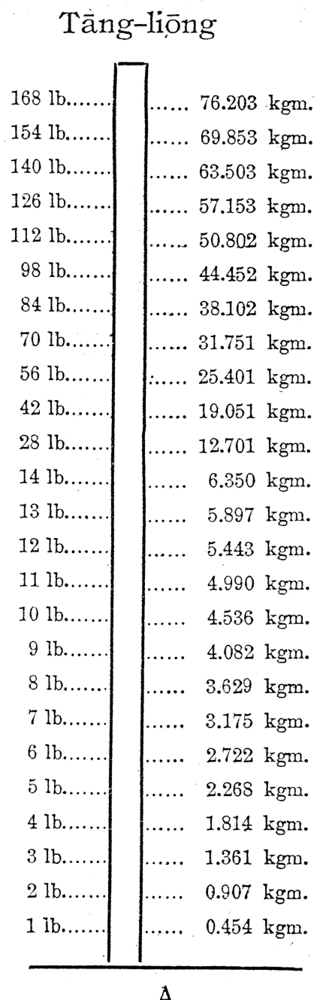
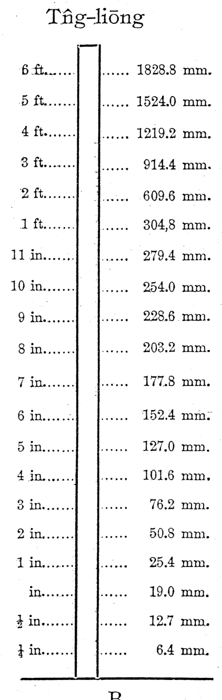
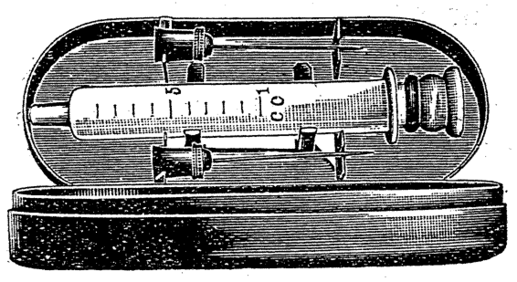
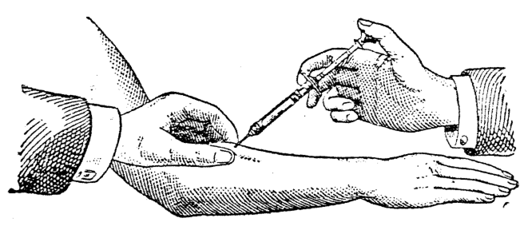
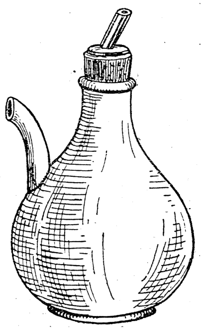
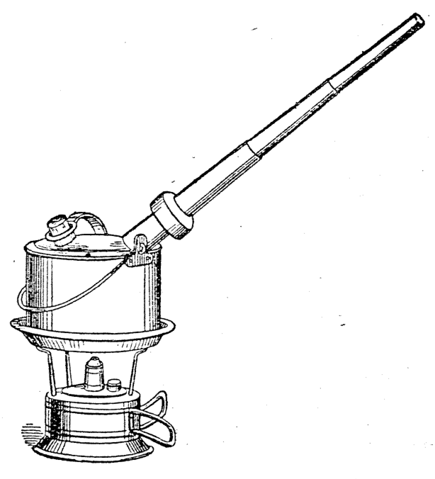
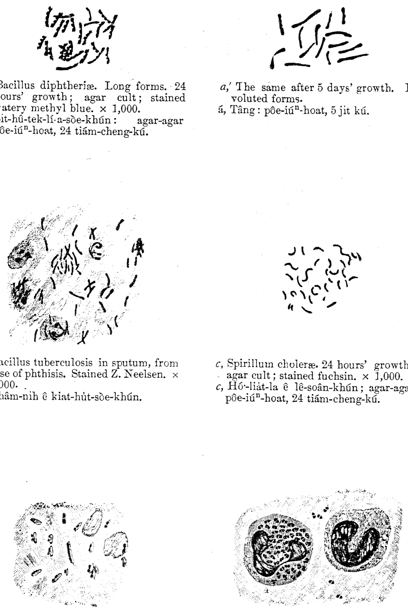

# 第二十一章 發藥互病人 (Hoat Ióh hō͘ Pīⁿ-lâng)

> **所屬篇章**：第二篇 普通看護學 (Phó͘-thong Khàn-hō͘-ha̍k)
> **原書頁碼**：第 295 頁 ～ 第 321 頁 (已收錄 27/27 頁)

---

<!-- Page 295 Start -->
#### 📖 原書第 295 頁

### TĒ 21 CHIUⁿ
### HOAT IÓH HŌ͘ PĪⁿ-LÂNG

**[Niû ióh khin tāng ê hoat-tō͘]**  
Lâng ài ha̍k-si̍p khàn-hō͘ ê sū, tiòh lióh-á bat sǹg ê hoat-tō͘, kap chai ta̍k hāng chhìn, niû, phêng, téng, hit hō. Ōe hiáu-tit pí-kàu lâi sǹg, ū-sî in-ūi beh chiong ióh pun chòe kúi hūn, á-sī beh ke kiám hō͘ i khah kāu, á-sī khah pỏh. Che lóng tiòh ōe bêng-pe̍k chiah hó. Siat-sú bōe hiáu-tit chit ê ì-sù, chiū oh-tit sìn-jīm-tit, iā chin gâu gō͘ tāi-chì.

> **【全漢對照】**  
> **第 21 章**  
> **發藥予病人**  
> **［量藥輕重的方法］**  
> 人愛學習看護的事，著略仔識算的方法，佮知逐項秤、量、評等，彼號。會曉得比較來算，有時因為欲將藥分做幾份，抑是欲加減予伊較厚，抑是較薄。這攏著會明白才好。設使袂曉得這個意思，就很得信任得，也真𠢕誤代誌。

---

**[Cha̍p-chìn-hoat]**  
Cha̍p-chìn-hoat, (十進法, *Decimal system*) : Kūn-lâi sè-kài ê kok chiām-chiām sêng-jīn. In-ūi sǹg hoat khah lī-piān. Niû ióh ê hoat-tō͘, lâng iā chiām-chiām teh ēng chit hō hoat ; in-ūi án-ni khàn-hō͘ tiòh tāi-liók chai. Chit hō hoat sī Hoat-kok tī Chú-āu 1801 nî, seng hoat-bêng. I chiong tē-kiû, tùi pak-kék kàu tē-kiû chhek-tō ê chi̍t chheng-bān ê chi̍t hūn, chòe chi̍t-ê toaⁿ-ūi (單位, *unit*), kiò chòe bí-tút (米突, *metre*). Āu-lâi lâng khah chim-chiok sǹg chiū chai bô tú-tú tióh. Hiān-kim tī Pa-lí ēng chi̍t ki pán, ēng *iridio-platinum* chòe-ê, tú-tú chi̍t bí-tút ê tng.

> **【全漢對照】**  
> **［十進法］**  
> 十進法（十進法，*Decimal system*）：近來世界的國漸漸承認。因為算法較利便。量藥的方法，人也漸漸咧用這號法；因為按呢看護著大概知。這號法是法國佇主後 1801 年，先發明。伊將地球，對北極到地球赤道的一千萬的一份，做一個單位（單位，*unit*），叫做米突（米突，*metre*）。後來人較斟酌算就知無拄拄著。現今佇巴黎用一支板，用 *iridio-platinum* 做的，拄拄一米突的長。

---

**[Metre / Centi-metre / Milli-metre]**  
Chi̍t bí-tút sī Ji̍t-pún chhùn 3 chhioh 3 chhùn. Chi̍t bí-tút ê chi̍t pah-hūn-chi̍t, kiò-chòe chi̍t pah-hūn-bí-tút (*centimetre*, *cm.*). Chi̍t *centimetre* ê cha̍p-hūn-chi̍t, kiò-chòe chi̍t chheng-hūn-bí-tút (*milimetre*, *mm.*), chiū-sī chi̍t bí-tút ê chheng-hūn-chit.

> **【全漢對照】**  
> **［米突 / 厘米突 / 毫米突］**  
> 一米突是日本寸 3 尺 3 寸。一米突的一百分之一，叫做一百分米突（*centimetre*，*cm.*）。一 *centimetre* 的十分之一，叫做一千分米突（*milimetre*，*mm.*），就是一米突的千分之一。

---

**[Gramme]**  
Nā ū chi̍t ê khoeh-á chhim chi̍t pah-hūn-bí-tút, khoah kap tng iā sī án-ni. Ēng chúi (4° C.) piàⁿ kàu móa, sī tú-tú li̍p-hong-pah-hūn-bí-tút (chit *cubic centimetre*, ū-sî kiò si-sī *c.c.*). Chit ê chúi sī chi̍t *gramme*, (*grm.*) ê tāng chiū-sī chi̍t óa (瓦).

> **【全漢對照】**  
> **［公克］**  
> 若有一個屐仔深一百分米突，闊佮長也是按呢。用水（4° C.）漩到滿，是拄拄立方百分米突（一 *cubic centimetre*，有時叫西西 *c.c.*）。這個水是一 *gramme*（*grm.*）的重就是一瓦（瓦）。

<!-- Page 295 End -->

---

<!-- Page 296 Start -->
#### 📖 原書第 296 頁

### TÙI-CHIÒ PIÓ

Ē-bīn tāi-lio̍k ū pâi-lia̍t thang tùi-chiò :

| | | | |
|---|---|---|---|
| Ji̍t-pún, 1 hun | = 3 mm. | Ji̍t-pún 1 momme (匁) | = 3.75 grm. |
| ,, 1 chhùn | = 3 cm. | ,, 160 momme = 1 kun (斤) | = 1.32 pōng = 600 grm. |
| ,, 33 chhùn | = 1 M. | Eng-kok 1 pōng | = 453.59 grm. |

> **【全漢對照】**
> ### 對照表
> 
> 下面大略有排列通對照：
> 
> | | | | |
> |---|---|---|---|
> | 日本，1 分 | = 3 mm. | 日本 1 匁 | = 3.75 grm. |
> | 〃 1 寸 | = 3 cm. | 〃 160 匁 = 1 斤 | = 1.32 磅 = 600 grm. |
> | 〃 33 寸 | = 1 M. | 英國 1 磅 | = 453.59 grm. |

---

### [簡字對照]

Ē-bīn ū pâi-lia̍t kán-jī ê tùi-chiò, sī phó͘-thong teh ēng--ê :

* _Mètre_ (bí-tút) ... ... M.
* _Centimetre_ (chit pah-hūn-bí-tút) ... ... cm.
* _Millimetre_ (chit chheng-hūn-bí-tút) ... ... mm.
* _Cubic centimetre_ (li̍p-hong-pah-hūn-bí-tút) ... ... c.c.
* _Litre_ (chit chheng c.c.) ... ... L.
* _Gramme_ (óa) ... ... grm.
* _Kilogramme_ (chit chheng-óa) ... ... K.

> **【全漢對照】**
> 下面有排列簡字的對照，是普通咧用的：
> 
> * _Mètre_（米突） ... ... M.
> * _Centimetre_（一百份米突） ... ... cm.
> * _Millimetre_（一千份米突） ... ... mm.
> * _Cubic centimetre_（立方百分米突） ... ... c.c.
> * _Litre_（一千 c.c.） ... ... L.
> * _Gramme_（瓦） ... ... grm.
> * _Kilogramme_（一千瓦） ... ... K.

---

### [平常物之重量佮所貯水之額數]

Ē-bīn tāi-lio̍k ū pâi-lia̍t pêng-siông mi̍h ê tāng-liōng kap só͘ tóe chúi ê gia̍h-sò͘.

* Thng-sî (chhé-ûn) = 20 c.c.
* Sòe tè óaⁿ ,, = 350 c.c.
* Au-á ,, = 60 c.c.
* Chhàu-iû-tháng = 2,0000 c.c. chiū-sī 20 L.

> **【全漢對照】**
> 下面大略有排列平常物的重量佮所貯水的額數。
> 
> * 湯匙（匙勻） = 20 c.c.
> * 細塊碗 〃 = 350 c.c.
> * 甌仔 〃 = 60 c.c.
> * 臭油桶 = 20,000 c.c. 就是 20 L.

---

### [用日本銀角佮銅錢通對照]

Ēng ji̍t-pún gûn-kak kap tâng-chîⁿ thang tùi-chiò :

* 50 sen (1917 nî-ê) = 10.2 grm.
* 10 sen (1917 nî-ê) = 2.3 grm.
* 1 sen (1917 nî-ê) = 3.8 grm.
* ½ sen (1917 nî-ê) = 2.1 grm.

> **【全漢對照】**
> 用日本銀角佮銅錢通對照：
> 
> * 50 錢（1917 年的） = 10.2 grm.
> * 10 錢（1917 年的） = 2.3 grm.
> * 1 錢（1917 年的） = 3.8 grm.
> * ½ 錢（1917 年的） = 2.1 grm.

---

### Chúi-liōng phêng-hoat: cha̍p-chìn-hoat (_Metric_) kap Eng-kok-ê (_Imperial_) tùi-chiò :

_Approximate Imperial Equivalents of Metric Measures of Capacity_

| Metric | Imperial | Metric | Imperial | Metric | Imperial |
|:---|:---|:---|:---|:---|:---|
| 1 c.c. | 17 (16.9) min. | 20 c.c. | 5 fl. dr. 38 min. | 125 c.c. | 4 fl. oz., 3 fl. dr., 12 min. |
| 2 c.c. | 33⅘ min. | 25 c.c. | 7 fl. dr. 2 min. | 150 c.c. | 5 fl. oz., 2 fl. dr., 15 min. |
| 3 c.c. | 50⅔ min. | 30 c.c. | 8 fl. dr. 27 min. | 200 c.c. | 7 fl. oz., 0 fl. dr., 20 min. |
| 4 c.c. | 1 fl. dr. 7 min. | 40 c.c. | 1 fl. oz., 3 fl. dr., 16 min. | 300 c.c. | 10 fl. oz., 4 fl. dr., 30 min. |
| 5 c.c. | 1 fl. dr. 24 min. | 50 c.c. | 1 fl. oz., 6 fl. dr., 5 min. | 500 c.c. | 17 fl. oz., 4 fl. dr., 50 min. |
| 6 c.c. | 1 fl. dr. 41 min. | 75 c.c. | 2 fl. oz., 5 fl. dr., 7 min. | 1 litre | 35 fl. oz., 1 fl. dr., 34 min. |
| 7 c.c. | 1 fl. dr. 58 min. | 100 c.c. | 3 fl. oz., 4 fl. dr., 10 min. | | |
| 8 c.c. | 2 fl. dr. 15 min. | | | | |
| 9 c.c. | 2 fl. dr. 32 min. | | | | |
| 10 c.c. | 2 fl. dr. 49 min. | | | | |
| 12.5 c.c. | 3 fl. dr. 31 min. | | | | |
| 15 c.c. | 4 fl. dr. 13 min. | | | | |

> **【全漢對照】**
> ### 水量衡量法：十進法（_Metric_）佮英國的（_Imperial_）對照：
> 
> _容量公制與英制概略對照表_
> 
> （數據內容同上表）

<!-- Page 296 End -->

---

<!-- Page 297 Start -->
#### 📖 原書第 297 頁

### 280 HOAT IÒH HŌ͘ PĪⁿ-LÂNG

#### Tāng-liōng phêng-hoat: cha̍p-chìn-hoat kap Eng-kok-ê tùi-chiò:

*Approximate Imperial Equivalents of Metric Measures of Mass*

| Metric | Imperial | Metric | Imperial | Metric | Imperial |
| :--- | :--- | :--- | :--- | :--- | :--- |
| 1 mgm. | $\frac{1}{64}$ gr. | 15 cgm. | $2\frac{1}{4}$ grains | 10 gm. | $154\frac{1}{3}$ grains |
| 2 mgm. | $\frac{1}{33}$ gr. | 20 cgm. | 3 grains | 15 gm. | $231\frac{1}{2}$ grains |
| 3 mgm. | $\frac{1}{21}$ gr. | 26 cgm. | 4 grains | 20 gm. | $308\frac{2}{3}$ grains |
| 4 mgm. | $\frac{1}{16}$ gr. | 30 cgm. | $4\frac{1}{2}$ grains | 30 gm. | 1 oz. $25\frac{1}{2}$ grains |
| 5 mgm. | $\frac{1}{13}$ gr. | 40 cgm. | $6\frac{1}{4}$ grains | 40 gm. | 1 oz. $179\frac{1}{2}$ grains |
| 6.5 mgm. | $\frac{1}{10}$ gr. | 50 cgm. | $7\frac{3}{4}$ grains | 50 gm. | 1 oz. 334 grains |
| 8 mgm. | $\frac{1}{8}$ gr. | 75 cgm. | $11\frac{1}{2}$ grains | 75 gm. | 2 oz. $282\frac{1}{2}$ grains |
| 1 cgm. | $\frac{1}{6}$ gr. | 1 gm. | $15\frac{1}{2}$ (15.432)gr. | 100 gm. | 3 oz. $230\frac{3}{4}$ grains |
| 2 cgm. | $\frac{1}{3}$ gr. | 2 gm. | $30\frac{7}{8}$ grains | 150 gm. | 5 oz. $127\frac{1}{2}$ grains |
| 3 cgm. | $\frac{1}{2}$ gr. | 3 gm. | $46\frac{1}{4}$ grains | 250 gm. | 8 oz. 358 grains |
| 5 cgm. | $\frac{3}{4}$ gr. | 4 gm. | $61\frac{3}{4}$ grains | 500 gm. | 1 lb. 1 oz. 278 gr. |
| 6.5 cgm. | 1 gr. | 5 gm. | $77\frac{1}{6}$ grains | 750 gm. | 1 lb. 10 oz. 200 gr. |
| 10 cgm. | $1\frac{1}{2}$ gr. | 7.5 gm. | $115\frac{3}{4}$ grains | 1 kgm. | 2 lb. 3 oz. 120 gr. |

> **【全漢對照】**
> ### 280 發藥予病人
> 
> #### 重量秤法：十進法及英國的對照：
> 
> *（公制質量與英制約略當量表）*
> 
> | 公制 (Metric) | 英制 (Imperial) | 公制 (Metric) | 英制 (Imperial) | 公制 (Metric) | 英制 (Imperial) |
> | :--- | :--- | :--- | :--- | :--- | :--- |
> | 1 mgm. | $\frac{1}{64}$ gr. | 15 cgm. | $2\frac{1}{4}$ grains | 10 gm. | $154\frac{1}{3}$ grains |
> | 2 mgm. | $\frac{1}{33}$ gr. | 20 cgm. | 3 grains | 15 gm. | $231\frac{1}{2}$ grains |
> | 3 mgm. | $\frac{1}{21}$ gr. | 26 cgm. | 4 grains | 20 gm. | $308\frac{2}{3}$ grains |
> | 4 mgm. | $\frac{1}{16}$ gr. | 30 cgm. | $4\frac{1}{2}$ grains | 30 gm. | 1 oz. $25\frac{1}{2}$ grains |
> | 5 mgm. | $\frac{1}{13}$ gr. | 40 cgm. | $6\frac{1}{4}$ grains | 40 gm. | 1 oz. $179\frac{1}{2}$ grains |
> | 6.5 mgm. | $\frac{1}{10}$ gr. | 50 cgm. | $7\frac{3}{4}$ grains | 50 gm. | 1 oz. 334 grains |
> | 8 mgm. | $\frac{1}{8}$ gr. | 75 cgm. | $11\frac{1}{2}$ grains | 75 gm. | 2 oz. $282\frac{1}{2}$ grains |
> | 1 cgm. | $\frac{1}{6}$ gr. | 1 gm. | $15\frac{1}{2}$ (15.432)gr. | 100 gm. | 3 oz. $230\frac{3}{4}$ grains |
> | 2 cgm. | $\frac{1}{3}$ gr. | 2 gm. | $30\frac{7}{8}$ grains | 150 gm. | 5 oz. $127\frac{1}{2}$ grains |
> | 3 cgm. | $\frac{1}{2}$ gr. | 3 gm. | $46\frac{1}{4}$ grains | 250 gm. | 8 oz. 358 grains |
> | 5 cgm. | $\frac{3}{4}$ gr. | 4 gm. | $61\frac{3}{4}$ grains | 500 gm. | 1 lb. 1 oz. 278 gr. |
> | 6.5 cgm. | 1 gr. | 5 gm. | $77\frac{1}{6}$ grains | 750 gm. | 1 lb. 10 oz. 200 gr. |
> | 10 cgm. | $1\frac{1}{2}$ gr. | 7.5 gm. | $115\frac{3}{4}$ grains | 1 kgm. | 2 lb. 3 oz. 120 gr. |

---

#### Eng-kok 1 *grain* ê hun-sò͘ kap cha̍p-chìn-hoat ê tùi-chiò. Tùi 1 *grain* chì 1/1000 *grain*.

*Equivalents of Imperial and Metric Measures of Mass*  
**FRACTIONS OF A GRAIN**  
*From 1 grain to 1/1000 of a grain*

| Imperial | Metric | Imperial | Metric | Imperial | Metric |
| :--- | :--- | :--- | :--- | :--- | :--- |
| gr. 1 | 0.065 gm. | gr. 1/20 | 0.0032 gm. | gr. 1/120 | 0.00054 gm. |
| gr. 3/4 | 0.049 gm. | gr. 1/24 | 0.0027 gm. | gr. 1/130 | 0.0005 gm. |
| gr. 2/3 | 0.043 gm. | gr. 1/25 | 0.0026 gm. | gr. 1/150 | 0.00043 gm. |
| gr. 1/2 | 0.032 gm. | gr. 1/30 | 0.0022 gm. | gr. 1/180 | 0.00036 gm. |
| gr. 1/3 | 0.022 gm. | gr. 1/32 | 0.0012 gm. | gr. 1/200 | 0.00032 gm. |
| gr. 1/4 | 0.016 gm. | gr. 1/40 | 0.0016 gm. | gr. 1/240 | 0.00027 gm. |
| gr. 1/5 | 0.013 gm. | gr. 1/50 | 0.0013 gm. | gr. 1/250 | 0.00026 gm. |
| gr. 1/6 | 0.011 gm. | gr. 1/60 | 0.00108 gm. | gr. 1/300 | 0.00022 gm. |
| gr. 1/7 | 0.009 gm. | gr. 1/64 | 0.001 gm. | gr. 1/400 | 0.00016 gm. |
| gr. 1/8 | 0.008 gm. | gr. 1/70 | 0.00093 gm. | gr. 1/500 | 0.00013 gm. |
| gr. 1/10 | 0.0065 gm. | gr. 1/75 | 0.00086 gm. | gr. 1/600 | 0.00011 gm. |
| gr. 1/12 | 0.0054 gm. | gr. 1/80 | 0.00081 gm. | gr. 1/640 | 0.0001 gm. |
| gr. 1/15 | 0.0043 gm. | gr. 1/96 | 0.00067 gm. | gr. 1/750 | 0.00009 gm. |
| gr. 1/16 | 0.004 gm. | gr. 1/100 | 0.00065 gm. | gr. 1/1000 | 0.00006 gm. |

> **【全漢對照】**
> #### 英國 1 *grain* 的分數及十進法的對照。對 1 *grain* 至 1/1000 *grain*。
> 
> *（英制與公制質量當量表：GRAIN 之分數，自 1 grain 至 1/1000 grain）*
> 
> | 英制 (Imperial) | 公制 (Metric) | 英制 (Imperial) | 公制 (Metric) | 英制 (Imperial) | 公制 (Metric) |
> | :--- | :--- | :--- | :--- | :--- | :--- |
> | gr. 1 | 0.065 gm. | gr. 1/20 | 0.0032 gm. | gr. 1/120 | 0.00054 gm. |
> | gr. 3/4 | 0.049 gm. | gr. 1/24 | 0.0027 gm. | gr. 1/130 | 0.0005 gm. |
> | gr. 2/3 | 0.043 gm. | gr. 1/25 | 0.0026 gm. | gr. 1/150 | 0.00043 gm. |
> | gr. 1/2 | 0.032 gm. | gr. 1/30 | 0.0022 gm. | gr. 1/180 | 0.00036 gm. |
> | gr. 1/3 | 0.022 gm. | gr. 1/32 | 0.0012 gm. | gr. 1/200 | 0.00032 gm. |
> | gr. 1/4 | 0.016 gm. | gr. 1/40 | 0.0016 gm. | gr. 1/240 | 0.00027 gm. |
> | gr. 1/5 | 0.013 gm. | gr. 1/50 | 0.0013 gm. | gr. 1/250 | 0.00026 gm. |
> | gr. 1/6 | 0.011 gm. | gr. 1/60 | 0.00108 gm. | gr. 1/300 | 0.00022 gm. |
> | gr. 1/7 | 0.009 gm. | gr. 1/64 | 0.001 gm. | gr. 1/400 | 0.00016 gm. |
> | gr. 1/8 | 0.008 gm. | gr. 1/70 | 0.00093 gm. | gr. 1/500 | 0.00013 gm. |
> | gr. 1/10 | 0.0065 gm. | gr. 1/75 | 0.00086 gm. | gr. 1/600 | 0.00011 gm. |
> | gr. 1/12 | 0.0054 gm. | gr. 1/80 | 0.00081 gm. | gr. 1/640 | 0.0001 gm. |
> | gr. 1/15 | 0.0043 gm. | gr. 1/96 | 0.00067 gm. | gr. 1/750 | 0.00009 gm. |
> | gr. 1/16 | 0.004 gm. | gr. 1/100 | 0.00065 gm. | gr. 1/1000 | 0.00006 gm. |

<!-- Page 297 End -->

---

<!-- Page 298 Start -->
#### 📖 原書第 298 頁

### TUÌ-CHIÒ PIÓ 281

Eng-kok 1 *grain* ê pōe-sò͘ kap cha̍p-chìn-hoat ê tuì-chiò. Tuì 1 *grain* chì 1 *ounce*.

> **【全漢對照】**
> ### 對照表 281
> 
> 英國 1 grain 的倍數及十進法的對照。對 1 grain 至 1 ounce。

---

#### MULTIPLES OF A GRAIN
#### From 1 grain to 1 ounce

| Imperial | Metric | Imperial | Metric | Imperial | Metric |
| :--- | :--- | :--- | :--- | :--- | :--- |
| gr. 1 | 0.065 gm. | gr. 6 | 0.389 gm. | gr. 35 | 2.268 gm. |
| gr. 1¼ | 0.081 gm. | gr. 7 | 0.454 gm. | gr. 40 | 2.592 gm. |
| gr. 1⅓ | 0.086 gm. | gr. 8 | 0.518 gm. | gr. 50 | 3.24 gm. |
| gr. 1½ | 0.097 gm. | gr. 8¾ | 0.567 gm. | gr. 60 | 3.89 gm. |
| gr. 1¾ | 0.113 gm. | gr. 9 | 0.583 gm. | gr. 80 | 5.184 gm. |
| gr. 2 | 0.13 gm. | gr. 10 | 0.648 gm. | gr. 120 | 7.78 gm. |
| gr. 2½ | 0.162 gm. | gr. 12 | 0.778 gm. | oz. ⅛ | 3.54 gm. |
| gr. 3 | 0.194 gm. | gr. 15 | 0.972 gm. | oz. ¼ | 7.08 gm. |
| gr. 3½ | 0.227 gm. | gr. 18 | 1.166 gm. | oz. ½ | 14.17 gm. |
| gr. 4 | 0.259 gm. | gr. 20 | 1.296 gm. | dr. 4 | 15.55 gm. |
| gr. 4½ | 0.292 gm. | gr. 25 | 1.620 gm. | oz. 1 | 28.35 gm. |
| gr. 5 | 0.324 gm. | gr. 30 | 1.944 gm. | dr. 8 | 31.1 gm. |

---

### Chuí-liōng phêng-hoat

Chuí-liōng phêng-hoat: Eng-kok (*Imperial*) kap cha̍p-chìn-hoat (*Metric*) ê tuì-chiò. Tuì ½ *minim* chì *fluid ounce*.

> **【全漢對照】**
> ### 水量秤法
> 
> 水量秤法：英國（Imperial）及十進法（Metric）的對照。對 ½ minim 至 fluid ounce。

---

#### Equivalents of Imperial and Metric Measures of Capacity
#### From half-a-minim to 1 fluid ounce

| Imperial | Metric | Imperial | Metric | Imperial | Metric |
| :--- | :--- | :--- | :--- | :--- | :--- |
| min. ⅛ | 0.007 c.c. | min. 7 | 0.414 c.c. | min. 40 | 2.368 c.c. |
| min. ¼ | 0.015 c.c. | min. 8 | 0.474 c.c. | min. 50 | 2.96 c.c. |
| min. ½ | 0.03 c.c. | min. 9 | 0.533 c.c. | min. 60 | 3.55 c.c. |
| min. ¾ | 0.044 c.c. | min. 10 | 0.592 c.c. | min. 60 | 5.33 c.c. |
| min. 1 | 0.059 c.c. | min. 12 | 0.71 c.c. | min. 120 | 7.1 c.c. |
| min. 2 | 0.118 c.c. | min. 15 | 0.888 c.c. | min. 180 | 10.65 c.c. |
| min. 3 | 0.178 c.c. | min. 20 | 1.184 c.c. | min. 240 | 14.21 c.c. |
| min. 4 | 0.237 c.c. | min. 25 | 1.479 c.c. | min. 300 | 17.76 c.c. |
| min. 5 | 0.296 c.c. | min. 30 | 1.776 c.c. | min. 360 | 21.31 c.c. |
| min. 6 | 0.355 c.c. | min. 35 | 2.072 c.c. | min. 480 | 28.42 c.c. |

---

### [Lio̍k-jī kap Hû-hō Biâu-su̍t / 略字及符號描述]

Min., minim ; fl. dr., fluid drachm ; fl. oz., fluid ounce ; gr., grain ; oz. ounce ; dr. drachm.

> **【全漢對照】**
> Min. 即 minim；fl. dr. 即 fluid drachm；fl. oz. 即 fluid ounce；gr. 即 grain；oz. 即 ounce；dr. 即 drachm。

<!-- Page 298 End -->

---

<!-- Page 299 Start -->
#### 📖 原書第 299 頁

  <figure style="display: inline-block; margin: 12px; max-width: 90%; text-align: center;">
    
    <figcaption style="font-size: 14px; color: #4a5568; margin-top: 6px;"><em>A. — Eng-kok-pōng kap chap-chìn-hoat ê tùi-chiò-pió.</em></figcaption>
  </figure>
  <figure style="display: inline-block; margin: 12px; max-width: 90%; text-align: center;">
    
    <figcaption style="font-size: 14px; color: #4a5568; margin-top: 6px;"><em>B. — Eng-kok-chhioh kap chap-chìn-hoat ê tùi-chiò-pió.</em></figcaption>
  </figure>

282  
**HOAT IÓH HÕ͘ PĪⁿ-LÂNG**

---

### Tāng-liōng / Tn̂g-liōng

| Tāng-liōng (重量) | | | Tn̂g-liōng (長量) | |
| :--- | :--- | :--- | :--- | :--- |
| 168 lb....... | ...... 76.203 kgm. | | 6 ft....... | ...... 1828.8 mm. |
| 154 lb....... | ...... 69.853 kgm. | | 5 ft....... | ...... 1524.0 mm. |
| 140 lb....... | ...... 63.503 kgm. | | 4 ft....... | ...... 1219.2 mm. |
| 126 lb....... | ...... 57.153 kgm. | | 3 ft....... | ...... 914.4 mm. |
| 112 lb....... | ...... 50.802 kgm. | | 2 ft....... | ...... 609.6 mm. |
| 98 lb....... | ...... 44.452 kgm. | | 1 ft....... | ...... 304.8 mm. |
| 84 lb....... | ...... 38.102 kgm. | | 11 in....... | ...... 279.4 mm. |
| 70 lb....... | ...... 31.751 kgm. | | 10 in....... | ...... 254.0 mm. |
| 56 lb....... | ...... 25.401 kgm. | | 9 in....... | ...... 228.6 mm. |
| 42 lb....... | ...... 19.051 kgm. | | 8 in....... | ...... 203.2 mm. |
| 28 lb....... | ...... 12.701 kgm. | | 7 in....... | ...... 177.8 mm. |
| 14 lb....... | ...... 6.350 kgm. | | 6 in....... | ...... 152.4 mm. |
| 13 lb....... | ...... 5.897 kgm. | | 5 in....... | ...... 127.0 mm. |
| 12 lb....... | ...... 5.443 kgm. | | 4 in....... | ...... 101.6 mm. |
| 11 lb....... | ...... 4.990 kgm. | | 3 in....... | ...... 76.2 mm. |
| 10 lb....... | ...... 4.536 kgm. | | 2 in....... | ...... 50.8 mm. |
| 9 lb....... | ...... 4.082 kgm. | | 1 in....... | ...... 25.4 mm. |
| 8 lb....... | ...... 3.629 kgm. | | ¾ in....... | ...... 19.0 mm. |
| 7 lb....... | ...... 3.175 kgm. | | ½ in....... | ...... 12.7 mm. |
| 6 lb....... | ...... 2.722 kgm. | | ¼ in....... | ...... 6.4 mm. |
| 5 lb....... | ...... 2.268 kgm. | | | |
| 4 lb....... | ...... 1.814 kgm. | | | |
| 3 lb....... | ...... 1.361 kgm. | | | |
| 2 lb....... | ...... 0.907 kgm. | | | |
| 1 lb....... | ...... 0.454 kgm. | | | |
| **A** | | | **B** | |

> **【全漢對照】**
> （重量 / 長量 單位對照刻度表：A 表為英磅與公斤；B 表為英尺/英吋與公釐）

---

### A.

A. — Eng-kok-pōng kap cha̍p-chìn-hoat ê tùi-chiò-pió.

> **【全漢對照】**
> A. — 英國磅佮十進法的對照表。

---

### B.

B. — Eng-kok-chhioh kap cha̍p-chìn-hoat ê tùi-chiò-pió.

> **【全漢對照】**
> B. — 英國尺佮十進法的對照表。

---

lb., pōng; kgm., kilogramme; ft., chhioh; in., chhùn; mm., millimetre.  
(Six tables from Wellcome's “Medical Diary.”)

> **【全漢對照】**
> lb., 磅; kgm., kilogramme; ft., 尺; in., 寸; mm., millimetre.  
> (Six tables from Wellcome's “Medical Diary.”)

<!-- Page 299 End -->

---

<!-- Page 300 Start -->
#### 📖 原書第 300 頁

### IÓH KHIP-SIU Ê CHOK-IŌNG, KÍN BĀN（283）

**[側註：Ióh khip-siu ê lō͘]**  
Chhòng ióh hō͘ pīⁿ-lâng ū chin chōe ê hoat-tō͘. Ióh nā khip-siu tī huih-nih ū kúi-nā tiâu lō͘, chiū-sī pâi-lia̍t tī ē-tóe:
1. Tùi chhùi chia̍h.
2. Tùi ti̍t-tn̂g koàn-ji̍p.
3. Chù-siā tī chēng-me̍h-kńg-lāi, kap phê-ē-kiat-tè-chit-lāi.
4. Tùi phê-hu.
5. Tùi hì-chōng khip-ji̍p.
6. Tùi im-tō koàn-ji̍p; tùi jiō-tō, phông-kong; chhùi sóa-kháu; ba̍k-chiu, hī-á, phīⁿ-khang.

> **【全漢對照】**
> **[側註：藥吸收的路]**  
> 創藥予病人有真多的法度。藥若吸收佇血裡有幾若條路，就是排列佇底下：  
> 1. 對嘴食。  
> 2. 對直腸灌入。  
> 3. 注射佇靜脈管內，佮皮下結締質內。  
> 4. 對皮膚。  
> 5. 對肺臟吸入。  
> 6. 對陰道灌入；對尿道、膀胱；嘴洗口；目睭、耳仔、鼻孔。

---

**[側註：Ióh khip-siu ê chok-iōng]**  
Ū chi̍t khoán ê ióh chí-ū ōe kám-tōng tāi-seng kàu ê só͘-chāi, chhin-chhiūⁿ tùi gōa-bīn lâi kô, chiū ōe kám-tōng phê, tùi chhùi chia̍h-ê chiū ōe kám-tōng ūi kap tn̂g ê liām-mo̍h. Chóng-sī tē it chōe-ê, sī khip-siu tī huih-nih, koh tùi huih-nih kiâⁿ kàu ta̍k ūi kiat-tè-chit, kun-bah ê só͘-chāi, jiân-āu chiah tī hit ê ū pīⁿ ê ūi kìⁿ-chhut kong-hāu. Lūn kàu chit khoán ê ióh, kong-hāu ê tōa sió, sī khòaⁿ hit ê huih khip-siu ê sî, kín á-sī bān.

> **【全漢對照】**
> **[側註：藥吸收的作用]**  
> 有一款的藥只有會感動代先到的所在，親像對外面來膏，就會感動皮，對嘴食的就會感動胃佮腸的黏膜。總視第一多的，是吸收佇血裡，擱對血裡行到逐位結締質、筋肉的所在，然後才佇彼個有病的位見出功效。論到這款的藥，功效的大細，是看彼個血吸收的時，緊抑是慢。

---

Ióh khip-siu tī seng-khu-lāi ū koan-hē tī ē-bīn só͘ kì-ê:
1. Chiàu ióh hē tī pō͘-ūi ê hun-pia̍t.
2. Huih sûn-khoân ê khoán-sit.
3. Ióh iûⁿ-kái-sèng (溶解性, solubility).
4. Ióh thàu-kè liām-mo̍h ê chok-iōng.

> **【全漢對照】**
> 藥吸收佇身軀內有關係佇下面所記的：  
> 1. 照藥放置部位的分別。  
> 2. 血循環的款式。  
> 3. 藥溶解性（溶解性, solubility）。  
> 4. 藥透過黏膜的作用。

---

**[側註：Ióh khip-siu ê kín bān]**  
Chù-siā tī chēng-me̍h-lāi sī siāng kín, chóng-sī chit ê hoat-tō͘ sī kan-ta i-seng teh chòe-ê. Tē jī sī tī phê-ē-kiat-tè-chit-lāi. Nā án-ni kè gō͘ hun-cheng-kú chiū kìⁿ-chhut kong-hāu. Tùi chhùi chia̍h sī khah bān, tùi ti̍t-tn̂g koh khah bān. Tùi hì-chōng sī khah kín, in-ūi hì-chōng-lāi m̂g-sòe-huih-kńg chin chōe.

> **【全漢對照】**
> **[側註：藥吸收的緊慢]**  
> 注射佇靜脈內是上緊，總是這個法度是干單醫生咧做的。第二是佇皮下結締質內。若按呢過五分鐘久就見出功效。對嘴食是較慢，對直腸擱較慢。對肺臟是較緊，因為肺臟內毛細血管真多。

---

### [附註 / 頁尾警語]

Nā bē chiong ióh hō͘ pīⁿ-lâng chia̍h, m̄-thang kóng ū chia̍h. Kan-ta hē ióh tī sin-piⁿ bô kàu-gia̍h; tio̍h khòaⁿ i sit-chāi ū chia̍h á-bô.

> **【全漢對照】**
> 若未將藥予病人食，毋通講有食。干單放置藥佇身邊無夠額；著看伊實在有食抑無。

<!-- Page 300 End -->

---

<!-- Page 301 Start -->
#### 📖 原書第 301 頁

### HOAT IÓH HŌ͘ PĪⁿ-LÂNG

#### [Ióh khip-siu ê sî-kan]
Nā tùi chhùi chia̍h kàu ūi, tióh 20 hun-cheng-āu, chiah ē kìⁿ-chhut kong-hāu. Tùi tit-t̂ng ji̍p tióh 45 hun-cheng-āu, chiah ū hāu-iōng. Bē chia̍h ê tāi-seng lâi chia̍h ióh, pí chia̍h-pá, khah khoài khip-siu, in-ūi ūi-ni̍h bô si̍t-bu̍t chó͘-keh i teh kiâⁿ kàu ūi ê liâm-mo̍h. Nā pīⁿ tāng, huih sûn-khoân chiū khah bān, liâm-mo̍h bē thang chiàu pêng-sî ê chok-iōng, ióh khip-siu chiū khah bān. Ióh-hún kap ióh-oân khah bān, in-ūi tī ūi-t̂ng-ni̍h tióh thèng-hāu iûⁿ-kái.

> **【全漢對照】**
> **[藥吸收的時間]**
> 若對嘴食到胃，著 20 分鐘後，才會看出功效。對直腸入著 45 分鐘後，才有效用。未食的代先來食藥，比食飽，較快吸收，因為胃裡無食物阻隔伊咧行到胃的黏膜。若病重，血循環就較慢，黏膜袂通照平時的作用，藥吸收就較慢。藥粉佮藥丸較慢，因為佇胃腸裡著聽候溶解。

---

#### [Kui-chek]
Hoat ióh hō͘ pīⁿ-lâng ê kui-chek :

> **【全漢對照】**
> **[規則]**
> 發藥予病人的規則：

---

#### 1. [To̍k-ióh]
1. Ū to̍k ê ióh, m̄-thang hē kap bô to̍k ê ióh siāng chi̍t só͘-chāi. Chhat ê ióh kap chia̍h ê ióh iā sī án-ni. Iàu-kín tióh kì-tit, hoān-nā ū to̍k ê ióh, m̄-thang hē tī pīⁿ-lâng bîn-chhn̂g-téng ê kè-á-ni̍h.

> **【全漢對照】**
> **[毒藥]**
> 1. 有毒的藥，毋通下佮無毒的藥同所在。擦的藥佮食的藥也是按呢。要緊著記得，凡若有毒的藥，毋通下佇病人眠床頂的架仔裡。

---

#### 2. [Ióh-tû tióh só]
2. Ióh-tû tióh sî-siông só-teh.

> **【全漢對照】**
> **[藥櫥著鎖]**
> 2. 藥櫥著時常鎖咧。

---

#### 3. [Chhėk hō͘ chiâu]
3. Kìⁿ-nā beh chhòng ióh-chúi hō͘ pīⁿ-lâng chia̍h ê sî, iàu-kín tióh tāi-seng chiong ióh-kan iô hō͘ i chiâu, in-ūi ióh ê goân-liāu, ū khin ū tāng. Chit ê lí-khì khàn-hō͘ èng-kai tióh chai. Ū-ê ióh-chúi ê lāi-bīn ū *bismuthum* ê ióh-hún, á-sī khah oh hòa, í-ki̍p hun-liōng tāng ê ióh-hún, koh khah iàu-kín tióh iô hō͘ chiâu-chiâu; koh tò lỏh poe-ni̍h ê sî, tióh liâm-piⁿ chia̍h, in-ūi che chin khoài tîm tóe.

> **【全漢對照】**
> **[揤予勻]**
> 3. 見若欲創藥水予病人食的時，要緊著代先將藥矸搖予伊勻，因為藥的原料，有輕有重。此個理氣看護應該著知。有的藥水的內面有 *bismuthum*（次硝酸鉍）的藥粉，抑是較惡化，以及份量重的藥粉，閣較要緊著搖予勻勻；閣倒落杯裡的時，著連鞭食，因為這真快沉底。

---

#### 4. [Phâng ióh ê pôaⁿ]
4. Tióh ēng chi̍t tè pôaⁿ-á, hē chi̍t tè niû-poe, chi̍t tè chúi-poe, chi̍t óaⁿ léng-kún-chúi, kap sóe chúi-poe ēng ê chúi chi̍t pôaⁿ, chi̍t tè chheng-khì pò͘. Nā hō͘ chi̍t-ê chia̍h liáu, tióh chiong tóe ióh ê poe sóe hō͘ chheng-khì, chhit hō͘ ta, chiah thang koh hō͘ pa̍t lâng chia̍h.

> **【全漢對照】**
> **[捧藥的盤]**
> 4. 著用一塊盤仔，下一塊量杯，一塊水杯，一碗冷滾水，佮洗水杯用的水一盤，一塊清潔布。若予一個食了，著將貯藥的杯洗予清潔，拭予焦，才通閣予別人食。

---

#### 5. [Tióh sóe poe]
5. Pīⁿ-lâng chia̍h liáu, só͘ ēng ê poe tióh sóe hō͘ chheng-khì; m̄-tān-nā in-ūi bô chheng-khì, iā kiaⁿ-liáu chiong hit hō thoân-jiám pīⁿ iáu-bē hián-chhut ê pīⁿ-lâng, só͘ ēng ê poe koh hō͘ pa̍t lâng ēng, sī gûi-hiám.

> **【全漢對照】**
> **[著洗杯]**
> 5. 病人食了，所用的杯著洗予清潔；毋但那是因為無清潔，也驚了將彼號傳染病猶未顯出的病人，所用的杯閣予別人用，是危險。

---

#### 6. [Thoân-jiám pīⁿ-ê]
6. Hoān ū thoân-jiám pīⁿ-ê, i só͘ ēng ê mi̍h-kiāⁿ, tiāⁿ-tióh sī lóng kap pa̍t lâng teh ēng-ê bô sio-siāng.

> **【全漢對照】**
> **[傳染病的]**
> 6. 凡有傳染病的，伊所用的物件，定著是攏佮別人咧用的無成樣（無相同）。

<!-- Page 301 End -->

---

<!-- Page 302 Start -->
#### 📖 原書第 302 頁

### HOAT IÓH Ê KUI-CHEK / 發藥的規則 (p. 285)

#### 7. 【著看藥標 / Tio̍h khòaⁿ ióh-phiau】

Ta̍k ê pīⁿ-lâng ê ióh-kan, lóng tio̍h tah ióh-phiau, chia̍h ióh it-khài ê hoat-tō͘ lóng tio̍h siá hit téng-bīn. Ta̍k pái hō͘ pīⁿ-lâng chia̍h ióh ê sî, tio̍h tāi-seng khòaⁿ ióh-phiau, chiah khòaⁿ sī hit hō ióh á m̄-sī, iā tio̍h khòaⁿ hit ê chia̍h ióh ê sî-kan, kap ióh ê hun-liōng ū ha̍p á-bô; iàu-kín m̄-thang thèng-hāu pīⁿ-lâng chia̍h ióh liáu-āu, chiah khòaⁿ ióh-phiau. Nā the̍h chi̍t hāng ióh, tāi-seng tio̍h khòaⁿ kan-á-phiau, kó-jiân sī lán só͘ beh ēng hit hāng ê jī á m̄-sī, chiah thang piàⁿ-chhut-lâi. Āu-lâi koh khòaⁿ chi̍t pái, chiah hoat hō͘ lâng, ū khòaⁿ kè nn̄g pái chiah ǹg-bāng bô chhò-gō͘.

> **【全漢對照】**
> 每一個病人的藥罐，攏著貼藥標，食藥一切的法度攏著寫彼頂面。逐擺予病人食藥的時，著代先看藥標，才看是彼號藥抑毋是，也著看彼個食藥的時間，佮藥的分量有合抑無；要緊毋通聽候病人食藥了後，才看藥標。若提一項藥，代先著看罐仔標，果然是咱所欲用彼項的字抑毋是，才通傾出嚟。後來閣看一擺，才發予人，有看過兩擺才要望無錯誤。

---

#### 8. 【無標無藥 / Bô phiau bô ióh】

Hoān-nā bē bat tah ióh-phiau ê kan-á, m̄-thang hō͘ lâng.

> **【全漢對照】**
> 凡若未曾貼藥標的罐仔，毋通予人。

---

#### 9. 【毋通量約 / M̄ thang liōng-io̍k】

Tio̍h sî-siông chiàu niû-poe niû, m̄-thang liōng-io̍k. Ióh-kan ū-ê ū keh hûn; chiàu i-seng hoan-hù ê gia̍h-sò͘, tio̍h chhòng hō͘ pīⁿ-lâng chia̍h; chiàu-liōng m̄-thang ke-thiⁿ, á-sī kiám-chió.

> **【全漢對照】**
> 著時常照量杯量，毋通量約。藥罐有的大隔痕；照醫生吩咐的額數，著創予病人食；照量毋通加添，抑是減少。

---

#### 10. 【滴的法毋好 / Tih ê hoat m̄-hó】

Niû ióh ê sî, m̄-thang chiong tih ê hoat, in-ūi ū tōa-sòe tih ê iān-kò͘. Phì-lūn 3.5 c.c. ê chúi ū 60 tih, *alcohol* (chiú) 146 tih, *chloroform* (bâ-chùi-ióh) 250 tih.

> **【全漢對照】**
> 量藥的時，毋通將滴的法，因為有大小滴的緣故。譬論 3.5 c.c. 的水有 60 滴，*alcohol*（酒）146 滴，*chloroform*（麻醉藥）250 滴。

---

#### 11. 【照時陣 / Chiàu sî-chūn】

Chia̍h ióh tio̍h chiàu sî-chūn; phì-lūn múi ji̍t chia̍h saⁿ pái; ngó͘-chêng 10 tiám, ngó͘-āu 2 tiám, 6 tiám. Nā-sī 7 tiám, 5 tiám khah lī-piān iā thang, chóng-sī iàu-kín m̄-thang bô chiàu-sî. Ū-sî i-seng hoan-hù tio̍h sì tiám, á-sī saⁿ tiám, kok chia̍h chi̍t pái, iû-goân tio̍h chiàu sî. Iā m̄-thang ka-kī phah-sǹg chi̍t pòaⁿ pái bô hō͘ i chia̍h bô iàu-kín.

> **【全漢對照】**
> 食藥著照時陣；譬論每日食三擺；午前 10 點，午後 2 點，6 點。若是 7 點，5 點較利便也通，總是要緊毋通無照時。有時醫生吩咐著四點，抑是三點，各食一擺，猶原著照時。也毋通家己打算一半擺無予伊食無要緊。

---

#### 12. 【暝時 / Mî-sî】

Chóng-sī mî-sî beh chhòng ióh hō͘ pīⁿ-lâng chia̍h tio̍h tāi-seng mn̄g i-seng thang kiò i chhíⁿ á m̄-thang. I-seng nā hoan-hù tio̍h, chiah thang, nā bô, chiū m̄-bián.

> **【全漢對照】**
> 總是暝時欲創藥予病人食著代先問醫生通叫伊醒抑毋通。醫生若吩咐著，才通，若無，就毋免。

---

Kah hù-bo̍k liáu, tio̍h sūn chńg-thâu-á ê sek, á-sī ū chéng bô.

> **【全漢對照】**
> 絞副木了，著順指頭仔的色，抑是有腫無。

<!-- Page 302 End -->

---

<!-- Page 303 Start -->
#### 📖 原書第 303 頁

## 286 HOAT IÒH HŌ͘ PĪⁿ-LÂNG

### [Gín-ná]

13\. Hō͘ gín-ná chia̍h iòh thâu chi̍t pái chòe iàu-kín, in-ūi nā thâu chi̍t pái bô hoat-tō͘, lâi hō͘ i kam-goān chia̍h-lo̍h-khì, jiân-āu ta̍k pái chia̍h iòh, chiū chin hùi-khì. Chi̍t hāng tio̍h hō͘ i chai m̄-chia̍h bōe-ēng-tit; chi̍t hāng tio̍h siūⁿ hoat-tō͘ bo̍h-tit hō͘ i hāu, hō͘ i chhá. Nā beh chhòng pháiⁿ chia̍h ê iòh hō͘ gín-ná chia̍h, m̄-thang kiáu gû-leng, iū-ūi i ē hiâm gû-leng pháiⁿ chia̍h; sòa bô beh chia̍h gû-leng. Tio̍h ēng tiⁿ ê lūi lâi kiáu, i chiū hoaⁿ-hí chia̍h.

> **【全漢對照】**
> 13\. 予囡仔食藥頭一擺做要緊，因為若頭一擺無法度，來予伊甘願食落去，然後逐擺食藥，就真費氣。一項著予伊知毋食袂用得；一項著想法度莫得予伊哮，予伊吵。若欲創歹食的藥予囡仔食，毋通攪牛奶，因為伊會嫌牛奶歹食；紲無欲食牛奶。著用甜的類來攪，伊就歡喜食。

---

### [Thîn iòh]

14\. Nā beh thîn iòh, iòh-phiau tio̍h ǹg téng-bīn, tî-hông iòh bián-tit bak-tio̍h iòh-phiau.

> **【全漢對照】**
> 14\. 若欲斟藥，藥標著向頂面，預防藥免得沃著藥標。

---

### [Iòh-hún]

15\. Iòh-hún tio̍h piàⁿ tī chi̍h-téng ê āu-bīn, ēng léng-kún-chúi phè, chiah thun-lo̍h-khì. Ū-sî thang ēng tiⁿ ê mi̍h pang-chān i thun. Nā khah pháiⁿ chia̍h ê iòh-hún, chiū tio̍h ēng pau iòh ê mī-phîⁿ pau-teh. Pau hō͘ chhin-chhiūⁿ sòe-á pau-á ê khoán, chiah hē tī tê-au-nīh léng-kún-chúi ê téng-bīn, chi̍t-ē chiū kā i thun-lo̍h-khì. Chit ê mī-phîⁿ nā ji̍p tī ūi-nīh sī khoài-khoài siau-iūⁿ ê mi̍h.

> **【全漢對照】**
> 15\. 藥粉著傾佇舌頂的後面，用冷滾水配，才吞落去。有時通用甜的物幫贊伊吞。若較歹食的藥粉，就著用包藥的麵皮包咧。包予親像細仔包仔的款，才提佇茶甌裡冷滾水的頂面，一下就共伊吞落去。這个麵皮若入佇胃裡是快快消烊的物。

---

### [Iòh-oân]

Hoān-nā teh ēng iòh-oân tio̍h chai ū-sî siuⁿ tēng, chiū bōe-ōe siau-iūⁿ-khì, iû-goân kui lia̍p tī pùn-nīh pâi-chhut-lâi, án-ni chiū bô kong-hāu. Sī khah hó tio̍h seng géng hō͘ chiâu, chiah chia̍h.

> **【全漢對照】**
> 凡若咧用藥丸著知有時傷硬，就袂會消烊去，猶原歸粒佇糞裡排出嚟，按呢就無功效。是較好著先研予齊，才食。

---

### [Pang-chān i thun iòh]

16\. Siat-sú tú-tio̍h pīⁿ-sè khah tāng, á-sī in-ūi pa̍t mi̍h iân-kò͘, tì-kàu oh-tit chia̍h iòh, tio̍h ēng leng, á-sī gû-leng-iû, lâi kiáu hō͘ chiâu, thang pang-chān i thun-lo̍h-khì.

> **【全漢對照】**
> 16\. 設使拄著病勢較重，抑是因為別物緣故，致到惡得食藥，著用奶，抑是牛乳油（奶油），來攪予齊，通幫贊伊吞落去。

---

### [Pháiⁿ chia̍h]

17\. Ū chi̍t khoán pháiⁿ chia̍h ê iòh chhin-chhiūⁿ *quinina*, nā chúi thàu jú chōe, chiū hō͘ lâng jú kan-khó chia̍h; m̄-kú ū chi̍t khoán ê iòh, tio̍h kap khah chōe chúi, chiah ōe-ēng-tit: chhin-chhiūⁿ sng ê lūi, *magnesii sulphas*, *bromidum* chiah-ê. Pīⁿ-lâng bē chia̍h iòh ê tāi-seng, ài lim tām-po̍h léng-kún-chúi, iā thang; nā iòh chia̍h liáu, ài phè léng-kún-chúi iā bô iàu-kín.

> **【全漢對照】**
> 17\. 有一款歹食的藥親像 *quinina*（奎寧），若水透愈濟，就予人愈艱苦食；毋過有一款的藥，著合較濟水，才會用得：親像酸的類，*magnesii sulphas*（硫酸鎂），*bromidum*（溴化物）諸個。病人未食藥的代先，愛啉淡薄冷滾水，亦通；若藥食了，愛配冷滾水亦無要緊。

<!-- Page 303 End -->

---

<!-- Page 304 Start -->
#### 📖 原書第 304 頁

## HOAT IÒH Ê KUI-CHEK ｜ 287

---

### [18. Iòh-iû / 藥油]

18. Nā chhòng iòh-iû hō͘ pīⁿ-lâng, tāi-seng chiong chi̍t ki sî hē sio-chúi-ni̍h hō͘ i sio, chiah thîn iû tī sî-ni̍h. Án-ni iû ōe sio, khah bōe liâm, khah khoài thun.

> **【全漢對照】**
> 18. 若創藥油予病人，代先將一支匙下燒水裡予伊燒，才傾油佇匙裡。按呢油會燒，較袂黏，較快吞。

---

### [19. Thêng iòh / 停藥]

19. I-seng chhòng hō͘ pīⁿ-lâng chia̍h ê iòh, āu-lâi nā thêng, khàn-hō͘ m̄-thang sūi-piān koh chhòng hō͘ i chia̍h; tióh i-seng ū hoan-hù chiah thang.

> **【全漢對照】**
> 19. 醫生創予病人食的藥，後來若停，看護毋通隨便閣創予伊食；著醫生有吩咐才通。

---

### [20. Chhò-gō͘ / 錯誤]

20. Nā pīⁿ-lâng chhò-gō͘ chia̍h siuⁿ chōe iòh, tióh liâm-pīⁿ kā i-seng kóng; kiám-chhái tióh ēng thò͘-che hō͘ pīⁿ-lâng, thang hō͘ iòh thò͘-chhut-lâi.

> **【全漢對照】**
> 20. 若病人錯誤食傷多藥，著連鞭共醫生講；減彩著用吐劑予病人，通予藥吐出來。

---

### [Chia̍h iòh ê sî-kî / 食藥的時期]

Chiàu phó͘-thong ê kui-chek, tióh chia̍h-pá liáu-āu n̄g tiám-cheng-kú, chiah chia̍h iòh. Ū kúi-nā khoán ê iòh bô chiàu kui-chek, sǹg sī lē-gōa, chhin-chhiūⁿ ē-tóe:

> **【全漢對照】**
> 照普通的規則，著食飽了後兩點鐘久，才食藥。有幾若款的藥無照規則，算是例外，親像下底：

---

### [Kiān-ūi-iòh / 健胃藥]

Kiān-ūi-iòh (健胃藥, Stomachics): Chit hō iòh sī siòk khah khui ūi-ê, iā ōe hō͘ ūi-e̍k khah chōe. Chit hō iòh, tióh tī iáu-bē chia̍h pn̄g ê tāi-seng 15 hun-cheng chia̍h. Chhin-chhiūⁿ khó ê iòh, *nux vomica*.

> **【全漢對照】**
> 健胃藥（健胃藥, Stomachics）：這號藥是屬較開胃的，亦會予胃液較多。這號藥，著佇猶未食飯的代先 15 分鐘食。親像苦的藥，*nux vomica*（番木鼈）。

---

### [Siau-hòa-iòh / 消化藥]

Siau-hòa-iòh (消化藥, Digestives): Tióh chia̍h-pn̄g-pá liáu-āu 15 chì 30 hun-cheng chiah chia̍h. Ūi-ni̍h sng-e̍k nā bô kàu-gia̍h thang siau-hòa; chit hō iòh tióh chia̍h-pá chia̍h. *Pepsina, acidum lacticum, pancreatin*, sī siòk tī chit hō lūi.

> **【全漢對照】**
> 消化藥（消化藥, Digestives）：著食飯飽了後 15 至 30 分鐘才食。胃裡酸液若無夠額通消化；這號藥著食飽食。*Pepsina*（胃蛋白酶）、*acidum lacticum*（乳酸）、*pancreatin*（胰酶），是屬佇這號類。

---

### [Ūi ê kiok-pō͘ iòh / 胃的局部藥]

Nā beh chhòng iòh hō͘ i kám-tōng ūi ê kiok-pō͘, tióh tī bē chia̍h pn̄g ê tāi-seng 15 chì 30 hun-cheng chiah chia̍h, chhin-chhiūⁿ *bismuthum*.

> **【全漢對照】**
> 若欲創藥予伊感動胃的局部，著佇未食飯的代先 15 至 30 分鐘才食，親像 *bismuthum*（鉍劑）。

---

### [Ōe chhì-kek ūi ê iòh / 會刺激胃的藥]

Ū-ê iòh ōe chhì-kek-tióh ūi, hō͘ i bōe siau-hòa; chit hō iòh tióh chia̍h-pá chia̍h. Chhin-chhiūⁿ *ferrum, arsenicum, hydrargyrum, potassii iodidum*.

> **【全漢對照】**
> 有的藥會刺激著胃，予伊袂消化；這號藥著食飽食。親像 *ferrum*（鐵劑）、*arsenicum*（砷劑）、*hydrargyrum*（汞劑）、*potassii iodidum*（碘化鉀）。

---

### [Kiông-chòng-che / 強壯劑]

Kiông-chòng-che, chhin-chhiūⁿ hî-iû, iā tióh chia̍h pn̄g āu.

> **【全漢對照】**
> 強壯劑，親像魚油，亦著食飯後。

---

### [Hā-che Iòh-oân / 下劑 藥丸]

Hā-che (sià-iòh): Nā ūi-ni̍h bô chia̍h mih ê sî, lâi chia̍h iòh, iòh ê khùi-la̍t chiū khah khoài kiâⁿ kàu chōng-

> **【全漢對照】**
> 下劑（瀉藥）：若胃裡無食物的時，來食藥，藥的氣力就較快行到腸—

---

Koh só͘ ǹg-bāng tī koán-ke-ê, sī ài tit i chīn-tiong (I Ko-lîm-to 4: 3).

> **【全漢對照】**
> 閣所向望佇管家的，是愛得伊盡忠（I 哥林多 4: 3）。

<!-- Page 304 End -->

---

<!-- Page 305 Start -->
#### 📖 原書第 305 頁

**288**　　**HOAT IÓH HŌ͘ PĪⁿ-LÂNG**

---

khì ê só͘-chāi; só͘-í chia̍h sià-io̍h chhin-chhiūⁿ *magnesii sulphas*, tio̍h tī chá-khí-sî, á-sī ē-po͘-sî bē chia̍h pn̄g ê tāi-seng iok-lio̍k pòaⁿ tiám-cheng. Sià-io̍h chia̍h liáu, nā liâm-piⁿ chia̍h sio-chúi ē khah khoài sià. Tāi-khài chia̍h liáu-āu bô lōa-kú ē sià.

> **【全漢對照】**
> 去的所在；所以食瀉藥親像 *magnesii sulphas*（硫酸鎂），著佇透早時，抑是下晡時未食飯的大先約略半點鐘。瀉藥食了，若連鞭食熱水會較快瀉。大概食了後無偌久會瀉。

---

### Ióh-oân（藥丸）

Nā ēng io̍h-oân chiū khah bān, só͘-í nā ài hō͘ i keh-jit ê chá-khí-sî tāi-piān, tio̍h tī ē-po͘ hō͘ i chia̍h-lo̍h-khì, in-ūi io̍h-oân tio̍h keh kúi-nā tiám-cheng-kú chiah ē hòa khui, án-ni sī hō͘ pīⁿ-lâng lī-piān thang khùn.

> **【全漢對照】**
> 若用藥丸就較慢，所以若愛互伊隔日的透早時代便，著佇下晡互伊食落去，因為藥丸著隔幾若點鐘久才會化開，按呢是互病人利便通睏。

---

### Bâ-chùi-io̍h（麻醉藥）

Bâ-chùi-io̍h (麻醉藥, *Narcotics*): Beh hō͘ i ē khùn-tit ê io̍h, tio̍h tī beh khùn ê sî chiah hō͘ chia̍h; chiàu i-īⁿ ê kui-kú tī 10 tiám-cheng (á-sī 8 tiám) ê sî, ta̍k hāng tāi-chì tio̍h lóng chhòng liáu, chiah hō͘ i chia̍h io̍h. Koh ū chi̍t chéng ài-khùn-io̍h, chhin-chhiūⁿ *sulphonal*, chit lūi ê io̍h m̄-sī kóng chia̍h liáu chiū ē khùn-tit, tio̍h chia̍h liáu-āu, óa n̄g saⁿ tiám-cheng chiah khùn. Kìⁿ-nā beh khùn ê tāi-seng tio̍h chia̍h chit ê io̍h, kàu chit ê sî khàn-hō͘ eng-kai tio̍h siat-hoat hō͘ i khùn. Tio̍h kah hō͘ i sio; pīⁿ-sek-lāi m̄-thang kóng tōa siaⁿ ōe; iā tio̍h cháh kng hō͘ i khah àm, chiah khah khoài khùn. Pīⁿ-lâng chia̍h io̍h liáu-āu, khàn-hō͘ tio̍h khòaⁿ i sím-mi̍h khoán, chhin-chhiūⁿ keh-jit khòaⁿ ū thâu-khak thiàⁿ á-bô.

> **【全漢對照】**
> 麻醉藥（麻醉藥, *Narcotics*）：欲互伊會睏得的藥，著佇欲睏的時才互食；照醫院的規矩佇 10 點鐘（抑是 8 點）的時，逐項代誌著攏創了，才互伊食藥。閣有一種愛睏藥，親像 *sulphonal*，這類的藥毋是講食了就會睏得，著食了後，倚兩三點鐘才睏。見若欲睏的大先著食彼個藥，到彼個時看護應該著設法互伊睏。著蓋互伊燒；病室內毋通講大聲話；也著遮光互伊較暗，才較快睏。病人食藥了後，看護著看伊甚麼款，親像隔日看有頭殼疼抑無。

---

### Tùi chhùi chia̍h-ê（對嘴食的）

Chhùi só͘ chia̍h ê io̍h, ū-ê tùi ūi-nih khip-siu, chóng-sī kàu tī tn̂g-nih chiah khip-siu-ê sī chin chōe.

> **【全漢對照】**
> 嘴所食的藥，有的對胃裡吸收，總是到佇腸裡才吸收的是真多。

---

### Chhùi-khí pìⁿ o͘-sek（齒變黑色）

Lâng nā chia̍h thih-che kap sng lūi ê io̍h, ē hō͘ chhùi-khí pìⁿ o͘-sek. Só͘-í chia̍h chit hō io̍h ê sî, tio̍h ēng chi̍t tiâu po-lê-kńg suh io̍h tī chhùi ê āu-pō͘; iā chia̍h io̍h liáu-āu, eng-kai ēng chúi kap *sodii bicarbonas* ê io̍h hō͘ i sóa-kháu. *Tinct. ferri perchlor.* chit hō ê io̍h, chin gâu siong chhùi-khí, koh ē hō͘ chi̍h kap tāi-piān pìⁿ o͘ ê sek.

> **【全漢對照】**
> 人若食鐵劑及酸類的藥，會互齒變黑色。所以食這號藥的時，著用一條玻璃管吸藥佇嘴的後部；也食藥了後，應該用水及 *sodii bicarbonas*（重曹／碳酸氫鈉）的藥互伊漱口。*Tinct. ferri perchlor.*（氯化鐵丁幾）這號的藥，真𠢕傷齒，閣會互舌及大便變黑的色。

---

### Oleum ricini（蓖麻油）

Chhòng *oleum ricini* hō͘ pīⁿ-lâng chia̍h ê hoat:
1. Phàu 200.0 c.c. ko-phi-tê tóe tī óaⁿ-nih.
2. Chiong 20.0 c.c. ko-phi-tê hē tê-au-nih; chiong

> **【全漢對照】**
> 創 *oleum ricini*（蓖麻油）互病人食的法：
> 1. 泡 200.0 c.c. 咖啡茶底佇碗裡。
> 2. 將 20.0 c.c. 咖啡茶下茶甌裡；將

<!-- Page 305 End -->

---

<!-- Page 306 Start -->
#### 📖 原書第 306 頁

### CHIÀH OLEUM RICINI, CHŌ-IO̍H（頁 289）

*oleum ricini* piàⁿ tī téng-bīn, koh piàⁿ tām-po̍h ko-phi-tê tī hit téng-bīn.

> **【全漢對照】**
> *oleum ricini*（蓖麻油）傾佇頂面，閣傾淡薄咖啡茶佇彼頂面。

---

3. Ēng tām-po̍h ko-phi-tê sóe chhùi, chiah ēng chńg-thâu-á ngoéh phīⁿ-khang hō͘ i bat, iā tùi chhùi ho͘-khip. Teh ngoéh ê sî, ēng ū-pī ê io̍h chòe chi̍t-ē thun-lo̍h-khì. Chiàh liáu phīⁿ-khang m̄-thang pàng, chóng-sī ēng chhun ê ko-phi-tê khah chim-chiok sóa kháu, chhùi-lāi ta̍k pō͘-ūi tióh sóe chheng-khì. Sóe chha-pùt-to chi̍t nn̄g hun-cheng-kú, chiū phīⁿ-khang thang pàng. Iû-goân koh nn̄g hūn-cheng-kú tùi chhùi ho͘-khip.

> **【全漢對照】**
> 3. 用淡薄咖啡茶洗嘴，才用指頭仔夾鼻孔予伊密，亦對嘴呼吸。咧夾的時，用預備的藥做一下吞落去。食了鼻孔唔通放，總是用剩的咖啡茶較斟酌漱口，嘴內逐部位著洗清氣。洗差不多一兩分鐘久，就鼻孔通放。猶原閣兩分鐘久對嘴呼吸。

---

### [Lí-khì]

Ngoéh phīⁿ-khang ê lí-khì, sī lâng chai *oleum ricini* ê bī m̄-sī tùi chhùi-lāi, sī tùi phīⁿ-khang-lāi ê sîn-keng; iā koh khong-khì nā bô ji̍p phīⁿ-khang, chiū chit hō bī m̄-chai.

> **【全漢對照】**
> **[理氣]**
> 夾鼻孔的理氣，是人知 *oleum ricini* 的味伓是對嘴內，是對鼻孔內的神經；亦閣空氣若無入鼻孔，就這號味伓知。

---

Chit ê hoat-tō͘ phí-jîn pún-sin bat ēng, iā hit hō bī lóng bô phīⁿ-tióh. Chha-put-to 20 nî-kú bô chiàh chit hō io̍h, chiah lâi Tâi-oân ēng chit hō hoat-tō͘, chai sī hó ēng.

> **【全漢對照】**
> 这个法度鄙人本身捌用，亦彼號味攏無鼻著。差不多 20 年久無食這號藥，才來台灣用這號法度，知是好用。

---

Nā bô ko-phi-tê, ēng pêng-siông kāu tê, tāu-iû, ōng-lâi, á-sī kam-á-chiap iā hó.

> **【全漢對照】**
> 若無咖啡茶，用平常厚茶、豆油、王梨、抑是柑仔汁亦好。

---

Nā pīⁿ-lâng chiàh io̍h, koh gō͘ hun á-sī cha̍p hun-cheng-kú chiah thò͘ chhut-lâi, tióh thèng-hāu 20 hun-cheng-kú chiah koh hō͘ i, sī thò-tòng.

> **【全漢對照】**
> 若病人食藥，閣五分抑是十分鐘久才吐出來，著等候 20 分鐘久才閣予伊，是妥當。

---

Pa̍t khoán ê io̍h tùi chhùi chiàh, khòaⁿ téng-bīn.

> **【全漢對照】**
> 別款的藥對嘴食，看頂面。

---

### Chō-io̍h

Chō-io̍h (坐藥, *suppositorium*) chiū-sī tēng koh khoài siau-iûⁿ ê io̍h-oân that ji̍p kong-bûn (sòa ji̍p ti̍t-tn̂g), á-sī im-tō-lāi. Tī chit lia̍p io̍h-oân-lāi, ū-sî sī a-phiàn beh chí thiàⁿ ê lō͘-ēng. *Suppositorium iodoformi* sī tī-liâu im-tō-lāi lâu-chhut pháiⁿ ê e̍k, ū m̄-hó ê bī. *Suppositorium glycerini* sī beh hō͘ pīⁿ-lâng tāi-piān ê lō͘-ēng. Iā tióh khòaⁿ tē 132 tô͘.

> **【全漢對照】**
> **[坐藥]**
> 坐藥（坐藥，*suppositorium*）就是硬閣快消融的藥丸塞入肛門（續入直腸），抑是陰道內。佇這粒藥丸內，有時是鴉片欲止痛的用處。*Suppositorium iodoformi*（碘仿坐藥）是治療陰道內流出歹的液，有唔好的味。*Suppositorium glycerini*（甘油坐藥）是欲予病人大便的用處。亦著看第 132 圖。

---

Pīⁿ-lâng hó-gia̍h á-sī sòng-hiong, tióh khoán-thāi siāng chi̍t khoán.

> **【全漢對照】**
> 病人富有抑是成兇（散鄉），著款待同（相）一款。

<!-- Page 306 End -->

---

<!-- Page 307 Start -->
#### 📖 原書第 307 頁

  <figure style="display: inline-block; margin: 12px; max-width: 90%; text-align: center;">
    
    <figcaption style="font-size: 14px; color: #4a5568; margin-top: 6px;"><em>Tē 181 tô.—Phê-ē chù-siā-khì, kap nñg ki chiam.</em></figcaption>
  </figure>

### HOAT IÓH HÕ͘ PĪⁿ-LÂNG（發藥予病人）

#### [Chù-siā hoat]（注射法）

Koh chi̍t ê hoat sī chù-siā tī phê-ē ê kiat-tè-chit; kong-hāu chòe kín. Kā pīⁿ-lâng chù-siā-ióh ê hoat sī chin iàu-kín ê sū, in-ūi ióh-la̍t chin tōa. Nā ēng chi̍t hō ióh, ū-sî ke chi̍t tih á-sī nn̄g tih, sui-jiân chha bô lōa-chōe, m̄-kú chù-siā-ióh ê la̍t, cheng-chha put-chí chōe.

> **【全漢對照】**
> 【注射法】
> 閣一個法是注射佇皮下的結締質；功效最緊。共病人注射藥的法是真要緊的事，因為藥力真大。若用一種藥，有時加一滴抑是兩滴，雖然差無偌濟，毋過注射藥的力，爭差不止濟。

---

#### [Chù-siā-khì]（注射器）

Khàn-hō͘ tio̍h the̍h chi̍t ki chù-siā-khì lâi o̍h àn-cháiiⁿ-iūⁿ ēng. Chù-siā-khì ū saⁿ hāng lâi chiâⁿ-ê, chiū-sī chù-siā-tâng (注射筒, *barrel*), khip-koáiⁿ (吸桿, *piston*), chù-siā-chiam (注射針 *needle* ; tē 181 tô͘).

Chit ê chù-siā-chiam sī kǹg-thih lâi phah-ê. Chù-siā-tâng kap khip-koáiⁿ ū-sî sī kǹg-thih, ū-sî sī po-lê.

> **【全漢對照】**
> 【注射器】
> 看護著提一支注射器來學按怎樣用。注射器有三項來成的，就是注射筒（注射筒，*barrel*）、吸桿（吸桿，*piston*）、注射針（注射針 *needle*；第 181 圖）。
> 這个注射針是鋼鐵來拍的。注射筒佮吸桿有時是鋼鐵，有時是玻瓈。

---

#### [Tē 181 tô͘.——Phê-ē chù-siā-khì, kap nn̄g ki chiam.]（第181圖：皮下注射器，佮兩支針）

---

#### [Siau-to̍k-hoat]（消毒法）

Nā-sī chù-siā-khì lóng kǹg-thih chòe-ê, beh kè-sảh gō͘ hun-kú khah khoài. Nā chù-siā-tâng sī po-lê, beh kè-sảh iā hó, m̄-kú tio̍h tāi-seng ēng tām-po̍h phò lâi pau, chiah hē léng-chúi-nīh, ûn-ûn-á hiâⁿ hō͘ kún. Nā hut-jiân hē lo̍h sio-chúi-nīh, kiaⁿ-liáu ōe pit pháiⁿ-khì. Iā ū koh chi̍t hoat: chù-siā-chiam lâi kè-sảh, hit ê po-lê chù-siā-tâng kap khip-koáiⁿ, ēng *alcohol* á-sī *methylated spirit* (hé-chiú) lâi chìm cha̍p hun-kú. Chìm liáu tio̍h chiong léng-kún-chúi, á-sī khì-chúi, lâi sóe.

> **【全漢對照】**
> 【消毒法】
> 若是注射器攏鋼鐵做的，欲過煠五分久較快。若注射筒是玻瓈，欲過煠亦好，毋過著代先用淡薄布來包，才下冷水裡，勻勻仔㷫予滾。若忽然下落熱水裡，驚了會裂損去。亦有閣一法：注射針來過煠，彼个玻瓈注射筒佮吸桿，用 *alcohol* 抑是 *methylated spirit*（火酒）來浸十分久。浸了著將冷滾水，抑是氣水，來洗。

---

#### [Ū ha̍h á-bô]（有合抑無）

Tāi-seng ēng tām-po̍h chheng-khì léng-kún-chúi, khòaⁿ chù-siā-chiam ū ha̍h ēng á-bô, jiân-āu chiah pī-pān ióh, eng-kai ēng lōa-chōe, chiàu án-ni lâi hō͘ thiu-ji̍p-khì. Nā-sī ióh-oân, tio̍h tāi-seng ēng khì-chúi á-sī léng-kún-chúi hō͘ i sòaⁿ, chiah hō͘ thiu-ji̍p-khì.

Koh chi̍t hāng, chit ê chù-siā ióh-oân beh hō͘ i sòaⁿ ê hoat, ū kúi-nā-hāng ê hoat-tō͘, chi̍t-ê chiū-sī chiàu ē-tóe: Ēng chi̍t ki gûn á-sī kǹg-thih-sî tio̍h kè-sảh. Chiong chi̍t c.c. khì-chúi hē sî-lāi. The̍h chi̍t lia̍p ióh-

> **【全漢對照】**
> 【有合抑無】
> 代先用淡薄清潔冷滾水，看注射針有合用抑無，然後才備辦藥，應該用偌濟，照按呢來予抽入去。若是藥丸，著代先用氣水抑是冷滾水予伊散，才予抽入去。
> 閣一項，這个注射藥丸欲予伊散的法，有幾若項的法度，一個就是照下底：用一支銀抑是鋼鐵匙著過煠。將一 c.c. 氣水下匙內。提一粒藥-

<!-- Page 307 End -->

---

<!-- Page 308 Start -->
#### 📖 原書第 308 頁

  <figure style="display: inline-block; margin: 12px; max-width: 90%; text-align: center;">
    
    <figcaption style="font-size: 14px; color: #4a5568; margin-top: 6px;"><em>Tē 182 tô.—Phê-ē chù-siā-hoat (Thornton).</em></figcaption>
  </figure>

### PHÊ-Ē CHÙ-SIĀ-HOAT (291)

oân hē chúi-lāi, iā ēng kè-sảh ê po-lê-thûi lā-lā hō͘ iûⁿ-kái.

> **【全漢對照】**
> 【皮下注射法 (291)】
> 丸下水內，也用過煠的玻璃槌攄攄（攪攪）予融解。

---

Bē chù-siā ê tāi-seng tiòh sóe ka-kī ê chhiú, iā ēng *lotio iodi* chhat beh chù-siā ê só͘-chāi; á-sī ēng hé-chiú á-sī *ether* sóe phê-hu hō͘ i chheng-khì. *(Phê-hu tiòh siau-tòk)*

> **【全漢對照】**
> 未注射的代先著洗家己的手，也用 *lotio iodi*（碘劑）擦欲注射的所在；抑是用火酒抑是 *ether*（乙醚）洗皮膚予伊清氣。 *(皮膚著消毒)*

---

Théh chù-siā-tâng kap khip-koáiⁿ, chiong ū-pī ê ióh thiu-ji̍p-khì; chiah tàu chiam. Théh chù-siā-khì tī chhiú-nih, chiam hit thâu kiàh ǹg chiūⁿ koâiⁿ, ēng chńg-thâu-á khà tâng ê piⁿ-á hō͘ lāi-bīn ê khong-khì chiūⁿ-koâiⁿ, chiah chiong khip-koáiⁿ hō͘ khong-khì lóng tû-khì. *(Khong-khì tû-khì)*

> **【全漢對照】**
> 提注射筒佮吸管（活塞桿），將預備的藥抽入去；才鬥針。提注射器佇手裡，針彼頭攑向懸（頂高），用指頭仔敲筒的邊仔予內面的空氣頂懸，才將吸管予空氣攏除去。 *(空氣除去)*

---

Chiong chiàⁿ-chhiú théh chù-siā-khì, ēng tōa-thâu-bú kap kí-cháiⁿ chiong chù-siā-tâng kap chiam chiap ê só͘-chāi, khíⁿ hō͘ ân. Ēng tiong-cháiⁿ, bû-bêng-cháiⁿ, bé-cháiⁿ ê bé-liu hō͘ chù-siā-tâng ōe chāi. Nā án-ni kiàh, í-keng thiu-chhut-lâi ê khip-koáiⁿ ê gōa-bīn hit thâu, ōe khòa tī chhiú-chiúⁿ chhioh-kut hit pêng ê phê-bah. *(Kiàh-hoat)*

> **【全漢對照】**
> 將正手提注射器，用大頭拇佮指示（食指）將注射筒佮針接的所在，掔（夾）予絚。用中指、無名指、尾指的尾溜予注射筒會柴（穩固）。若按呢攑，已經抽出來的吸管的外面彼頭，會跨佇手掌尺骨彼邊的皮肉。 *(攑法)*

---

Ēng tò-chhiú ê tōa-thâu-bú kap kí-cháiⁿ, tiong-cháiⁿ, chiong pīⁿ-lâng ê phê-hu ngoeh-khí-lâi (tiòh sòe-jī m̄-thang kéng ū huih-kńg ê só͘-chāi). Ēng chù-siā-chiam chhah-ji̍p-khì phê-ē, hit ê hong-hiòng m̄-thang ti̍t-ti̍t ji̍p chhim ê kun-bah, tiòh kap phê-hu pêng-hêng, chiah ōe ji̍p phê-ē ê kiat-tè-chit-lāi. Chńg-thâu-á chiàu téng-bīn ê khoán-sit m̄-thang ōaⁿ, tiòh ēng chhiú-chiúⁿ ê bah, chiong khip-koáiⁿ ûn-ûn-á sak-ji̍p-khì, hit ê ióh chiū ōe ji̍p. Koh chit-ê hoat-tō͘ sī chiàu tē 182 tô͘-nih. *(Chù-ji̍p-hoat)*

**Tē 182 tô͘.—Phê-ē chù-siā-hoat (Thornton).**

> **【全漢對照】**
> 用倒手的大頭拇佮指示、中指，將病人的皮膚挾起來（著細膩毋通揀有血管的所在）。用注射針插入去皮下，彼個方向毋通直直入深的金肉（肌肉），著佮皮膚平行，才會入皮下的結締質（組織）內。指頭仔照頂面的款式毋通換，著用手掌的肉，將吸管勻勻仔捒入去，彼個藥就會入。閣這個法度是照第 182 圖裡。 *(注入法)*
> 
> **第 182 圖.—皮下注射法 (Thornton)。**

---

Tām-póh siau-tòk ê mî-hoe ùn *lotio iodi* chhih hit ê chiam chhah ê só͘-chāi, chi̍t chhiú chiong chiam puih-khí-

> **【全漢對照】**
> 淡薄消毒的棉花蘸 *lotio iodi* 揤彼個針插的所在，一手將針拔起……

---

\* Ōaⁿ pau-siong-liāu ê tāi-seng, tiòh ta̍k hāng ū-pī.

> **【全漢對照】**
> \* 換包傷料的代先，著逐項預備。

<!-- Page 308 End -->

---

<!-- Page 309 Start -->
#### 📖 原書第 309 頁

## 292 HOAT IÓH HŌ͘ PĪⁿ-LÂNG

lâi, sòa ēng hit tè mî chiong chiam chha̍k ê só͘-chāi, jê-jê teh, hō͘ ióh khah khoài khip-siu tī huih-nih.

> **【全漢對照】**
> 來，紲用彼塊棉將針插的所在，撋撋咧，互藥較快吸收佇血裡。

---

### [Siu chù-siā-khì ê hoat / 收注射器的方法]

Chù-siā-khì tio̍h ēng chheng-khì ê sio-chúi sóe, jiân-āu chiong hé-chiú sóe. Chit ê hé-chiú tio̍h nñg saⁿ pái thiu-ji̍p-lâi, sak-chhut-khì, chiah chiong khong-khì án-ni ji̍p chhut, hō͘ chù-siā-khì ōe ta. Ēng chiú-cheng sóe liáu tio̍h thèng-hāu nñg saⁿ hun-kú hō͘ ta. Chiah chiong vaseline lâi boah hit ki chiam, chiam-kńg-lāi chiah chhng chi̍t tiâu gûn-si á-sī tâng-si, thang tî-hông siⁿ sian. Lóng chhòng chheng-chhó tio̍h khǹg tī siuⁿ-lāi, iā hē tiāⁿ-tio̍h ê só͘-chāi. Taⁿ chit-ê sī put-chí iàu-kín, ta̍k-ê tio̍h siú, nā bô, pa̍t lâng beh ēng ê sî, tú-tio̍h chiam siⁿ sian bōe ēng-tit.

> **【全漢對照】**
> 注射器著用清氣的燒水洗，然後將火酒洗。這个火酒著兩三擺抽入來、捒出去，才將空氣按呢入出，互注射器會焦。用酒精洗了著聽候兩三分久互焦。才將 vaseline（凡士林）來抹彼枝針，針管內才穿一條銀絲抑是銅絲，通預防生蘚。攏創清楚著囥佇箱內，也下定著的所在。今這个是不止要緊，逐个著守，若無，別人欲用的時，抵著針生蘚袂用得。

---

### [Boah-ióh-ko / 抹藥膏]

Boah-ióh-ko-hoat (*Inunction*): Ū-sî ēng ko-ióh boah pīⁿ-lâng ê thong seng-khu. Loán-jio̍k ê gín-ná thang ēng hî-iû, á-sī *oleum olivae* boah i ê seng-khu. Nā án-ni chòe, chhiú, iû, kap pīⁿ-sek-lāi, tio̍h sio. Tio̍h boah gō͘ hun-cheng-kú.

> **【全漢對照】**
> 抹藥膏法（*Inunction*）：有時用膏藥抹病人的通身軀。軟弱的囡仔通用魚油，抑是 *oleum olivae*（橄欖油）抹他的身軀。若按呢做，手、油、佮病室內，著燒。著抹五分鐘久。

---

### [Súi-gûn / 水銀]

Súi-gûn-boah-ióh-ko-hoat: Nā ēng chit hō hoat, tio̍h boah tī phê-hu khah po̍h ê só͘-chāi, chhin-chhiūⁿ tōa-thúi ê lāi-bīn pêng. Tùi phê-hu ióh-ko ōe khip-siu tī seng-khu. Tāi-seng kah pīⁿ-lâng sóe seng-khu, iā ōaⁿ chheng-khì ê lāi-saⁿ. Chiong ióh-ko chiàu i-seng ê bēng-lēng boah seng-khu. Nā tiāⁿ-tiāⁿ boah chi̍t ūi, ōe chhì-kek-tio̍h hit ê phê-hu, só͘-í ta̍k ji̍t tio̍h ōaⁿ boah tī pa̍t ūi. Chhin-chhiūⁿ thâu chi̍t ji̍t boah tò-kha ê tōa-thúi lāi-bīn pêng, tē jī ji̍t chiaⁿ-kha, tē saⁿ ji̍t pak-tó͘, tē sì ji̍t heng-khám kap heng ê piⁿ-á, tē gō͘ ji̍t ka-chiah-āu, tē la̍k ji̍t chhiú, tē chhit ji̍t m̄-thang boah, tio̍h sóe-e̍k, ōaⁿ chheng-khì ê lāi-saⁿ. Jiân-āu koh chi̍t pái chiàu téng-bīn ê chhù-sū boah ióh-ko.

> **【全漢對照】**
> 水銀抹藥膏法：若用這號法，著抹佇皮膚較薄的所在，親像大腿的內面旁。對皮膚藥膏會吸收佇身軀。代先共病人洗身軀，也換清氣的內衫。將藥膏照醫生的命令抹身軀。若定定抹一位，會刺激著彼个皮膚，所以逐日著換抹佇別位〔旁標：逐日抹佇別位〕。親像頭一日抹倒腳的大腿內面旁，第二日正腳，第三日腹肚，第四日胸坎佮胸的邊仔，第五日骿脊後，第六日手，第七日毋通抹，著洗浴，換清氣的內衫。然後閣一擺照頂面的次序抹藥膏。

---

### [Gín-ná / 囡仔]

Nā ūi bōe-kham-tit chia̍h súi-gûn, i-seng ēng chit ê hoat-tō͘. Koh chi̍t hāng sī tùi phê-hu-nih ióh-ko ōe kín-kín khip-siu tī kui seng-khu.

> **【全漢對照】**
> 若畏袂堪得食水銀，醫生用這个法度。閣一項是對皮膚裡藥膏會緊緊吸收佇規身軀。

<!-- Page 309 End -->

---

<!-- Page 310 Start -->
#### 📖 原書第 310 頁

  <figure style="display: inline-block; margin: 12px; max-width: 90%; text-align: center;">
    
    <figcaption style="font-size: 14px; color: #4a5568; margin-top: 6px;"><em>Tē 183 tô.—Khip-jip-koàn.</em></figcaption>
  </figure>

### KHIP-JIP-HOAT（第 293 頁）

[Gín-ná]
Nā-sī gín-ná, ēng ióh-ko boah tī chúi-nî-pò͘, hē i ê pak-tó͘, chiah ēng pheng-tòa, á-sī hâ pak-tó͘ ê tòa kā i pák hó-sè. Ták jit tióh ēng ióh-ko boah.

> **【全漢對照】**
> [囡仔]
> 若是囡仔，用藥膏抹佇水泥布，下伊的腹肚，才用繃帶，抑是合腹肚的帶共伊縛好勢。逐日著用藥膏抹。

---

[Khàn-hō͘ m̄-thang ēng chhiú]
Khàn-hō͘ nā ēng chit hō ióh-ko boah pīⁿ-lâng ê seng-khu, sī khah hó tióh ēng chit ki ték-pia̍t boah ióh-ko ê po-lê-thûi. Khàn-hō͘ m̄-thang ēng ka-kī ê chhiú, kiaⁿ-liáu ōe hō͘ súi-gûn tiòng-tók (tē 209 bīn).

> **【全漢對照】**
> [看護毋通用手]
> 看護若用這號藥膏抹病人的身軀，是較好著用一支特別抹藥膏的玻璃槌。看護毋通用家己的手，驚了會予水銀中毒（第 209 面）。

---

### Khip-jip-hoat

[Khip-jip-hoat]
Khip-jip-hoat (吸入法, Inhalation): Chit ê hoat-tō͘ sī ēng ióh khip-jip tī hì-chōng-lāi. Ū saⁿ khoán ê hoat:

> **【全漢對照】**
> [吸入法]
> 吸入法（吸入法, Inhalation）：這個法度是用藥吸入佇肺臟內。有三款的法：

---

[Ké-bīn]
1. Ēng ték-pia̍t ê ké-bīn (mask) kiò-chòe khip-khì-kiông-hì-khì (吸氣强肺器, inhaler). Chit ê ké-bīn khàm pīⁿ-lâng ê chhùi, ū tòa thang pák hī-āu, á-sī āu-khok. Tī lāi-bīn ū hái-jiông. Tī hái-jiông-téng thang piàⁿ ióh, chiah khip-jip hì-lāi. Pīⁿ-lâng nā ū hì-lô, ū-sî ēng chit hō hoat.

> **【全漢對照】**
> [假面]
> 1. 用特別的假面（mask）叫做吸氣強肺器（吸氣强肺器, inhaler）。這個假面罨病人的喙，有帶通縛耳後，抑是後硞。佇內面有海絨。佇海絨頂通傾藥，才吸入肺內。病人若有肺癆，有時用這號法。

---

[Khip-jip-koàn]
2. Ēng chit-ê koàn tóe sio-chúi, chit pêng ēng po-lê-kńg hē tī pīⁿ-lâng ê chhùi-nih, chiong chúi-koàn khàm hō͘ ân, chit pêng koàn ê chhùi, lióh-lióh-á khui hō͘ khong-khì thàu-jip-khì, pīⁿ-lâng chiū thang chiong sio ê khì khip-jip; á-sī ēng tng chhùi ê chúi-ô iā hó. Chúi-ô-lāi ê chúi tióh 140 tō͘ F. (60° C.) chiū hó; (tē 183 tô͘). Tóe kún-chúi tī ô-lāi, chiàu i-seng bēng-lēng, ēng tinctura benzoini co. ê ióh 4.0 c.c., (chúi 600.0 c.c.), á-sī 2.0 c.c. ê creosotum ê ióh; chit nñg khoán sī siau-tók-ióh, pīⁿ-lâng khip-jip liáu-āu, i ê ho-chhut ê khì-bī, ōe khah hó. Nā

*(圖旁註解：Tē 183 tô͘:—Khip-jip-koàn.)*

> **【全漢對照】**
> [吸入罐]
> 2. 用一個罐貯熱水，一爿用玻璃管下佇病人的喙裡，將水罐罨予勻（安），一爿罐的喙，略略仔開予空氣透入去，病人就通將熱的氣吸入；抑是用長喙的水壺亦好。水壺內的水著 140 度 F. (60° C.) 就好；（第 183 圖）。貯滾水佇壺內，照醫生命令，用 tinctura benzoini co. 的藥 4.0 c.c.，（水 600.0 c.c.），抑是 2.0 c.c. 的 creosotum 的藥；這兩款是消毒藥，病人吸入了後，伊的呼出的氣味，會較好。若
> 
> *(圖旁註解：第 183 圖：——吸入罐。)*

---

### [頁尾格言]

Góan óa-khò Ki-tok ǹg Siōng-tè ū chit hō ê sìn (II Ko-lîm-to 3: 4).

> **【全漢對照】**
> 阮倚靠基督向上帝有這號的信（II 哥林多 3: 4）。

<!-- Page 310 End -->

---

<!-- Page 311 Start -->
#### 📖 原書第 311 頁

  <figure style="display: inline-block; margin: 12px; max-width: 90%; text-align: center;">
    
    <figcaption style="font-size: 14px; color: #4a5568; margin-top: 6px;"><em>Tē 184 tô:—Ték-piát ê kún-chúi-koàn (J.P.C. Griffith).</em></figcaption>
  </figure>

294　　　　　　　　**HOAT IÓH HŌ͘ PĪⁿ-LÂNG**

---

### [吸入法（續）]

**[邊註：Khip-ji̍p-hoat]**

...bô chi̍t hō koàn, ēng pêng-siông ê tê-koàn, lāi-bīn tóe kún-chúi chham ióh, kah pīⁿ-lâng ê chhuì ̀ng koàn-chhuì lâi khip-ji̍p hit ê khì.

> **【全漢對照】**  
> **【邊註：吸入法】**  
> ……無彼號罐，用平常的茶罐，內面貯滾水摻藥，合病人的喙向罐喙來吸入彼個氣。

---

Pīⁿ-lâng ê thâm á-sī ho͘-chhut-lâi ê khì-bī m̄-hó, á-sī khì-kńg-iām, chiàu i-seng ê bēng-lēng, tióh tāi-seng chiong i ê bîn-chhng am hō͘ bát, chhin-chhiūⁿ báng-tà ê khoán. Tī hit bîn-chhng-piⁿ, ēng hé-chiú-teng á-sī chhàu-iû-teng hiâⁿ kún-chúi, chúi-lāi tióh hē *tinct. benzoin. co.* 4.0 c.c., (chúi 600.0 c.c.); ēng chi̍t ki tn̂g ê kńg, hō͘ i thàu tī báng-tà-lāi (tē 184 tô͘). Chi̍t ki kńg ê chhuì tióh lī pīⁿ-lâng ê chhuì nñg saⁿ chhioh hn̄g, iā tióh siat-hoat ēng chi̍t ê thih-chòe ê kè-á, hō͘ i bōe thn̄g-tióh pīⁿ-lâng.

> **【全漢對照】**  
> 病人的痰抑是呼出來的氣味唔好，抑是氣管炎，照醫生的命令，著代先將伊的眠床罨予密，親像蠓罩的款。佇彼眠床邊，用火酒燈抑是臭油燈燃滾水，水內著下 *tinct. benzoin. co.*（複方安息香酊）4.0 c.c.，（水 600.0 c.c.）；用一支長的光（管），予伊透佇蠓罩內（第 184 圖）。一支管的喙著離病人的喙兩三尺遠，也著設法用一個鐵做的架仔，予伊𣍐燙著病人。

---

Nā ēng chit ê hoat-tō͘, khàn-hō͘ m̄-thang lī-khui pīⁿ-lâng, kiaⁿ-liáu hūn-khì.

> **【全漢對照】**  
> 若用此個法度，看護唔通離開病人，驚了暈氣。

---

3. Ū chi̍t khoán ê ióh *amyl nitris*, ū-pī tī ték-piát ê po-lê tē-á, lóng khàm bát-bát. Tī po-lê ê gōa-bīn ēng pò pau. Beh ēng-ê sî tióh chiong chi̍t lia̍p tīⁿ hō͘ i phòa, liâm-piⁿ hē pīⁿ-lâng phīⁿ-khang-kháu hō͘ i khip-ji̍p. Khip-ji̍p chit hō ióh ê sî, pīⁿ-lâng tióh the á-sī tó.

> **【全漢對照】**  
> 3. 有一款的藥 *amyl nitris*（亞硝酸異戊酯），預備佇特別的玻璃袋仔，攏崁密密。佇玻璃的外面用布包。欲用的時著將一粒掿予伊破，連鞭下病人鼻孔口予伊吸入。吸入此號藥的時，病人著硩（斜靠）抑是倒。

---

**Tē 184 tô͘:—Ték-piát ê kún-chúi-koàn (J.P.C. Griffith).**

> **【全漢對照】**  
> **第 184 圖：特別的滾水罐（J.P.C. Griffith）。**

---

### [藥的作用]

**[邊註：Ióh ê chok-iōng]**

Khàn-hō͘ tióh lióh-lióh-á ū ióh sèng ê ha̍k-būn, m̄-thang kóng kan-ta chhòng ióh hō͘ pīⁿ-lâng chia̍h chiū hō-chòe chīn chit. Tióh sió-khóa chai in-ūi sím-mi̍h iân-kò͘, chiah hō͘ i chia̍h chit ê ióh. M̄-kú sui-jiân chai chit kúi chéng ióh sèng ê kong-iōng, khiok chhian-bān m̄-thang kā lâng kap ióh, á-sī chhòng ióh hō͘ lâng ; iā m̄-

> **【全漢對照】**  
> **【邊註：藥的作用】**  
> 看護著略略仔有藥性的學問，唔通講干焦創藥予病人食就號做盡職。著小可知因為甚麼緣故，才予伊食此個藥。毋過雖然知此幾種藥性的功用，卻千萬唔通共人合藥，抑是創藥予人；也唔……

<!-- Page 311 End -->

---

<!-- Page 312 Start -->
#### 📖 原書第 312 頁

### KÚI-NĀ KHOÁN Ê IÒH（幾若款的藥）

thang in-ūi ka-kī beh ēng, chiū hó-táⁿ lām-sám kap. Tio̍h ōe-kì-tit, m̄-thang thiaⁿ hit hō bô ha̍k-būn ê lâng kóng, khàn-hō͘ chiū-sī i-seng, chiū lām-sám chòe kè hūn ê tāi-chì. Nā khàn-hō͘ ka-kī siūⁿ ōe chòe i-seng ê tāi-chì, án-ni chiū-sī m̄-chai i ê pún-hūn.

> **【全漢對照】**
> 通因為自己欲用，就好膽濫糝合。著會記得，毋通聽彼號無學問的人講，看護就是醫生，就濫糝做過份的代誌。若看護自己想會做醫生的代誌，按呢就是不知伊的本份。

---

### [Iòh tio̍h pó-sioh / 藥著寶惜]

I-īⁿ-lāi khai tē it chōe chîⁿ-ê, chiū-sī iòh-kio̍k-lāi ê siau-hùi. Hoān-nā chòe khàn-hō͘-ê, tio̍h siat-hoat chún-chat pó-sioh, chit ê tāi-chì sī khàn-hō͘ só͘ chòe ōe tit kàu-ê, iā sī i ê pún-hūn. Só͘-í iòh m̄-thang sûi-piān lām-sám hē, tì-kàu hō͘ pháiⁿ-khì, ēng liáu tio̍h liâm-piⁿ the̍h hêng iòh-kio̍k thang koh ēng.

> **【全漢對照】**
> 醫院內開第一多錢的，就是藥局內的新費（消費）。凡若做看護的，著設法准折寶惜，這个代誌是看護所做會得到（及）的，也是伊的本份。所以藥毋通隨便濫糝下，致到予（伊）歹去，用了著黏鞭提還藥局通閣用。

---

Nā khàn-hō͘ ōe liû-sim pó-sioh, chiū ū chōe-chōe hoat; chhin-chhiūⁿ pīⁿ-lâng bîn-á-jit eng-kai tio̍h ōaⁿ iòh, nā kin-á-jit ê iòh tām-po̍h bô kàu, chiū m̄-bián koh kap, á-sī bîn-á-chài beh thè iⁿ ê pīⁿ-lâng, kin-á-jit iā m̄-bián koh kā i kap kè-thâu. Pīⁿ-lâng nā chia̍h iòh iáu-bē liáu, i-seng ū koh ōaⁿ iòh hō͘ i, khàn-hō͘ tio̍h chiong chhun ê iòh, the̍h hêng iòh-kio̍k, m̄-thang phah-sńg.

> **【全漢對照】**
> 若看護會留心寶惜，就有多多法；親像病人明仔日應該著換藥，若今仔日的藥淡薄無夠，就毋免閣合，抑是明仔載欲退院（出院）的病人，今仔日也毋免閣給伊合格頭（合過頭）。病人若食藥猶未了，醫生有閣換藥予伊，看護著將賰的藥，提還藥局，毋通拍損。

---

Tī chia beh iok-lio̍k kóng-khí kúi-nā khoán ê iòh, chiàu i ê chok-iōng lâi kì:

> **【全漢對照】**
> 佇遮欲約略講起幾若款的藥，照伊的作用表記：

---

* **An-bú-iòh (安撫藥, Sedatives)**: Chit hō iòh sī chí thiàⁿ, á-sī thè-iām ê lō͘-ēng. Ū-sî kiò-chòe siau-iām-che.

> **【全漢對照】**
> **安撫藥（Sedatives）**：這號藥是止疼，抑是退炎的路用。有時叫做消炎劑。

---

* **Bâ-chùi-iòh (麻醉藥, Anaesthetics)**: Chiah-ê sī beh hō͘ lâng m̄-chai thiàⁿ. Ū-ê hō͘ lâng ōe khùn-tit; lóng m̄-chai-lâng, kiò-chòe choân-sin-bâ-chùi-iòh; ū-ê hō͘ hit ê ēng ê só͘-chāi bâ-pì, kiò-chòe kio̍k-pō͘-bâ-chùi-iòh.

> **【全漢對照】**
> **麻醉藥（Anaesthetics）**：諸个是欲予人不知疼。有的予人會睏得；攏不知人，叫做全身麻醉藥；有的予彼个用的所在麻痺，叫做局部麻醉藥。

---

* **Chí-huih-iòh (止血藥, Styptics)**: Chí lâu huih ê lō͘-ēng.

> **【全漢對照】**
> **止血藥（Styptics）**：止流血的路用。

---

* **Chhui-bîn-iòh (催眠藥, Hypnotics)**: Sī hō͘ lâng khah ōe khùn-tit.

> **【全漢對照】**
> **催眠藥（Hypnotics）**：是予人較會睏得。

---

* **Hā-che (sià-iòh) (下劑, Aperients)**: Sī beh hō͘ tāi-piān ōe thong.

> **【全漢對照】**
> **下劑（瀉藥，Aperients）**：是欲予大便會通。

---

Jîn-ài bô kiû ka-kī ê lī-ek (I Ko-lîm-to 13: 5).

> **【全漢對照】**
> 仁愛無求自己的利益（哥林多前書 13: 5）。

<!-- Page 312 End -->

---

<!-- Page 313 Start -->
#### 📖 原書第 313 頁

**296**  
**HOAT IÓH HŌ͘ PĪⁿ-LÂNG**

---

### Hoat-kōaⁿ-io̍h

Hoat-kōaⁿ-io̍h (發汗藥, Diaphoretics) : Sī beh hō͘ lâng lâu kōaⁿ, tùi án-nī ē thè jia̍t.

> **【全漢對照】**
> **發汗藥**
> 發汗藥（發汗藥，Diaphoretics）：是欲予人流汗，對按呢會退熱。

---

### Kái-jia̍t-io̍h

Kái-jia̍t-io̍h (解熱藥, Antipyretics) : Sī thè jia̍t ê io̍h.

> **【全漢對照】**
> **解熱藥**
> 解熱藥（解熱藥，Antipyretics）：是退熱的藥。

---

### Kái-to̍k-io̍h

Kái-to̍k-io̍h (解毒藥, Antidotes) : Sī kái to̍k, hō͘ i bōe to̍k.

> **【全漢對照】**
> **解毒藥**
> 解毒藥（解毒藥，Antidotes）：是解毒，予伊袂毒。

---

### Kiông-chòng-io̍h

Kiông-chòng-io̍h (强壯藥, Tonics) : Chiah-ê sī pó͘-che, ū-ê kám-tōng ūi, sim-chōng, á-sī náu, lóng sī kiông-chòng-io̍h.

> **【全漢對照】**
> **強壯藥**
> 強壯藥（強壯藥，Tonics）：諸個是補劑，有的感動胃、心臟，抑是腦，攏是強壯藥。

---

### Kiông-sim-che

Kiông-sim-che (强心劑, Heart stimulants) : Chiah-ê ē hō͘ sim phok-tōng khah chiàu chhù-sū khah ióng.

> **【全漢對照】**
> **強心劑**
> 強心劑（強心劑，Heart stimulants）：諸個會予心搏動較照秩序較勇。

---

### Khu-hong-io̍h

Khu-hong-io̍h (驅風藥, Carminatives) : Chiah-ê sī beh tùi ūi-nih pang-chān hong chhut-lâi.

> **【全漢對照】**
> **驅風藥**
> 驅風藥（驅風藥，Carminatives）：諸個是欲對胃裡幫贊風出來。

---

### Khu-thâm-che

Khu-thâm-che (祛痰劑, Expectorants) : Chiah-ê s[ī] beh hō͘ thâm khah khoài khak-chhut.

> **【全漢對照】**
> **祛痰劑**
> 祛痰劑（祛痰劑，Expectorants）：諸個是欲予痰較快喀出。

---

### Lī-jiō-che

Lī-jiō-che (利尿劑, Diuretics) : Chiah-ê sī beh hō͘ jiō khah chōe.

> **【全漢對照】**
> **利尿劑**
> 利尿劑（利尿劑，Diuretics）：諸個是欲予尿較多。

---

### Siau-to̍k-io̍h

Siau-to̍k-io̍h (消毒藥, Antiseptics) : Chiah-ê sī ē phah-bia̍t bî-seng-bu̍t.

> **【全漢對照】**
> **消毒藥**
> 消毒藥（消毒藥，Antiseptics）：諸個是會撲滅微生物。

---

### Siok-tông-io̍h

Siok-tông-io̍h (縮瞳藥, Myotics) : Chiah-ê ē hō͘ tông-khóng kiu sòe.

> **【全漢對照】**
> **縮瞳藥**
> 縮瞳藥（縮瞳藥，Myotics）：諸個會予瞳孔縮細。

---

### Siu-liám-che

Siu-liám-che (收斂劑, Astringents) : Chiah-ê hō͘ huih-kńg sok-óa, chiū liâm-mo̍h iā siu sok.

> **【全漢對照】**
> **收斂劑**
> 收斂劑（收斂劑，Astringents）：諸個予血管束倚，就黏膜也收縮。

---

### Tìn-keng-io̍h

Tìn-keng-io̍h (鎭痙藥, Antispasmodics) : Chiah-ê sī beh ū-hông, á-sī tī-liâu keng-loân pīⁿ, bô lūn tùi sím-mi̍h iân-kò͘ khí.

> **【全漢對照】**
> **鎮痙藥**
> 鎮痙藥（鎮痙藥，Antispasmodics）：諸個是欲預防，抑是治療痙攣病，無論對甚麼緣故起。

---

### Tìn-thòng-io̍h

Tìn-thòng-io̍h (鎭痛藥, Anodynes) : Chiah-ê sī chòe chí thiàⁿ ê lō͘-ēng.

> **【全漢對照】**
> **鎮痛藥**
> 鎮痛藥（鎮痛藥，Anodynes）：諸個是做止疼的用處。

---

### Tông-khóng-sàn-tāi-io̍h

Tông-khóng-sàn-tāi-io̍h (瞳孔散大藥, Mydriatics) : Chiah-ê ē hō͘ tông-khóng khoah tōa.

> **【全漢對照】**
> **瞳孔散大藥**
> 瞳孔散大藥（瞳孔散大藥，Mydriatics）：諸個會予瞳孔闊大。

---

### Thò͘-che

Thò͘-che (吐劑, Emetics) : Chit khoán io̍h ê lō͘-ēng chiū-sī beh hō͘ pīⁿ-lâng ūi-nih ê mi̍h thò͘-chhut-lâi. Sī in-ūi chia̍h bōe siau-hòa; á-sī chia̍h to̍k-io̍h; á-sī gín-ná ê

> **【全漢對照】**
> **吐劑**
> 吐劑（吐劑，Emetics）：這款藥的用處就是欲予病人胃裡之物吐出來。是因為食袂消化；抑是食毒藥；抑是囡仔的

<!-- Page 313 End -->

---

<!-- Page 314 Start -->
#### 📖 原書第 314 頁

### TÈK-Īⁿ-CHIT, TÌONG-TÓK（297 頁）

khì-kńg-lāi ū thâm, sàu bōe chhut-lâi, nā hō͘ i thò͘ chiū khah khoài chhut-lâi.

> **【全漢對照】**
> 氣管內有痰，嗽袂出來，若予伊吐就較快出來。

---

Hō͘ pīⁿ-lâng iòh ê sî, i-seng bô eng thang khòaⁿ chiong chit ê iòh só͘ hián-chhut ê kong-hāu, á-sī pīⁿ, piàn khoán sím-mi̍h chèng-chōng, só͘-í i-seng tiòh khò khàn-hō͘ ê kiàn-sek khòaⁿ iòh ū chiàu i ê chok-iōng á-bô. Kiám-chhái ū lâng chia̍h bó hāng iòh liáu-āu, só͘ hián-chhut ê hāu-giām kap pêng-siông lí koh-iūⁿ; chit-ê kiò-chòe hit ê lâng koan-hē tī hit ê iòh ū tėk-īⁿ-chit (特異質, *idiosyncrasy*). Chhin-chhiūⁿ lâng nā chia̍h chi̍t sut-á a-phiàn ê lūi, liâm-piⁿ tiòng-tók. Tùi án-ni thang khòaⁿ, khàn-hō͘ eng-kai tiòh lióh-lióh-á bat iòh ê sèng; nā khòaⁿ-kìⁿ pīⁿ-lâng hián-chhut ū koh-iūⁿ ê chèng-chōng, i tiòh kā i-seng kóng, thèng-hāu ū hoan-hù, chiah thang koh hō͘ i.

> **【全漢對照】**
> （邊註：**特異質**）
> 予病人藥的時，醫生無閒通看將此個藥所顯出的功效，抑是病，變款甚麼症狀，所以醫生著靠看護的見識看藥有照伊的作用抑無。減採有人食某項藥了後，所顯出的效驗和平常理各樣；此個叫做彼個人關係佇彼個藥有特異質（*idiosyncrasy*）。親像人若食一屑仔鴉片的類，連鞭中毒。對按呢通看，看護應該著略略仔別藥的性；若看見病人顯出有各樣的症狀，伊著佮醫生講，聽候有吩咐，才通閣予伊。

---

Lēng-gōa ū chi̍t khoán ê iòh, siat-sú liân chiap-sòa kúi-nā ji̍t, chia̍h liáu chiū hit ê iòh bô sûi-sî pâi-chhut, hoán-tńg chek-chū tī seng-khu-lāi, tì-kàu ū tiòng-tók ê chèng-chōng hián-chhut; chit-ê kiò-chòe thiok-chek-chok-iōng (蓄積作用, *accumulative action*). *Digitalis* sī chi̍t khoán ê iòh. Pīⁿ-lâng nā chia̍h *digitalis* saⁿ lé-pài-kú, tiòh làng chi̍t lé-pài chiah thang koh chia̍h.

> **【全漢對照】**
> （邊註：**蓄積作用**）
> 另外有一款的藥，設使連接續幾若日，食了就彼個藥無隨時排出，反轉積聚佇身軀內，致到有中毒的症狀顯出；此個叫做蓄積作用（*accumulative action*）。*Digitalis*（毛地黃）是一款的藥。病人若食 *digitalis* 三禮拜久，著隔一個禮拜才通閣食。

---

Koh ū chi̍t khoán ê iòh í-keng chia̍h kúi-nā ji̍t chiū ōe chiâⁿ iòh ê koàiⁿ-sì, sòa ài chia̍h khah ke, chiah ōe kìⁿ-chhut kong-hāu. Chit khoán ê iòh sī a-phiàn, tìn-thòng-iòh, chhui-bîn-iòh, lóng sio̍k tī chit lūi, kiò-chòe iòh-koàiⁿ-sì (藥慣, *tolerance*). Nā pīⁿ-lâng teh chia̍h chit lūi ê iòh, m̄-thang kā i kóng sī sím-mi̍h iòh, kiaⁿ-liáu ōe giàn.

> **【全漢對照】**
> （邊註：**藥慣**）
> 閣有一款的藥已經食幾若日就會成藥的慣勢，紲愛食較加，才會見出功效。這款的藥是鴉片、鎮痛藥、催眠藥，攏屬佇這類，叫做藥慣（*tolerance*）。若病人咧食此類的藥，毋通佮伊講是甚麼藥，驚了會癮。

---

Tī chia beh kì kúi-nā hāng iòh tiòng-tók ê chèng-chōng; bô lūn sī chia̍h chi̍t pái kè-thâu, á-sī tùi thiok-chek-chok-iōng ê in-toaⁿ, beh tāi-liók kì. Chit pún

> **【全漢對照】**
> （邊註：**中毒的症狀**）
> 佇遮欲記幾若項藥中毒的症狀；無論是食一擺過頭，抑是對蓄積作用的因端，欲大略記。此本……

---

Péh-chha̍t-ōe góa oàn-hūn koh iàm-ò͘ⁿ, chóng-sī thiàⁿ Lí ê lu̍t-hoat (Si-phian 119: 163).

> **【全漢對照】**
> 白賊話我怨恨閣厭惡，總是有疼祢的律法（詩篇 119: 163）。

<!-- Page 314 End -->

---

<!-- Page 315 Start -->
#### 📖 原書第 315 頁

298 **HOAT IÓH HÕ͘ PĪⁿ-LÂNG**

chheh sī in-ūi sòe pún, só́-í tī chia thang tāi-lio̍k siá nā-tiāⁿ.

> **【全漢對照】**
> 冊是因為細本，所以在遮通大概寫若定。

---

### Acetanilidum

*Acetanilidum* (*Antifebrin*): Chhùi-lâm-sek, ho͘-khip kín, áu-thò͘, kha chhiú léng, m̄-chai-lâng, ū-sî hoat-chín.

> **【全漢對照】**
> *Acetanilidum* (*Antifebrin*)：嘴藍色，呼吸緊，嘔吐，跤手冷，唔知人，有時發疹。

---

### Acid salicylicum

*Acid salicylicum* (khòan *salicylicum*).

> **【全漢對照】**
> *Acid salicylicum*（看 *salicylicum*）。

---

### Antipyrine

*Antipyrine* (khòan *phenazonum*).

> **【全漢對照】**
> *Antipyrine*（看 *phenazonum*）。

---

### Arsenicum

*Arsenicum*: Kip-sèng ê tiòng-to̍k: áu-thò͘, sim-koaⁿ-thâu thiàⁿ, hā-lī, pak-tó́ kiau-ká thiàⁿ, khá-tó́ keng-loân thiàⁿ, náu-le̍k-thoat-sit. Bān-sèng ê tiòng-to̍k: Chiàu téng-bīn ê chèng-chōng, chóng-sī khah khin; iā sîn-keng-iām ê chèng-chōng, kap phê-hu piàn-sek.

> **【全漢對照】**
> *Arsenicum*：急性的中毒：嘔吐，心肝頭痛，下痢，腹肚絞絞痛，骹腿痙攣痛，腦力脫失。慢性的中毒：照頂面的症狀，總是較輕；也神經炎的症狀，及皮膚變色。

---

### Aspirin

*Aspirin*: Chhin-chhiūⁿ *salicylates*, khòan ē-bīn.

> **【全漢對照】**
> *Aspirin*：親像 *salicylates*，看下面。

---

### Bromidum

*Bromidum*: Gōng, bô ài tín-tāng, ho͘-chhut ê khì-bī pháiⁿ bī, chhiú léng, me̍h-phok chin bān, ū-sî hun-sūi, hoat-chín.

> **【全漢對照】**
> *Bromidum*：戇，無愛振動，呼出的氣味歹味，手冷，脈搏真慢，有時昏睡，發疹。

---

### Chloral hydras

*Choral hydras*: Tông-khóng-siu-siok, ài khùn, chhùi-lâm-sek; chit hō sī sio̍k tī kip-sèng-ê. Nā-sī bān-sèng-ê, ū chhì-kek-tio̍h siau-hòa-khì ê chèng-chōng, hoat-chín.

> **【全漢對照】**
> *Chloral hydras*：瞳孔收縮，愛睏，嘴藍色；這號是屬佇急性的。若是慢性的，有刺激著消化器的症狀，發疹。

---

### Cocaina

*Cocaina*: Kip-sèng ê tiòng-to̍k, ū keng-loân, tông-khóng-sàn-tāi, me̍h-phok kap ho͘-khip kín. Thé-un khah koâiⁿ (100° F. 37.8° C.), bô lōa-kú put-séng-jîn-sū. Bān-sèng-ê: Lâng m̄-ài siūⁿ tāi-chì, bô sím-mi̍h cheng-sîn ê khoán, seng-khu khah sán, phê-hu ū koh-iūⁿ ê chhì-kek. chhin-chhiūⁿ bák-sat teh sô; ū-sî ū chhò-kak (錯覺, *hallucinations*) ê khoán-sit.

> **【全漢對照】**
> *Cocaina*：急性的中毒，有痙攣，瞳孔散大，脈搏及呼吸緊。體溫較懸（100° F. 37.8° C.），無偌久不省人事。慢性的：人唔愛想代誌，無甚物精神的款，身軀較瘦，皮膚有各樣的刺激。親像木蝨塊趖；有時有錯覺（錯覺，*hallucinations*）的款式。

---

### Digitalis

*Digitalis*: Áu-thò͘, chhùi-ta, pak-tó́ thiàⁿ, ū-sî hā-lī, thâu-khak thiàⁿ, náu-le̍k-thoat-sit, khòan bô bêng, hī-khang lòng-lòng-kiò, chiam-bōng (譫妄, *delirium*). Ho͘-khip kap me̍h-phok bān, jiō chió-chió. Lō͘-bé hun-sūi (昏睡, *coma*) chiū kè-óng.

> **【全漢對照】**
> *Digitalis*：嘔吐，嘴乾，腹肚痛，有時下痢，頭殼痛，腦力脫失，看無明，耳孔long-long叫，譫妄（譫妄，*delirium*）。呼吸及脈搏慢，尿小小。路尾昏睡（昏睡，*coma*）就過往。

---

### Hydrargyrum

*Hydrargyrum* (khòan tē 209 bīn).

> **【全漢對照】**
> *Hydrargyrum*（看第 209 面）。

---

### Iodidum

*Iodidum*: Phīⁿ-khang sat-sat, nõa-e̍k khah chōe,

> **【全漢對照】**
> *Iodidum*：鼻孔塞塞，涎液較多，

<!-- Page 315 End -->

---

<!-- Page 316 Start -->
#### 📖 原書第 316 頁

### IÓH Ê TIÒNG-TÒK（藥的中毒） (p. 299)

lâu-ba̍k-iû, nâ-âu thiàⁿ, chhin-chhiūⁿ kám-tio̍h ê khoán. Hoat-chín.

> **【全漢對照】**
> 流目油，頷喉疼，親像感著的款。發疹。

---

*Morphia, Opium* : Kip-sèng-ê: Chùi, ài khùn, bô lōa-kú hun-sūi, ho͘-khip bān, nā bô ēng tī-liâu-hoat, ē sí. Tông-khóng kiu chin sè. Bān-sèng-ê: Chit hō sī tùi lâng chia̍h a-phiàn. I ê sèng piàn khoán, kóng pe̍h-chhat, sió táⁿ, bô ài chia̍h, pak-tó thiàⁿ, pì-kiat, seng-khu chin sán.

> **【全漢對照】**
> *Morphia, Opium*（嗎啡、鴉片）：急性ê：醉、愛睏、無偌久昏睡、呼吸慢，若無用治療法，會死。瞳孔縮真細。慢性ê：這號是對人食鴉片。伊的性變款，講白賊、小膽、無愛食、腹肚疼、秘結、身軀真瘦。

---

*Quinina* : Hī-khang tāng, lòng-lòng kiò, thâu-khak tāng koh hîn ; nā-sī khah siong-tiōng, khòaⁿ bōe bêng bōe kiâⁿ lō͘.

> **【全漢對照】**
> *Quinina*（奎寧）：耳孔重、嚨嚨叫、頭殼重閣眩；若是較傷重，看袂明、袂行路。

---

*Phenacetinum* : Náu-le̍k-thoat-sit, chhiⁿ-lâm-sek, ho͘-khip bān, thò͘, hā-lī, thâu-khak hîn. Jiō ū-sî khah o͘.

> **【全漢對照】**
> *Phenacetinum*（非那西汀）：腦力脫失、青藍色、呼吸慢、吐、下痢、頭殼眩。尿有時較烏。

---

*Phenazonum* (*Antipyrine*) : Kap *phenacetinum* tâng chèng-chōng.

> **【全漢對照】**
> *Phenazonum* (*Antipyrine*，安替比林)：佮 *phenacetinum* 同症狀。

---

*Salicylicum* (*Acidum salicylicum, Sodii salicylas, Aspirin*) : Thâu-khak thiàⁿ, hī-khang tāng, lòng-lòng-kiò. Āu-lâi áu-thò͘, me̍h-phok bān, chiam-bōng. Nā-sī chin siong-tiōng ē lâu phīⁿ-huih, me̍h-phok kap ho͘-khip ē bô chiàu chhù-sū, bô lōa-kú hun-sūi, kè-óng.

> **【全漢對照】**
> *Salicylicum* (*Acidum salicylicum, Sodii salicylas, Aspirin*，水楊酸類）：頭殼疼、耳孔重、嚨嚨叫。後來嘔吐、脈搏慢、譫妄。若是真傷重會流鼻血，脈搏佮呼吸會無照秩序，無偌久昏睡、過往。

---

*Santoninum*: Chia̍h kè-thâu, khòaⁿ mi̍h sī nĝ-sek, jiō tāi-seng pìⁿ nĝ sek, āu-lâi o͘-sek. Hán-tit khòaⁿ áu-thò͘, sià-pak, chiam-bōng kap náu-le̍k-thoat-sit.

> **【全漢對照】**
> *Santoninum*（山道年）：食過頭，看物是黃色，尿代先變黃色，後來烏色。罕得看嘔吐、瀉腹、譫妄佮腦力脫失。

---

*Strychnina* (*Nux vomica*) : Kun-bah ē chhoah, āu-lâi chin kiông ê keng-loân, chhiú ē la̍k óa, kha chhun ti̍t, seng-khu ta̍k ūi ê kun-bah chiâⁿ tēng. Lâng beh sí ê sî iā chai-chai.

> **【全漢對照】**
> *Strychnina* (*Nux vomica*，番木鱉鹼／馬錢子）：筋肉會掣，後來真強的痙攣，手會握倚，跤伸直，身軀逐位的筋肉成硬。人欲死的時也知知。

---

*Sulphonal*: Put-séng-jîn-sū, me̍h-phok kap ho͘-khip bān. Jiō piàn khah o͘.

> **【全漢對照】**
> *Sulphonal*（索弗那）：不省人事、脈搏佮呼吸慢。尿變較烏。

---

### Tiòng-tòk ê tī-liâu-hoat（中毒的治療法）

Tī chia kan-ta tāi-lio̍k kóng-khí chit nñg hāng. Khàn-hō͘ nā khòaⁿ pīⁿ-lâng tiòng-tòk, tio̍h liâm-piⁿ chhe lâng chhiáⁿ i-seng lâi i-tī. I-seng bē

> **【全漢對照】**
> 佇遮干焦大略講起這兩項。看護若看病人中毒，著連鞭差人請醫生來醫治。醫生袂……

---

Lí tio̍h chin-tiong kàu sí, góa chiū beh ēng oa̍h-miā ê bián-liû siúⁿ-sù lí (Khé-sī-lio̍k 2 : 10).

> **【全漢對照】**
> 你著盡忠到死，我就欲用活命的冕旒賞賜你（啟示錄 2 : 10）。

<!-- Page 316 End -->

---

<!-- Page 317 Start -->
#### 📖 原書第 317 頁

### HOAT IÓH HŌ͘ PĪⁿ-LÂNG（300 頁）

lâi ê tāi-seng; khàn-hō͘ pún-sin ōe thang tāi-seng chòe chit nñg hāng.

Tiòng-to̍k ê ióh chóng hun nñg khoán :

1. Ōe gāi-tio̍h phê-hu, chhùi-tûn, chhùi-lāi, chia̍h-tō, ūi, hō͘ i ōe phòa khang hiú-nōa (*irritants*).
2. Chit khoán tiòng-to̍k ê ióh bōe siong-hāi téng-bīn só͘ kì ê pō͘-ūi hō͘ i phòa khang (*narcotics*).

Siat-sú nā bô phòa-khang, khàn-hō͘ thang chiong thò͘-che hō͘ i chia̍h, ǹg-bāng ūi-nih ê to̍k-ióh ōe thò͘-chhut. Chóng-sī nā ū phòa khang m̄-thang ēng thò͘-che, kiaⁿ-liáu ūi phòa.

> **【全漢對照】**
> 來的代先；看護本身會通代先做此兩項。
> 
> 中毒的藥總分兩款：
> 1. 會礙著皮膚、嘴唇、嘴內、食道、胃，予伊會破孔腐爛 (*irritants*)。
> 2. 此款中毒的藥袂傷害頂面所記的部位予伊破孔 (*narcotics*)。
> 
> 設使若無破孔，看護通將吐劑予伊食，向望胃內的毒藥會吐出。總是若有破孔毋通用吐劑，驚了胃破。

---

### Thò͘-che（吐劑）

Só͘ beh ēng ê thò͘-che kì tī ē-bīn :

1. Iâm : Ēng pêng-siông chia̍h-iâm nñg thng-sî, phàu iûⁿ tī óaⁿ-pòaⁿ lâ-lûn-sio-chúi-nih (500.0 c.c.).
2. Kài-lo̍ah : Ēng tām-po̍h lâ-lûn-sio-chúi kap chit thng-sî ê kài-lo̍ah lā hō͘ i chiâu, chiah ke-thīⁿ óaⁿ-pòaⁿ lâ-lûn-sio-chúi (500.0 c.c.), lā hō͘ i chiâu.
3. *Zinci sulphas* : Ēng *zinci sulphas* 1.0 gram, lâ-lûn-sio-chúi óaⁿ-pòaⁿ, lā hō͘ i sòaⁿ.
4. *Ipecacuanha* : Ēng *vinum ipecacuanhae* 15.0 c.c. chī 20.0 c.c., piàⁿ tī pòaⁿ-óaⁿ lâ-lûn-sio-chúi-nih.

Chiàu téng-bīn só͘ kì sì hāng ê tiong-kan, the̍h chit hāng seng chhòng hō͘ pīⁿ-lâng chia̍h, chiàu pīⁿ-lâng ê le̍k-liōng hō͘ i chia̍h, ke-thīⁿ tām-po̍h bô iàu-kín. Kàu thò͘-chhut liáu-āu chiah soah. Bô lūn tiòng sím-mih to̍k, thang ēng gû-leng, á-sī koe-nñg phah hō͘ i sòaⁿ, á-sī tê, ko-phi-tê, chhòng hō͘ i lim-lo̍h-khì, hō͘ to̍k ōe hūn-ha̍p tī chia̍h ê mi̍h, khah bōe choan-choan siong-hāi-tio̍h ūi.

> **【全漢對照】**
> 所欲用的吐劑記佇下面：
> 
> 1. 鹽：用平常食鹽兩湯匙，泡融佇碗半微溫水內 (500.0 c.c.)。
> 2. 芥辣：用淡薄微溫水及一湯匙的芥辣攪予伊勻，才加添碗半微溫水 (500.0 c.c.)，攪予伊勻。
> 3. *Zinci sulphas*（硫酸鋅）：用 *zinci sulphas* 1.0 gram，微溫水碗半，攪予伊散。
> 4. *Ipecacuanha*（吐根）：用 *vinum ipecacuanhae*（吐根酒）15.0 c.c. 至 20.0 c.c.，傾佇半碗微溫水內。
> 
> 照頂面所記四項的中間，提一項先創予病人食，照病人的力量予伊食，加添淡薄無要緊。到吐出了後才煞。無論中毒甚麼毒，通用牛奶，抑是雞卵拍予伊散，抑是茶、咖啡茶，創予伊啉落去，予毒會混合佇食的物，較袂專專傷害著胃。

---

### Tiòng a-phiàn to̍k（中鴉片毒）

Lâng nā tiòng a-phiàn to̍k, chiū ōe chiām-chiām ài khùn, iàu-kín tio̍h siat-hoat hō͘ i ūn-tōng, m̄-thang thêng. Tio̍h nñg ê lâng chhah i siang pêng ê koh-ē-khang, hō͘ i kiâⁿ, m̄-thang hō͘ i tó-teh. Seng-khu ê i-chiūⁿ tio̍h tháu-khui hō͘ i lēng. Tī bīn-nih kā i hiù léng-chúi hō͘ i ōe chhíⁿ,

> **【全漢對照】**
> 人若中鴉片毒，就會漸漸愛睏，要緊著設法予伊運動，毋通停。著兩个人插伊雙爿的胳下空，予伊行，毋通予伊倒咧。身軀的衣裙著敨開予伊冷。佇面內共伊𢽡冷水予伊會醒，

<!-- Page 317 End -->

---

<!-- Page 318 Start -->
#### 📖 原書第 318 頁

## KIÁM-PIT Ê JĪ（第 301 頁）

### [Tiòng a-phiàn to̍k]

...bē hūn-khì. I-seng beh ēng sóe-ūi ê hoat-tō͘. Só́ tio̍h ū-pī ê io̍h-chúi sī *potassii permanganas* 5.0 grm., lâ-lûn-sio-chúi 2,000.0 c.c. Sóe-ūi ê hoat chiàu tē 247 bīn. Sóe liáu, chiah chhòng kāu ê tê, á-sī ko-phi-tê hō͘ i chia̍h, á-sī ēng chiah ê mih koàn-tng. Iā tio̍h ēng ù-sio ê hoat, hō͘ i ê seng-khu sio-lō.

> **【全漢對照】**
> **〔中鴉片毒〕**
> ……袂昏去。醫生欲用洗胃的法度。所著預備的藥水是 *potassii permanganas* 5.0 grm.，微溫燒水 2,000.0 c.c.。洗胃的法照第 247 面。洗了，才創厚的茶，抑是咖啡茶予伊食，抑是用諸個物灌腸。亦著用煨燒的法，予伊的軀體燒烙。

---

### Kiám-pit ê jī

I-seng khui io̍h ê sî, ū-sî ēng kiám-pit ê jī; kì tī ē-tóe-ê sī phó͘-thong teh ēng-ê:

| Kiám-pit ê jī. | Lô-má ōe. | Eng-kok ōe. | Ē-mn̂g ōe. |
| :--- | :--- | :--- | :--- |
| aa | ana | of each | múi iūⁿ. |
| A.C. | ante cibum | before food | sit-chêng. |
| Ad lib. | ad libitum | to the amount desired | ài ēng lōa-chōe tio̍h ēng. |
| Alt. die | alternis diebus | alternate days | keh chit ji̍t. |
| Aq. | aqua | water | chúi. |
| Aq. dest. | aqua destillata | distilled water | cheng-liû-chúi. |
| B. i. d. | bis in die | twice a day | chit ji̍t n̄g pái. |
| C., á-sī c̄ | cum | with | saⁿ-kap. |
| Collun. | collunarium | nasal douche | sóe phīⁿ-khang-io̍h. |
| Collyr. | collyrium | eye wash | sóe ba̍k-chiu-io̍h. |
| Cras | cras | to-morrow | bîn-á-ji̍t. |
| c. c. | cubic centimetre (Hoat-kok ōe) | cubic centimetre | li̍p-hong pah-hūn-bí-tút. |
| Dil. | dilutus | diluted | thàu khah po̍h. |
| Ex. aq. | ex aqua | in water | tī chúi-nih. |
| F. | | Fahrenheit | |
| Ft. | fiat | let there be made | tio̍h chòe. |
| Garg. | gargarisma | gargle | sóa-kháu-io̍h. |
| grm. | gramme (Hoat-kok ōe) | gram | óa. |
| Gutt. | gutta | a drop | chit tih. |
| Haust. | haustus | a draught | chòe chit-ē lim. |
| H. s. | hora somni | at sleeping time | beh khùn ê sî. |
| Hyp. | hypo derma | hypodermic | phê-ē. |
| Inject. | injectio | injection | chù-siā. |
| Lin. | linimentum | liminent | thui ê io̍h. |
| Liq. | liquor | solution | iûⁿ-e̍k. |
| Lot. | lotio | lotion | sóe ê io̍h-chúi. |
| M. | mane | in the morning | chá-khí. |
| Mist. | mistura | mixture | chia̍h ê io̍h-chúi. |
| M. d. u. | more dictu utendum | to be used as directed | tio̍h chiàu bēng-lēng lâi ēng. |

> **【全漢對照】**
> **減筆的字**
> 
> 醫生開藥的時，有時用減筆的字；記佇下底的是普通咧用的：
> 
> | 減筆的字 | 羅馬話 | 英國話 | 廈門話 |
> | :--- | :--- | :--- | :--- |
> | aa | ana | of each | 每樣。 |
> | A.C. | ante cibum | before food | 食前。 |
> | Ad lib. | ad libitum | to the amount desired | 愛用偌濟著用。 |
> | Alt. die | alternis diebus | alternate days | 隔一日。 |
> | Aq. | aqua | water | 水。 |
> | Aq. dest. | aqua destillata | distilled water | 蒸餾水。 |
> | B. i. d. | bis in die | twice a day | 一日兩擺。 |
> | C., 抑是 c̄ | cum | with | 相佮。 |
> | Collun. | collunarium | nasal douche | 洗鼻孔藥。 |
> | Collyr. | collyrium | eye wash | 洗目睭藥。 |
> | Cras | cras | to-morrow | 明仔日。 |
> | c. c. | cubic centimetre（法國話） | cubic centimetre | 立方百分米突。 |
> | Dil. | dilutus | diluted | 透較薄。 |
> | Ex. aq. | ex aqua | in water | 佇水裡。 |
> | F. | | Fahrenheit | |
> | Ft. | fiat | let there be made | 著做。 |
> | Garg. | gargarisma | gargle | 漱口藥。 |
> | grm. | gramme（法國話） | gram | 瓦。 |
> | Gutt. | gutta | a drop | 一滴。 |
> | Haust. | haustus | a draught | 做一下飲。 |
> | H. s. | hora somni | at sleeping time | 欲睏的時。 |
> | Hyp. | hypo derma | hypodermic | 皮下。 |
> | Inject. | injectio | injection | 注射。 |
> | Lin. | linimentum | liminent | 推的藥。 |
> | Liq. | liquor | solution | 溶液。 |
> | Lot. | lotio | lotion | 洗的藥水。 |
> | M. | mane | in the morning | 早起。 |
> | Mist. | mistura | mixture | 食的藥水。 |
> | M. d. u. | more dictu utendum | to be used as directed | 著照命令來用。 |

---

Gín-ná nā háu, m̄-thang liâm-piⁿ hō͘ i chia̍h leng.

> **【全漢對照】**
> 囡仔若吼，毋通連鞭予伊食奶。

<!-- Page 318 End -->

---

<!-- Page 319 Start -->
#### 📖 原書第 319 頁

### 302 HOAT IÓH HÕ͘ PĪⁿ-LÂNG

| Kiám-pit ê jī. | Lô-má ōe. | Eng-kok ōe. | Ē-mn̂g ōe. |
| :--- | :--- | :--- | :--- |
| N. | nocte | at night | mî-sî. |
| O. H. | omni hora | every hour | múi chit tiám-cheng. |
| Ol. | oleum | oil | iû. |
| O. M. | omni mane | every morning | múi chá-khí. |
| O. N. | omni nocte | every hour | múi ê-hng-sî. |
| Pig. | pigmentum | pigment, paint | chhat-io̍h. |
| Pil. | pilula | pill | io̍h-oân. |
| P. C. | post cibum | after food | sit-āu. |
| P. R. N. | pro re nata | occasionally | ū-sî, sûi-sî. |
| Pulv. | pulvis | powder | io̍h-hún. |
| Q. H. | quartis horis | every four hours | múi sì tiám-cheng. |
| Q. S. | quantum sufficit | as much as necessary | kai ti̍oh ēng lōa-chōe ti̍oh ēng. |
| R. | recipe | take | the̍h. |
| Rep. | repetatur | repeat | koh-chài chhòng. |
| Sig. | signetur | let it be labelled | ti̍oh siá tī io̍h phiau. |
| S. O. S. | si opus sit | if necessary | kai ēng, chiū ti̍oh ēng. |
| Stat. | statim | immediately | liâm-piⁿ. |
| Sum. | sumendum | let it be taken | ti̍oh the̍h, á-sī ti̍oh chia̍h. |
| Supp. | suppositorium | suppository | chō-io̍h. |
| T. D. S. | ter in die sumendum | let it be taken 3 times a day | múi jit 3 pái. |
| Tinct., tr., | tinctura | tincture | teng-ki-che, io̍h-chiú-lūi. |
| Ung. | unguentum | ointment | io̍h-ko. |
| Vin. | vinum | wine | phû-tô-chiú. |

> **【全漢對照】**
> 
> ### 302 發藥予病人
> 
> | 減筆的字 | 羅馬話 | 英國話 | 廈門話 |
> | :--- | :--- | :--- | :--- |
> | N. | nocte | at night | 暝時。 |
> | O. H. | omni hora | every hour | 每一點鐘。 |
> | Ol. | oleum | oil | 油。 |
> | O. M. | omni mane | every morning | 每早起。 |
> | O. N. | omni nocte | every hour | 每下晡時（每暗時）。 |
> | Pig. | pigmentum | pigment, paint | 擦藥。 |
> | Pil. | pilula | pill | 藥丸。 |
> | P. C. | post cibum | after food | 食後。 |
> | P. R. N. | pro re nata | occasionally | 有時，隨時。 |
> | Pulv. | pulvis | powder | 藥粉。 |
> | Q. H. | quartis horis | every four hours | 每四點鐘。 |
> | Q. S. | quantum sufficit | as much as necessary | 該著用偌多著用。 |
> | R. | recipe | take | 提。 |
> | Rep. | repetatur | repeat | 閣再創。 |
> | Sig. | signetur | let it be labelled | 著寫佇藥標。 |
> | S. O. S. | si opus sit | if necessary | 該用，就著用。 |
> | Stat. | statim | immediately | 連鞭。 |
> | Sum. | sumendum | let it be taken | 著提，抑是著食。 |
> | Supp. | suppositorium | suppository | 坐藥。 |
> | T. D. S. | ter in die sumendum | let it be taken 3 times a day | 每日 3 擺。 |
> | Tinct., tr., | tinctura | tincture | 酊劑，藥酒類。 |
> | Ung. | unguentum | ointment | 藥膏。 |
> | Vin. | vinum | wine | 葡萄汁（葡萄酒）。 |

<!-- Page 319 End -->

---

<!-- Page 320 Start -->
#### 📖 原書第 320 頁

  <figure style="display: inline-block; margin: 12px; max-width: 90%; text-align: center;">
    
    <figcaption style="font-size: 14px; color: #4a5568; margin-top: 6px;"><em>Tē 185 tô.—Bî-seng-bu̍t, hián-bî-kiàⁿ khòaⁿ-ê. Ní-sek ê miâ ū kì tī Eng-gú. (From Hutchison and Rainy's "Clinical Methods," Cassell and Co., publishers.)</em></figcaption>
  </figure>

*a*, Bacillus diphtheriæ. Long forms. 24 hours' growth; agar cult; stained watery methyl blue. × 1,000.  
*a*, Sit-hû-tek-lí-a-sòe-khún: agar-agar pôe-iúⁿ-hoat, 24 tiám-cheng-kú.

> **【全漢對照】**  
> *a*, 窒扶的里亞細菌（白喉桿菌）：寒天培養法，24點鐘久。

---

*a'*, The same after 5 days' growth. Involuted forms.  
*á*, Tâng : pôe-iúⁿ-hoat, 5 jit kú.

> **【全漢對照】**  
> *á*, 同：培養法，5日久。

---

*b*, Bacillus tuberculosis in sputum, from case of phthisis. Stained Z. Neelsen. × 1,000.  
*b*, Thâm-nih ê kiat-hu̍t-sòe-khún.

> **【全漢對照】**  
> *b*, 痰裡的結核細菌。

---

*c*, Spirillum choleræ. 24 hours' growth; agar cult; stained fuchsin. × 1,000.  
*c*, Hó-lia̍t-la ê lê-soân-khún; agar-agar pôe-iúⁿ-hoat, 24 tiám-cheng-kú.

> **【全漢對照】**  
> *c*, 虎列拉（霍亂）的螺旋菌；寒天培養法，24點鐘久。

---

*d*, Pneumococcus (Fräenkel's) in sputum from case of acute pneumonia. Stained Z. Neelsen, fuchsin; decolorised in weak acetic acid. × 1,000.  
*d*, Thâm-nih ê hì-iām-siang-kiû-khún.

> **【全漢對照】**  
> *d*, 痰裡的肺炎雙球菌。

---

*e*, Gonococci in gonorrhœal pus. Stained thionin blue. × 1,000.  
*e*, Lîm-pīⁿ pâi-siat-mi̍h-nih ê lîm-khún.

> **【全漢對照】**  
> *e*, 淋病排泄物裡的淋菌。

---

### [圖說明]

Tē 185 tô͘.—Bî-seng-bu̍t, hián-bî-kiàⁿ khòaⁿ--ê. Ní-sek ê miâ ū kì tī Eng-gú.  
(From Hutchison and Rainy's "Clinical Methods," Cassell and Co., publishers.)

> **【全漢對照】**  
> 第 185 圖。——微生物，顯微鏡看的。染色的名有記佇英語。  
> (From Hutchison and Rainy's "Clinical Methods," Cassell and Co., publishers.)

<!-- Page 320 End -->

---

<!-- Page 321 Start -->
#### 📖 原書第 321 頁

此影像為全空白頁（無印刷內文與標題），無文字內容可供辨識與對照。

<!-- Page 321 End -->

---

