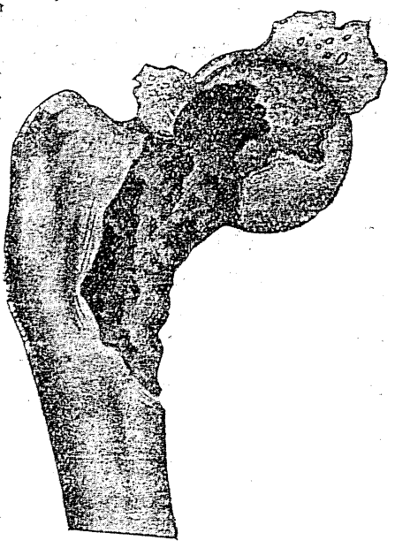
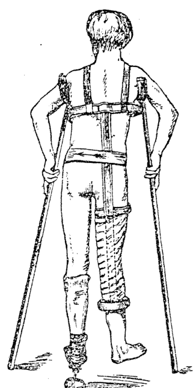
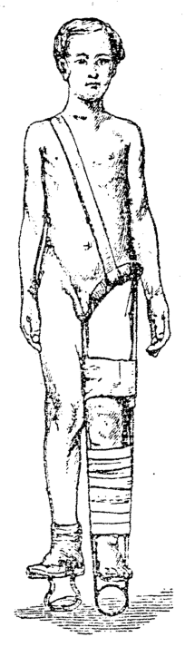
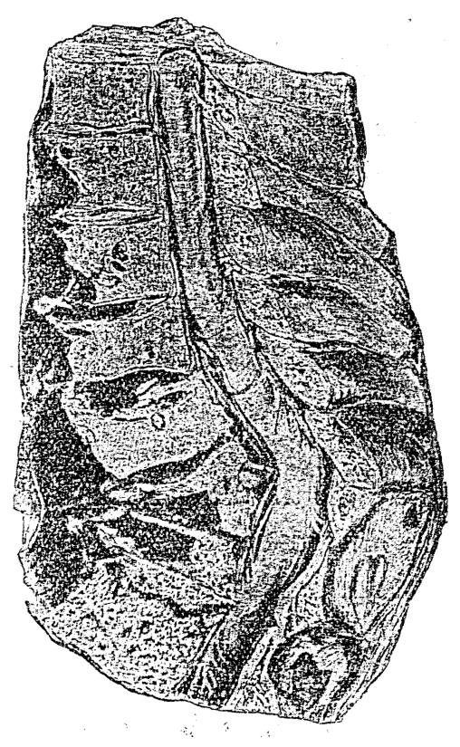
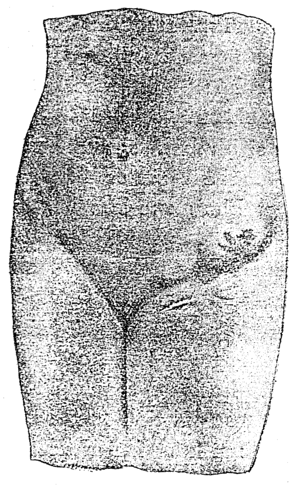
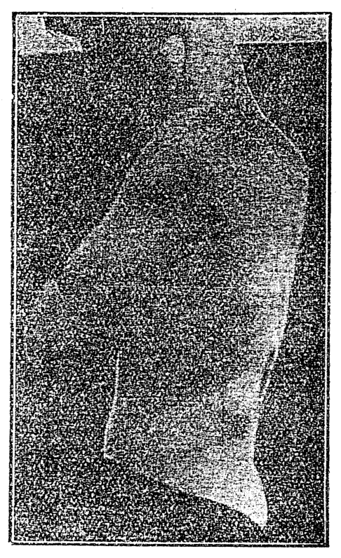
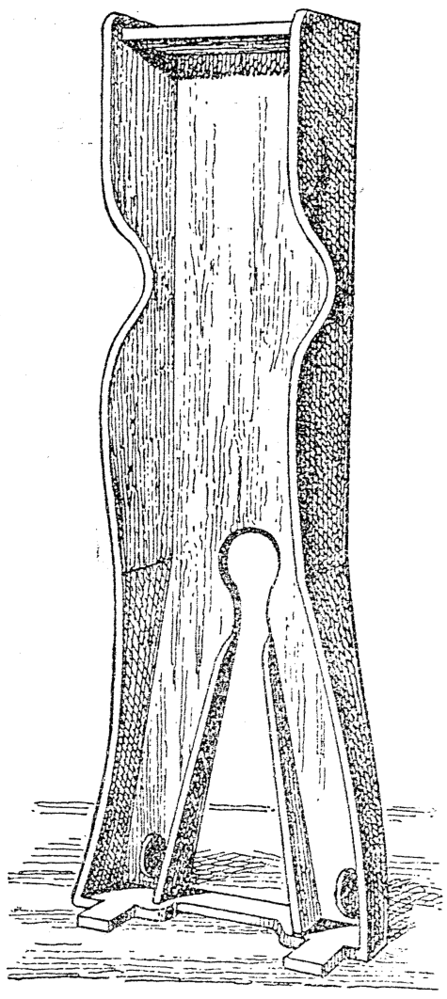
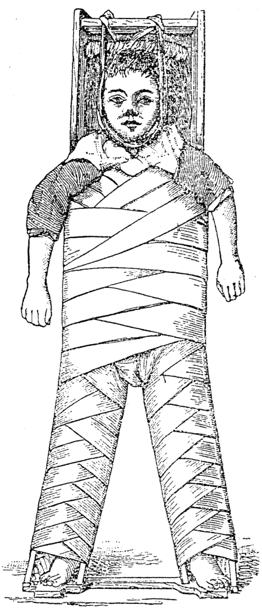

# 第二十八章 外科的結核症 (Gōa-kho ê Kiat-ha̍k-chèng)

> **所屬篇章**：第三篇 外科看護學 (Gōa-kho Khàn-hō͘-ha̍k)
> **原書頁碼**：第 381 頁 ～ 第 390 頁 (已收錄 10/10 頁)

---

<!-- Page 381 Start -->
#### 📖 原書第 381 頁

### TĒ 28 CHIUⁿ / 第 28 章

### GŌA-KHO Ê KIAT-HÚT CHÈNG / 外科的結核症

**[邊註：Sò͘-in / 素因]**

Sò͘-in (素因, *Predisposing causes*) :
1. Pē-bú ū chit hō pīⁿ, i ê kiáⁿ ê sin-thé bē ióng, só͘-í khah khoài jiám-tio̍h kiat-hút chèng.
2. Lâng ê heng-khám siuⁿ pîⁿ, ōe tì-kàu kiat-hút chèng.
3. Gín-ná, kap siàu-liân lâng, khah ōe jiám-tio̍h.
4. Khong-khì bô kàu, chhù-nih ak-chak, tîn-ai kap soa khah chōe.
5. Kú-tng ê pīⁿ, chhin-chhiūⁿ kú-tng sàu, nâ-âu tiāⁿ-tiāⁿ thiàⁿ; koan-chat khap-tio̍h, kòng-tio̍h, iā khah khoài jiám-tio̍h chit hō pīⁿ.
6. Si̍t-bu̍t put-chiok, tùi án-ni sin-thé ōe khah soe-jio̍k, ōe khah khoài jiám-tio̍h. Nā-sī gû ê leng-pông (乳房, *udder*) ū kiat-hút chèng, tùi hia sè-khún ōe ji̍p gû-leng; lâng chia̍h hit hō gû-leng ōe jiám-tio̍h kiat-hút chèng.

> **【全漢對照】**  
> **[邊註：素因]**  
> 素因（素因, *Predisposing causes*）：  
> 1. 父母有此號病，伊的囝的身體袂勇，所以較快染著結核症。  
> 2. 人的胸坎傷平，會致到結核症。  
> 3. 囡仔，佮少年人，較會染著。  
> 4. 空氣無夠，厝裡腌臢，塵埃佮沙較多。  
> 5. 久長的病，親像久長嗽，嚨喉常常疼；關節磕著、摃著，也較快染著此號病。  
> 6. 食物不足，對按呢身體會較衰弱，會較快染著。若是牛的乳房（乳房, *udder*）有結核症，對遐細菌會入牛奶；人食彼號牛奶會染著結核症。

---

**[邊註：Goân-in / 原因]**

Goân-in: Chit hō pīⁿ ê goân-in sī kiat-hút-khún. Chit hō sè-khún, ū-sî ji̍p tùi khì-kńg kap hì-chōng, ū-sî tùi siau-hòa-khì ji̍p. Tī bó͘ só͘-chāi i-īⁿ ê chú-chia̍h ū hì-lô pīⁿ, bô lōa-kú la̍k-ê i-seng iā ū jiám-tio̍h chit hō pīⁿ. Sī tùi chú-chia̍h thâm-lāi ê kiat-hút-khún ū bak-tio̍h i-seng ê si̍t-bu̍t, só͘-í thoân-jiám-tio̍h kiat-hút chèng. Tùi ū siong ê phê-hu á-sī liâm-mo̍h, sè-khún ōe ji̍p. Hit ê sè-khún ji̍p lâng ê seng-khu liáu-āu, ū-sî lâng nā ióng-kiāⁿ, sè-khún ōe sí. Sè-khún lâi kàu seng-khu-lāi tú-tio̍h pe̍h-huih-kiû hō͘ i chia̍h, chiū sí, chit ê pe̍h-huih-kiû ê miâ, kiò-chòe chia̍h-khún-sòe-pau (食菌細胞, *phagocyte*). Chit-ê sī tùi seng-khu ū khòng-to̍k ê khùi-la̍t. Phì-lūn lâi kóng, kiat-hút-khún sī kong-kek ê

> **【全漢對照】**  
> **[邊註：原因]**  
> 原因：此號病的原因是結核菌。此號細菌，有時入對氣管佮肺臟，有時對消化器入。佇某所在醫院的煮食有肺癆病，無偌久六個醫生也有染著此號病。是對煮食痰內的結核菌有溽著（沾著）醫生的食物，所以傳染著結核症。對有傷的皮膚抑是粘膜，細菌會入。彼個細菌入人的身軀了後，有時人若勇健，細菌會死。細菌來到身軀內抵著白血球予伊食，就死，此個白血球的名，叫做食菌細胞（食菌細胞, *phagocyte*）。此個是對身軀有抗毒的氣力。譬論來講，結核菌是攻擊的

<!-- Page 381 End -->

---

<!-- Page 382 Start -->
#### 📖 原書第 382 頁

### KIAT-HÚT-KHÚN, TĪ-LIÂU（361）

tùi-te̍k, chia̍h-khún-sòe-pau, chiū-sī seng-khu tî-hông ê kun-peng. Chit nñg pêng saⁿ kau-chiàn. Seng-khu nā ióng-kiāⁿ, ē khah iâⁿ, iā sòe-khún ē sí. Chóng-sī seng-khu nā soe-jio̍k, á-sī chiām-sî bô ióng, kiaⁿ-liáu kiat-hút-khún ē iâⁿ, liām-pīⁿ sìⁿ-thòaⁿ.

> **【全漢對照】**
> 對敵，食菌細胞就是身軀堤防的軍兵。這兩旁相交戰。身軀若勇健，會較贏，也細菌會死。總是身軀若衰弱，抑是暫時無勇，驚了結核菌會贏，染病散湠。

---

### [Kiat-hút-khún]

Nā tī lîm-pa-chôaⁿ-lāi, hiah ê sòe-khún tāi-seng ē chòe chit-lia̍p chit-lia̍p kiò-chòe kiat-hút, chiah-ê āu-lâi ē sio-ha̍p chòe khah tōa lia̍p, kiò-chòe kiat-hút-kiat-chat (結核結節, nodule), ná kú ná tōa kàu āu-lâi tī hit lia̍p-lāi ū pe̍h-pe̍h ê mi̍h, chhin-chhiūⁿ gû-leng-piáⁿ. Nā iû-goân koh kiāⁿ, bô lōa-kú ē pìⁿ-chiâⁿ lâng-iông, ē kàu phê-hu-gōa chhut lâng ; nā án-ni chiū oh-tit hó.

> **【全漢對照】**
> **［結核菌］**
> 若佇淋巴泉內，遐的細菌代先會做一粒一粒叫做結核，諸個後來會試合做較大粒，叫做結核結節（結核結節, nodule），愈久愈大到後來佇彼粒內有白白之物，親像牛奶餅。若猶原閣健，無偌久會變成膿瘍，會到皮膚外出膿；若按呢就惡得好。

---

### [Chio̍h-he-piàn-sèng]

Nā tú-á thoân-jiám, lâng thàn hó ê hoat-tō͘, hiah ê kiat-hút ê lia̍p ē khah ta, khah tēng, hit lia̍p ê sì-ûi ē siⁿ kiat-tè-chit, chiū-sī khah tēng ê chit, lâi pau-ûi kiat-hút. Chit lia̍p ná kú ná tēng, lia̍p-lāi ê lâng ē hō͘ huih ê chia̍h-khún-sòe-pau chia̍h-khì, á-sī pìⁿ-chiâⁿ tēng chit chhin-chhiūⁿ chio̍h ê khoán, kiò-chòe chio̍h-he-piàn-sèng, (石炭變性, calcification).

> **【全漢對照】**
> **［石灰變性］**
> 若抵仔傳染，人趁好的法度，遐的結核的粒會較乾、較硬，彼粒的四圍會生結締質，就是較硬的質，來包圍結核。這粒愈久愈硬，粒內的膿會互血的食菌細胞食去，抑是變成硬質親像石的款，叫做石炭變性（石炭變性, calcification）。

---

### [Tī-liâu]

Tī-liâu-hoat sī put-chí iàu-kín. Hioh-khùn. Hó ê khong-khì, chhin-chhiūⁿ soaⁿ-téng á-sī hái-kīⁿ. Nā siông-siông tī gōa-bīn khah hó.

Hó ê si̍t-bu̍t, iā ti̍h kàu-gia̍h, chhin-chhiūⁿ gû-leng, koe-nn̄g, ah-nn̄g, hî-iû, gû-bah, koe-bah, kap pêng-siông ū pó ê si̍t-bu̍t. Iû ê si̍t-bu̍t. Lâng ê seng-khu nā hok-siông khah bōe jiám-tio̍h kiat-hút chèng.

Koh chit-ê hoat, chiū-sī ēng _tuberculin_ lâi chù-siā.

Ū-sî ti̍h chhiú-su̍t.

> **【全漢對照】**
> **［治療］**
> 治療法是不止要緊。歇睏。好的空氣，親像山頂抑是海墘。若常常佇外面較好。
> 
> 好的食物，也著夠額，親像牛奶、雞卵、鴨卵、魚油、牛肉、雞肉，佮平常有補的食物。油的食物。人的身軀若復常較袂染著結核症。
> 
> 閣一個法，就是用 *tuberculin* 來注射。
> 
> 有時著手術。

---

### Gōa-kho te̍k-pia̍t ê kiat-hút chèng :

Kiat-hút chèng ū chin chōe khoán, chhin-chhiūⁿ kiat-hút chèng ê lâng-iông, lîm-pa-chôaⁿ-kiat-hút, kut-kiat-

> **【全漢對照】**
> **外科特別的結核症：**
> 結核症有真多款，親像結核症的膿瘍、淋巴泉結核、骨結……

---

*Ti̍h hó khoán-thāi pīⁿ-lâng.*

> **【全漢對照】**
> *著好款待病人。*

<!-- Page 382 End -->

---

<!-- Page 383 Start -->
#### 📖 原書第 383 頁

**362 GŌA-KHO Ê KIAT-HU̍T CHÈNG**

hút chèng, chíng-thâu-á-kiat-hút chèng, koan-chat-kiat-hút chèng, chek-chui-kut-kiat-hút chèng, sīn-chōng-kiat-hút chèng, pak-mó̍h-kiat-hút chèng.

> **【全漢對照】**
> 核症、指頭仔結核症、關節結核症、脊椎骨結核症、腎臟結核症、腹膜結核症。

---

### [Kiat-hút chèng ê lâng-iông 結核症的膿瘍]

Kiat-hút chèng ê lâng-iông sī bān sèng-ê. Khah-siông tī lâng-iông ê ē-tóe sī kut, koan-chat, á-sī lîm-pa-chôaⁿ-kiat-hút. Chhin-chhiūⁿ io-chui-kut nā ū kiat-hút chèng, ū-sî ōe siⁿ lâng-iông, iā hit hō lâng tùi hit ê ū-pīⁿ chek-chui-kut ê chêng-bīn, kàu kut-phôaⁿ thâu-chêng ê só͘-chāi, chiah tùi kha-thúi ê chêng-bīn chéng-khí-lâi. Hit hō lâng-iông ê lâng, sī pí pêng-siông lâng khah kāu, khah pe̍h, khah chhin-chhiūⁿ chhàu gû-leng ê khoán (tē 241 a, b tô͘).

> **【全漢對照】**
> 結核症的膿瘍是慢性的。較常佇膿瘍的下底是骨、關節、抑是淋巴腺結核。親像腰椎骨若有結核症，有時會生膿瘍，也彼號膿對彼個有病脊椎骨的前面，到骨盤頭前的所在，才對腳腿的前面腫起來。彼號膿瘍的膿，是比平常膿較厚、較白、較親像臭牛奶的款（第 241 a, b 圖）。

---

Chit hō lâng-iông, ū-sî ka-kī ōe khip-siu siau-khì, á-sī phòa phē, á-sī ji̍p tī liām-mó̍h ê kńg-lāi. Nā-sī án-ni ōe kap pa̍t khoán ê bî-seng-bu̍t sio-chham, pīⁿ-lâng khah khoài hoat siau-hò͘ⁿ-jia̍t (消耗熱) iā khah khoài sí-khì. Kā i chhiú-su̍t liáu-āu, ū-sî ōe hó, khah-siông bān-bān.

> **【全漢對照】**
> 這號膿瘍，有時家己會吸收消去，抑是破皮，抑是入佇粘膜的管內。若是按呢會佮別款的微生物相參，病人較快發消耗熱（消耗熱）也較快死去。共伊手術了後，有時會好，較常慢慢。

---

### [Chèng-chōng 症狀]

Chèng-chōng : Ū chi̍t lia̍p, bān-bān khí; bōe sím-mi̍h thiàⁿ; nā thiàⁿ, sī tùi goân-pún ê pīⁿ, chhin-chhiūⁿ kut ū pīⁿ. Chit hō lâng-iông sī khah léng, m̄-sī sio, bô âng bô hoat jia̍t.

> **【全漢對照】**
> 症狀：有一粒，慢慢起；袂甚麼疼；若疼，是對原本的病，親像骨有病。這號膿瘍是較冷，毋是燒，無紅無發熱。

---

Tī-liâu : Nā kā i chhiú-su̍t, tiòh chin chheng-khì. Kā i thāi á-sī chiam liáu-āu, tiòh thīⁿ hō͘ ba̍t, m̄-thang ēng hō͘ lâng lâu-chhut-lâi ê hoat (ín-lâu-hoat). Tiòh put-chí sió-sim, m̄-thang hō͘ pa̍t khoán ê bî-seng-bu̍t jiám-tio̍h. Khòng-kiat-hút chèng ê tī-liâu-hoat, chiū-sī hó ê si̍t-bu̍t í-ki̍p khong-khì hit hō.

> **【全漢對照】**
> 治療：若共伊手術，著真正氣。共伊汰抑是針了後，著紩互密，毋通用互膿流出來的法（引流法）。著不止小心，毋通互別款的微生物染著。抗結核症的治療法，就是好的食物以及空氣彼號。

---

### [Lîm-pa-chôaⁿ-kiat-hút 淋巴腺結核]

Lîm-pa-chôaⁿ-kiat-hút (淋巴腺結核, tubercular glands) ê goân-in, sī siàu-liân lâng, si̍t-bu̍t kap ōe-seng m̄-hó, chiù-khí, phīⁿ-thô-chôaⁿ-īam (扁桃腺炎, tonsillitis).

> **【全漢對照】**
> 淋巴腺結核（淋巴腺結核, tubercular glands）的原因，是少年人，食物佮衛生毋好、蛀齒、鼻桃腺炎（扁桃腺炎, tonsillitis）。

---

Ām-kún ê lîm-pa-chôaⁿ khah-chōe, koh-ē-khang, kap kái-piⁿ-ê, khah hán-tit, chóng-sī iû-goân ū.

> **【全漢對照】**
> 頷頸的淋巴腺較多，胳下空佮蓋邊的較罕得，總是猶原有。

---

### [Pīⁿ-lí-ha̍k 病理學]

Lîm-pa-chôaⁿ piàn tōa, sì-ûi ê chho͘-chit kap lîm-pa-

> **【全漢對照】**
> 淋巴腺變大，四圍的組織佮淋巴……

<!-- Page 383 End -->

---

<!-- Page 384 Start -->
#### 📖 原書第 384 頁

  <figure style="display: inline-block; margin: 12px; max-width: 90%; text-align: center;">
    
    <figcaption style="font-size: 14px; color: #4a5568; margin-top: 6px;"><em>Tē 238 tô.—Pî-khū - koan-chat-kiat-hùt chèng : Tōa-thúi-kut-thâu, kut-mó͘h, nńg-kut, lóng ū kiat-hùt (Rose and Carless).</em></figcaption>
  </figure>

### KUT-, KAP KOAN-CHAT-KIAT-HU̍T CHÈNG (363)

chôaⁿ sio-liâm, chôaⁿ-lāi piàn-ōaⁿ, chhin-chhiūⁿ gû-leng-piáⁿ hit hō, sìⁿ lâng-iông.

> **【全漢對照】**
> 腺相連，腺內變換，親像牛乳餅彼號，生膿瘍。

---

### Tī-liâu / 治療

**Tī-liâu:** Khòng-kiat-hu̍t chèng (抗結核症, *anti-tubercular*) ê tī-liâu-hoat. Chhiú-su̍t, lîm-pa-chôaⁿ-tiah-chhut (淋巴腺摘出, *excision of glands*), á-sī lâng-iông koah khui koh khau.

> **【全漢對照】**
> **治療：** 抗結核症（抗結核症，*anti-tubercular*）的治療法。手術，淋巴腺摘出（淋巴腺摘出，*excision of glands*），抑是膿瘍割開閣剖。

---

### Kut-kiat-hu̍t / 骨結核

**Kut-kiat-hu̍t:** Chit hō kut pīⁿ ū kúi-nā khoán, khah-siông tú-tio̍h ê só͘-chāi sī tī tn̂g kut ê bé-liu, á-sī tī koan-chat ê nńg-kut ê ē-tóe. Ū-sî tùi chit ê iân-kò͘ kut ōe chhàu. Kut-mô̍h iā ōe jiám-tio̍h kiat-hu̍t, chhin-chhiūⁿ hia̍p-kut, kap chek-chui-kut; kut-lāi ê cho͘-chit ōe jiám-tio̍h, khah-siông sī chhiú-cháiⁿ-kut, chhiú-óaⁿ-kut, hū-kut. Kut-lāi sìⁿ lâng-iông.

> **【全漢對照】**
> **骨結核：** 此號骨病有幾若款，較常抵著的所在是佇長骨的尾溜，抑是佇關節的軟骨的下底。有時對這个緣故骨會臭。骨膜亦會染著結核，親像脅骨，佮脊椎骨；骨內的組織會染著，較常是手指骨、手碗骨、跗骨。骨內生膿瘍。

---

**[插圖說明]**
Tē 238 tô͘.—Pī-khū-koan-chat-kiat-hu̍t chèng: Tōa-thúi-kut-thâu, kut-mô̍h, nńg-kut, lóng ū kiat-hu̍t (Rose and Carless).

> **【全漢對照】**
> 第 238 圖。——髀臼關節結核症：大腿骨頭、骨膜、軟骨，攏有結核 (Rose and Carless)。

---

### Koan-chat-kiat-hu̍t chèng / 關節結核症

**Koan-chat-kiat-hu̍t:** Chit ê koan-chat-kiat-hu̍t chèng ê khí-thâu, ū-sî sī in-ūi kòng-tio̍h, phah-tio̍h, tùi án-ni bô chim-chiok chiàu-kò͘. Nî-hè: Siàu-liân lâng kap lāu lâng. Siàu-liân lâng ōej iám-tio̍h, sī in-ūi i ê kut ê sòe-pau iáu teh sìⁿ. Lāu lâng ōe jiám-tio̍h, in-ūi lāu lâng khòng-to̍k ê khùi-la̍t kiám-chió. Sòng-hiong lâng, in-ūi m̄-hó ê si̍t-bu̍t, kap bô ōe-seng, iā chit téng ê lâng nā tú-tio̍h sió-khóa ê sún-hāi, bô chim-chiok chiàu-kò͘ (tē 238 tô͘).

> **【全漢對照】**
> **關節結核：** 这个關節結核症的起頭，有時是因為摃著、拍著，對按呢無斟酌照顧。年歲：少年人佮老人。少年人會染著，是因為伊的骨的細胞猶咧生。老人會染著，因為老人抗毒的氣力減少。喪鄉人，因為唔好的食物，佮無衛生，也這等的人若抵著小許的損害，無斟酌照顧（第 238 圖）。

---

### Pīⁿ-lí-ha̍k / 病理學

Chit hō pīⁿ ê khin tāng, sī koan-hē tī khah kín i-tī á-sī khah bān. Tāi-khí-seng khí ê só͘-chāi sī kut-bé, á-sī koan-chat ê liām-mô̍h-lāi. Nā bô i-tī, ōe pìⁿ khah siong-tiōng, chhin-chhiūⁿ jīm-tài, á-sī nńg-kut, chham kut ōe

> **【全漢對照】**
> 這號病的輕重，是關係佇較緊醫治抑是較慢。代起先起的所在是骨尾，抑是關節的黏膜內。若無醫治，會變較嚴重，親像韌帶，抑是軟骨，參骨會……

---

**[頁底註]**
Oaⁿ pau-siong-liâu ê sî, kiaⁿ-lâng ê mih, tio̍h siu tī lâng-pôaⁿ, liām-piⁿ phàng-chhut pīⁿ-sek-gōa thû-bia̍t.

> **【全漢對照】**
> 換包傷料的時，驚人的物，著收佇膿盤，連鞭磅出病室外除滅。

<!-- Page 384 End -->

---

<!-- Page 385 Start -->
#### 📖 原書第 385 頁

364  GŌA-KHO Ê KIAT-HÙT CHÈNG

### Koan-chat-kiat-hút

phàiⁿ-khì. Koan-chat-lāi ōe siⁿ kiat-hút bah-gê-cho͘-chit; chit ê bah-gê-cho͘-chit (肉芽組織,) iā pìⁿ-chiâⁿ lâng, chiâⁿ chòe chi̍t lia̍p tōa lia̍p lâng-ióng. Ū-sî koan-chat-lāi ê liām-mo̍h-e̍k ōe siuⁿ chōe, iā koan-chat ōe chéng. Chit hō bah-gê-cho͘-chit ū-sî bô hòa-lâng, m̄-kú pìⁿ-chiâⁿ kiat-tè-chit, ōe chiong nn̄g pêng ê pīⁿ kut, lâi hō͘ i liân-ha̍p, lâi thòe hit ê koan-chat. Nā án-ni chiū kui-sì-lâng, hit hō koan-chat lóng bōe oa̍h-tāng. Pīⁿ kut chiap-liân ê sî, bo̍h-tit hō͘ tín-tāng.

> **【全漢對照】**
> 湃去。關節內會生結核肉芽組織；這个肉芽組織（肉芽組織，）也變成膿，成做一粒大粒膿瘍。有時關節內的黏膜液會傷多，也關節會腫。這號肉芽組織有時無化膿，毋過變成結締質，會將兩旁的病骨，來予伊連合，來替彼个關節。若按呢就歸世人，彼號關節攏𣍐活動。病骨接連的時，莫得予振動。

---

### Chèng-chōng

Chèng-chōng: Thiàⁿ, ū-sî chit ê thiàⁿ sī tī ū pīⁿ ê só͘-chāi, ū-sî tī pa̍t ūi ōe thiàⁿ; chhin-chhiūⁿ nā pī-khū-koan-chat ê kiat-hút, ū-sî chhek-koan-chat ōe thiàⁿ. Chit ê iân-kò͘; sī in-ūi lâng ê thàng-thiàⁿ, lóng sī tùi sîn-keng chiah ōe chai. Pī-khū-koan-chat hit só͘-chāi ê sîn-keng ū pun chhe kàu chhek-koan-chat, só͘-í hit ê pīⁿ sui-bóng tī pī-khū-koan-chat, m̄-kú lâng chai thiàⁿ ê só͘-chāi, ū-sî sī chhek-koan-chat. Chit-ê kiò-chòe hoán-siā-sèng ê thiàⁿ (反射性, referred pain). Iā thang kóng pī-khū-koan-chat ê thiàⁿ chhì-kek kàu tōa-náu, hit ê tōa-náu ū hoan-e̍k thiàⁿ sī tùi chhek-koan-chat chiah khí.

> **【全漢對照】**
> 症狀：疼，有時這个疼是佇有病的所在，有時佇別位會疼；親像若髀臼關節的結核，有時膝關節會疼。這个緣故，是因為人的痛疼，攏是對神經才會知。髀臼關節彼所在的神經有分杈到膝關節，所以彼个病雖罔佇髀臼關節，毋過人知疼的所在，有時是膝關節。這个叫做反射性的疼（反射性, referred pain）。也通講髀臼關節的疼刺激到大腦，彼个大腦有翻譯疼是對膝關節才起。

---

Mî-sî ū-sî hut-jiân chhíⁿ kiò thiàⁿ; chit-ê sī in-ūi koan-chat nn̄g pêng ū pīⁿ ê kut-bé saⁿ-bôa ê iân-kò͘. Ji̍t-sî khah bōe án-ni thiàⁿ, in-ūi pīⁿ-lâng cheng-sîn ê sî, koán hit koan-chat ê kun-bah ōe kiu-khí-lâi, án-ni koan-chat chiū ōe tiām-chāi.

> **【全漢對照】**
> 暝時有時忽然醒叫疼；這个是因為關節兩旁有病的骨尾相磨的緣故。日時較𣍐按呢疼，因為病人精神的時，管彼關節的筋肉會搐起來，按呢關節就會恬在。

---

Nā ū chit hō pīⁿ, ū-sî koan-chat kiu-té, koh teh tó ê sî, ǹg tùi gōa-bīn phiat-chhut-khì.

> **【全漢對照】**
> 若有這號病，有時關節搐短，閣咧倒的時，向對外面撇出去。

---

### Tī-liâu

Tī-liâu: 1. Khòng kiat-hút chèng ê tī-liâu-hoat.
2. Hioh-khùn. Bo̍h-tit hō͘ koan-chat tín-tāng. Tó tī bîn-chhng, koan-chat lóng bô thiàⁿ liáu-āu tio̍h cha̍p-jī géh-ji̍t, chì nn̄g nî-kú, chiah thang tín-tāng. Nā bô án-ni, pīⁿ chiū khoài-khoài koh khí.
3. Koan-chat ê piàn-hêng tio̍h kóe. Eng-kai tio̍h

> **【全漢對照】**
> 治療：1. 抗結核症的治療法。
> 2. 歇睏。莫得予關節振動。倒佇眠床，關節攏無疼了後著十二個月日，至兩年久，才通振動。若無按呢，病就快快閣起。
> 3. 關節的變形著改。應該著

<!-- Page 385 End -->

---

<!-- Page 386 Start -->
#### 📖 原書第 386 頁

  <figure style="display: inline-block; margin: 12px; max-width: 90%; text-align: center;">
    
    <figcaption style="font-size: 14px; color: #4a5568; margin-top: 6px;"><em>Tē 239 tô.—Thomas-sī pī-khū-koan-chat āu hù-bo̍k (Sanders).</em></figcaption>
  </figure>

### KOAN-CHAT-KIAT-HÚT TĪ-LIÂU（關節結核治療） 365

chiong hit ki kut an-tì hē chòe ū lō͘-ēng ê sè-bīn. Tio̍h ēng hù-bo̍k, pheng-tòa, hit hō mi̍h. Nā-sī pī-khū-koan-chat, chhek-koan-chat, á-sī chek-chui-kut ê pīⁿ, beh chhun-ti̍t ê hoat-tō͘, tio̍h chiām-chiām lâi chòe; chit-ê kiò-chòe khan-ín-hoat, tio̍h khòaⁿ tē 355 bīn. Nā ū pī-khū-koan-chat, chhek-koan-chat ê kiat-hu̍t, ū te̍k-pia̍t ê hù-bo̍k thang ēng, kiò-chòe To-má-sī ê hù-bo̍k, sī teh ēng lâi i-tī pī-khū-koan-chat, á-sī chhek-koan-chat, bān-sèng kiat-hu̍t chèng (tē 239 tô͘). Chit hō pī-khū-koan-chat ê hù-bo̍k, sī ēng chi̍t pán ê thih-pán, tng, tùi keng-kah-kut khí kàu kha-tó ûi-chí. Siang-thâu-bé ū nn̄g ê thih chòe ê khoân, tī tōa-thúi-tiong iā ū chi̍t-ê. Hiah ê khoân teh ha̍p-oá, sī ēng khu-sok-kim (拘束金, buckle) lâi liú hō͘ tiâu. Khoân ê lāi-bīn ū ēng núng-phê chū-teh, hō͘ i khah bōe lòe-tio̍h bah. Oá pak-tó ê só͘-chāi, chiong pheng-tòa tîⁿ tiâu, kap tōa-thúi iā sī án-ni. Téng-bīn ê khoân, ēng tiàu-tòa, tiàu tiâu tī keng-thâu-téng. Ài beh hō͘ ū-pīⁿ ê kha lî phû, só͘-í tio̍h ēng chi̍t ê thih-khoân, tī hó ê kha lâi ké kha hō͘ koâiⁿ, chiū ū pīⁿ ê kha bōe tak-tio̍h thô͘, án-ni pī-khū-koan-chat, chiū bōe tín-tāng, iā bōe hō͘ seng-khu ê tāng-liōng lâi ap-teh. Nā beh kiâⁿ, tio̍h ēng nn̄g ki koáiⁿ-á lâi tú tī koh-ē-khang.

> **【全漢對照】**
> 將彼枝骨安置設做有用勢面。著用副木、繃帶，彼號物。若是髀臼關節、膝關節、抑是脊椎骨的病，欲伸直的法度，著漸漸來做；這个叫做牽引法，著看第 355 面。若有髀臼關節、膝關節的結核，有特別的副木通用，叫做 To-má-sī（Thomas 氏）的副木，是咧用來醫治髀臼關節、抑是膝關節，慢性結核症（第 239 圖）。這號髀臼關節的副木，是用一版的鐵版，長，對肩胛骨起到腳肚為止。雙頭尾有兩个鐵做的環，佇大腿中亦有一个。遐的環咧合倚，是用拘束金（buckle）來扭互牢。環的內面有用軟皮敷咧，互伊較𣍐磨著肉。倚腹肚的所在，將繃帶纏牢，及大腿亦是按呢。頂面的環，用吊帶，吊牢佇肩頭頂。愛欲互有病的腳離浮，所以著用一个鐵環，佇好的腳來加腳互懸，就有病的腳𣍐踏著土，按呢髀臼關節，就𣍐振動，亦𣍐互身軀的重量來壓咧。若欲行，著用兩枝柺仔來拄佇胳下空。

---

### [插圖圖說]

*Tē 239 tô͘.—Thomas-sī pī-khū-koan-chat āu hù-bo̍k (Sanders).*

> **【全漢對照】**
> 第 239 圖。—Thomas 氏髀臼關節後副木 (Sanders)。

---

### To-má-sī chhek-koan-chat ê hù-bo̍k（Thomas 氏膝關節的副木）

To-má-sī chhek-koan-chat ê hù-bo̍k : Chit ê hù-bo̍k ū chi̍t-ê thih chòe ê khoân, chhin-chhiūⁿ koe-nn̄g-hêng, chiàu pīⁿ-lâng kha ê tōa sè, lâi ēng hit ê khoân ; khoân ū ēng núng-phê pau. Siang-pêng ū nn̄g pán ê thih-pán lâi kah

> **【全漢對照】**
> Thomas 氏膝關節的副木：這个副木有一个鐵做的環，親像雞卵形，照病人腳的大細，來用彼个環；環有用軟皮包。雙邊有兩版的鐵版來合

---

### [頁底格言]

Jîn-ài bô kiâⁿ kiàn-siàu ê sū (I Ko-lîm-to 13: 5).

> **【全漢對照】**
> 仁愛無行見潲的事（I 哥林多 13: 5）。

<!-- Page 386 End -->

---

<!-- Page 387 Start -->
#### 📖 原書第 387 頁

  <figure style="display: inline-block; margin: 12px; max-width: 90%; text-align: center;">
    
    <figcaption style="font-size: 14px; color: #4a5568; margin-top: 6px;"><em>Tē 240 tô.— Thomas-sī. Chhek - koan- chat hù - bo̍k (Heath).</em></figcaption>
  </figure>
  <figure style="display: inline-block; margin: 12px; max-width: 90%; text-align: center;">
    
    <figcaption style="font-size: 14px; color: #4a5568; margin-top: 6px;"><em>Tē 241 tô.—Chek-chui-kut-kiat-hu̍t chèng : thang khòaⁿ-kìⁿ chek-chui- kut ê thé í-keng pāi-hoāi ; iā ū ún-ku ; tī chêng-chhiòng-jīm-tài ê āu-bīn ū lâng-iông ; chit hō lâng-iông nā siuⁿ tōa, ōe teh-tio̍h chek-chhé, sòa hō͘ pīⁿ-lâng pīⁿ-chiâⁿ piàn-sūi (Rose and Carless' “Surgery ”).</em></figcaption>
  </figure>

366　　**GŌA-KHO Ê KIAT-HU̍T CHÈNG**

---

### [多馬氏膝關節附木 / 續前段]

〔側標：To-má-sī chhek-koan-chat ê hù-bo̍k〕

teh, ē-tóe ū chi̍t-ê khoân kàu tī thô͘-kha. Chí nn̄g ki thih-pán, ū ēng phê ê tòa, chiong khu-sok-kìm lâi liú hō͘ i tiâu. Khah hó tióh ēng pheng-tòa sòa tiⁿ hō͘ i tiâu. Koe-nn̄g-hêng ê khoân, tióh ēng tiàu-tòa tiàu tī keng-thâu-téng hō͘ i tiâu. Tióh ēng chi̍t-ê thih-khoân, tī hó ê kha ké koâiⁿ, lâi bián hō͘ seng-khu ê tāng-liōng lâi ap-teh tī ū pīⁿ kha ê chhek-koan-chat. Tùi tē 240 tô͘ thang khòaⁿ, chiū chai seng-khu ê tāng-liōng, sī ap-teh tùi kut-pôaⁿ kàu thih-khoân, bô koan-hē tī ū pīⁿ ê chhek-koan-chat.

> **【全漢對照】**
> 〔側標：多馬氏膝關節的附木〕
> 
> 咧，下底有一個環到佇塗跤。此兩枝鐵板，有用皮的帶，將拘束鉗來鈕予伊稠。較好著用棚帶（繃帶）續纏予伊稠。雞卵形的環，著用吊帶吊佇肩頭頂予伊稠。著用一個鐵環，佇好的跤加懸，來免予身軀的重量來壓佇有病跤的膝關節。對第 240 圖通看，就知道身軀的重量，是壓佇對骨盤到鐵環，無關係佇有病的膝關節。

---

**Tē 240 tô͘.** — Thomas-sī. Chhek - koan-chat hù - bo̍k (Heath).

> **【全漢對照】**
> **第 240 圖。**——Thomas 氏。膝關節附木 (Heath)。

---

### 脊椎骨結核症 (Chek-chui-kut ê kiat-hu̍t chèng)

〔側標：Chek-chui-kut-kiat-hu̍t〕

Chek-chui-kut ê kiat-hu̍t chèng (Potts Disease): Chit hō pīⁿ ê khoán-sit, tāi-khài sī chhin-chhiūⁿ tú-á kóng, kut kap koan-chat-kiat-hu̍t chèng. Hit hō ê sò͘-in kap goân-in saⁿ-tâng. Pīⁿ ū-sî tī chi̍t tè chui-kut, á-sī ū-sî kúi-nā tè ū jiám-tio̍h. Nā-sī lâng ê chui-kut ū chi̍t nn̄g tè sún-hoāi liáu-āu, chiū lâng kui seng-khu ê tāng, thoân kè tī chui-kut, hō͘ hit ê ū pīⁿ ê só͘-chāi ê chui-kut, téng-bīn-ê lâi teh-tio̍h ē-bīn-ê, tì-kàu hō͘ hit-ê ū pīⁿ ê kut oan-khiok (tē 241 tô͘). Chit ê pīⁿ miâ kiò chek-chui-kut

> **【全漢對照】**
> 〔側標：脊椎骨結核〕
> 
> 脊椎骨的結核症 (Potts Disease)：此號病的款式，大概是親像拄仔講，骨佮關節結核症。彼號的素因佮原因相同。病有時佇一塊椎骨，抑是有時幾若塊有染著。若是人的椎骨有一兩塊損壞了後，就人規身軀的重，傳過佇椎骨，予彼個有病的所在的椎骨，頂面的來壓著下面的，致到予彼個有病的骨彎曲 (第 241 圖)。此個病名叫脊椎骨……

---

**Tē 241 tô͘.** — Chek-chui-kut-kiat-hu̍t chèng: thang khòaⁿ-kìⁿ chek-chui-kut ê thé í-keng pāi-hoāi; iā ū ún-ku; tī chiêng-chhiòng-jīm-tài ê āu-bīn ū lâng-iông; chit hō lâng-iông nā siuⁿ tōa, ē teh-tio̍h chek-chhé, sòa hō͘ pīⁿ-lâng pīⁿ-chiân piàn-sūi (Rose and Carless' "Surgery").

> **【全漢對照】**
> **第 241 圖。**——脊椎骨結核症：通看見脊椎骨的體已經敗壞；亦有𪜶佝（駝背）；佇前縱韌帶的後面有膿瘍；此號膿瘍若傷大，會壓著脊髓，紲予病人病前半身不遂 (Rose and Carless' "Surgery")。

<!-- Page 387 End -->

---

<!-- Page 388 Start -->
#### 📖 原書第 388 頁

  <figure style="display: inline-block; margin: 12px; max-width: 90%; text-align: center;">
    
    <figcaption style="font-size: 14px; color: #4a5568; margin-top: 6px;"><em>Tē 241a tô:—Heng-io-chek-chui-kut-kiat-hút chèng; tī kái-pīⁿ kha-thúi ê chèng bīn teh khí ê lâng-iông, kiò-chòe lāi-io-kun-lâng-iông (內腰筋膿瘍, psoas abscess).</em></figcaption>
  </figure>
  <figure style="display: inline-block; margin: 12px; max-width: 90%; text-align: center;">
    
    <figcaption style="font-size: 14px; color: #4a5568; margin-top: 6px;"><em>Tē 241b tô:—Heng-io-chek-chui-kut-kiat-hút chèng teh khí lâng-iông tī kut-pôaⁿ ê téng-bīn pō-ūi. (From Rose and Carless' “Surgery.”)</em></figcaption>
  </figure>

### CHEK-CHUI-KUT-KIAT-HÚT CHÈNG (367)

oan-khiok chèng. Khah-siông tú-tio̍h chiū-sī tī heng-chui-kut kap io-chui-kut.

> **【全漢對照】**
> 彎曲症。較常接著就是佇胸椎骨佮腰椎骨。

---

### Chèng-chōng（症狀）

Chèng-chōng: 1. Thiàⁿ: Tī ū pīⁿ ê só͘-chāi chai thiàⁿ, iā tī pa̍t ūi chai thiàⁿ, chhin-chhiūⁿ hia̍p-kut, á-sī pak-tó. Ū-sî gín-ná kóng pak-tó thiàⁿ, m̄-kú pīⁿ ê só͘-chāi sī tī chui-kut. Chit hō thiàⁿ kiò-chòe hoán-siā-sèng ê thiàⁿ.

> **【全漢對照】**
> 症狀：1. 疼：佇有病的所在知疼，也佇別位知疼，親像脅骨、抑是腹肚。有時囡仔講腹肚疼，毋過病的所在是佇椎骨。這號疼叫做反射性的疼。

---

### [圖附說明]

Tē 241a tô͘:—Heng-io-chek-chui-kut-kiat-hút chèng; tī kái-piⁿ kha-thúi ê chêng bīn teh khí ê lâng-iông, kiò-chòe lāi-io-kun-lâng-iông (內腰筋膿瘍, psoas abscess).

> **【全漢對照】**
> 第 241a 圖：——胸腰脊椎骨結核症；佇胯邊跤腿的前面咧起的膿瘍，叫做內腰筋膿瘍（內腰筋膿瘍, psoas abscess）。

Tē 241b tô͘:—Heng-io-chek-chui-kut-kiat-hút chèng teh khí lâng-iông tī kut-pôaⁿ ê téng-bīn pō͘-ūi. (From Rose and Carless’ “Surgery.”)

> **【全漢對照】**
> 第 241b 圖：——胸腰脊椎骨結核症咧起膿瘍佇骨盤的頂面部位。(From Rose and Carless’ “Surgery.”)

---

### 2. Tē jī khoán ê chèng-chōng

2. Tē jī khoán ê chèng-chōng, sī chek-chui-kut pìⁿ ngī. Pīⁿ tú-á khí ê sî, seng-khu ê kun-bah kiu ân, hō͘ hit ê ū pīⁿ ê chui-kut bōe tín-tāng, án-ni khah bōe thiàⁿ. Āu-lâi ū pīⁿ ê chui-kut ōe sio-liân pìⁿ-chiâⁿ ngī ê kut.

> **【全漢對照】**
> 2. 第二款的症狀，是脊椎骨變硬。病拄仔起ê時，身軀ê筋肉縮ân（緊），互彼个有病ê椎骨𣍐振動，按呢較𣍐疼。後來有病ê椎骨會相連變成硬ê骨。

---

### [格言欄]

Sin-thé ióng-kiāⁿ, khah-iānⁿ chōe-chōe chîⁿ.

> **【全漢對照】**
> 身體勇健，較贏贅贅錢。

<!-- Page 388 End -->

---

<!-- Page 389 Start -->
#### 📖 原書第 389 頁

368　　　　GŌA-KHO Ê KIAT-HÙT CHÈNG

### Chek-chui-kut-kiat-hu̍t chèng ê chèng-chōng（脊椎骨結核症的症狀）

3. Ún-ku: Koh chit khoán ê chèng-chōng sī piàn-hêng, chhin-chhiūⁿ ún-ku. Che sī in-ūi chui-kut í-keng pháiⁿ-khì oan-khiau.

> **【全漢對照】**
> 3. 彎痀：閣這款的症狀是變形，親像彎痀。這是因為椎骨已經去（壞去）彎曲。

---

4. Lâng-iông: Ū-sî hit hō lâng, bô tī ū pīⁿ ê só͘-chāi. Ū-sî tùi hit ê ū pīⁿ chek-chui-kut ê chêng-bīn kàu kut-pôaⁿ thâu-chêng ê só͘-chāi, chiah tùi kha-thúi ê chêng-bīn lâu-chhut--lâi, chit-ê kiò-chòe liû-chù-lâng-iông (流注膿瘍; tē 241ᵃ, ᵇ tô͘).

> **【全漢對照】**
> 4. 膿瘍：有時彼號膿，無佇有病的所在。有時對彼個有病脊椎骨的前面到骨盤頭前的所在，才對骹腿的前面流出來，這個叫做流注膿瘍（流注膿瘍；第 241ᵃ, ᵇ 圖）。

---

5. Piàn-sūi: Chit ê iân-kò͘ sī in-ūi hit hō kiat-hu̍t pīⁿ-châu nōa-khì ê pe̍h-chit (caseous material), á-sī lâng-iông teh-tio̍h sîn-keng, á-sī chek-chhé; á-sī in-ūi chek-chhé, á-sī i ê mo̍͘h ū jiám-tio̍h kiat-hu̍t chèng. Só͘-í hit ê chek-chhé pí pêng-siông-ê lâi khòaⁿ, sī khah oe̍h, chiū chiām-chiām hoat-iām, hit ê ū pīⁿ ê só͘-chāi ê ē-bīn chiū piàn-sūi (tē 241 tô͘). Tāi-seng i ê kha ū khah soe-jio̍k iā thiàⁿ, āu-lâi ná kú chiū lóng bē tín-tāng. Chit hō pīⁿ miâ kiò pòaⁿ-sin-put-sūi (半身不遂, paraplegia. I ê tāi-, siáu-piān, iā ūi-tio̍h piàn-sūi ê iân-kò͘ bô sūn, ū-sî sit-kìm (失禁).

> **【全漢對照】**
> 5. 半遂：這個緣故是因為彼號結核病巢爛去的白質（caseous material，乾酪物質），抑是膿瘍壓著神經，抑是脊髓；抑是因為脊髓，抑是伊的膜有染著結核症。所以彼個脊髓比平常的來看，是較狹，就漸漸發炎，彼個有病的所在下面就半遂（第 241 圖）。代先伊的骹有較衰弱也疼，後來愈久就攏袂振動。這號病名叫半身不遂（半身不遂, paraplegia。伊的大、小便，也為著半遂的緣故無順，有時失禁（失禁）。

---

### Tī-liâu（治療）

Tī-liâu: Khòng-kiat-hu̍t chèng ê tī-liâu-hoat. Kap koan-chat-kiat-hu̍t chèng ê tī-liâu-hoat saⁿ-tâng. Tio̍h tó tī bîn-chhng kàu lóng bē thiàⁿ. Āu-lâi tio̍h ēng hoat-tō͘, hō͘ chek-chui-kut bē tín-tāng chit nî-kú. Án-ni tio̍h ēng te̍k-pia̍t ê hù-bo̍k lâi kah hō͘ hit ê ū-pīⁿ ê só͘-chāi, bô hō͘ thâu-khak, kap téng-kòa ê tāng lâi teh i. Chit khoán ê hù-bo̍k, hêng-chōng chhin-chhiūⁿ kah-á. Ū-sî ēng gû-phê, á-sī chiòh-ko (plaster of Paris) lâi chòe. Iā ū-sî ēng chhun-ûn thí khui ê hoat, hō͘ hiah-ê ū pīⁿ ê chui-kut bô saⁿ-bôa (tē 453 tô͘).

> **【全漢對照】**
> 治療：抗結核症的治療法。佮關節結核症的治療法相同。著倒佇眠牀到攏袂疼。後來著用法度，互脊椎骨袂振動一年久。按呢著用特別的副木來夾互彼個有病的所在，無互頭殼佮頂蓋的重來壓伊。這款的副木，形狀親像甲仔。有時用牛皮，抑是石膏（plaster of Paris）來做。也有時用伸勻擘開的法，互遐的有病的椎骨無相磨（第 453 圖）。

---

Phelps-sī ê siuⁿ-á, sī beh i-tī gín-ná ū chek-chui-kut-kiat-hu̍t chèng (242, 243 tô͘). Gín-ná nā ū chit hō pīⁿ, tio̍h ēng chit ê hoat-tō͘ i-tī nñg saⁿ tang-kú. Nā beh sóe seng-khu, ōaⁿ pau-siong-liâu, tāi-, siáu-piān sī put-chí

> **【全漢對照】**
> Phelps氏的箱仔，是要醫治囡仔有脊椎骨結核症（242, 243 圖）。囡仔若有這號病，著用這個法度醫治兩三年久。若要洗身軀，換包傷料，大、小便是不止...

<!-- Page 389 End -->

---

<!-- Page 390 Start -->
#### 📖 原書第 390 頁

  <figure style="display: inline-block; margin: 12px; max-width: 90%; text-align: center;">
    
    <figcaption style="font-size: 14px; color: #4a5568; margin-top: 6px;"><em>242
Tē 242 tô:—Phelps-sī ê siuⁿ-á.</em></figcaption>
  </figure>
  <figure style="display: inline-block; margin: 12px; max-width: 90%; text-align: center;">
    
    <figcaption style="font-size: 14px; color: #4a5568; margin-top: 6px;"><em>243
Tē 243 tô:—Gín-ná í-keng pák hó-sè tī Phelps-sī ê siuⁿ-á (Heath).</em></figcaption>
  </figure>

### PHELPS-SĪ Ê SIUⁿ-Á 369

...lī-piān. Tē 243 tô͘, ū ēng pheng-tòa tìⁿ hó-sè. Tio̍h ēng mî-hoe chū tī ta̍k só͘-chāi, hō͘ khah nńg bōe tiam-tio̍h seng-khu.

> **【全漢對照】**  
> ...利便。第 243 圖，有用繃帶纒好勢。著用棉花注佇逐所在，予較軟𣍐砧著身軀。

---

**242**  
**243**  
**Tē 242 tô͘:—Phelps-sī ê siuⁿ-á.**  
**Tē 243 tô͘:—Gín-ná í-keng pa̍k hó-sè tī Phelps-sī ê siuⁿ-á (Heath).**

> **【全漢對照】**  
> **242**  
> **243**  
> **第 242 圖：——Phelps氏的箱仔。**  
> **第 243 圖：——囡仔已經縛好勢佇 Phelps氏的箱仔 (Heath)。**

---

Chit hō pīⁿ-lâng tio̍h chin sió-sim chiàu-kò͘ tī-hông jio̍k-siong. Iā ū-sî phông-kong piàn-sūi, tio̍h kā i thong jiō-tō, án-ni tio̍h chin chheng-khì, kiaⁿ-liáu phông-kong ōe hoat-iām.

> **【全漢對照】**  
> 這號病人著真小心照顧預防褥瘡。也有時膀胱半身不遂，著共伊通尿道，按呢著真清氣，驚了膀胱會發炎。

---

Góa siat-sú chòe sian-ti bêng-pe̍k lóng-chóng ê ò-biāu kap lóng-chóng ê chai-bat; koh siat-sú ū chiâu-pī ê sìn, kàu-gia̍h lâi î-soaⁿ, nā bô jîn-ài, góa chiū bōe sǹg chòe sī sím-mi̍h (I Ko-lîm-to 13: 2).

> **【全漢對照】**  
> 我設使做先知明白攏總的奧妙及攏總的知別；閣設使有齊備的信，夠額來移山，若無仁愛，我就𣍐算做是甚麼 (I 哥林多 13: 2)。

<!-- Page 390 End -->

---

