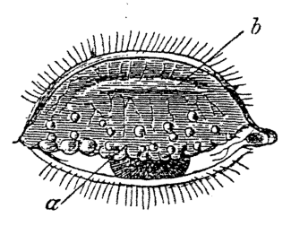
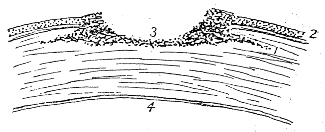
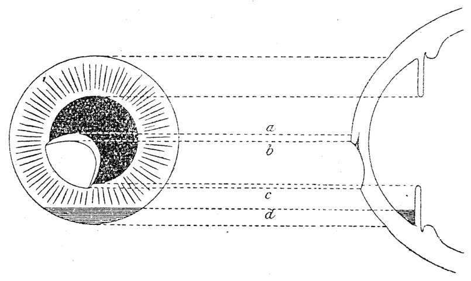
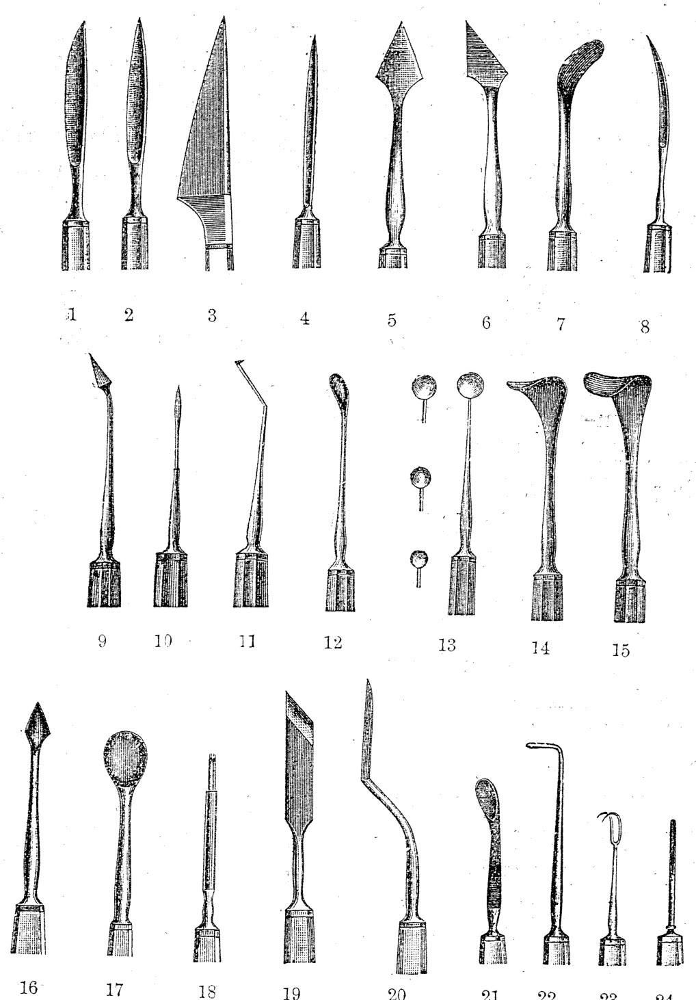
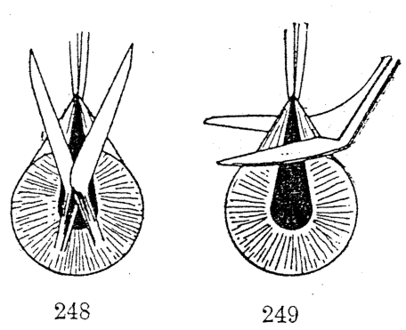
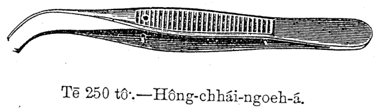
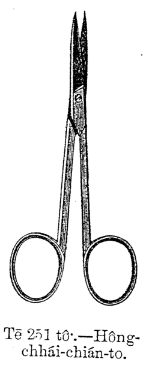
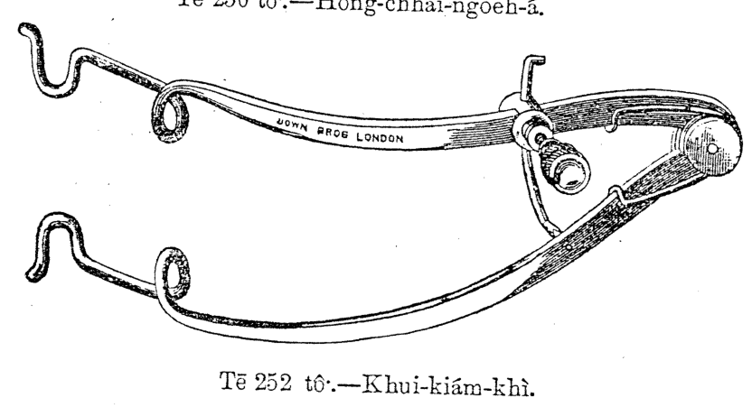
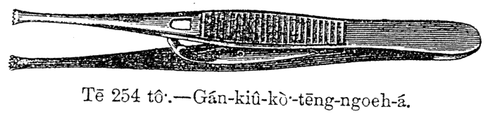
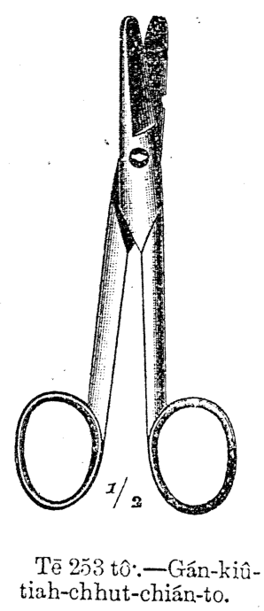

# 第二十九章 目珠病 (Ba̍k-chiu-pīⁿ)

> **所屬篇章**：第三篇 外科看護學 (Gōa-kho Khàn-hō͘-ha̍k)
> **原書頁碼**：第 391 頁 ～ 第 398 頁 (已收錄 8/8 頁)

---

<!-- Page 391 Start -->
#### 📖 原書第 391 頁

### TĒ 29 CHIUⁿ LŪN BA̍K-CHIU PĪⁿ
**第 29 章 論目睭病**

---

### [Kiat-mo̍h-iām / 結膜炎]

**Kiat-mo̍h-iām** (結膜炎, *Conjunctivitis*): Chit ê pīⁿ chiū-sī gán-kiû-kiat-mo̍h, (眼球結膜) kap gán-kiám-kiat-mo̍h (眼瞼結膜) hoat-iām.

> **【全漢對照】**  
> **結膜炎**（結膜炎，*Conjunctivitis*）：這个病就是眼球結膜（眼球結膜）佮眼瞼結膜（眼瞼結膜）發炎。

---

### [Gán-iām / 眼炎]

Ū chi̍t khoán miâ kiò-chòe gán-iām (眼炎, *ophthalmia*), ū-sî tú-á chhut-sì ê gín-ná ū chit hō chèng, ū-sî tōa-lâng iā ū. Ū-sî tú-á chhut-sì ê sî, ba̍k-chiu sóe bô chheng-khì ê iân-kò͘, hit hō to̍k ê chit, ji̍p tī ba̍k-chiu-lāi, gín-ná ê ba̍k-chiu kiat-mo̍h chiah hoat-iām. Chit hō chèng ōe hō͘ ba̍k-chiu âng, chéng, thàng-thiàⁿ, ōe hòa-lâng, ba̍k-sái-ko.

> **【全漢對照】**  
> 有一款名叫做法眼炎（眼炎，*ophthalmia*），有時拄仔出世的囡仔有這號症，有時大人也有。有時拄仔出世的時，目睭洗無清潔的緣故，彼號毒的質，入佇目睭內，囡仔的目睭結膜才發炎。這號症會互目睭紅、腫、通疼、會化膿、目屎膏。

---

### [Ū-hông-hoat / 預防法]

Gín-ná khí-thâu chhut-sì, chiū tiòh ēng *lotio acidi borici* io̍h-chúi lâi sóe ba̍k-chiu, āu-lâi gán-kiám (ba̍k-chiu-phê) peh-khui, tih kúi tiám hē ba̍k-chiu-lāi. Gín-ná ê lāu-bú nā ū lo̍h-pe̍h, á-sī lîm-pīⁿ (siap-cheng, *gonorrhoeal discharge*), tiòh ēng 2 *per cent* *lotio argenti nitratis* tih kúi tiám hē ba̍k-chiu-lāi.

> **【全漢對照】**  
> 囡仔起頭出世，就著用 *lotio acidi borici*（硼酸水）藥水來洗目睭，後來眼瞼（目睭皮）擘開，滴幾點下目睭內。囡仔的老母若有落白，抑是淋病（澁症，*gonorrhoeal discharge*），著用 2 *per cent* *lotio argenti nitratis*（硝酸銀水）滴幾點下目睭內。

---

Sóe bīn ê bīn-kun m̄-thang sóe seng-khu. Nā khòaⁿ-kìⁿ gín-ná ba̍k-chiu-lāi ū chhin-chhiūⁿ lâng, tiòh ēng *lotio acidi borici* io̍h-chúi lâi sóe; iā tiòh kā i-seng kóng.

> **【全漢對照】**  
> 洗面的面巾毋通洗身軀。若看見囡仔目睭內有親像膿，著用 *lotio acidi borici* 藥水來洗；也著共醫生講。

---

### [Sóe bīn ê mi̍h m̄-thang kong-ke ēng / 洗面的物毋通公家用]

Nā ēng mî-hoe, ēng liáu chiū kā sio-khì; nā ēng bīn-kun, ēng liáu tiòh kè-sàh 30 hun-cheng-kú, jiân-āu chiah thang hō͘ pa̍t lâng ēng. Tē it iàu-kín-ê, m̄-thang bōe-kì-tit ba̍k-chiu thiàⁿ ê lâng, só͘ lâu-chhut-lâi ê pâi-siat-mi̍h, ōe kè pa̍t lâng. Sóe bīn ê sî, eng-kai ēng lēng-gōa ê bīn-kun, bīn-tháng, m̄-thang kap lâng kong-ke ēng. Lâng nā ū chit hō gán-iām-chèng (眼炎症), nā bô kóaⁿ-kín i-tī, ba̍k-chiu ōe ná nōa-khì. Kiám-chhái ōe liân-lūi-tio̍h hó ba̍k. Eng-kai ēng *lotio acidi borici* ê io̍h-chúi lâi sóe.

> **【全漢對照】**  
> 若用棉花，用了就共燒去；若用面巾，用了著過煠 30 分鐘久，然後才通互別人用。第一要緊的，毋通袂記得到目睭疼的人，所流出來的排泄物，會過別人。洗面的時，應該用另外的面巾、面桶，毋通佮人公家用。人若有這號眼炎症（眼炎症），若無趕緊醫治，目睭會那爛去。檢綵會連累著好目。應該用 *lotio acidi borici* 的藥水來洗。

<!-- Page 391 End -->

---

<!-- Page 392 Start -->
#### 📖 原書第 392 頁

  <figure style="display: inline-block; margin: 12px; max-width: 90%; text-align: center;">
    
    <figcaption style="font-size: 14px; color: #4a5568; margin-top: 6px;"><em>Tē 244 tô.-Trachoma
(Nettleship).</em></figcaption>
  </figure>

### TRACHOMA, KAK-MO̍H-ÙI-IÔNG｜371

#### [Sóe ba̍k-chiu]

Kah i ba̍k-chiu thí khui-khui, sóe lâng hō͘ lâu-chhut-lâi. Mî-ji̍t lóng tiòh án-ni sóe, chi̍t nn̄g tiám-cheng-kú, tiòh sóe chi̍t pái. Ū-sî tiòh ēng lâ-lûn-sio ê *lotio hydrarg. perchlor.* 1—5,000 lâi sóe. Chi̍t ji̍t chi̍t pái tiòh ēng *argenti nitras* ê iòh, á-sī *cupri sulphas* ê iòh, kā i chhat, chiah ēng iòh-chúi lâi sóe. Ū-sî ēng *protargol* iòh-chúi kā i tiám. Nā ēng chiah ê hoat-tō͘ tiòh i-seng kóng chiah thang.

> **【全漢對照】**
> **〔洗目睭〕**
> 教伊目睭擘開開，洗膿予流出嚟。暝日攏著按呢洗，一兩點鐘久，著洗一擺。有時著用 lâ-lûn-sio（昇汞水）的 *lotio hydrarg. perchlor.* 1—5,000 來洗。一日一擺著用 *argenti nitras*（硝酸銀）的藥，抑是 *cupri sulphas*（硫酸銅）的藥，共伊擦，才用藥水來洗。有時用 *protargol*（蛋白銀）藥水共伊點。若用諸個法度著醫生講才通。

---

#### [Tiòh sió-jī pa̍t lâng kap ka-kī ê ba̍k-chiu]

Bô lūn sím-mi̍h lâng khòaⁿ chit hō ba̍k-chiu chèng, lóng m̄-thang bong-tiòh pa̍t lâng ê ba̍k-chiu.

Kā pīⁿ-lâng sóe ba̍k-chiu liáu, tiòh liâm-piⁿ chiong i ê chhiú sóe hō͘ chheng-khì, koh chìm tī siau-to̍k-iòh-chúi-nih, iā m̄-thang bong ka-kī ê ba̍k-chiu. Sóe ba̍k-chiu ê chúi, m̄-thang bak-tiòh bīn-nih.

*(Tē 244 tô͘.—Trachoma (Nettleship).)*

> **【全漢對照】**
> **〔著小心別儂及家己的目睭〕**
> 無論甚麼儂看此號目睭症，攏毋通摸著別儂的目睭。
> 共病人洗目睭了，著連鞭將伊的手洗予清氣，閣浸佇消毒藥水裡，亦毋通摸家己的目睭。洗目睭的水，毋通沃著面裡。
> 
> *(第 244 圖。—Trachoma (Nettleship)。)*

---

#### [Pó-hō͘ hó ê ba̍k-chiu]

Tiòh sió-sim bôh-tit hō͘ bô thiàⁿ ê ba̍k-chiu jiám-tiòh chit hō chèng; nā tó thán-khi-sin beh khùn ê sî, tiòh hō͘ hit lúi hó ê ba̍k-chiu chòe téng-bīn, thiàⁿ ê ba̍k-chiu chòe ē-bīn; á-sī chiong hó ê ba̍k-chiu ēng mi̍h am-teh, hō͘ bián-tit ū kiaⁿ-lâng ê mi̍h ji̍p-khì.

> **【全漢對照】**
> **〔保護好的目睭〕**
> 著小心莫得予無疼的目睭染著此號症；若倒 thán-khi-sin（側身）欲睏的時，著予彼蕊好的目睭做頂面，疼的目睭做下面；抑是將好的目睭用物罨咧，予免得有驚儂的物入去。

---

#### [Trachoma]

*Trachoma*: Soa-lia̍p, iā sī thoân-jiám pīⁿ ê chèng. Gán-kiám-kiat-mo̍h-iām ê hêng-chōng, hoat âng, koh kāu-kāu bô pîⁿ, hoat chi̍t-lia̍p chi̍t-lia̍p (tē 244 tô͘). I-tī chit hō chèng tiòh ēng *lotio zinci sulphatis* sóe, á-sī *cupri sulphas* kā i boah, á-sī ēng ke-si khau soa-lia̍p khí-lâi. Khàn-hō͘ *trachoma* ê sî, tiòh put-chí sió-sim, in-ūi chit hō chèng chin gâu thoân-jiám-tiòh pa̍t lâng. Tùi *trachoma* ê goân-in, kak-mo̍h ē khí pīⁿ kiò-chòe *pannus*, sòak khí kak-mo̍h-pe̍h-pan.

> **【全漢對照】**
> **〔Trachoma（砂眼）〕**
> *Trachoma*：砂粒，也是傳染病的症。眼瞼結膜炎的形狀，發紅，閣厚厚無平，發一粒一粒（第 244 圖）。醫治此號症著用 *lotio zinci sulphatis*（硫酸鋅洗劑）洗，抑是 *cupri sulphas*（硫酸銅）共伊抹，抑是用器具刮砂粒起來。看護 *trachoma* 的時，著不止小心，因為此號症真𠢕傳染著別儂。對 *trachoma* 的原因，角膜會起病叫做 *pannus*（血管翳），續起角膜白斑。

---

### Kak-mo̍h-ùi-iông (角膜潰瘍 Corneal ulcer)

Ū-sî kak-mo̍h ōe tú-tiòh chit hō gán-iām ê pīⁿ; ū-sî

> **【全漢對照】**
> **角膜潰瘍（角膜潰瘍 Corneal ulcer）：**
> 有時角膜會抵著此號眼炎的病；有時……

---

**[頁尾格言]**  
Siōng-tè bô kah lâng tiòh gâu, sī kiò lâng tiòh chīn-tiong.

> **【全漢對照】**  
> 上帝無教儂著𠢕，是叫儂著盡忠。

<!-- Page 392 End -->

---

<!-- Page 393 Start -->
#### 📖 原書第 393 頁

  <figure style="display: inline-block; margin: 12px; max-width: 90%; text-align: center;">
    
    <figcaption style="font-size: 14px; color: #4a5568; margin-top: 6px;"><em>Tē 245 tô.—Kak-mó͘h-ùi-iông, chhiòng-tñg-bīn : 1, ùi-iông teh chìn-chêng tī kak-mó͘h-tiong; 2, kak-mó͘h ê thâu-chêng-bīn ; 3, ùi-iông ; 4, kak-mó͘h ê āu-bīn.</em></figcaption>
  </figure>
  <figure style="display: inline-block; margin: 12px; max-width: 90%; text-align: center;">
    
    <figcaption style="font-size: 14px; color: #4a5568; margin-top: 6px;"><em>Tē 246 tô.—Chiân-pông-thiok-lâng-chèng ê tô : a-b, ùi-iông teh chìn-chêng ê iān-kîⁿ ; b-c, ùi-iông ê bīn ; c ê téng-bīn chōa kap a ê téng-bīn chōa sī hông-chhái-kîⁿ ; d, lâng chek-chū tī chiân-pông ê téng-bīn kîⁿ (Parsons).</em></figcaption>
  </figure>

372  BA̍K-CHIU PĪⁿ

kak-mo̍h ē siⁿ ùi-iông, ē pháiⁿ-khì (tē 245 tô͘). I-tī ê hoat-tō͘ tio̍h ēng *argenti nitras* ê io̍h kā i chhat, á-sī ēng sio-chiok-hoat (*cautery*) kā i sio. Iā ū-sî ēng *atropina* ê io̍h-chúi tiám ba̍k-chiu-lāi. Sî-siông ēng *lotio acidi borici*, *lotio zinci sulphatis* á-sī iâm-chúi, sóe hō͘ chheng-khì. Ū-sî tio̍h ēng chhiú-su̍t.

> **【全漢對照】**
> 角膜會生潰瘍，會變歹去（第 245 圖）。醫治的法度著用 *argenti nitras*（硝酸銀）的藥共伊擦，抑是用燒灼法 (*cautery*) 共伊燒。也有時用 *atropina*（阿托品）的藥水點目睭內。時常用 *lotio acidi borici*（硼酸洗液）、*lotio zinci sulphatis*（硫酸鋅洗液）抑是鹽水，洗予清氣。有時著用手術。

---

**Tē 245 tô͘:—Kak-mo̍h-ùi-iông, chhiòng-tn̄g-bīn : 1, ùi-iông teh chìn-chêng tī kak-mo̍h-tiong ; 2, kak-mo̍h ê thâu-chêng-bīn ; 3, ùi-iông ; 4, kak-mo̍h ê āu-bīn.**

> **【全漢對照】**
> **第 245 圖：——角膜潰瘍，縱斷面：1, 潰瘍佇角膜中咧進前；2, 角膜的頭前面；3, 潰瘍；4, 角膜的後面。**

---

### Kak-mo̍h-ùi-iông（角膜潰瘍）

Kak-mo̍h-ùi-iông ê pīⁿ-khoán, tē it kiaⁿ thīⁿ kng. Nā gín-ná tú-tio̍h chit hō chèng, i ê ba̍k-chiu lóng m̄-ài thí-khui, siông-siông ài ēng mi̍h jia-khàm i ê ba̍k-chiu. Ū-sî tio̍h ēng bâ-chùi-io̍h hō͘ i m̄-chai-lâng, chiah chiong hit ê thiàⁿ ê só͘-chāi kā i sio. Ū-sî ēng kāu ê *acidum carbolicum* ûn-ûn-á chhat ùi-iông ; chiah ê chhiú-su̍t tio̍h i-seng chòe.

> **【全漢對照】**
> 角膜潰瘍的病款，第一驚「睼光」（畏光）。若囡仔抵著此號症，伊的目睭攏毋愛擘開，常常愛用物遮覆伊的目睭。有時著用麻醉藥予伊毋知人，才將彼個疼的所在共伊燒。有時用厚的 *acidum carbolicum*（石炭酸／酚）勻勻仔擦潰瘍；諸個手術著醫生做。

---

**Tē 246 tô͘:—Chiân-phông-thiok-lâng-chèng ê tô͘ : a-b, ùi-iông teh chìn-chêng ê iān-kīⁿ ; b-c, ùi-iông ê bīn ; c ê téng-bīn chōa kap a ê téng-bīn chōa sī hông-chhái-kīⁿ ; d, lâng chek-chū tī chiân-phông ê téng-bīn kīⁿ (Parsons).**

> **【全漢對照】**
> **第 246 圖：——前房蓄膿症的圖：a-b, 潰瘍咧進前的沿墘；b-c, 潰瘍的面；c 的頂面線佮 a 的頂面線是虹彩墘；d, 膿積聚佇前房的頂面墘 (Parsons)。**

---

### Hypopyon / Chiân-phông-thiok-lâng（前房蓄膿）

Chiân-phông-thiok-lâng (前房蓄膿, *Hypopyon*) : Ū-sî ba̍k-chiu ê kak-mo̍h nā siⁿ ùi-iông, tī chiân-phông ū siⁿ lâng (tē 246 tô͘). Nā ū chit hō chèng, i-seng ēng

> **【全漢對照】**
> 前房蓄膿（前房蓄膿，*Hypopyon*）：有時目睭的角膜若生潰瘍，佇前房有生膿（第 246 圖）。若有此號症，醫生用

<!-- Page 393 End -->

---

<!-- Page 394 Start -->
#### 📖 原書第 394 頁

  <figure style="display: inline-block; margin: 12px; max-width: 90%; text-align: center;">
    
    <figcaption style="font-size: 14px; color: #4a5568; margin-top: 6px;"><em>Tē 247 tô.</em></figcaption>
  </figure>

### BÁK-CHIU CHHIÚ-SÙT Ê KE-SI

**Tē 247 tô͘**

1.—În-lāi-to  
2.—Chiam-lāi-to  
3.—Beer-sī kak-mo̍h (pe̍h-lāi-chiàng)-to  
4.—Graefe-sī pe̍h-lāi-chiàng-to  
5.—Kak-mo̍h-chhiuⁿ-chōng-to, tit-ê  
6.—Kak-mo̍h-chhiuⁿ-chōng-to, oan-ê  
7.—Oan-to  
8.—Lūi-kńg-to  
9.—Kak-mo̍h-chhng-khang-chiam  
10.—Bowman-sī chiam  
11.—Chúi-chiⁿ-lông-chhiat-khui-to  
12.—Daviel-sī sî kap pìn  
13.—Lāi-sî  
14, 15.—Khui-kiám-kau, tōa kap sòe  
16.—Inouye-sī trachoma-chiam  
17.—Tōa-lāi-sî  
18.—Tiám-ba̍k-chiam  
19.—Nńg-kut-to  
20.—Suda-sī sit-chōng-to (翼狀刀)  
21.—Daviel-sī sî  
22.—Chhiâ-sī-kau  
23.—Siang-lāi-kau  
24.—Īⁿ-bu̍t-chiam  

---

> **【全漢對照】**
>
> ### 目珠手術的器具
>
> **第 247 圖**
>
> 1.—圓刃刀  
> 2.—尖刃刀  
> 3.—Beer氏角膜（白內障）刀  
> 4.—Graefe氏白內障刀  
> 5.—角膜槍狀刀，直的  
> 6.—角膜槍狀刀，彎的  
> 7.—彎刀  
> 8.—淚管刀  
> 9.—角膜穿孔針  
> 10.—Bowman氏針  
> 11.—水晶囊切開刀  
> 12.—Daviel氏匙佮柄  
> 13.—刃匙  
> 14, 15.—開瞼鉤，大佮細  
> 16.—Inouye氏 trachoma 針（井上氏砂眼針）  
> 17.—大刃匙  
> 18.—點目針  
> 19.—軟骨刀  
> 20.—Suda氏翼狀刀（翼狀刀）  
> 21.—Daviel氏匙  
> 22.—斜視鉤  
> 23.—雙刃鉤  
> 24.—異物針

<!-- Page 394 End -->

---

<!-- Page 395 Start -->
#### 📖 原書第 395 頁

  <figure style="display: inline-block; margin: 12px; max-width: 90%; text-align: center;">
    
    <figcaption style="font-size: 14px; color: #4a5568; margin-top: 6px;"><em>Tē 248 tô.—Sī hông-chhái-chhiat-tû-sùt kiàh ka-to ê hoat; tī chia ka-to tú-tú beh ka tī hông-chhái pòaⁿ-kēng-sòaⁿ (半徑線, radially); tē 249 tô beh ka tī hông-chhái pòaⁿ-kēng-sòaⁿ ê tit-kak (直角, right angles to the previous position). Chhêng ê ka-hoat só͘ chhòng ê hông-chhái-khoat (虹彩缺, coloboma) sī khah oeh (Parsons).</em></figcaption>
  </figure>

374　　　　　　　　　　**BÁK-CHIU PĪⁿ**

---

### [角膜潰瘍醫治法（接前頁）]

...chi̍t ki to tī kak-mo̍h-ē-iān kā i chiam, hō͘ hit ê lâng lâu-chhut-lâi, chiah ēng *lotio acidi borici* ê ióh-chúi sóe, chiah tiám *atropinae sulphas* ê ióh-chúi. Āu-lâi chiàu i-seng ê bēng-lēng lâi i-tī, kiám-chhái tio̍h ēng un-iám-hoat.

> **【全漢對照】**  
> ……一枝刀佇角膜下緣共伊針，予彼个膿流出來，才用 *lotio acidi borici*（硼酸洗劑）的藥水洗，才點 *atropinae sulphas*（硫酸阿托平）的藥水。後來照醫生的命令來醫治，檢綵著用溫罨法。

---

### Péh-lāi-chiàng / Kak-mo̍h-péh-pan（白內障／角膜白斑）

Péh-lāi-chiàng (白內障, cataract), kak-mo̍h-péh-pan (角膜白斑, leucoma), iā sī gán-kho nn̄g hāng ê chèng-thâu. Kak-mo̍h-péh-pan ê khoán-sit, sī kak-mo̍h khí péh-ì, lâi jia bák-chiu ê tông-khóng, hō͘ lâng bōe khòaⁿ-kìⁿ mi̍h.

> **【全漢對照】**  
> 白內障（白內障, cataract）、角膜白斑（角膜白斑, leucoma），也是眼科兩項的症頭。角膜白斑的款式，是角膜起白翳，來遮目睭的瞳孔，予人𣍐看見物。

---

### Hông-chhái-chhiat-tû-su̍t（虹彩切除術）

I-tī ê hoat-tō͘, tio̍h ēng chhiú-su̍t-ê, chiong hit ê hông-chhái tām-po̍h ka-khí-lâi chòe khang, chhin-chhiūⁿ sin ê tông-khóng ê khoán, kiò-chòe hông-chhái-chhiat-tû-su̍t (虹彩切除術, iridectomy; tē 248, 249 tô͘).

> **【全漢對照】**  
> 醫治的法度，著用手術的，將彼个虹彩淡薄鉸起來做孔，親像新的瞳孔的款，叫做虹彩切除術（虹彩切除術, iridectomy；第 248、249 圖）。

---

### [圖附說明]

**248**　　　　　　　**249**

Tē 248 tô͘.—Sī hông-chhái-chhiat-tû-su̍t kiáh ka-to ê hoat; tī chia ka-to tú-tú beh ka tī hông-chhái pòaⁿ-kēng-sòaⁿ (半徑線, radially); tē 249 tô͘ beh ka tī hông-chhái pòaⁿ-kēng-sòaⁿ ê tit-kak (直角, right angles to the previous position). Chêng ê ka-hoat só͘ chhòng ê hông-chhái-khoat (虹彩缺, coloboma) sī khah o̍eh (Parsons).

> **【全漢對照】**  
> 第 248 圖。——是虹彩切除術攑鉸刀的法；佇遮鉸刀拄拄欲鉸佇虹彩半徑線（半徑線, radially）；第 249 圖欲鉸佇虹彩半徑線的直角（直角, right angles to the previous position）。前的鉸法所創的虹彩缺（虹彩缺, coloboma）是較狹（Parsons）。

---

### [手術器械與術後處置]

Ke-si: Khui-kiám-khì; kak-mo̍h-to; 2 ki gán-kiû-kò͘-tēng-ngoeh-á; hông-chhái-ngoeh-á; hông-chhái-kau-á; hông-chhái-chián-to; hông-chhái-ho̍k-kū (虹彩復具, iris repositor). Pīⁿ hó liáu-āu, tio̍h kòa ū chòe-sek ê bák-kiàⁿ.

> **【全漢對照】**  
> 器械（傢俬）：開瞼器；角膜刀；2 枝眼球固定鋏仔；虹彩鋏仔；虹彩鉤仔；虹彩剪刀；虹彩復具（虹彩復具, iris repositor）。病好了後，著掛有雜色的目鏡。

---

### Bák-chiu chhiú-su̍t（目睭手術）

Péh-lāi-chiàng sī in-ūi chúi-chiⁿ-thé túg lô, lâng chiū chhiⁿ-mî. Chit hō chèng, tio̍h koah bák-chiu, lâi théh-chhut chúi-chiⁿ-thé; āu-lâi tio̍h kòa phòng ê bák-kiàⁿ lâi thòe chúi-chiⁿ-thé, chiū khòaⁿ ōe bêng. Nā koah bák-chiu ê sî, hō͘ pīⁿ-lâng m̄-chai thiàⁿ, tio̍h ēng gō͘ la̍k tiám *cocaina* ê bâ-chùi-ióh, tiám chi̍t pái, chiah thèng-hāu gō͘ hun-kú, iā koh tiám *cocaina*; tio̍h án-ni tiám saⁿ pái. Chit hō chhiú-su̍t, m̄-thang ēng choân-sin-bâ-chùi-ióh, in-ūi kíⁿ-nā pīⁿ kè choân-sin-bâ-chùi-ióh-ê, khah-chōe ōe áu-thò͘, iā siū bák-chiu chhiú-su̍t ê lâng, tú-tio̍h áu-thò͘, sī chin m̄-hó.

> **【全漢對照】**  
> 白內障是因為水晶體挐濁（túg lô），人就青盲。這號症，著割目睭，來提出水晶體；後來著掛膨的目鏡來替水晶體，就看會明。若割目睭的時，予病人毋知疼，著用五、六點 *cocaina*（古柯鹼）的麻醉藥，點一擺，才等候五分久，也閣點 *cocaina*；著按呢點三擺。這號手術，毋通用全身麻醉藥，因為見若病過全身麻醉藥的，較濟會嘔吐，也受目睭手術的人，拄著嘔吐，是真毋好。

<!-- Page 395 End -->

---

<!-- Page 396 Start -->
#### 📖 原書第 396 頁

  <figure style="display: inline-block; margin: 12px; max-width: 90%; text-align: center;">
    
    <figcaption style="font-size: 14px; color: #4a5568; margin-top: 6px;"><em>Tē 250 tô:—Hông-chhái-ngoeh-á.</em></figcaption>
  </figure>
  <figure style="display: inline-block; margin: 12px; max-width: 90%; text-align: center;">
    
    <figcaption style="font-size: 14px; color: #4a5568; margin-top: 6px;"><em>Tē 251 tô:—Hông-chhái-chián-to.</em></figcaption>
  </figure>
  <figure style="display: inline-block; margin: 12px; max-width: 90%; text-align: center;">
    
    <figcaption style="font-size: 14px; color: #4a5568; margin-top: 6px;"><em>Tē 252 tô:—Khui-kiám-khì.</em></figcaption>
  </figure>
  <figure style="display: inline-block; margin: 12px; max-width: 90%; text-align: center;">
    
    <figcaption style="font-size: 14px; color: #4a5568; margin-top: 6px;"><em>Tē 254 tô:—Gán-kiû-kò͘-tēng-ngoeh-á.</em></figcaption>
  </figure>
  <figure style="display: inline-block; margin: 12px; max-width: 90%; text-align: center;">
    
    <figcaption style="font-size: 14px; color: #4a5568; margin-top: 6px;"><em>Tē 253 tô:—Gán-kiû-tiah-chhut-chián-to.</em></figcaption>
  </figure>

**ŌAⁿ PAU-SIONG-LIĀU** | **375**

---

### [Tì-ì tiām-chēⁿ / 注意恬靜]

I-seng teh chòe ba̍k-chiu chhiú-su̍t ê sî, khàn-hō͘ tio̍h tiām-tiām, m̄-thang tín-tāng kiâⁿ lō͘, á-sī cha̍h kng, lâi kiáu-jiáu i-seng.

> **【全漢對照】**
> 醫生咧做目睭手術的時，看護著恬恬，𣍐通振動行路，抑是遮光，來攪擾醫生。

---

**【圖解說明】**

* **Tē 250 tô͘:—Hông-chhái-ngoeh-á.**  
  > **【全漢對照】** 第 250 圖：—虹彩鑷仔。

* **Tē 251 tô͘:—Hông-chhái-chián-to.**  
  > **【全漢對照】** 第 251 圖：—虹彩剪刀。

* **Tē 252 tô͘:—Khui-kiám-khì.**  
  > **【全漢對照】** 第 252 圖：—開瞼器。

* **Tē 254 tô͘:—Gán-kiû-kò͘-tēng-ngoeh-á.**  
  > **【全漢對照】** 第 254 圖：—眼球固定鑷仔。

* **Tē 253 tô͘:—Gán-kiû-tiah-chhut-chián-to.**  
  > **【全漢對照】** 第 253 圖：—眼球摘出剪刀。

---

Ba̍k-chiu chhiú-su̍t liáu-āu, tio̍h kah i tó chhiò-chhiò; chiàu i-seng ê bēng-lēng, ū-sî saⁿ sì ji̍t m̄-thang tín-tāng, á-sī lo̍h thô͘-kha chòe tāi-chì. Tio̍h chiong khah khoài siau-hòa ê mi̍h hō͘ i chia̍h.

> **【全漢對照】**
> 目睭手術了後，著共伊倒泅泅（仰臥平躺）；照醫生的命令，有時三四日𣍐通振動，抑是落土腳做代誌。著將較快消化的物予伊食。

---

### [Oaⁿ pau-siong-liāu / 換包傷料]

Ba̍k-chiu chèng chhiú-su̍t liáu-āu, thâu chi̍t pái ōaⁿ pau-siong-liāu, chiàu i-seng ê hoat-tō͘ lâi ōaⁿ, ū-sî 24 tiám-cheng í-āu, á-sī 48 tiám-cheng í-āu. Iàu-kín tio̍h ēng kè siau-to̍k-liáu ê ta mî-hoe kap mî-se. I-seng ū-sî ài ka-kī ōaⁿ pau-siong-liāu, iā ka-kī ēng pheng-tòa kā i pa̍k-teh. Ōaⁿ pau-siong-liāu ê sî-chūn, khàn-hō͘

> **【全漢對照】**
> 目睭種手術了後，頭一擺換包傷料，照醫生的法度來換，有時 24 點鐘以後，抑是 48 點鐘以後。要緊著用過消毒了的焦棉花佮棉紗。醫生有時愛家己換包傷料，也家己用繃帶共伊縛咧。換包傷料的時陣，看護……

<!-- Page 396 End -->

---

<!-- Page 397 Start -->
#### 📖 原書第 397 頁

### 376 BÁK-CHIU PĪⁿ

iàu-kín tióh sió-sim, chhâ-khòaⁿ bák-chiu-lāi ū lâng á-bô. Nā pīⁿ-lâng ka-kī chai kóng i put-chí thiàⁿ, tāi-khài m̄-sī hó ê tiāu-sè, tióh liâm-piⁿ kā i-seng kóng.

Lâng ê bák-chiu nā thiàⁿ, á-sī kiaⁿ thiⁿ kng, tióh kah i kòa ū sek ê bák-kiàⁿ.

> **【全漢對照】**
> 要緊著小心，查看看目睭內有人抑無。若病人自己知講伊不止痛，大概伓是好的兆勢，著連鞭給醫生講。
>
> 人的目睭若痛，抑是驚天光，著給伊掛有色的目鏡。

---

### Gán-kiû-tiah-chhut（眼球摘出）

**Gán-kiû-tiah-chhut-sút (眼球摘出術, *Enucleation of eye*):**

Ke-si: Khui-kiám-khì; hoán-chiam-chián-to; gán-kiû-tiah-chhut-chián-to; gán-kiû-kò͘-tēng-ngoeh-á; chhiâ-sī-kau; tōng-méh-khîⁿ, 2 ki.

Nā bák-chiu chèng siuⁿ siong-tiōng, á-sī bák-chiu-jîn tióh tāng siong bōe ē i-tī-tit, ū-sî tióh ēng tiah-chhut-sút, chiong hit lia̍p bák-chiu-jîn koah-chhut-lâi. Tiah-chhut liáu liâm-piⁿ ēng *acidum boricum* ê ióh-hún hē tī bák-chiu-u ê só͘-chāi, iā ēng mî-se soeh hō͘ i ān, bóh-tit hō͘ i lâu-huih, ēng pheng-tòa kā pák. Kè chit ji̍t á-sī nñg ji̍t liáu-āu ēng *lotio acidi borici* ê ióh-chúi, chit ji̍t sóe saⁿ pái. Kè gō͘ lé-pài í-āu, hit ê bák-chiu-khang í-keng hó.

> **【全漢對照】**
> **眼球摘出術 (眼球摘出術, *Enucleation of eye*):**
>
> 器具：開瞼器；反針剪刀；眼球摘出剪刀；眼球固定鋏仔；斜視鉤；動脈鉗，2 枝。
>
> 若目睭真正傷傷重，抑是目睭仁著重傷袂會醫治得，有時著用摘出術，將彼粒目睭仁割出來。摘出了連鞭用 *acidum boricum*（硼酸）的藥粉置佇目睭窠的所在，也用棉紗揳予伊安，莫得予伊流血，用繃帶給縛。過一日抑是兩日了後用 *lotio acidi borici* 的藥水，一日洗三擺。過五禮拜以後，彼個目睭孔已經好。

---

### Gūi-gán（偽眼）

Khah hó m̄-thang ēng ké ê bák-chiu, m̄-kú pīⁿ-lâng khah-siông ài. Nā-sī beh hō͘ i chi̍t lia̍p gūi-gán (偽眼, ké bák-chiu) thâu chit-ē ji̍p gūi-gán ê sî, tióh ēng khah sòe tām-po̍h-ê, āu-lâi chiām-chiām kā i ōaⁿ khah tōa-ê. Tāi-khài ōaⁿ kàu tē sì pái, chiū thang chiàu án-ni hō͘ i put-sî khì ēng.

Gūi-gán, tē it iàu-kín tióh hō͘ i siông-siông chheng-khì; beh khùn ê sî the̍h-khí-lâi, ēng léng-kún-chúi sóe, chheng-khì ê nî-pò͘, chhìt hō͘ chheng-khì, chiah pau-khí-lâi, ēng *lotio acidi borici* chìm; ēng ê sî chiah ji̍p-lo̍h-khì. Gūi-gán nā kòa siuⁿ kú, bák-chiu-lāi ê sip-jia̍t ōe hō͘ i bōe siáⁿ kng-kút, só͘-í chiàu kui-kú, tàk nî lóng tióh ōaⁿ sin-ê.

> **【全漢對照】**
> 較好毋通用假的目睭，毋過病人較常愛。若是欲予伊一粒偽眼（偽眼，假目睭）頭一下入偽眼之時，著用較細淡薄的，後來漸漸給伊換較大的。大概換到第四擺，就通照按呢予伊不時去用。
>
> 偽眼，第一要緊著予伊常常清氣；欲睏之時提出來，用冷滾水洗，清氣的呢布，拭予清氣，才包起來，用 *lotio acidi borici* 浸；用之時才入落去。偽眼若掛傷久，目睭內的濕熱會予伊袂甚光滑，所以照規矩，逐年攏著換新的。

---

### Kau-kám-sèng gán-iām（交感性眼炎）

Nā bák-chiu tióh siong, bô sió-sim lâi i-tī, chiū bô tióh-siong ê bák-chiu, ū-sî ōe tú-tióh bák-chiu kau-kám ê iām-chèng, kiò-chòe kau-kám-sèng gán-iām (交感性...

> **【全漢對照】**
> 若目睭著傷，無小心來醫治，就無著傷的目睭，有時會抵著目睭交感的炎症，叫做交感性眼炎（交感性……

<!-- Page 397 End -->

---

<!-- Page 398 Start -->
#### 📖 原書第 398 頁

## JIA-GÁN, BA̍K-CHIU-IÓH（377）

眼炎, sympathetic ophthalmia). Nā tú-tio̍h chit hō chèng, kiám-chhái ōe hō͘ lâng kui-sì-lâng bōe khòaⁿ-kìⁿ mi̍h.

> **【全漢對照】**
> 眼炎, sympathetic ophthalmia）。若抵著此號症，減採會互人歸世人𣍐看見物。

---

### Le̍k-lāi-chiàng（綠內障）

Le̍k-lāi-chiàng: Iáu ū chi̍t khoán ba̍k-chiu pīⁿ ū-sî ōe tì-kàu chhiⁿ-mî, kiò-chòe le̍k-lāi-chiàng (綠內障, glaucoma). Chit hō pīⁿ-lâng ê ba̍k-chiu-jîn pìⁿ-chiaⁿⁿ tēng. Tùi án-ni ū teh-tio̍h sī-sīn-keng-leng-thâu hō͘ i pháiⁿ-khì, tì-kàu chiām-chiām bū, khòaⁿ bōe bêng. Chit-ê khah-siông sī lāu-lâng chiah ōe án-ni. Ū-sî i-seng ēng chhiú-su̍t lâi hō͘ i m̄-bián chhiⁿ-mî. Tio̍h ēng *eserina* ê ióh tiám ba̍k-chiu-lāi.

> **【全漢對照】**
> 綠內障：猶有一款目睭病有時會致到青盲，叫做綠內障（綠內障, glaucoma）。此號病人的目睭仁變真正硬。對按呢有壓著視神經𥹋頭互伊沛去，致到漸漸霧，看𣍐明。這個較常是老人才會按呢。有時醫生用手術來互伊毋免青盲。著用 *eserina* 的藥點目睭內。

---

### Ba̍k-chiu-lāi ê īⁿ-bu̍t（目睭內ê異物）

Nā ū sím-mih mi̍h ji̍p tī ba̍k-chiu-lāi, chhē bōe tio̍h ê sî, tāi-khài sī téng-ham gán-kiám ê ē-tóe; nā chiong ba̍k-chiu-phê péng-khí-lâi, chiū ōe khòaⁿ-tio̍h, eng-kai tio̍h ēng nńg ê pò͘ chhit-khí-lâi (khòaⁿ tē 254 bīn).

> **【全漢對照】**
> 若有甚麼物入佇目睭內，尋𣍐著的時，大概是頂頷眼瞼的下底；若將目睭皮反起來，就會看著，應該著用軟的布拭起來（看第 254 面）。

---

Ēng pheng-tòa tiⁿ ba̍k-chiu ê hoat, tio̍h khòaⁿ tē 31 chiuⁿ.

> **【全漢對照】**
> 用繃帶纏目睭的法，著看第 31 章。

---

### Jia-gán（遮眼）

Chòe jia-ba̍k-chiu ê hoat: Ēng ngó͘-chóa koh pè chi̍t iân o͘-pò͘; ka hō͘ chhin-chhiūⁿ ge̍h-bâi ê khoán. Nñg pêng chiam-chiam ê só͘-chāi, chiah chhng soh-á, kat tī pīⁿ-lâng ê āu-khok-nih. Chóng-sī chit ê jia-gán, chì-hó chi̍t lâng ēng chi̍t-ê chiū hó. Ēng liáu tio̍h sio-khì, m̄-thang koh-chài hō͘ pát lâng ēng.

> **【全漢對照】**
> 做遮目睭的法：用厚紙閣蔽一沿黑布；剪互親像月眉的款。兩爿尖尖的所在，才穿索仔，結佇病人的後硞裏。總是指個遮眼，至好一人用一個就好。用了著燒去，毋通閣再互別人用。

---

### Ba̍k-chiu-ióh（目睭藥）

*Atropina* lūi ê ióh, ōe hō͘ tông-khóng-sàn-tāi (khah tōa). *Eserina* (*Physostigmina*) ê ióh sī ōe hō͘ tông-khóng-siu-siok (kiu khah sòe). I-seng ū-sî ēng *homatropina* lâi thòe *atropina* ê ióh, hō͘ tông-khóng-sàn-tāi; in-ūi *homatropina* ê la̍t pí *atropina* ê la̍t khah bô kú, pīⁿ-lâng ê tông-khóng khah khoài chiàu-goân. Nā beh hō͘ pīⁿ-lâng m̄-chai thiàⁿ, ēng *cocaina* lâi tih hē ba̍k-chiu-lāi. Sóe ba̍k-chiu, tiám ba̍k-chiu ê hoat, ēng ióh-ko boah ba̍k-chiu ê hoat, ū kì tī 251—253 bīn.

> **【全漢對照】**
> *Atropina* 類的藥，會互瞳孔散大（較大）。*Eserina* (*Physostigmina*) 的藥是會互瞳孔收縮（縮較細）。醫生有時用 *homatropina* 來替 *atropina* 的藥，互瞳孔散大；因為 *homatropina* 的力比 *atropina* 的力較無久，病人的瞳孔較快照原。若欲互病人毋知痛，用 *cocaina* 來滴下目睭內。洗目睭，點目睭的法，用藥膏抹目睭的法，有記佇 251—253 面。

---

### [頁底附註]

Sóe pīⁿ-lâng ê sî, chúi tio̍h chiàu i-seng só͘ hoan-hù ê un-tō͘, nā-sī tio̍h sio, á-sī léng, tio̍h chiàu án-ni.

> **【全漢對照】**
> 洗病人的時，水著照醫生所吩咐的溫度，若是著燒，抑是冷，著照按呢。

<!-- Page 398 End -->

---

