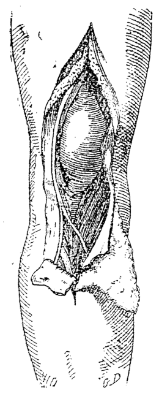
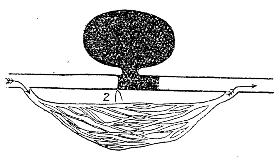
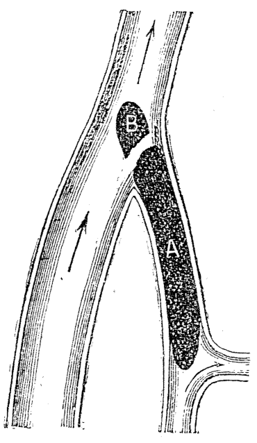
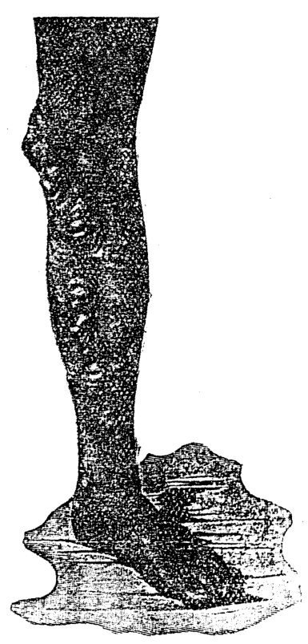

# 第三十三章 血之病及心臟病 (Huih ê Pīⁿ kap Sim-chhông-pīⁿ)

> **所屬篇章**：第四篇 內科看護學 (Lāi-kho Khàn-hō͘-ha̍k)
> **原書頁碼**：第 544 頁 ～ 第 559 頁 (已收錄 16/16 頁)

---

<!-- Page 544 Start -->
#### 📖 原書第 544 頁

### TĒ 33 CHIUⁿ
### LŪN HUIH Ê PĪⁿ KAP SIM-CHŌNG PĪⁿ

---

**[Pîn-hiat]**  
Pîn-hiat chèng chiū-sī pīⁿ-lâng ê huih, kap chhiah-huih-kiû í-kip huih-kiû-sò͘ (huih-kiû-lāi ê âng chit, *hæmoglobin*), ū kiám-chió.

> **【全漢對照】**  
> **【貧血】**  
> 貧血症就是病人的血，及赤血球以及血球素（血球內的紅質，*haemoglobin*），有減少。

---

**[Goân-in]**  
Pîn-hiat ê goân-in sī chin chōe, tī chia bōe bián-tit tio̍h kán-séng kóng. Chhin-chhiūⁿ sit-bu̍t put-chiok, siau-hòa-put-liông, lâng khiā tī ak-chak ê chhù, chhù-lāi ji̍t-kng bōe thang chiò-ji̍p-khì. Iā koh chi̍t chéng ê goân-in, chiū-sī tùi chhut-huih chhin-chhiūⁿ siⁿ lāi-tī-hu̍t (內 痔 核), á-sī siⁿ ūi-iông, bān-sèng ê pīⁿ, tī seng-khu siⁿ ok-sèng ê chéng-iông (惡 性 腫 瘍, *cancer*), lâng chia̍h sím-mi̍h to̍k io̍h, tī pak-tó-lāi ū kià-seng-thâng (寄 生 蟲). Chiah-ê sī in-ūi pa̍t mi̍h pīⁿ lâi tì pîn-hiat-ê, sī in-ūi kok chéng kín-kip, á-sī kú-tn̂g ê pīⁿ lâi khí-ê.

> **【全漢對照】**  
> **【原因】**  
> 貧血的原因是真多，佇遮袂免得著簡省講。親像食物不足、消化不良，人企佇阨齷的厝，厝內日光袂通照入去。也閣一種的原因，就是對出血親像生內痔核（內痔核），抑是生胃瘍、慢性的病，佇身軀生惡性的腫瘍（惡性腫瘍，*cancer*），人食甚麼毒藥，佇腹肚內有寄生蟲（寄生蟲）。諸個是因為別物病來致貧血的，是因為各種緊急、抑是久長（久長）的病來起的。

---

**[Chèng-chōng]**  
Chèng-chōng: Chiū-sī bīn-sek n̂g-n̂g, pe̍h-pe̍h, chhiⁿ-chhiⁿ, ho͘-khip kan-khó͘, kha chhiú sng, thâu-khak hîn á-sī thiàⁿ, bô ài chia̍h pn̄g, ū-sî pì-kiat, siau-hòa-put-liông. Chhùi-tûn, ba̍k-chiu-kiat-mo̍h, chhùi-khí-hōaⁿ, kap ta̍k ūi ê liâm-mo̍h khah bô âng. Nā chiong huih lâi giām, sī khah chheng, kiám-chió huih-kiû kap huih-kiû-sò͘.

> **【全漢對照】**  
> **【症狀】**  
> 症狀：就是面色黃黃、白白、青青，呼吸艱苦，跤手酸，頭殼眩抑是疼，無愛食飯，有時秘結、消化不良。嘴脣、目珠結膜、齒岸（齒齦），及逐位的粘膜較無紅。若將血來驗，是較清，減少血球及血球素。

---

**[Tī-liâu]**  
Tī-liâu-hoat: Tio̍h tó tī bîn-chhng hioh-khùn an-chēng-liâu-hoat; chia̍h hó ê sit-bu̍t, chù-ì tāi-piān, khong-khì kap ji̍t ê kng khah-chōe. Ū-sî khì tòa soaⁿ-téng á-sī hái-kīⁿ. Khah sió-sim chiàu-kò͘. Goân-in ê tī-liâu-hoat. Iā tio̍h chia̍h *ferrum* kap *arsenicum* ê io̍h. Nā ū sím-mi̍h pa̍t mi̍h pīⁿ, chhin-chhiūⁿ siⁿ lāi-tī, á-sī siⁿ ūi-iông, á-sī pak-lāi ū thâng, hiah-ê tio̍h sòa i-tī. Nā ū pì-kiat só͘ ēng ê io̍h sī *aloes*, *cascara sagrada*, kap *magnesii sulphas*.

> **【全漢對照】**  
> **【治療】**  
> 治療法：著倒佇眠床歇困安靜療法；食好的食物，注意大便，空氣及日的光較多。有時去蹛山頂抑是海墘。較小心照顧。原因的治療法。也著食 *ferrum*（鐵）及 *arsenicum*（砒霜/砷劑）的藥。若有甚麼別物病，親像生內痔，抑是生胃瘍，抑是腹內有蟲，遐的著續醫治。若有秘結所用的藥是 *aloes*（蘆薈），*cascara sagrada*（美鼠李），及 *magnesii sulphas*（硫酸鎂）。

<!-- Page 544 End -->

---

<!-- Page 545 Start -->
#### 📖 原書第 545 頁

520 HUIH Ê PĪⁿ KAP SIM-CHŌNG PĪⁿ

### Ok-sèng pe̍h-huih pīⁿ / Chèng-chōng（惡性白血病／症狀）

Ok-sèng pe̍h-huih pīⁿ (惡性白血病, *Pernicious anæmia*): Chit ê pīⁿ sī chin lī-hāi. I ê goân-in iáu-bē chai, kiám-chhái sī in-ūi tī seng-khu-lāi ū sím-mih to̍k-chit, á-sī tī tng-lāi ū khip-siu sím-mih to̍k-chit, tì-kàu chit hō pīⁿ. I ê chèng-chōng sī chhin-chhiūⁿ téng-bīn í-keng kóng, kan-ta khah siong-tiōng. Lâm pí lú khah-siông tú-tio̍h, iā sī 30 hè í-siōng ê lâng. Siàu-liân lâng hán-tit. Bīn-sek pe̍h koh n̂g, chhin-chhiūⁿ khah pe̍h ê kiat-á hit hō. Me̍h-phok khah kín, soe-jio̍k, bô chiàu chhù-sū; ho͘-khip, khah kín koh té. Áu-thò͘. Lâng nā ū chit hō pīⁿ, khoài-khoài tùi phīⁿ-khang chhut-huih, á-sī chhut-huih tī ba̍k-chiu. Ok-sèng pe̍h-huih pīⁿ bōe táⁿ-tiap-tit; ū-sî ōe khah hó tām-po̍h, m̄-kú khah-siông tī chi̍t nî ê tiong-kan pīⁿ-lâng ōe kè-óng.

> **【全漢對照】**
> 惡性白血病（惡性白血病, *Pernicious anæmia*）：這个病是真利害。伊的原因猶未知，減採是因為佇身軀內有甚麼毒質，抑是佇腸內有吸收甚麼毒質，致到這號病。伊的症狀是親像頂面已經講，干焦較傷重。男比女較常抵著，抑是30歲以上的人。少年人罕得。面色白閣黃，親像較白的桔仔彼號。脈搏較緊，衰弱，無照秩序；呼吸，較緊閣短。嘔吐。人若有這號病，快快對鼻孔出血，抑是出血佇目珠。惡性白血病𣍐打疊得；有時會較好淡薄，毋過較常佇一年の中間病人會過往。

---

### Tī-liâu（治療）

Tī-liâu: Pīⁿ-lâng tio̍h tó tī bîn-chhng, an-chēng-tī-liâu-hoat, bo̍h-tit hō͘ i ka-kī tín-tāng chòe tāi-chì. Chhùi tio̍h sóe chheng-khì. Tio̍h ēng chu-ióng-si̍t-bu̍t hō͘ i chia̍h, chhin-chhiūⁿ gû-leng, koe-nn̄g, gû-bah-chiap, gû-bah chhiat iù-iù. Ū-sî tio̍h ēng kiông-sim-che chhin-chhiūⁿ *brandy* chiú. Chia̍h io̍h bô sím-mih kong-hāu, ū-sî *arsenicum* sī hó, iā thih ê lūi thang ēng. Ū-sî i-seng chiong kut-chhé hō͘ i chia̍h, kiám-chhái ōe lī-ek chit hō pīⁿ-lâng, m̄-kú sī chiām-sî nā-tiāⁿ.

> **【全漢對照】**
> 治療：病人著倒佇眠床，安靜治療法，莫得予伊家己振動做代誌。嘴著洗空氣（清潔）。著用滋養食物予伊食，親像牛乳、雞卵、牛肉汁、牛肉切幼幼。有時著用強心劑親像 *brandy* 酒。食藥無甚麼功效，有時 *arsenicum*（砒劑）是好，抑鐵的類通（可以）用。有時醫生將骨髓予伊食，減採會利益這號病人，毋過是暫時爾定。

---

### Hiat-iú pīⁿ（血友病）

Hiat-iú pīⁿ (血友病, *Hæmophilia*): Lâng nā ū chit hō pīⁿ tùi sió-khóa ê in-toaⁿ khoài-khoài lâu huih, ū-sî bán chhùi-khí liáu-āu, huih tiāⁿ-tiāⁿ lâu oh-tit chí. Chiah ê pīⁿ-lâng khah-siông siàu-liân ê sî chiū kè-óng. Bô hoat-tō͘ thang táⁿ-tiap. Chit hō pīⁿ sī ûi-thoân ê pīⁿ, iā sī tùi hū-jîn-lâng lâi ûi-thoân. Phì-lūn lāu-bú nā ū hiat-iú pīⁿ, i ê ta-po͘ gín-ná ōe tú-tio̍h, chóng-sī cha-bó͘ gín-ná bōe, khah-siông sī án-ni. Nā ū só͘-chāi teh lâu huih, ēng *adrenalin chloride* (1 : 1,000) lâi chí, hō͘ i bōe lâu.

> **【全漢對照】**
> 血友病（血友病, *Hæmophilia*）：人若有這號病對小可的原因快快流血，有時拔嘴角（拔牙）了後，血常常流戇得（難得）止。諸個病人較常少年的時就過往。無法度通打疊。這號病是遺傳的病，抑是對婦人人來遺傳。比論老母若有血友病，伊的查埔囡仔會抵著，總是查某囡仔𣍐，較常是按呢。若有所在咧流血，用 *adrenalin chloride*（副腎素，1 : 1,000）來止，予伊𣍐流。

<!-- Page 545 End -->

---

<!-- Page 546 Start -->
#### 📖 原書第 546 頁

## CHI-PAN PĪⁿ, SIM-CHŌNG PĪⁿ（521）

---

### Chí-pan pīⁿ (紫斑病)

Chí-pan pīⁿ (紫斑病, *Purpura*): Tēng-gī: Khak-si̍t chit hō pīⁿ m̄-sī pīⁿ, sī kúi-nā khoán pīⁿ ê chèng-chōng, i ê khoán-sit sī tī phê-ē ū chhut-huih, á-sī chhut-pan, só͘-í kiò-chòe chí-pan pīⁿ. Chiah ê pan ū-sî khah sió-khóa, ū-sî khah tōa. I ê ti̍t-kèng sī chi̍t mm. chì sì mm. (Saⁿ mm. sī chha-put-to chi̍t hun ê tn̂g.)

> **【全漢對照】**
> 紫斑病（紫斑病，*Purpura*）：定義：確實這號病毋是病，是幾若款病的症狀，伊的款式是佇皮下有出血，抑是出斑，所以叫做紫斑病。諸個斑有時較小許，有時較大。伊的直徑是一 mm. 至四 mm.。（三 mm. 是差不多一分之長。）

---

Chit ê pīⁿ thang hun chòe kúi-nā khoán, tī chia kan-ta beh kóng n̄g khoán, chiū-sī toaⁿ-sûn-sèng chí-pan pīⁿ (單純性紫斑病, *simple purpura*) kap chhut-huih-sèng chí-pan pīⁿ (出血性紫斑病, *hæmorrhagic purpura*).

> **【全漢對照】**
> 這个病通分做幾若款，佇遮干單欲講兩款，就是單純性紫斑病（單純性紫斑病，*simple purpura*）佮出血性紫斑病（出血性紫斑病，*hæmorrhagic purpura*）。

---

### Toaⁿ-sûn-sèng chí-pan pīⁿ

Chit ê toaⁿ-sûn-sèng chí-pan pīⁿ sī khah khin-ê, iā chhut-huih tī phê-ē nā-tiāⁿ, khah khoài hó. Chit-ê khah-siông sī gín-ná lâng tú-tio̍h-ê.

> **【全漢對照】**
> 這个單純性紫斑病是較輕的，也出血佇皮下若定，較快好。這个較常是囡仔人抵著的。

---

### Chhut-huih-sèng chí-pan pīⁿ

Chhut-huih-sèng chí-pan pīⁿ sī khah siong-tiōng ê pīⁿ. Pīⁿ-lâng soe-jio̍k, sì-ûi chí-pan, i ê sek sī chí-sek; liâm-mo̍h-ē iā ū chhut-pan, chhùi-lāi, ūi-lāi, tn̂g-lāi lóng ū.

> **【全漢對照】**
> 出血性紫斑病是較傷重的病。病人衰弱，四圍紫斑，伊的色是紫色；粘膜下也有出斑，喙內、胃內、腸內攏有。

---

### Tī-liâu

Tī-liâu: An-chēng-liâu-hoat. Pīⁿ-lâng tio̍h tó tī bîn-chhng. Tio̍h kéng liû-tōng chu-ióng ê si̍t-bu̍t. Tio̍h hó ê khong-khì, iā tio̍h kiòng-chòng-che. Chí huih ê iòh sī *calcii chloridum* á-sī *calcii lactas*, 1.3 grm., chi̍t ji̍t saⁿ pái. Iā chiah ê iòh ū-sî sī hó ēng, *acidum sulphuricum aromaticum*, *ergota*, *acidum tannicum*, *adrenalin*.

> **【全漢對照】**
> 治療：安靜療法。病人著倒佇眠牀。著揀流動滋養的食物。著好的空氣，也著強壯劑。止血的藥是 *calcii chloridum* 抑是 *calcii lactas*，1.3 grm.，一日三擺。也諸個藥有時是好用，*acidum sulphuricum aromaticum*, *ergota*, *acidum tannicum*, *adrenalin*.

---

### Sim-chōng pīⁿ

Sim-chōng pīⁿ (心臟病, *Heart disease*): Lán tio̍h ōe-kì-tit sim-chōng ê thé chiū-sī kun-bah só͘ chiâⁿ-ê; sim ê gōa-bīn ū mo̍h pau-teh sī put-chí kng-kut koh jūn, kiò sim-lông (心囊, *pericardium*); sim-lāi ū chi̍t-ê kùt-kút ê mo̍h kiò-chòe sim-chōng-lāi-mo̍h (*endocardium*). Chiah ê cho͘-chit lóng ōe tú-tio̍h iām-chèng, á-sī sím-mi̍h pát khoán ê pīⁿ.

> **【全漢對照】**
> 心臟病（心臟病，*Heart disease*）：咱著會記得心臟的體就是筋肉所成的；心的外面有膜包咧是不止光滑閣韌，叫心囊（心囊，*pericardium*）；心內有一個滑滑的膜叫做心臟內膜（*endocardium*）。諸個組織攏會抵著炎症，抑是甚麼別款的病。

---

### [頁底格言 / 經文]

Nā bē chiong iòh hō͘ pīⁿ-lâng chia̍h, m̄-thang kóng ū chia̍h. Kan-ta hē iòh tī sin-piⁿ bô kàu-gia̍h; tio̍h khòaⁿ i sit-chāi ū chia̍h á-bô.

> **【全漢對照】**
> 若未將藥予病人食，毋通講有食。干單下藥佇身邊無夠額；著看伊實在有食抑無。

---

Góa siat-sú ōe kóng lâng kap thiⁿ-sài ê im-gú, nā bô jîn-ài, góa chiū chiâⁿ-chòe hiáng ê tâng-khì, tân ê lâ-poah (I Ko-lîm-to 13: 1).

> **【全漢對照】**
> 我設使會講人佮天使的言語，若無仁愛，我就成做響的銅器、鳴的喇叭（哥林多前書 13: 1）。

<!-- Page 546 End -->

---

<!-- Page 547 Start -->
#### 📖 原書第 547 頁

### 522 HUIH Ê PĪⁿ KAP SIM-CHŌNG PĪⁿ

**[Sim-chōng pīⁿ]**

Tī chia beh iok-lio̍k kóng :  
Sim-lông-iām (心囊炎, *Pericarditis*).  
Sim-kun-iām (心筋炎, *Myocarditis*).  
Sim-chōng-khok-tiong (心臟擴張, *Cardiac dilatation*).  
Iû-sim (脂心, 脂肪心臟, *Fatty heart*).  
Sim-chōng-lāi-mo̍h-iām (心臟內膜炎, *Endocarditis*).  
Sim-chōng-piān-mo̍h-iām (心臟瓣膜炎, *Valvular disease*).  
Cheng-bō-piān-pì-só-put-choân (僧帽瓣閉鎖不全, *Mitral regurgitation*).  
Cheng-bō-piān-hia̍p-chek (僧帽瓣狹窄, *Mitral stenosis*).  
Tāi-tōng-me̍h-chit-pēⁿ (大動脈疾病, *Aortic disease*).  
Sian-thian-sèng sim-chōng pīⁿ (先天性心臟病, *Congenital heart disease*).  
Hia̍p-sim chèng (狹心症, *Angina pectoris*).  
Tōng-me̍h-liû (動脈瘤, *Aneurysm*).

> **【全漢對照】**
> **[心臟病]**  
> 佇遮欲約略講：  
> 心囊炎（心囊炎, *Pericarditis*）。  
> 心筋炎（心筋炎, *Myocarditis*）。  
> 心臟擴張（心臟擴張, *Cardiac dilatation*）。  
> 油心（脂心、脂肪心臟, *Fatty heart*）。  
> 心臟內膜炎（心臟內膜炎, *Endocarditis*）。  
> 心臟瓣膜炎（心臟瓣膜炎, *Valvular disease*）。  
> 僧帽瓣閉鎖不全（僧帽瓣閉鎖不全, *Mitral regurgitation*）。  
> 僧帽瓣狹窄（僧帽瓣狹窄, *Mitral stenosis*）。  
> 大動脈疾病（大動脈疾病, *Aortic disease*）。  
> 先天性心臟病（先天性心臟病, *Congenital heart disease*）。  
> 狹心症（狹心症, *Angina pectoris*）。  
> 動脈瘤（動脈瘤, *Aneurysm*）。

---

### [Sim-lông-iām]

Sim-lông-iām : Chit hō pīⁿ ê goân-in sī :  
1. Kip-sèng lú-mâ-chit-su (僂痲質斯, *rheumatism*), á-sī lú-mâ-chit-su-sèng píⁿ-thô-chôaⁿ-iām (扁桃腺炎).  
2. Thoân-jiám pīⁿ chhin-chhiūⁿ hì-iām, seng-hông-jia̍t (猩紅熱, *scarlet fever*), téng hāng.  
3. Sán-jio̍k-jia̍t (產褥熱, *puerperal fever*), pāi-huih chèng (敗血症, *septicæmia*), kut-hoāi-chu (骨壞疽).  
4. Kiat-hu̍t chèng (結核症).  
5. Bān-sèng sīn-chōng pīⁿ (慢性腎臟病).  
6. Hú-pāi-sèng sim-kun-iām (腐敗性心筋炎), uì-iông-sèng sim-chōng-lāi-mo̍h-iām (潰瘍性心臟內膜炎).  
7. Bô-tiuⁿ-tî chha̍k-tio̍h heng-khám.  
Sim-lông goân-pún sī ku̍t-ku̍t ê liâm-mo̍h, chhin-

> **【全漢對照】**  
> **[心囊炎]**  
> 心囊炎：這號病的原因是：  
> 1. 急性僂痲質斯（僂痲質斯, *rheumatism*），抑是僂痲質斯性扁桃腺炎（扁桃腺炎）。  
> 2. 傳染病親像肺炎、猩紅熱（猩紅熱, *scarlet fever*）等項。  
> 3. 產褥熱（產褥熱, *puerperal fever*）、敗血症（敗血症, *septicæmia*）、骨壞疽（骨壞疽）。  
> 4. 結核症（結核症）。  
> 5. 慢性腎臟病（慢性腎臟病）。  
> 6. 腐敗性心筋炎（腐敗性心筋炎）、潰瘍性心臟內膜炎（潰瘍性心臟內膜炎）。  
> 7. 無張持插著胸坎。  
> 心囊原本是滑滑的粘膜，親──

<!-- Page 547 End -->

---

<!-- Page 548 Start -->
#### 📖 原書第 548 頁

**SIM-LÔNG-IĀM, SIM-KUN-IĀM**
**523**

---

### [Sim-lông-iām (心囊炎續)]

chhiūⁿ heng-mó̍h ê khoán. Nā hoat-iām, chit ê liâm-mó̍h piàn-ōaⁿ, sī chho͘-chho͘ liâm-liâm; bô lōa-kú tī sim-lông-lāi ū chhut sim-lông-e̍k khah-chōe, ū-sî 1,000.0 c.c. chì 1,500.0 c.c. ê chōe.

> **【全漢對照】**
> 像胸膜的款。若發炎，這个黏膜變換，是粗粗黏黏；無偌久佇心囊內有出心囊液較多，有時 1,000.0 c.c. 至 1,500.0 c.c. 的多。

---

### Chèng-chōng (症狀)

Chèng-chōng: Tī goân-in pīⁿ ê tiong-kan ū koh ke-thiⁿ sim-lông-iām ê chèng-chōng, chiàu kī tī ē-tóe: heng-khám tò-pêng tī sim ê thâu-chêng thiàⁿ. Chit ê thiàⁿ sī tùi sim-lông-mó̍h ê nn̄g pêng sio bôa-tio̍h; i-seng nā ēng thiaⁿ-chín-khì lâi thiaⁿ, ū bôa-tio̍h ê siaⁿ. Thé-un khah koân. Sim-lông nā ū chek-chū sim-lông-e̍k, chiū sim-lông-mó̍h nn̄g pêng bē saⁿ-bôa-tio̍h, án-ni bē thiàⁿ, iā hit sî-chūn hit ê bôa-tio̍h ê siaⁿ-im bô-khì. Pīⁿ-lâng ê bīn-sek sī chíⁿ-lâm, i ê chêng-hêng sī kan-khó͘, iu-thâu khó-bīn, chin siong-tiōng ê khoán-sit. Hó͘-khip-khùn-lân. Sim teh phok bô chiàu chhù-sū, iā kín, khah soe-jia̍k.

> **【全漢對照】**
> **症狀：** 佇原因病的中間有閣加添心囊炎的症狀，照記佇下底：胸坎倒爿佇心頭前疼。這个疼是對心囊膜的兩爿相磨著；醫生若用聽診器來聽，有磨著的聲。體溫較懸。心囊若有積聚心囊液，就心囊膜兩爿𣍐相磨著，按呢𣍐疼，也彼時陣彼个磨著的聲音無去。病人的面色是紫藍，伊的情形是艱苦，懮頭苦面，真正重（傷重）的款式。呼吸困難。心咧搏無照秩序，也緊，較衰弱。

---

### Tī-liâu (治療)

Tī-liâu: Tio̍h hō͘ pīⁿ-lâng tó-teh, bo̍h-tit hō͘ i tín-tāng chhut la̍t, siông-siông hō͘ i ōe chēng-ióng-tit, bo̍h-tit khì kiáu-jiáu i. Nā pīⁿ-lâng ū tio̍h tín-tāng ê tāi-chì, khàn-hō͘ tio̍h pang-chān i. Tio̍h kēng liû-tōng chu-ióng ê si̍t-bu̍t. Chí thiàⁿ ê hoat-tō͘ tio̍h ēng un-phâ-pò hē sim ê só͘-chāi, m̄-thang siuⁿ tāng. Ū-sî ēng peng-phâ-pò. Nā sim-lông ū chek-chū sim-lông-e̍k siuⁿ chōe, thang ēng *linimentum iodi* kā chhat phê-hu tī sim ê thâu-chêng. Ū-sî i-seng tio̍h ēng gô-khî lâi suh-huih ê hoat. Ū-sî ēng peng. Ū-sî i-seng tio̍h chhng-chhì-su̍t, chiong hit ê e̍k thiu-khí-lâi.

> **【全漢對照】**
> **治療：** 著予病人倒咧，莫得予伊振動出力，時常予伊會靜養得，莫得去攪擾伊。若病人有著振動的代誌，看護著幫贊伊。著揀流動滋養的食物。止疼的法度著用溫罨布（溫敷布）格心的所在，毋通傷重。有時用冰罨布。若心囊有積聚心囊液傷多，通用 *linimentum iodi*（碘擦劑）共擦皮膚佇心頭前。有時醫生著用鵝蜞（水蛭）來吸血的法。有時用冰。有時醫生著穿刺術，將彼个液抽起來。

---

### Io̍h-bu̍t-liâu-hoat (藥物療法)

Io̍h-bu̍t-liâu-hoat: *Ether*, *strychnina*, *spiritus ammoniæ aromaticus*, *alcohol*. Nā teh-beh hó ê sî tio̍h ēng kiông-chòng-che.

> **【全漢對照】**
> **藥物療法：** *Ether*（乙醚）, *strychnina*（士的寧/番木鱉鹼）, *spiritus ammoniæ aromaticus*（芳香氨醑）, *alcohol*（酒精）。若欲卜好的時著用強壯劑。

---

### Sim-kun-iām (心筋炎)

Sim-kun-iām: Chit ê pīⁿ sī sim ê kun-bah hoat-iām, ū hun kip-sèng-ê, bān-sèng-ê. Kip-sèng-ê sī tī pát hō pīⁿ-ê

> **【全漢對照】**
> **心筋炎：** 這个病是心的筋肉（心肌）發炎，有分急性的、慢性的。急性的是佇別號病的……

---

Koh só͘ ǹg-bāng tī koán-ke-ê, sī ài tit i chīn-tiong (I Ko-lîm-to 4: 3).

> **【全漢對照】**
> 閣所向望佇管家的，是愛得伊盡忠（哥林多前書 4: 3）。

<!-- Page 548 End -->

---

<!-- Page 549 Start -->
#### 📖 原書第 549 頁

## 524 HUIH Ê PĪⁿ KAP SIM-CHŌNG PĪⁿ

tiong-kan chhin-chhiūⁿ sió-tng-jia̍t, sit-hû-te̍k-lí-a, seng-hông-jia̍t, sim-chōng-lāi-mo̍h-iām, chiah khí. Tī chit hō pīⁿ ê sî, sim-kun ōe sìⁿ kúi-nā ê sòe lia̍p lâng-iōng. Hit hō bān-sèng-ê, khah-siông sī 35 hè í-siōng ê lâng ōe tú-tio̍h.

> **【全漢對照】**
> 中間親像小腸熱（傷寒）、*sit-hû-te̍k-lí-a*（白喉）、猩紅熱、心臟內膜炎，即起。佇此號病的時，心筋會生幾若個細粒膿瘍。許號慢性的，較常是 35 歲以上的人會抵著。

---

### Sim-khok-tiong（心擴張）

Sim-chōng-khok-tiong chèng sī sim tiòng tōa. Lâng nā ū sim-chōng-piān-mo̍h-iām, iû-sim, sim-kun-iām, ōe tú-tio̍h sim-chōng-khok-tiong chèng.

> **【全漢對照】**
> 心臟擴張症是心脹大。人若有心臟瓣膜炎、油心、心筋炎，會抵著心臟擴張症。

---

### Iû-sim（油心）

Iû-sim : Chit hō pīⁿ sī sim kun-bah ê tiong-ng ū khah-chōe iû-chit tī-teh, á-sī sim kun-bah pìⁿ-chiâⁿ iû-chit. Sim sī pí pêng-siông-sî khah tōa, khoài-khoài pìⁿ-chiâⁿ sim-khok-tiong chèng. Iû-sim (脂心) ê goân-in sī lāu lâng, bān-sèng pīⁿ, ok-e̍k chèng, pîn-hiat, chia̍h chiú, *phosphorus* kap *arsenicum* ê tiòng-to̍k, sim-lông-iām, sim-chōng-pûi-tōa (心臟肥大, cardiac hypertrophy).

> **【全漢對照】**
> 油心：此號病是心筋肉的中央有較多油脂佇咧，抑是心筋肉變成油脂。心是比平常時較大，快快變成心擴張症。油心（脂心）的原因是老人、慢性病、惡疫症（惡液質）、貧血、食酒、*phosphorus*（磷）及 *arsenicum*（砒霜）的中毒、心囊炎、心臟肥大（心臟肥大, cardiac hypertrophy）。

---

### Chèng-chōng（症狀）

Chèng-chōng sī goân-in pīⁿ-ê, pîn-hiat, thâu-khak hîn, ho-khip-khùn-lân, kha ōe chéng, me̍h-phok ū-sî bān-bān, iā bô sím-mi̍h la̍t.

> **【全漢對照】**
> 症狀是原因病的、貧血、頭殼眩、呼吸困難、跤會腫、脈搏有時慢慢，亦無甚物力。

---

### Sim-chōng-lāi-mo̍h-iām（心臟內膜炎）

Sim-chōng-lāi-mo̍h-iām sī sim ê lāi-mo̍h hoat-iām ; khah-siông iām-chèng sī óa tī piān-mo̍h ê só͘-chāi. Iām ū hun kip-sèng sim-chōng-lāi-mo̍h-iām kap bān-sèng sim-chōng-lāi-mo̍h-iām. Iā kip-sèng-ê ū hun liông-sèng sim-chōng-lāi-mo̍h-iām, kap ùi-iông-sèng sim-chōng-lāi-mo̍h-iām.

> **【全漢對照】**
> 心臟內膜炎是心的內膜發炎；較常炎症是倚佇瓣膜的所在。炎有分急性心臟內膜炎及慢性心臟內膜炎。亦急性的有分良性心臟內膜炎，及潰瘍性心臟內膜炎。

---

### Liông-sèng sim-chōng-lāi-mo̍h-iām（良性心臟內膜炎）

Liông-sèng sim-chōng-lāi-mo̍h-iām ê goân-in khah-siông sī tùi lú-mâ-chit-su ê pīⁿ hit lūi chiah khí; á-sī tùi thoân-jiám pīⁿ. Chit hō pīⁿ ê só͘-chāi khah-siông sī sim chó-pêng ê piān-mo̍h hoat-iām. Chit ê piān-mo̍h-iām nā khah khin, hó liáu-āu, ū-sî hit ê piān-mo̍h ōe hó chhin-chhiūⁿ chá ê khoán ; m̄-kú hit ê sim-piān-mo̍h in-ūi hoat-iām, ū-sî kiat kui pa, án-ni chiū hit ê lâng it-seng ū tī kú-tng ê sim-chōng pīⁿ.

> **【全漢對照】**
> 良性心臟內膜炎的原因較常是對 *lú-mâ-chit-su*（風濕）的病彼類即起；抑是對傳染病。此號病的所在較常是心左旁的瓣膜發炎。此個瓣膜炎若較輕，好了後，有時彼個瓣膜會好親像早的款；毋過彼個心瓣膜因為發炎，有時結歸葩（結疤），按呢就彼個人一生有佇久長的心臟病。

---

### Ùi-iông-sèng sim-chōng-lāi-mo̍h-iām（潰瘍性心臟內膜炎）

Ùi-iông-sèng sim-chōng-lāi-mo̍h-iām, sī put-chí siong-

> **【全漢對照】**
> 潰瘍性心臟內膜炎，是不止傷-

<!-- Page 549 End -->

---

<!-- Page 550 Start -->
#### 📖 原書第 550 頁

### SIM-CHŌNG-PIĀN-MÓ͘H-IĀM（525 頁）

...tiōng ê pīⁿ, khah-siông lâng nā ū chit hō pīⁿ, bōe táⁿ-tiàp-tit. Ū-sî sim piān-mó͘h phòa-nōa, ū-sî piān-mó͘h sìⁿ chin chōe hoat-iām ê lia̍p-á kiò-chòe sim-piān-mó͘h-iām-lia̍p (*Sim-piān-mó͘h-iām-lia̍p*) (心瓣膜炎粒, *vegetations on heart valves*); ū-sî chit hō ê lia̍p-á sòaⁿ-sòaⁿ sì-kòe ū sòa jip tī tōng-me̍h-lāi, sūn-khoân kàu tī seng-khu ê chiòng-khì, tì-kàu chiòng-khì iā hoat-iām. Chiah ê hoat-iām ê lia̍p-á nā thoân kàu tī náu, hit ê lâng chiū ū poàn-sin-put-sūi ê chèng (poàn-sin-bâ-pì) ; nā kàu tī sīn-chōng chiū khí sīn-chōng-iām, jiō-lāi ōe ū huih ; nā kàu tī phî-chōng, phî-chōng ōe thàng-thiàⁿ chéng-tōa. Chit hō ùi-iông-sèng sim-chōng-lāi-mó͘h-iām, khah-siông nn̄g saⁿ jit khí, kàu la̍k lé-pài ûi-chí chiū sí.

> **【全漢對照】**
> （...重）的病，較常人若有這號病，袂抵接得（無法應付）。有時心瓣膜破爛，有時瓣膜生真多發炎的粒仔叫做心瓣膜炎粒（*心瓣膜炎粒*）（心瓣膜炎粒, *vegetations on heart valves*）；有時這號的粒仔散散四界，有續入佇動脈內，循環到佇身軀的瘴氣（器官），致到瘴氣亦發炎。遮的發炎的粒仔若傳到佇腦，彼個人就有半身不遂的症（半身麻痺）；若到佇腎臟就起腎臟炎，尿內會有血；若到佇脾臟，脾臟會痛疼腫大。這號潰瘍性心臟內膜炎，較常兩三日起，到六禮拜為止就死。

---

### Tī-liâu（治療）

Tī-liâu : Lâng nā ū chit hō pīⁿ tē it iàu-kín sī tióh an-chēng tó tī bîn-chhng, iā m̄-thang hō͘ i tín-tāng. Chit hō hioh-khùn ê lí-khì sī beh hō͘ huih ê sūn-khoân khah bān, hō͘ piān-mó͘h ê iām khah khoai thè. Iā koh chit hāng sī ài tī-hông hiah ê hoat-iām ê lia̍p-á, sim-piān-mó͘h-iām-lia̍p tùi piān-mó͘h jip huih khì pàt ūi. (*Tī-liâu*)

> **【全漢對照】**
> 治療：人若有這號病第一要緊是著安靜倒佇眠床，亦唔通互伊振動。這號歇睏的理氣（理由）是要互血的循環較慢，互瓣膜的炎較快退。亦閣一項是愛提防遐的發炎的粒仔、心瓣膜炎粒對瓣膜入血去別位。（*治療*）

---

### Sim-chōng-piān-mó͘h-iām（心臟瓣膜炎）

Sim-chōng-piān-mó͘h-iām : Tī téng-bīn kóng-khí sim-chōng-lāi-mó͘h-iām ê sî, ū kóng hit ê khah-siông ū liân-lūi tióh piān-mó͘h, án-ni khiok sī ū iàⁿ, chit hō sim-chōng-piān-mó͘h-iām khah-chōe sī tùi sim-chōng-lāi-mó͘h-iām chiah khí. Sim ê chó-pêng só͘ chòe ê kang sī pí iū-pêng ê kang khah-chōe, iā chó-pêng ê huih-ap (血壓, *blood pressure*) sī khah koâiⁿ, só͘-í piān-mó͘h-iām khah-siông sī tī chó-pêng ê piān-mó͘h, chiū-sī tāi-tōng-me̍h-piān (大動脈瓣, *aortic valve*), kap cheng-bō-piān (僧帽瓣, *mitral valve*). (*Sim-chōng-piān-mó͘h-iām*)

> **【全漢對照】**
> 心臟瓣膜炎：佇頂面講起心臟內膜炎的時，有講彼個較常有連累著瓣膜，按呢卻是有影，這號心臟瓣膜炎較多是對心臟內膜炎才起。心的左邊所做之工是比右邊的工較多，亦左邊的血壓（血壓, *blood pressure*）是較懸，所以瓣膜炎較常是佇左邊的瓣膜，就是大動脈瓣（大動脈瓣, *aortic valve*），及僧帽瓣（僧帽瓣, *mitral valve*）。（*心臟瓣膜炎*）

---

### Sim-chōng-piān-mó͘h-iām ū nn̄g khoán（心臟瓣膜炎有兩款）

Sim-chōng-piān-mó͘h-iām ū nn̄g khoán :
1. Piān-mó͘h siū-siong chiū kiu khah té, bōe tit koaiⁿ kàu ba̍t, hit lāi-bīn ê huih, chiū iû-goân ōe thang koh (*Piān-mó͘h-pì-só͘-put-choân*)

> **【全漢對照】**
> 心臟瓣膜炎有兩款：
> 1. 瓣膜受傷就縮較短，袂得關到密，彼內面的血，就猶原會通閣……（*瓣膜閉鎖不全*）

---

### [頁尾格言]

I-seng nā hoan-hù sím-mih tāi-chì m̄-thang iân-chhiān.

> **【全漢對照】**
> 醫生若吩咐甚麼代誌，唔通延遷（延遲耽擱）。

<!-- Page 550 End -->

---

<!-- Page 551 Start -->
#### 📖 原書第 551 頁

526　　HUIH Ê PĪⁿ KAP SIM-CHŌNG PĪⁿ

lâu tò-tńg-lâi, che miâ kiò-chòe piān-mo̍h-pì-só-put-choân (瓣膜閉鎖不全, regurgitation).

> **【全漢對照】**
> 流倒轉來，這名叫做瓣膜閉鎖不全 (瓣膜閉鎖不全, regurgitation)。

---

### [Piān-mo̍h-hia̍p-chek / 瓣膜狹窄]

2. Chiah ê piān-mo̍h só͘ siú ê khang ōe pìⁿ oe̍h, kiò-chòe piān-mo̍h-hia̍p-chek (瓣膜狹窄, stenosis).

> **【全漢對照】**
> 2. 諸個瓣膜所守的孔會變隘，叫做瓣膜狹窄 (瓣膜狹窄, stenosis)。

---

### [Cheng-bō-piān-mo̍h-pì-só-put-choân / 僧帽瓣膜閉鎖不全]

Nā beh kóng bêng sim-chōng piān-mo̍h-iām ê khoán-sit, beh kéng cheng-bō-piān-pì-só-put-choân (僧帽瓣閉鎖不全, mitral regurgitation) ê pīⁿ lâi soat-bêng. Sim phok-tōng ê sî, hit ê huih ū sak tùi iū-sek kàu hì-tāi-tōng-me̍h, iā tùi chó-sek kàu tāi-tōng-me̍h. Siat-sú cheng-bō-piān bōe tit koaiⁿ kàu ba̍t, chó-sek-lāi ê huih chiū ōe thang lâu tò-tńg-lâi kàu chó-pông. Nā-sī huih chhin-chhiūⁿ án-ni lâu tò-tńg-lâi beh àn-cháiⁿ-iūⁿ? Chó-sek bô la̍t thang sak lóng-chóng ê huih ji̍p tāi-tōng-me̍h, só͘-í chó-pông ti̍h chhut khah-chōe la̍t beh pang-chān chó-sek ê bô kàu. Tùi án-ni chó-pông nā chòe kang khah-chōe, i ê piah chiū-sī sim-kun-bah, ōe khah kāu, kiò-chòe sim-chōng-pûi-tōa.

Kiám-chhái án-ni-siⁿ chiām-sî sim-chōng ōe hoat-tit, chiong huih sak chhut tī tāi-tōng-me̍h. Chóng-sī bô lōa-kú chó-pông bô hoat-tit-tâ-ôa, i sin ê kang siuⁿ kè-thâu, tì-kàu chó-pông-khok-tiong (左房擴張). Chó-pông-lāi ê huih bōe thang lóng ji̍p tī chó-sek, ū-ê thêng-chí, kiò-chòe huih-e̍k-ut-chek (血液鬱積, stagnation of blood).

> **【全漢對照】**
> 若欲講明心臟瓣膜炎的款式，欲揀僧帽瓣閉鎖不全 (僧帽瓣閉鎖不全, mitral regurgitation) 的病來說明。心搏動的時，彼個血有捒對右室到肺大動脈，也對左室到大動脈。設使僧帽瓣袂得關到密，左室內的血就會通流倒轉來到左房。若是血親像按呢流倒轉來欲按怎樣？左室無力通捒攏總的血入大動脈，所以左房著出較多力欲幫贊左室的無夠。對按呢左房若做工較多，伊的壁就是心筋肉，會較厚，叫做心臟肥大。
> 
> 檢綵按呢生暫時心臟會發得，將血捒出佇大動脈。總是無偌久左房無法得奈何，伊身的神工傷過頭，致到左房擴張 (左房擴張)。左房內的血袂通攏入佇左室，有的停止，叫做血液鬱積 (血液鬱積, stagnation of blood)。

---

### [Hì-huih ut-chek, Iū-sek pûi-tōa, Chóng-khì ê huih ut-chek / 肺血鬱積、右室肥大、臟器的血鬱積]

Ti̍h ōe-kì-tit, chó-pông ê huih sī tùi hì-chōng lâi, só͘-í bô lōa-kú hì-chōng-lāi ê huih ut-chek. Hì-chōng ê huih sī tùi iū-sek lâi, só͘-í hit ê iū-sek teh chhut la̍t khah-chōe ài khah-iâⁿ hì-chōng-lāi ê chó͘-tòng, ài sak huih hō͘ i ōe sûn-khoân tùi hì-chōng keng-kè. Án-ni iū-sek ōe pûi-tōa, iā bô lōa-kú i ê la̍t ōe kiám-chió, iā huih-e̍k-ut-chek kàu iū-pông. Chit-ê sī in-ūi saⁿ-chiam-piān ê khang ū piàn tōa, saⁿ-chiam-piān (三尖瓣) koaiⁿ bōe ba̍t, huih ū lâu tò-tńg-lâi kàu iū-pông; bô lōa-kú tī hā-tāi-chēng-me̍h iā huih-e̍k-ut-chek. Nā-sī án-ni bô lōa-kú, huih ut-chek tī chōng-khì, ūi, koaⁿ-chōng, pî-chōng, sīn-chōng,

> **【全漢對照】**
> 著會記得，左房的血是對肺臟來，所以無偌久肺臟內的血鬱積。肺臟的血是對右室來，所以彼個右室咧出力較多，愛較贏肺臟內的阻擋，愛捒血互（予）伊會循環對肺臟經過。按呢右室會肥大，也無偌久伊的力會減少，也血液鬱積到右房。這個是因為三尖瓣的孔有變大，三尖瓣 (三尖瓣) 關袂密，血有流倒轉來到右房；無偌久佇下大靜脈也血液鬱積。若是按呢無偌久，血鬱積佇臟器、胃、肝臟、脾臟、腎臟，

<!-- Page 551 End -->

---

<!-- Page 552 Start -->
#### 📖 原書第 552 頁

### CHÚI-CHÉNG (527)

kap kha ê só͘-chāi. Tùi án-ni chēng-me̍h-kńg-lāi ê huih ut-chek, m̂g-sòe-kńg-lāi ê huih siuⁿ chōe, huih-chiuⁿ chiū ōe siàm-chhut-lâi, ji̍p tī kiat-tè-chit, kiò-chòe chúi-chéng.

> **【全漢對照】**
> 及跤的所在。對按呢靜脈管內之血鬱積，毛細管內之血傷多，血漿就會滲出嚟，入佇結締質，叫做水腫。

---

#### Chúi-chéng（水腫）

Chúi-chéng tāi-seng khòaⁿ-kìⁿ ê só͘-chāi sī tī kha-pôaⁿ. Teh-beh àm ê sî chiah khòaⁿ-kìⁿ, in-ūi kui-ji̍t kiâⁿ-lâi kiâⁿ-khì, huih ōe tūi-lo̍h ē-tóe ê só͘-chāi. Chit ê chúi-chéng ná-kú ná-chōe. Nā chúi-chéng ê só͘-chāi ēng chńg-thâu-á kā chhih, i chiū lap chit u; bōe chhin-chhiūⁿ hó bah, nā chhiú kia̍h-khí-lâi, phê iā tè i phû-khí-lâi. Hit ê chúi-chéng ná-kú ōe chiūⁿ kàu kha-thúi, pak-khang (腹腔), heng-mo̍h-khang. Pak-khang nā chek-chúi, chit hō kiò-chòe pak-chúi (腹水, ascites); heng-mo̍h-khang nā chek-chúi, chit hō kiò-chòe heng-chúi (胸水, pleural effusion). Nā chúi-chéng kàu hiah siong-tiōng chèng-thâu sī tāng, khah tōa bīn bô lōa-kú ōe sí.

> **【全漢對照】**
> 水腫代先看見的所在是佇跤盤。欲暗的時才看見，因為規日行嚟行去，血會墜落下底的所在。這個水腫愈久愈多。若水腫的所在用指頭仔共揤，伊就凹一凹；袂親像好肉，若手攑起來，皮亦隨伊浮起來。彼個水腫愈久會上到跤腿、腹腔、胸膜腔。腹腔若積水，這號叫做腹水（ascites）；胸膜腔若積水，這號叫做胸水（pleural effusion）。若水腫到遐傷重症頭是重，較大面無偌久會死。

---

#### Chúi-chéng sīn kap sim（水腫 腎及心）

Hit ê chúi-chéng ū n̄g hāng iàu-kín ê chèng:
1. Tùi sim-chōng pīⁿ lâi khí, chit-ê khah-chōe sī tāi-seng tùi kha chéng-khí-lâi;
2. Koh chi̍t khoán sī tùi sīn-chōng pīⁿ khí, chit hō khah-chōe sī tāi-seng tùi bīn-nih khí; khùn-khí-lâi ê sî, chiū khah khoài khòaⁿ-kìⁿ chit hō ê chúi-chéng.

> **【全漢對照】**
> 彼個水腫有兩項要緊的症：
> 1. 對心臟病來起，這個較多是代先對跤腫起來；
> 2. 閣一款是對腎臟病起，這號較多是代先對面裡起；睏起來的時，就較快看見這號的水腫。

---

#### Chèng-chōng（症狀）

Chèng-chōng: Sim-chōng-piān-mo̍h-iām ê chèng-chōng khiok sī chin chōe, m̄-kú khah-siông hun chòe sì khoán:

> **【全漢對照】**
> 症狀：心臟瓣膜炎的症狀卻是真多，毋過較常分做四款：

1. **Sim-kùi-khòng-sēng (心悸亢盛, palpitation)**, chiū-sī sim-chōng pho̍k-pho̍k-chhéng. Chit hō chèng-chōng, ta̍k lâng ū-sî ū; phì-lūn, nā hut-jiân kiaⁿ, á-sī hoaⁿ-hí, bat ū sim pho̍k-pho̍k-chhéng, m̄-kú khoài-khoài koh hó-hó.
2. **Ho-khip-khùn-lân (呼吸困難)** chhoán-khùi chin kan-khó.
3. **Thiàⁿ.**

> **【全漢對照】**
> 1. **心悸亢盛（palpitation）**，就是心臟噗噗舂。這號症狀，逐人有時有；譬論，若忽然驚，抑是歡喜，曾有心噗噗舂，毋過快快閣好好。
> 2. **呼吸困難** 喘氣真艱苦。
> 3. **痛。**

<!-- Page 552 End -->

---

<!-- Page 553 Start -->
#### 📖 原書第 553 頁

### 528 HUIH Ê PĪⁿ KAP SIM-CHŌNG PĪⁿ

---

### [Ké-sí]

4. Ké-sí (*syncope*), chiū-sī sim-phok-tōng (心搏動) hut-jiân soah, ū-sî sī chiām-sî nā-tiāⁿ, nā-sī kú chū-jiân lâng ōe sí.

> **【全漢對照】**
> 4. 假死 (*syncope*)，就是心搏動（心搏動）忽然煞，有時是暫時若定，若是久自然人會死。

---

### [Sim-im]

Sim-im: I-seng nā beh chín-toàn chit hō pīⁿ, i ēng thiaⁿ-chín-khì thiaⁿ-kìⁿ heng-khám kúi-nā só͘-chāi, tī hia ū thiaⁿ-kìⁿ sim ê im, thang chai sim ū oân-choân á-bô. Nā sim-chōng-piān-mo̍h-iām hit ê im ū koh-iūⁿ kiò-chòe cha̍p-im (雜音, *murmur*). Chit hō cha̍p-im sī tùi sim ê piān-mo̍h ū koh-iūⁿ, chhin-chhiūⁿ sim-chōng-piān-mo̍h-hia̍p-chek, huih kiâⁿ bōe pīⁿ-pāng.

> **【全漢對照】**
> 心音：醫生若欲診斷這號病，伊用聽診器聽見胸坎幾若所在，佇遐有聽見心的音，通知心有完全抑無。若心臟瓣膜炎彼個音有各樣叫做雜音（雜音, *murmur*）。這號雜音是對心的瓣膜有各樣，親像心臟瓣膜狹窄，血行𣍐平安。

---

Tī téng-bīn ū kóng huih-e̍k-ut-chek ê lí-khì, iā ū kóng hì-chōng-lāi ê huih ū ut-chek, kap pak-tó-lāi ê huih iā sī án-ni. Tùi án-ni pīⁿ-lâng ū sàu, ho͘-khip-khùn-lân, ū-sî khak-huih. Koaⁿ-chōng bōe kiâⁿ i ê chok-iōng, só͘-í pīⁿ-lâng ū-sî ū ǹg-thán. Tùi ūi-nih huih oh-tit tò-tńg-lâi kàu sim, só͘-í siau-hòa-put-liōng, ū-sî thò͘-huih. Sīn-chōng iā bōe kiâⁿ i ê chok-iōng, jiō khah chió, jiō-lāi ū-sî ū nñg-pe̍h-chit kap huih.

> **【全漢對照】**
> 佇頂面有講血液鬱積的理氣，亦有講肺臟內的血有鬱積，及腹肚內的血亦是按呢。對按呢病人有嗽、呼吸困難，有時咯血。肝臟𣍐行伊的作用，所以病人有時有黃疸。對胃裡血惡得倒轉來到心，所以消化不良，有時吐血。腎臟亦𣍐行伊的作用，尿較少，尿內有時有卵白質及血。

---

### [Tī-liâu]

Tī-liâu: Tio̍h an-chēng tī-liâu-hoat. Pīⁿ-lâng teh tó ê sî sim-chōng ê kang sī khah chió, só͘-í khah ū ki-hōe thang i-tī. Pīⁿ-lâng bô lūn sím-mi̍h sū, khàn-hō͘ tio̍h un-jiû siông-sè kā i liâu-lí. M̄-thang chhiⁿ-kông lâi kiáu-jiáu i, hō͘ i sim-lāi ut-chut. Lâng nā ū chit hō chèng, tī pīⁿ tāng ê sî, khàn-hō͘ tio̍h chin sió-sim, kiaⁿ-liáu khoài-khoài ōe síⁿ ji̍k-siong.

> **【全漢對照】**
> 治療：著安靜治療法。病人咧倒的時心臟的工是較少，所以較有機會通醫治。病人無論甚麼事，看護著溫柔詳細共伊料理。毋通青狂來攪擾伊，予伊心內鬱卒。人若有這號症，佇病重的時，看護著真小心，驚了快快會生褥傷。

---

Pīⁿ-lâng nā beh hoan-sin, tio̍h pang-chān i, i m̄-thang ka-kī chhut la̍t.

> **【全漢對照】**
> 病人若欲翻身，著幫贊伊，伊毋通家己出力。

---

### [Tio̍h niû jiō]

Pīⁿ-lâng ê jiō ta̍k ji̍t tio̍h kā i niû khòaⁿ lōa-chōe. I-seng nā chai pīⁿ-lâng ê siáu-piān sī chōe á-sī chió, i chiū ōe chai só͘ ēng ê hoat-tō͘ ū tú-hó á-bô.

> **【全漢對照】**
> 著量尿：病人的尿逐日著共伊量看偌濟。醫生若知病人的小便是有濟抑是少，伊就會知所用的法度有拄好抑無。

---

### [Mî-sî kan-khó͘]

Sim-chōng pīⁿ ê lâng, ū-sî mî-sî khah siong-tiōng, bōe tó, bōe khùn-tit. Tio̍h chiong tōa tè í hō͘ i the-teh, á-sī kí-toh hō͘ i phak-teh, án-ni khah ōe an-tit (tē 117 tô͘).

> **【全漢對照】**
> 暝時艱苦：心臟病的人，有時暝時較傷重，𣍐倒，𣍐睏得。著將大塊椅予伊the咧，抑是几桌予伊仆咧，按呢較會安得（第 117 圖）。

<!-- Page 553 End -->

---

<!-- Page 554 Start -->
#### 📖 原書第 554 頁

## CHÚI-CHÉNG (529)

Chiah ê pīⁿ-lâng ū-sî ho͘-khip-khùn-lân, bōe tó tī bîn-chhng. Nā-sī án-ni tiòh ēng the-í hō͘ i pòaⁿ-the-tó. Ū-sî i-seng chiong *ammoniæ carbonas*, *ether* kap *scilla* hō͘ i chia̍h.

> **【全漢對照】**  
> 遮的病人有時呼吸困難，袂倒佇眠床。若是按呢著用靠背椅（the-í）予伊半倒。有時醫生將 *ammoniæ carbonas*（碳酸銨）、*ether*（乙醚）佮 *scilla*（海蔥）予伊食。

---

### Chúi-chéng (水腫)

**Chúi-chéng** [邊註: Chúi-chéng]: Ū-sî ēng lī-jiō-che hō͘ pīⁿ-lâng ê jiō khah chōe, iā ēng hā-che, hō͘ i tùi tōa-tn̂g hā khah-chōe chúi chhut-lâi, án-ni chit ê hoat-tō͘ ōe hō͘ i siau-khì. Ū-sî tiòh ēng chhng-chhì-su̍t [邊註: Chhng-chhì-su̍t] (穿刺術, *aspiration*). Chit ê hoat-tō͘ sī ēng pàng-chúi thò-kńg-chiam (gûn chòe ê kńg) hō͘ chúi lâu-chhut-lâi. Chit ê hoat-tō͘ ū-sî ēng tùi heng-khang [邊註: Chhng-heng-su̍t] (chhng-heng-su̍t), á-sī pak-khang [邊註: Chhng-pak-su̍t] (chhng-pak-su̍t), á-sī hā-chi phê-ē, hō͘ chúi chhut-lâi. Tē it iàu-kín sī tiòh chheng-khì. Chit hō chhiú-su̍t hoat, kì tī tē 424, 544 bīn.

> **【全漢對照】**  
> **水腫**【邊註：水腫】：有時用利尿劑予病人的尿較濟，也用瀉劑（下劑），予伊對大腸下較濟水出來，按呢這个法度會予伊消氣。有時著用穿刺術【邊註：穿刺術】（穿刺術，*aspiration*）。這个法度是用放水套管針（銀做的管）予水流出來。這个法度有時用對胸腔【邊註：穿胸術】（穿胸術），抑是腹腔【邊註：穿腹術】（穿腹術），抑是下肢皮下，予水出來。第一要緊是著清潔。這號手術法，記佇第 424、544 面。

---

### Si̍t-bu̍t (食物)

**Si̍t-bu̍t** [邊註: Si̍t-bu̍t]: Tiòh kéng liû-tōng chu-ióng ê si̍t-bu̍t; chū-jiân ū chúi ê chit m̄-thang siuⁿ-chōe; khah khoài siau-hòa-ê; m̄-thang chòe chi̍t-ē chia̍h siuⁿ chōe, kiaⁿ-liáu ōe kiáu-jiáu sim-chōng. Nā ûn-ûn-á ke-thiⁿ i ê si̍t-bu̍t sī khah hó; pīⁿ-lâng thang chiām-chiām khah chhut la̍t, m̄-kú iàu-kín sī tiòh sî-siông thàn i-seng ê bēng-lēng lâi kiâⁿ chòe.

> **【全漢對照】**  
> **食物**【邊註：食物】：著揀流動滋養的食物；自然有水的質毋通傷濟；較快消化的；毋通做一下食傷濟，驚了會攪擾心臟。若勻勻仔加添伊的食物是較好；病人通漸漸較出力，毋過要緊是著時常趁醫生的命令來行做。

---

### Iòh-bu̍t-liâu-hoat (藥物療法)

**Iòh-bu̍t-liâu-hoat** [邊註: Iòh...]: Nā ū sim-chōng pīⁿ, i-seng khah-siông chiong *digitalis* ê iòh hō͘ pīⁿ-lâng chia̍h. *Digitalis* ê chok-iōng sī nñg hāng, sim-kun-bah kiu ê la̍t ū khah ióng, iā sim-phok-tōng ū khah bān; tùi chit nñg hāng, huih ōe khah khoài sûn-khoân. *Digitalis* sī lī-jiō-che, só͘-í chia̍h chit ê iòh ê pīⁿ-lâng ōe pâi-siat khah-chōe jiō. Lâng nā teh chia̍h *digitalis*, chia̍h jī-cha̍p ji̍t, jiân-āu tiòh làng chhit ji̍t, in-ūi chit hō iòh ōe chek-chū tī seng-khu lâi tiòng-to̍k; chit-ê kiò-chòe thiok-chek-chok-iōng (蓄積作用 297 bīn). Ū-sî chit hō ê pīⁿ-lâng bōe khùn-tit, nā án-ni i-seng só͘ beh ēng ê iòh sī *paraldehyde*, *sulphonal*, *hyosyamus*, iā ū-sî *potassii bromidum*. Ū-sî tiòh ēng kiông-sim-che (强心劑) chhin-chhiūⁿ *ether*, *strychnina*, *spiritus*

> **【全漢對照】**  
> **藥物療法**【邊註：藥物……】：若有心臟病，醫生較常將 *digitalis*（毛地黃）的藥予病人食。*Digitalis* 的作用是兩項，心筋肉（心肌）縮的力有較勇，也心搏動有較慢；對這兩項，血會較快循環。*Digitalis* 是利尿劑，所以食這个藥的病人會排泄較濟尿。人若咧食 *digitalis*，食二十日，然後著閬七日，因為這號藥會積聚佇身軀來中毒；這个號做蓄積作用（蓄積作用 297 面）。有時這號的病人袂睏得，若是按呢醫生所欲用的藥是 *paraldehyde*（三聚乙醛）、*sulphonal*（索弗那）、*hyoscyamus*（莨菪），也有時 *potassii bromidum*（溴化鉀）。有時著用強心劑（强心劑）親像 *ether*、*strychnina*（番木鼈鹼）、*spiritus*（醑劑）……

<!-- Page 554 End -->

---

<!-- Page 555 Start -->
#### 📖 原書第 555 頁

**530**　　**HUIH Ê PĪⁿ KAP SIM-CHŌNG PĪⁿ**

ammoniæ aromaticus. Ū-sî *amyl nitris* hó ēng, m̄-kú tio̍h chiàu i-seng ê bēng-lēng chiah thang the̍h hō͘ chia̍h.

> **【全漢對照】**
> ammoniæ aromaticus。有時 *amyl nitris* 好用，毋過著照醫生的命令才通提予食。

---

### Tāi-tōng-me̍h-chit-pēⁿ（大動脈疾病）

Tāi-tōng-me̍h-chit-pēⁿ: Chit hō tāi-tōng-me̍h-chit-pīⁿ (大動脈疾病) sī chhin-chhiūⁿ sim-chōng pīⁿ saⁿ tâng, sī tùi i ê piān-mo̍h ū koh-iūⁿ chhin-chhiūⁿ í-keng ū kóng-khí. Ū-sî hit ê piān-mo̍h ê só͘-chāi ū hia̍p-chek, ū-sî pīⁿ khah tōa. Iā tāi-tōng-me̍h ê lāi-mo̍h ū-sî ū bān-sèng ê hoat-iām. Chit hō pīⁿ, lâm pí lú khah-chē; sī tùi kè-lô, kè-ím-chiú, á-sī mûi-to̍k chiah khí. I ê tī-liâu-hoat sī chiàu kì tī téng-bīn.

> **【全漢對照】**
> 大動脈疾病：此號大動脈疾病（大動脈疾病）是親像心臟病相同，是對伊的瓣膜有各樣親像已經有講起。有時彼個瓣膜的所在有狹窄，有時病較大。也大動脈的內膜有時有慢性的發炎。此號病，男比女較濟；是對過勞、過飲酒、抑是梅毒才起。伊的治療法是照記佇頂面。

---

### Sian-thian-sèng sim-chōng pīⁿ（先天性心臟病）

Sian-thian-sèng sim-chōng pīⁿ (先天性心臟病, *Congenital heart disease*): Chit hō chèng chiū-sī gín-ná iáu tī chú-kiong-lāi ê sî, teh tōa bōe tú-hó. Hit-ê bōe tú-hó, khah-siông sī nñg-îⁿ-khang (卵圓孔, *foramen ovale*) bô ba̍t, á-sī sim chó-iū-sek ê tiong-ng ê piah ū khang, á-sī hì-tāi-tōng-me̍h-hia̍p-chek (肺大動脈狹窄).

> **【全漢對照】**
> 先天性心臟病（先天性心臟病, *Congenital heart disease*）：此號症就是囡仔猶佇子宮內的時，咧大袂拄好。彼個袂拄好，較常是卵圓孔（卵圓孔, *foramen ovale*）無密，抑是心左右室的中央的壁有孔，抑是肺大動脈狹窄（肺大動脈狹窄）。

---

### Chèng-chōng（症狀）

Chèng-chōng: Bīn-nih kap kha chhiú ê chńg-thâu-á lóng ū chhiⁿ-lâm-sek. I ê chńg-thâu-á-bé pīⁿ khah tōa. Nā sió-khóa chhut la̍t chiū phihⁿ-phihⁿ-chhoán, iā sàu, khoài-khoài kám-mō͘. Chit hō ê lâng khah-siông siàu-liân ê sî, tùi hì-iām chiah sí.

> **【全漢對照】**
> 症狀：面裡佮腳手的手指仔（指頭仔）攏有青藍色。伊的手指仔尾變較大。若稍許出力就擤擤喘（phihⁿ-phihⁿ喘），也嗽，快快感冒。此號的人較常少年的時，對肺炎才死。

---

### Tī-liâu（治療）

Tī-liâu: Tio̍h sió-sim chiàu-kò͘. Khiā-khí ê só͘-chāi, kap só͘ chhēng ê saⁿ-á-khò͘, lóng tio̍h ōe sio-lō. Bo̍h-tit hō͘ i siu-khì; nā tōa-hàn ê sî, bo̍h-tit hō͘ i chòe tāi-chì kè-thâu, iā tio̍h chia̍h khah ū chu-ióng ê sit-bu̍t.

> **【全漢對照】**
> 治療：著小心照顧。歇起的所在，佮所穿的衫仔褲，攏著會燒烙。莫得予伊受氣；若大漢的時，莫得予伊做代誌過頭，也著食較有滋養的食物。

---

### Hia̍p-sim chèng（狹心症）

Hia̍p-sim chèng: Chit hō hia̍p-sim chèng (狹心症) sī sim thiàⁿ ê chèng. Khah-siông sī 40 gōa-hè ê ta-po͘-lâng. Hit ê thiàⁿ sī put-chí tāng, pīⁿ-lâng teh siūⁿ teh-beh sí ê khoán. Thiàⁿ sī tī sim ê thâu-chêng, jiân-āu tùi tò-pêng-pīⁿ tit-tit thiàⁿ, tùi téng-bīn keng-thâu ê só͘-chāi put-chí thiàⁿ. Pīⁿ-lâng teh thiàⁿ ê sî, khah-siông tiām-tiām, bīn ut-chut, bīn-sek khah pe̍h, iā lâu chhìn-kōaⁿ.

> **【全漢對照】**
> 狹心症：此號狹心症（狹心症）是心疼的症。較常是 40 外歲的查埔人。彼個疼是不止重，病人咧想欲死的款。疼是佇心的頭前，然後對倒爿臂直直疼，對頂面肩頭的所在不止疼。病人咧疼的時，較常恬恬，面鬱卒，面色較白，也流冷汗。

<!-- Page 555 End -->

---

<!-- Page 556 Start -->
#### 📖 原書第 556 頁

  <figure style="display: inline-block; margin: 12px; max-width: 90%; text-align: center;">
    
    <figcaption style="font-size: 14px; color: #4a5568; margin-top: 6px;"><em>Tē 465a tô:—Chhek-kok-tōng-me̍h ê tōng-me̍h-liû (Rose and Carless).</em></figcaption>
  </figure>

### [治療 / Tī-liâu]

Tī-liâu : Ū chi̍t khoán ê ióh put-chí ha̍p tī chit hō pīⁿ, chiū-sī *amyl nitris*. Chit ê ióh khah-siông khǹg tī chi̍t lia̍p po-lê-kan-á, án-ni khah lī-piān thang ēng. Nā beh ēng ê sî, the̍h chi̍t lia̍p chhòng hō͘ i phòa, hē ióh tī bīn-kun-nīh, hō͘ pīⁿ-lâng liâm-piⁿ khip-ji̍p ; án-ni ē khah khòaⁿ-o̍ah. Ū-sî tio̍h kā i chù-siā *morphia*, iā ū-sî tio̍h ēng *chloroform* hō͘ i khip-ji̍p tām-po̍h. Nā-sī pīⁿ-lâng hut-jiân ū chi̍t hō thiàⁿ, tio̍h liâm-piⁿ chhiáⁿ i-seng lâi khòaⁿ. Khàn-hō͘ thang ēng kài-loa̍h-pâ-pô͘, hē heng-khám tī sim ê thâu-chêng, iā ēng sio-chúi-koàn hō͘ i ê kha khah sio.

> **【全漢對照】**
> 治療：有一款的藥不止合佇此號病，就是 *amyl nitris*（亞硝酸異戊酯）。此個藥較常囥佇一粒玻璃矸仔，按呢較利便通量。若欲用的時，提一粒創予伊破，下藥佇面巾裡，予病人連鞭吸入；按呢會較快活。有時著共伊注射 *morphia*（嗎啡），也有時著用 *chloroform*（氯仿）予伊吸入淡薄。若是病人忽然有一號痛，著連鞭請醫生來看。看護通量用芥辣爬婆（芥子泥敷布），下胸坎佇心的頭前，也用熱水罐予伊的腳較燒。

---

### [圖版說明]

Tē 465ª tô͘.—Chhek-kok-tōng-me̍h ê tōng-me̍h-liû (Rose and Carless).

> **【全漢對照】**
> 第 465ª 圖。—膝膕動脈的動脈瘤 (Rose and Carless)。

---

### 動脈瘤 / Tōng-me̍h-liû

Tōng-me̍h-liû : Tōng-me̍h-liû (動脈瘤, aneurysm) sī tōng-me̍h ū chi̍t só͘-chāi hoat-iām, chéng-tiùⁿ-khí-lâi. Sī in-ūi tōng-me̍h ū chi̍t só͘-chāi khah po̍h khah lám (khah-chōe sī tùi mûi-to̍k-sèng tōng-me̍h-lāi-mo̍h-iām); huih nā kiâⁿ kàu hit tè, siū-tio̍h hit ê tōa ê ap-le̍k, só͘-í hit tè tiùⁿ tōa khí-lâi, tōng-me̍h hō͘ kek liáu khok-tōa chiū pìⁿ-chiâⁿ chit hō tōng-me̍h-liû. Hit sì-piⁿ ê só͘-chāi, kut á-sī chōng-khì, in-ūi án-ni hō͘ i teh-tio̍h, khoeh-tio̍h chiū khí pīⁿ. Nā khì-kńg hō͘ i teh-tio̍h, ho͘-khip chiū khah kan-lān. Siat-sú ū kut ê só͘-chāi hō͘ teh-tio̍h, nā kú hit ê kut ē siau-khì, iā ē thiàⁿ. Ū-sî chit hō liû ē phòa, huih lâu tùi lāi-bīn ji̍p-khì, á-sī lâu tùi gōa-bīn chhut-lâi ; nā bô kóaⁿ-kín chí huih, chiū bô kúi-hun-kú ē sí-khì.

> **【全漢對照】**
> 動脈瘤：動脈瘤（動脈瘤, aneurysm）是動脈有一所在發炎，腫脹起來。是因為動脈有一所在較薄較爛（較多是對梅毒性動脈內膜炎）；血若行到彼塊，受到彼個大的壓力，所以彼塊脹大起來，動脈予激了擴大就變成此號動脈瘤。彼四邊的所在，骨抑是臟器，因為按呢予伊壓著、𤲍著就起病。若氣管予伊壓著，呼吸就較艱難。設使有骨的所在予壓著，若久彼個骨會消去，也會痛。有時此號瘤會破，血流對內面入去，抑是流對外面出來；若無趕緊止血，就無幾分鐘會死去。

---

### [頁底經文]

Goán óa-khò Ki-tok ǹg Siōng-tè ū chit hō ê sìn (II Ko-lîm-to 3 : 4).

> **【全漢對照】**
> 阮倚靠基督向上帝有此號的信（II 哥林多 3 : 4）。

<!-- Page 556 End -->

---

<!-- Page 557 Start -->
#### 📖 原書第 557 頁

  <figure style="display: inline-block; margin: 12px; max-width: 90%; text-align: center;">
    
    <figcaption style="font-size: 14px; color: #4a5568; margin-top: 6px;"><em>Tē 465b tô.—Tōng-mėh-liû: Ēng sòaⁿ (2) pák tōng-mėh. Ē-bīn-ê sī huih só· tióh kiâⁿ ê sin lō·. (From Russell Howard's Surgery, Edward Arnold, publisher.)</em></figcaption>
  </figure>
  <figure style="display: inline-block; margin: 12px; max-width: 90%; text-align: center;">
    
    <figcaption style="font-size: 14px; color: #4a5568; margin-top: 6px;"><em>Tē 466 tô.—Huih-chhoan kap chhoan-that: A, huih-chhoan tī chēng-mėh-lāi; B, chhoan-that lak-khí-lāi jip huih-sûn-khoân (Rose and Carless).</em></figcaption>
  </figure>

532　　　　HUIH Ê PĪⁿ KAP SIM-CHŌNG PĪⁿ

---

### [Tī-liâu / 治療]

**Tī-liâu**　　Tī-liâu: Hioh-khùn, ū-sî pīⁿ-lâng tióh tó tī bîn-chhng. Tióh chu-ióng ê si̍t-bu̍t, iā tióh chia̍h khah chió; liû-tōng mi̍h chhin-chhiūⁿ chúi kap gû-leng tióh kiám-chió, ài hō͘ seng-khu-lāi ê huih kiám-chió chúi ê chit, ǹg-bāng tōng-me̍h-liû-lāi ê huih ē khah khoài pìⁿ-chiâⁿ huih-tè. Tī chi̍t ji̍t ê tiong-kan só͘ chia̍h ê chúi m̄-thang kè 300.0 c.c. Khah-siông ēng ê ióh chiū-sī *potassii iodidum*. Iā ū koh kúi-nā khoán chhiú-su̍t, i-seng ū-sî chòe, ài hō͘ tōng-me̍h-liû-lāi ê huih pìⁿ-chiâⁿ huih-tè. Chi̍t hāng sī ēng sòaⁿ pa̍k hit tiâu tōng-me̍h óa tī tōng-me̍h-liû ê só͘-chāi. Nā án-ni chòe, liû-lāi ê huih ē pìⁿ-chiâⁿ huih-tè, iā huih ē sûn-khoân tùi pa̍t tiâu lō͘ khì, chiū-sī tī hit ūi ê sòe tiâu tōng-me̍h ē khok-tōa, chòe sin ê lō͘. Nā khòaⁿ tē 465ᵇ tô͘ chiū ē bêng-pe̍k.

> **【全漢對照】**
> **治療**　　治療：歇困，有時病人著倒佇眠床。著滋養的食物，也著食較少；流動物親像水佮牛奶著減少，愛互身軀內的血減少水的主質（質），向望動脈瘤內的血會較快變成血塊。佇一日的中間所食的水毋通過 300.0 c.c.。較常用ê藥就是 *potassii iodidum*（碘化鉀）。也有閣幾若款手術，醫生有時做，愛互動脈瘤內的血變成血塊。一項是用線縛彼條動脈倚佇動脈瘤的所在。若按呢做，瘤內的血會變成血塊，也血會循環對別條路去，就是佇彼位ê細條動脈會擴大，做新的路。若看第 465ᵇ 圖就會明白。

---

**[圖說]**
Tē 465ᵇ tô͘.—Tōng-me̍h-liû: Ēng sòaⁿ (2) pa̍k tōng-me̍h. Ē-bīn-ê sī huih só͘ tióh kiâⁿ ê sin lō͘. (From Russell Howard's Surgery, Edward Arnold, publisher.)

> **【全漢對照】**
> 第 465ᵇ 圖。—動脈瘤：用線 (2) 縛動脈。下面的是血所著行ê新路。（From Russell Howard's Surgery, Edward Arnold, publisher.）

---

### [Chēng-me̍h-iām / 靜脈炎]

**Chēng-me̍h-iām**　　Chēng-me̍h-iām: Chit ê pīⁿ chiū-sī chēng-me̍h ê lāi-mó̍h-iām, ū hun chòe nn̄g khoán: tan-sûn-sèng chēng-me̍h-iām (單純性靜脈炎, *simple phlebitis*), hòa-lâng-sèng chēng-me̍h-iām (化膿性靜脈炎, *suppurative phlebitis*). Goân-in chiū-sī chēng-me̍h siū-tióh siong; á-sī hit ê tē jī khoán, sī tùi tī chēng-me̍h tòa ê só͘-chāi ū lâng-ióng, á-sī bô chheng-khì ê siong. Tùi chia bî-seng-bu̍t ū ji̍p tī

> **【全漢對照】**
> **靜脈炎**　　靜脈炎：此個病就是靜脈的內膜炎，有分做兩種：單純性靜脈炎（單純性靜脈炎, *simple phlebitis*），化膿性靜脈炎（化膿性靜脈炎, *suppurative phlebitis*）。原因就是靜脈受著傷；抑是彼個第二款，是對佇靜脈帶的所在有膿瘍，抑是無清潔ê傷。對遮微生物有入佇

---

**[圖說]**
Tē 466 tô͘.—Huih-chhoan kap chhoan-that: A, huih-chhoan tī chēng-me̍h-lāi; B, chhoan-that lak-khí-lâi ji̍p huih-sûn-khoân (Rose and Carless).

> **【全漢對照】**
> 第 466 圖。—血栓佮栓塞：A, 血栓佇靜脈內；B, 栓塞落起來入血循環 (Rose and Carless)。

<!-- Page 557 End -->

---

<!-- Page 558 Start -->
#### 📖 原書第 558 頁

### HUIH-CHHOAN PĪⁿ（血栓病）

chēng-me̍h, hō͘ i hoat-iām ū-sî chēng-me̍h-lāi ê huih pìⁿ-chiâⁿ huih-tè, kiò-chòe huih-chhoan pīⁿ (血栓病, *thrombosis*), iā hit tè huih kiò-chòe huih-chhoan (血栓, *thrombus*; tē 466 tô͘).

> **【全漢對照】**
> 靜脈，予伊發炎有時靜脈內的血變成血塊，叫做血栓病（血栓病, *thrombosis*），也彼塊血叫做血栓（血栓, *thrombus*；第 466 圖）。

---

### Chèng-chōng（症狀）

Chèng-chōng: Hit tiâu chēng-me̍h nā kā i bong sī chhin-chhiūⁿ chit tiâu soh-á, ū chéng. Téng-bīn ê phê-hu hoat âng, iā thiàⁿ. Hit ki kha á-sī chhiú khah-siông chéng--khí-lâi. Thé-un khah koâiⁿ. Nā-sī hòa-lâng-sèng-ê, chit hō pīⁿ sī gûi-hiám, ū-sî i ê chèng-chōng sī chhin-chhiūⁿ lâng-tók chèng (膿毒症, *pyæmia*).

> **【全漢對照】**
> 症狀：彼條靜脈若共伊摸是親像一條索仔，有腫。頂面的皮膚發紅，也痛。彼支跤抑是手較常腫起來。體溫較懸。若是化膿性的，此號病是危險，有時伊的症狀是親像膿毒症（膿毒症, *pyæmia*）。

---

### Tī-liâu（治療）

Tī-liâu: Pīⁿ-lâng tiòh tó tī bîn-chhng; hit ki kha lóng m̄-thang tín-tāng; tiòh ēng mî-hoe kā i pau, ēng āu-bīn ê hù-bók pák hō͘ hó-sè; hù-bók chhòng liáu kha tiòh khòa khah koâiⁿ. Ū-sî ēng boah kô-iòh ê hoat, á-sī *lotio plumbi cum opio* siau-iām-che. Ū-sî ēng *glycerinum* kap *belladonna* kā chhat hit ê hoat-iām ê só͘-chāi. Khàn-hō͘ tiòh chai chit hō pīⁿ sī put-chí iàu-kín tiòh an-chēng-tī-liâu khah kú. Nā bô sòe-jī, tùi hit ê huih-chhoan (血栓, *thrombus*) pun-lī chòe chi̍t tè, á-sī kúi-nā tè, chiàu huih-e̍k sûn-khoân kàu tī khah sòe tiâu huih-kńg, bōe thang kè ū chó͘-tòng ê só͘-chāi. Hit tè lak--khí-lâi, khì tī pa̍t ūi kiò-chòe chhoan-that (栓塞, *embolus*). Hit tè chhoan-that ū-sî kàu sim-nī, tì-kàu sim-chōng-lāi-mó̍h-iām, á-sī kàu hì hō͘ khí hì-iām, á-sī kàu náu hō͘ lâng poàn-sin-put-sūi. Só͘-í sī tē it iàu-kín tiòh sió-sim chiàu-kò͘. Nā tiòh kā i tín-tāng, tiòh sòe-jī, iā m̄-thang kā i kháp-tiòh. Nā-sī ū hòa-lâng-sèng chēng-me̍h-iām (化膿性靜脈炎) chit hō pīⁿ sī put-chí gûi-hiám, ū-sî nā beh kiù miā, tiòh chiong hit ki kha, kā i chhiat-tn̄g.

> **【全漢對照】**
> 治療：病人著倒佇眠床；彼支跤攏毋通震動；著用棉花共伊包，用後面的副木縛予好勢；副木創了跤著跨較懸。有時用抹膏藥的法，抑是 *lotio plumbi cum opio* 消炎劑。有時用 *glycerinum* 佮 *belladonna* 共擦彼个發炎的所在。看護著知此號病是不止要緊著安靜治療較久。若無細膩，對彼个血栓（血栓, *thrombus*）分離做一塊，抑是幾若塊，照血液循環到佇較細條血管，袂通過去有阻擋的所在。彼塊落起來，去佇別位叫做栓塞（栓塞, *embolus*）。彼塊栓塞有時到心耳，致到心臟內膜炎，抑是到肺予起肺炎，抑是到腦予人半身不遂。所以是第一要緊著小心照顧。若著共伊震動，著細膩，也毋通共伊磕著。若是有化膿性靜脈炎（化膿性靜脈炎）此號病是不止危險，有時若欲救命，著將彼支跤，共伊切斷。

---

### Chēng-me̍h-lō-tiong（靜脈怒張）

Chēng-me̍h-lō-tiong (靜脈怒張, *Varicose veins*): Chit hō pīⁿ chiū-sī chēng-me̍h-khok-tiong, hoat tōa bōe koh kiu-

> **【全漢對照】**
> 靜脈怒張（靜脈怒張, *Varicose veins*）：此號病就是靜脈擴張，發大袂閣縮——

---

Péh-chhàt-ōe góa oàn-hūn koh iàm-òⁿ, chóng-sī thiàⁿ Lí ê lu̍t-hoat (Si-phian 119: 163).

> **【全漢對照】**
> 白賊話我怨恨閣厭惡，總是有疼祢的律法（詩篇 119: 163）。

<!-- Page 558 End -->

---

<!-- Page 559 Start -->
#### 📖 原書第 559 頁

  <figure style="display: inline-block; margin: 12px; max-width: 90%; text-align: center;">
    
    <figcaption style="font-size: 14px; color: #4a5568; margin-top: 6px;"><em>Tē 466a tô.—Kha ê chēng-me̍h-lō-tiong (Rose and Carless).</em></figcaption>
  </figure>

**534　　HUIH Ê PĪⁿ KAP SIM-CHŌNG PĪⁿ**

---

### [Chēng-me̍h-lō͘-tiong（靜脈路脹）]

khí-lâi ê ì-sù. Khah-siông tú-tio̍h ê só͘-chāi sī seng-khu khah kē ê ūi: chhin-chhiūⁿ kong-bûn ê lāi-bīn, tī hia kiò lāi-tī-hu̍t (內痔核, *internal piles*); kap hā-chi (tē 466ª tô͘). Tī chia beh kóng hā-chi ê goân-in sī in-ūi chēng-me̍h ê piah ū sian-thian-sèng ê soe-jio̍k; chit hāng sī tùi chhut-sì, i ê chēng-me̍h-piah sī khah lám. Nā-sī ū sím-mi̍h chó͘-tòng hō͘ huih khah oh-tit tò-tńg-khì sim-chōng, chhin-chhiūⁿ tēng-pî, án-ni chiah ê chēng-me̍h ōe khok-tiong. Á-sī lâng khiā tit-tit siuⁿ kú, á-sī taⁿ tāng tàⁿ, án-ni ū-sî ōe tì-kàu chit hō pīⁿ. Ū-sî gōa-bīn ê phê-hu ōe phòa, kiò-chòe chēng-me̍h-lō͘-tiong ê ùi-iông. Chiah ê chēng-me̍h ū-sî ōe phòa, tùi án-ni chhut-huih.

> **【全漢對照】**
> 起來的意思。較常接著的所在是身軀較低的位置：親像肛門的內面，佇遐叫內痔核 (內痔核, *internal piles*)；佮下肢（第 466ª 圖）。佇遮欲講下肢的原因是因為靜脈的壁有先天性的衰弱；這項是對出世，伊的靜脈壁是較荏。若是甚麼阻擋互血較僫得倒轉去心臟，親像硬脾，按呢遮的靜脈會擴張。抑是人徛直直傷久，抑是擔重擔，按呢有時會致到這號病。有時外面的皮膚會破，叫做靜脈路脹的潰瘍。遮的靜脈有時會破，對按呢出血。

---

> **【插圖圖說】**  
> **Tē 466ª tô͘.—Kha ê chēng-me̍h-lō͘-tiong (Rose and Carless).**  
> **【全漢對照】** 第 466ª 圖。—跤的靜脈路脹 (Rose and Carless)。

---

### Chèng-chōng（症狀）

Chèng-chōng: Kha thiàⁿ, kha sng-nńg thiàⁿ; khiā, á-sī kiâⁿ ê sî khoài ià-siān. Kha ū-sî ōe chéng, ōe léng-khì, iā bâ-bâ.

> **【全漢對照】**
> 症狀：跤痛，跤痠軟痛；徛、抑是行的時候快厭倦。跤有時會腫，會冷氣，也麻麻。

---

### Tī-liâu（治療）

Tī-liâu: Goân-in tī-liâu-hoat. Nā ū pì-kiat, tāi-piān ti̍h chù-ì. Ū-sî ti̍h hō͘ i tó tī bîn-chhng hioh-khùn, ū-sî ti̍h chhiú-su̍t. Eng-kai ti̍h chiong pheng-tòa pák kha beh pang-chān huih ê sûn-khoân.

> **【全漢對照】**
> 治療：原因治療法。若有祕結，大便著注意。有時著互伊倒佇眠床歇睏，有時著手術。應該著將繃帶縛跤欲傍贊血的循環。

---

### [格言 / 警句]

Lán lâng tòa tī sè-kan, m̄-sī in-ūi beh chhit-thô, ná chhin-chhiūⁿ khùn-bāng, tè hái-éng chiūⁿ-lo̍h; chiū-sī ū kan-khó͘ ti̍h-bôa ê sū, beh chòe pang-chān pa̍t lâng thòe i taⁿ tāng tàⁿ.

> **【全漢對照】**
> 咱人蹛佇世間，毋是因為欲𨑨迌，若親像睏夢，綴海湧上落；就是有艱苦著磨的事，欲做傍贊別人替伊擔重擔。

<!-- Page 559 End -->

---

