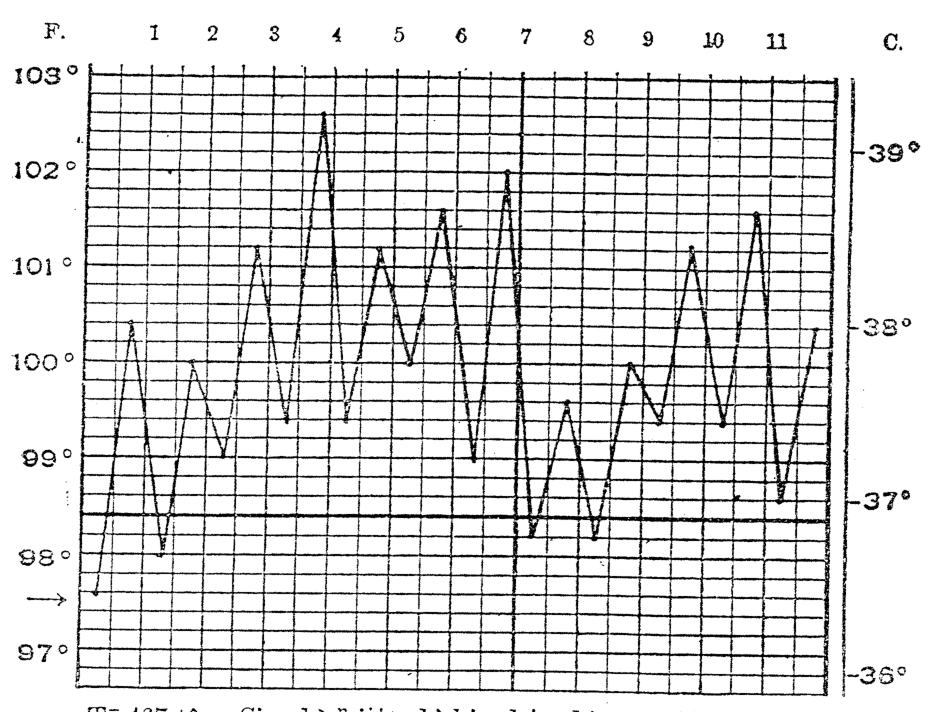
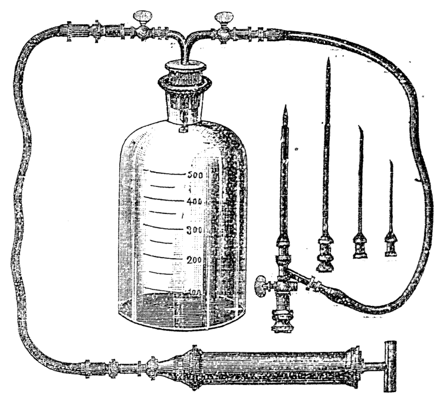
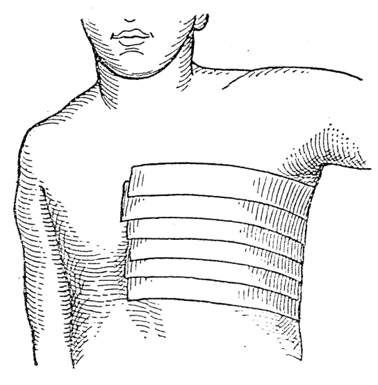
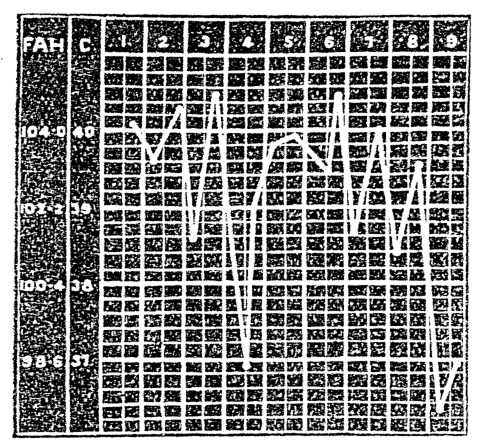
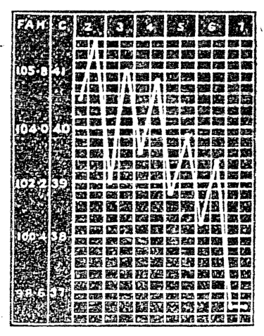
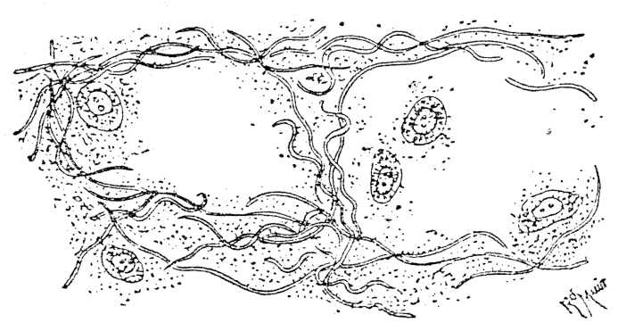
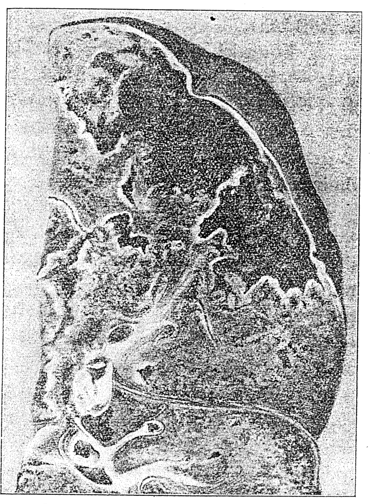
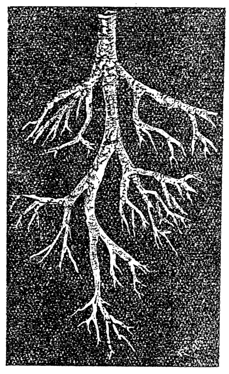

# 第三十四章 呼吸器病 (Ho͘-khip-khì-pīⁿ)

> **所屬篇章**：第四篇 內科看護學 (Lāi-kho Khàn-hō͘-ha̍k)
> **原書頁碼**：第 560 頁 ～ 第 582 頁 (已收錄 23/23 頁)

---

<!-- Page 560 Start -->
#### 📖 原書第 560 頁

### TĒ 34 CHIUⁿ : LŪN HO͘-KHIP-KHÌ PĪⁿ
### 第 34 章：論呼吸器病

Iáu-bē tha̍k chit chiuⁿ-lāi ê sū tio̍h tāi-seng koh un-si̍p tē 6 chiuⁿ, lūn ho͘-khip-khì. Chit-ê sī iàu-kín, in-ūi ho͘-khip-khì ê kái-phò nā bē hiáu-tit, lâi tha̍k ho͘-khip-khì pīⁿ sī bô lō͘-ēng.

> **【全漢對照】**
> 猶未讀此章內的事，著代先閣溫習第 6 章，論呼吸器。這是要緊，因為呼吸器的解剖若袂曉得，來讀呼吸器病是無路用。

---

Tī chia beh iok-lio̍k kóng-khí ho͘-khip-khì pīⁿ, chiàu kī tī ē-tóe :

> **【全漢對照】**
> 佇遮欲約略講起呼吸器病，照記佇下底：

---

*〔Ho͘-khip-khì pīⁿ / 呼吸器病〕*
* Kip-sèng phīⁿ-ka-tap-jî (急性鼻加答兒, *Acute coryza, Cold in head*).
* Ta-chháu-jia̍t (枯草熱, *Autumnal catarrh, Hay fever*).
* Âu-thâu-iām (喉頭炎, *Laryngitis*).
* Âu-thâu-keng-loân (喉頭痙攣, *Spasmodic laryngitis*).
* Âu-thâu-pì-that (喉頭閉塞, *Laryngeal obstruction*).
* Khì-kńg-chi-iām (氣管枝炎, *Bronchitis*).
* Khì-kńg-chi-khok-tiong (氣管枝擴張, *Bronchiectasis*).
* Khì-kńg-chi-chhoán-sek (氣管枝喘息, *Bronchial asthma*).
* Heng-mo̍h-iām (胸膜炎, *Pleurisy*).
* Hì-iām (肺炎, *Pneumonia*).
* Khì-kńg-chi-hì-iām (氣管枝肺炎, *Broncho-pneumonia*).
* Hì-kiat-hu̍t (肺結核, *Pulmonary tuberculosis*).

> **【全漢對照】**
> *〔呼吸器病〕*
> * 急性鼻加答兒（急性鼻加答兒，*Acute coryza, Cold in head*）。
> * 焦草熱（枯草熱，*Autumnal catarrh, Hay fever*）。
> * 喉頭炎（喉頭炎，*Laryngitis*）。
> * 喉頭痙攣（喉頭痙攣，*Spasmodic laryngitis*）。
> * 喉頭閉塞（喉頭閉塞，*Laryngeal obstruction*）。
> * 氣管枝炎（氣管枝炎，*Bronchitis*）。
> * 氣管枝擴張（氣管枝擴張，*Bronchiectasis*）。
> * 氣管枝喘息（氣管枝喘息，*Bronchial asthma*）。
> * 胸膜炎（胸膜炎，*Pleurisy*）。
> * 肺炎（肺炎，*Pneumonia*）。
> * 氣管枝肺炎（氣管枝肺炎，*Broncho-pneumonia*）。
> * 肺結核（肺結核，*Pulmonary tuberculosis*）。

---

### Kip-sèng phīⁿ-ka-tap-jî (kám-mō͘, 感冒)
### 急性鼻加答兒（感冒）

**Tēng-gī:** Chit ê pīⁿ chiū-sī ho͘-khip-khì téng-bīn pō͘-ūi ê liām-mo̍h hoat-iām. Pêng-siông kiò-chòe kám-mō͘, chiū-sī phīⁿ-nīh ê liām-mo̍h hoat-iām. 

*〔Goân-in / 原因〕*
I ê goân-in sī te̍k-……

> **【全漢對照】**
> **定義：**此個病就是呼吸器頂面部位的粘膜發炎。平常叫做感冒，就是鼻內的粘膜發炎。
> 
> *〔原因〕*
> 伊的原因是特……

---

*Ta̍k hāng sū tio̍h chīn-tiong.*  
*(逐項事著盡忠。)*

<!-- Page 560 End -->

---

<!-- Page 561 Start -->
#### 📖 原書第 561 頁

536  
**HO͘-KHIP-KHÌ PĪⁿ**

---

piat ê bî-seng-bu̍t. Ū-sî sī in-ūi lâng ê saⁿ-á-khò͘ ū tâm bô ōaⁿ, tùi án-ni lâi léng-tio̍h.

> **【全漢對照】**  
> 別的微生物。有時是因為人的衫仔褲有澹無換，對按呢來冷著。

---

### Chèng-chōng（症狀）

Chèng-chōng: Kám-mō͘ ê chèng-chōng sī pīⁿ-lâng ùi-kôaⁿ, seng-khu bô khòaⁿ-o̍ah, ū-sî phah-ka-chhiùⁿ, nâ-âu ta-sò, sin-thé sng-thiàⁿ, bô ài chia̍h, thâu-khak hîn, lâu phīⁿ-chúi, cha̍t-phīⁿ. Khah-siông thé-un khah koân tām-po̍h, ū-sî kàu 101° F. (38.3°C.). Ba̍k-chiu túg âng lâu ba̍k-iû. Sit-lo̍h hiù-kak (嗅覺, phīⁿ-bī ê chok-iōng) kap bī-kak (味覺, chu-bī ê chok-iōng). Ū-sî ē liân-lūi-tio̍h ian-thâu, âu-thâu, á-sī khì-kńg. Khah-siông koh nñg ji̍t, pīⁿ-lâng ē koh tùi phīⁿ-khang ho͘-khip, iā koh gō͘ la̍k ji̍t lóng hó. Chit hō pīⁿ gâu thoân-jiám-tio̍h pa̍t lâng.

> **【全漢對照】**  
> 症狀：感冒的症狀是病人畏寒，身軀無快活，有時拍合嗤（phah-ka-chhiùⁿ），頷喉焦燥，身體痠疼，無愛食，頭殼暈，流鼻水，窒鼻。較常體溫較懸淡薄，有時到 101° F. (38.3°C.)。目睭轉紅流目油。失落嗅覺（嗅覺，鼻味的作用）及味覺（味覺，滋味的作用）。有時會連累著咽頭、喉頭、抑是氣管。較常閣兩日，病人會閣對鼻孔呼吸，也閣五六日攏好。這號病𠢕傳染著別人。

---

### Tī-liâu（治療）

Tī-liâu: Lâng siat-sú tú-tio̍h kám-mō͘ ê chiân-tiâu, nā liâm-piⁿ chia̍h *quinina* kap *spiritus ammoniæ aromaticus* ū-sî ē hō͘ i bōe hoat-choh. Nā í-keng ū kám-mō͘ tī chho͘-khí ê sî, tio̍h sóe sio-chúi-e̍k hō͘ lâu kōaⁿ, iā tio̍h ēng sio-chúi-koàn, khì tó tī bîn-chhng kah hō͘ sio. Nā án-ni chòe hit ê pīⁿ ē khah khin.

> **【全漢對照】**  
> 治療：人設使抵著感冒的前兆，若連鞭食 *quinina*（規那/奎寧）及 *spiritus ammoniæ aromaticus*（芳香氨醑）有時會予伊袂發作。若已經有感冒佇初期彼時，著洗熱水浴予流汗，也著用熱水罐，去倒佇眠床蓋予燒。若按呢做彼個病會較輕。

---

### Ta-chháu-jia̍t（乾草熱）

Ta-chháu-jia̍t: Tēng-gī: Chit-ê sī ho͘-khip-khì téng-bīn ê chit pō͘-ūi ê liâm-mo̍h, tùi ta-chháu lâi hoat-iām (ka-tap-jī).

> **【全漢對照】**  
> 乾草熱：定義：這個是呼吸器頂面的一部位的黏膜，對乾草來發炎（カタ儿 / 膜炎）。

---

### Goân-in（原因）

Goân-in: Kúi-nā téng-hō chháu ê hu, á-sī hoe ê hún, á-sī chhek-á iù-iù ê khng-e̍h, sì-kòe pe tī khong-khì ê lāi-bīn, lâng in-ūi ho͘-khip khip-ji̍p tī phīⁿ-nih, nâ-âu, á-sī ji̍p ba̍k-chiu, tùi án-ni ē khí chit hō pīⁿ. Lú pí lâm khah-chōe.

> **【全漢對照】**  
> 原因：幾若等號草的麩，抑是花的花粉，抑是粟仔幼幼的糠額，四界飛佇空氣的內面，人因為呼吸吸入佇鼻裡、頷喉，抑是入目睭，對按呢會起這號病。女比男較多。

---

### Chèng-chōng（症狀）

Chèng-chōng: Khah-chōe sī chhin-chhiūⁿ kám-mō͘ ê chèng-chōng, m̄-kú kan-khó khah tāng, iā ut-chut. Ū-sî siông-siông phah-ka-chhiùⁿ, á-sī sàu, chhin-chhiūⁿ he-ku ê khoán.

> **【全漢對照】**  
> 症狀：較多是親像感冒的症狀，毋過艱苦較重，也鬱卒。有時常常拍合嗤，抑是嗽，親像蝦蟆（he-ku / 氣喘）的款。

---

### Tī-liâu（治療）

Tī-liâu: Kiông-chòng-che (强壯劑) chhin-chhiūⁿ *arsenicum, phosphorus, strychnina.* Ū-sî nā ōaⁿ-ūi ē tit

> **【全漢對照】**  
> 治療：強壯劑（强壯劑）親像 *arsenicum*（砒霜/砷劑）、*phosphorus*（磷）、*strychnina*（士的寧/番木鼈鹼）。有時若換位會得

<!-- Page 561 End -->

---

<!-- Page 562 Start -->
#### 📖 原書第 562 頁

## ÂU-THÂU Ê PĪⁿ（537）

tio̍h lī-ek. Soaⁿ-nih ê khong-khì khah hó. Nā phīⁿ-khang ū sím-mi̍h m̄-tú-hó, tio̍h gōa-kho tī-liâu-hoat.

> **【全漢對照】**
> 著利益。山裡的空氣較好。若鼻孔有甚麼唔堵好，著外科治療法。

---

### Âu-thâu ê pīⁿ〔喉頭的病〕

Âu-thâu ê pīⁿ hun chòe kip-sèng, bān-sèng âu-thâu-iām (喉頭炎); siaⁿ-mn̂g-chúi-chéng; âu-thâu-keng-loân (喉頭痙攣); kiat-hu̍t-sèng âu-thâu-iām; mûi-to̍k-sèng âu-thâu-iām.

> **【全漢對照】**
> 喉頭的病分做急性、慢性喉頭炎（喉頭炎）；聲門水腫；喉頭痙攣（喉頭痙攣）；結核性喉頭炎；梅毒性喉頭炎。

---

### Âu-thâu-iām〔喉頭炎〕

Âu-thâu-iām ū-sî sī ka-kī khí, ū-sî nā phīⁿ-khang, nâ-âu, á-sī ian-thâu ū phòa-pīⁿ, tùi án-ni khoài-khoài liân-lūi-tio̍h âu-thâu.

> **【全漢對照】**
> 喉頭炎有時是自己起，有時若鼻孔、頷喉、抑是咽頭有破病，對按呢快快連累著喉頭。

---

### Goân-in〔原因〕

Chit hō pīⁿ ê goân-in, ū-sî tùi kám-mō͘, kóng ōe siuⁿ chōe, tōa siaⁿ jiáng, chòe sió seng-lí sì-kòe o, hit hō lâng; khip-ji̍p m̄-hó ê khì, chia̍h siuⁿ sio ê mi̍h, á-sī to̍k-io̍h, á-sī chia̍h hun.

> **【全漢對照】**
> 此號病的原因，有時對感冒，講話傷多，大聲嚷，做小生理四界喝，彼號人；吸入唔好的氣，食傷燒的物，抑是毒藥，抑是食煙。

---

### Chèng-chōng〔症狀〕

Chèng-chōng: Nâ-âu àng-àng bô siaⁿ; kóng ōe bōe chhut siaⁿ; nâ-âu-tóe ngiau-ngiau. Ū-sî ho-khip thiàⁿ. Ū-sî thé-un khah koâiⁿ tām-po̍h 100° F. (37.8° C.). Nā-sī siông-siông jiám-tio̍h kip-sèng âu-thâu-iām, ē pìⁿ-chiâⁿ bān-sèng âu-thâu-iām.

> **【全漢對照】**
> 症狀：頷喉甕甕無聲；講話袂出聲；頷喉底癢癢（ngiau-ngiau）。有時呼吸痛。有時體溫較懸淡薄 100° F. (37.8° C.)。若是常常染著急性喉頭炎，會變成慢性喉頭炎。

---

### Tī-liâu〔治療〕

Tī-liâu: Tio̍h hioh-khùn; m̄-thang kóng ōe, m̄-thang chia̍h sek-hun (tobacco). Nā khah siong-tiōng tio̍h tó tī bîn-chhng. Pīⁿ-lâng teh tòa ê chhù, hit ê un-tō͘ tio̍h ū tú-hó ha̍h, iā tio̍h ēng chit-ê kún-chúi-koàn, chúi chhòng hō͘ chhiâng-chāi kún, hē tī pīⁿ-lâng ê bîn-chhng-piⁿ, hō͘ khong-khì ē sip-lūn bōe ta-sò. Tī kún-chúi-lāi ēng *tinctura benzoini co.*, án-ni khip-ji̍p chit ê khì ē khah hó (tē 293 bīn). Ū-sî hō͘ i *pulv. Doveri* ē hō͘ i hó khùn. Tāi-piān tio̍h chù-ì. Tio̍h kéng liû-tōng chu-ióng ê sit-bu̍t. Ū-sî ēng peng-lông he ām-kún ê só͘-chāi, iā ē khah khòaⁿ-oa̍h.

> **【全漢對照】**
> 治療：著歇睏；唔通講話，唔通食熟煙（tobacco）。若較嚴重著倒佇眠床。病人咧戴的厝，彼個溫度著有堵好合，也著用一個滾水罐，水創予長在滾，下佇病人的眠床邊，予空氣會濕潤袂乾燥。佇滾水內用 *tinctura benzoini co.*，按呢吸入此個氣會較好（第 293 面）。有時予伊 *pulv. Doveri* 會予伊好睏。大便著注意。著揀流動滋養的食物。有時用冰囊下頷頸的所在，也會較快活。

---

### Âu-thâu-keng-loân〔喉頭痙攣〕

Âu-thâu-keng-loân (喉頭痙攣, *Spasmodic Laryngitis*): Nā ū âu-thâu pīⁿ, ū-sî ū siaⁿ-mn̂g-keng-loân (*spasm of glottis*), m̄-kú chit hō pīⁿ sī gín-ná te̍k-pia̍t ê pīⁿ.

> **【全漢對照】**
> 喉頭痙攣（喉頭痙攣, *Spasmodic Laryngitis*）：若有喉頭病，有時有聲門痙攣（*spasm of glottis*），毋拘此號病是囡仔特別的病。

---

### [頁底格言]

I-seng mn̄g pīⁿ-lâng ê sū, nā m̄-chai, tio̍h kóng m̄-chai, m̄-thang phiàn i.

> **【全漢對照】**
> 醫生問病人的事，若唔知，著講唔知，唔通騙伊。

<!-- Page 562 End -->

---

<!-- Page 563 Start -->
#### 📖 原書第 563 頁

538 HO͘-KHIP-KHÌ, PĪⁿ

### Goân-in

Goân-in : Chiū-sī sîn-keng pīⁿ ê chi̍t-ê, âu-thâu kun-bah kiu ê chèng, gín-ná saⁿ ge̍h ji̍t khí, kàu saⁿ hè ûi-chí. Hit khoán ê gín-ná khah ōe tú-tio̍h chit hō pīⁿ, chiū-sī kut núg, kap khah bô thang lîm-chia̍h-ê. Gín-ná khí-chho͘ hoat chhùi-khí ê sî iā ōe tú-tio̍h chit hō chèng.

> **【全漢對照】**
> 原因：就是神經病的一個，喉頭肌肉搐的症，囡仔三個月日起，到三歲為止。彼款的囡仔較會抵著此號病，就是骨軟，佮較無通飲食的。囡仔起初發齒的時候亦會抵著此號症。

---

### Chèng-chōng

Chèng-chōng : Ho͘-khip chiām-sî thêng-chí, gín-ná teh chhut-la̍t chhin-chhiūⁿ ài chhoán ê khoán, bīn-sek túg chhiⁿ-lâm-sek, heng-khám bô khoàⁿ-kìⁿ tín-tāng. Hit ê keng-loân nā kè, khong-khì chiū ji̍p âu-thâu-lāi, iā ū kî-koài ê siaⁿ-im, chhin-chhiūⁿ teh thî ê khoán.

> **【全漢對照】**
> 症狀：呼吸暫時停止，囡仔咧出力親像愛喘的款，面色轉青藍色，胸坎無看見振動。彼個痙攣若過，空氣就入喉頭內，亦有奇怪的聲音，親像咧啼的款。

---

### Tī-liâu

Tī-liâu : Beh i-tī chit hō pīⁿ tio̍h chù-ì tāi-piān. Tio̍h kéng liû-tōng chu-ióng ê si̍t-bu̍t. Hō͘ i chia̍h hî-iû. Chiong gín-ná chìm sio-chúi-e̍k, iā ēng léng-chúi phoah tī i ê chêng kap āu heng, chi̍t nn̄g hun-kú. Ū-sî ēng thò͘-chioh chhin-chhiūⁿ *vinum ipecacuanhæ* hō͘ i thò͘, án-ni ōe khah khoàⁿ-oa̍h.

> **【全漢對照】**
> 治療：欲醫治此號病著注意大便。著揀流動滋養的食物。予伊食魚油。將囡仔浸熱水浴，亦用冷水泋佇伊的前佮後胸，一兩分久。有時用吐藥親像 *vinum ipecacuanhæ* 予伊吐，按呢會較快活。

---

### Âu-thâu-pì-that (喉頭閉塞, *Laryngeal obstruction*)

Âu-thâu-pì-that (喉頭閉塞, *Laryngeal obstruction*): Chit ê pīⁿ sī âu-thâu that-teh bē thong, á-sī tām-po̍h thong nā-tiāⁿ.

> **【全漢對照】**
> 喉頭閉塞（喉頭閉塞，*Laryngeal obstruction*）：此個病是喉頭塞咧袂通，抑是淡薄通爾定。

---

### Goân-in

Chit hō ê goân-in sī sòe lia̍p mi̍h, chhin-chhiūⁿ tâng-chíⁿ, gûn-kak-á, á-sī tī hia seⁿ si̍t-hû-tek-lí-a, chéng-iông. Nā bô liâm-piⁿ i-tī, pīⁿ-lâng ê siaⁿ-mūi ōe chúi-chéng, tùi án-ni chin siong-tiōng.

> **【全漢對照】**
> 此號的原因是細粒物，親像銅錢、銀角仔，抑是佇遐生實扶的里亞（白喉）、腫癅。若無連鞭醫治，病人的聲門會水腫，對按呢真傷重。

---

### Chèng-chōng

Chèng-chōng : Ho͘-khip-khùn-lân, ū-sî chhut siaⁿ chhin-chhiūⁿ ta̍t-á-siaⁿ (笛音, *stridor*). Khip-ji̍p khùn-lân, tùi án-ni hia̍p-kut nah-lo̍h-khì. Bīn-sek túg chhiⁿ-lâm-sek, ba̍k-chiu chhāi-chhāi, thâu-khak lâu koāⁿ. Khàn-hō͘ khoàⁿ-kìⁿ chit hō ê khoán-sit, m̄-thang lī-khui i, tio̍h sió-sim chiàu-kò͘, iā tio̍h liâm-piⁿ thong-ti i-seng chai.

> **【全漢對照】**
> 症狀：呼吸困難，有時出聲親像撻仔聲（笛音，*stridor*）。吸入困難，對按呢脅骨凹落去。面色轉青藍色，目珠眙眙，頭殼流汗。看護看見此號的款式，唔通離開伊，著小心照顧，亦著連鞭通知醫生知。

---

### Tī-liâu

Tī-liâu : I-seng beh ēng te̍k-pia̍t ê ke-si chiong hit lia̍p chhin-chhiūⁿ chhiⁿ the̍h-khí-lâi, á-sī chòe âu-thâu chhiat-khui-su̍t (喉頭截開術). Ū-sî ēng peng-lông hē pīⁿ-lâng

> **【全漢對照】**
> 治療：醫生欲用特別的傢俬將彼粒親像星提出來，抑是做喉頭截開術（喉頭截開術）。有時用冰囊下病人

---

<!-- Page 563 End -->

---

<!-- Page 564 Start -->
#### 📖 原書第 564 頁

### KHÌ-KÚNG Ê PĪⁿ（539 頁）

ām-kún ōe khah pêng-an. Pīⁿ-sek-lāi ê khong-khì tióh siat-hoat hō͘ sip-lūn.

> **【全漢對照】**
> 頷頸會較平安。病室內的空氣著設法互濕潤。

---

### [Khì-kúng pīⁿ / 氣管病分類]

Khì-kúng ê pīⁿ thang hun chòe :  
1. Kip-sèng khì-kúng-chi-iām (急性氣管枝炎, *Acute bronchitis*).  
2. Bān-sèng khì-kúng-chi-iām (慢性氣管枝炎, *Chronic bronchitis*).  
3. Khì-kúng-chi-khok-tiong (氣管枝擴張, *Bronchiectasis*).  
4. Khì-kúng-chi-chhoán-sek (氣管枝喘息, *Bronchial asthma*).  
5. Chhiam-î-sèng khì-kúng-chi-iām (纖維性氣管枝炎, *Fibrinous bronchitis* ; tē 466^b tô͘, tē 557 bīn).

> **【全漢對照】**
> 氣管的病通分做：  
> 1. 急性氣管枝炎 (急性氣管枝炎, *Acute bronchitis*)。  
> 2. 慢性氣管枝炎 (慢性氣管枝炎, *Chronic bronchitis*)。  
> 3. 氣管枝擴張 (氣管枝擴張, *Bronchiectasis*)。  
> 4. 氣管枝喘息 (氣管枝喘息, *Bronchial asthma*)。  
> 5. 纖維性氣管枝炎 (纖維性氣管枝炎, *Fibrinous bronchitis*；第 466^b 圖，第 557 面)。

---

### Kip-sèng khì-kúng-chi-iām（急性氣管枝炎）

Kip-sèng khì-kúng-chi-iām, chiū-sī khì-kúng-chi siōng kap tiong ê tōa chi ê liām-mó̍h-iām.

> **【全漢對照】**
> 急性氣管枝炎，就是氣管枝上佮中的大枝的黏膜炎。

---

### Goân-in（原因）

Goân-in : Gín-ná kap lāu lâng, khip-ji̍p bô chheng-khì ê khong-khì, siông-siông chòe tîn-ai ê kang, kôaⁿ-tīⁿ ê sî, seng-khu bô ióng-kiāⁿ, án-ni chiah-ê lóng ōe tì-kàu khì-kúng-chi-iām. Lâng ū sió-tng-jia̍t, môa-chín, pah-ji̍t-sàu, sim-chōng pīⁿ, sit-hû-tek-lí-a, phīⁿ ka-tap-jî, ian-thâu-iām, hit khoán ê pīⁿ, chiū ōe khah khoài tú-tióh khì-kúng-chi-iām.

> **【全漢對照】**
> 原因：囡仔佮老人，吸入無清氣的空氣，常常做塵埃的工，寒冷（寒凊）的時，身軀無勇健，按呢諸個攏會致到氣管枝炎。人有小腸熱、麻疹、百日嗽、心臟病、白喉（sit-hû-tek-lí-a / Diphtheria）、鼻加答兒（phīⁿ ka-tap-jî）、咽頭炎，彼款的病，就會較快抵著氣管枝炎。

---

### Chèng-chōng（症狀）

Chèng-chōng : Khah-siông chit ê pīⁿ ê tāi-seng ū phīⁿ ka-tap-jî, á-sī ian-thâu-iām, heng-lāi cha̍t-cha̍t ān-ān ; heng-kut ê ē-tóe ōe thiàⁿ, iā ū sàu, ta-sàu, thâu-khak thiàⁿ. Thé-un khah koâiⁿ, 101° F. chī 103° F. (38.3° chī 39.4° C.). Thâm tāi-seng liâm-liâm, sek-tī pe̍h-pe̍h koh bô lōa-chōe ; āu-lâi pìⁿ-chiâⁿ n̂g-sek iā khah-chōe. Khah-siông kè cha̍p ji̍t ōe hó.

Chit ê pīⁿ ū-sî ōe pìⁿ-chiâⁿ bān-sèng khì-kúng-chi-iām.  
Koh chit hāng gín-ná á-sī lāu lâng nā ū chit hō pīⁿ

> **【全漢對照】**
> 症狀：較常此個病的代先有鼻加答兒，抑是咽頭炎，胸內窒窒緊緊；胸骨的底下會痛，也有嗽，乾嗽，頭殼痛。體溫較懸，101° F. 至 103° F.（38.3° 至 39.4° C.）。痰代先黏黏，色致白白閣無偌濟；後來變成黃色也較濟。較常過十日會好。  
> 此個病有時會變成慢性氣管枝炎。  
> 閣一項囡仔抑是老人若有此號病……

---

### [頁底格言]

Nā bô jîn-ài, lán ê kang kui tī khang-khang.

> **【全漢對照】**
> 若無仁愛，咱的工歸佇空空。

<!-- Page 564 End -->

---

<!-- Page 565 Start -->
#### 📖 原書第 565 頁

540 HÓ͘-KHIP-KHÌ PĪⁿ

ōe khoài-khoài pīⁿ-chiâⁿ khì-kńg-chi-hì-iām, án-ni chiū-sī siong-tiōng ê pīⁿ.

> **【全漢對照】**
> 會快快病成氣管支肺炎，按呢就是傷重（嚴重）的病。

---

### Tī-liâu（治療）

Tī-liâu : Tó tī bîn-chhñg hioh-khùn, sóe sio-chúi-e̍k, lim sio-kún-chúi, chiong sio-chúi-koàn hō͘ i ù-sio, kah khah-chōe níá nî-thán, á-sī mî-phē, hō͘ i lâu kōaⁿ. Tāi-piān ti̍oh chù-ì. Khip-ji̍p-hoat, tī 500.0 c.c. kún-chúi-lāi hē *tinctura benzoini co.* 3.5 c.c. (tē 293 bīn). Pīⁿ-sek-lāi ê khong-khì ti̍oh siat-hoat hō͘ sî-siông sip-lūn. Ū-sî ēng kài-lo̍ah-pâ-pò͘, á-sī sio ê chhò͘-khng kā i kah tī heng-chêng á-sī heng-khám-āu, ōe khah an-ún-tit. Ū-sî ēng sio ê mî-hoe lâi khàm-khám. Só͘ ēng ê ióh sī *ammonii carbonas, vinum antimonialis, spiritus ætheris nitrosi, ipecacuanha, scilla*, a-phiàn, *potasii iodidum*. Nā-sī gín-ná ê thâm siuⁿ liām, khak bōe tit chhut-lâi, chiong *vinum ipecacuanhæ* thò͘-che hō͘ i thò͘, hit ê thâm ōe sòa chhut-lâi. Nā bô án-ni, gín-ná ê thâm ōe thun-lo̍h-khì.

> **【全漢對照】**
> 治療：倒佇眠床歇困，洗燒水浴，啉燒滾水，將燒水罐予伊煨燒，蓋較多領呢毯，抑是棉被，予伊流汗。大便著注意。吸入法，佇 500.0 c.c. 滾水內下 *tinctura benzoini co.* 3.5 c.c.（第 293 面）。病室內的空氣著設法予時常濕潤。有時用芥辣爬布（芥末泥敷布），抑是燒的粗糠共伊蓋佇胸前抑是胸坎後，會較安穩得。有時用燒的棉花來蓋蓋。所用的藥是 *ammonii carbonas, vinum antimonialis, spiritus ætheris nitrosi, ipecacuanha, scilla*, 鴉片, *potasii iodidum*。若是囡仔的痰傷黏，咯袂得出夾，將 *vinum ipecacuanhæ* 吐劑予伊吐，彼個痰會紲出來。若無按呢，囡仔的痰會吞落去。

---

Khàn-hō͘ ti̍oh chin sió-sim chiàu-kò͘ chit hō ê pīⁿ-lâng, kiaⁿ-liáu ōe léng-ti̍oh. Nā ū sím-mih thoân-jiám pīⁿ, iû-goân ti̍oh hông-bián-tit pīⁿ-chiâⁿ khì-kńg-chi-iām.

> **【全漢對照】**
> 看護著真小心照顧這號的病人，驚了會冷著（受涼）。若有甚麼傳染病，猶原著防免得病成氣管支炎。

---

Ū-sî pang-chān pīⁿ-lâng hoan-sin iā sī hó; m̄-thang hō͘ i siông-siông tó chhiò-chhiò, nā ōaⁿ i tó ê khoán-sit, án-ni ōe pāng-chān thâm thang chhut-lâi.

> **【全漢對照】**
> 有時傍贊（幫助）病人翻身也是好；毋通予伊常常倒笑笑（仰臥），若換伊倒的款式，按呢會傍贊痰通出來。

---

### Si̍t-bu̍t（食物）

Si̍t-bu̍t : Ti̍oh kéng liû-tōng chu-ióng ê si̍t-bu̍t, chhin-chhiūⁿ gû-bah-chiap, gû-leng, koe-nñg, ah-nñg.

> **【全漢對照】**
> 食物：著揀流動滋養的食物，親像牛肉汁、牛奶、雞卵、鴨卵。

---

### Bān-sèng khì-kńg-chi-iām（慢性氣管支炎）

Bān-sèng khì-kńg-chi-iām, sī khah-siông saⁿ-cha̍p-gō͘ hè í-siōng ê lâng ōe tú-ti̍oh. Kôaⁿ-thiⁿ-sî khah-chōe. Thâm chiū khah-chōe, sek-tī n̂g, á-sī le̍k-sek.

> **【全漢對照】**
> 慢性氣管支炎，是較常三十五歲以上的人會抵著。寒天時較多。痰就較多，色緻（顏色）黃，抑是綠色。

---

### Khì-kńg-chi-khok-tiong（氣管支擴張）

Khì-kńg-chi-khok-tiong. Chit ê pīⁿ khah-siông sī in-ūi khah kú ū sàu, tùi tiāⁿ-tiāⁿ teh sàu hiah ê khì-kńg ū pīⁿ tōa, kiò-chòe khok-tiong. Pīⁿ-lâng tī chá-khí-sî tú-á khí-lâi chiū thò͘ thâm chin chōe, in-ūi khì-kńg-khok-tiong,

> **【全漢對照】**
> 氣管支擴張。這個病較常是因為較久有嗽，對定定咧嗽遐的氣管有變大，叫做擴張。病人在早起時拄仔起來就吐痰真多，因為氣管擴張，

<!-- Page 565 End -->

---

<!-- Page 566 Start -->
#### 📖 原書第 566 頁

### KHÌ-KÚNG-CHI-CHHOÁN-SEK (第 541 頁)

#### [氣管枝擴張 (續)] `[邊註: Khì-kúng-chi-khok-tiong]`

mî-sî hiah ê thâm chek-chū tī khì-kúng-lāi; chá-khí khí-lâi ê sî, hit ê thâm ōe sió-khóa ōaⁿ-ūi, án-ni pīⁿ-lâng liâm-piⁿ sàu, thâm chin chōe chiū chhut-lâi. Ū-sî tī chi̍t ji̍t ê tiong-kan ū thò͘ thâm 100.0 c.c. chì 1,000.0 c.c., chin m̄-hó bī, ū-sî chhàu-sng. Phùi tī thâm-koàn ê sî pīⁿ-chiāⁿ saⁿ iān:
1. Téng-bīn iān phéh-phéh chhiah-nĝ-sek.
2. Tiong-ng chúi-chúi liâm-liâm.
3. Ē-bīn chhin-chhiūⁿ bô chheng-khì hé-hu-sek ê lâng chi̍t iūⁿ.

> **【全漢對照】**
> 暝時遐的痰積聚佇氣管內；早起起來的時，彼個痰會小可換位，按呢病人連鞭嗽，痰真濟就出來。有時佇一日的中間有吐痰 100.0 c.c. 至 1,000.0 c.c.，真唔好味，有時臭酸。呸佇痰罐的時病成三樣（層）：
> 1. 頂面樣沬沬赤黃色。
> 2. 中央水水黏黏。
> 3. 下面親像無淸氣灰膚色的膿一樣。

---

#### [治療] `[邊註: Tī-liâu]`

Tī-liâu: Khip-ji̍p-hoat. Ēng *creosotum*, *acidum carbolicum*, *thymol*, lâi khip-ji̍p (tē 293 bīn.)

> **【全漢對照】**
> 治療：吸入法。用 *creosotum*, *acidum carbolicum*, *thymol*, 來吸入（第 293 面。）

---

### Khì-kúng-chi-chhoán-sek `[邊註: Khì-kúng-chi-chhoán-sek]`

Khì-kúng-chi-chhoán-sek (氣管枝喘息, *Bronchial asthma*) sī ho͘-khip-khùn-lân pīⁿ ê chi̍t khoán.

> **【全漢對照】**
> 氣管枝喘息（氣管枝喘息, *Bronchial asthma*）是呼吸困難病的一款。

---

#### [原理] `[邊註: Goân-lí]`

Goân-in sī iáu-bē tiāⁿ-tio̍h. Goân-lí chiàu kì tī ē-tóe:
1. Khì-kúng ê kun-bah keng-loân.
2. Khì-kúng ê liâm-mo̍h chéng, tùi huih kàu hia siuⁿ chōe, chhiong-huih.
3. Khì-kúng-chi ê liâm-mo̍h-iām.
Lāu-lâng, siàu-liân, lóng ōe tú-tio̍h chit hō pīⁿ; lâm pí lú khah-chōe.

> **【全漢對照】**
> 原因猶未定著。原理照記佇底下：
> 1. 氣管的筋肉痙攣。
> 2. 氣管的粘膜腫，對血到遐傷濟，充血。
> 3. 氣管枝的粘膜炎。
> 老人、少年，攏會抵著這號病；男比女較濟。

---

#### [症狀] `[邊註: Chèng-chōng]`

Chèng-chōng: Tú-tio̍h chit hō chèng ê pīⁿ-lâng, put-chí kan-khó͘. Tú-á khí ê sî, khah-siông seng phah-ka-chhiùⁿ, chōe-chōe sī mî-sî pòaⁿ-mî hut-jiân khí. Heng-khám cha̍t-cha̍t, ho͘-khip-khùn-lân, huihⁿ-huihⁿ-kiò, bák-chiu chhāi-chhāi, bīn-sek tńg chhiⁿ-lâm-sek. Chit khoán ê chêng-hêng teh-beh kè ê sî, chiū ōe khí sàu, thò͘ thâm. Tâi-seng i ê sàu sī ta-ta, iā thâm liâm-liâm.

> **【全漢對照】**
> 症狀：抵著這號症的病人，不止艱苦。拄仔起的時，較常先拍嚏噴，濟濟是暝時半暝忽然起。胸坎實實，呼吸困難，咻咻叫，目睭眵眵，面色轉青藍色。這款的情形欲過的時，就會起嗽，吐痰。胎生（起初）伊的嗽是焦焦，也痰黏黏。

---

#### [治療] `[邊註: Tī-liâu]`

Tī-liâu: I-seng teh ēng ê io̍h sī *lobelia*, *potassii iodidum*, *amyl nitris*, *stramonium*. Ū-sî ōaⁿ ūi ōe khah

> **【全漢對照】**
> 治療：醫生咧用的藥是 *lobelia*, *potassii iodidum*, *amyl nitris*, *stramonium*。有時換位會較

---

#### [頁尾註腳]

Pīⁿ-lâng nā kóng pheng-tòa siuⁿ ān, tio̍h liâm-piⁿ khì sùn khòaⁿ ū iáⁿ á-bô.

> **【全漢對照】**
> 病人若講繃帶傷緊，著連鞭去巡看有影抑無。

<!-- Page 566 End -->

---

<!-- Page 567 Start -->
#### 📖 原書第 567 頁

**542 HO͘-KHIP-KHÌ PĪⁿ**

---

...bōe koh khí, ū-ê tòa tī hái-kīⁿ khah hó, ū-ê tī soaⁿ-nih ê só͘-chāi iā khah hó.

> **【全漢對照】**  
> ……袂閣起，有的蹛佇海墘較好，有的佇山裡兮所在也較好。

---

### Heng-mo̍h-iām（胸膜炎）

Heng-mo̍h-iām (胸膜炎, *Pleurisy*); Siang pêng nñg ia̍p hì-thé ê gōa-bīn, lóng ū heng-mo̍h; tī heng ê lāi-bīn ū nñg chân sio kūn, chi̍t chân liân tī hia̍p-kut-lāi ê kun-bah, chi̍t chân teh pau-ûi hì-chōng. Chit ê heng-mo̍h nā hoat-iām, pīⁿ-miâ kiò heng-mo̍h-iām. Nñg chân heng-mo̍h ê tiong-ng ū heng-mo̍h-e̍k. Chit ê heng-mo̍h-e̍k hō͘ heng-mo̍h saⁿ-bôa hó-sè, iā bōe thiàⁿ; nā hoat-iām hiah ê mo̍h saⁿ-bôa chin thiàⁿ. Heng-mo̍h-iām ū hun kúi-nā khoán, tī chia kan-ta beh kóng kúi khoán-ê, chiū-sī ta-sèng heng-mo̍h-iām, chúi-sèng heng-mo̍h-iām.

> **【全漢對照】**  
> 胸膜炎（胸膜炎，*Pleurisy*）；雙爿兩葉肺體的外面板，攏有胸膜；佇胸的內面有兩層相近，一層連佇脅骨內的筋肉，一層佇咧包圍肺臟。這個胸膜若發炎，病名叫胸膜炎。兩層胸膜的中央有胸膜液。這個胸膜液互胸膜相磨好勢，也袂疼；若發炎遐的膜相磨真疼。胸膜炎有分幾若款，佇遮干單卜講幾款的，就是乾性胸膜炎、水性胸膜炎。

---

### Ta-sèng heng-mo̍h-iām（乾性胸膜炎）

Hit ê ta-sèng heng-mo̍h-iām, ì-sù sī heng-mo̍h-lāi bô chhut khah-chē heng-mo̍h-e̍k. Hit ê chúi-sèng-ê, ì-sù sī chhut tâm ê e̍k; chit-ê ū-sî sī chhin-chhiūⁿ huih, kiò-chòe chhut-huih-sèng heng-mo̍h-iām; ū-sî sī lāng, kiò-chòe hòa-lāng-sèng heng-mo̍h-iām (化膿性胸膜炎, *empyæma*).

> **【全漢對照】**  
> 彼個乾性胸膜炎，意思是胸膜內無出較多胸膜液。彼個水性的，意思是出澹的液；這個有時是親像血，叫做出血性胸膜炎；有時是膿，叫做化膿性胸膜炎（化膿性胸膜炎，*empyæma*）。

---

### Goân-in（原因）

Goân-in: Chit hō heng-mo̍h-iām ê goân-in sī tùi kám-mō͘, kôaⁿ-tio̍h, léng-tio̍h. Ū-sî nā ū pa̍t khoán ê pīⁿ, chhin-chhiūⁿ hì-iām, kiat-hu̍t chèng, hì-lāng-iông, ōe sòa tú-tio̍h heng-mo̍h-iām.

> **【全漢對照】**  
> 原因：這號胸膜炎的原因是對感冒、寒著、冷著。有時若有別款的病，親像肺炎、結核症、肺膿瘍，會紲抵著胸膜炎。

---

### Chèng-chōng（症狀）

Chèng-chōng: Tē it chá ê chèng-chōng sī ùi-kôaⁿ, ū-sî khéh-khéh-tiō, heng-khám-piⁿ chin thiàⁿ, ná chhin-chhiūⁿ chi̍t ki to teh chha̍k. Nā tín-tāng, á-sī ho͘-khip khah chhim, ōe khah thiàⁿ. Ho͘-khip khah kín, koh chhián. Me̍h-phok khah kín. Sàu ê siaⁿ chiū khah té khah kín. Thé-un khah koân 102° F.—103° F. (38.9°—39.4° C.). Nā-sī heng-mo̍h-khang ū chúi, nñg chân ê heng-mo̍h bōe sio-bôa, án-ni bōe thiàⁿ. Hit ê heng-mo̍h-e̍k nā bô lōa-chōe, ōe chiām-chiām khip-siu, m̄-kú khah-siōng chit-ê sī bān-bān; ū-sî i-seng tio̍h chhng-heng-su̍t (穿胸術) chiong lāi-bīn ê heng-mo̍h-e̍k thiu-chhut-lâi.

> **【全漢對照】**  
> 症狀：第一早的症狀是畏寒，有時劇劇跳（發抖），胸坎邊真疼，若親像一支刀佇咧插。若振動，抑是呼吸較深，會較疼。呼吸較緊，閣淺。脈搏較緊。嗽的聲就較短較緊。體溫較懸 102° F.—103° F.（38.9°—39.4° C.）。若是胸膜腔有水，兩層的胸膜袂相磨，按呢袂疼。彼個胸膜液若無偌多，會漸漸吸收，毋過較常這個是慢慢；有時醫生著穿胸術（穿胸術）將內面的胸膜液抽出嚟。

<!-- Page 567 End -->

---

<!-- Page 568 Start -->
#### 📖 原書第 568 頁

  <figure style="display: inline-block; margin: 12px; max-width: 90%; text-align: center;">
    
    <figcaption style="font-size: 14px; color: #4a5568; margin-top: 6px;"><em>Tē 467 tô.—Siau-hòⁿ-ji̍at; hì-kiat-hu̍t chèng (Sahli and Potter).</em></figcaption>
  </figure>

### LÂNG-HENG（膿胸）

**LÂNG-HENG**  
*543*

**Lâng-heng**  
Hòa-lâng-sèng heng-mo̍h-iām, iā kiò-chòe lâng-heng, chiū-sī nn̄g chân heng-mo̍h ê tiong-ng ū hòa-lâng. Chit ê pīⁿ sī pí téng-bīn kóng-ê khah siong-tiōng.

> **【全漢對照】**  
> **膿胸**  
> 化膿性胸膜炎，也叫做膿胸，就是兩層胸膜的中央有化膿。這個病是比頂面講的較嚴重。

---

**Goân-in**  
I ê goân-in khah-siông sī tùi kiat-hu̍t. Ū-sî nā lâng ū hì-iām, iā khah bān hó, sī ōe siⁿ lâng-heng (膿胸). Ū-sî pa̍t khoán pīⁿ chhin-chhiūⁿ sió-tng-jia̍t ōe tì-kàu siⁿ lâng-heng.

> **【全漢對照】**  
> **原因**  
> 它的原因較常是對結核。有時若人有肺炎，也較慢好，是會生膿胸（膿胸）。有時別款病親像傷寒熱會致到生膿胸。

---

**Chèng-chōng**  
Chèng-chōng: Chhin-chhiūⁿ téng-bīn só kóng-ê, chóng-sī khah siong-tiōng. I ê thé-un khah koâiⁿ; hit khoán ê

*(圖表)*  
Tē 467 tô͘.—Siau-hòⁿ-jia̍t; hì-kiat-hu̍t chèng (Sahli and Potter).

**Siau-hòⁿ-jia̍t**  
jia̍t, kiò-chòe siau-hòⁿ-jia̍t (消耗熱, *hectic fever*), ì-sù sī kú-tn̂g ê jia̍t, á-sī hit khoán ê jia̍t, chhin-chhiūⁿ hì-lô pīⁿ ê lâng, lâu chùn-kōaⁿ hit hō. Chit ê jia̍t sī ē-po͘-sî khah koâiⁿ, chá-khí-sî lo̍h kē (tē 467 tô͘). Ū-sî i-seng nā ài chai tī heng-khang ū pâi-siat siuⁿ chōe heng-mo̍h-e̍k, á-sī lâng, i beh ēng chit ki chù-siā-khì, lâi chhng-chhì-su̍t, khòaⁿ ū á-bô.

> **【全漢對照】**  
> **症狀**  
> 症狀：親像頂面所講的，總是較嚴重。它的體溫較懸；彼款的  
> 
> *(圖 467：消耗熱；肺結核症)*  
> 
> **消耗熱**  
> 熱，叫做消耗熱（消耗熱, *hectic fever*），意思是指久長的熱，抑是彼款的熱，親像肺癆病的人，流戰汗（冷汗）彼號。這個熱是下晡時較懸，早起時落低（第 467 圖）。有時醫生若愛知佇胸腔有排洩傷多胸膜液，抑是膿，伊欲用一支注射器，來穿刺術，看有抑無。

---

**Tī-liâu**  
Tī-liâu: Heng-mo̍h-iām ê tī-liâu-hoat: Pīⁿ nā-sī

> **【全漢對照】**  
> **治療**  
> 治療：胸膜炎的治療法：病若是

---

*〔頁底註釋〕*  
Pīⁿ-lâng nā m̄-chia̍h mi̍h, tio̍h khó͘-khǹg i chia̍h.

> **【全漢對照】**  
> 病人若毋食物，著苦勸伊食。

<!-- Page 568 End -->

---

<!-- Page 569 Start -->
#### 📖 原書第 569 頁

  <figure style="display: inline-block; margin: 12px; max-width: 90%; text-align: center;">
    
    <figcaption style="font-size: 14px; color: #4a5568; margin-top: 6px;"><em>Tē 468 tô:—Khip-ín-khì.</em></figcaption>
  </figure>

**544** 【HO͘-KHIP-KHÌ PĪⁿ】

---

### [Heng-mo̍h-īam ê tī-liâu（胸膜炎的治療）]

khah khin, iû-goân ti̍h tó tī bîn-chhng hioh-khùn. Nā tó tī hit pêng ū pīⁿ ê só͘-chāi khah bē thiàⁿ. Chí thiàⁿ ê hoat chiū-sī un-pâ-pò͘ (溫罨布, *poultice*), hoat-phā-che (發疱劑, *blisters*), chhat-che (擦劑, *liniment*), gô-khî-hoat. Ū-sî hit pêng ū pīⁿ ê só͘-chāi, nā chiong liâm-pò͘ kā i pa̍k hō͘ ān, án-ni heng-khám khah bē tín-tāng, khah bē thiàⁿ. Chit ê liâm-pò͘ beh thiah-khí-lâi ê sî ti̍h khah kín, m̄-thang bān-bān, in-ūi nā ûn-ûn-á thiah chiū khah thiàⁿ. Ti̍h sòe-jī m̄-thang chhòng hō͘ i liù phê. Chit hō liâm-pò͘ ê liâm mi̍h, ti̍h ēng *olive* iû chhit hō͘ i khí-lâi. I-seng beh ēng ióh hō͘ i chia̍h chhin-chhiūⁿ beh chù-ì tāi-, siáu-piān; hō͘ i ōe khùn-tit, chí sàu ê ióh, chí thiàⁿ ê ióh.

> **【全漢對照】**
> （症狀）較輕，猶原著倒佇眠床歇睏。若倒佇彼旁有病的所在較袂痛。止痛的法就是溫罨布（溫罨布, *poultice*）、發疱劑（發疱劑, *blisters*）、擦劑（擦劑, *liniment*）、蛾蜞法。有時彼旁有病的所在，若將粘布給伊縛予絚，按呢胸坎較袂振動，較袂痛。這个粘布欲拆起來的時著較緊，毋通慢慢，因為若勻勻仔拆就較痛。著細膩毋通創予伊遛皮。這號粘布的粘物，著用 *olive* 油拭予伊起來。醫生欲用藥予伊食親像欲注意大、小便；予伊會睏得，止嗽的藥，止痛的藥。

---

**Tē 468 tô͘:—Khip-ín-khì.**  
> **【全漢對照】**  
> **第 468 圖：—吸引器。**

---

### Si̍t-bu̍t（食物）

**Si̍t-bu̍t** : Ti̍h kéng liû-tōng chu-ióng-si̍t-bu̍t. Ū-sî i-seng ài khah ta ê si̍t-bu̍t hō͘ i chia̍h, in-ūi bô ài ke-thiⁿ ū chúi ê mi̍h.

> **【全漢對照】**
> **食物**：著揀流動滋養食物。有時醫生愛較乾的食物予伊食，因為無愛加添有水的物。

---

### Chhng-heng-su̍t（穿胸術）

**Chhng-heng-su̍t** : 1. Ti̍h chhì khòaⁿ hit ki khip-ín-

> **【全漢對照】**
> **穿胸術**：1. 著試看彼枝吸引-

<!-- Page 569 End -->

---

<!-- Page 570 Start -->
#### 📖 原書第 570 頁

### CHHNG-HENG-SÙT (545)

khì (吸引器, *aspirator*) hó ēng, á-sī pháiⁿ-khì (tē 468 tô). Tio̍h tàu hó-sè; tùi kan thiu khong-khì hō͘ khí-lâi. Chhì khòaⁿ hit ê chin-khòng ū kàu-gia̍h thang tùi chi̍t tè óaⁿ thiu chúi hō͘ khí-lâi á-bô, nā ū, chiū ōe tùi heng-khang thiu heng-mo̍h-e̍k. Chin-khong (眞空, *vacuum*) ê ì-sù, sī lāi-bīn lóng bô khong-khì.

> **【全漢對照】**
> （穿胸術）
> 器（吸引器，*aspirator*）好用，抑是歹器（第 468 圖）。著鬥好勢；對罐抽空氣予起來。試看彼個真空有夠額通對一塊碗抽水予起來抑無，若有，就會對胸腔抽胸膜液。真空（真空，*vacuum*）的意思，是裏面攏無空氣。

---

2. Tio̍h mn̄g i-seng beh ēng tó-lo̍h chi̍t ki thò-kńg-chiam (*trocar*), iā tio̍h kè-sa̍h cha̍p hun-kú.

> **【全漢對照】**
> 2. 著問醫生欲用佗落一支套管針（*trocar*），也著過煠十分久。

---

3. Tio̍h ū-pī chiah ê mi̍h :
(a) Bâ-chùi-io̍h, *ethylis chloridum*, *cocaina*, *eucaina*.
(b) *Collodium*, á-sī liâm-ha̍p-chhùi-ko-pò͘.
(ch) *Tinctura iodi*.
(chh) Siau-to̍k ê mî-hoe, mî-se (*gauze*).
(e) Liâm-pò͘, chi̍t chhioh tn̂g, chi̍t chhùn khoah, la̍k tiâu.
(g) Phê-ē-chù-siā-khì kap *strychnina* lóng piān, tī-hông beh ēng.
(h) *Lotio acidi carbolici* 1—40.
(i) Nn̄g tè óaⁿ tī-hông beh piàⁿ hit ê thiu-chhut-lâi ê e̍k.
(j) Siau-to̍k-bīn-kun.

> **【全漢對照】**
> 3. 著預備遮的物：
> (a) 麻醉藥，*ethylis chloridum*, *cocaina*, *eucaina*。
> (b) *Collodium*，抑是連合嘴膏布。
> (ch) *Tinctura iodi*（碘酒）。
> (chh) 消毒的棉花，棉紗（*gauze*）。
> (e) 粘布，一尺長，一寸闊，六條。
> (g) 皮下注射器佮 *strychnina* 攏備，抵防欲用。
> (h) *Lotio acidi carbolici* 1—40。
> (i) 兩塊碗抵防欲傾彼個抽出來的液。
> (j) 消毒面巾。

---

4. Léng-kún-chúi, sio-chúi, sóe chhiú ê bín-á, sat-bûn.

> **【全漢對照】**
> 4. 冷滾水、熱水、洗手的抿仔、雪文。

---

5. Pīⁿ-lâng nā tī bīn-chhng, i ê mî-phē tio̍h hian-khí-lâi, tio̍h thǹg i ê saⁿ, ēng *tinctura iodi* chhat beh chhiú-su̍t ê só͘-chāi. Kah chi̍t-ê í-keng sóe chhiú ê lâng, chiong siau-to̍k ê bīn-kun chhu heng-khám. Ēng thán-á chiām-sî kah pīⁿ-lâng.

> **【全漢對照】**
> 5. 病人若佇眠床，伊的棉被著掀起來，著褪伊的衫，用 *tinctura iodi* 搽欲手術的所在。教一個已經洗手的人，將消毒的面巾遮胸坎。用毯仔暫時蓋病人。

---

6. Sóe chhiú, chhin-chhiūⁿ beh chhiú-su̍t ê chheng-khì.

> **【全漢對照】**
> 6. 洗手，親像欲手術的清潔。

---

7. I-seng nā piān, kiò chi̍t-ê chō-chhiú, chiong hit niá thán-á tùi heng-khám hian-khí-lâi, hit tiâu bīn-kun soà the̍h-khí-lâi. Tio̍h koh chi̍t pái kā chhat *tinct. iodi*.

> **【全漢對照】**
> 7. 醫生若備，叫一個助手，將彼領毯仔對胸坎掀起來，彼條面巾續提起來。著閣一擺共伊搽 *tinct. iodi*。

---

Nā iáu-bē sìng mèh-phok, m̄-thang kì chha-put-to kúi-ē.

> **【全漢對照】**
> （註：若猶未審脈搏，毋通記差不多幾下。）

<!-- Page 570 End -->

---

<!-- Page 571 Start -->
#### 📖 原書第 571 頁

  <figure style="display: inline-block; margin: 12px; max-width: 90%; text-align: center;">
    
    <figcaption style="font-size: 14px; color: #4a5568; margin-top: 6px;"><em>Tē 469 tô:—Heng-khám-liām-háp-chhùi-ko-pò͘-hoat (after A.S. Morrow).</em></figcaption>
  </figure>

546  
**HO͘-KHIP-KHÌ PĪⁿ**

---

### [Chhng-heng-su̍t / 穿胸術]

8. Ēng siau-to̍k ê bīn-kun pâi-ûi tī heng-khám beh chhiú-su̍t ê ūi.

> **【全漢對照】**  
> 8. 用消毒的面巾排圍佇胸坎欲手術的位。

---

9. Tio̍h sió-sim pang-chān i-seng; pīⁿ-lâng ê chhiú tio̍h lia̍h hō͘ chāi.

> **【全漢對照】**  
> 9. 著小心幫贊醫生；病人的手著掠予在。

---

10. I-seng nā thiu liáu, beh ēng *gauze*, *collodium*, á-sī liâm-pò͘, tah chhiú-su̍t ê só͘-chāi.

> **【全漢對照】**  
> 10. 醫生若抽了，欲用 *gauze*, *collodium*，抑是黏布，貼手術的所在。

---

11. Hit ê tn̂g ê liâm-pò͘ tio̍h liâm tī hit pêng phòa-pīⁿ ê ūi, tùi heng-āu kàu heng-chêng, iā kè tiong-ng heng-kut ê só͘-chāi. Chit-ê sī beh hō͘ hit pêng chēng-chēng, pang-chān khip-siu, iā hō͘ i khah bōe thiàⁿ (tē 469 tô͘).

> **【全漢對照】**  
> 11. 彼個長的全黏布著黏佇彼旁破病的位，對胸後到胸前，也過中央胸骨的所在。這個是欲予彼旁靜靜，幫贊吸收，也予伊較𣍐痛（第 469 圖）。

---

  
**Tē 469 tô͘:—Heng-khám-liâm-ha̍p-chhuì-ko-pò͘-hoat (after A.S. Morrow).**

> **【全漢對照】**  
> **第 469 圖：—胸坎連合焠膏布法 (after A.S. Morrow)。**

---

12. Só͘ thiu-chhut-lâi ê heng-mo̍h-e̍k tio̍h niû, iā kì tī tiāⁿ-tio̍h ê ūi chhin-chhiūⁿ phō͘-á, á-sī thé-un-pió-nīh.

> **【全漢對照】**  
> 12. 所抽出來的胸膜液著量，也記佇定著的位相親像簿仔，抑是體溫表裡。

---

13. Khì-kū tio̍h sóe hō͘ chheng-khì, tāi-seng ēng léng-chúi thiu-ji̍p lâi sóe, jiân-āu ēng *lotio acidi carbolici* 1—40 thiu-ji̍p lâi sóe.

> **【全漢對照】**  
> 13. 器具著洗予清潔，代先用冷水抽入來洗，然後用 *lotio acidi carbolici* 1—40 抽入來洗。

---

14. Thò-kńg-chiam kap thò-kńg tio̍h siau-to̍k, kè-sáh cha̍p hun-kú, á-sī ēng hé-chiú chìm, hō͘ i ta chiah siu tī goân-ūi.

> **【全漢對照】**  
> 14. 套管針佮套管著消毒，計煠十分久，抑是用火酒浸，予伊焦才收佇原位。

---

15. Hit ê khong-khì ê *pump* m̄-thang sáh, iā m̄-thang thiu chúi tī i ê lāi-bīn.

> **【全漢對照】**  
> 15. 彼個空氣的 *pump* 毋通煠，也毋通抽水佇伊的內面。

---

Chin iàu-kín m̄-thang hō͘ khong-khì ji̍p heng-mo̍h-khang-lāi.

> **【全漢對照】**  
> 真要緊毋通予空氣入胸膜腔內。

---

### [Lâng-heng tī-liâu / 膿胸治療]

Lâng-heng ê tī-liâu-hoat : Nā heng-mo̍h-khang-lāi ū chek-chū lâng, hit ê lâng tio̍h tû-khì. Só͘ ēng ê chhiú-su̍t sī hia̍p-kut-chhiat-tû-su̍t, tī tē 422 bīn ū kóng-khí. Nā lâng í-keng lâu-chhut-lâi, hit pêng ê hì-chōng ū-sî khah oh-tit

> **【全漢對照】**  
> 膿胸的治療法：若胸膜腔內有積聚膿，彼個膿著除去。所用的手術是肋骨切除術，佇第 422 面有講起。若膿已經流出來，彼旁的肺臟有時較惡得

<!-- Page 571 End -->

---

<!-- Page 572 Start -->
#### 📖 原書第 572 頁

### HÌ-IĀM (547)

**[Lâng-heng tī-liâu]**
phòng chhut-lâi. Ū ēng pûn khùi ê hoat-tō͘ sī chin ū kong-hāu. Chhòng nñg ki po-lê-koàn 4,000.0 c.c. ê tōa, ēng saⁿ-liân ê po-lê-kńg kap chhiū-leng-kńg chhah tī chí nñg ki koàn ê tiong-kan. Chit koàn lāi-bīn tóe chúi, chit koàn khang-khang. Tio̍h kah pīⁿ-lâng ēng la̍t chiong chit koàn ê chúi, pûn kàu hit ê khang koàn, chiah koh chiong hit koàn ê chúi, pûn tò-tńg-lâi chit koàn. Chit ê hoat-tō͘ nā-sī kah gín-ná án-ni chòe, in chin hoaⁿ-hí, ná chhin-chhiūⁿ chhit-thô ê khoán. Lí-khì sī pûn ê sî, hì-lāi ê ap-le̍k chiūⁿ khah koâiⁿ, tùi án-ni hì-chōng chiū phòng-chhut-lâi, khah khoài hō͘ lâng-iông khang ba̍t-ba̍t.

> **【全漢對照】**  
> **【膿胸治療】**  
> 膨出來。有用吹氣的法度是真有功效。做兩支玻璃罐 4,000.0 c.c. 的大，用三連的玻璃管佮樹奶管插佇此兩支罐的中間。這罐內面貯水，這罐空空。著教病人用力將這罐的水，吹到彼個空罐，才閣將彼罐的水，吹倒轉來這罐。這個法度若是教囡仔按呢做，𪜶真歡喜，若親像𨑨迌的款。理氣是吹的時，肺內的壓力上較懸，對按呢肺臟就膨出來，較快互膿瘍孔密密。

---

### Hì-iām

**[Hì-iām]**
Hì-iām : Hì-iām chiàu i só͘ hoat ê só͘-chāi, ū hun-piat nñg khoán :  
1. Tī hì ê choân-hio̍h hoat-iām, kiò-chòe hì-hio̍h-iām (肺葉炎, *lobar pneumonia*).  
2. Tī hì ê m̂g-sòe-khì-kńg-chi-hoat-iām, kiò-chòe sió-hio̍h-sèng hì-iām. á-sī kiò-chòe khì-kńg-chi-hì-iām (*broncho-pneumonia*).

> **【全漢對照】**  
> **【肺炎】**  
> 肺炎：肺炎照伊所發的所在，有分別兩款：  
> 1. 佇肺的全葉發炎，叫做肺葉炎（肺葉炎，*lobar pneumonia*）。  
> 2. 佇肺的微細氣管支發炎，叫做小葉性肺炎。抑是叫做氣管支肺炎（*broncho-pneumonia*）。

---

### Hì-hio̍h-iām

**[Hì-hio̍h-iām]**
Hì-hio̍h-iām : Chit hō pīⁿ sī hì ê hio̍h pīⁿ tēng, ū-sî chit hio̍h, ū-sî nñg saⁿ hio̍h. Hì-hio̍h-iām ê pō͘-ūi, lóng tēng ná chhin-chhiūⁿ koaⁿ-chōng ê khoán. Hì-sió-pau (肺小胞) lāi-bīn lóng bô khong-khì, chit-ê chiū-sī in-ūi hì-kńg kap hì-pau, siàm-chhut iām-chèng-sèng ê siàm-chhut-mi̍h (*inflammatory exudate*).

> **【全漢對照】**  
> **【肺葉炎】**  
> 肺葉炎：這號病是肺的葉變硬，有時一葉，有時兩三葉。肺葉炎的部位，攏硬若親像肝狀的款。肺小胞（肺小胞）內面攏無空氣，這個就是因為肺管佮肺胞，滲出炎症性的滲出物（*inflammatory exudate*）。

---

### Goân-in

**[Goân-in]**
Goân-in : Chhēng, chia̍h, khiā-khí, bô chiàu ūe-seng. Chhēng bô kàu-gia̍h sio, kôaⁿ-thiⁿ ê sî kám-tio̍h, léng-tio̍h; seng-khu ak-tâm bô koh ōaⁿ saⁿ-á-khò͘. Chia̍h-mi̍h bô kàu-gia̍h, khiàm chu-ióng mi̍h. Só͘ khiā-khí ê chhù bô chiàu ūe-seng, seng-oa̍h-hoat m̄-hó, khong-khì bô kàu-gia̍h, chhù-lāi ak-chak.

> **【全漢對照】**  
> **【原因】**  
> 原因：穿、食、踮起，無照衛生。穿無夠額燒，寒天的時候感著、冷著；身軀沃澹無閣換衫仔褲。食物無夠額，欠滋養物。所踮起的厝無照衛生，生活法唔好，空氣無夠額，厝內濁怐。

---

### Chèng-chōng

**[Chèng-chōng]**
Chèng-chōng : Chit hō pīⁿ sī hut-jiân-kan khí, ōe ùi-

> **【全漢對照】**  
> **【症狀】**  
> 症狀：這號病是忽然間起，會畏……

---

### [頁底註腳 / 警語]

Nā ōe hō͘ pīⁿ-lâng khah hoaⁿ-hí, an-sim, sī lán tio̍h tì-ì.

> **【全漢對照】**  
> 若會互病人較歡喜、安心，是咱著致意。

<!-- Page 572 End -->

---

<!-- Page 573 Start -->
#### 📖 原書第 573 頁

  <figure style="display: inline-block; margin: 12px; max-width: 90%; text-align: center;">
    
    <figcaption style="font-size: 14px; color: #4a5568; margin-top: 6px;"><em>470
Tē 470 tô:—Hì-hiỏh-iām hoān-chiá hun-lī ê thé-un-pió (Clinical Methods).</em></figcaption>
  </figure>
  <figure style="display: inline-block; margin: 12px; max-width: 90%; text-align: center;">
    
    <figcaption style="font-size: 14px; color: #4a5568; margin-top: 6px;"><em>471
Tē 471 tô:—Khì-kńg-chi-hì-iām hoān-chiá sàn-hoàn ê thé-un-pió (Clinical Methods).</em></figcaption>
  </figure>

**548　　HO͘-KHIP-KHÌ PĪⁿ**

---

### Hì-hio̍h-īam ê chèng-chōng

kôaⁿ, chhùi-tûn ōe tiô, ū-sî ok-hân (*rigor*), chiū-sī kôaⁿ kàu gih-gih-chùn. Ho͘-khip ê sî heng-khám chin thiàⁿ, chhin-chhiūⁿ to teh chha̍k. Thé-un 103°—105° F. (39.4°—40.6° C.). Ho͘-khip khah té, iā khah kín, tī chi̍t hun ê tiong-kan ū 30-ē, á-sī khah koâiⁿ. Me̍h-phok kín 100 chì 120, koh ū la̍t. Só͘ phùi-chhut-lâi ê thâm, ná chhin-chhiūⁿ thih-sian ê sek, iā sī liâm-liâm. Ū-sî chhùi-tûn ū chhut chi̍t lia̍p chi̍t lia̍p phòng-phā, kiò-chòe chhùi-tûn-chúi-phā-chín (口唇水疱疹, *herpes labialis*).

> **【全漢對照】**
> **【肺葉炎的症狀】**
> 寒，嘴脣會搐，有時惡寒 (*rigor*)，就是寒到掣掣顫（冷到發抖）。呼吸的時胸坎真正疼，親像刀咧鑿。體溫 103°—105° F. (39.4°—40.6° C.)。呼吸較短，也較緊，佇一分的中間有 30 下，抑是較懸。脈搏緊 100 至 120，閣有力。所呸出來的痰，若親像鐵銑的色，也是黏黏。有時嘴脣有出一粒一粒膨脬，叫做嘴脣水疱疹 (口唇水疱疹, *herpes labialis*)。

---

Tī chit ê pīⁿ ê tiong-kan sim teh phok-tōng chin khùn-lân, in-ūi hì-chōng-lāi ê huih ū chó͘-tòng, só͘-í sim ê kang khah tōa.

> **【全漢對照】**
> 佇這个病的中間心咧搏動真困難，因為肺臟內的心血有阻擋，所以心的工較大。

---

**470**
**471**
Tē 470 tô͘:—Hì-hio̍h-īam hoān-chiá hun-lī ê thé-un-pió (Clinical Methods).
Tē 471 tô͘:—Khì-kńg-chí-hì-īam hoān-chiá sàn-hoān ê thé-un-pió (Clinical Methods).

> **【全漢對照】**
> 第 470 圖：——肺葉炎患者分利的體溫表 (Clinical Methods)。
> 第 471 圖：——氣管支肺炎患者散渙的體溫表 (Clinical Methods)。

---

### Hun-lī

Chit hō pīⁿ nā teh-beh hó, pīⁿ-lâng ê me̍h-phok, ho͘-khip, kap thé-un hut-jiân lóng khah hó. Nā-sī chhin-chhiūⁿ án-ni ê hó hoat, kiò-chòe hun-lī (分利, *crisis*; tē 470 tô͘).

> **【全漢對照】**
> **【分利】**
> 這號病若欲好，病人的脈搏、呼吸、佮體溫忽然攏較好。若是親像按呢的好法，叫做分利（分利, *crisis*；第 470 圖）。

---

### Sàn-hoān

Ū-sî pīⁿ-lâng ê thé-un, ho͘-khip, me̍h-phok, chiām-chiām chiàu-kū lâi khah hó, án-ni ê hó hoat, kiò-chòe sàn-hoān (散渙, *lysis*; tē 471 tô͘).

> **【全漢對照】**
> **【散渙】**
> 有時病人的體溫、呼吸、脈搏，漸漸照舊來較好，按呢的好法，叫做散渙（散渙, *lysis*；第 471 圖）。

---

Hì-hio̍h-īam ê hun-lī, khah-siông sī tē 7 ji̍t; ū-sî bô chiàu án-ni, bat tē 5, 8, 6, 9 ji̍t, chiah tú-tio̍h. Chit ê

> **【全漢對照】**
> 肺葉炎的分利，較常是第 7 日；有時無照按呢，捌第 5、8、6、9 日，才拄著。這个

<!-- Page 573 End -->

---

<!-- Page 574 Start -->
#### 📖 原書第 574 頁

## HÌ-HIO̍H-IĀM（549 頁）

sî-chūn, pīⁿ-lâng ê chèng-chōng sui-bóng sī khah hó, m̄-kú hì-chōng iáu-kú tēng. Tio̍h sió-sim chiàu-kò͘, thèng-hāu hit ê tēng ê chit khip-siu, á-sī sàu-chhut-lâi, hō͘ hì pīⁿ-chiāⁿ nńg; jiân-āu hì-pau khui hō͘ khong-khì ōe ji̍p, chiū ōe hó.

> **【全漢對照】**
> 時陣，病人的症狀雖罔是較好，毋過肺臟猶久硬。著小心照顧，聽候彼個硬的質吸收，抑是嗽出嚟，互肺變正軟；然後肺泡開互空氣會入，就會好。

---

### [Jia̍t ê chèng-chōng / 熱的症狀]

Pát khoán pêng-siông jia̍t ê chèng-chōng, chiū-sī lâng bô ài chia̍h, chia̍h bōe siau-hòa, chi̍h ū thai, chhùi-ta, pì-kiat. Jiō kiám chió koh âng. Khùn bōe lo̍h bîn, ū-sî m̄-chai-lâng.

> **【全漢對照】**
> 別款平常熱的症狀，就是人無愛食，食袂消化，舌有胎，嘴乾，秘結。尿減少閣紅。睏袂落眠，有時毋知人。

---

### [Hun-sūi / 昏睡]

Tē it thang kiaⁿ ê chèng-chōng sī pīⁿ-lâng ê méh-phok chin kín, pīⁿ-lâng loán-jio̍k, siān-siān thih-thih-khùn, kiò-chòe hun-sūi (昏睡, coma); phê-sek tńg chhiⁿ-lâm-sek, nā kàu án-ni ê siong-tiōng chiū oh-tit hó.

> **【全漢對照】**
> 第一通驚的症狀是病人的脈搏真緊，病人軟弱，倦倦惙惙睏，叫做昏睡（昏睡, coma）；皮色轉青藍色，若到按呢的傷重就惡得好。

---

### [Lāu-lâng Gín-ná / 老人 囡仔]

Tú-tio̍h hì-hio̍h-iām, lāu lâng kap siàu-liân ê gín-ná khah oh hó; iā ū lâng bat kóng hì-hio̍h-iām sī lāu lâng ê pêng-iú, in-ūi in ê sim-chōng soe-jio̍k, khoài-khoài bô kan-khó kè-óng. Nā-sī ū sīn-chōng pīⁿ, kap ài lim chiú ê lâng tú-tio̍h chit hō pīⁿ, chiū khah oh hó. Kú-tēng-pīⁿ ê lâng ta̍uh-ta̍uh bat in-ūi hì-hio̍h-iām lâi bô sìⁿ-miā.

> **【全漢對照】**
> 遇著肺葉炎，老人佮少年的囡仔較惡好；也有人曾講肺葉炎是老人的朋友，因為怹的心臟衰弱，快快無艱苦過往。若是懷腎臟病，佮愛啉酒的人遇著這號病，就較惡好。久碇病的人沓沓曾因為肺葉炎來無性命。

---

### [Sio̍k-hoat pīⁿ / 續發病]

Keng-kè hì-hio̍h-iām ê lâng, ū-sî tú-tio̍h hì-kiat-hu̍t chèng, hì-lâng-iông, lâng-heng, heng-mó̍h-iām, sim-lông-iām, n̂g-thán.

> **【全漢對照】**
> 經過肺葉炎的人，有時遇著肺結核症，肺膿瘍，膿胸，胸膜炎，心囊炎，黃疸。

---

### [Tī-liâu / 治療]

Tī-liâu: Tú-tio̍h chit hō pīⁿ ōe hó á bōe, chin tōa koan-hē tī khàn-hō͘. Te̍k-pia̍t ê tī-liâu-hoat sī bô, tio̍h sió-sim chiàu-kò͘. I ū tiāⁿ-tio̍h ê sî-kî tio̍h kè, bô hoat-tō͘ hō͘ i khah té; m̄-kú teh keng-kè ê sî, ōe ûi-lān á-sī kkoài-khoài, koan-hē tī i-seng kap khàn-hō͘. Tio̍h chiàu-kò͘ i ê la̍t, m̄-thang hō͘ i phah-sńg la̍t, iā tio̍h pang-chān i ōe khùn-tit. Pīⁿ tú-á-khí ê sî, i-seng ū-sî ēng a-phiàn ê lūi hō͘ i khùn; nā khí saⁿ sì jit chiah ēng a-phiàn hō͘ chia̍h, án-ni chin lī-hāi; nā hit-tiap hō͘ i a-phiàn, kiaⁿ-liáu bōe koh chhíⁿ-khí-lâi.

Tio̍h hō͘ i tó tī bîn-chhng, khah sok-chēng hioh-khùn,

> **【全漢對照】**
> 治療：遇著這號病會好抑袂，真大關係佇看護。特別的治療法是無，著小心照顧。伊有定著的時期著過，無法度互伊較短；毋過咧經過的時，會危難抑是快快，關係佇醫生佮看護。著照顧伊的力，毋通互伊拍損力，也著幫贊伊會睏得。病拄仔起的時，醫生有時用鴉片的類互伊睏；若起三四日才用鴉片互食，按呢真利害；若彼霎互伊鴉片，驚了袂閣醒起來。
> 著互伊倒佇眠床，較肅靜歇睏，

---

Siōng-tè oàn-hūn kiau-ngō͘-ê, kap chhùi kóng kan-chà-ê (Chim-giân 6: 16-17).

> **【全漢對照】**
> 上帝怨恨驕傲的，佮嘴講奸詐的（箴言 6: 16-17）。

<!-- Page 574 End -->

---

<!-- Page 575 Start -->
#### 📖 原書第 575 頁

### 550 HO͘-KHIP-KHÌ PĪⁿ

#### [Hì-hio̍h-iām ê tī-liâu]

seng-khu tio̍h hioh-khùn, sim-sîn tio̍h pêng-an, m̄-thang koh lô-hoân.

> **【全漢對照】**  
> **【肺葉炎的治療】**  
> 身軀著歇困，心神著平安，毋通閣勞煩。

---

Pīⁿ-sek m̄-thang siuⁿ léng, iā m̄-thang siuⁿ sio; kôaⁿ-thîⁿ ê ūi tio̍h 65° F. (18.3° C.), joa̍h-thîⁿ ê ūi tio̍h 70° F. (21.1° C.). Nā-sī bōe siuⁿ kôaⁿ, pīⁿ-lâng ê bîn-chhng tī gōa-bīn khah ū khong-khì ê só͘-chāi khah ū lī-ek. Nā ū cháu-bé-lâu, hō͘ i hia tó khah hó. Thang-á-mn̂g tio̍h khui, hō͘ khong-khì thang ji̍p. Tī pīⁿ-sek m̄-thang ū chin chōe lâng, chi̍t nn̄g-ê ū kàu-gia̍h; nā khah-chōe, in teh khip-ji̍p pīⁿ-lâng khiàm-ēng ê khong-khì. Nā-sī kôaⁿ-thîⁿ tio̍h ēng mî-phē kàu-gia̍h thang hō͘ i ē sio, chóng-sī m̄-thang siuⁿ chōe, siuⁿ tāng. Tī kha ê só͘-chāi tio̍h ēng sio-chúi-koàn. Chiàu tē it gâu i-seng ê hoat-tō͘, tio̍h chiong léng-chúi sóe-e̍k chhin-chhiūⁿ i-tī sió-tn̂g-jia̍t saⁿ tâng. I ê jia̍t nā-sī khah koâiⁿ 102° F. (38.9° C.), tio̍h ēng léng-chúi 80° F. (26.7° C.) lâi sóe-e̍k (tē 193 bīn). Ēng hái-jiông ùn léng-chúi chhit seng-khu. Bô lūn pīⁿ khin tāng tio̍h ta̍k ji̍t ēng lâ-lûn-sio-chúi sóe seng-khu. Sóe ê sî m̄-thang kiáu-jiáu i. Nā oaⁿ ūi ê sî khàn-hō͘ tio̍h pang-chān i. Chhùi kap phīⁿ-khang tio̍h sóe hō͘ chheng-khì.

> **【全漢對照】**  
> 病室毋通相冷，也毋通相燒；寒天的位著 65° F. (18.3° C.)，熱天的位著 70° F. (21.1° C.)。若是袂相寒，病人的眠床佇外面較有空氣的所在較有利益。若有走馬樓，予伊遐倒較好。窗仔門著開，予空氣通入。佇病室毋通有真濟人，一兩個有夠額；若較濟，𪜶咧吸入病人欠用的空氣。若是寒天著用棉被夠額通予伊會燒，總是毋通相濟、相重。佇腳的所在著用燒水罐。照第一𠢕醫生ê法度，著將冷水洗浴親像醫治小腸熱相同。伊的熱若是較懸 102° F. (38.9° C.)，著用冷水 80° F. (26.7° C.) 來洗浴（第 193 面）。用海絨搵冷水拭身軀。無論病輕重著逐日用微溫燒水洗身軀。洗的時毋通攪擾伊。若換位的時看護著幫贊伊。嘴佮鼻孔著洗予清氣。

---

Ū-ê i-seng ài ēng sio ê hoat-tō͘ chhin-chhiūⁿ un-pâ-pò͘, m̄-kú chit hō nā bô sòe-jī ē khoài-khoái hō͘ pīⁿ-lâng koh kám-tio̍h. Ū-sî ēng mî-hoe chòe saⁿ iā sī hó. Piān-khì kap siū-jiō-khì tio̍h ū-pī, in-ūi chit hō pīⁿ-lâng m̄-thang khí-lâi chē. Só͘ ēng ê io̍h sī i-seng teh chú-ì. Tāi-piān tio̍h chù-ì. Tāi-seng ēng *calomel* kap sià-iâm hō͘ i chia̍h. Nā-sī sim khah bô la̍t, bīn-sek tńg chhiⁿ-lâm-sek, i-seng beh ēng kiông-sim-che hō͘ i chia̍h, chhin-chhiūⁿ *alcohol*, *strychnina* á-sī *digitalis*. Só͘-í khàn-hō͘ nā khòaⁿ-kìⁿ pīⁿ-lâng ū sim khah bô la̍t ê chèng-chōng, tio̍h liâm-piⁿ thong-ti i-seng chai, hō͘ i-seng thang liâm-piⁿ siat-hoat i-tī.

> **【全漢對照】**  
> 有的醫生愛用燒的法度親像溫罨布，毋過此號若無細膩會快快予病人閣感著。有時用棉花做衫也是好。便器佮受尿器著預備，因為此號病人毋通起來坐。所用的藥是醫生咧主意。大便著注意。代先用 *calomel*（甘汞）佮瀉鹽予伊食。若是心較無力，面色轉青藍色，醫生欲用強心劑予伊食，親像 *alcohol*（酒精）、*strychnina*（番木鼈鹼）抑是 *digitalis*（毛地黃）。所以看護若看見病人有心較無力的症狀，著連鞭通知醫生知，予醫生通連鞭設法醫治。

---

#### [Si̍t-bu̍t]

Si̍t-bu̍t : Léng-kún-chúi tio̍h hō͘ i chia̍h. Nā-sī pīⁿ-lâng m̄-chai-lâng put-séng-jîn-sū, tio̍h ēng sio-iâm-chúi-koàn...

> **【全漢對照】**  
> **【食物】**  
> 食物：冷滾水著予伊食。若是病人毋知人、不省人事，著用燒鹽水灌……

<!-- Page 575 End -->

---

<!-- Page 576 Start -->
#### 📖 原書第 576 頁

### KHÌ-KÚNG-CHI-HÌ-IĀM（551 頁）

...tng. Tio̍h kéng liû-tōng chu-ióng ê si̍t-bu̍t: Gû-leng, gû-bah-chiap, koe-thng, ám kap thng, koe-nn̄g, ah-nn̄g. Tio̍h sòe-jī m̄-thang chòe chi̍t-ē chhòng khah-chōe hō͘ i chia̍h, in-ūi nā chia̍h siuⁿ chōe, chit ê mi̍h tī ūi-nih, sìng sī chòe sim kap ho͘-khip ê chó͘-tòng.

> **【全漢對照】**
> ……當。著揀流動滋養的食物：牛奶、牛肉汁、雞湯、泔佮湯、雞卵、鴨卵。著細膩毋通做一下創較濟予伊食，因為若食傷濟，彼个物佇胃裡，恐是做心佮呼吸的阻擋。

---

### Kheng-khoài-kî (輕快期)

Kheng-khoài-kî (輕快期): Pīⁿ-lâng teh-beh hó ê sî-chūn, iû-goân tio̍h sió-sim pó-hō͘ i, m̄-thang hō͘ i léng-tio̍h, kám-tio̍h. Tio̍h chia̍h chu-ióng ê si̍t-bu̍t, iā kiông-chòng-che. Nā hit-tia̍p lâng ōaⁿ ūi, khì hái-kīⁿ, á-sī soaⁿ-nih, khong-khì khah hó ê só͘-chāi lâi tiau-ióng, án-ni koh khah hó.

> **【全漢對照】**
> **輕快期**：病人欲好（欲痊癒）的時陣，依然著小心保護伊，毋通予伊冷著、感著。著食滋養的食物，也強壯劑。若彼霎人換位，去海墘、抑是山裡，空氣較好的所在來調養，按呢閣較好。

---

### Khì-kúng-chi-hì-iām（氣管枝肺炎）

Khì-kúng-chi-hì-iām: Tēng-gī: Chit-ê sī hì ê mn̂g-sòe-khì-kúng-chi-hoat-iām, kiò-chòe hì-sió-hio̍h-iām, iā kiò khì-kúng-chi-hì-iām.

> **【全漢對照】**
> **氣管枝肺炎**：定義：這个是肺的微細氣管枝發炎，叫做肺小葉炎，也叫氣管枝肺炎。

---

### Goân-in（原因）

Goân-in: Gín-ná nñg hè í-lāi khah khoài tú-tio̍h chit hō pīⁿ. Ū-sî ka-kī khí, kiò-chòe goân-hoat-sèng khì-kúng-chi-hì-iām (原發性氣管枝肺炎); ū-sî tāi-seng ū pát khoán ê pīⁿ chiah khí khì-kúng-chi-hì-iām, kiò-chòe sio̍k-hoat-sèng (續發性) khì-kúng-chi-hì-iām. Chhin-chhiūⁿ môa-chín, pah-ji̍t-sàu, si̍t-hû-tek-lí-a, khì-kúng-iām, án-ni ē khoài-khoài pìⁿ-chiâⁿ chit hō pīⁿ. Lāu lâng nā ū bān-sèng ê pīⁿ, iā ta̍uh-ta̍uh tú-tio̍h khì-kúng-chi-hì-iām lâi kè-óng.

Iā ū koh chi̍t khoán ê goân-in, nā ū tùi khì-kúng khip-ji̍p bô chheng-khì ê mi̍h, chhin-chhiūⁿ lâng ê si̍t-bu̍t, tùi ūi-nih thò͘-chhut-lâi ê mi̍h, nā ji̍p khì-kúng, án-ni ē tì-kàu khì-kúng-chi-hì-iām.

> **【全漢對照】**
> **原因**：囡仔兩歲以內較快抵著（罹患）這號病。有時家己起，叫做原發性氣管枝肺炎（原發性氣管枝肺炎）；有時代先有別款的病才起氣管枝肺炎，叫做續發性（續發性）氣管枝肺炎。親像麻疹、百日嗽、窒扶的里亞（白喉）、氣管炎，按呢會快快變成這號病。老人若有慢性的病，也常常抵著氣管枝肺炎來過往。
> 
> 也有閣一款的原因，若有對氣管吸入無清氣的物，親像人的食物、對胃裡吐出來的物，若入氣管，按呢會致到氣管枝肺炎。

---

### Chèng-chōng（症狀）

Chèng-chōng: 1. Goân-hoat-sèng-ê (原發性, *primary*): Hut-jiân khí tāi-seng ùi-kôaⁿ, á-sī keng-loân, áu-thò͘. Thé-un khí kàu 102°—104 °F. (38.9°—40° C.); ho͘-khip khah kín, ū-sî 60-ē chī 80-ē, me̍h-phok khah kín. Sàu.

2. Sio̍k-hoat-sèng-ê (續發性, *secondary*): Pīⁿ-lâng...

> **【全漢對照】**
> **症狀**：1. 原發性的（原發性, *primary*）：忽然起代先畏寒，抑是痙攣、嘔吐。體溫起到 102°—104 °F（38.9°—40° C）；呼吸較緊，有時 60 下至 80 下，脈搏較緊。嗽。
> 
> 2. 續發性的（續發性, *secondary*）：病人……

---

### [頁底註腳]

Ōaⁿ pau-siong-liāu ê sî, kiaⁿ-lâng ê mi̍h, tio̍h siu tī lâng-phoaⁿ, liâm-piⁿ phâng chhut pīⁿ-sek-gōa tû-bia̍t.

> **【全漢對照】**
> 換包傷料的時，驚人的物（膿穢之物），著收佇膿盤，連鞭（隨時）捧出病室外除滅。

<!-- Page 576 End -->

---

<!-- Page 577 Start -->
#### 📖 原書第 577 頁

  <figure style="display: inline-block; margin: 12px; max-width: 90%; text-align: center;">
    
    <figcaption style="font-size: 14px; color: #4a5568; margin-top: 6px;"><em>Tē 471ª tô.—Hoān-tio̍h hì-kiat-hu̍t chèng só͘ khak-chhut thâm-lāi ê tan-le̍k-cho͘-chit (單力組織, elastic tissue). [From "Clinical Methods."]</em></figcaption>
  </figure>

### [氣管支肺炎]

**Khì-kńg-chi-hì-iām** tāi-seng ū pêng-siông ê pah-ji̍t-sàu, khì-kńg-iām, môa-chín chiah-ê. Hut-jiân thé-un khí khah koâiⁿ, me̍h-phok, ho͘-khip khah kín, ho͘-khip-khùn-lân, sàu khah siong-tiōng, heng-khám thiàⁿ. Bīn-sek ū-sî tńg chhíⁿ-lâm-sek.

Chit khoán pīⁿ ê sî-kî, pí hì-hio̍h-iām ê kî-kan khah kú, tāi-khài nñg saⁿ lé-pài, á-sī khah kú, chóng-sī ū-sî tī 7, 8 ji̍t ê tiong-kan ōe hó. Nā-sī hiah kú tio̍h tī-hông beh pìⁿ-chiâⁿ hì-kiat-hu̍t chèng. Tùi chit hō pīⁿ, gín-ná sí-bông-sò͘ sī put-chí chōe.

> **【全漢對照】**
> **氣管支肺炎**：起先有平常的百日嗽、氣管炎、麻疹這些。忽然體溫起較懸，脈搏、呼吸較緊，呼吸困難，嗽較嚴重，胸坎疼。面色有時轉青藍色。
> 
> 這款病的時期，比肺葉炎的期間較久，大概兩三禮拜，抑是較久，總是有時佇 7、8 日的中間會好。若是遐久著預防欲變成肺結核症。對這號病，囡仔死亡數是不止濟。

---

### [治療]

**Tī-liâu**

> **Tē 471ª tô͘.**—Hoān-tio̍h hì-kiat-hu̍t chèng só͘ khak-chhut thâm-lāi ê tan-le̍k-cho-chit (彈力組織, *elastic tissue*). [From “Clinical Methods.”]
> 
> （**第 471a 圖**——患著肺結核症所喀出痰內的彈力組織 [彈力組織，*elastic tissue*]。［出自《臨床方法》］）

Tī-liâu: Gín-ná nā ū thoân-jiám pīⁿ chhin-chhiūⁿ môa-chín á-sī pah-ji̍t-sàu, tio̍h cha̍p hun sió-sim chiàu-kò͘, tī-hông pìⁿ-chiâⁿ sio̍k-hoat-sèng khì-kńg-chi-hì-iām. Tī-liâu-hoat sī tāi-khài chhin-chhiūⁿ hì-hio̍h-iām, chóng-sī i-seng ū-sî ū pa̍t khoán ê hoat-tō͘ thang ēng, hiah-ê tī chia m̄-bián kóng.

> **【全漢對照】**
> 治療：囡仔若有傳染病親像麻疹抑是百日嗽，著十分小心照顧，預防變成續發性氣管支肺炎。治療法是大概親像肺葉炎，總是醫生有時有別款的法度通用，遐的佇遮毋免講。

---

### [肺結核症]

**Hì-kiat-hu̍t chèng**

Hì-kiat-hu̍t chèng: Tī tē 360 bīn ū kóng-khí kiat-hu̍t chèng ê sò͘-in kap goân-in, só͘-í tī chia m̄-bián koh kóng, m̄-kú sī iàu-kín tio̍h liān-si̍p tī hia só͘ kì-chài-ê.

> **【全漢對照】**
> 肺結核症：佇第 360 面有講起結核症的素因佮原因，所以佇遮毋免閣講，毋過是緊要著練習佇遐所記載的。

---

### [結核症 / 結核結節]

**Kiat-hu̍t chèng**
**Kiat-hu̍t-kiat-chat**

Nā-sī hì-chōng ū jiám-tio̍h kiat-hu̍t, tāi-seng khí ê ūi sī téng-pīn ê hì-chiam óa tī só-kut ê só͘-chāi. Hit-tia̍p hì-lāi ū chin chōe kiat-hu̍t, chha-put-to chit ki pín-chiam-thâu ê tōa; chiah ê kiat-hu̍t ná-kú ná-tōa, kúi-nā lia̍p sio-ha̍p, kiò-chòe kiat-hu̍t-kiat-chat (結核結節, *tubercular nodule*). Chit só͘-chāi ê hì-chōng ōe pìⁿ khah tēng, tī hiah ê kiat-chat tiong-ng ê hì-cho-chit ū bān-sèng-iām. Āu-lâi chiah ê kiat-chat ê tiong-ng ū pìⁿ-chiâⁿ khah...

> **【全漢對照】**
> 若是肺臟有染著結核，起先起的位置是頂面的肺尖倚佇鎖骨的所在。彼霎肺內有真濟結核，差不多一支大頭針頭的大；諸個結核愈久愈大，幾若粒相合，叫做結核結節（結核結節，*tubercular nodule*）。此所在的肺臟會變較硬，佇遐的結節中央的肺組織有慢性炎。後來諸個結節的中央有變成較……

<!-- Page 577 End -->

---

<!-- Page 578 Start -->
#### 📖 原書第 578 頁

  <figure style="display: inline-block; margin: 12px; max-width: 90%; text-align: center;">
    
    <figcaption style="font-size: 14px; color: #4a5568; margin-top: 6px;"><em>Tē 472 tô.—Hì-chōng-lāi ê kiat-hut-khang. Téng-bīn ū chit-ê tōa khang ; ē-bīn ê hì ê cho·-chit ū pìⁿ-chiâⁿ téng (Mc Farland).</em></figcaption>
  </figure>

### KIAT-HÚT CHÈNG（553 頁）

**[邊註：Kiat-hút chèng / Kiat-hút-khang]**

nńg, pe̍h-pe̍h ê mih chhin-chhiūⁿ gû-leng-piáⁿ. Chit ê mih nā nōa, kàu āu-lâi chhin-chhiūⁿ lâng ê khoán; nā-sī chit hō mih, ē ji̍p khì-kńg-lāi, tùi hia ē sàu-chhut-khì. Pún-jiân teh sìⁿ ê só͘-chāi ū chi̍t khang chi̍t khang. Pīⁿ nā kàu hia, nā beh koh sìⁿ-thòaⁿ, hit ê kiat-hút-sèng ê lâng, á-sī thâm, ē khì tī hì-chōng ê pa̍t ūi, kàu āu-lâi, hì-chōng-lāi kúi-nā só͘-chāi ū kiat-hút-khang (tē 472 tô͘). Ū-sî chit ê pīⁿ nā í-keng kiâⁿ kàu hì-kiat-hút-khang, iû-goân ē thêng-chí. Nā-sī án-ni, sī chin kai-chài, iā hit ê khang ē kiu khah sè, ū-sî ē pìⁿ-chiâⁿ chio̍h; nā bô koh-chài khí, hit-ê lâng sí liáu-āu, i ê hì-chōng chá-chêng ū kiat-hút ê só͘-chāi ē chhin-chhiūⁿ chi̍t-ê siong-hûn nā-tiāⁿ. Khah-siông bô án-ni ê hó, hoán-tńg ná-kú ná-siong-tiōng, hiah ê khang-tāng pīⁿ khah...

> **【全漢對照】**
> **[邊註：結核症 / 結核孔]**
> 軟、白白之物親像牛乳餅（起司）。此個物若爛，到後來親像膿之款；若是此號物，會入氣管內，對遐會嗽出去。本然塊生（發）之所在有一孔一孔。病若到遐，若欲閣生湠，彼個結核性之膿，抑是痰，會去佇肺臟之別位，到後來，肺臟內幾若所在有結核孔（第 472 圖）。有時此個病若已經行到肺結核孔，猶原會停止。若是按呢，是真佳哉，也彼個孔會縮較細，有時會變成石（鈣化）；若無閣再起，彼個人死了後，伊之肺臟早前有結核之所在會親像一個傷痕若定。較常無按呢之好，反轉愈久愈嚴重，遐之孔洞變較……

---

### [圖形說明]

Tē 472 tô͘.—Hì-chōng-lāi ê kiat-hút-khang. Téng-bīn ū chi̍t-ê tōa khang; ē-bīn ê hì ê cho͘-chit ū pìⁿ-chiâⁿ tēng (Mc Farland).

> **【全漢對照】**
> 第 472 圖。——肺臟內之結核孔。頂面有一個大孔；下面之肺之組織有變成硬（Mc Farland）。

---

### [頁尾經文]

Jîn-ài bô kiâⁿ kiàn-siàu ê sū (I Ko-lîm-to 13: 5).  
Jîn-ài, hoān-sū jím-siū, hoān-sū siong-sìn, hoān-sū ǹg-bāng, hoān-sū thun-lún (I Ko-lîm-to 13: 7).

> **【全漢對照】**
> 仁愛無行見潲（羞恥）之事（哥林多前書 13: 5）。  
> 仁愛，凡事忍受，凡事相信，凡事指望，凡事吞忍（哥林多前書 13: 7）。

<!-- Page 578 End -->

---

<!-- Page 579 Start -->
#### 📖 原書第 579 頁

## HO͘-KHIP-KHÌ PĪⁿ

### [Chhut-huih / 出血]

tōa-ê, iā i ê piah ū ùi-iông, sî-siông hòa-lâng. Tī kiat-hút chèng ê tiong-kan, nā hiah ê khang teh chiāⁿ ê sî, kiâⁿ kàu huih-kńg ê só͘-chāi, huih-kńg ū-sî phòa. Chit ê huih-kńg phòa, ū-sî sī tùi i ê piah ùi-iông, á-sī tùi khí tōa sàu lâi phòa. Nā án-ni ē khak-huih, ū-sî chōe ū-sî chió (tē 338 bīn).

Ū kóng-khí hì-kiat-hút ê pīⁿ-lí chóng-lūn hiah-nih siông-sè, in-ūi khàn-hō͘ nā chai-iáⁿ chit hō pīⁿ-lâng heng-lāi sī cháiⁿ-iūⁿ, i khah ē hiáu-tit pó-hō͘ liâu-lí. Tùi hì-lô lâng ê sí-bông-sò͘ sī put-chí chōe; nā beh tī-hông chit hō pīⁿ, sió-khóa chai-iáⁿ i ê lí-iû kap i ê khoán-sit, án-ni khah khoài.

> **【全漢對照】**
> 大个，也伊的壁有潰瘍，時常化膿。佇結核症的中間，若許个孔咧成的時，行到血管的所在，血管有時破。此个血管破，有時是對伊的壁潰瘍，抑是對起大嗽來破。若按呢會喀血，有時濟有時少（第 338 面）。
> 
> 有講起肺結核的病理總論遐呢詳細，因為看護若知影此號病人生內是怎樣，伊較會曉得保護料理。對肺癆人的死亡數是不止濟；若欲預防此號病，小可知影伊的理由及伊的款式，按呢較快。

---

### [Chèng-chōng / 症狀]

Chèng-chōng: Hì-kiat-hút ê chèng-chōng tāi-khí-seng sī sió-khóa. Ū-sî ū kám-mō͘, chiah khí sàu, hit ê sàu khah hó, m̄-kú bōe tng kun. Ū-sî hut-jiân phùi thâm kap huih-si. Pīⁿ-lâng chit-tiap bô ài chia̍h pn̄g, ià-siān, seng-khu sán. Nā chit-tiap tī-hông lâi tiau-ióng, kiám-chhái ē hó. Nā kú sàu khah hùi-khì, mî-sî ē sàu, tāi-seng bô thâm. Ē-pó-sî i ê thé-un ē khah koâiⁿ tām-po̍h, chá-khí-sî ē lo̍h kē. Āu-lâi mî-sî ē lâu chhìn-kōaⁿ, bô lōa-kú phùi thâm. Bat ū lâng tùi hì-kiat-hút lâi sí, iā chit-sì-lâng lóng bô khak-huih.

> **【全漢對照】**
> 症狀：肺結核的症狀大起先是小可。有時有感冒，才起嗽，彼个嗽較好，毋過袂斷根。有時忽然呸痰及血絲。病人喋喋無愛食飯，厭倦，身軀瘦。若喋喋預防來調養，檢綵會好。若久嗽較費氣，暝時會嗽，代先無痰。下晡時伊的體溫會較懸淡薄，早起時會落低。後來暝時會流冷汗，無偌久呸痰。曾有人對肺結核來死，也這一世人攏無喀血。

---

### [Siau-hòⁿ-jia̍t / 消耗熱]

Hì-kiat-hút chèng í-keng chiāⁿ, ū siau-hòⁿ-jia̍t (消耗熱, hectic fever) ê chèng-chōng, chiū-sī bīn tńg âng-sek, me̍h-phok khah kín, ho͘-khip khah kín, ē-pó-sî khí jia̍t, mî-sî lâu chhìn-kōaⁿ (tē 467 tô). Ū-sî ū kiat-hút-sèng hā-lī. Heng-khám thiàⁿ. Seng-khu khah sán. Chá-khí tú-á khí--lâi ê sî phùi thâm khah-chōe, sī in-ūi mî-sî teh khùn, lâng nā ū chek-chū tī hì ê khang-tōng-lāi, khí--lâi ê sî chit hō nōa ē lâu kàu khì-kńg, liâm-piⁿ khí sàu phùi-chhut-lâi.

> **【全漢對照】**
> 肺結核症已經成，有消耗熱（消耗熱, hectic fever）的症狀，就是面轉紅色，脈搏較緊，呼吸較緊，下晡時起熱，暝時流冷汗（第 467 圖）。有時有結核性下痢。胸坎疼。身軀較瘦。早起拄仔起來的時呸痰較濟，是因為暝時咧睏，人若有積聚佇肺的空洞內，起來的時此號爛會流到氣管，連鞭起嗽呸出來。

---

### [Ū-hông-hoat / 預防法]

Kiat-hút chèng ê ū-hông-hoat: Si̍k-gú kóng “Bô siⁿ thiàⁿ khah hó bat ióh.” Eng-kok si̍k-gú kóng “Ū-

> **【全漢對照】**
> 結核症的預防法：俗語講「無生疼較好捌藥。」英國俗語講「預-

<!-- Page 579 End -->

---

<!-- Page 580 Start -->
#### 📖 原書第 580 頁

## HÌ-KIAT-HÙT CHÈNG (555)

### [Ū-hông-hoat khah hó tī-liâu]

hông-hoat khah hó tī-liâu” (“*Prevention is better than cure*”). Khàn-hō͘ eng-kai chai àn-cháiⁿ-iūⁿ ōe tī-hông chit hō pīⁿ. Í-keng ū kóng hì-kiat-hùt chèng ê sò͘-in kap goân-in, iā chai i ê goân-in sī kiat-hùt-sòe-khún, koh chai sím-mi̍h téng-hō ê thé-chit ōe khah khoài jiám-tio̍h, só͘-í hiah-ê lóng tiòh tī-hông. Nā-sī chai bó͘ lâng chhin-lâng-tiong ū-ê ū hì-lô, hiah ê lâng iáu-bē jiám-tio̍h, nā khah sió-sim chiàu-kò͘, khah m̄-bián jiám-tio̍h. Só͘ khiā-khí ê só͘-chāi, kap i ta̍k ji̍t seng-oa̍h ê hoat-tō͘, tiòh chiàu ōe-seng. Nā-sī hit hō lâng ū kám-mō͘, á-sī tām-póh sàu, m̄-thang sǹg chòe bô iàu-kín, hoán-tńg tiòh kóaⁿ-kín ēng hoat-tō͘ kā i táⁿ-tia̍p, eng-kai liâm-piⁿ chhē i-seng.

> **【全漢對照】**
> **【預防法較好醫療】**
> 防法較好醫療”（“*Prevention is better than cure*”）。看護應該知按怎樣會預防此號病。已經有講肺結核症的素因佮原因，也知伊的原因是結核細菌，閣知甚麼等號的體質會較快染著，所以遐的攏著預防。若是知某人親人中有的人有肺癆，遐的人猶未染著，若較小心照顧，較免得染著。所踮起（居住）的所在，佮伊逐日生活的法度，著照衛生。若是彼號人有感冒，抑是淡薄嗽，毋通算做無要緊，反轉著趕緊用法度共伊打疊（調理），應該連鞭尋醫生。

---

### [Kiat-hùt-khún]

Hit ê kiat-hùt-sòe-khún khah-siông tùi khong-khì ji̍p khì-kńg á-sī kap si̍t-bu̍t ji̍p tng-ni̍h. Lâng nā ū hì-lô iā teh phùi thâm-nōa, hit ê thâm-lāi ū sòe-khún; nā-sī í-keng ū sàu ê pa̍t lâng lâi khip-ji̍p, án-ni kiaⁿ-liáu ōe jiám-tio̍h. Tùi án-ni lâi khòaⁿ, hì-lô chèng ê thâm tiòh siau-bia̍t. Lâi bia̍t sòe-khún ê hoat-tō͘, tē it hó chiū-sī sio-jia̍t. Hì-lô pīⁿ-lâng ê mi̍h-kiāⁿ, eng-kai tiòh siau-to̍k, chhin-chhiūⁿ thâm-koàn, bīn-kun, chhiú-kun, bîn-chhng ê thán-á kap phē. 

> **【全漢對照】**
> **【結核菌】**
> 彼個結核細菌較常對空氣入氣管，抑是佮食物入腸裡。人若有肺癆也在咧呸痰涎，彼個痰內有細菌；若是已經有嗽的別（其他）人來吸入，按呢驚了會染著。對按呢來看，肺癆症的痰著消滅。來滅細菌的法度，第一好就是加熱（燒熱）。肺癆病人的物件，應該著消毒，親像痰罐、面巾、手巾、眠床的毯仔佮被。

---

### [Thâm / Pīⁿ-sek]

Nā phùi thâm, tiòh ēng thâm-koàn koàn-lāi tiòh *lotio acidi carbolici* 1—40, á-sī chhò *carbolic*. Hit ê thâm lóng tiòh hiat tī hé-lô sio, án-ni khah thò-tòng. 

Pīⁿ-sek iáu-bē sàu-tè, tiòh ēng chhò *carbolic* phùn tī thô͘-kha, á-sī tē-pán, sàu liáu-āu tiòh chiong hit ê pùn-sò̀ hiat tī hé-lô thang sio-lio-khì.

> **【全漢對照】**
> **【痰／病室】**
> 若呸痰，著用痰罐，罐內著 *lotio acidi carbolici* 1—40，抑是醋 *carbolic*（石炭酸）。彼個痰攏著拺佇火爐燒，按呢較妥當。
> 
> 病室猶未掃地，著用醋 *carbolic* 噴佇塗跤，抑是地板，掃了後著將彼個糞埽拺佇火爐通燒了去。

---

### [Sòng-hiong lâng]

Pīⁿ-lâng í-keng ū jiám-tio̍h, iû-goân m̄-thang lóe-chì, tiòh kap hit ê pīⁿ kau-chiàn kàu sí.

Hì-lô pīⁿ-lâng khah-siông sī sòng-hiong lâng, tùi án-ni thang chai sī khah oh-tit i-tī, á-sī tī-hông, in-ūi in bô

> **【全漢對照】**
> **【喪鄉人】**
> 病人已經有染著，猶原毋通餒志，著佮彼個病交戰到死。
> 
> 肺癆病人較常是喪鄉（貧窮）人，對按呢通知是較惡得（難以）醫治，抑是預防，因為𪜶無……

---

### [附錄格言與註記]

Sóe pīⁿ-lâng ê sî, chúi tiòh chiàu i-seng só͘ hoan-hù ê un-tō͘, nā-sī tiòh sio, á-sī léng, tiòh chiàu án-ni.

Jîn-ài bô kì-tit lâng ê pháiⁿ (I Ko-lîm-to 13: 5).

> **【全漢對照】**
> 洗病人的時，水著照醫生所吩咐的溫度，若是著燒，抑是冷，著照按呢。
> 
> 仁愛無記念人的歹（哥林多前書 13: 5）。

<!-- Page 580 End -->

---

<!-- Page 581 Start -->
#### 📖 原書第 581 頁

### 556 HO͘-KHIP-KHÌ PĪⁿ

chîⁿ thang bóe chu-ióng ê si̍t-bu̍t, á-sī thang khì tú-hó ha̍p khiā-khí ê só͘-chāi.

> **【全漢對照】**
> 錢通買滋養的食物，抑是通去咁好合敧起（居住）的所在。

---

### [Khong-khì / 空氣]

Tāi-khài lâi kóng khong-khì khah ha̍p sī tī hái-kiⁿ, á-sī soaⁿ-nih ê só͘-chāi. Soaⁿ-tiúⁿ pí siâⁿ-lāi khah hó. Lâng nā ōe tit siat-hoat chhiâng-chāi tòa tī gōa-bīn khah ū khong-khì ê só͘-chāi khah ū lī-ek. Nā-sī tiàm tī chhù-lāi, tiòh ka-kī tiàm chi̍t keng pâng-lāi, iā thang-á-mn̂g tiòh ji̍t-sî mî-sî chhiâng-chāi khui hō͘ khong-khì thong-kè.

> **【全漢對照】**
> 大概來講空氣較合是佇海墘，抑是山裡的所在。山頂比城內較好。人若會得設法常常蹛佇外面較有空氣的所在較有利益。若是踮佇厝內，著自己踮一間房內，也窗仔門著日時暝時常常開互空氣通過。

---

Tiòh tiāu-ióng, iā ēng hoat-tō͘ hō͘ thé-chit khah ióng, lâi khah-iâⁿ seng-khu ê tùi-ti̍k chiū-sī kiat-hu̍t-sòe-khún. Tiòh kèng chu-ióng ê si̍t-bu̍t, chhin-chhiūⁿ gû-leng, gû-leng-iû, gû-leng-piáⁿ, koe-nn̄g, ah-nn̄g, bah, koe-bah, ah-bah, gû-bah, iûⁿ-bah; nā chia̍h ōe siau-hòa, lóng hó. Koh chi̍t hāng tiòh chia̍h hî-iû. Chit hō hî-iû kap be̍h-gê-ko sī chin hó pôe-iúⁿ sin-thé. Hî-iû tiòh chia̍h-pá chia̍h, iáu-bē chia̍h pn̄g, m̄-thang chia̍h.

> **【全漢對照】**
> 著調養，也用法度互體質較勇，來較贏身軀的對敵就是結核細菌。著揀滋養的食物，親像牛奶、牛奶油、牛奶餅、雞卵、鴨卵、肉、雞肉、鴨肉、牛肉、羊肉；若食會消化，攏好。閣一項著食魚油。這號魚油佮麥芽膏是真好培養身體。魚油著食飽食，猶未食飯，毋通食。

---

### [Khip-ji̍p-hoat / 吸入法]

Khip-ji̍p-hoat : Ū-sî ēng io̍h ê khì khip-ji̍p tī hì-chōng-lāi iā sī hó ê hoat-tō͘. Só͘ ēng ê io̍h chiū-sī *creosotum, acidum carbolicum, eucalyptus, tinctura benzoini co.* Chit ê io̍h ê khì ōe hō͘ sàu khah khin, iā pang-chān pīⁿ-lâng phùi thâm hō͘ i chhut-lâi.

Ū-sî chit ê pīⁿ sī chin oh-tit liāu-lí, m̄-kú i-seng kap khàn-hō͘ tiòh sî-siông ēng hoat-tō͘ hō͘ i khah khòaⁿ-o̍ah.

> **【全漢對照】**
> 吸入法：有時用藥的氣吸入佇肺臟內也是好的法度。所用的藥就是 *creosotum, acidum carbolicum, eucalyptus, tinctura benzoini co.*。這個藥的氣會互嗽較輕，也旁贊（幫助）病人呸痰互伊出來。
> 
> 有時這個病是真惡得料理，毋過醫生佮看護著時常用法度互伊較快活。

---

### [Heng-khám thiàⁿ / 胸坎疼]

Heng-khám thiàⁿ : Nā ēng *tinctura iodi* kā chhat á-sī hoat-phā-che, ōe chí thiàⁿ.

> **【全漢對照】**
> 胸坎疼：若用 *tinctura iodi*（碘酒）共擦抑是發泡劑，會止疼。

---

### [Sàu / 嗽]

Sàu : Khah-siông i-seng só͘ ēng ê io̍h lâi chí hì-lô pīⁿ ê sàu ū *morphia* ê lūi tī io̍h-lāi. Khàn-hō͘ tiòh ōe-kì-tit ēng io̍h hō͘ pīⁿ-lâng chia̍h sī i-seng ê koan-hē, i m̄-thang chhap.

> **【全漢對照】**
> 嗽：較常醫生所用的藥來止肺癆病的嗽有 *morphia*（嗎啡）的類佇藥內。看護著會記得用藥互病人食是醫生的關係，伊毋通插。

---

### [Lāu chhìn-kōaⁿ / 漏冷汗]

Mî-sî lâu chhìn-kōaⁿ : Pīⁿ-lâng só͘ khip-ji̍p ê khong-khì nā khah hó, i ê chèng-chōng iā ōe jú hó. Bat ū pīⁿ-lâng khùn tī gōa-bīn liáu-āu, mî-sî khah bô lâu chhìn-kōaⁿ, iā

> **【全漢對照】**
> 暝時漏冷汗：病人所吸入的空氣若較好，伊的症狀也會愈好。曾有病人睏佇外面了後，暝時較無漏冷汗，也

<!-- Page 581 End -->

---

<!-- Page 582 Start -->
#### 📖 原書第 582 頁

  <figure style="display: inline-block; margin: 12px; max-width: 90%; text-align: center;">
    
    <figcaption style="font-size: 14px; color: #4a5568; margin-top: 6px;"><em>Tē 466b tô:--Chhiam-î-sèng khì-kńg-chi-īam pīⁿ-lâng só· khak-chhut ê bô·.
(From “Clinical Methods.”)</em></figcaption>
  </figure>

### HĀ-LĪ (557)

khah bô khí jia̍t. Nā ēng *belladonna* á-sī *atropina* ê io̍h hō͘ i, ē chí lâu chhìn-kōaⁿ. Thé-un nā khí koâiⁿ, ū-sî ēng *quinina* hō͘ i chia̍h.

> **【全漢對照】**
> 較無起熱。若用 *belladonna* 抑是 *atropina* 的藥予伊，會止流冷汗。體溫若起懸，有時用 *quinina* 予伊食。

---

Hā-lī: Hì-lô pīⁿ-lâng ū-sî ū hā-lī, ū-sî oh-tit hó. Só͘ ēng ê io̍h sī *bismuthum* kap *opium* io̍h-hún, á-sī *plumbum* kap *opium*. Nā bē chí ū-sî *opium* kap *amylum*, koàn-tn̂g-hoat ē chí chit ê kiat-hu̍t-sèng ê hā-lī.

> **【全漢對照】**
> 下痢：肺癆病人有時有下痢，有時惡得好（難以痊癒）。所用的藥是 *bismuthum* 佮 *opium* 藥粉，抑是 *plumbum* 佮 *opium*。若袂止，有時 *opium* 佮 *amylum*，灌腸法會止這个結核性的下痢。

---

Khak-huih kap thò͘-huih ê hun-piat, kap tī-liâu-hoat tio̍h khòaⁿ tē 338 bīn. Nā-sī hì-kiat-hu̍t ê pīⁿ-lâng ū khah hó, só͘ chòe ê kang tio̍h khin-ê, iā tio̍h khah-chōe tī gōa-bīn. Nā-sī bô khí jia̍t, iā i ê chèng-chōng bô khah siong-tiōng, i lâi chòe tām-po̍h kang sī khah ū lī-ek.

> **【全漢對照】**
> 喀血佮吐血的分別，佮治療法著看第 338 面。若是肺結核的病人有較好，所做的工著輕的，也著較濟佇外面。若是無起熱，也伊的症狀無較深重，伊來做淡薄工是較有利益。

---

Chit ê tô͘ tio̍h pó͘-jip tī 539 bīn 13 chōa.

> **【全漢對照】**
> 這个圖著補入佇 539 面 13 行。

---

Tē 466ᵇ tô͘.--Chhiam-î-sèng khì-kńg-chi-īam pīⁿ-lâng só͘ khak-chhut ê bô͘.  
(From “Clinical Methods.”)

> **【全漢對照】**
> 第 466ᵇ 圖。——纖維性氣管枝炎病人所喀出的模。  
> （From “Clinical Methods.”）

---

Lán só͘ tio̍h kiàⁿ-ê bô pa̍t hāng, lâng kap lâng kóng ōe tio̍h kóng seng-si̍t, tī kong-tn̂g phòaⁿ-toàn, tio̍h ēng chin seng hō͘ lâng saⁿ-hô (Sat-ka-lī-a 8 : 16).

> **【全漢對照】**
> 咱所著敬的無別項，人佮人講話著講誠實，佇公堂判斷，著用真實予人相和（撒迦利亞 8 : 16）。

<!-- Page 582 End -->

---

