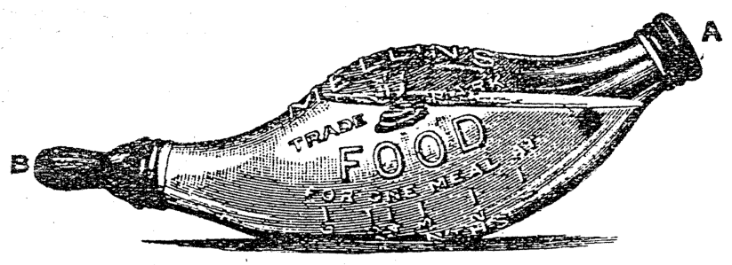
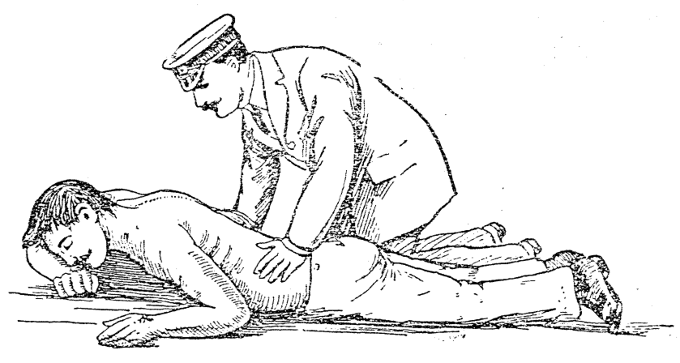
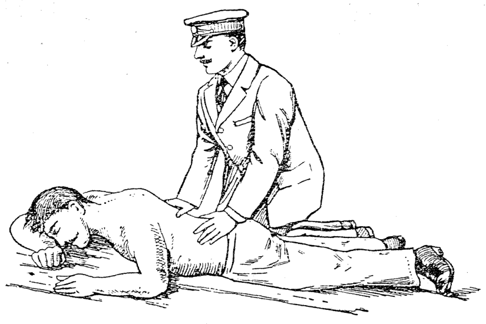

# 第四十章 照顧及幼飼囡仔 (Chiau-kò͘ kap Iū-chhī Gín-ná)

> **所屬篇章**：第四篇 內科看護學 (Lāi-kho Khàn-hō͘-ha̍k)
> **原書頁碼**：第 646 頁 ～ 第 663 頁 (已收錄 18/18 頁)

---

<!-- Page 646 Start -->
#### 📖 原書第 646 頁

### TĒ 40 CHIŪⁿ
### LŪN CHIÀU-KÒ͘ KAP IÚⁿ-CHHĪ GÍN-NÁ

*〔邊註：Thiⁿ-sīⁿ-lâng〕*

Gín-ná sī kok ê tōe-ki, só͘-í chòe iàu-kín sī tiòh chiàu-kò͘, iúⁿ-chhī. Siók-gú ū kóng “Thiⁿ-sīⁿ tōe-iúⁿ”, iā kóng “Thiⁿ-sīⁿ-lâng,” ì-sù chiū-sī Siōng-tè ū kau-tài gín-ná hō͘ pē-bú iúⁿ-chhī, khó-sioh pē-bú khah-siông bōe hiáu pôe-iúⁿ sòe-hàn gín-ná.

> **【全漢對照】**
> ### 第 40 章
> ### 論照顧佮養飼囡仔
> 
> *〔邊註：天生人〕*
> 
> 囡仔是國的地基，所以做要緊是著照顧、養飼。俗語有講「天生地養」，也講「天生人」，意思是上帝有交代囡仔予父母養飼，可惜父母較常袂曉培育細漢囡仔。

---

Lūn chiàu-kò͘ gín-ná ê hoat-tō͘, chiàu-kò͘ phòa-pīⁿ gín-ná, pí chiàu-kò͘ phòa-pīⁿ tōa-lâng, koh khah ûi-lān. Gín-ná ê phín-sèng, kap tōa-lâng ê phín-sèng, chin tōa koh-iūⁿ. Lán tiòh ōe-kì-tit Pó-lô só kóng ê ōe, chiū-sī “Góa chòe gín-ná ê sî, kóng ōe chhin-chhiūⁿ gín-ná, sèng-chêng chhin-chhiūⁿ gín-ná, ì-kiàn chhin-chhiūⁿ gín-ná; í-keng sêng-jîn, chiū hòe-bô gín-ná ê sū.” Lán tiòh ōe hiáu-tit gín-ná ê sèng-chêng, nā bô, teh kò͘ gín-ná ê sî, ún-tàng khah bô hoat-tit. Ū lâng kóng chiàu-kò͘ gín-ná chhin-chhiūⁿ kóng ōe tī bōe thong ê kok. Gín-ná ê ōe, kap tōa-lâng-ê, ū koh-iūⁿ. I sim-lāi ê liām-thâu, phín-hēng, su-siúⁿ lóng kap tōa-lâng bô tâng. Só͘-í put-chí iàu-kín, khàn-hō͘ tiòh bêng-pe̍k gín-ná ê sèng. Nā chiàu-kò͘ phòa-pīⁿ gín-ná, koh khah tiòh ū jîn-ài, thiàⁿ-sioh ê sim, ōe thun-lún. Khàn-hō͘ tiòh khòaⁿ gín-ná ê khoán-sit, siat-hoat lâi pang-chān i. Tiòh sòe-jī chim-chiok khòaⁿ i in-ūi cháiⁿ-iūⁿ khàu; me̍h-phok, thé-un, ho͘-khip, khùn á-sī cheng-sîn, sī sím-mi̍h khoán.

> **【全漢對照】**
> 論照顧囡仔的法度，照顧破病囡仔，比照顧破病大人，閣較為難。囡仔的品性，佮大人的品性，真大各樣。咱著會記得保羅所講的話，就是「我做囡仔的時，講話親像囡仔，性情親像囡仔，意見親像囡仔；已經成人，就廢無囡仔的事。」咱著會曉得囡仔的性情，若無，咧顧囡仔的時，穩當較無法得。有人講照顧囡仔親像講話佇袂通的國。囡仔的話，佮大人的，有各樣。伊心內的念頭、品行、思想攏佮大人無同。所以不止要緊，看護著明白囡仔的性。若照顧破病囡仔，閣較著有仁愛、疼惜的心，會吞忍。看護著看囡仔的款式，設法來幫贊伊。著細膩斟酌看伊因為怎樣哭；脈搏、體溫、呼吸、睏抑是精神，是甚麼款。

---

*〔邊註：Sí-bông-sò͘〕*

Ta̍k ê khàn-hō͘ tiòh chai siáu-jî sí-bông-sò͘ chin koâiⁿ. Chit-ê sī chin khó-sioh, iā khah-chōe sī tùi bô kiàn-sek chiah án-ni. Tùi seng-lí-ha̍k lâi siúⁿ, chiū chai gín-ná

> **【全漢對照】**
> *〔邊註：死亡數〕*
> 
> 逐個看護著知小兒死亡數真懸。這個是真可惜，也較多是對無見識才按呢。對生理學來想，就知道囡仔

---

*〔頁尾註：Tiòh hó khoán-thāi pīⁿ-lâng. / 頁碼：617〕*

> **【全漢對照】**
> *〔頁尾註：著好款待病人。 / 頁碼：617〕*

<!-- Page 646 End -->

---

<!-- Page 647 Start -->
#### 📖 原書第 647 頁

### CHIÀU-KÒ͘ KAP IÚⁿ-CHHÍ GÍN-NÁ
**（照顧佮養飼囡仔）**

kap tōa-lâng chin koh-iūⁿ, in-ūi i iáu teh tōa. Só͘-í teh tōa ê sî pí tōa-lâng khah khoài jiám-tio̍h pīⁿ. Iā ū-sî khah khoài phah-sńg.

> **【全漢對照】**
> 佮大人真各樣，因為伊猶咧大。所以咧大的時比大人較快染著病。也有時較快拍損。

---

Lâng bô lūn tōa-lâng á-sī gín-ná, tùi si̍t-bu̍t tit-tio̍h lī-ek, sī i só͘ siau-hòa-ê, m̄-sī i só͘ chia̍h-ê; in-ūi ū-sî lâng chia̍h kè-thâu, á-sī m̄-tú-hó, án-ni ē hāi-lâng. Tùi án-ni lâi siūⁿ gín-ná siau-hòa si̍t-bu̍t sī chin iàu-kín. Bōe hiáu-tit ióng-io̍k gín-ná ê lāu-bú móa sì-kòe. Só͘-í tī chia beh kóng-khí iúⁿ-chhī sòe-hàn gín-ná, kúi-nā hāng ê kui-kú.

> **【全漢對照】**
> 人無論大人抑是囡仔，對食物得著利益，是伊所消化的，毋是伊所食的；因為有時人食過頭，抑是毋咁好（毋拄好），按呢會害人。對按呢來想，囡仔消化食物是真要緊。袂曉得踴育（養育）囡仔的老母滿四界。所以佇遮欲講起養飼細漢囡仔，幾若項的規矩。

---

### Gín-ná ê tāng-liōng kap seng-tióng
**（囡仔的重量佮生長）**

Gín-ná ê tāng-liōng kap seng-tióng: Gín-ná thâu chi̍t nî ê tāng-liōng ti̍h kì, in-ūi tāng-liōng sī gín-ná hoat-io̍k oân-choân ê chèng-kù. Só͘-í khàn-hō͘-hoat hó á-sī m̄-hó, iā thang koat-tēng. Gín-ná ê tāng-liōng phêng-hoat chiàu ē-bīn. Khí-thâu 6 ge̍h-ji̍t ti̍h ta̍k lé-pài chi̍t pái, kàu 3 ge̍h-ji̍t í-siōng nñg lé-pài chi̍t pái, nā chi̍t hè chiok, chì chió chi̍t ge̍h-ji̍t ti̍h chi̍t pái.

> **【全漢對照】**
> 囡仔的重量佮生長：囡仔頭一年的重量著記，因為重量是囡仔發育完全的證據。所以看護法好抑是毋好，也通決定。囡仔的重量秤法照下面。起頭6個月日著逐禮拜一擺，到3個月日以上兩禮拜一擺，若一歲足，至少一個月日著一擺。

---

Gín-ná tú-á siⁿ saⁿ sì ji̍t chiū-sī sit tāng 100 chì 200 *grms*. (4 chì 8 niú). Kàu tē 7 ji̍t, i ê tāng-liōng kap chhut-sì hit ji̍t pîⁿ-pîⁿ. Jiân-āu ta̍k lé-pài ti̍h ke-thiⁿ 100 chì 200 *grms*. Nā kàu 6 ge̍h chì 12 ge̍h-lāi, i ke-thiⁿ ê tāng-liōng, pí chêng khah bān, ta̍k lé-pài ē ke 50 chì 100 *grms*.

> **【全漢對照】**
> 囡仔拄仔生三、四日就是失重 100 至 200 *grms*. (4 至 8 兩)。到第 7 日，伊的重量佮出生彼日平平。然後逐禮拜著加添 100 至 200 *grms*. 若到 6 月至 12 月內，伊加添的重量，比前較慢，逐禮拜會加 50 至 100 *grms*.

---

Gín-ná tú-á chhut-sì ê sî, i ê tāng-liōng pêng-kun tāi-iok 6 pōng-pòaⁿ chì 7 pōng-pòaⁿ. Nā kàu 3 ge̍h-ji̍t, ti̍h ū 9 pōng-pòaⁿ chì 13 pōng ; tē 6 ge̍h-ji̍t, ti̍h ū 12 pōng chì 16 pōng ; 9 ge̍h-ji̍t, ti̍h ū 15 pōng-pòaⁿ chì 18 pōng ; chi̍t nî ti̍h ū 18 pōng-pòaⁿ chì 22 pōng. Kìⁿ-nā ióng-chòng ê gín-ná, thèng-hāu kàu 5 ge̍h, i ê tāng-liōng ē tēng-pē ; nā 12 ge̍h ē saⁿ pē.

> **【全漢對照】**
> 囡仔拄仔出生的時，伊的重量平均大約 6 磅半至 7 磅半。若到 3 個月日，著有 9 磅半至 13 磅；第 6 個月日，著有 12 磅至 16 磅；9 個月日，著有 15 磅半至 18 磅；一年著有 18 磅半至 22 磅。見若勇壯的囡仔，聽候到 5 月，伊的重量會重倍（加倍）；若 12 月會三倍。

---

Ióng-chòng ê gín-ná ê tāng-liōng, ke-thiⁿ khah-chōe sī chiàu kui-kú. Chóng-sī 7 kàu 8 ge̍h-ji̍t, gín-ná kiám-chhái in-ūi hoat chhùi-khí, á-sī in-ūi thiⁿ-khì siuⁿ joa̍h, tì-kàu bô ke-thiⁿ i ê tāng-liōng, nā-sī tī chi̍t lé-pài-lāi, lóng-

> **【全漢對照】**
> 勇壯的囡仔的重量，加添較多是照規矩。總是 7 到 8 個月日，囡仔檢綵因為發喙齒，抑是因為天氣傷熱，致到無加添伊的重量，若是佇一禮拜內，攏——

<!-- Page 647 End -->

---

<!-- Page 648 Start -->
#### 📖 原書第 648 頁

### E-NÁ Ê TĀNG-LIŌNG, TĀI-PIĀN (619)

chóng bô phòa-pīⁿ, iā bô ke-thiⁿ tāng-liōng, iû-goân sī ū-bat tú-tio̍h.

Tī ē-tóe só͘ siá ê pió ū kì ta-pó͘ gín-ná chi̍t hè í-lāi pêng-kun ê tāng-liōng:

| | Pōng | Kgm. | | | Pōng | Kgm. |
| :--- | :--- | :--- | :--- | :--- | :--- | :--- |
| Thé-tāng chhut-sì | 7 | 3.17 | Thé-tāng chhit ge̍h | 16 | 7.25 |
| chit ge̍h | 7 ¾ | 3.51 | poeh ge̍h | 17 | 7.71 |
| nn̄g ge̍h | 9 ½ | 4.30 | káu ge̍h | 18 | 8.16 |
| saⁿ ge̍h | 11 | 4.99 | cháp ge̍h | 19 | 8.61 |
| sì ge̍h | 12 ½ | 5.66 | cháp-it ge̍h | 20 | 9.07 |
| gō͘ ge̍h | 14 | 6.35 | cháp-jī ge̍h | 21 | 9.45 |
| la̍k ge̍h | 15 | 6.80 | | | |

*(旁註：Tāng-liōng-pió)*

> **【全漢對照】**
> **嬰仔的重量、大便** (619)
> 
> 總無破病，也無加添重量，猶原是有曾抵著。
> 
> 佇下底所寫的表有記查埔囡仔一歲以內平均的重量：
> 
> | | 磅 | 公斤 | | | 磅 | 公斤 |
> | :--- | :--- | :--- | :--- | :--- | :--- | :--- |
> | 體重 出世 | 7 | 3.17 | 體重 七月 | 16 | 7.25 |
> | 一月 | 7 ¾ | 3.51 | 八月 | 17 | 7.71 |
> | 兩月 | 9 ½ | 4.30 | 九月 | 18 | 8.16 |
> | 三月 | 11 | 4.99 | 十月 | 19 | 8.61 |
> | 四月 | 12 ½ | 5.66 | 十一月 | 20 | 9.07 |
> | 五月 | 14 | 6.35 | 十二月 | 21 | 9.45 |
> | 六月 | 15 | 6.80 | | | |
> 
> *(旁註：重量表)*

---

Tio̍h chai téng-bīn só͘ kì tāng-liōng ê pió sī pêng-kun nā-tiāⁿ, ióng-kiāⁿ ê gín-ná, ū-ê pí hit hō pió-lāi ê sò͘ khah tāng, ū-ê khah khin.

> **【全漢對照】**
> 著知頂面所記重量的表是平均若定，勇健的囡仔，有的比彼號表內的數較重，有的較輕。

---

### [Thâu-khak thang phō hō͘ khiā-khí-lâi]

Kàu tī 4 ge̍h-ji̍t ê gín-ná, thâu-khak chiah thang phō hō͘ khiā-khí-lâi. Kàu tē 12 ge̍h-ji̍t chiū ē khiā; tùi 15 chì cháp-poeh ge̍h-ji̍t chiū ē kiâⁿ-cháu.

> **【全漢對照】**
> **[頭殼通抱予豎起來]**
> 
> 到佇 4 個月的囡仔，頭殼才通抱予豎起來。到第 12 個月就會豎；對 15 至 18 個月就會行走。

---

### [Chia̍h leng]

Gín-ná iáu-bē hoat-khí ê sî, bē siau-hòa gō͘-kak ê si̍t-bu̍t, só͘-í tī káu ge̍h-ji̍t-lāi tio̍h chia̍h lâng-leng, á-sī gû-leng.

> **【全漢對照】**
> **[食奶]**
> 
> 囡仔猶未發齒的時，袂消化五穀的食物，所以佇九個月內著食人奶，抑是牛奶。

---

Gín-ná ê tāi-piān chhut-sì liáu-āu, keh saⁿ sì ji̍t, hit-ê pùn ê sek sī o͘-ê, āu-lâi chiām-chiām piàn-ōaⁿ, chhin-chhiūⁿ kiáu koe-nn̄g ê khoán-sit. Thâu chit lé-pài ta̍k ji̍t tāi-piān n̄g saⁿ pái. Āu-lâi hit-ê pùn ê sek sī nĝ-gâm, iā khah bē kà-kà, kàu tē cháp-jī ge̍h-ji̍t ê sî, ta̍k ji̍t tāi-piān, chi̍t n̄g pái. Nā ū pīⁿ ê sî, tāi-piān chiúⁿ pīⁿ chhiⁿ-sek ê pùn, iā lóng chúi-chúi kà-kà, koh chin chhàu, pùn-nih ū bē siau-hòa ê mi̍h, iā ū-sî ē kâⁿ huih chhut-lâi.

> **【全漢對照】**
> 囡仔的大便出世了後，隔三四日，彼個糞的色是烏的，後來漸漸變換，親像攪雞卵的款式。頭一禮拜逐日大便兩三擺。後來彼個糞的色是黃含，也較袂酵酵，到第十二個月的時，逐日大便，一兩擺。若有病的時，大便像變青色的糞，也攏水水酵酵，閣真臭，糞裡有袂消化的物，也有時會含血出來。

---

### [Chhī gín-ná ê hoat]

Gín-ná chhut-sì liáu-āu jī-cháp-sì tiám í-lāi, m̄-bián hō͘ i chia̍h leng, kan-ta ēng chi̍t n̄g tê-sî lâ-lûn-sio ê kún-chúi hō͘ i lim, chiū kàu-gia̍h.

Chhī gín-ná ū saⁿ hāng hoat-tō͘:
1. Chia̍h leng, lāu-bú á-sī leng-bú-ê.

*(旁註：Saⁿ hāng hoat-tō͘)*

> **【全漢對照】**
> **[飼囡仔的法]**
> 
> 囡仔出世了後二十四點以內，毋免予伊食奶，干焦用一兩茶匙拉勻燒的滾水予伊飲，就夠額。
> 
> 飼囡仔有三項法度：
> 1. 食奶，老母抑是奶母的。
> 
> *(旁註：三項法度)*

---

*(頁底註記)*
Iòh-kan m̄-thang hē tī iòh-toaⁿ-téng.

> **【全漢對照】**
> 藥罐毋通下佇藥單頂。

<!-- Page 648 End -->

---

<!-- Page 649 Start -->
#### 📖 原書第 649 頁

### CHIÀU-KÒ͘ KAP IÚⁿ-CHHĨ GÍN-NÁ

#### [Chhī gín-ná saⁿ hāng hoat]

2. Ēng gû-leng, á-sī lâng chòe ê si̍t-bu̍t hō͘ chia̍h.
3. Tē it kap tē jī saⁿ chham chòe chi̍t-ē ēng.

> **【全漢對照】**
> **〔飼囡仔三項法〕**
> 2. 用牛奶，抑是人做的食物予食。
> 3. 第一佮第二相參做一下用。

---

#### [Lāu-bú ê leng tē it hó]

Chia̍h lāu-bú ê leng sī chū-jiân, iā tē it hó ê hoat-tō͘. Nā-sī lāu-bú ū phòa-pīⁿ bōe-tit-thang chhī i, chhiàⁿ leng-bú tio̍h ióng-kiāⁿ, iā i pún-sin ê kiáⁿ, tio̍h kap só͘ beh chhī ê gín-ná chha-put-to pîⁿ ge̍h. Tio̍h chiàu sî-chūn lâi chhī i, m̄-thang chòe chi̍t-ē hō͘ i chia̍h siuⁿ chōe, á-sī khah kín, án-ni chiū khah oh siau-hòa; ū-sî ōe thò͘-chhut-lâi. Nā siông-siông hō͘ i chia̍h, iā sī chin m̄-hó. Só͘-í m̄-thang nā khòaⁿ-kìⁿ gín-ná chi̍t-ē háu, chiū hō͘ i chia̍h, tek-khak tio̍h ū tiāⁿ-tio̍h ê sî-chūn.

> **【全漢對照】**
> **〔老母的奶第一好〕**
> 食老母的奶是自然，也第一好的法度。若是老母有破病𣍐得通飼伊，請奶母著勇健，也伊本身的囝，著佮所欲飼的囡仔差不多平月。著照時陣來飼伊，毋通做一下予伊食傷濟，抑是較緊，按呢就較惡消化；有時會吐出嚟。若常常予伊食，也是真毋好。所以毋通若看見囡仔一下吼，就予伊食，的確著有定著的時陣。

---

#### [Tē jī ji̍t]

Tē jī ji̍t tio̍h hō͘ gín-ná chia̍h leng sì gō͘ pái chiū hó. Āu-lâi tio̍h n̄g tiám-cheng chia̍h chi̍t pái. Mî-sî tùi cha̍p tiám, kàu chá-khí-sî chhit tiám, hō͘ chia̍h nñg pái chiū hó. Tùi chi̍t ge̍h kàu tē gō͘ ge̍h, mî-sî chia̍h chi̍t pái chiū hó; āu-lâi tùi cha̍p tiám, kàu chhit tiám, lóng m̄-bián hō͘ i chia̍h leng. Khah tōa bīn lâi kóng, thâu chi̍t mî bô hō͘ chia̍h, gín-ná ōe háu, tē jī mî ōe koh háu, m̄-kú liâm-piⁿ khùn, tē saⁿ mî á-sī tē sì mî lóng hó khún.

> **【全漢對照】**
> **〔第二日〕**
> 第二日著予囡仔食奶四五擺就好。後來著兩點鐘食一擺。暝時對十點，到早起時七點，予食兩擺就好。對一個月到第五個月，暝時食一擺就好；後來對十點，到七點，攏毋免予伊食奶。較大面來講，頭一暝無予食，囡仔會吼，第二暝會閣吼，毋過連鞭睏，第三暝抑是第四暝攏好睏。

---

#### [Gín-ná m̄-thang kâm leng-thâu lâi khùn]

Gín-ná teh chia̍h leng ê sî-chūn m̄-thang hō͘ khùn, iā m̄-thang hō͘ i kâm leng-thâu lâi khùn. Nā teh chia̍h leng ê sî ài khùn, āu pái tio̍h thêng khah kú tām-po̍h chiah hō͘ i chia̍h. Chia̍h leng ê sî-kan tio̍h tùi cha̍p-hun chì jī-cha̍p hun-kú. Gín-ná nā thò͘, á-sī pùn-nī ū bōe siau-hòa ê leng, khah-siông sī tùi chia̍h kè-thâu chōe.

> **【全漢對照】**
> **〔囡仔毋通含奶頭來睏〕**
> 囡仔咧食奶的時陣毋通予睏，也毋通予伊含奶頭來睏。若咧食奶的時愛睏，後擺著停較久淡薄才予伊食。食奶的時間著對十分至二十分久。囡仔若吐，抑是糞尿有𣍐消化的奶，較常是對食過頭濟。

---

#### [Sóe leng-thâu]

Chia̍h leng liáu tio̍h ēng sio-chúi lâi sóe leng-thâu, kap leng-phong; tio̍h sî-siông hō͘ chin chheng-khì. Nā-sī leng-phong siuⁿ tiùⁿ, á-sī siuⁿ tēng, tio̍h tùi pîⁿ-á jê hō͘ khah nńg. Nā-sī lāu-bú ê leng siuⁿ chōe, tio̍h tùi leng-phong ēng *pump*, kā i thiu-chhut-lâi; nā bô, kiaⁿ-liáu ōe khí jia̍t.

> **【全漢對照】**
> **〔洗奶頭〕**
> 食奶了著用熱水來洗奶頭，佮奶房；著時常予真清潔。若是奶房傷脹，抑是傷硬，著對墘仔捼予較軟。若是老母的奶傷濟，著對奶房用 *pump*（抽筒），共伊抽出嚟；若無，驚了會起熱。

---

#### [Siau leng]

Ū-sî lāu-bú bô beh ēng ka-kī ê leng chhī gín-ná, tio̍h ēng hoat-tō͘ hō͘ i ê leng siau-khì. Khah-siông ēng *bella-*

> **【全漢對照】**
> **〔消奶〕**
> 有時老母無欲用家己的奶飼囡仔，著用法度予伊的奶消去。較常用 *bella-*（癲茄……）

<!-- Page 649 End -->

---

<!-- Page 650 Start -->
#### 📖 原書第 650 頁

**TṆ̄G-LENG, GÛ-LENG**　　**621**

---

### [接前頁段落]

*donna* kap *glycerinum* ê io̍h-ko lâi kô, ēng mî-hoe kap pheng-tòa lâi pa̍k hō͘ ân. Iā siāng hit sî tióh ēng sià-io̍h chhin-chhiūⁿ *magnesii sulphas* hō͘ chia̍h.

> **【全漢對照】**
> （顛茄）kap 甘油（glycerinum）的藥膏來膏，用棉花 kap 繃帶來縛予緊。也相同彼時著用瀉藥親像硫酸鎂（magnesii sulphas）予食。

---

### Tṉ̄g-leng（斷奶）

Tṉ̄g-leng: Gín-ná nā í-keng káu ge̍h chiok, tióh tṉ̄g-leng. Siōng kú sī cha̍p-jī ge̍h. Bat khòaⁿ-kìⁿ gín-ná nñg hè, saⁿ hè, sì hè, iáu teh chia̍h lāu-bú ê leng, án-ni chin tōa m̄-tióh. Nā án-ni chia̍h leng siuⁿ kú, gín-ná bōe ióng, m̄-chiāⁿ gín-ná, lāu-bú iā ōe soe-jio̍k pìⁿ pîn-hiat. Lâng kóng "lâng chia̍h a-phiàn, a-phiàn chia̍h lâng," á-sī "lâng chia̍h chiú, chiú chia̍h lâng," án-ni gín-ná chia̍h leng siuⁿ kú thang kóng, gín-ná chia̍h lāu-bú, lāu-bú chia̍h gín-ná, lóng siū sún-hāi. Tṉ̄g-leng ê sî-chūn tī chhiu-thiⁿ, á-sī tang-thiⁿ khah hó, iā m̄-thang hut-jiân tṉ̄g, tióh ûn-ûn-á tṉ̄g-leng khah hó.

> **【全漢對照】**
> **斷奶**：囡仔若已經九個月足，著斷奶。尚久是十二個月。曾看見囡仔兩歲、三歲、四歲，猶咧食老母的奶，按呢真大伓著。若按呢食奶傷久，囡仔𣍐勇、伓成囡仔，老母也𣍐衰弱變貧血。人講「人食鴉片，鴉片食人」，抑是「人食酒，酒食人」，按呢囡仔食奶傷久通講，囡仔食老母，老母食囡仔，攏受損害。斷奶的時陣佇秋天、抑是冬天較好，也伓通忽然斷，著勻勻仔斷奶較好。

---

### Gû-leng（用牛奶，抑是人做的食物予食）

Ēng gû-leng, á-sī lâng chòe ê si̍t-bu̍t hō͘ chia̍h: Nā-sī gín-ná bōe tit thang chia̍h lâng-leng, tióh chia̍h gû-leng. Chit hō gû-leng pí lâng chòe ê si̍t-bu̍t khah hó. Lâng-leng kap gû-leng bô sio-siāng; gû-leng ū nñg-pe̍h-chit khah-chōe, thn̂g-chit khah chió. Só͘-í beh chiong gû-leng hō͘ i chia̍h, tióh phè-ha̍p chúi. Gín-ná tú-á chhut-sì tùi chit lé-pài kàu chit ge̍h-ji̍t, tióh chi̍t hūn ê gû-leng phàu nñg hūn ê chúi; iā tióh chham tām-póh thn̂g; ū-sî tióh ke gû-leng hit téng-bīn ê phê (*cream*). Chit hō gû-leng nā kàu-gia̍h kāu, m̄-bián ke gû-leng-phê, kiaⁿ-liáu chia̍h bōe siau-hòa. Gín-ná ná tōa, chúi tióh chiām-chiām kiám-chió. Gín-ná nā saⁿ ge̍h-ji̍t, gû-leng kap chúi tióh tùi pòaⁿ. Gín-ná kàu la̍k ge̍h-ji̍t í-āu tióh nñg hūn gû-leng, chi̍t hūn chúi; iā chhit ge̍h m̄-bián phàu chúi, hō͘ i chia̍h gû-leng tú-hó. Chit-tiáp thang hō͘ i lim tām-póh ám, á-sī chi̍t pòaⁿ-pái ēng hún lūi hō͘ chia̍h. Cha̍p ge̍h-ji̍t thang hō͘ chia̍h bah-tê á-sī koe-thng. Gín-ná chit hè chiok chiū

> **【全漢對照】**
> **用牛奶，抑是人做的食物予食**：若是囡仔𣍐得通食人奶，著食牛奶。這號牛奶比人做的食物較好。人奶 kap 牛奶無相同；牛奶有卵白質較濟，糖質較少。所以欲將牛奶予伊食，著配合水。囡仔拄仔出世對一禮拜到一個月日，著一份的牛奶泡兩份的水；也著摻淡薄糖；有時著加牛奶彼頂面的皮（cream，鮮奶油）。這號牛奶若夠額厚，免加牛奶皮，驚了食𣍐消化。囡仔若大，水著漸漸減少。囡仔若三個月日，牛奶 kap 水著對半。囡仔到六個月日以後著兩份牛奶，一份水；也七個月免泡水，予伊食牛奶拄好。這霎通予伊啉淡薄泔，抑是一半擺用粉類予食。十個月日通予食肉茶抑是雞湯。囡仔一歲足就……

---

### [頁底格言]

Hó koh chīn-tiong ê lô͘-po̍k, lí tī chió-ê í-keng chīn-tiong,......thang ji̍p lí ê chú-lâng ê khoài-lo̍k (Má-thài 25 : 21).

> **【全漢對照】**
> 好閣盡忠的奴僕，你佇少個已經盡忠，……通入你的主人的快樂（馬太 25 : 21）。

<!-- Page 650 End -->

---

<!-- Page 651 Start -->
#### 📖 原書第 651 頁

**622 CHIÀU-KÒ͘ KAP IÚⁿ-CHHĨ GÍN-NÁ**

...thang chia̍h koe-nñg, á-sī bê kap gû-leng. Āu-lâi ná-kú, ná hō͘ chia̍h khah tēng ê mih; cha̍p-poeh ge̍h-ji̍t thang chia̍h tām-po̍h nńg-nńg ê bah. Put-sî ti̍o̍h chiong kam-á ké-chí ê chiap hō͘ gín-ná chia̍h, tî-hông sìⁿ kut ê pīⁿ.

> **【全漢對照】**
> ...通食雞卵，抑是糜佮牛奶。後來愈久，愈予食較硬的物；十八個月日通食淡薄軟軟的肉。不時著將柑仔果子的汁予囡仔食，預防生骨的病。

---

### Chia̍h leng ê kui-kú（食奶的規矩）

Gín-ná chia̍h leng ū tiāⁿ-ti̍o̍h ê kui-kú:

1. Gín-ná chia̍h leng, ū it-tēng ê sî, bē kàu chia̍h ê sî, m̄-thang hō͘ i chia̍h.
2. Chia̍h leng ê sî, khàn-hō͘ ti̍o̍h tiàm pâng-ni̍h, m̄-thang chhut-khì hō͘ ka-kī chia̍h, iā m̄-thang hō͘ chia̍h siuⁿ kín, ti̍o̍h bān-bān chia̍h. Chhĩ gín-ná ê sî, hit ki chhĩ-leng-khì khàn-hō͘ ti̍o̍h the̍h tī chhiú-ni̍h.
3. Ti̍o̍h chheng-khì. Gín-ná chia̍h leng liáu, hit ê chhĩ-leng-khì, ti̍o̍h sóe hō͘ chheng-khì, iā ti̍o̍h kè-sán; sóe liáu chìm hē chúi-ni̍h; ēng pò͘ am-teh thang koh-chài ēng. Gín-ná chia̍h leng liáu ti̍o̍h ēng *glycerinum* kap *borax* sóe i ê chhùi-lāi hō͘ chheng-khì (khòaⁿ tē 623 bīn).
4. Gín-ná chia̍h chi̍t pái ê leng m̄-thang kè jī-cha̍p hun-kú.
5. Gín-ná m̄-thang kâm leng-thâu sòa khùn-khì.
6. Gín-ná chia̍h liáu, nā gû-leng ū chhun, m̄-thang koh chhòng sio hō͘ chia̍h.
7. Gû-leng ê un-tō͘ ti̍o̍h 98 tō͘ F. (36.7° C.).
8. Gín-ná chia̍h leng ê chē-chió ti̍o̍h ēng niû-poe lâi niû (khòaⁿ tē 624 bīn).

> **【全漢對照】**
> 囡仔食奶有定著的規矩：
> 
> 1. 囡仔食奶，有一定ptrê時，未到食的時，毋通予伊食。
> 2. 食奶的時，看護著踮房裡，毋通出去予家己食，亦毋通予食傷緊，著慢慢食。飼囡仔的時，彼枝飼奶器看護著提佇手裡。
> 3. 著清潔。囡仔食奶了，彼個飼奶器，著洗予清潔，亦著消毒；洗了浸下水裡；用布掩咧通閣再用。囡仔食奶了著用 *glycerinum*（甘油）佮 *borax*（硼砂）洗伊的嘴內予清潔（看第 623 面）。
> 4. 囡仔食一擺的奶毋通過二十分久。
> 5. 囡仔毋通含奶頭紲睏去。
> 6. 囡仔食了，若牛奶有賰，毋通閣創燒予食。
> 7. 牛奶的溫度著 98 度 F. (36.7° C.)。
> 8. 囡仔食奶的多小著用量杯來量（看第 624 面）。

---

### Chhĩ-leng-khì（飼奶器）

Hit hō tàu tn̂g ê chhiū-leng-kńg ê kan-á sī chin m̄-hó, in-ūi hit ê chhiū-leng-kńg sī chin oh chheng-kiat. Tī chhiū-leng-kńg-lāi bî-seng-bu̍t chin khoài bih. Khah hó ti̍o̍h ēng chi̍t ki bô chhiū-leng-kńg ê gû-leng-pân, pân-chhùi khoah, iā ū chi̍t-ê leng-thâu nā-tiāⁿ. Gû-leng-pân ê khoán-sit sī chhin-chhiūⁿ chûn ê hêng-chōng; siang thâu ū khang. Chit hō te̍k-pia̍t ê pân kiò-chòe gín-ná ê chhĩ-leng-khì.

Hit ê leng-thâu ê khang m̄-thang siuⁿ tōa, in-ūi m̄-ài...

> **【全漢對照】**
> 彼號透長的樹奶管（橡膠管）的矸仔是真毋好，因為彼個樹奶管是真僫清潔。佇樹奶管內微生物真快覕。較好著用一支無樹奶管的牛奶瓶，瓶嘴闊，亦有一個奶頭爾定。牛奶瓶的款式是親像船的形狀；雙頭有孔。這號特別的瓶叫做囡仔的飼奶器。
> 
> 彼個奶頭的孔毋通傷大，因為毋愛……

<!-- Page 651 End -->

---

<!-- Page 652 Start -->
#### 📖 原書第 652 頁

  <figure style="display: inline-block; margin: 12px; max-width: 90%; text-align: center;">
    
    <figcaption style="font-size: 14px; color: #4a5568; margin-top: 6px;"><em>Tē 488 tô.—Gín-ná ê chhī-leng-khì.</em></figcaption>
  </figure>

**GÍN-NÁ Ê CHHĪ-LENG-KHÌ**　　**623**

hō͘ gín-ná chia̍h leng siuⁿ kín. Pân-bé iā ū chi̍t khang, chit hāng sī beh khah lī-piān thang sóe, koh chi̍t hāng gín-ná chia̍h leng ê sî, bé hit khang (tē 488 tô͘ A) sui-bóng ū that, hit ê that tiong-ng ū chǹg chi̍t-ê khang thang hō͘ khong-khì tè gû-leng ji̍p-khì.

> **【全漢對照】**
> **囝仔的飼乳器**　　**623**
> 
> 予囝仔食乳傷緊。瓶尾亦有一孔，這項是欲較利便通洗，閣一項囝仔食乳的時，尾彼孔（第 488 圖 A）雖罔有塞，彼個塞中央有鑽一個孔通予空氣隨牛奶入去。

---

### Chiàu-kò͘ chhī-leng-khì (gû-leng-pân) ê hoat-tō͘ :
*(Piⁿ-thâu piau-tê: Chiàu-kò͘ chhī-leng-khì)*

1. Chit hō chhī-leng-khì ti̍oh put-chí chheng-khì. Nā bô chheng-khì, gín-ná ê chhùi-lāi ōe siⁿ pe̍h tiám, bōe siau-hòa, hā-lī, sī chin khoài (khòaⁿ tē 501 bīn).
2. Chia̍h leng liáu, ti̍oh liâm-piⁿ chiong léng-chúi lâi sóe chhī-leng-khì kap leng-thâu. Āu-lāi ēng sio-chúi kap sat-bûn koh sóe, chiah kè-sàh.

> **【全漢對照】**
> ### 照顧飼乳器（牛奶瓶）的法度：
> *(旁註：照顧飼乳器)*
> 
> 1. 這號飼乳器著不止清氣。若無清氣，囝仔的喙內會生白點，袂消化、下痢，是真快（看第 501 面）。
> 2. 食乳了，著連鞭將冷水來洗飼乳器及乳頭。後來用熱水及雪文（肥皂）閣洗，才過煠。

---

**Tē 488 tô͘. — Gín-ná ê chhī-leng-khì.**

> **【全漢對照】**
> **第 488 圖。— 囝仔的飼乳器。**

---

3. Chìm tī *lotio acidi borici*, iā ēng pò͘ am-teh.
4. Teh-beh koh ēng ti̍oh koh chìm tī chheng-khì chúi, kè-sàh, án-ni hit ê *lotio acidi borici* ōe sóe tû-khì, iā chhī-leng-khì ōe chheng-khì koh sio, lóng piān thang tóe gû-leng.
5. Nā ēng nn̄g ê chhī-leng-khì lâi lûn-liû, iā sī khah hó.

> **【全漢對照】**
> 3. 浸佇 *lotio acidi borici*（硼酸洗液），亦用布罨咧。
> 4. 欲閣用著閣浸佇清氣水，過煠，按呢彼個 *lotio acidi borici* 會洗除去，亦飼乳器會清氣閣熱，攏便通貯牛奶。
> 5. 若用兩個飼乳器來輪流，亦是較好。

---

### [Chhī gín-ná ê hoat-tō͘]

Chhī gín-ná ê hoat-tō͘ sī chiàu ē-tóe ê pió (after Holt) :

> **【全漢對照】**
> 飼囝仔的法度是照下底的表 (after Holt)：

---

Góa siat-sú ōe kóng lâng kap thiⁿ-sài ê im-gú, nā bô jîn-ài, góa chiū chiaⁿ-chòe hiáng ê tâng-khì, tân ê lâ-poah (I Ko-lîm-to 13: 1).

> **【全漢對照】**
> 我設使會講人及天使的蔭語，若無仁愛，我就成做響的銅器，鳴的喇叭（I 哥林多 13: 1）。

<!-- Page 652 End -->

---

<!-- Page 653 Start -->
#### 📖 原書第 653 頁

### 624 CHHĨ Eⁿ-Á Ê PIÓ

| Eⁿ-á chhut-sì liáu ê sūn-sū | 24 tiám-cheng-lāi chhī kúi pái | Ta̍k tǹg-tiong ê sî-kan | Mî-sî 10 tiám kàu chá-khí 7 tiám chhī kúi pái | Ta̍k pái chia̍h lōa-chōe | 24 tiám-cheng-lāi chia̍h lōa-chōe |
| :--- | :--- | :--- | :--- | :--- | :--- |
| 3 chì 7 ji̍t | 10 pái | 2 tiám-cheng | 2 pái | 30 — 45 c.c. | 280 — 430 c.c. |
| 2 chì 3 lé-pài | 10 „ | 2 „ | 2 „ | 45 — 90 c.c. | 430 — 860 c.c. |
| 4 chì 5 lé pài | 9 „ | 2 „ | 1 „ | 75—100 c.c. | 600 — 900 c.c. |
| 6 lé-pài chì 3 ge̍h | 8 „ | 2½ „ | 1 „ | 90—130 c.c. | 670—1000 c.c. |
| 3 ge̍h chì 5 ge̍h | 7 „ | 3 „ | 1 „ | 120—160 c.c. | 780—1060 c.c. |
| 5 ge̍h chì 9 ge̍h | 6 „ | 3 „ | 0 „ | 160—200 c.c. | 920—1170 c.c. |
| 9 ge̍h chì 12 ge̍h | 5 „ | 3½ „ | 0 „ | 215—260 c.c. | 1030—1260 c.c. |

> **【全漢對照】**
> 
> ### 624 飼嬰仔的表
> 
> | 嬰仔出世了的順序 | 24點鐘內飼幾擺 | 逐頓中的時間 | 暝時10點到早起7點飼幾擺 | 逐擺食偌濟 | 24點鐘內食偌濟 |
> | :--- | :--- | :--- | :--- | :--- | :--- |
> | 3至7日 | 10擺 | 2點鐘 | 2擺 | 30 — 45 c.c. | 280 — 430 c.c. |
> | 2至3禮拜 | 10 〃 | 2 〃 | 2 〃 | 45 — 90 c.c. | 430 — 860 c.c. |
> | 4至5禮拜 | 9 〃 | 2 〃 | 1 〃 | 75—100 c.c. | 600 — 900 c.c. |
> | 6禮拜至3月 | 8 〃 | 2½ 〃 | 1 〃 | 90—130 c.c. | 670—1000 c.c. |
> | 3月至5月 | 7 〃 | 3 〃 | 1 〃 | 120—160 c.c. | 780—1060 c.c. |
> | 5月至9月 | 6 〃 | 3 〃 | 0 〃 | 160—200 c.c. | 920—1170 c.c. |
> | 9月至12月 | 5 〃 | 3½ 〃 | 0 〃 | 215—260 c.c. | 1030—1260 c.c. |

<!-- Page 653 End -->

---

<!-- Page 654 Start -->
#### 📖 原書第 654 頁

### GÛ-LENG TIO̍H SIAU-TO̍K

**Siau-to̍k gû-leng ê hoat** *(側標)* : Kìⁿ-nā gû-leng pîⁿ-pîⁿ lóng ū hâm bî-seng-bu̍t, chóng-sī ū-ê kan-ta gû-leng piàn sng-chit, ū-ê ōe hō͘ tì-kàu tāng chèng, chhin-chhiūⁿ sió-tng-jia̍t, hó-lia̍t-la, seng-hông-jia̍t, sit-hû-tek-lí-a, kiat-hu̍t chèng, kap kúi-nā chéng hā-lī, chit hō chèng.

> **【全漢對照】**
> **牛乳著消毒**
> **消毒牛乳的法**：見若牛乳平平攏有含微生物，總是有ê干焦牛乳變酸質，有ê會致到重症，親像小腸熱、虎烈拉、猩紅熱、窒扶的里亞、結核症，及幾若種下痢，這號症。

---

Gû-leng chiàu kì tī ē-tóe ê sî-chūn, koh khah tio̍h chù-ì tī sat-khún ê sū:
1. Thiⁿ-khì iām-jia̍t, koh khah bōe thang tit-tio̍h sin chhiⁿ ê gû-leng ê sî, tē it tio̍h tì-ì.
2. Ū-sî sī bōe-ōe tiāⁿ-tiāⁿ chiong ióng-chòng gû ê gû-leng.
3. Gû-leng í-keng keng-kè 24 tiám-cheng, sòa bōe-tit-thang khǹg tī peng-siuⁿ-nih; chóng-sī tī jia̍t-tài-tōe, gû-leng khǹg hiah-kú, ún-tàng pháiⁿ-khì, m̄-thang ēng.
4. Thoân-jiám chèng chhin-chhiūⁿ sió-tng-jia̍t, seng-hông-jia̍t, sit-hû-tek-lí-a, hó-lia̍t-la kap kok chéng hā-lī chèng teh liû-hêng ê sî-chūn.

> **【全漢對照】**
> 牛乳照記佇下底的時陣，koh-khah 著注意佇殺菌的事：
> 1. 天氣炎熱，koh-khah 袂通得著新鮮的牛乳的時，第一著致意。
> 2. 有時是袂會定定向勇壯牛的牛乳。
> 3. 牛乳已經經過 24 點鐘，紲袂得通放大佇冰箱裡；總是在熱帶地，牛乳放遐久，穩當破壞去，毋通用。
> 4. 傳染症親像小腸熱、猩紅熱、窒扶的里亞、虎烈拉及各種下痢症咧流行的時陣。

---

**Sat bî-seng-bu̍t ê hoat** *(側標)*

Sat bî-seng-bu̍t ê hoat-tō͘, sī chiàu ē-bīn :
1. Chiong leng chú chi̍t tiám, á-sī tiám-pòaⁿ-cheng-kú, hit ê un-tō͘ tio̍h ū 212.0° F. tō (100.0° C.) (kún-chhèng-tiám).
2. Ēng Pa-su-tô (*Pasteur*) ê hoat-tō͘, chiong leng chú 30 hun-cheng-kú, hit ê un-tō͘ tio̍h ū 155° F. chì 170° F. tō (68.0°—76.6° C.). Tāi-khài ēng 155° F. tō (68° C.) ê un-tō͘, chiū 30 hun-cheng-kú, iā kàu-gia̍h thang sat-bia̍t hit hō pīⁿ ê sòe-khún.

> **【全漢對照】**
> **殺微生物的法**
> 殺微生物的法度，是照下面：
> 1. 將奶煮一點，抑是點半鐘久，hit ê 溫度著有 212.0° F. 度 (100.0° C.)（滾銃點）。
> 2. 用巴斯德（*Pasteur*）的法度，將奶煮 30 分鐘久，hit ê 溫度著有 155° F. 至 170° F. 度 (68.0°—76.6° C.)。大概用 155° F. 度 (68° C.) 的溫度，就 30 分鐘久，也夠額通殺滅 hit 號病的細菌。

---

Sat-khún liáu ê gû-leng, bô tek-khak thang kóng sī bô-to̍k-ê, in-ūi bî-khún sui-jiân thang sat-chīn, m̄-kú gê-pau (芽胞, spores) nā bô chú khah kú, bōe thang it-chīn châu-bia̍t. Só͘-í chiah ê bô sí ê gê-pau, ōe koh tióng-seng

> **【全漢對照】**
> 殺菌了的牛乳，無的確通講是無毒的，因為微菌雖然通殺盡，毋過芽胞（芽胞，spores）若無煮較久，袂通一盡剿滅。所以諸個無死的芽胞，會 koh 長生

---

*(註腳)*
Iū ê chit ōe hō͘ chhiū-leng, á-sī iû-pò͘ ōe pháiⁿ-khì.

> **【全漢對照】**
> 幼的漆會互樹奶，抑是油布會破壞去。

<!-- Page 654 End -->

---

<!-- Page 655 Start -->
#### 📖 原書第 655 頁

### 626 CHIÀU-KÒ͘ KAP IÚⁿ-CHHÎ GÍN-NÁ

### [Sat bî-seng-bu̍t ê hoat / 殺微生物ê法]

chiâⁿ-chòe bî-khún. Ke-thiⁿ un-tō͘ kàu 212° F. (100° C.) sòa chú chi̍t tiám-cheng-kú. Siat-sú nā khǹg tī peng-siuⁿ-lāi, gû-leng sui-jiân khǹg nn̄g saⁿ lé-pài-āu, iu-goân ōe chia̍h-tit. Ke-thiⁿ un-tō͘ kàu 155° F. (68° C.), chiū kan-ta thang khǹg nn̄g saⁿ ji̍t-kú nā-tiāⁿ.

> **【全漢對照】**
> （...成做微生物）
> 成做微菌。加添溫度到 212° F. (100° C.) 紲煮一點鐘久。設使若囥佇冰箱內，牛奶雖然囥兩三禮拜後，猶原會食得。加添溫度到 155° F. (68° C.)，就干單通囥兩三日久若定。

---

Kè sat-khún ê gû-leng, hit-ê siau-hòa-sèng ū kóe-ōaⁿ, khah bô hiah khoài siau-hòa. Hit-ê phè-chè, iu-goân kap chhiⁿ gû-leng sio-siāng hoat-tó͘. Ēng chit ê un-tō͘ (212° F., 100° C.), hit ê gû-leng ê siau-hòa-sèng, tì-kàu khah oh, kú-kú chia̍h chit hō leng, ōe hō͘ i tāi-piān khah pì, ōe chó-tòng-tio̍h gín-ná ê ióng-io̍k. Ēng 212° F. ê un-tō͘ lâi kè kún ê gû-leng, chiàu ē-bīn ê sî-chūn, chòe tē it ha̍p lō͘-ēng. Nā kiâⁿ hn̄g-lō͘, put-chí ha̍p-gî, gû-leng chiap-sio̍k hō͘ i kún, chiàu 212° F. (100° C.) ê un-tō͘, keng-kè nn̄g ji̍t, chi̍t pái chi̍t tiám-cheng-kú, hit ê that pân-chhùi ê mî-hoe, m̄-thang sóa-khì.

> **【全漢對照】**
> 過殺菌的牛奶，彼個消化性有改換，較無遐快消化。彼個配劑，猶原佮生牛奶相樣發倒。用彼個溫度（212° F., 100° C.），彼個牛奶的消化性，致到較僫，久久食這號奶，會互伊大便較秘，會阻擋著囡仔的養育。用 212° F. 的溫度來過滾的牛奶，照下面的時陣，做第一合路用。若行遠路，不止合宜，牛奶接續互伊滾，照 212° F. (100° C.) 的溫度，經過兩日，一次一點鐘久，彼個塞瓶嘴的棉花，唔通徙去。

---

Ēng Pa-su-tô ê khì-kū lâi chòe--ê, hō͘ i sio 155° F. 30 hun-kú, gû-leng ōe siū sún-hāi, ū á-sī bô, iáu-bē ū chèng-kù.

> **【全漢對照】**
> 用巴斯德（Pasteur）的器具來做的，互伊燒 155° F. 30 分久，牛奶會受損害，有抑是無，猶未有證據。

---

### [Gín-ná khoài-khoài kám-tio̍h / 囡仔快快感著]

Tú-á chhut-sì ê gín-ná, khoài-khoài kám-tio̍h, só͘-í iàu-kín tio̍h chhēng hō͘ sio. Gín-ná ê pak-tó͘, tio̍h siông-siông ēng pò kā i pau. Gín-ná ōe kiâⁿ ê sî, iu-goân tio̍h hō͘ pak-tó͘ sio, nā bô, ōe khah khoài jiám-tio̍h hā-lī ê chèng. Gín-ná sui-bóng chiām-chiām teh tōa, iā thang ēng tó-kōaⁿ kā i hâ--teh, hō͘ i pak-tó͘ ōe sio.

> **【全漢對照】**
> 拄仔出世的囡仔，快快感著（受寒），所以要緊著著互燒。囡仔的腹肚，著常常用布共伊包。囡仔會行的時，猶原著互腹肚燒，若無，會較快染著下痢的症。囡仔雖罔漸漸咧大，也通用肚綰共伊圍咧，互伊腹肚會燒。

---

### [Sóe-e̍k / 洗浴]

Gín-ná sóe-e̍k : Nā-sī kôaⁿ-thiⁿ ê sî tio̍h tī hé-lô-piⁿ, m̄-thang hō͘ léng-tio̍h, iā m̄-thang hō͘ chhe-tio̍h hong. Bē sóe ê tāi-seng só͘ ēng it-khài ê mi̍h-kiāⁿ, eng-kai tio̍h ū-pī. Gín-ná ū-sî ōe kiaⁿ, m̄-kú kàu koàiⁿ-sì ta̍k pái chiū chin ài koh sóe-e̍k. I nā kiaⁿ, tio̍h ēng chi̍t niá thán-á, hē phûn...

> **【全漢對照】**
> 囡仔洗浴：若是寒天之時著佇火爐邊，唔通互冷著，也唔通互吹著風。未洗的代先所用一概的物件，應該著預備。囡仔有時會驚，唔拘到慣勢每次就真愛閣洗浴。伊若驚，著用一領毯仔，下盆……

---

*Jîn-ài, hoān-sū jím siū, hoān-sū siong-sìm, hoān-sū ǹg-bāng, hoān-sū thun-lún (I Ko-lîm-to 13: 7).*

> **【全漢對照】**
> *仁愛，凡事忍受，凡事相信，凡事向望，凡事吞忍（哥林多前書 13: 7）。*

<!-- Page 655 End -->

---

<!-- Page 656 Start -->
#### 📖 原書第 656 頁

### GÍN-NÁ SÓE-E̍K (p. 627)

ê téng-bīn, hō͘ gín-ná ûn-ûn-á chìm-lo̍h chúi-nih. Chìm chúi ê sî, khàn-hō͘ á-sī lāu-bú ê tò-chhiú tiòh hē gín-ná seng-khu-ē. I ê thâu-khak m̄-thang chìm. Sóe-e̍k ê chúi tiòh 98 tō͘ F. chì 100 tō͘ F. (36.7°—37.8° C.) ê sio. Lāu-bú tāi-seng ēng ka-kī ê tiú-koan-chat, chhì chúi ê un-tō͘ iā sī hó. Nā-sī ēng tiú-koan-chat ê sî, khòaⁿ nā tú-hó sio, chiū hó. Tiòh ēng nńg, koh chheng-khì ê chhit-pò͘ lâi sóe, m̄-thang lù, in-ūi i ê phê sī iù-chíⁿ. Sóe liáu tiòh phō i khí-lâi, chiah ēng nńg, koh chheng-khì ta ê chhit pò͘, lâi cheh hō͘ ta. Kàu lóng cheh ta tiòh ēng sám phê ê iòh-hún, lâi sám. Chiong saⁿ chhēng hō͘ sio. Só́ ēng ê sat-bûn tiòh hó-ê, m̄-thang ēng chhó-ê. Tiòh ta̍k ji̍t sóe-e̍k chi̍t pái, ê-hng-sî á-sī chá-khí-sî lóng hó.

> **【全漢對照】**
> 【洗浴】的頂面，予囡仔勻勻仔浸落水裡。浸水的時，看護抑是老母的倒手著下囡仔身軀下。伊的頭殼毋通浸。洗浴的水著 98 度 F. 至 100 度 F. (36.7°—37.8° C.) 的燒。老母代先用家己的肘關節，試水的溫度也是好。若是用肘關節的時，看若拄好燒，就好。著用軟，閣清潔的拭布來洗，毋通嚕，因為伊的皮是幼緻。洗了著抱伊起來，才用軟，閣清潔焦的拭布，來捽予焦。到攏捽焦著用糝皮的藥粉，來糝。將衫著予燒。所用的雪文著好的，毋通用粗的。著逐日洗浴一擺，下晡時抑是早起時攏好。

---

Gín-ná ê saⁿ-á-khò nā bak-tióh kiaⁿ-lâng tiòh liâm-piⁿ ōaⁿ hō͘ chheng-khì.

> **【全漢對照】**
> 囡仔的衫仔褲若墨著驚人，著連鞭換予清潔。

---

Iòh m̄-thang pàng-hē pīⁿ-lâng ê sin-piⁿ, tiòh siu tī iòh-tû-nih.

> **【全漢對照】**
> 藥毋通放下病人的身邊，著收佇藥櫥裡。

<!-- Page 656 End -->

---

<!-- Page 657 Start -->
#### 📖 原書第 657 頁

  <figure style="display: inline-block; margin: 12px; max-width: 90%; text-align: center;">
    
    <figcaption style="font-size: 14px; color: #4a5568; margin-top: 6px;"><em>Tē 489 tô.—Jîn-kong-ho·-khip. Ho·-chhut. (From Warwick and Tunstall's “First Aid,” by permission of John Wright and Sons, Ltd., publishers.)</em></figcaption>
  </figure>

### CHENG-PÓ
### JÎN-KONG-HO͘-KHIP

Chiong lâng ê la̍t pang-chān pīⁿ-lâng ho͘-khip, hiān-kim khah-siông sī chiàu *Schafer*-sī ê hoat-tō͘. I ê hoat chhin-chhiūⁿ ē-bīn sò͘ kì-chài.

> **【全漢對照】**
> ### 增補
> ### 人工呼吸
> 將人的力幫助病人呼吸，現今較常是照 *Schafer* 氏的法度。伊的法親像下面所記載。

---

Kiù siū-tio̍h im-chúi ê lâng, chhut chúi liáu-āu, tio̍h liâm-piⁿ chiong i ê seng-khu hō͘ phak tī tōe-nih, ka-chiah ng tī téng-bīn, chhiú chhun khui, thâu-khak tò tàm, bīn chi̍t pòaⁿ ēng pīⁿ-lâng ê chhiú hō͘ thâu-khak khè-teh, hō͘ chhùi lī thô͘. 

> **【全漢對照】**
> 救受著淹水的人，出水了後，著連鞭將伊的身軀互仆佇地裡，胛脊向佇頂面，手伸開，頭殼倒低，面一半用病人的手互頭殼靠咧，互喙離土。

---

Tē 489 tô͘.—Jîn-kong-ho͘-khip. Ho͘-chhut. (From Warwick and Tunstall's "First Aid," by permission of John Wright and Sons, Ltd., publishers.)

> **【全漢對照】**
> 第 489 圖。——人工呼吸。呼出。（取材自 Warwick 及 Tunstall 所著之《急救學》，經約翰·萊特父子公司授權出版。）

---

**[Ho͘-chhut]** Saⁿ, kap io-tòa tio̍h pàng lēng. Jiân-āu phoah tī i ê seng-khu, kūi tī tōe-nih, á-sī kūi tī pīⁿ-á; bīn ng pīⁿ-lâng ê thâu-khak. Ēng siang chhiú hoaⁿ tī pīⁿ-lâng heng-āu, chha-put-to tī tē 10—12 ki ê hia̍p-kut ê só͘-chāi. Án-ni chiong chhiú chhun-ti̍t, seng-khu phak-teh, hō͘ seng-khu ê tāng-liōng lo̍h teh tī pīⁿ-lâng ka-chiah ê hā-pō͘; chhin-chhiūⁿ tē 489 tô͘. Chit ê hoat-tō͘ ōe hō͘ pīⁿ-lâng ho͘-chhut, nā khì-kńg-lāi ū chúi iā ōe pang-chān i ho͘-chhut.

> **【全漢對照】**
> **【邊註：呼出】** 衫、及腰帶著放冷。然後跨佇伊的身軀，跪佇地裡，抑是跪佇病蓆；面向病人的頭殼。用雙手搲佇病人胸後，差不多佇第 10—12 支的脅骨的所在。按呢將手伸直，身軀仆咧，互身軀的重量落壓佇病人胛脊的下部；親像第 489 圖。此個法度會互病人呼出，若氣管內有水亦會幫助伊呼出。

<!-- Page 657 End -->

---

<!-- Page 658 Start -->
#### 📖 原書第 658 頁

  <figure style="display: inline-block; margin: 12px; max-width: 90%; text-align: center;">
    
    <figcaption style="font-size: 14px; color: #4a5568; margin-top: 6px;"><em>* Tē 503 tô.—Jîn-kong-ho-khip. Khip-jip (Warwick and Tunstall).</em></figcaption>
  </figure>

### JÎN-KONG-HO͘-KHIP (629)

Teh teh ê sî, bān-bān sǹg 1, 2, 3 ; sǹg liáu sûi-sî chiū chiong seng-khu ûn-ûn-á thè khah āu-bīn, m̄-bián chhih tī i ê seng-khu ; chóng-sī nn̄g ki chhiú, iû-goân lâu hōaⁿ tī heng-āu ê piⁿ-á, chhin-chhiūⁿ tē 503 tô͘. Án-ni kiù-kip-chiá nā thè-āu, khong-khì ōe ji̍p tī pīⁿ-lâng ê hì-lāi ; koh ûn-ûn-á sǹg 1, 2 ; sǹg liáu, koh-chài chiàu chêng ê hoat ê chhù-sū. 〔邊註：Khip-ji̍p〕

> **【全漢對照】**  
> 壓壓的時，慢慢算 1, 2, 3；算了隨時就將身軀勻勻仔退較後面，免揲佇伊的身軀；總是兩隻手，猶原留按佇胸後的邊仔，親像第 503 圖。按呢救急者若退後，空氣會入佇病人的肺內；閣勻勻仔算 1, 2；算了，閣再照前的法的次序。〔邊註：吸入〕

---

Múi hun cheng chiong chit ê hoat, iok óa 15 pái, nā kàu pīⁿ-lâng ka-kī ho͘-khip hoat-khí, chhiat-chhiat bo̍h-tit thêng-chí, thèng-hāu i hoat-sīⁿ ê liáu-āu, ū chiàu chhù-sū, hit sî chiah thang thêng-chí chit ê hoat. Tio̍h sòe-jī chiàu-kò͘, siat-sú ho͘-khip sió-khóa koh thêng-chí, iû-goân tio̍h chiàu chêng ê hoat koh-chài chòe, chiah ōe ēng-tit. 〔邊註：Múi hun-cheng 15 pái〕

> **【全漢對照】**  
> 每分鐘將此個法，約倚 15 擺，若到病人自己呼吸發起，切切莫得停止，聽候伊發醒的了後，有照次序，彼時才通停止此個法。著細貳照顧，設使呼吸小許閣停止，猶原著照前的法閣再做，才會用得。〔邊註：每分鐘 15 擺〕

---

\* Tē 503 tô͘.—Jîn-kong-ho͘-khip. Khip-ji̍p (Warwick and Tunstall).

> **【全漢對照】**  
> \* 第 503 圖。——人工呼吸。吸入 (Warwick and Tunstall).

---

Kìⁿ-nā chòe jîn-kong-ho͘-khip ê hoat-tō͘, bô lūn pīⁿ-lâng sī im-chúi, á-sī tiòng-to̍k, tek-khak tio̍h liām-piⁿ chiong chit ê hoat-tō͘ lâi chòe, m̄-thang iân-chhiān. Chhiat-chhiat bo̍h-tit tāi-seng oaⁿ i ê i-chiûⁿ, lâi tì-kàu gō͘ liáu kè-sî. Pīⁿ-lâng ū ho͘-khip liáu-āu, chiah thang sûi- 〔邊註：Bo̍h-tit iân-chhiān〕

> **【全漢對照】**  
> 見若做人工呼吸的法度，無論病人是淹水，抑是中毒，的確著連鞭將此個法度來做，唔通延遷。切切莫得代先換伊的衣裳，來致到誤了過時。病人有呼吸了後，才通隨—— 〔邊註：莫得延遷〕

---

\* Tī chia kì 503 tô͘ in-ūi chheh ê tiong-ng ū ke pó͘-ji̍p 14 ê tô͘.

> **【全漢對照】**  
> \* 佇遮記 503 圖因為冊的中央有加補入 14 個圖。

<!-- Page 658 End -->

---

<!-- Page 659 Start -->
#### 📖 原書第 659 頁

630  **JÎN-KONG-HO͘-KHIP**

i hō͘ i tó-teh khùn, jiân-āu chiah ēng hoat-tō͘ hō͘ i ê seng-khu ōe sio-lō, kap pang-chān i ê huih-sûn-khoân.

> **【全漢對照】**
> 伊予伊倒咧睏，然後才用法度予伊的身軀會燒烙，佮幫贊伊的血循環。

---

### [Chhòng hō͘ i sio / 創予伊燒]

Nā kan-ta ka-kī chi̍t lâng, bô chō͘-chhiú chiū choan-bū chhòng hō͘ i ho͘-khip, hō͘ pīⁿ-lâng ho͘-khip hoat-seng, chū-jiân chòe tē it iàu-kín. Nā ū chō͘-chhiú chiū tōa-thúi ê tiong-kan, nn̄g pêng koh-ē, kap kha téng-bīn chiah ê só͘-chāi, pîⁿ-pîⁿ lóng thang ēng sio ê mi̍h, chhin-chhiūⁿ sio ê hip-pò͘, á-sī sio-chúi-koàn chiah-ê. Chóng-sī m̄-thang thêng-chí jîn-kong-ho͘-khip ê hoat-tō͘. Thèng-hāu í-keng ū ho͘-khip liáu-áu, chiah thang chiong tâm saⁿ ōaⁿ-khí-lâi. Nā ū chō͘-chhiú chiū tio̍h kiò i liâm-piⁿ kā pīⁿ-lâng ōaⁿ saⁿ, chiong sio ê thán-á kah-teh.

> **【全漢對照】**
> 若干旦自己一人，無助手就專務創予伊呼吸，予病人呼吸發生，自然做第一要緊。若有助手就大腿的中間，兩爿胳下，佮腳頂面諸個所在，平平攏通用燒的物，親像燒的溚布，抑是燒水罐諸個。總是不通停止人工呼吸的法度。聽候已經有呼吸了後，才通將濕衫換起來。若有助手就著叫伊連鞭共病人換衫，將燒的毯仔蓋咧。

---

### [Bóh-tit sit bāng / 莫得失望]

Pīⁿ-lâng tio̍h siông-sè khàn-hō͘, chēng-chēng tó chi̍t tiám-cheng-kú, nā bô siū i-seng ún-chún, m̄-thang chhut-chāi i ê ì-sù lī-khui khì. Koh teh chòe jîn-kong-ho͘-khip ê sî, m̄-thang chòe kúi hun-cheng-kú, in-ūi pīⁿ-lâng ho͘-khip put-seng, chiū phah-sǹg bô-chhái-kang, tì-kàu sit kiù; m̄-thang choa̍t bāng, tio̍h chiap-sòa lâi chòe, siōng chió tio̍h ū chi̍t tiám-cheng-kú.

> **【全漢對照】**
> 病人著詳細看護，靜靜倒一點鐘久，若無受醫生允准，不通出在他（隨他）的意思離開去。閣咧做人工呼吸的時，不通做幾分鐘久，因為病人呼吸不生，就拍算無彩工，致到失救；不通絕望，著接續來做，尚少著有一點鐘久。

---

### [Tio̍h chú-ì / 著注意]

Kip-kiù ê sî, ū kúi-nā hāng tio̍h tì-ì:
1. Lâi chòe chiah ê kip-kiù ê hoat, m̄-thang iân-chhiân.
2. Tio̍h iàu-kín liâm-piⁿ chòe jîn-kong-ho͘-khip.
3. M̄-thang hō͘ pīⁿ-á ê lâng ûi-teh, tì-kàu hō͘ pīⁿ-lâng bōe siū-tio̍h kàu-gia̍h khong-khì.
4. M̄-thang kā pīⁿ-lâng kng-lâi kng-khì, á-sī kā i tín-tāng lâi kiáu-jiáu i.
5. Pīⁿ-lâng iáu-bē ōe thun chia̍h-mi̍h, m̄-thang ēng kiông-sim-che hō͘ i chia̍h, kiaⁿ-liáu ioh ji̍p khì-kńg-lāi.
6. Chòe jîn-kong-ho͘-khip ê sî, m̄-thang siuⁿ kóng, iā

> **【全漢對照】**
> 急救的時，有幾若項著致意：
> 1. 來做諸個急救的法，不通延遷。
> 2. 著要緊連鞭做人工呼吸。
> 3. 不通予病仔的人圍咧，致到予病人𣍐受著夠額空氣。
> 4. 不通共病人扛來扛去，抑是共伊振動來攪擾伊。
> 5. 病人猶未會吞食物，不通用強心劑予伊食，驚了挹入氣管內。
> 6. 做人工呼吸的時，不通傷悾，也……

---

*〔頁底註〕*
Nā iáu-bē sǹg ho͘-khip m̄-thang kì chha-put-to.

> **【全漢對照】**
> 若猶未算呼吸不通記差不多。

<!-- Page 659 End -->

---

<!-- Page 660 Start -->
#### 📖 原書第 660 頁

### TIÀU BEH CHŪ-CHĪN, CHÚ-KIONG-GÂM-CHÉNG　631

...bóh-tit bô chhù-sū; koh m̄-thang chòe siuⁿ kín, tióh chiàu kui-kú.

> **【全漢對照】**
> ……莫得無次序；閣毋通做傷緊，著照規矩。

7. Pīⁿ-lâng nā cheng-sîn, m̄-thang hō͘ i tòa tī siuⁿ joa̍h ê pâng-keng-lāi.

> **【全漢對照】**
> 7. 病人若精神，毋通予伊蹛佇傷熱的房間內。

8. I-seng nā bô tī-teh, m̄-thang hō͘ pīⁿ-lâng ji̍p e̍k-tháng, sóe sio-chúi-e̍k.

> **【全漢對照】**
> 8. 醫生若無佇咧，毋通予病人入浴桶，洗熱水浴。

9. M̄-thang siuⁿ kín sit bāng, tì-kàu gō͘ kiù.

> **【全漢對照】**
> 9. 毋通傷緊失望，致到誤救。

---

### Tiàu beh chū-chīn（吊欲自盡）

Lâng ēng soh-á tiàu ām teh-beh lâi chū-chīn, hit ê kip-kiù ê hoat, sī chiàu ē-bīn :

> **【全漢對照】**
> 人用索仔吊頷欲來自盡，彼個急救的法，是照下面：

Tióh liâm-piⁿ chiong soh-á koah hō͘ i tn̄g, á-sī kā i pàng lóh kē; beh koah tn̄g soh-á, tióh m̄-thang hō͘ i siak-lóh thô͘-kha, tióh ûn-ûn-á hû-lóh-lâi. Nā seng-khu-ni̍h ū pa̍k-ân-ê, chhin-chhiūⁿ saⁿ, á-sī io-tòa, á-sī tiàu ām ê soh-á, tióh pàng lēng; nā beh khah kín, tióh ēng ka-to ka tn̄g. Tióh m̄-thang hō͘ piⁿ-á ê lâng ûi-teh, tì-kàu bô kàu-gia̍h khong-khì thang khip-ji̍p. Tióh hō͘ hong chhe-tióh i ê bīn. Tióh chiong léng-chúi phoah i ê bīn kap heng-khám, iā chòe jîn-kong-ho͘-khip, kàu ho͘-khip ū chiàu chhù-sū chiah soah.

> **【全漢對照】**
> 著連鞭將索仔割予伊斷，抑是共伊放落低；欲割斷索仔，著毋通予伊摔落塗跤，著勻勻仔扶落來。若身軀裡有縛緊的，親像衫，抑是腰帶，抑是吊頷的索仔，著放鬆；若欲較緊，著用鉸刀鉸斷。著毋通予邊仔的人圍咧，致到無夠額空氣通吸入。著予風吹著伊的面。著將冷水潑伊的面佮胸坎，也做人工呼吸，到呼吸有照次序才煞。

---

### CHÚ-KIONG-GÂM-CHÉNG（子宮癌症）

Lūn gâm-chéng nā khí-thâu liâm-piⁿ chiū-kūn i-seng i-tī, chiong chit-ê chhiat-tû, kiám-chhái ōe hó, chóng-sī nā iân-chhiân kàu siuⁿ kú, chiū bōe táⁿ-tiàp-tit. Só͘-í tī ē-bīn ū hoan-e̍k Eng-kok chit-ê Phok-i-hōe só͘ kì chit ê chú-kiong pīⁿ khí-thâu ê chèng-chōng, hō͘ pêng-siông lâng chai thang kóaⁿ-kín tī-liâu.

> **【全漢對照】**
> 論癌症若起頭連鞭就近醫生醫治，將這個切除，檢綵會好，總是若延遷到傷久，就袂打疊得。所以佇下面有翻譯英國這個博醫會所記這個子宮病起頭的症狀，予平常人知通趕緊治療。

Chit hō pīⁿ chiū-sī hū-jîn-lâng chòe thang kiaⁿ ê chèng.

> **【全漢對照】**
> 這號病就是婦人人做通驚的症。

Nā bô kóaⁿ-kín chiong chit ê gâm-chéng chhiat-tû-khì, siông-siông in-ūi án-ni lâi tì-kàu sit-lóh sìⁿ-miā.

> **【全漢對照】**
> 若無趕緊將這個癌症切除去，常常因為按呢來到失落性命。

---

Lâng nā ū sè-kan ê châi-sán, khòaⁿ-kìⁿ i ê hiaⁿ-tī ū khiàm-kheh, iā bô khui i ê chû-sim, Siōng-tè ê thiàⁿ thài-thó ū tiàm tī i ah (I Iok-hān 3 : 17) ?

> **【全漢對照】**
> 人若有世間的財產，看見伊的兄弟有欠缺，也無開伊的慈心，上帝的疼汰哆有踮佇伊啊（I 約翰 3 : 17）？

<!-- Page 660 End -->

---

<!-- Page 661 Start -->
#### 📖 原書第 661 頁

### CHÚ-KIONG-GÂM-CHÉNG
**[邊註：Chú-kiong-gâm-chéng]**

Chit ê chèng khí-thâu khí ê sî, kan-ta hián-chhut tī chi̍t kio̍k-pō͘-ūi, bōe thòaⁿ kàu thong seng-khu.  
Nā ōe thang khah chá chhiat-tû, khah-siông khah khoài i-tī.  
Ták ji̍t, ták hun-cheng lóng sī iàu-kín, m̄-thang iân-chhiân phah-sńg sî-kan.

> **【全漢對照】**  
> **[邊註：子宮癌症]**  
> 此個症起頭起的時，干單顯出佇一局部位，袂散（thòaⁿ）到通身軀。  
> 若會通較早切除，較常較快醫治。  
> 逐日，逐分鐘攏是要緊，毋通延遷拍損時間。

---

Chit hō chèng khí-thâu hián-chhut ê khoán-sit, tāi-khài im-tō ū âng ê pâi-siat-mi̍h (âng-liû-chit, 紅流質); chit ê pâi-siat-mi̍h m̄-sī chhin-chhiūⁿ ge̍h-keng ták ge̍h teh lâi. Chit hō âng ê pâi-siat-mi̍h, kiám-chhái iā chió-chió.  
Chú-kiong nā khap-tio̍h, chiū lâu-huih, tāi-khài sī gâm-chéng.

> **【全漢對照】**  
> 此號症起頭顯出的款式，大概陰道有紅的排泄物（紅流質，紅流質）；此個排泄物毋是親像月經逐月咧來。此號紅的排泄物，檢采也少少。  
> 子宮若磕著（khap-tio̍h），就流血，大概是癌症。

---

Chit hō im-tō ê pâi-siat-mi̍h, tāi-khài pêng-siông bô pháiⁿ-bī, khí-thâu khí ê sî iā bōe thiàⁿ.  
Nā tú-tio̍h ū pháiⁿ-bī ê pâi-siat-mi̍h, tio̍h liām-piⁿ chhiáⁿ i-seng lâi i-tī.

> **【全漢對照】**  
> 此號陰道的排泄物，大概平常無歹味，起頭起的時也袂痛。  
> 若遇著有歹味的排泄物，著昡邊（liām-piⁿ，立刻）請醫生來醫治。

---

Hoān-nā hū-jîn-lâng ge̍h-keng thêng kúi-nā ge̍h-ji̍t-kú, nā im-tō ū pâi-siat-mi̍h, bô lūn i ê sek ū âng á-bô, á-sī ū pháiⁿ-bī á-bô, tio̍h liām-piⁿ chhiáⁿ i-seng i-tī.

> **【全漢對照】**  
> 凡若婦人人月經停幾若月日久，若陰道有排泄物，無論伊的色有紅抑無，抑是有歹味抑無，著昡邊請醫生醫治。

---

Nā í-keng 40 gōa hè ê hū-jîn-lâng, ge̍h-keng teh-beh soah ê sî, nā ū lâng kóng hit sî-chūn hū-jîn-lâng chú-kiong put-sî chhut-huih, á-sī pâi-siat-mi̍h, sī chū-jiân ê sū,—chit hō ōe sī bô-iáⁿ, m̄-thang sìn-i.

> **【全漢對照】**  
> 若已經 40 外歲的婦人人，月經欲息（teh-beh soah）的時，若有人講彼時陣婦人人子宮不時出血，抑是排泄物，是自然的事，——此號話是無影，毋通信伊。

---

Tàu̍h-tàu̍h ū chit hō hū-jîn-lâng, ge̍h-keng beh soah ê sî, ū-sî chhut-huih, á-sī chhut-huih bô chiàu sî-chūn, á-sī ū te̍k-pia̍t ê pâi-siat-mi̍h, ū pêng-iú kā i kóng chit hō bô iàu-kín, sī kan-ta ge̍h-keng beh soah ê sū, bô sím-mi̍h koan-hē. Só͘-í bô chhiáⁿ i-seng lâi i-tī, sòa tì-kàu ná-kú ná-siong-tiōng. Kàu hit sî-chūn, i-seng sui-jiân ū chéng-chéng ê chhiú-su̍t, iā bōe chhiat-tû-tit, tùi án-ni gō͘ liáu sìⁿ-miā.

> **【全漢對照】**  
> 沓沓（tàu̍h-tàu̍h，常常）有此號婦人人，月經欲息的時，有時出血，抑是出血無照時陣，抑是有特別的排泄物，有朋友給伊講此號無要緊，是干單月經欲息的事，無甚麼關係。所以無請醫生來醫治，遂致到愈久愈傷重。到彼時陣，醫生雖然有種種的手術，也袂切除得，對按呢誤了性命。

---

Hoān-nā hū-jîn-lâng ū chhut-huih, á-sī chhut-huih bô chiàu sî-chūn, á-sī im-tō ū te̍k-pia̍t ê pâi-siat-mi̍h, bô

> **【全漢對照】**  
> 凡若婦人人有出血，抑是出血無照時陣，抑是陰道有特別的排泄物，無……

<!-- Page 661 End -->

---

<!-- Page 662 Start -->
#### 📖 原書第 662 頁

### CHÚ-KIONG-GÂM-CHÉNG, LENG-PÔNG-GÂM-CHÉNG 633

lūn ū pháiⁿ-pī á-bô, tióh liâm-piⁿ chhiáⁿ ko-bêng ê chhiú-sùt i-seng, siông-sè chín-chhat. Nā hū-jîn-lâng lóng chiàu án-ni lâi kiâⁿ, chiū khah-chē lâng m̄-bián in-ūi gâm-chéng, lâi sit-lóh sìⁿ-miā.

> **【全漢對照】**
> 論有痞癖抑無，著連鞭請高明的手術醫生，詳細診察。若婦人人攏照按呢來行，就較多人毋免因為癌症，來失落性命。

---

Hoān-nā hū-jîn-lâng, bô lūn chòe khàn-hō͘-hū, á-sī chō͘-sán-hū, á-sī pa̍t ê hū-jîn-lâng, nā ū lâng chhéng-kàu chit hō pīⁿ ê tī-liâu-hoat, m̄-thang lām-sám chū-choan kóng, tióh chí-sī i kín-kín chhiáⁿ ko-bêng ê chhiú-sùt i-seng lâi chim-chiok chín-chhat.

> **【全漢對照】**
> 凡若婦人人，無論做看護婦，抑是助產婦，抑是別的婦人人，若有人請教這號病的治療法，毋通濫糝自專講，著指示伊緊緊請高明的手術醫生來斟酌診察。

---

Chú-kiong in-ūi gâm-chéng chhut-huih, ū-sî sī ū sin-īn ê sî, á-sī seng-sán liáu-āu bô lōa-kú. Hit sî-chūn nā bô keng-kè i-seng chín-chhat khoài-khoài hō͘ lâng gō͘-kái, lia̍h-chòe sī liû-sán (ka-la̍uh-sin), á-sī sán-hō͘ chú-kiong ê put-choan-thè-siok (產後子宮不全退縮, *subinvolution of the uterus*), chiū-sī chú-kiong seng-sán liáu-āu bô chiàu goân siu-sok.

> **【全漢對照】**
> 子宮因為癌症出血，有時是有身孕的時，抑是生產了後無偌久。彼時陣若無經過醫生診察快快予人誤解，掠做是流產（交流身），抑是產後子宮的不全退縮（產後子宮不全退縮，*subinvolution of the uterus*），就是子宮生產了後無照原收縮。

---

### Leng-pông-gâm-chéng（乳房癌腫, *Cancer of the Breast*）:

Lâng nā siⁿ leng-pông-gâm-chéng ê sî, iû-goân tióh kóaⁿ-kín chiū-kūn i-seng, hō͘ i chhiat-tû, nā iân-chhiân, iû-goân bōe chhiú-sùt-tit.

> **【全漢對照】**
> 人若生乳房癌腫的時，猶原著趕緊就近醫生，予伊切除，若延遷，猶原袂手術得。

---

Chit hō pīⁿ ê khí-thâu, ū-sî leng-pông-lāi, ū kui-lia̍p tēng-tēng ê sió-kiat-chat (小結節, *small nodule*). Chit hō kui-lia̍p iā bōe thiàⁿ. Hū-jîn-lâng sóe seng-khu ê sî, chhàu-tú-khám kha̍p-tióh, chiah chai ū kui-lia̍p. Ū-sî tùi leng-thâu ōe chhut âng ê pâi-siat-mi̍h chhin-chhiūⁿ huih-chúi. Nā án-ni-siⁿ tióh liâm-piⁿ chiū-kūn i-seng i-tī.

> **【全漢對照】**
> 這號病的起頭，有時乳房內，有歸粒硬硬的小結節（小結節，*small nodule*）。這號歸粒亦袂疼。婦人人洗身軀的時，湊拄咁磕著，才知有歸粒。有時對奶頭會出紅的排泄物親像血水。若按呢生著連鞭就近醫生醫治。

---

Tùi gâm-chéng, gâm-chéng sòe-pau ōe kiâⁿ tùi lîm-pa-kńg kàu hit pō͘-ūi ê lîm-pa-chôaⁿ; iā chiah ê lîm-pa-chôaⁿ ōe chéng, ná-kú ná-tōa-lia̍p. Só͘-í chhiú-sùt tióh khah tōa, iā sī khah ûi-lân chiâu-pī chhiat-tû.

> **【全漢對照】**
> 對癌症，癌症細胞會行對淋巴管到彼部位的淋巴泉；亦諸個淋巴泉會腫，愈久愈大粒。所以手術著較大，亦是較為難齊備切除。

---

Bô lūn tó-ūi ū siⁿ chéng-iông (lia̍p-á), tióh liâm-piⁿ

> **【全漢對照】**
> 無論佗位有生腫瘍（粒仔），著連鞭

<!-- Page 662 End -->

---

<!-- Page 663 Start -->
#### 📖 原書第 663 頁

### THÉ-UN-KHÌ TÙI-CHIÒ-PIÓ

...chiū-kūn i-seng thang chín-chhat, bián-tit siuⁿ bān tì-kàu bōe i-tit.

> **【全漢對照】**
> ……就近醫生通診察，免得傷慢致到袂醫得。

---

### Hān-loán-kè ê tùi-chiò-pió（寒暖計的對照表）

Tī ē-bīn só͘ kì ê pió chiū-sī hoat-lûn hān-loán-kè (*Fahrenheit's thermometer*) kap pah-tō͘ hān-loán-kè (*Centigrade thermometer*) ê tùi-chiò. Nā beh chiong F. tō͘ lâi tùi-chiò C. tō͘, tio̍h chiong F. tō͘ kiám 32, chiah koh sêng 5, chiah ēng 9 lâi pun; hit ê tek-siàu (*quotient*) chiū-sī C. tō͘. Nā beh chiong C. tō͘ lâi tùi-chiò F. tō͘, chiong C. tō͘ sêng 9, ēng 5 lâi pun, ke 32; hit-ê gia̍h-sò͘ sī F. tō͘.

Peng-tiám 32° F.; 0° C. Kún-chhèng-tiám 212° F.; 100° C.

> **【全漢對照】**
> 佇下面所記的表就是華倫寒暖計（*Fahrenheit's thermometer*，華氏溫度計）及百度寒暖計（*Centigrade thermometer*，攝氏溫度計）的對照。若欲將 F. 度來對照 C. 度，著將 F. 度減 32，才閣乘 5，才用 9 來分（除）；彼個得數（*quotient*，商數）就是 C. 度。若欲將 C. 度來對照 F. 度，將 C. 度乘 9，用 5 來分，加 32；彼個額數是 F. 度。
> 
> 冰點 32° F.；0° C.。滾銃點（沸點）212° F.；100° C.。

---

### [對照表 / Tùi-chiò-pió]

| F. | C. | F. | C. |
| :--- | :--- | :--- | :--- |
| 212 (Kún-chhèng-tiám) | 100 | 96 | 35.6 |
| 200 | 93.3 | 95.5 | 35.3 |
| 170 | 76.6 | 95 | 35 |
| 155 | 68.3 | 94 | 34.4 |
| 150 | 65.6 | 92 | 33.3 |
| 140 | 60 | 90 | 32.2 |
| 130 | 54.4 | 88 | 31.1 |
| 120 | 48.9 | 86 | 30 |
| 115 | 46.1 | 84 | 28.9 |
| 112 | 44.4 | 82 | 27.8 |
| 110 | 43.3 | 80 | 26.7 |
| 108 | 42.2 | 78 | 25.6 |
| 106 | 41.1 | 76 | 24.4 |
| 105 | 40.6 | 74 | 23.3 |
| 104 | 40 | 72 | 22.2 |
| 103 | 39.4 | 70 | 21.1 |
| 102 | 38.9 | 68 | 20 |
| 101.5 | 38.6 | 66 | 18.9 |
| 101 | 38.3 | 65 | 18.3 |
| 100.5 | 38.1 | 64 | 17.8 |
| 100 | 37.8 | 62 | 16.7 |
| 99.5 | 37.5 | 60 | 15.6 |
| 99 | 37.2 | 58 | 14.4 |
| 98.4 (Thé-un ê pún-tō͘) | 36.9 | 56 | 13.3 |
| 98 | 36.7 | 54 | 12.2 |
| 97.5 | 36.4 | 52 | 11.1 |
| 97 | 36.1 | 32 (Peng-tiám) | 0 |
| 95.5 | 35.8 | | |

> **【全漢對照】**
> 
> | 華氏 (F.) | 攝氏 (C.) | 華氏 (F.) | 攝氏 (C.) |
> | :--- | :--- | :--- | :--- |
> | 212（滾銃點／沸點） | 100 | 96 | 35.6 |
> | 200 | 93.3 | 95.5 | 35.3 |
> | 170 | 76.6 | 95 | 35 |
> | 155 | 68.3 | 94 | 34.4 |
> | 150 | 65.6 | 92 | 33.3 |
> | 140 | 60 | 90 | 32.2 |
> | 130 | 54.4 | 88 | 31.1 |
> | 120 | 48.9 | 86 | 30 |
> | 115 | 46.1 | 84 | 28.9 |
> | 112 | 44.4 | 82 | 27.8 |
> | 110 | 43.3 | 80 | 26.7 |
> | 108 | 42.2 | 78 | 25.6 |
> | 106 | 41.1 | 76 | 24.4 |
> | 105 | 40.6 | 74 | 23.3 |
> | 104 | 40 | 72 | 22.2 |
> | 103 | 39.4 | 70 | 21.1 |
> | 102 | 38.9 | 68 | 20 |
> | 101.5 | 38.6 | 66 | 18.9 |
> | 101 | 38.3 | 65 | 18.3 |
> | 100.5 | 38.1 | 64 | 17.8 |
> | 100 | 37.8 | 62 | 16.7 |
> | 99.5 | 37.5 | 60 | 15.6 |
> | 99 | 37.2 | 58 | 14.4 |
> | 98.4（體溫的本度／正常體溫） | 36.9 | 56 | 13.3 |
> | 98 | 36.7 | 54 | 12.2 |
> | 97.5 | 36.4 | 52 | 11.1 |
> | 97 | 36.1 | 32（冰點） | 0 |
> | 95.5 | 35.8 | | |

<!-- Page 663 End -->

---

