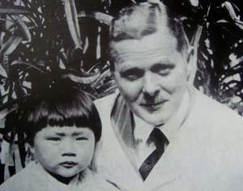

# 1917《內外科看護學》數位典藏電子書

  
  
原著者：戴仁壽 醫師 (Dr. George Gushue-Taylor, 1883–1954)

  
英國皇家外科醫學院院士 (F.R.C.S.)｜台南新樓醫院院長｜台北馬偕紀念醫院院長｜樂山園創辦人

歡迎閱讀由 **戴仁壽醫師（Dr. George Gushue-Taylor）** 主編、陳大鑼先生合編之 **《內外科看護學》（The Principles and Practice of Nursing / Lāi Gōa Kho Khàn-hō͘-ha̍k）** 現代化數位電子書。

---

## 👨‍⚕️ 著者生平與歷史背景

**戴仁壽（George Gushue-Taylor，1883年12月6日－1954年4月23日）** 是一位來自加拿大紐芬蘭的醫療傳教醫師：

- **卓越醫術**：畢業於倫敦醫院醫學院，考取極具威望的英國皇家外科醫師學會院士（F.R.C.S.），曾榮獲婦科與解剖學大獎，被譽為日治時期全台灣學術與臨床醫術最高超的外科名醫之一。
- **編著本書**：1911 年抵達台灣行醫，有感於台灣缺乏本土護理專業人才與教材，於 1917 年在台南新樓醫院任內，與陳大鑼先生合作以**台語白話字（Pe̍h-ōe-jī）**編寫了這部高達 705 頁的巨著《內外科看護學》，成為台灣第一部現代臨床護理與解剖醫學專書。
- **奉獻痲瘋防治**：後轉任台北馬偕紀念醫院院長，並於 1934 年在新北八里創立「樂山園（Happy Mount Colony）」，打破當時官方強制隔離制度，給予病患有尊嚴的自治與自養環境。去世後遺骸歸葬於八里樂山療養院紀念園中。

---

## 🌟 本數位典藏電子書特色

1. **原作者尊崇與三語前言**：完整收錄戴仁壽醫師編撰體例、甘為霖牧師題辭、蘭大衛醫師英文序言、白話字頭序與現代華語三語對照。
2. **正文 40 章逐段對照**：全書 705 頁高精度白話字（POJ）與台語全漢字逐段並列。
3. **475 張醫學插圖完整嵌入**：自動裁切並高解析度還原人體解剖圖、外科器械與包紮繃帶插圖。
4. **醫學語彙辭典 (GÚ-LŪI)**：收錄書末珍貴的台語白話字、台語漢字與英語醫學專用術語三語辭典。
5. **台語典藏最佳化字型**：採用 **Iansui 芫荽體**、**HanaMin**、**Klee One** 與 **Noto Serif TC**，完美呈現白話字調號與漢字。
6. **現代化電子書閱讀體驗**：支援深色模式 (Dark Mode)、手機電腦響應式排版 (RWD)、側邊欄各篇折疊展開 (Collapsible Sidebar)、全文搜尋與目錄導覽。

---

## 📚 目錄導覽

### 📖 前言與凡例
- [英文題辭與序言 (English Preface & Dedication)](00_front_matter/01_english_preface.md)
- [台文頭序 (Thâu-sū)](00_front_matter/02_thau_su.md)
- [目錄與借語凡例 (Chià-gô͘)](00_front_matter/03_contents_and_rules.md)

### 🩺 第一篇 解剖學及生理學 (Kái-phò͘-ha̍k kap Seng-lí-ha̍k)
- [第一章 身軀普通之構造](01_volume_1_anatomy/ch_01_body_structure.md)
- [第二章 骨系統](01_volume_1_anatomy/ch_02_skeletal_system.md)
- [第三章 筋肉系統及關節](01_volume_1_anatomy/ch_03_muscular_and_joints.md)
- [第四章 消化器系統](01_volume_1_anatomy/ch_04_digestive_system.md)
- [第五章 血及血管系統](01_volume_1_anatomy/ch_05_circulatory_system.md)
- [第六章 呼吸器系統](01_volume_1_anatomy/ch_06_respiratory_system.md)
- [第七章 泌尿器系統](01_volume_1_anatomy/ch_07_urinary_system.md)
- [第八章 皮膚](01_volume_1_anatomy/ch_08_skin_system.md)
- [第九章 神經系統](01_volume_1_anatomy/ch_09_nervous_system.md)
- [第十章 五官器](01_volume_1_anatomy/ch_10_sensory_organs.md)

### 🏥 第二篇 普通看護學 (Phó͘-thong Khàn-hō͘-ha̍k)
- 涵蓋第 11 章至第 21 章：看護職責、病室管理、飲食法、水浴、反對刺激、發藥等臨床技術。

### 🔪 第三篇 外科看護學 (Gōa-kho Khàn-hō͘-ha̍k)
- 涵蓋第 22 章至第 31 章：細菌與消毒、創傷、骨折、麻醉手術、繃帶學等外科護理。

### 💊 第四篇 內科看護學 (Lāi-kho Khàn-hō͘-ha̍k)
- 涵蓋第 32 章至第 40 章：各系統內科疾病、傳染病、熱帶醫學、產婦看護與嬰兒護理。

### 📖 附錄
- [三語醫學語彙表 (GÚ-LŪI)](05_glossary/medical_glossary.md)
- [總索引 (SEK-ÍN)](06_index/general_index.md)

---
*數位典藏建置年份：2026 年 @Tō͘ Sìn-liông*
