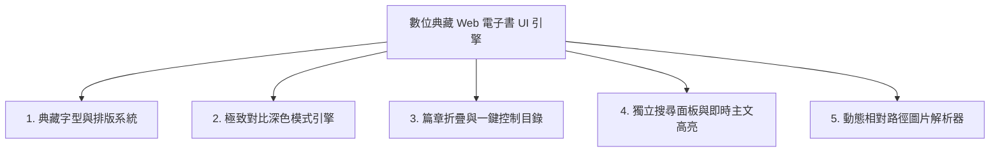

# 📚 Digital Archive Web eBook UI Architecture (數位典藏電子書 UI 核心架構)

本 Skill 封裝了在多語古籍、白話字文獻與圖文醫療典籍數位化專案中所沉澱出的**現代化 Web 電子書前端架構**。適用於 Docsify 或靜態 Markdown 電子書專案，具備高對比深色模式、專業排版字型棧、可折疊章節目錄、即時關鍵字主文高亮與智慧路徑防破圖機制。

---

## 🏗️ 五大核心子系統架構



---

### 1. 🔤 典藏字型與音標防缺字排版系統 (Typography & Diacritics)

解決多語古籍（如台語白話字、拉丁音標、古漢字）在不同裝置上的缺字、調號跑位與排版問題：

```css
/* 1. 內嵌傳統漢字字型 (以 Iansui 芫荽體為例) */
@font-face {
  font-family: 'Iansui';
  src: url('assets/fonts/Iansui-Regular.ttf') format('truetype'),
       url('https://cdn.jsdelivr.net/gh/ButTaiwan/iansui@main/fonts/ttf/Iansui-Regular.ttf') format('truetype');
  font-weight: normal;
  font-style: normal;
  font-display: swap;
}

/* 2. POJ 羅馬字音標與調號安全防護 (覆蓋 Basic Latin, Latin-1, Ext-A/B, Diacritics, Superscripts) */
@font-face {
  font-family: 'POJ-Fallback';
  src: local('-apple-system'), local('Roboto'), local('Segoe UI'), local('Arial'), local('Helvetica Neue');
  unicode-range: U+0020-007F, U+00A0-024F, U+0300-036F, U+2070-209F;
}

/* 3. 最佳字型優先棧 (Font Stack) */
:root {
  --font-zh: 'POJ-Fallback', 'Iansui', 'Klee One', 'HanaMin', 'Noto Serif TC', -apple-system, BlinkMacSystemFont, 'Segoe UI', Roboto, 'Helvetica Neue', Arial, sans-serif;
  --font-en: 'POJ-Fallback', 'Roboto', -apple-system, BlinkMacSystemFont, 'Segoe UI', 'Helvetica Neue', Arial, sans-serif;
}
```

---

### 2. 🌓 極致對比深色模式引擎 (Ultra-High Contrast Dark Mode)

徹底根除 Docsify 預設樣式在深色模式下的暗灰暗沈問題（包含段落、引言框、圖題與表格交錯斑馬紋）：

```javascript
// LocalStorage 記憶 + 系統 OS (prefers-color-scheme) 智慧偵測
function initTheme() {
  const savedTheme = localStorage.getItem('site_theme');
  const prefersDark = window.matchMedia && window.matchMedia('(prefers-color-scheme: dark)').matches;
  const currentTheme = savedTheme || (prefersDark ? 'dark' : 'light');
  document.documentElement.setAttribute('data-theme', currentTheme);
  updateToggleBtn(currentTheme);
}
```

```css
/* 深色模式變數與全元素強制覆寫 */
[data-theme="dark"] {
  --bg-primary: #0b0f19;
  --bg-secondary: #131b2e;
  --bg-sidebar: #111827;
  --text-primary: #ffffff;
  --text-secondary: #f3f4f6;
  --border-color: #374151;
  --blockquote-bg: #131c2e;
  --blockquote-border: #2dd4bf;
}

[data-theme="dark"] .markdown-section p,
[data-theme="dark"] .markdown-section li,
[data-theme="dark"] .markdown-section span {
  color: #f8fafc !important;
}

[data-theme="dark"] .markdown-section blockquote {
  background-color: #111b2b !important;
  border-left: 4.5px solid #2dd4bf !important;
  color: #ffffff !important;
}

/* 表格超清晰交錯斑馬紋 (Zebra Striping) */
[data-theme="dark"] .markdown-section table tr:nth-child(odd) {
  background-color: #0e1726 !important;
}
[data-theme="dark"] .markdown-section table tr:nth-child(even) {
  background-color: #1e293b !important;
}
[data-theme="dark"] .markdown-section table td {
  color: #ffffff !important;
}
```

---

### 3. 📂 可折疊側邊目錄與一鍵控制工具列 (Collapsible Sidebar & 1-Click Action)

解決長篇名文字被截斷、支援目錄層級收合與一鍵展開：

```css
/* 寬側邊欄 (360px) 與自動換行，防止音標/長標題被邊框截斷 */
.sidebar {
  width: 360px !important;
  font-family: var(--font-zh) !important;
}
.sidebar ul li a {
  white-space: normal !important;
  word-break: break-word !important;
  line-height: 1.55;
}
.content {
  left: 360px !important;
}
/* 11px 加粗高對比滑桿 (Scrollbar) */
.sidebar::-webkit-scrollbar, body::-webkit-scrollbar {
  width: 11px !important;
}
.sidebar::-webkit-scrollbar-thumb {
  background: #94a3b8 !important;
  border-radius: 6px;
}
[data-theme="dark"] .sidebar::-webkit-scrollbar-thumb {
  background: #64748b !important;
}
```

```javascript
// 一鍵全部展開 / 全部收合核心邏輯
let isAllExpanded = false;
function toggleAllSidebarChapters() {
  isAllExpanded = !isAllExpanded;
  document.querySelectorAll('.sidebar-nav li').forEach(li => {
    if (li.querySelector('ul')) {
      li.classList.toggle('open', isAllExpanded);
      li.classList.toggle('collapse', !isAllExpanded);
    }
  });
  document.getElementById('collapse-text').textContent = isAllExpanded ? '一鍵全部收合' : '一鍵全部展開';
  document.getElementById('collapse-icon').textContent = isAllExpanded ? '📁' : '📂';
}
```

---

### 4. 🔍 智慧即時搜尋與主畫面高亮反白 (Smart Search & In-Content Highlighting)

搜尋結果以獨立懸浮面板呈現（不破壞原本的章節目錄樹），點擊跳轉後在正文中自動高亮反白關鍵字並平滑滾動至目標處：

```javascript
// 結合 mark.js 實現正文即時關鍵字高亮反白
function applyKeywordHighlight() {
  const query = (document.querySelector('.sidebar .search input')?.value || '').trim();
  const content = document.querySelector('.markdown-section');
  if (content && typeof Mark !== 'undefined') {
    const markInstance = new Mark(content);
    markInstance.unmark({
      done: function() {
        if (query.length >= 1) {
          markInstance.mark(query, {
            className: 'search-keyword-highlight',
            separateWordSearch: false,
            acrossElements: true,
            done: function() {
              const firstMatch = document.querySelector('.search-keyword-highlight');
              if (firstMatch) firstMatch.scrollIntoView({ behavior: 'smooth', block: 'center' });
            }
          });
        }
      }
    });
  }
}
```

```css
/* 主畫面反白樣式 (淺色鵝黃 / 深色琥珀) */
mark.search-keyword-highlight {
  background-color: #fef08a !important;
  color: #1e293b !important;
  padding: 2px 4px !important;
  border-radius: 3px !important;
  border-bottom: 2px solid #eab308 !important;
}
[data-theme="dark"] mark.search-keyword-highlight {
  background-color: #ca8a04 !important;
  color: #0b0f19 !important;
  border-bottom: 2px solid #facc15 !important;
}
```

---

### 5. 🖼️ 動態相對路徑圖片解析器 (Bulletproof Image Resolver)

解決 Docsify 在 GitHub Pages 次級子目錄路由（`/#/...`）下相對路徑圖片 404 破圖的難題：

```javascript
// Docsify 插件：自動將 assets/ 轉換為全域絕對基礎路徑
hook.afterEach(function(html, next) {
  var basePath = window.location.pathname.replace(/\/$/, '');
  var tempDiv = document.createElement('div');
  tempDiv.innerHTML = html;
  
  tempDiv.querySelectorAll('img').forEach(function(img) {
    var src = img.getAttribute('src');
    if (src && src.indexOf('assets/illustrations/') !== -1 && !src.startsWith('http')) {
      var filename = src.substring(src.indexOf('assets/illustrations/'));
      img.src = basePath + '/' + filename;
    }
  });
  next(tempDiv.innerHTML);
});
```

---

## 🎯 快速重用方式

當需要在新專案中啟用本 UI 架構時，只需將本專案 `src/build_book.py` 內的 `INDEX_HTML_TEMPLATE` 模板複製至新專案的電子書組裝腳本中即可！
